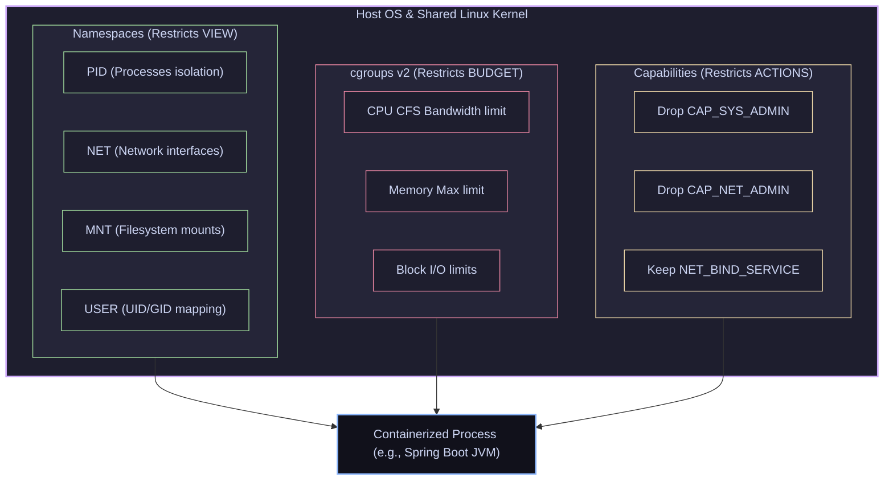

# 01 — What a Container *Really* Is: Namespaces, Cgroups & Capabilities

> **Why this is Topic 1:** In interviews, candidates often state that "a container is a lightweight VM." This is an immediate red flag for senior (SDE2+) engineering roles. There is no hypervisor, no guest operating system, and no virtual hardware. A container is a standard Linux process running directly on the host's kernel. What makes it *feel* like a VM is that the OS kernel restricts what the process can **see** (via namespaces) and restricts what resources it can **consume** (via cgroups). Understanding these low-level Linux primitives is fundamental to solving container escapes, debugging cgroup OOMs, and designing secure, high-performance containerized systems.

---

## 1. WHAT

At the Linux kernel level, a container does not exist as a first-class object. Instead, a container is a standard user space process isolated by three kernel-level mechanisms:

1. **Namespaces:** Restrict what a process can **see**. They provide virtualized views of system resources (such as process IDs, network interfaces, and mounts).
2. **Control Groups (cgroups):** Restrict what a process can **use**. They meter and limit resource consumption (such as CPU, RAM, and Disk I/O).
3. **Capabilities:** Restrict what a process can **do**. They break down the omnipotent privileges of the `root` user into small, granular permissions (like binding to a privileged port or altering routing tables).



---

## 2. WHY (the trade-offs)

Understanding the architectural differences between Virtual Machines (Hypervisor-based) and Containers (Kernel-shared) is critical to justifying your infrastructure choices.

### 2.1 VM vs. Container Comparative Analysis

| Feature | Virtual Machine (VM) | Container |
| :--- | :--- | :--- |
| **Virtualization Level** | **Hardware level:** Hypervisor emulates virtual CPU, RAM, and NICs. | **OS level:** Shares the host kernel; processes isolated via software constraints. |
| **Guest OS** | **Required:** Each VM runs its own guest OS kernel (adds 500MB+ RAM overhead). | **None:** Shares host kernel (0MB overhead, only app processes consume RAM). |
| **Startup Time** | **Seconds to Minutes:** Must boot kernel, run systemd, mount filesystems. | **Milliseconds:** Just the time it takes to fork a standard Linux process. |
| **Isolation Strength** | **High:** Hard hardware boundary (VTx/AMD-v instructions). Kernel crash inside VM doesn't impact host. | **Medium-Low:** Shared kernel. A kernel exploit (e.g., Dirty COW) can crash or compromise the entire host. |
| **Resource Efficiency** | **Low:** Resources pre-allocated/reserved. Heavy disk size due to complete OS images. | **High:** Dynamic allocation. Tiny images (distroless/alpine) containing only the application binary. |
| **Performance** | **I/O Penalty:** Virtualized disk/network drivers introduce translation latency. | **Native:** Runs directly on host hardware; bare-metal speed network and disk throughput. |

---

## 3. HOW (the internals)

To master containers, we must look under the hood at the system calls and kernel interfaces that construct them.

### 3.1 Kernel Namespaces: The Isolation Walls

The Linux kernel exposes 8 namespaces (7 of which are critical for containers). When Docker runs a container, it requests a new set of these namespaces for the process.

1. **`pid` (Process IDs):** Provides process isolation. Inside the namespace, the containerized process runs as PID 1 (handling signals like a system initialization process). On the host, the process has a standard high PID (e.g., PID 28430).
2. **`net` (Networking):** Isolates network devices, IP routing tables, firewall rules, and port bindings. The container gets its own virtual loopback (`lo`) and virtual ethernet adapter (`eth0`).
3. **`mnt` (Mount):** Isolates filesystem mount points. The process cannot see the host's root filesystem; it only sees the rootfs mounted inside its namespace (usually via `pivot_root`).
4. **`uts` (UNIX Timesharing System):** Isolates hostnames and NIS domain names. Allows the container to declare `hostname web-pod-3` without modifying the host's hostname.
5. **`ipc` (Interprocess Communication):** Isolates POSIX message queues, System V IPC, and shared memory segments. Prevents processes in container A from reading the memory segments of container B.
6. **`user` (User IDs):** Maps UIDs and GIDs. Maps UID 0 (root) inside the container to an unprivileged UID (e.g., UID 10001) on the host. If the container process is compromised, the attacker only has unprivileged access on the host.
7. **`cgroup` (Control Group View):** Prevents the process from seeing the full host cgroup tree; it only sees the portion of the cgroup tree allocated to itself.

#### The Magic System Calls:
When `runc` (the container runtime) launches a container, it invokes three fundamental system calls:
*   **`clone(..., flags)`:** Creates a child process like `fork()`, but accepts flags specifying which namespaces to create (e.g., `CLONE_NEWPID | CLONE_NEWNET | CLONE_NEWNS`).
*   **`unshare(flags)`:** Detaches the current process from its inherited host namespaces, creating new ones.
*   **`setns(fd, nstype)`:** Joins an existing namespace. This is the system call used by `docker exec` to inject your shell process into a running container's namespace.

---

### 3.2 Control Groups (cgroups v2): The Budget Constraints

While namespaces hide other processes, they don't stop a process from consuming 100% of the host's memory or CPU. Control Groups (cgroups) manage resource allocation. 

Cgroups v2 (introduced in Linux 4.5 and default in modern Kubernetes/Docker) replaced the chaotic multi-hierarchy v1 with a unified hierarchy. All controllers (CPU, Memory, I/O, PIDs) are attached to a single tree structure located in `/sys/fs/cgroup/`.

```
/sys/fs/cgroup/
├── cgroup.procs (processes in root cgroup)
├── cgroup.subtree_control (enables controllers for children)
└── kubepods.slice/
    ├── kubepods-burstable.slice/
    │   └── pod_abc-123/
    │       ├── container_app/
    │       │   ├── cgroup.procs (PID of your JVM process)
    │       │   ├── memory.max (Hard limit - e.g., 2GB)
    │       │   ├── memory.current (Current usage in bytes)
    │       │   └── cpu.max (CFS bandwidth limit - e.g., 2 cores)
```

#### How Memory Limits work (and why OOM occurs):
1. **`memory.min` (hard guarantee) vs `memory.low` (soft):** Both are reclaim *protections*, but they behave differently. `memory.min` is a **hard** guarantee — memory up to this amount is **never reclaimed**, even under host pressure; if honoring it would starve the system, the kernel invokes the OOM killer instead of reclaiming. `memory.low` is **best-effort/soft** — the kernel avoids reclaiming below it, but *will* reclaim under real pressure rather than OOM-kill.
2. **`memory.max`:** The hard ceiling. If your process requests memory exceeding this limit, the kernel first tries to reclaim reclaimable memory (like page cache pages) within the cgroup. If no pages can be reclaimed, the kernel invokes the **OOM (Out of Memory) Killer**.
3. **OOM Killing:** The kernel selects the process with the highest `oom_score` inside the cgroup and sends a `SIGKILL` (Exit Code 137). Because the cgroup is isolated, it kills the containerized process without impacting the host or other pods.

#### How CPU Limits work (and why CPU throttling occurs):
CPU is managed via the **Completely Fair Scheduler (CFS) bandwidth control**:
*   CPU limits are specified in terms of quotas over a period (usually 100 milliseconds).
*   If you set a container limit to `2.0 CPUs`, the kernel writes `200000 100000` to `cpu.max` (meaning 200,000 microseconds of CPU execution time allowed per 100,000 microsecond period).
*   If your application uses up the 200ms quota within the first 30ms of the window (e.g., using multi-threading), the kernel **throttles** (suspends) your process for the remaining 70ms. This causes dramatic latency spikes in web applications.

---

### 3.3 Linux Capabilities: De-rooting Root

Historically, Linux had a binary privilege system: you were either standard user (UID > 0) or root (UID == 0). If a web server needed to bind to port 80, it had to run as root, meaning a single exploit gave the attacker control of the entire system.

Linux **Capabilities** split root privileges into ~40 independent, boolean flags. Docker does **not** drop *almost all* of them by default — it keeps a fixed **allow-list of 14 capabilities** and drops the rest (~27). The default retained set is: `CHOWN`, `DAC_OVERRIDE`, `FOWNER`, `FSETID`, `KILL`, `SETGID`, `SETUID`, `SETPCAP`, `NET_BIND_SERVICE`, `NET_RAW`, `SYS_CHROOT`, `MKNOD`, `AUDIT_WRITE`, `SETFCAP`. Everything dangerous (`SYS_ADMIN`, `NET_ADMIN`, `SYS_MODULE`, `SYS_PTRACE`, …) is dropped. You can tighten further with `--cap-drop=ALL --cap-add=<needed>`.

#### Critical Capabilities:
*   `CAP_NET_BIND_SERVICE`: Allows binding to ports < 1024.
*   `CAP_NET_ADMIN`: Allows configuring network interfaces (used by VPN containers or CNIs). **Dropped by default.**
*   `CAP_SYS_ADMIN`: The "new root" cap. Allows mount/unmount operations, loading kernel modules, etc. **Dropped by default.**
*   `CAP_CHOWN`: Allows changing file owner.

Running containers without `--privileged` and dropping capabilities **substantially reduces** the risk of escape — but it is not a guarantee. Container-root is still **UID 0 on the host** unless you enable a user namespace; a kernel bug, a careless bind-mount (e.g. mounting `/` or the Docker socket), or a retained dangerous capability can still let a compromised container break out. Defense-in-depth (capabilities + seccomp + LSM + user namespaces) is what shrinks the blast radius, not any single control.

---

### 3.4 Seccomp & LSMs: The Rest of the Security Model

Capabilities gate *which privileged operations* a process may perform, but they don't restrict the **syscall surface** itself, nor do they enforce *mandatory* access policies. Two more layers complete Docker's default security model.

#### Seccomp (Secure Computing Mode) — the syscall firewall:
Seccomp-bpf filters the system calls a process is allowed to make. Docker ships a **default seccomp profile** that whitelists ~300+ syscalls and **blocks ~44 dangerous ones** (e.g. `keyctl`, `kexec_load`, `mount`, `unshare`/`clone` of new user namespaces, `bpf`, `reboot`, `ptrace` in older kernels, `add_key`). Even if a process holds `CAP_SYS_ADMIN`, seccomp can still forbid the syscall it would use — the two controls are complementary. A blocked syscall returns `EPERM` (or kills the process, depending on the action). Running `--security-opt seccomp=unconfined` disables this and is a common cause of "works on my machine, breaks in prod" for low-level tooling.

#### AppArmor & SELinux — Linux Security Modules (LSM / MAC):
These enforce **Mandatory Access Control**: the kernel checks every access against an admin-defined policy that even root cannot override.
*   **AppArmor** (Debian/Ubuntu) — **path-based** profiles. Docker applies a default `docker-default` profile that confines file paths, mounts, and raw network access. Profiles are loaded per-container.
*   **SELinux** (RHEL/Fedora/CentOS) — **label-based** (type enforcement + Multi-Category Security). Docker assigns each container a unique MCS category so container A's process is labeled such that it cannot touch container B's files even if UNIX permissions would otherwise allow it.

**How they stack:** a syscall from a containerized process must pass **all** gates — the seccomp filter, the capability check, *and* the LSM policy — before the kernel executes it. This layered model (namespaces + cgroups + capabilities + seccomp + LSM + optional user namespaces) is what people mean by "container isolation is defense-in-depth."

---

## 4. CODE / EXAMPLES

Let's build a container from scratch using low-level Linux tools to make these concepts concrete.

### 4.1 Creating a Container from Scratch (Shell Walkthrough)

> [!NOTE]
> This requires root privileges on a Linux host (or inside a Linux VM).

Run the following commands to create an isolated jail using only standard Linux commands:

```bash
# 1. Create a clean rootfs directory structures
export CONTAINER_DIR="/tmp/mini-container"
mkdir -p $CONTAINER_DIR/rootfs

# 2. Extract an Alpine root filesystem (contains bin, sbin, etc.)
# We download the mini-rootfs tarball
curl -sSL https://dl-cdn.alpinelinux.org/alpine/v3.18/releases/x86_64/alpine-minirootfs-3.18.4-x86_64.tar.gz -o /tmp/alpine.tar.gz
tar -xzf /tmp/alpine.tar.gz -C $CONTAINER_DIR/rootfs/

# 3. Use 'unshare' to spawn a shell in new namespaces:
# -m: Mount namespace
# -u: UTS namespace (hostname)
# -i: IPC namespace
# -p: PID namespace (forks a new process to act as PID 1)
# -f: Fork to ensure the new PID namespace takes effect
sudo unshare -m -u -i -p -f chroot $CONTAINER_DIR/rootfs /bin/sh
```

Now you are inside the container shell. Let's verify the isolation:

```sh
# Inside the container:
# 1. Change the hostname (UTS Namespace)
hostname container-demo
hostname
# Output: container-demo (If you check on the host, the host hostname is unchanged!)

# 2. Check mounts & process tree
mount -t proc proc /proc
ps aux
# Output:
# PID   USER     TIME  COMMAND
#   1   root      0:00 /bin/sh
#   2   root      0:00 ps aux
# Notice you cannot see any host processes!
```

---

### 4.2 Restricting Memory via cgroups v2 Manually

Let's see how the Linux kernel imposes memory limits. Run this on your host machine in another terminal:

```bash
# 1. Create a new cgroup v2 group directory under the unified hierarchy
# Creating the directory triggers the kernel to populate it with controller files!
sudo mkdir -p /sys/fs/cgroup/demo-limit

# 2. Configure a hard limit of 50 Megabytes (in bytes)
echo 52428800 | sudo tee /sys/fs/cgroup/demo-limit/memory.max

# 3. Open a shell that we will restrict
sh
export SH_PID=$$

# 4. Attach this shell process to our cgroup budget limit
echo $SH_PID | sudo tee /sys/fs/cgroup/demo-limit/cgroup.procs

# 5. Inside that restricted shell, run a command that tries to consume 100MB of RAM
# We'll use dd to read 100MB into memory
dd if=/dev/zero of=/dev/null bs=1M count=100
# Output: Killed (or OOM terminated!)
# If you run 'dmesg -T | grep -i oom', you'll see the kernel terminated the process 
# because it crossed the 50MB cgroup limit!
```

---

### 4.3 Auditing Namespaces and Capabilities

To see what namespaces and capabilities a running process has:

```bash
# Get the PID of a running process (e.g., a Docker container process)
export TARGET_PID=$(docker inspect --format '{{.State.Pid}}' my-nginx-container)

# 1. View namespace symlinks in /proc
ls -l /proc/$TARGET_PID/ns/
# Output shows symbolic links pointing to kernel namespace IDs:
# mnt -> mnt:[4026532252]
# net -> net:[4026532255]
# pid -> pid:[4026532253]

# 2. Audit Capabilities using getpcaps
getpcaps $TARGET_PID
# Output lists the default allow-list of 14 capabilities:
# Capabilities for `12345`: = cap_chown,cap_dac_override,cap_fowner,cap_fsetid,cap_kill,cap_setgid,cap_setuid,cap_setpcap,cap_net_bind_service,cap_net_raw,cap_sys_chroot,cap_mknod,cap_audit_write,cap_setfcap+eip
# (Notice CAP_SYS_ADMIN and CAP_NET_ADMIN are absent — dropped by default)
```

---

## 5. INTERVIEW ANGLES

### Q: Since containers share the host kernel, what happens if a containerized application executes a kernel panic?
**A:** If an application inside a container executes code that triggers a kernel panic (e.g., triggering a null-pointer dereference inside a device driver or loading a faulty kernel module), the **entire host machine crashes**, taking down every other container running on that host. Because there is no hypervisor layer to isolate the kernel space, a kernel failure is absolute. This is why untrusted multi-tenant workloads are usually isolated with a stronger boundary rather than standard containers — either **microVMs** that add a hardware-virtualization layer (AWS **Firecracker**, **Kata Containers**), or a **userspace application kernel** like Google **gVisor**, whose *Sentry* intercepts guest syscalls in userspace so they never reach the host kernel directly. (Note: gVisor is *not* a microVM — it uses no hardware virtualization; see Topic 03.)

### Q: Walk me through what happens under the hood when I run `docker run nginx`.
**A:** 
1. The **Docker CLI** translates the command into an API request and sends it to the **Docker Daemon** (via UNIX socket or TCP).
2. The daemon pulls the image from the registry if not cached locally, creates an OCI runtime configuration JSON, and passes it to **containerd**.
3. `containerd` spawns **containerd-shim**, which acts as a supervisor for the container process (to keep stdout/stderr open even if containerd restarts).
4. `containerd-shim` invokes **runc** (the low-level OCI runtime reference implementation).
5. `runc` performs the kernel system calls:
   * It calls `clone()` with namespaces flags (`CLONE_NEWPID`, etc.) to create a child process.
   * It creates a cgroup directory (e.g., `/sys/fs/cgroup/docker/<container-id>`) and writes the child's PID into `cgroup.procs`.
   * It writes the resource configurations (memory limits, CPU quotas) into cgroup control files.
   * Inside the child process, it calls `pivot_root` to swap the host root directory with the container rootfs.
   * It drops unnecessary Linux capabilities.
   * It calls `execve()` to execute the container entrypoint (e.g., `/usr/sbin/nginx`), replacing the runc process with the containerized application.

### Q: Why does a container running a Java (JVM) application sometimes get OOMKilled even though the JVM Heap (-Xmx) is set below the container memory limit?
**A:** The JVM's memory consumption is not restricted to the Java Heap. The container memory limit (configured via cgroup `memory.max`) measures the **Resident Set Size (RSS)** of the entire OS process.
RSS includes:
1. **JVM Heap** (configured by `-Xmx`).
2. **Off-heap memory:** Metaspace (class definitions), Thread stacks (1MB per thread by default), Direct Byte Buffers (NIO), Code Cache, and garbage collector overhead.
3. **C Library Overhead:** Memory allocations by native code (e.g., decompression libraries).
If you set your cgroup memory limit to 1GB, and you set `-Xmx800m`, the off-heap allocations can easily exceed 200MB, pushing total RSS beyond 1GB. The kernel cgroup manager will immediately invoke the OOM Killer and terminate the JVM.
*(To resolve this, set `-XX:MaxRAMPercentage` instead of hardcoding `-Xmx` so the JVM dynamically senses cgroups, and leave a 25-30% buffer for off-heap allocations).*

### Q: What is the user namespace, and why isn't it enabled by default in most Kubernetes setups?
**A:** The user namespace allows mapping UID ranges. For example, a process running as UID 0 (root) inside the container is mapped to UID 10001 (a standard unprivileged user) on the host. If an attacker escapes the container, they have no root privileges on the host filesystem.
**Why it isn't enabled by default:** User namespace mappings break filesystem permissions on shared storage. If a container writes to a persistent volume (PV) mounted on the host as UID 0 (mapped to 10001), and another container without user namespace mounts it, permissions mismatch. Managing UID mapping offsets across distributed clusters, CSI storage drivers, and various Linux distros introduces severe operational complexity.

---

## 6. ONE-LINE RECALL CARDS

*   **A container is a process** constrained by namespaces (views), cgroups (resource budgets), and capabilities (permissions).
*   **Hypervisors virtualize hardware**, whereas containers virtualize the host operating system kernel.
*   **`clone()`** is the system call used to spawn a child process inside new namespaces (`CLONE_NEWPID`, `CLONE_NEWNET`, etc.).
*   **`pivot_root`** changes the root filesystem of the calling process mount namespace, isolating it from the host filesystem.
*   **cgroups v2** organizes all system controllers in a unified hierarchy located under `/sys/fs/cgroup/`.
*   **`memory.max`** sets the absolute memory limit; exceeding it triggers the kernel's cgroup-specific **OOM Killer** (`SIGKILL`).
*   **CPU Throttling** occurs when a multi-threaded process exhausts its CFS bandwidth quota (`cpu.max`) before the end of the 100ms period.
*   **Linux Capabilities** fragment root powers into ~40 flags; Docker keeps a **default allow-list of 14** (CHOWN, DAC_OVERRIDE, NET_BIND_SERVICE, NET_RAW, SETUID/GID, …) and drops the rest (~27, including SYS_ADMIN/NET_ADMIN).
*   **Seccomp** filters the *syscall* surface — Docker's default profile blocks ~44 dangerous syscalls (keyctl, mount, kexec_load, bpf, …); it stacks with capabilities, not replaces them.
*   **AppArmor (path-based) / SELinux (label-based)** are LSMs enforcing Mandatory Access Control; a syscall must pass seccomp **and** capabilities **and** the LSM policy — container isolation is defense-in-depth, not one control.
*   **Container-root is host UID 0** without a user namespace — dropping caps reduces escape risk but does not guarantee prevention (kernel bugs / bad bind-mounts still escape).
*   **`setns()`** allows an external process to inject itself into a running container's namespaces (used by `docker exec`).
*   **JVM OOMKills** occur because cgroup limits evaluate total process **Resident Set Size (RSS)**, which includes Heap + massive Off-Heap memory.

---

**Next:** [02 — Images & Layers](02-images-layers-overlayfs.md) (OverlayFS union mounts, layer caching, Dockerfile build internals, multi-stage & distroless).
