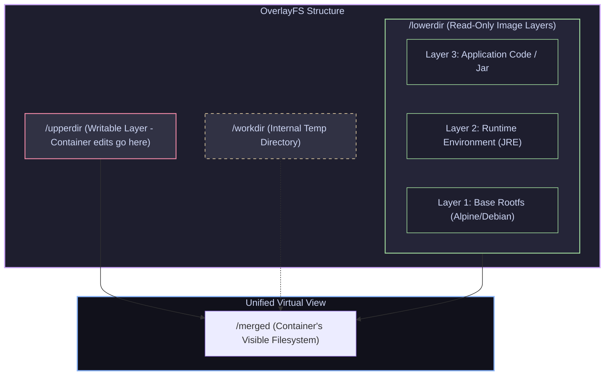

# 02 — Images & Layers: OverlayFS, Caching & Multi-Stage Builds

> **Why this is Topic 2:** When shipping Spring Boot microservices, building small, secure, and fast-caching Docker images is essential. If you don't understand how image layers work, a 1-line code change can trigger a rebuild that pulls down all Gradle/Maven dependencies again, ballooning build times and clogging CI/CD runners. Moreover, deploying raw JDK images in production creates massive image footprints (800MB+) loaded with security vulnerabilities. This note explores **OverlayFS** (the storage driver that makes image layers possible), how cache invalidation behaves, and how to construct optimized, hardened production images using multi-stage and distroless methods.

---

## 1. WHAT

A Docker image is not a single archive file, nor is it a VM disk. An image is a **manifest file** (JSON metadata) pointing to a stack of independent, content-addressable **read-only layer tarballs**.

When you launch a container, the Docker engine overlays these read-only image layers on top of each other, mounts a temporary **writable layer** on the very top, and presents them as a single, unified filesystem to the process. This magic is performed by **Union Filesystems**, with **OverlayFS** being the Linux standard.



---

## 2. WHY (the trade-offs)

Monolithic disk images (like VM `.vmdk` or `.raw` files) require duplicate storage and network copying for every instance. Union mounting changes this equation.

### 2.1 Monolithic vs. Layered Images

| Feature | Monolithic Disk Images (VMs) | Layered Union Images (Containers) |
| :--- | :--- | :--- |
| **Disk Overhead** | **High:** Spawning 10 VMs from the same base OS duplicates the OS files 10 times. | **Zero:** Spawning 100 containers from one base image uses only one copy of the base layers. |
| **Network Speed** | **Slow:** Shipping updates requires copying/moving gigabytes of VM images. | **Fast:** Only modified layers (deltas) are pushed/pulled over the network. |
| **Write Performance** | **Direct:** Writes go directly to the virtual disk file with high throughput. | **Copy-on-Write cost:** Modifying a large file in a lower layer requires copying it to the top layer first. |
| **State Lifespan** | **Persistent:** VM disk modifications survive reboot by default. | **Ephemeral:** Top writable layer is destroyed when the container is deleted. |

### 2.2 Base Image Strategies: Alpine vs. Distroless

| Image Strategy | Alpine Linux (`alpine`) | Distroless (`gcr.io/distroless/*`) |
| :--- | :--- | :--- |
| **Image Size** | **Small** (~5-10MB base). | **Minimal runtime footprint:** No shell or package manager; Java distroless images are larger because they include a JRE. |
| **Shell/Utilities** | **Yes:** Contains `ash`, `sh`, and busybox command-line utilities. | **No:** Completely lacks `sh`, `bash`, `ls`, `grep`, or `apk` package managers. |
| **Security Surface** | **Low:** Minimal package footprint, but shells can be abused if compromised. | **Minimum:** Almost zero attack surface (nothing to run script exploits). |
| **Debugging** | **Easy:** Can run `docker exec -it sh` to inspect state. | **Hard:** Requires ephemeral debug containers (e.g., `kubectl debug`). |
| **Standard C Library** | Uses **musl libc** (can cause JVM/C-bindings compatibility issues). | Uses **glibc** (industry-standard, native Java compatibility). |

---

## 3. HOW (the internals)

Let's dissect how OverlayFS manages files, writes, and deletions behind the scenes, and how the builder handles layer caching.

### 3.1 OverlayFS Union Directories

OverlayFS mounts multiple directories into a single view. The key components are:
*   **`lowerdir`:** A colon-separated list of read-only directories (e.g., `lower1:lower2:lower3`). The rightmost directory is the lowest. If a file exists in multiple layers, the upper one hides the lower one.
*   **`upperdir`:** The writable directory. When a container runs, any *new* files or *modifications* to existing files are stored here.
*   **`merged`:** The virtual mount point. This is the mount exposed to the containerized process as `/`.
*   **`workdir`:** An empty scratch directory used internally by the kernel for filesystem operations (like atomic file renames) before moving them to the `upperdir`.

#### Copy-on-Write (CoW) Mechanism:
When a container starts, `/upperdir` is empty. 
*   If the process **reads** a file (e.g., `/etc/nginx/nginx.conf`), OverlayFS looks it up in `/upperdir`. If not found, it scans `/lowerdir` from top to bottom, reads the file directly from the first image layer that contains it, and caches it in page memory.
*   If the process **modifies** that file, the kernel performs a **Copy-up**: it copies the entire file from `/lowerdir` into `/upperdir` first, and then executes the write transaction on the copy in `/upperdir`. Future reads of this file bypass `/lowerdir` entirely.
*   *Key Warning:* Attempting to modify a massive file (e.g., a 10GB database file) stored in a lower image layer will cause a massive I/O pause while the kernel duplicates the 10GB file up to `/upperdir`.

#### Whiteout Files (Deletions):
Because image layers are read-only, a running container cannot physically delete a file stored in `lowerdir`. 
*   If a process deletes `/etc/nginx/nginx.conf`, the kernel creates a **whiteout file** in the corresponding location inside `/upperdir`. 
*   A whiteout file is a special character device file with major/minor number `0/0`. 
*   When OverlayFS builds the `/merged` view, it sees this whiteout file in `/upperdir` and hides the target file from the process, making it appear deleted.
*   *Key Consequence:* Deleting files in a running container does **not** free up host disk space consumed by the base image layers.

---

### 3.2 Docker Build Cache Invalidation Rules

When executing a `Dockerfile`, the builder executes instructions sequentially. Each instruction creates a new cached layer. The builder decides whether to use a cached layer or rebuild using these rules:

1.  **Command Equality:** For commands like `RUN apt-get install -y curl`, the builder checks if the command string matches exactly. If it does, it uses the cached layer.
2.  **`COPY` and `ADD` File Hashing:** For `COPY src/ /app/`, command matching is insufficient. The builder calculates a **content hash** for all files inside the source directory. If the hash matches the cached layer's recorded hash, it is a hit. (File metadata like modification timestamps are ignored).
3.  **Invalidation Cascade:** Once a layer cache is invalidated, **every subsequent instruction in the Dockerfile is executed from scratch**, completely bypassing the cache.

> The rules above describe the **legacy sequential builder** (the classic `docker build` engine that walked the Dockerfile top-to-bottom, one layer at a time). Modern Docker replaced it with BuildKit.

### 3.3 BuildKit: The Modern Builder

Since **Docker 23.0** (early 2023) **BuildKit is the default builder** (`docker buildx`), and it fundamentally changes the model described above:

*   **Parallel DAG build:** BuildKit parses the whole Dockerfile into a **directed acyclic graph** of dependencies rather than a linear list. Independent stages (e.g. two `FROM ... AS x` stages that don't depend on each other) build **in parallel**, and stages not needed for the final target are skipped entirely.
*   **Content-addressed cache:** Cache keys are derived from the actual **content** of inputs (files, build args, command output), not just instruction position, and cache can be exported/imported (`--cache-from` / `--cache-to`) to share across CI runners and registries. This makes the "invalidation cascade" far less punishing — unrelated branches of the DAG stay cached.
*   **`RUN --mount=type=cache`:** A build-time cache mount that **persists across builds without landing in any image layer**. For Java this is huge — mount the Maven/Gradle cache so dependencies survive rebuilds even when `pom.xml`/`build.gradle` *does* change:
    ```dockerfile
    RUN --mount=type=cache,target=/root/.gradle ./gradlew bootJar --no-daemon
    ```
    (Also `--mount=type=secret` for build secrets, and `--mount=type=bind`.)
*   **Smarter `.dockerignore` handling:** BuildKit only transfers the build-context files a stage actually references, so a large ignored `.git`/`build/` directory no longer bloats the context sent to the daemon.
*   **Multi-arch manifest lists:** `docker buildx build --platform linux/amd64,linux/arm64 -t img:tag --push .` builds both architectures and publishes a single **manifest list** (a "fat manifest") — one tag from which each node pulls the image matching its CPU architecture (relevant for Graviton/Apple-silicon fleets).

---

## 4. CODE / EXAMPLES

### 4.1 Mounting an OverlayFS Manually

Let's mimic Docker's filesystem mounting on a Linux host to see how `lowerdir`, `upperdir`, and `merged` interact.

```bash
# 1. Create target test directories
mkdir -p /tmp/overlay-test/{lower,upper,work,merged}

# 2. Create some files in the read-only 'lower' layer
echo "Hello from lower layer" > /tmp/overlay-test/lower/lower-file.txt
echo "Original config" > /tmp/overlay-test/lower/config.txt

# 3. Mount the directories as OverlayFS
# -o lowerdir=...,upperdir=...,workdir=...
sudo mount -t overlay overlay \
  -o lowerdir=/tmp/overlay-test/lower,upperdir=/tmp/overlay-test/upper,workdir=/tmp/overlay-test/work \
  /tmp/overlay-test/merged

# 4. View the unified 'merged' directory
ls -la /tmp/overlay-test/merged
# You see both: 'lower-file.txt' and 'config.txt'

# 5. Modify 'config.txt' inside the merged directory
echo "Modified config" >> /tmp/overlay-test/merged/config.txt

# 6. Verify Copy-on-Write
# The lower layer remains unchanged!
cat /tmp/overlay-test/lower/config.txt # Output: "Original config"
# The modification was copied up to the upper layer!
cat /tmp/overlay-test/upper/config.txt # Output: "Original config \n Modified config"

# 7. Delete 'lower-file.txt' inside the merged directory
rm /tmp/overlay-test/merged/lower-file.txt

# 8. Check upperdir for the whiteout device file
ls -l /tmp/overlay-test/upper
# Output contains a character device file with 0,0 marking:
# c--------- 1 root root 0, 0 Jul 13 02:29 lower-file.txt
```

---

### 4.2 Optimizing Java/Spring Boot Build Cache & Multi-Stage Builds

Here is a production-grade, hardened `Dockerfile` for a Spring Boot service (`isce-payment-service`). It optimizes layer caching and uses a Distroless runtime.

```dockerfile
# =========================================================================
# Stage 1: Build & Package Environment (Heavy, includes complete JDK + Build tools)
# =========================================================================
FROM eclipse-temurin:17-jdk-jammy AS builder
WORKDIR /build

# 1. Copy build configuration files first to cache dependencies
COPY gradlew .
COPY gradle gradle
COPY build.gradle .
COPY settings.gradle .

# 2. Pre-download dependencies (Cache hit unless build.gradle changes!)
# Running '--no-daemon' avoids leaving background Gradle daemons in the layer.
RUN ./gradlew dependencies --no-daemon

# 3. Copy source code (Any change here only invalidates from this step forward!)
COPY src src

# 4. Package the application jar
RUN ./gradlew bootJar --no-daemon

# 5. Extract layers from Spring Boot jar for optimized runtime loading
# This separates static library dependencies from frequently-changing application code.
WORKDIR /build/extracted
RUN java -Djarmode=layertools -jar /build/build/libs/*.jar extract
# Note: Spring Boot 3.3+ supersedes this with `-Djarmode=tools -jar app.jar extract --layers`
# (layertools is deprecated there). This repo targets 3.2.x, so layertools remains correct here.

# =========================================================================
# Stage 2: Runtime Environment (Tiny, secure, lacks shells and package managers)
# =========================================================================
FROM gcr.io/distroless/java17-debian11:nonroot
WORKDIR /app

# Run as nonroot user (pre-configured UID 65532 in distroless)
# Distroless has no shell, making container escape scripts unusable.

# Copy extracted layers from builder stage
# Static libraries first (Layer caching optimization)
COPY --from=builder /build/extracted/dependencies/ ./
COPY --from=builder /build/extracted/spring-boot-loader/ ./
COPY --from=builder /build/extracted/snapshot-dependencies/ ./
COPY --from=builder /build/extracted/application/ ./

# Expose microservice port
EXPOSE 8080

# Configure execution entrypoint
# Without a shell, we must use the EXEC form (JSON array syntax)
ENTRYPOINT ["java", "org.springframework.boot.loader.launch.JarLauncher"]
```

---

## 5. INTERVIEW ANGLES

### Q: Why does a statement like `RUN apt-get update && apt-get install -y curl && rm -rf /var/lib/apt/lists/*` save space, but splitting it into separate `RUN` statements does not?
**A:** Each `RUN` instruction in a `Dockerfile` executes a command and commits the resulting filesystem delta as a new **read-only layer**.
*   **Case 1 (Combined):** The package index cache files are created in `/var/lib/apt/lists/*` and then deleted *within the same command execution*. Since the files are deleted before the layer is committed, they never enter the history of the image.
*   **Case 2 (Split):** `RUN apt-get update` creates index files and commits them to Layer A. `RUN apt-get install` installs curl and commits it to Layer B. `RUN rm -rf /var/lib/apt/lists/*` deletes the index files and commits the deletion to Layer C (by creating **whiteout files** in Layer C). However, the original index files still physically occupy space inside Layer A. Anyone pulling the image must download Layer A. Split layer deletion is a useless optimization.

### Q: Why does changing a single line of application source code cause Docker to rerun `RUN ./gradlew dependencies` if it's placed after `COPY src src`?
**A:** This is due to the **Invalidation Cascade**. The builder processes layers top-to-bottom. If you copy the source directory (`COPY src src`) *before* executing your dependency build command, a modification to any source file changes the content hash of the `COPY src src` layer. This invalidates that layer's cache. Because any invalidated cache forces the execution of all subsequent instructions from scratch, the build engine is forced to rerun `./gradlew dependencies`, pulling down files over the network. 
*Fix:* Always copy package descriptors (`pom.xml`, `build.gradle`), run dependency resolution first, and only copy source code after that.

### Q: You need to troubleshoot a container running a Distroless image (no shell, no busybox). How do you inspect the filesystem and debug the process?
**A:** Since Distroless lacks a shell (`sh`, `bash`), you cannot run `docker exec -it <container> sh`. 
*   **In Kubernetes (v1.23+):** You use **Ephemeral Debug Containers**. By running `kubectl debug -it pod-name --image=busybox --target=container-name`, Kubernetes attaches an ephemeral container sharing the network, PID, and IPC namespaces of the target container, allowing you to debug using the tools inside busybox.
*   **In Local Docker:** You can run a temporary sidecar container that shares the namespaces of the target container: `docker run -it --network=container:target-id --pid=container:target-id --ipc=container:target-id alpine sh`. Alternatively, inspect the container filesystem mount point directly from the host path via `/var/lib/docker/overlay2/<diff-id>/merged/`.

### Q: What is the difference between image layers and a container's writable layer?
**A:** 
*   **Image Layers:** Immutable (Read-Only) and content-addressable (referenced by SHA256 hashes of their contents). They are shared among all containers created from that same image.
*   **Writable Layer:** Mutable (Read-Write), created dynamically on top of the image layers when a container starts. It is unique to that specific container instance and is destroyed when the container is deleted. Writes, updates, and whiteouts are stored here.

---

## 6. ONE-LINE RECALL CARDS

*   **Docker images** are manifests pointing to a stack of read-only tarball layers.
*   **OverlayFS** mounts multiple directories to present a single unified view (`/merged`) to the container.
*   **`lowerdir`** contains the read-only image layers, while **`upperdir`** stores all runtime container mutations.
*   **Copy-on-Write (CoW)** copies a file from `lowerdir` to `upperdir` *before* executing the first write, creating latency for large files.
*   **Whiteout files** are character device files in `upperdir` that tell the OS to hide deleted files residing in read-only layers.
*   **Deleting files in a container** only writes a whiteout marker; it does **not** shrink the underlying base image layers.
*   **Invalidation cascade** dictates that invalidating a layer cache forces all subsequent layers in the `Dockerfile` to rebuild — this is the *legacy sequential* builder's behavior.
*   **BuildKit** (default since Docker 23.0) builds the Dockerfile as a **parallel DAG** with a **content-addressed** cache, supports `RUN --mount=type=cache` (dep caches that never enter a layer), and produces **multi-arch manifest lists** via `buildx --platform`.
*   **Multi-stage builds** use temporary, fat builder containers to compile binaries, copying only the output artifact to the lean runtime layer.
*   **Distroless images** eliminate all shells, packet managers, and system utilities, minimizing security vulnerabilities.
*   **`kubectl debug`** bypasses the shell-less limitation of distroless containers by injecting an ephemeral debug container into the pod's namespaces.

---

**Next:** [03 — The Runtime Stack](03-runtime-stack-oci.md) (Docker → containerd → runc, the OCI image/runtime spec, `docker run` end-to-end).
