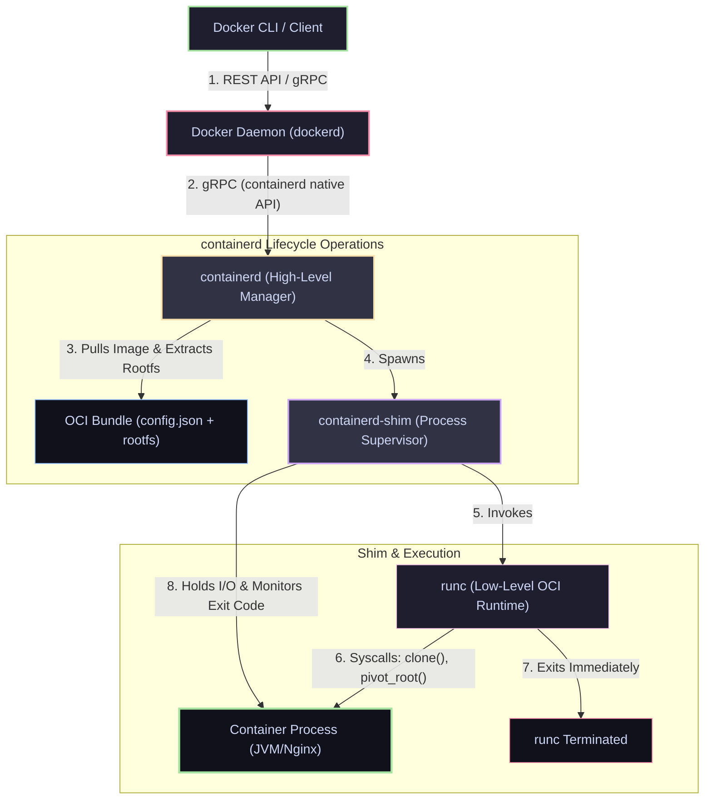

# 03 — The Runtime Stack: Docker, Containerd, RunC & OCI Specs

> **Why this is Topic 3:** In production and Kubernetes architecture rounds, interviewers often ask: "What happens when Kubernetes deprecates Dockershim?" or "How does a node boot a container?" To answer, you must understand that Docker is no longer a monolithic engine. It has been broken down into modular, standardized layers. Knowing how the components (Docker Daemon, containerd, containerd-shim, and runc) fit together, what the OCI specifications govern, and how shims prevent daemon restarts from taking down your application is essential for troubleshooting node-level outages.

---

## 1. WHAT

The container runtime stack is divided into two distinct layers of software defined by the **Open Container Initiative (OCI)**:

1. **High-Level Container Manager (e.g., containerd, CRI-O):** Manages the lifecycle of images, networks, volumes, and namespaces. It exposes APIs (CRI for Kubernetes, gRPC/REST for Docker) and translates user commands into filesystem changes and runc calls.
2. **Low-Level Container Runtime (e.g., runc, crun):** A command-line tool that reads an OCI standard bundle (`config.json` + rootfs directory), makes the necessary Linux kernel system calls (`clone()`, `pivot_root()`, cgroups limits), and starts the application process. In the production flow the shim uses `runc create` + `runc start`, after which **runc exits immediately** and the shim becomes the container's parent. (When invoked directly as `runc run`, runc instead stays in the foreground as the container's parent/monitor — see §4.1.)
3. **Containerd-Shim:** A tiny, long-running daemon spawned for each container. It acts as a bridge between the high-level manager and the container process, holding standard I/O (stdin, stdout, stderr) descriptors open and harvesting the process exit code.



---

## 2. WHY (the trade-offs)

Breaking down the monolithic Docker architecture into a standardized, pluggable stack has profound trade-offs for stability, security, and extensibility.

### 2.1 Monolithic vs. Modular Runtime Design

| Aspect | Pre-OCI Monolithic Docker (Docker < 1.11) | Modern Modular OCI Stack |
| :--- | :--- | :--- |
| **Engine Updates** | **Downtime:** Restarting the Docker daemon terminated all running containers on the host. | **Zero-Downtime:** The daemon and `containerd` can be restarted; `containerd-shim` keeps containers running. |
| **CRI Compliance** | **Hack:** Kubernetes had to use "Dockershim" translation layers to talk to Docker's custom API. | **Native:** `containerd` implements the Container Runtime Interface (CRI) natively for K8s. |
| **Pluggability** | **Locked-in:** Impossible to swap out Docker's execution backend with alternative runtimes. | **Pluggable:** Can swap `runc` with secure microVM runtimes (gVisor, Firecracker) via runtime classes. |
| **Component Size** | Heavy, unified daemon containing CLI, networking, API, registry logic, and runtime. | Lightweight, isolated components with minimal memory footprints. |

### 2.2 Execution Runtime Alternatives

You can swap out the low-level execution engine (`runc`) depending on security boundaries:

| Low-Level Runtime | Isolation Method | Security Strength | Overhead & Speed |
| :--- | :--- | :--- | :--- |
| **`runc` / `crun`** | Shared Kernel (namespaces + cgroups). | **Standard:** Vulnerable to kernel exploits. | **Minimal:** Native host speed. |
| **`gVisor` (Google)** | Sentry Kernel Sandbox (intercepts and filters syscalls in userspace). | **High:** App cannot communicate directly with host kernel. | **Medium:** Syscall interception introduces 10-30% latency. |
| **`Firecracker` (AWS)** | MicroVMs running inside KVM hypervisors. | **Maximum:** Dedicated minimal hardware-virtualized kernel. | **Low-Medium:** Boots in <100ms; hypervisor memory tax. |

---

## 3. HOW (the internals)

Let's trace what happens when you run `docker run -d -p 80:80 nginx` step-by-step:

### 3.1 Step-by-Step Lifecycle of `docker run`

1.  **CLI Request:** The Docker CLI parses your command, structures it into a JSON request payload, and sends it to the Docker Daemon (`dockerd`) socket at `/var/run/docker.sock`.
2.  **Daemon Validation:** `dockerd` acts as the API administrator. It checks local storage for the `nginx` image layers and pulls them from Docker Hub if missing. `dockerd` then passes a **container spec** (image ref, env, mounts, resource limits) down to `containerd` — it does *not* itself write the OCI bundle. The concrete `config.json` + rootfs bundle is materialized lower down, on the `containerd`/shim/`runc` side, just before execution.
3.  **Handoff to Containerd:** `dockerd` calls `containerd` (via gRPC) requesting the creation of a container.
4.  **Shim Spawning:** `containerd` receives the request. It configures the OverlayFS mounts (`lowerdir`, `upperdir`, `merged`). It then spawns a standalone process called **`containerd-shim`** and attaches it to the container's virtual root.
5.  **Runtime Invocation:** The `containerd-shim` invokes the CLI command:
    `runc create --bundle /var/run/containerd/io.containerd.runtime.v2.task/default/<id> <id>`
6.  **Container Creation:** `runc` reads `config.json`, sets up the cgroup limits, configures namespaces via `clone()`, mounts the root filesystem via `pivot_root`, drops capabilities, and spawns the container's entrypoint process (`nginx`) in a suspended state.
7.  **Handover and Exit:** `containerd-shim` opens the standard input/output streams and connects them to log drivers. `runc` then signals the container process to wake up (`runc start`), hands control of the process over to `containerd-shim`, and exits.
8.  **Monitoring:** The container runs. If `dockerd` crashes or is upgraded, the application remains unaffected because `containerd-shim` is its parent process and handles reporting.

---

### 3.2 OCI Specifications: The Standards

The Open Container Initiative (OCI) defines three core specifications:
*   **Image Specification:** Defines the format of the container image. It specifies how tarballs are structured, how the manifest file references layers via digest hashes, and how configurations (environment variables, entrypoints) are stored.
*   **Runtime Specification:** Defines how a container runs on disk. It outlines the structure of the "OCI Runtime Bundle" (which consists of a directory containing a `rootfs` folder and a `config.json` configuration file) and defines the lifecycle operations (`create`, `start`, `state`, `kill`, `delete`).
*   **Distribution Specification:** Standardizes how container images are pushed, pulled, and verified from registries (e.g., Docker Hub, AWS ECR).

---

## 4. CODE / EXAMPLES

### 4.1 Running a Container Manually using *Only* `runc`

Let's bypass Docker entirely and launch a container using the low-level `runc` runtime tool.

> [!NOTE]
> This requires root privileges on a Linux machine with `runc` installed.

```bash
# 1. Create a workspace directory
mkdir -p /tmp/runc-demo/rootfs

# 2. Extract an Alpine Linux rootfs into the rootfs directory
curl -sSL https://dl-cdn.alpinelinux.org/alpine/v3.18/releases/x86_64/alpine-minirootfs-3.18.4-x86_64.tar.gz | tar -xzf - -C /tmp/runc-demo/rootfs

# 3. Generate a default OCI Runtime spec (config.json)
cd /tmp/runc-demo
runc spec
# Inspect the generated configuration file
cat config.json | grep -A 10 "process"
```

Inside the generated `config.json`, you will see variables defining namespaces, limits, capabilities, and the starting command. Let's customize it:

```json
/* In /tmp/runc-demo/config.json, modify the starting command to print a loop */
"args": [
    "sh",
    "-c",
    "while true; do echo 'Hello from raw runc!'; sleep 2; done"
],
```

Now, launch the container using the low-level execution command:

```bash
# 4. Start the container process directly using runc
sudo runc run demo-container
# Output:
# Hello from raw runc!
# Hello from raw runc!
```

In another host terminal, you can audit the running process:

```bash
# 5. Check runc state
sudo runc list
# ID             PID         STATUS      BUNDLE             CREATED                          OWNER
# demo-container 45902       running     /tmp/runc-demo     2026-07-13T02:29:40.123Z         root

# 6. Check the process parent on the host
ps -efj | grep 45902
# With a foreground `runc run`, runc does NOT exit — it stays as the foreground
# monitor and is the DIRECT PARENT of the container process (PID 45902).
# runc's own parent, in turn, is your shell/sudo — NOT Docker or containerd.
# The takeaway holds either way: no dockerd/containerd sits in this process tree;
# runc constructs and supervises native host processes directly.
# (In the production stack it's the containerd-shim, not your shell, that ends up
#  as the container's parent — because there runc uses create+start and then exits.)
```

---

## 5. INTERVIEW ANGLES

### Q: Why does the `containerd-shim` exist? Why doesn't the central `containerd` daemon monitor the processes itself?
**A:** The `containerd-shim` solves three critical problems:
1.  **Daemon Upgrades/Restarts:** If `containerd` managed container processes directly, restarting `containerd` for updates or crash recovery would orphan all running container processes, forcing them to terminate or leak resources. The shim runs as a lightweight parent process. When `containerd` exits, the shim remains alive and reparents to the host's `init` (PID 1), keeping the application running.
2.  **I/O Handling:** The shim keeps the container's standard input, output, and error pipes open. Even if `containerd` restarts, stdout/stderr logs are buffered and not lost.
3.  **State Harvesting:** The shim monitors the exit code of the container process and reports it back to `containerd` once the manager restarts.

### Q: Explain the transition of Kubernetes away from "Dockershim" to the Container Runtime Interface (CRI).
**A:** 
*   **The Dockershim Era:** Historically, Kubernetes only supported Docker. When Kubernetes introduced the **Container Runtime Interface (CRI)** to allow other runtimes (like rkt), Docker was not CRI-compliant. To support Docker, the Kubernetes project maintained **Dockershim**—a translation bridge inside the `kubelet` process that converted CRI requests into Docker API commands, which then went to `dockerd` -> `containerd` -> `runc`. This created double-translation overhead and heavy maintenance burdens.
*   **The Deprecation:** In Kubernetes 1.24, Dockershim was deleted. The `kubelet` now communicates directly via gRPC/CRI with CRI-compliant managers like `containerd` or `CRI-O`, bypassing the Docker Daemon (`dockerd`) entirely. This reduces memory consumption, speeds up scheduling, and removes unnecessary translation layers.

```
[Kubelet] ──CRI gRPC──► [containerd] ──(runc)──► [Pod Container]
```
*   **Debugging after dockershim:** on a node where the kubelet talks straight to `containerd`, `docker ps` no longer shows Kubernetes' containers. The CRI-native replacements are **`crictl`** (speaks the CRI directly to `containerd`/`CRI-O`, so you see exactly what the kubelet sees) and **`nerdctl`** (a Docker-CLI-compatible front-end for `containerd`). Docker Engine itself has also moved to using **containerd's image store**, so images pulled via `docker`, `nerdctl`, and the kubelet can share the same underlying content.

### Q: What is the OCI Runtime Spec, and how does `runc` use it?
**A:** The OCI Runtime Specification defines the schema of the execution bundle. A bundle is a directory containing a `rootfs` folder (with the extracted application binaries and filesystem) and a `config.json` configuration file.
`runc` is the CLI executor. It accepts this bundle path, parses the `config.json` parameters (describing environment variables, mounted devices, resource limits like memory/cpu, user UID mappings, and namespaces), and executes the low-level kernel system calls (`clone`, `unshare`, `pivot_root`, `setns`) to construct the isolated process container.

---

## 6. ONE-LINE RECALL CARDS

*   **containerd** is the high-level manager handling CRI API requests, image pulls, and rootfs extraction.
*   **runc** is the low-level command-line tool that constructs namespaces, applies cgroup limits, starts the container, and exits.
*   **containerd-shim** is a long-running process that supervises the container, keeps file descriptors open, and isolates it from daemon restarts.
*   **OCI specifications** standardize the Image format (tarballs), Runtime environment (`config.json`), and Distribution API.
*   **Dockershim deprecation** removed the translation layer, letting Kubernetes' `kubelet` talk directly to `containerd` or `CRI-O` via CRI gRPC.
*   **`runc spec`** generates the boilerplate `config.json` required to spin up any OCI-compliant container runtime.
*   **gVisor** intercepts guest system calls in a userspace sandbox to prevent direct container-to-host-kernel exploitation.
*   **Firecracker** runs containers inside microVMs using a minimal Linux guest kernel to guarantee hardware-level isolation.
*   **Daemon/containerd restarts don't kill running containers** — the `containerd-shim` stays alive as the container's parent (reparenting to `init` if needed), so upgrading `dockerd`/`containerd` is non-disruptive to *already-running* workloads (restarting the container itself still has downtime).
*   **crictl / nerdctl** are the CRI-native debug CLIs after dockershim's removal: `crictl` talks the CRI to `containerd`/`CRI-O` (what the kubelet sees), while `nerdctl` is a Docker-CLI-compatible front-end for `containerd`. Docker itself now stores images in **containerd's image store**, so `docker` and `nerdctl`/`crictl` can share the same content.

---

**Next:** [04 — Container Networking](04-container-networking.md) (bridge/host/none, veth pairs, NAT/iptables, port publishing, embedded DNS).
