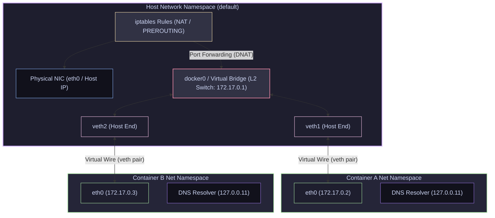

# 04 — Container Networking: Bridge, Host, Veth Pairs & IPTables

> **Why this is Topic 4:** Microservices communicate over the network, but container network isolation behaves very differently from physical hosts or VMs. Interviewers like to ask: "When you run a container with `-p 8080:80`, what actually changes in the host's networking kernel?" Or "How does a packet leave one container's private namespace to reach another?" To debug routing loops, DNS resolution failures, or port conflict issues, SDE2s must understand the Linux network namespace boundary, virtual ethernet (`veth`) pairs, virtual bridge switches, and the host's `iptables` packet translation rules.

---

## 1. WHAT

When a container runs, it is given its own isolated network namespace, meaning it has its own private loopback (`lo`), routing tables, firewall rules, and virtual network interfaces. 

To connect these isolated namespaces, the container engine uses one of four primary network modes:

1. **Bridge (Default):** Creates a virtual private network on the host. Containers receive private IP addresses (e.g., `172.17.0.X`) and communicate via a virtual Layer-2 switch (a Linux bridge) running on the host.
2. **Host:** Disables network namespace isolation. The container shares the host's network interfaces directly (e.g., a process binding to port 80 inside the container binds directly to port 80 on the host physical NIC).
3. **None:** Disables networking completely, leaving only the loopback interface (`127.0.0.1`).
4. **Container Mode (`container:<id>`):** Directs the container to share the network namespace of an *already existing* container. This allows both containers to share localhost (this is the architectural foundation of a **Kubernetes Pod**).



---

## 2. WHY (the trade-offs)

Selecting network configurations determines performance capabilities and isolation boundaries.

### 2.1 Container Network Modes Comparison

| Mode | Isolation Strength | Performance | Port Collision Risk | DNS Features |
| :--- | :--- | :--- | :--- | :--- |
| **`bridge`** | **High:** Separate IP spaces. Processes cannot access host ports directly. | **Medium:** Extra veth hop + `docker0` bridge forwarding adds slight latency (container-to-container on the same bridge is pure L2, *no* NAT; NAT only applies to published-port ingress and internet egress). | **Zero:** Containers can all bind to port 8080 locally without conflicts. | Built-in service name resolution (if custom bridge). |
| **`host`** | **Zero:** Shares host ports, interfaces, and loopback. | **Maximum:** Direct physical speed (bare-metal throughput). | **High:** If two containers bind to port 8080, one will fail to start. | Inherits Host DNS configuration. |
| **`none`** | **Absolute:** No access to external or local container networks. | N/A | **Zero** | None |
| **`container`** | **Shared:** Shares IP, port space, loopback with target container. | **Maximum** (for inter-container communication on localhost). | **High:** Sidecar containers cannot bind to the same ports. | Shares DNS namespace of target container. |

---

## 3. HOW (the internals)

Let's look at the Linux networking mechanisms that make packet transport possible.

### 3.1 Virtual Ethernet (veth) Pairs: The Virtual Wire

To bridge two network namespaces, the Linux kernel provides **`veth` (virtual ethernet) devices**. A veth device is created as an interconnected pair (a bidirectional tunnel). 
1.  One end of the pair (`vethXXXX`) remains in the host's default network namespace.
2.  The other end is moved into the container's private network namespace and renamed to `eth0`.
3.  Any packet sent into the container's `eth0` instantly emerges out of the host's `vethXXXX` interface, bypassing physical wire requirements.

---

### 3.2 Linux Bridge (docker0): The Virtual Switch

A Linux bridge (e.g., `docker0`) is a virtual software Layer-2 switch. All host-side veth endpoints (`veth1`, `veth2`, etc.) are attached to this bridge.
*   **Intra-Host Routing:** When Container A (`172.17.0.2`) sends a packet to Container B (`172.17.0.3`), the packet travels out of its `eth0`, enters the host via `veth1`, hits the `docker0` bridge, and is forwarded to `veth2` based on MAC address tables. The packet never touches the host's physical network card.

---

### 3.3 Network Address Translation (NAT) & DNAT

Because container IP addresses are private (e.g., `172.17.0.X`), they are non-routable on your company network or public internet. The host kernel uses **iptables NAT rules** to manage traffic:

#### Outbound Traffic (Internet access):
When a container calls an external API at `8.8.8.8`:
1.  The container routes the packet to its default gateway, which is the IP of the `docker0` bridge (`172.17.0.1`).
2.  The host kernel intercepts the packet. It performs **Source NAT (SNAT)**, also called **IP Masquerading**.
3.  The kernel modifies the packet's source IP from `172.17.0.2` to the host's egress-interface IP (e.g., `192.168.1.50` — note this happens to be an RFC-1918 private address on a LAN; on a cloud host it would be the VM's primary NIC address) and forwards it to the physical NIC. When replies return, the host translates them back.

> [!NOTE]
> **MASQUERADE prerequisites:** SNAT/masquerade only works if the kernel is forwarding packets (`net.ipv4.ip_forward=1`, which Docker sets on startup) and connection tracking (`conntrack`) is loaded so reply packets can be reverse-translated. For hairpin/loopback cases (a container reaching a published port on its *own* host IP), Docker falls back to a userland **`docker-proxy`** process that shuttles bytes when the pure-iptables path can't handle the traffic.

#### Inbound Traffic (Port Publishing `-p 8080:80`):
When a client hits the host's public IP on port `8080`:
1.  The kernel receives the packet. Before routing, it processes the packet through the `iptables` `PREROUTING` NAT chain.
2.  A Docker-configured rule performs **Destination NAT (DNAT)**.
3.  The kernel rewrites the destination IP from the host's IP/port (`192.168.1.50:8080`) to the container's private IP/port (`172.17.0.2:80`).
4.  The kernel forwards the packet onto the `docker0` bridge, which sends it to `veth1` -> container `eth0`.

---

### 3.4 Embedded DNS Resolver

On user-defined bridge networks, Docker exposes a tiny embedded DNS resolver inside the container's net namespace at the address `127.0.0.11`.
*   When a container attempts to resolve `payment-service`, the resolver interceptor sends the query to `127.0.0.11` (configured in `/etc/resolv.conf`).
*   If the target name matches another container running on the same *custom* bridge network, the embedded DNS server returns its private IP.
*   If it is a public domain (e.g., `google.com`), the DNS resolver forwards the query to the host's configured upstream DNS servers.

> [!IMPORTANT]
> **No DNS on Default Bridge:** Docker disables name resolution on the default bridge (`docker0`) for legacy reasons. Containers running on the default network can only communicate via raw IP addresses, unless they are manually linked. You must create a **custom bridge network** to enable embedded DNS name resolution.

---

## 4. CODE / EXAMPLES

### 4.1 Creating a Bridge Network Manually using Linux `iproute2`

Let's build a bridge network and connect two isolated network namespaces manually without Docker.

> [!NOTE]
> This requires root privileges on a Linux host/VM.

```bash
# 1. Create two isolated network namespaces
sudo ip netns add ns-alpha
sudo ip netns add ns-beta

# 2. Create a virtual bridge interface (L2 switch) named 'br-demo'
sudo ip link add br-demo type bridge
sudo ip link set br-demo up
sudo ip addr add 10.0.0.1/24 dev br-demo # Assign gateway IP

# 3. Create Virtual Ethernet (veth) Pair for Namespace Alpha
sudo ip link add veth-alpha type veth peer name veth-alpha-br
sudo ip link set veth-alpha netns ns-alpha  # Move one end to namespace
sudo ip link set veth-alpha-br master br-demo # Connect other end to bridge
sudo ip link set veth-alpha-br up

# 4. Create Virtual Ethernet (veth) Pair for Namespace Beta
sudo ip link add veth-beta type veth peer name veth-beta-br
sudo ip link set veth-beta netns ns-beta
sudo ip link set veth-beta-br master br-demo
sudo ip link set veth-beta-br up

# 5. Configure network interfaces inside Namespace Alpha
sudo ip netns exec ns-alpha ip link set lo up
sudo ip netns exec ns-alpha ip link set veth-alpha name eth0 # Rename to standard
sudo ip netns exec ns-alpha ip link set eth0 up
sudo ip netns exec ns-alpha ip addr add 10.0.0.2/24 dev eth0 # Assign IP
sudo ip netns exec ns-alpha ip route add default via 10.0.0.1 # Configure routing

# 6. Configure network interfaces inside Namespace Beta
sudo ip netns exec ns-beta ip link set lo up
sudo ip netns exec ns-beta ip link set veth-beta name eth0
sudo ip netns exec ns-beta ip link set eth0 up
sudo ip netns exec ns-beta ip addr add 10.0.0.3/24 dev eth0
sudo ip netns exec ns-beta ip route add default via 10.0.0.1

# 7. Test ping connectivity between namespaces
sudo ip netns exec ns-alpha ping -c 2 10.0.0.3
# Output: 2 packets transmitted, 2 received, 0% packet loss!
# You have routed packets across namespaces using your custom bridge!
```

---

### 4.2 Inspecting Docker NAT Tables on Host

To see the rules Docker configures to route port mappings:

```bash
# List all Destination NAT (DNAT) rules in Docker's own chain.
# (The DOCKER chain is not PREROUTING itself — it is *called from* the
#  PREROUTING and OUTPUT NAT chains via a jump rule.)
sudo iptables -t nat -S DOCKER
# Output shows rules mapping traffic to container targets:
# -A DOCKER ! -i docker0 -p tcp -m tcp --dport 8080 -j DNAT --to-destination 172.17.0.2:80

# List Source NAT (SNAT/Masquerade) rules for outbound traffic
sudo iptables -t nat -S POSTROUTING
# -A POSTROUTING -s 172.17.0.0/16 ! -o docker0 -j MASQUERADE
# (This rule masquerades outbound packets from container subnet to the internet)
```

---

## 5. INTERVIEW ANGLES

### Q: Why does a custom Docker bridge network support DNS resolution of container names, while the default `docker0` bridge network does not?
**A:** This is a legacy design decision. The default `docker0` bridge was created early in Docker's development and is shared by all containers by default. To prevent name resolution pollutions and security leaks (where a random container could guess and intercept names of other applications on the default bridge), Docker disabled DNS lookup on it. 
When you create a **custom network** (`docker network create`), Docker assumes you are defining a logical tenant boundary. It boots the embedded DNS server at `127.0.0.11` for this network and populates it with DNS records matching container names to container IP addresses, enabling service discovery.

### Q: Trace what happens when a container (`172.17.0.2`) makes a REST call to `api.github.com` via the default bridge network.
**A:** 
1.  The container process resolves `api.github.com` using the DNS servers copied from the host's resolver configuration. It then looks up the route for the target IP and determines the destination is outside its `/16` subnet.
2.  It sends the packet out of its virtual interface `eth0` to its default gateway (`172.17.0.1` - the IP of `docker0` bridge).
3.  The packet leaves `eth0`, passes through the virtual veth wire, and emerges on the host's `vethXXXX` interface.
4.  The host kernel processes the packet. It checks its routing tables and sees that it must send the packet out of the physical NIC (e.g., `eth0` on host).
5.  Before sending it out, the packet passes through the host's `iptables` `POSTROUTING` NAT tables. The rule matches: `-s 172.17.0.0/16 ! -o docker0 -j MASQUERADE`.
6.  The kernel alters the packet's source IP address from `172.17.0.2` to the host's egress-interface IP (whatever address the outbound NIC owns — often an RFC-1918 LAN address, not literally a public IP), notes down the mapping in its connection tracking (conntrack) tables, and transmits the packet onto the physical wire.

### Q: Why does Kubernetes discard Docker's default host-port mapping approach in favor of "IP-per-Pod"?
**A:** 
*   **Docker's Approach:** Docker maps host ports to containers (e.g., binding container port 80 to host port 8080). This introduces severe port collisions. If you have 3 containers that need to listen on port 8080, you cannot schedule them on the same host unless you map them to random ports (8081, 8082), which breaks configuration standards and service discovery.
*   **Kubernetes' Approach:** Kubernetes requires that **every Pod gets its own unique, routable IP address**. Pods can talk to other Pods directly on their IPs without NAT, and containers inside a Pod share the same network namespace (localhost). This means a container can listen on port 8080 inside Pod A, and another container can listen on port 8080 inside Pod B. They can run on the exact same host node without any port conflicts. The pod-to-pod routing itself is not Docker's `docker0`/iptables machinery — it is delegated to a **CNI plugin** (Calico, Cilium, flannel, etc.) that programs the cross-node network.
*   **Don't call raw Pod IPs:** Pod IPs are ephemeral — a Pod that reschedules gets a new IP. Clients target a **Service** (a stable virtual IP / DNS name), and `kube-proxy` (via iptables or IPVS, or eBPF in Cilium) load-balances the Service VIP across the current healthy Pod IPs. So the stable target in K8s is the Service, not the Pod.

---

## 6. ONE-LINE RECALL CARDS

*   **`bridge` network mode** isolates containers behind a software switch using private non-routable subnets.
*   **`host` network mode** shares the host's physical network stack, avoiding NAT overhead but risking port collisions.
*   **`container` network mode** shares one net namespace among multiple containers, allowing local communications over `127.0.0.1`.
*   **A `veth` pair** acts as a virtual ethernet cable linking two isolated Linux network namespaces.
*   **The `docker0` interface** is a virtual Layer-2 switch managing local frame forwarding between container `veth` endpoints.
*   **Destination NAT (DNAT)** rewrites the destination IP of packets arriving at the host's published ports to the container's private IP.
*   **IP Masquerading (SNAT)** translates private container IPs to the host's public IP for outbound internet packets.
*   **Embedded DNS (`127.0.0.11`)** resolves container names dynamically, but is **disabled** on the default `docker0` bridge.
*   **`ip netns`** is the standard Linux command utility used to create, inspect, and configure network namespaces manually.
*   **Kubernetes IP-per-Pod model** guarantees every Pod a routable IP, bypassing host-port translation dependencies.

---

**Next:** [05 — Storage & Volumes](05-container-storage.md) (the writable layer (CoW), volumes vs bind mounts vs tmpfs, data persistence & lifecycle).
