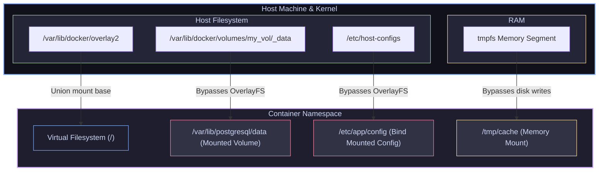

# 05 — Container Storage: Writable Layer, Volumes, Bind Mounts & Tmpfs

> **Why this is Topic 5:** Containers are ephemeral by design. When a container terminates, its top writable layer is destroyed along with any files created or modified during its runtime. For stateful backend systems (databases like Postgres, search engines like Elasticsearch, or caches like Redis), data must survive restarts. SDE2s must understand the mechanics of Docker's storage options, how storage mounts bypass the OverlayFS Copy-on-Write (CoW) write performance penalties, and how filesystem mount propagation and security labels (SELinux) affect container access in production.

---

## 1. WHAT

Docker provides four ways to store files inside a container:

1.  **Writable Layer:** The default layer created on top of the image's read-only layers. It is managed by the storage driver (OverlayFS) and is **destroyed** when the container exits.
2.  **Volumes:** Managed directories created and controlled by Docker inside a designated host path (typically `/var/lib/docker/volumes/`). This is the recommended option for persistent application data (like database files) because it decouples storage from the host's directory structure.
3.  **Bind Mounts:** Directly maps any user-specified file or directory on the host's filesystem (e.g., `/opt/configs`) into the container. This is useful for passing host configuration files or sharing development code for hot-reloads.
4.  **Tmpfs Mounts:** Mounts a segment of the host's system memory (RAM) directly inside the container filesystem, offering maximum I/O speed and wiping data on container stop. Caveat: tmpfs is *memory-backed*, not *memory-locked* — under memory pressure the kernel can page tmpfs contents out to **swap**, so "never touches disk" only holds if swap is disabled or the pages are `mlock`ed. (In Kubernetes the equivalent is `emptyDir` with `medium: Memory`.)



---

## 2. WHY (the trade-offs)

Selecting the wrong storage mechanism can result in massive write overheads, permissions failures, or data loss.

### 2.1 Storage Options Comparison

| Storage Mechanism | Performance (Throughput/IOPS) | Data Lifecycle | Host OS Coupling | Typical Use Case |
| :--- | :--- | :--- | :--- | :--- |
| **Writable Layer** | **Low:** Copy-on-Write latency for edits; OverlayFS driver translation overhead. | Ephemeral (Deleted when container terminates). | Non-coupled (Docker internal). | Ephemeral cache files, short-lived logs. |
| **Volumes** | **High:** Bypasses OverlayFS; writes directly to host filesystem speed. | Persistent (Survives container deletion; must be explicitly deleted). | Low (Managed entirely by Docker daemon). | Database data directories (Postgres, Redis). |
| **Bind Mounts** | **High:** Direct bare-metal filesystem speed. | Persistent (Survives container deletion; file managed by host user). | **High:** Dependent on host path structures and user permissions. | Mounting code for local development; sharing `/var/run/docker.sock`. |
| **Tmpfs** | **Maximum:** Direct RAM read/write speeds. | Ephemeral (Wiped when container stops; lost on host reboot). | Non-coupled | Storing sensitive API keys, security certificates, high-frequency locks (note: pages can still be swapped to disk unless swap is off/locked). |

---

## 3. HOW (the internals)

Let's look at how the Linux kernel bypasses the layered filesystem to write directly to disk or RAM.

### 3.1 Bypassing OverlayFS

When a Volume or Bind Mount is attached to a container path (e.g., mounting `/var/lib/postgresql/data` into `/data`), the container runtime (`runc`) bypasses the OverlayFS union mount.
1.  During container setup, `runc` executes a **`mount --bind`** system call (also known as a bind mount).
2.  The kernel intercepts filesystem accesses inside the mount namespace. 
3.  Any read or write call to `/data` is redirected directly to the target host path (e.g., `/var/lib/docker/volumes/db_data/_data`) by the virtual filesystem (VFS) layer, completely bypassing the OverlayFS storage driver.
4.  This avoids the Copy-on-Write (CoW) cycle (where a file must be copied up from the base layer before editing), allowing databases to write with bare-metal disk efficiency.

---

### 3.2 Volume Pre-Population & Named vs. Anonymous Volumes

A classic gotcha: when you mount an **empty named (or anonymous) volume** onto a container directory that **already contains files in the image** (e.g., mounting a fresh volume onto `/usr/share/nginx/html` or a node_modules path), Docker **copies the image directory's existing contents into the fresh volume** on first use. So the volume is not empty — it is seeded with whatever the image shipped.

*   This population happens **only** for volumes, and **only** when the volume is empty. Re-using a volume that already has data skips the copy.
*   **Bind mounts do NOT do this.** A bind mount over a non-empty image directory simply *shadows* the image contents — the host directory (even if empty) wins, and the image's files become inaccessible for the life of the mount. This is why a bind mount over `node_modules` can "hide" a dependency folder baked into the image.

**Named vs. anonymous volumes:**
*   **Named:** you give it a stable name (`-v pgdata:/var/lib/postgresql/data`). Referenced by name, survives `docker rm`, must be explicitly deleted.
*   **Anonymous:** no name given (`-v /var/lib/postgresql/data` or an image `VOLUME` instruction). Docker assigns a random hash ID. Easily orphaned and left behind — cleaned up with `docker volume prune` or `docker run --rm` (which removes anonymous volumes on exit).

---

### 3.3 Mount Propagation

Mount propagation controls whether mounts created inside the host are propagated to the container, and vice versa. It is configured in the mount namespace.

*   **`private` (Default):** Mounts are not shared. If you mount a new drive to a folder on the host, the container will not see it. If you mount something inside the container, the host will not see it.
*   **`shared`:** Bidirectional propagation. New mounts in either the host or the container appear in the other.
*   **`slave`:** Unidirectional propagation. New mounts on the host appear inside the container, but mounts created inside the container are hidden from the host.

---

### 3.4 SELinux Labeling: `:z` vs `:Z`

On Linux distributions where SELinux is active (Red Hat, CentOS, Fedora), the kernel blocks container access to host files unless the files have the correct security labels.
If you bind-mount a host path without relabeling, the container process receives a **Permission Denied** error, even if the process runs as root.
Docker provides flag suffixes to automate relabeling:
*   **`:z` flag:** Relabels the host folder to share with *multiple* containers (applies the `container_file_t` label in modern container runtimes; `svirt_sandbox_file_t` is the older/dated alias for the same type).
*   **`:Z` flag:** Relabels the host folder for *exclusive* access by a single container (assigns a private, unique label).

---

### 3.5 Mapping Docker Storage to Kubernetes

The three Docker mechanisms map almost one-to-one onto Kubernetes volume types — knowing the mapping is the fastest way to answer "how does this translate to prod?":

| Docker mechanism | Kubernetes equivalent | Notes |
| :--- | :--- | :--- |
| **Volume** (Docker-managed, driver-pluggable) | **PersistentVolume / PersistentVolumeClaim** backed by a **StorageClass** + **CSI driver** | The PVC is the workload's claim; the StorageClass dynamically provisions a PV via a CSI driver (EBS, Ceph-RBD, GCE-PD, etc.). This is the "network storage without touching the container" story, done properly. |
| **Bind Mount** (arbitrary host path) | **`hostPath`** | Same host-coupling and same risks — ties the Pod to a specific node's filesystem; generally discouraged outside DaemonSets/node agents. |
| **Tmpfs Mount** (RAM-backed) | **`emptyDir` with `medium: Memory`** | RAM-backed scratch space wiped when the Pod is removed; counts against the container's memory limit and can be swapped like any tmpfs. Plain `emptyDir` (no medium) is node-disk-backed instead. |

---

## 4. CODE / EXAMPLES

Let's see how to configure and inspect different storage types in action.

### 4.1 Volumes vs. Bind Mounts vs. Tmpfs CLI Examples

```bash
# 1. Run a container using a Docker-managed Volume
# Using --mount (preferred, verbose) or -v volume_name:container_path
docker run -d --name pg-db \
  --mount type=volume,source=postgres_data,target=/var/lib/postgresql/data \
  postgres:15-alpine

# Inspect the volume to locate its host directory
docker volume inspect postgres_data
# Output:
# [
#     {
#         "Mountpoint": "/var/lib/docker/volumes/postgres_data/_data",
#         "Name": "postgres_data",
#         "Driver": "local"
#     }
# ]

# 2. Run a container using a Bind Mount with read-only access (ro)
# Useful for secure config mapping
docker run -d --name app-service \
  --mount type=bind,source=/etc/app-configs,target=/app/configs,readonly \
  my-app:latest

# 3. Run a container using a Tmpfs (Memory) mount
# Restricts write size to 64MB using tmpfs-size (in bytes)
docker run -d --name vault-agent \
  --mount type=tmpfs,target=/app/secrets,tmpfs-size=67108864 \
  vault-agent:latest
```

---

## 5. INTERVIEW ANGLES

### Q: A process running as root inside a container writes a file to a bind-mounted directory. On the host, who owns this file? What are the security risks?
**A:** Because containers share the host kernel, UID 0 (root) inside the container is by default evaluated as **UID 0 (root) on the host**. 
Therefore, if a container process running as root creates a file inside a bind-mounted directory, that file is owned by `root` on the host filesystem.
**Security Risks:**
1.  **Host File Modification:** If an attacker gains access to the container, they can write executable files (like SUID binaries) or modify system-critical files (like `/etc/shadow`) if the host directories are bind-mounted.
2.  **Shared Volume Contamination:** If the container process is compromised, it can overwrite config files or inject malicious scripts into host directories, which are then read by other applications running on the host.
*Mitigation:* Always run containers as a non-root user (e.g., using `USER 10001` in the Dockerfile) and bind-mount directories using the `readonly` flag (`ro`) whenever possible.

### Q: Why are Docker Volumes preferred over Bind Mounts for production database persistence?
**A:** Docker Volumes are preferred for three reasons:
1.  **Host Decoupling:** Bind mounts depend on the exact directory structure of the host machine. If you move the container to another host with a different directory tree, the mount fails. Volumes abstract this, delegating the physical file mapping to Docker.
2.  **Driver Pluggability:** Volumes support volume drivers. You can configure a volume to write data directly to network storage (NFS, AWS EBS, Ceph, or Google Cloud Filestore) without modifying the container's volume mounts. Bind mounts are strictly restricted to local host paths.
3.  **Docker Management Lifecycle:** Volumes are managed directly via Docker CLI (`docker volume rm`, `prune`), preventing orphaned folders from filling up the host disk.

### Q: What is Mount Propagation, and when would you configure it?
**A:** Mount propagation controls whether mount changes inside the container or host cascade to each other.
*   **When to use `shared` propagation:** This is necessary when you are running a containerized storage tool (like a CSI storage driver in Kubernetes, or a volume plugin like GlusterFS/Ceph). The storage container mounts a network share inside the container path. By configuring the mount propagation as `shared` (or `rshared`), the mount propagates to the host namespace, making the network files visible to the host and other containers.
*   *Security warning:* Shared mount propagation gives the container power to affect the host filesystem layout; it should only be granted to highly trusted infrastructure pods.

---

## 6. ONE-LINE RECALL CARDS

*   **The writable layer** is ephemeral, slow due to Copy-on-Write overhead, and destroyed on container deletion.
*   **Docker Volumes** are managed by Docker in `/var/lib/docker/volumes/`, separating storage from host-specific paths.
*   **Bind Mounts** map any arbitrary host directory to a container path, making them highly host-dependent.
*   **Tmpfs mounts** store data in system RAM for maximum I/O speed and wipe on container stop — but pages can still be **swapped to disk** unless swap is disabled/`mlock`ed.
*   **Mounting an empty named/anonymous volume** onto a non-empty image directory **copies the image's existing files into the volume**; a **bind mount** instead **shadows** (hides) the image contents.
*   **K8s storage mapping:** Docker volume → **PV/PVC + StorageClass/CSI**; bind mount → **`hostPath`**; tmpfs → **`emptyDir{medium: Memory}`**.
*   **`mount --bind`** is the kernel system call used to link directories, bypassing the OverlayFS storage driver.
*   **Volumes and Bind Mounts bypass OverlayFS**, allowing containers to write data at bare-metal host speeds.
*   **`shared` mount propagation** allows mounts created inside a container to propagate back to the host filesystem.
*   **The `:z` and `:Z` flags** instruct Docker to automatically update SELinux labels on bind-mounted host folders.
*   **Root files written via bind mounts** are owned by `root` on the host, presenting a potential escalation path.
*   **`docker volume inspect`** outputs the physical path on the host where volume data is stored.

---

**Next:** [06 — Production Images for Spring Boot](06-spring-boot-images-jvm.md) (JVM cgroup awareness (heap/CPU sensing), layered jars, buildpacks, image size & CVE hardening).
