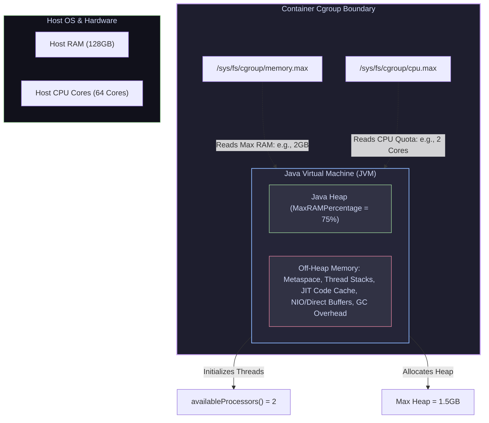

# 06 — Production Images for Spring Boot: JVM Cgroup Awareness & Layered Jars

> **Why this is Topic 6:** Java and containers had a notoriously troubled history. Early JVM versions were completely blind to container resource restrictions. If you ran a Java 8 (pre-u191) pod on a host with 64GB of RAM and set a cgroup limit of 2GB, the JVM ignored the 2GB limit, read the host's 64GB memory, allocated a massive default heap, and was instantly terminated by the kernel's OOM Killer. For SDE2s working with enterprise microservices, understanding JVM cgroup ergonomics, setting up optimized GC threads, separating static dependency layers for caching, and mitigating CVEs is essential production knowledge.

---

## 1. WHAT

Running enterprise Java applications in container environments requires reconciling the JVM's resource management with the operating system's cgroups constraints:

1. **JVM Container Support (`UseContainerSupport`):** Tells the JVM to read cgroup paths (like `/sys/fs/cgroup/memory.max`) rather than host files (like `/proc/meminfo`) to determine resource availability.
2. **Dynamic Heap Percentage (`MaxRAMPercentage`):** Configures the JVM to allocate a percentage of container cgroup memory for heap, rather than hardcoding memory values in megabytes (e.g. `-Xmx`).
3. **Layered JAR Files:** Splits Spring Boot's monolithic Fat JAR into logical, stacked folders (dependencies, loader, snapshots, application) matching Docker's layer structure to optimize CI/CD caching.
4. **Cloud Native Buildpacks (CNB):** An alternative build standard that compiles source code into OCI-compliant images automatically, enforcing production best practices (such as running non-root and tuning garbage collectors) without a Dockerfile.



---

## 2. WHY (the trade-offs)

Tuning Java container performance requires balancing build isolation against resource allocation strategies.

### 2.1 Hardcoded Memory (-Xmx) vs. Dynamic Percentages

| Configuration Strategy | Heap Size Management | Portability Across Environments | Off-Heap Safety |
| :--- | :--- | :--- | :--- |
| **Hardcoded (`-Xmx1500m`)** | Static: Always reserves 1500MB regardless of container changes. | **Low:** Changing cgroup limit from 2GB to 4GB requires editing startup scripts. | **Risk:** If cgroup limit is set below 1500MB (or too close), the container is OOMKilled. |
| **Dynamic (`-XX:MaxRAMPercentage=75.0`)** | Dynamic: Automatically adjusts heap size to 75% of container memory limit. | **High:** Changing container limits (HPA, dev vs prod) automatically scales JVM heap. | **Usually adequate, must be validated:** 75% heap leaves only 25% for *all* non-heap (Metaspace + thread stacks + JIT code cache + direct buffers + GC + native libs). For thread-heavy or NIO/WebFlux services that 25% is often *not* enough — measure the real off-heap footprint before trusting it. |

### 2.2 Image Builder Tooling Comparison

How you compile code into container images shapes pipeline performance:

| Builder Tool | Build speed (No Docker cache) | Docker Daemon Dependency | Multi-arch support | Best suited for |
| :--- | :--- | :--- | :--- | :--- |
| **Multi-Stage Dockerfile** | Fast (highly customizable). | **Required** (must run docker daemon). | Yes (via Buildx). | Teams needing custom OS packages and tight security control. |
| **Spring Boot Buildpacks** | Medium (downloads builders/runners). | **Required** | Yes | Standardizing Spring Boot images across developer laptops. |
| **Google Jib** | **Fastest** (assembles layers from already-compiled build output and pushes straight to the registry). | **Not Required** (builds from Maven/Gradle directly). | Yes | High-speed CI/CD pipelines lacking Docker socket access. |

---

## 3. HOW (the internals)

Let's study the mechanics of how Java executes inside a restricted Linux container environment.

### 3.1 UseContainerSupport Mechanics

Historically, the JVM used standard C library calls (like `sysconf(_SC_NPROCESSORS_ONLN)`) to query CPU cores and read `/proc/meminfo` to check system RAM. In a container, these host-level directories are mapped read-only, exposing host specs rather than container limits.

Beginning in Java 10 (and backported to **Java 8u191**):
1.  **`-XX:+UseContainerSupport`** was introduced (enabled by default).
2.  When the JVM boots, it looks for the presence of `/sys/fs/cgroup/` mounts.
3.  If found, the JVM reads `/sys/fs/cgroup/memory/memory.limit_in_bytes` (cgroup v1) or `/sys/fs/cgroup/memory.max` (cgroup v2).
4.  It overrides its internal memory size variables with these values.
5.  If you set `-XX:MaxRAMPercentage=80.0` on a 1GB container, the JVM limits its heap to 800MB.

#### CPU Core Sensing:
Cgroups express CPU two different ways, and only one of them caps you:
*   **CFS quota (a hard ceiling):** `cpu.cfs_quota_us` / `cpu.cfs_period_us` (v1) or `cpu.max` (v2) throttle the container to a fixed number of core-seconds per period — e.g. limiting a container to 2.5 cores. **This is what the JVM reads to derive `availableProcessors()`.**
*   **CPU shares / weight (relative, no ceiling):** `cpu.shares` (v1) / `cpu.weight` (v2) only decide *proportional* CPU when the host is contended; they impose **no cap** and the JVM does **not** derive core count from them.

*   The JVM reads the *quota* (`cpu.cfs_quota_us` / `cpu.cfs_period_us` or `cpu.max` in v2) and rounds fractional cores (e.g., `2.5` is rounded up to `3` or down to `2` depending on versions).
*   This determines the output of `Runtime.getRuntime().availableProcessors()`.
*   The JVM uses this CPU count to size its internal thread pools:
    *   **GC Threads:** `ParallelGCThreads` and `ConcGCThreads`.
    *   **JIT Compiler:** Compiler threads.
    *   **Common Pool:** `ForkJoinPool.commonPool()`.
    *   **WebServer Threads:** Tomcat/Netty request executor thread counts.
*   *Warning:* Disabling `UseContainerSupport` causes a Java process inside a 1-core container running on a 64-core host to spawn 64 GC threads, leading to severe CPU context-switching overhead and application throttling.

> [!IMPORTANT]
> **Kubernetes requests vs limits map to different cgroup knobs:** a CPU **`request`** becomes `cpu.shares` / `cpu.weight` (relative scheduling, no ceiling); a CPU **`limit`** becomes the **CFS quota** (the hard ceiling). Consequence: a Pod that sets a CPU *request* but **no limit** has **no CFS quota at all** — so `UseContainerSupport` finds nothing to cap it with and the JVM sees **every core on the host**. That reintroduces the exact GC-thread / ForkJoin bloat above even with container support enabled. Fixes: set a CPU limit, or pin core count explicitly with `-XX:ActiveProcessorCount=N`.

---

### 3.2 Spring Boot Layered JARs

In a traditional Spring Boot build, the output is a single fat JAR (e.g., `app.jar` at 120MB). If you write a 1-line code change in a controller class:
*   The entire 120MB JAR is reconstructed.
*   In the Dockerfile, `COPY app.jar /app.jar` detects a change in file hash.
*   The layer cache is invalidated, forcing CI/CD to upload the entire 120MB layer to the registry.

#### The Layered Solution (Spring Boot 2.3+):
Spring Boot allows partitioning the JAR contents. Using `layertools`, the JAR is extracted into four structured layers. **Note:** layering has been **on by default since Spring Boot 2.4**, so explicitly enabling it in your build config is usually redundant — you configure it only to *customize* the layer definitions.

1.  **`dependencies`:** Third-party libraries (e.g., Spring framework, Hibernate, Jackson). This makes up 90% of the size and changes rarely.
2.  **`spring-boot-loader`:** Classloader code required to run the launcher. Changes almost never.
3.  **`snapshot-dependencies`:** In-house SNAPSHOT dependencies. Changes occasionally.
4.  **`application`:** The compiled source code classes and resources. Changes on every build, but is typically < 1MB.

By copying these layers in sequence inside the Dockerfile, the massive `dependencies` layer remains cached, meaning a code change only invalidates and uploads the tiny `<1MB` `application` layer.

---

### 3.3 Diagnosing "RSS ≫ Heap" with Native Memory Tracking

When a pod is OOMKilled but heap dashboards look healthy, the culprit is off-heap, and the tool to prove it is **Native Memory Tracking (NMT)**:
1.  Start the JVM with `-XX:NativeMemoryTracking=summary` (small overhead; `detail` for more).
2.  At runtime, dump the breakdown: `jcmd <pid> VM.native_memory summary`.
3.  NMT itemizes **reserved vs committed** memory per category — Java Heap, Metaspace/Class, Thread (stacks), **Code (JIT code cache)**, GC, Compiler, Internal, and Direct/`mmap` — which is exactly the RSS formula above. This is how you find, e.g., a thread-stack explosion or a leaking direct-buffer pool.

Companion flags for the off-heap categories:
*   **`-XX:MaxDirectMemorySize=<n>`** bounds `java.nio` direct byte buffers. Critical for **Netty / Spring WebFlux / gRPC**, which allocate large pools of direct memory off-heap — left unbounded it defaults to roughly the max heap size and can silently double your footprint.
*   **`-XX:ReservedCodeCacheSize=<n>`** bounds the JIT code cache (reserved up to ~240MB by default).
*   **`-XX:MaxMetaspaceSize=<n>`** bounds class metadata.

---

### 3.4 Image Hardening: Distroless, jlink & GraalVM Native Image

Beyond layering, three techniques shrink the image and its CVE attack surface:
*   **Distroless base images** (`gcr.io/distroless/java`): no shell, no package manager, no busybox — just the JRE and your app. Far fewer OS CVEs and no interactive shell for an attacker, at the cost of harder debugging (no `sh` to `exec` into).
*   **`jlink` custom runtime:** instead of shipping a full JRE, build a minimal `jlink` runtime image containing only the JDK modules your app actually uses, cutting tens of MB.
*   **GraalVM Native Image (`native-image` / Spring Boot AOT):** compiles the app ahead-of-time into a standalone native executable — near-instant startup and much lower memory (no JIT/large heap warm-up), which is ideal for scale-to-zero and serverless. Trade-offs: long builds, reflection/proxy config needed, and no JIT peak-throughput.
    *   **Alpine / musl caveat:** Alpine uses **musl libc**, not glibc. A standard glibc-linked JDK or native binary will fail on Alpine with cryptic linker errors; you must use a musl-compatible build (GraalVM supports a `--libc=musl` static/mostly-static target). This is the classic "works on Ubuntu, crashes on Alpine" trap.

---

## 4. CODE / EXAMPLES

### 4.1 Configuring Layered JARs in `build.gradle`

To ensure your gradle builds produce layered artifacts:

```groovy
// Layering is ON BY DEFAULT since Spring Boot 2.4 — this block is only
// needed if you want to CUSTOMIZE the layer definitions (it is otherwise
// redundant). Shown here to make the layering explicit.
bootJar {
    layered {
        enabled = true
    }
}
```

When building, you can extract the jar contents via the CLI to check the layers:

```bash
# 1. Build the fat JAR
./gradlew bootJar

# 2. Inspect the layers of the generated JAR
java -Djarmode=layertools -jar build/libs/isce-payment-service-1.0.jar list
# Output:
# dependencies
# spring-boot-loader
# snapshot-dependencies
# application

# 3. Extract the layers for Dockerfile inclusion
java -Djarmode=layertools -jar build/libs/isce-payment-service-1.0.jar extract
# This populates local directories matching the list, ready for COPY steps!
```

> [!NOTE]
> **Spring Boot 3.2+ adds `-Djarmode=tools`** alongside the older `-Djarmode=layertools`. The newer `tools` mode supersedes the extraction workflow (e.g. `java -Djarmode=tools -jar app.jar extract --layers --launcher`) and also enables things like building a CDS/AOT-friendly layout. `layertools` still works but is effectively the legacy entry point.

---

### 4.2 Production JVM Container Startup Arguments

Here is the recommended command string for running a Spring Boot microservice in Kubernetes:

```bash
java \
  -XX:+UseContainerSupport \
  -XX:InitialRAMPercentage=75.0 \
  -XX:MaxRAMPercentage=75.0 \
  -XX:+ExitOnOutOfMemoryError \
  -XX:+UseG1GC \
  -Djava.security.egd=file:/dev/./urandom \
  -jar app.jar
```

*   `-XX:MaxRAMPercentage=75.0`: A *starting point*, not a safe default — 75% leaves 25% for all non-heap. Validate against the app's real off-heap footprint (see the OOMKill angle below) and lower it for thread/NIO-heavy services.
*   `-XX:InitialRAMPercentage=75.0`: Sets the *starting* heap. Its default is a tiny ~1.56% of container memory, so without it the heap grows lazily and incurs heap-resize GC pauses during warm-up. Setting it **equal to `MaxRAMPercentage`** pre-commits the heap up front and eliminates those resize pauses (the `-Xms == -Xmx` idiom, expressed as percentages).
*   *(Deliberately omitted: `-XX:MinRAMPercentage`. Despite the name it is **not** a heap floor — it only applies when the container has **less than ~250MB** of memory, so on any realistically-sized pod it is a **no-op**. See the interview probe below.)*
*   `-XX:+ExitOnOutOfMemoryError`: Crucial! Instructs the JVM to exit immediately with status code `1` if the heap runs out. This allows Kubernetes to detect the container crash and restart it, rather than leaving a dead JVM process alive but unresponsive inside the pod.
*   `-Djava.security.egd=file:/dev/./urandom`: Speeds up Tomcat startup times by providing a non-blocking entropy source for cryptographic key generation.

---

## 5. INTERVIEW ANGLES

### Q: A container has a memory limit of 2GB. You configured the JVM heap size to `-Xmx1500m` (1.5GB). Why is the container still getting `OOMKilled` by the OS kernel?
**A:** The cgroup memory limit (`memory.max`) measures the total Resident Set Size (RSS) of the OS process, not just the Java Heap.
Total JVM RSS memory usage is calculated as:
$$\text{Total Memory (RSS)} = \text{Heap} + \text{Metaspace} + (\text{ThreadCount} \times \text{ThreadStackSize}) + \text{JIT Code Cache} + \text{Off-Heap (Direct Buffers)} + \text{GC Overheads} + \text{Native C Libraries}$$
*   **The Math:** Heap uses 1500MB. Off-heap adds up: Metaspace ~200MB, ~250 thread stacks × 1MB = ~250MB, JIT code cache ~100MB, and GC structures + direct buffers ~50MB — roughly **600MB of off-heap**. Total RSS = 1500 + 600 = **2.1GB**.
*   **The Kill:** Since 2.1GB exceeds the 2GB cgroup limit, the kernel immediately terminates the entire container.
*   **Why `MaxRAMPercentage=75` is NOT the fix here:** 75% of the 2GB limit is *exactly* 1500MB — identical to the `-Xmx1500m` that just died. It reproduces the failure. Worse, the off-heap in this workload is ~600MB ≈ **30%** of the limit, so leaving only 25% headroom was never going to fit.
*   **The real fixes (pick one or combine):**
    1.  **Lower the heap fraction** to leave room for the measured ~600MB off-heap — e.g. `-XX:MaxRAMPercentage=55.0`–`65.0` (≈1.1–1.3GB heap, leaving ≈0.7–0.9GB for non-heap). This is the direct fix for *this* limit.
    2.  **Raise the memory limit** to ~2.5–3GB and keep the ~1.5GB heap, so heap + off-heap comfortably fits.
    3.  **Shrink the off-heap itself:** cap thread count (fewer stacks), and bound the big off-heap pools with `-XX:MaxMetaspaceSize`, `-XX:MaxDirectMemorySize`, and `-XX:ReservedCodeCacheSize`.
*   **What `MaxRAMPercentage` actually buys you:** it is not a shrink-the-heap knob — it is a **portability / auto-scaling** knob. It keeps the heap a fixed *fraction* of whatever limit the pod is given, so the same image behaves correctly across dev/prod and as an HPA/VPA resizes the limit — without editing `-Xmx` in a startup script. You still have to pick the *right* percentage for the app's off-heap footprint.

### Q: Why should you always prefer `-XX:+ExitOnOutOfMemoryError` over letting the application attempt recovery from an OutOfMemoryError?
**A:** When a JVM encounters an `OutOfMemoryError`, it is in an inconsistent state. The Garbage Collector is running continuously in a desperate attempt to reclaim space, consuming ~100% CPU. Application threads are thrown random allocation errors mid-operation, so in-flight requests fail, transactions get abandoned half-done, and the app effectively stops making progress. (Note: a *remote* database is not "corrupted" just because a client pod OOMs — the client simply drops its connections and leaves transactions un-committed, which the DB rolls back; the damage is to *this* process's own consistency and its in-flight work.)
*   **The Hang:** If the JVM process does not exit, the container's liveness probe might continue to pass (if it's simple TCP port binding), leaving the container alive but unable to process requests.
*   **The Solution:** `-XX:+ExitOnOutOfMemoryError` forces the JVM to exit immediately. This terminates the container process. The host's `kubelet` detects the exit status and triggers a pod restart, restoring the microservice to a clean, working state.

### Q: Contrast Spring Boot Buildpacks vs. Google Jib for container builds.
**A:** 
*   **Jib:** Builds images without requiring a Docker daemon. It hooks into the Maven/Gradle build lifecycle, takes the **already-compiled** build output (Jib does not compile Java itself), assembles the OCI layers locally, and pushes them directly to the container registry. It is incredibly fast and secure because it avoids exposing `/var/run/docker.sock` in CI/CD pipelines. **Custom base images are easy** — `jib.from.image` is a one-line config change. The real limitation is that Jib is **not a Dockerfile**: there is no way to run arbitrary `RUN`/shell steps (install an OS package, run a build script) inside the image, because Jib never boots a builder container. If you need imperative image-build steps, use a multi-stage Dockerfile.
*   **Cloud Native Buildpacks (CNB):** CNB is a CNCF project that automatically detects that the project is Java/Spring Boot, chooses the best base JRE/JDK, builds the application using optimized layers, and packages it. Spring Boot supports this natively via `./gradlew bootBuildImage`. It is highly standardized but requires a running Docker daemon to execute.

### Q (probe): You see `-XX:MinRAMPercentage=50` in a startup script and are told "it guarantees the heap is at least half the container memory." Is that right?
**A:** No — this is a classic misnomer trap. `MinRAMPercentage` does **not** set a minimum/floor for the heap. It only governs the *maximum* heap when the container has a **very small** amount of memory — below roughly **250MB**. Above that threshold, `MaxRAMPercentage` takes over entirely and `MinRAMPercentage` becomes a **no-op**. So on any normally-sized pod (say 2GB), setting `MinRAMPercentage=50` does nothing at all. If you want a heap floor, you set the *initial* heap: `-XX:InitialRAMPercentage` (or `-Xms`), ideally equal to `-XX:MaxRAMPercentage` to also avoid heap-resize GC pauses.

---

## 6. ONE-LINE RECALL CARDS

*   **`UseContainerSupport`** prevents OOMKills by forcing the JVM to query cgroups limit values rather than host files.
*   **`MaxRAMPercentage`** sizes the heap as a fraction of the cgroup limit — its real value is **portability / auto-scaling** (same image tracks any limit), NOT guaranteed headroom; 75% leaves only 25% for all non-heap and must be validated against the app's off-heap footprint.
*   **`InitialRAMPercentage`** sets the *starting* heap (default a tiny ~1.56%); set it **= `MaxRAMPercentage`** to pre-commit the heap and avoid resize GC pauses.
*   **`MinRAMPercentage` is a misnomer** — NOT a heap floor; it only applies when the container has **< ~250MB** RAM, so it's a no-op on normal pods.
*   **Java's default heap limit** inside a container is only 25% of RAM unless overridden by `MaxRAMPercentage`.
*   **CFS fractional CPU quotas** determine JVM core-sensing, which sizes thread pools (GC, ForkJoin, Tomcat).
*   **Spring Boot Layered JARs** divide the fat JAR into static libraries and dynamic application code to maximize Docker cache hits.
*   **`-XX:+ExitOnOutOfMemoryError`** halts the JVM on heap exhaustion, allowing Kubernetes to restart the container.
*   **JVM RSS memory consumption** includes Heap + Metaspace + Thread Stacks + **JIT Code Cache** + Direct Memory + GC overhead + Native code.
*   **Google Jib** bypasses the local Docker daemon by assembling layers from already-compiled build output and pushing to the registry; custom base images are one line (`jib.from.image`), but it can't run arbitrary `RUN`/shell steps (not a Dockerfile).
*   **Native Memory Tracking** (`-XX:NativeMemoryTracking=summary` + `jcmd VM.native_memory summary`) is the tool to diagnose RSS ≫ heap; bound off-heap with `-XX:MaxDirectMemorySize` (Netty/WebFlux), `ReservedCodeCacheSize`, `MaxMetaspaceSize`.
*   **Distroless / jlink / GraalVM native-image** shrink image size and CVE surface — watch the **Alpine musl-vs-glibc** trap when using them.
*   **`/dev/urandom`** should be set as the system entropy source to accelerate Spring Boot secure startups.
*   **JVM core sensing reads the CFS *quota* (a CPU `limit`), not CPU *shares* (a `request`)** — a pod with a request but **no limit** has no quota, so the JVM sees every host core → GC/ForkJoin thread bloat. Fix with a CPU limit or `-XX:ActiveProcessorCount`.

---

**Next:** [07 — Kubernetes Architecture & Reconciliation Loop](07-architecture-reconcile-loop.md) (control plane (API server, etcd, scheduler, controller-manager) + node (kubelet, kube-proxy, runtime); the reconciliation loop).
