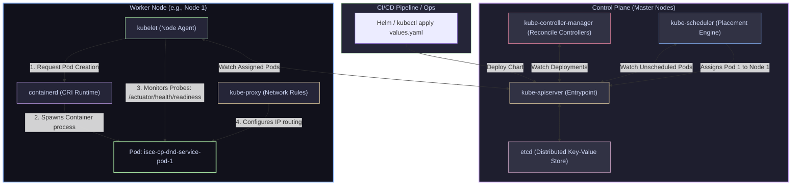

# 07 — Kubernetes Architecture: Control Plane, Nodes & The Reconciliation Loop

> **Why this is Topic 7:** When you deploy a microservice (like `isce-cp-dnd-service` in the `isce-cp-prod` namespace), you don't write scripts telling Kubernetes exactly *how* to allocate servers or run containers. Instead, you declare the *desired state* in a Helm chart (e.g., "I want 3 replicas of the JVM container, with 512Mi memory requests and 2Gi limits"). Kubernetes operates as a self-healing **declarative reconciliation system**. If a host node suffers hardware failure, the system eventually detects that the *actual state* (2 running pods) does not match the *desired state* (3 pods) and schedules a replacement. Crucially, this node-level recovery is **not instant**: the control plane must first wait out grace periods (mark the node `NotReady`, then evict its pods) before a ReplicaSet sees a shortfall — very different from a manual pod delete, which is replaced almost immediately (see §3.1). To design stable distributed services and debug deployment stuck states, you must master the architecture of the Control Plane, Node components, and how they coordinate via the reconciliation loop.

---

## 1. WHAT

Kubernetes is a split-architecture system composed of a central administrative **Control Plane** (Master Nodes) and a pool of execution servers called **Worker Nodes**.



### 1.1 The Control Plane (The Brain)
The Control Plane makes global decisions about the cluster (such as scheduling workloads) and responds to cluster events.
*   **`kube-apiserver`:** The REST API gateway. Every action (`kubectl` commands, CI/CD Helm releases, Kubelet reports) goes through the API server. It is stateless and acts as the gatekeeper, validating configurations and writing resource updates to storage.
*   **`etcd`:** A consistent, distributed key-value store. It stores the entire cluster configuration, resource specifications, and state. If `etcd` loses data, your cluster layout is gone. It uses the **Raft consensus algorithm** for replication.
*   **`kube-scheduler`:** The matchmaker. It watches the **API server** (never `etcd` directly — only the API server touches `etcd`) for newly created pods that have no node assigned. It filters nodes based on resource requests (e.g. requiring a node with 512Mi RAM for `isce-cp-dnd-service`), scores the matching nodes, and writes the selected node assignment back to the API server.
*   **`kube-controller-manager` (KCM):** The execution controller. It runs a collection of background control loops (Deployment controller, ReplicaSet controller, Node controller, Namespace controller). These loops continuously monitor the cluster's actual state (via the API server) and drive it toward the desired state.
*   **`cloud-controller-manager` (CCM):** The cloud-provider bridge. On managed clusters (GKE/EKS/AKS) it runs the loops that talk to the cloud API: the **node controller** (detects and finalizes deleted VMs so the corresponding Node objects are removed), the **service/LoadBalancer controller** (provisions an external L4 load balancer when you create a `type: LoadBalancer` Service), and the **route controller** (sets up pod-network routes in the cloud VPC). Splitting these out of the KCM lets Kubernetes core stay cloud-agnostic.

### 1.2 The Worker Nodes (The Brawn)
Worker Nodes run the containerized application pods.
*   **`kubelet`:** The node captain. A daemon running on every worker node. It registers the node with the API server, watches for Pods assigned to its host, and coordinates with the local container runtime to launch, monitor, and clean up containers.
*   **`kube-proxy`:** The network administrator. It runs on every node, reflecting services defined in the cluster. It manages routing rules (using `iptables` or `IPVS`) to forward traffic hitting a Service VIP directly to the target Pod IPs.
*   **Container Runtime:** The engine (e.g., `containerd`). Installs namespaces, mounts filesystems, and runs the container processes.

---

## 2. WHY (the trade-offs)

The declarative, controller-driven model of Kubernetes contrasts sharply with traditional imperative deployment scripts.

### 2.1 Imperative vs. Declarative Infrastructure

| Deployment Paradigm | Imperative Scripts (e.g., Ansible, SSH Loop) | Declarative Reconciliation (Kubernetes) |
| :--- | :--- | :--- |
| **User Command** | *"Run docker run on server 1, server 2, and server 3."* | *"Ensure 3 instances of image X are running somewhere."* |
| **Fault Tolerance** | **Low:** If server 2 crashes, the deployment script is unaware. Manual intervention or a monitoring trigger is required. | **High:** The controller detects the failure of pod 2 and immediately schedules a replacement. |
| **Configuration Drift** | **High:** If someone manually stops a process on server 1, the configurations are mismatched until the next script execution. | **Low for managed children:** Deleted or crashed Pods are recreated from controller specs. Manual edits to the desired spec itself require GitOps, policy, or review controls to revert. |
| **Complexity** | Simple to start, but scales poorly. Scripts must handle error branches and state transitions. | High initial learning curve and infrastructure complexity, but scales to millions of containers. |

---

## 3. HOW (the internals)

Let's analyze how the components interact under the hood during a deployment and how the reconciliation loop functions.

### 3.1 The Reconciliation Loop in Action

The core engine of Kubernetes is the **reconciliation loop** (or control loop). It is an infinite loop that constantly executes three steps:
1.  **Observe:** Read the actual state of the cluster by querying the **API server** (never `etcd` directly).
2.  **Compare:** Contrast the actual state against the desired state, also read from the API server (which persists it in `etcd`).
3.  **Act:** Execute API requests to resolve any differences.

$$\text{Desired State} \neq \text{Actual State} \implies \text{Controller executes correction}$$

#### Real-life Scenario: Pod Crash Recovery (pod-level, fast)
1.  A developer deploys `isce-cp-dnd-service` with `replicaCount: 3`. This configuration is saved via the API server into `etcd`.
2.  Pod 3 is deleted or its container process exits/crashes on an otherwise **healthy** node. The kubelet reports the change up to the API server, so the object count the controller sees drops.
3.  The **ReplicaSet Controller** watches the API server, sees the spec wants 3 pods but only 2 are `Running`. **Difference detected:** Desired (3) $\neq$ Actual (2).
4.  **Action:** The ReplicaSet controller calls the API server requesting the creation of a new Pod object (`isce-cp-dnd-service-xyz12`). The API server validates and persists this unscheduled Pod metadata to `etcd`.
5.  **Scheduling:** The **kube-scheduler** detects the new Pod with `nodeName: ""` (blank). It reads the resource requirements (request: 512Mi memory), filters out nodes that are overloaded, scores the remaining nodes, selects Node 2, and writes `nodeName: Node-2` to the Pod definition.
6.  **Node Execution:** The **kubelet** on Node 2 detects a Pod assigned to its node. It calls `containerd` via CRI to pull the image and start the container, updating the Pod status to `Running`.
7.  **Reconciliation complete:** Actual (3) == Desired (3). The loop returns to observing.

This whole cycle takes **seconds** — a container-crash or manual `kubectl delete pod` is replaced almost immediately.

#### Contrast: Node-Failure Recovery (node-level, grace-period-gated)
A pod on an **unreachable node** is *not* immediately replaced, because from the control plane's view the node has simply gone silent — the pods may well still be running and serving traffic. The controllers deliberately wait:
1.  The kubelet stops sending heartbeats (node `Lease` renewals stop).
2.  The **node-controller** (in the KCM) waits `node-monitor-grace-period` (**~40s**) before marking the Node `NotReady`.
3.  Pods on that node get a `NoExecute` taint; the eviction (the pod's `tolerationSeconds`, **default ~300s / 5 min**) must elapse before the pods are marked for deletion.
4.  Only once the old Pod objects are marked terminating does the **ReplicaSet** see Actual < Desired and create replacements (which then schedule per the fast loop above).

So node-failure recovery is on the order of **minutes**, not seconds. This grace-period gating is the classic trade-off: fast failover risks running two copies of a pod that isn't actually dead (dangerous for `ReadWriteOnce` volumes and singleton workloads).

---

### 3.2 Watch API & Resource Optimizations

Kubernetes components do not constantly poll the API server (polling millions of times per minute would crash the API server CPU). Instead, they use the **Watch API**.
*   When `kubelet` or a controller boots, it opens an HTTP connection to the API server with the parameter `?watch=true`.
*   The API server keeps the connection open. Whenever a resource of interest (e.g., a Pod or Service) is modified in `etcd`, the API server streams the update (an event like `ADDED`, `MODIFIED`, `DELETED`) down the open HTTP stream.
*   This push-based mechanism minimizes latency and allows controllers to react to state changes in milliseconds.

---

### 3.3 Level-Triggered vs. Edge-Triggered (why controllers self-heal)

This is the conceptual heart of the whole model. A controller could be written two ways:
*   **Edge-triggered:** react only to the *transition* (the event "Pod deleted"). If you miss the edge — the watch connection drops, the controller was restarting, the event was coalesced — you never act, and the cluster stays broken.
*   **Level-triggered:** react to the *current level* (the observed state "2 pods exist, 3 desired"). You don't care *how* you got here; each pass simply reconciles observed toward desired.

**Kubernetes controllers are level-triggered.** Watch events are used only as an *optimization* — a hint to wake up and reconcile sooner. Correctness never depends on any single event arriving. If an event is missed, the periodic **resync** re-lists everything from cache and the controller notices the drift anyway. This is why `kubectl delete`-ing a managed pod always heals, and why a controller can crash mid-loop and recover cleanly on restart.

**The client-go plumbing that makes this cheap:**
```
API Server ──watch──▶ Informer ──▶ Local Cache (Store/Indexer)  [read here, NOT the API server every loop]
                          │
                          └──▶ Work Queue ──▶ Controller reconcile(key)
```
*   **Informer:** does an initial `LIST` then a continuous `WATCH`, keeping a **local in-memory cache** in sync. Controllers read desired/actual state from this cache — cheap reads, no hammering the API server.
*   **Work queue:** events are turned into item keys (`namespace/name`) and queued. The queue **de-duplicates** (many events for one object collapse to one reconcile) and supports **rate-limited retries** with backoff on failure.
*   **Resync period:** every N minutes the informer re-delivers everything from cache into the queue, forcing a full reconcile — the safety net that turns "missed edge" into "eventually consistent level".

**Interview payoff:** "Kubernetes is eventually consistent and self-healing *because* controllers are level-triggered, cache-backed loops — not because they never miss an event."

---

## 4. CODE / EXAMPLES

Let's look at the actual Helm structures Maersk uses for declaring and applying these states.

### 4.1 Real-World Configuration: `values.yaml` vs. `deployment.yaml`

Here is a simplified version of the production configuration for `isce-cp-dnd-service`:

**The Desired Values (`values/prod/values.yaml`):**
```yaml
appName: isce-cp-dnd-service
replicaCount: 3
image: isce-cp-dnd-service:v2.1.0
product: isce-cp-dnd-service
vaultRole: isce-cp-prod
tenant:
  url: http://isce-tenant-service.isce-cp-prod.svc.cluster.local:8080
resources:
  requests:
    memory: 512Mi
    cpu: 100m
  limits:
    memory: 2Gi
    cpu: 500m
```

**The Deployment Template (`templates/deployment.yaml`):**
When you run `helm install`, Helm interpolates the variables from `values.yaml` into this template to write the raw manifest:

```yaml
apiVersion: apps/v1
kind: Deployment
metadata:
  name: {{ .Values.appName }}
  labels:
    app: {{ .Values.appName }}
    product: {{ .Values.product }}
spec:
  replicas: {{ .Values.replicaCount }}
  selector:
    matchLabels:
      app: {{ .Values.appName }}
  template:
    metadata:
      labels:
        app: {{ .Values.appName }}
      annotations:
        # Resolves secrets dynamically at runtime via Banzaicloud Vault Webhook
        vault.security.banzaicloud.io/vault-role: "{{ .Values.vaultRole }}"
    spec:
      containers:
        - name: {{ .Values.appName }}
          image: {{ .Values.image }}
          env:
            # Topic 6: Tuning JVM for container cgroup constraints
            - name: JAVA_TOOL_OPTIONS
              value: "-XX:MaxRAMPercentage=75.0"
            - name: TENANT_URL
              value: {{ .Values.tenant.url }}
          resources:
            requests:
              cpu: {{ .Values.resources.requests.cpu }}
              memory: {{ .Values.resources.requests.memory }}
            limits:
              cpu: {{ .Values.resources.limits.cpu }}
              memory: {{ .Values.resources.limits.memory }}
          livenessProbe:
            httpGet:
              path: /actuator/health/liveness
              port: 8080
            initialDelaySeconds: 10
            periodSeconds: 10
          readinessProbe:
            httpGet:
              path: /actuator/health/readiness
              port: 8080
            initialDelaySeconds: 10
            periodSeconds: 10
```

---

### 4.2 Simulating the Reconciliation Loop

To watch the reconciliation loop handle a crash, you can run these commands in your terminal:

```bash
# 1. Watch the pods for isce-cp-dnd-service in real-time
kubectl get pods -w -n isce-cp-prod

# 2. In another terminal, delete one of the running pods (simulating a crash)
kubectl delete pod isce-cp-dnd-service-7cfbb7b9c7-abcde -n isce-cp-prod

# 3. Observe the output of the watch terminal:
# isce-cp-dnd-service-7cfbb7b9c7-abcde   Running   →   Terminating
# isce-cp-dnd-service-7cfbb7b9c7-xyz12   Pending   →   ContainerCreating   →   Running
# Notice that the ReplicaSet controller instantly spawned a replacement pod
# before the old pod even finished terminating, keeping the pod count at 3!
#
# NOTE: this is the FAST pod-level path (manual delete on a healthy node).
# Killing the whole NODE instead would delay the replacement by minutes
# (node-monitor-grace-period ~40s + eviction timeout ~5min) — see §3.1.
```

---

## 5. INTERVIEW ANGLES

### Q: Why is etcd considered the single point of failure in a Kubernetes cluster? How does etcd maintain consistency?
**A:** `etcd` is the single source of truth for the entire cluster. It stores the state of every resource (Nodes, Pods, Deployments, ConfigMaps, Secrets, RBAC). If `etcd` is corrupted or destroyed, the control plane cannot determine what resources should exist, resulting in cluster failure (though running pods will temporarily keep running on the nodes, no new deployments or recoveries can occur).
*   **Consistency:** `etcd` uses the **Raft Consensus Algorithm** to maintain consistency across a multi-node cluster. It requires a **quorum** (more than 50% of the nodes active) to write updates. For example, a 3-node etcd cluster can tolerate 1 failure. If a network split occurs, the partition with the majority votes elects a leader and processes writes, while the minority partition rejects writes to prevent split-brain inconsistencies.

### Q: What is the sequence of events when a user runs `kubectl delete pod <pod-name>`? Trace the network path and node actions.
**A:** 
1.  **API Call:** The user runs the delete command. `kubectl` sends an HTTP `DELETE` request to the `kube-apiserver`.
2.  **Grace Period Allocation:** The API server validates permissions. It does not delete the pod from storage instantly. Instead, it marks the pod as `Terminating` and updates its `DeletionTimestamp`, setting a default 30-second grace period.
3.  **Watch Notification:** 
    *   The **Endpoint/Service Controller** receives the change event. It immediately removes the terminating pod's IP from the Service Endpoints list, preventing new traffic from routing to it.
    *   The **Kubelet** on the host node receives the `Terminating` watch event.
4.  **Node Grace Execution:** 
    *   The Kubelet invokes the container runtime to send a **`SIGTERM` (Signal 15)** to the container's entrypoint process (PID 1). This tells the Spring Boot application to stop accepting new requests, complete active transactions, and shut down gracefully.
5.  **Force Termination:** If the container process is still running after the grace period expires (e.g., 30s), the Kubelet sends a **`SIGKILL` (Signal 9)** to force-kill the processes.
6.  **Removal:** The Kubelet notifies the API server that the container has exited. The API server deletes the Pod record from `etcd`.

### Q: Why does the scheduler evaluate "requests" instead of "limits" when placing a Pod? What happens if a node's limits are overallocated?
**A:** 
*   **Requests:** The *guaranteed budget* a container needs to function. The scheduler uses requests (e.g. `512Mi` RAM for our service) to determine if a host node has enough unreserved capacity.
*   **Limits:** The *maximum ceiling* the container can reach.
*   **Overcommit:** Kubernetes allows scheduling even if the sum of all pod *limits* on a node exceeds the node's physical memory capacity (this is called **resource overcommit**, assuming not all pods will spike at the same time).
*   **The Risk:** If all pods on Node 1 experience traffic spikes and attempt to draw memory up to their limits, and the sum exceeds the host's actual physical RAM, the host suffers memory exhaustion. Two *distinct* mechanisms can fire here — don't conflate them:
    *   **Kernel OOM killer (per-process, reactive):** When physical memory is genuinely exhausted, the Linux kernel picks a victim *process* and `SIGKILL`s it. The choice is **not random** — it maximizes `oom_score`, which Kubernetes biases via `oom_score_adj` derived from the pod's **QoS class** (BestEffort is most killable, then Burstable, then Guaranteed). This surfaces to you as a container `OOMKilled` (exit 137), and the kubelet restarts it per `restartPolicy`. The kernel does **not** know about "nodes" or "pods".
    *   **kubelet node-pressure eviction (per-pod, proactive):** The **kubelet** — not the kernel — watches configured **eviction thresholds** (e.g. `memory.available < 100Mi`). When crossed, it proactively **evicts whole pods** (`SIGTERM` then delete) to reclaim resources *before* the kernel has to intervene, ranking victims by QoS class and then Pod `priority`. Evicted pods are rescheduled elsewhere by their controller.

---

## 6. ONE-LINE RECALL CARDS

*   **The API Server** is the stateless REST gatekeeper and the only component that writes to `etcd`.
*   **etcd** stores the entire cluster configuration and uses the Raft consensus algorithm to guarantee consistency.
*   **The Scheduler** matches unscheduled pods to nodes by evaluating resource requests, taints, and affinities.
*   **The Controller Manager** runs control loops that continuously reconcile actual cluster states with desired states.
*   **The Cloud Controller Manager** runs the cloud-specific loops: node lifecycle (finalizing deleted VMs), `type: LoadBalancer` provisioning, and VPC route setup.
*   **The Kubelet** runs on each worker node to deploy containers via CRI and monitor application health probes.
*   **Controllers are level-triggered** — they reconcile to the *observed* state, so a missed watch event self-heals on the next resync; watch events are just an optimization.
*   **Informer + local cache + work queue** let controllers read state cheaply from an in-sync cache and reconcile de-duplicated keys with rate-limited retries.
*   **Node-failure recovery is minutes, not instant** — node-controller waits ~40s (`node-monitor-grace-period`) to mark a node `NotReady`, then ~5min eviction timeout before the ReplicaSet replaces the pods; manual pod deletes are replaced in seconds.
*   **Kernel OOM killer** kills a *process* by `oom_score` (biased by QoS), yielding `OOMKilled`; **kubelet node-pressure eviction** proactively evicts whole *pods* at configured thresholds — different mechanisms.
*   **kube-proxy** manages IP routing tables (using iptables or IPVS) to make Services accessible across nodes.
*   **The Reconciliation Loop** continuously executes the three-step sequence: **Observe $\to$ Compare $\to$ Act**.
*   **The Watch API** uses open HTTP streams to push resource events to controllers, avoiding polling overheads.
*   **Deleting a Pod** triggers a `SIGTERM` first for graceful shutdown, followed by a `SIGKILL` if it outlasts the grace period.
*   **Scheduler placement** is strictly guided by resource **requests**, whereas resource **limits** manage runtime boundaries.

---

**Next:** [08 — Pods & the Kubernetes Object Model](08-pods-object-model.md) (pod lifecycle, init vs sidecar containers, pause container, declarative desired-state, labels/selectors).
