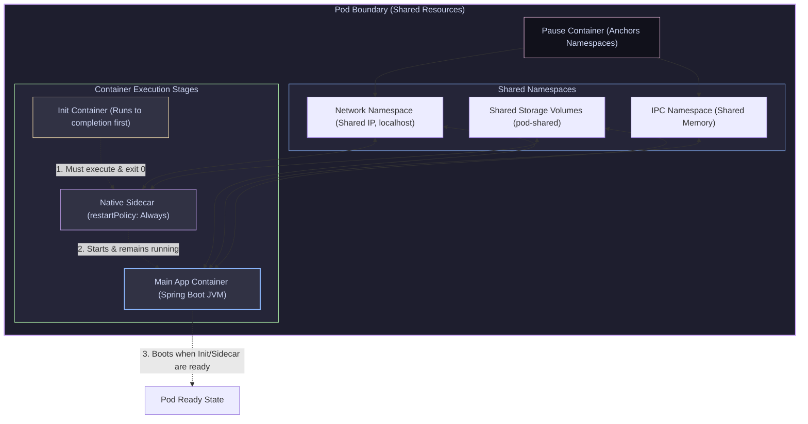

# 08 — Pods & the Object Model: Lifecycle, Init & Sidecars

> **Why this is Topic 8:** In Kubernetes, the Pod is the smallest deployable atomic unit. However, a Pod is not a container. A Pod is a wrapper around a collection of one or more containers that share network, storage, and IPC namespaces. Interviewers will push on the Pod lifecycle, the role of the **pause container**, and the startup ordering of Init vs Sidecar containers. Knowing how these work is essential for configuring startup sequences (like making sure a database connection is open before starting your JVM web server) and troubleshooting pods that get stuck in `ContainerCreating` or crash loops.

---

## 1. WHAT

A **Pod** represents a single instance of a running process in your cluster. It forms a logical host, sharing three critical resources among all its member containers:

1.  **Shared Network Namespace:** All containers in a Pod share the same IP address, port space, routing table, and loopback. Containers communicate with each other using `localhost` (e.g. your Java app can talk to a local database sidecar on `127.0.0.1:5432`).
2.  **Shared IPC (Interprocess Communication):** Containers can communicate via POSIX shared memory or message queues.
3.  **Shared Storage Volumes:** A volume is defined at the Pod level, but it is only shared among the containers that **explicitly `volumeMount` it** — a container that doesn't declare the mount doesn't see it. Two containers that both mount the same volume can share files through it (e.g. an app writing logs a sidecar tails).



---

## 2. WHY (the trade-offs)

Understanding when to bundle multiple containers in a single Pod versus splitting them into independent Pods is a critical architectural decision.

### 2.1 Single-Container Pod vs. Multi-Container Pod

| Feature | Single-Container Pod | Multi-Container Pod (Sidecar Pattern) |
| :--- | :--- | :--- |
| **Scaling** | Pods scale independently. Scaling the app doesn't scale helper utilities. | Coupled scaling. If you scale the app, you also scale the sidecar (consuming double memory). |
| **Port Conflicts** | Minimal. The app has exclusive access to the network namespace. | High. Sidecars and the app cannot bind to the same port on `localhost`. |
| **Data Sharing** | Network bound (communication over REST/gRPC IPs). | Direct local sharing via shared filesystems or memory (localhost). |
| **Operational Coupling** | Low. Teams manage their own services separately. | High. The sidecar container and main container must deploy and run together. |

---

## 3. HOW (the internals)

Let's look under the hood at how Kubernetes isolates and manages containers inside a single Pod.

### 3.1 The Pause Container: The Namespace Anchor

When `kubelet` receives the instructions to start a Pod, it does **not** launch your application container first. Instead, it launches the **`pause` container** (also known as the `infra` container).
*   The `pause` container is a tiny, compiled C program (historically Go) that does nothing except block and sleep forever, reaping zombie child processes and ignoring signals like `SIGTERM`.
*   Its sole job is to **anchor and hold the namespaces open**.
*   When Kubelet launches your application container, it instructs the container runtime (containerd) to join the network and IPC namespaces of the `pause` container.
*   *Why this matters:* If your Spring Boot application crashes, is OOMKilled, or restarts, its container is destroyed and recreated. However, because the `pause` container remains alive, the network namespace does not collapse. The restarted container immediately reconnects to the same IP address and routing layout, avoiding network re-binding latency.

---

### 3.2 Init Containers vs. Native Sidecars

Kubernetes runs containers in a strict sequence:

#### 1. Init Containers (Sequential Phase):
*   Init containers are meant for initialization work (such as migrations, waiting for external dependencies, or generating configuration files).
*   They run **sequentially, one-by-one, to completion**.
*   Each init container must exit with status `0` before the next one starts.
*   **On failure, the behavior depends on `restartPolicy`:**
    *   `Always` / `OnFailure`: the kubelet restarts the **failed init container in place** and retries *that* container (with backoff) until it succeeds. It does **not** re-run the earlier init containers — the sequence resumes from where it stalled. The already-completed init containers only re-run if the whole **pod sandbox** is recreated (e.g. node reboot, pause-container loss).
    *   `Never`: an init-container failure fails the **whole Pod** (phase `Failed`) with no restart.
*   Application containers do not start until all init containers have completed successfully.

#### 2. Native Sidecars (Kubernetes 1.28+):
Prior to version 1.28, sidecars (like log forwarders or service meshes) were configured as standard containers. This caused issues: standard containers start concurrently, meaning your app might boot and try to send traffic before the service mesh proxy sidecar was ready.
*   **The 1.28+ Solution:** Sidecars are now defined inside the `initContainers` block, but configured with `restartPolicy: Always`.
*   **Startup Lifecycle:** Kubelet starts the native sidecar container. Once its startup probe passes, Kubelet proceeds to start the next init container (or main application).
*   **Exit Lifecycle:** Standard init containers must exit. Native sidecars remain running alongside the main application. When the main container terminates (e.g. a Batch Job exits), Kubelet automatically sends a `SIGTERM` to the native sidecars to shut them down, solving the hung-job problem.

---

### 3.3 Pod Lifecycle Phases & Conditions

The lifecycle of a Pod is evaluated using two properties: **Phases** (a high-level summary of the Pod state) and **Conditions** (boolean status flags).

#### Pod Phases:
*   **`Pending`:** The Pod spec has been accepted by the API server, but it has not been scheduled yet (e.g., waiting for resource capacity, or image pulling is in progress).
*   **`Running`:** The Pod has been scheduled, and all containers have been created. At least one container is currently starting or running.
*   **`Succeeded`:** All containers inside the Pod have terminated successfully (exit code 0) and will not be restarted (common for Jobs/CronJobs).
*   **`Failed`:** All containers have terminated, and at least one container has exited in failure (non-zero exit code).
*   **`Unknown`:** The API server lost communication with the host Node's Kubelet (typically due to a network split).

#### Pod Conditions:
Every Pod has an array of status conditions:
*   `PodScheduled`: Pod has been successfully scheduled to a Node.
*   `Initialized`: All standard init containers have exited successfully (status `0`).
*   `ContainersReady`: All containers inside the Pod are running and have passed their startup/readiness checks.
*   `Ready`: The Pod is ready to accept traffic (and is added to the Service Endpoint list).

#### Container States (not the same as Pod Phases):
A Pod has a single high-level **phase**; each *container* inside it independently reports one of three **states** (seen under `status.containerStatuses[].state`). Interviewers probe this distinction because a Pod can be phase `Running` while a container inside it is stuck restarting.
*   **`Waiting`:** The container is not yet running — pulling its image, waiting on a dependency, or backing off after a crash. The `reason` field carries the detail (`ContainerCreating`, `ImagePullBackOff`, `CrashLoopBackOff`).
*   **`Running`:** The container is executing normally.
*   **`Terminated`:** The container finished (or was killed); exposes `exitCode`, `reason` (`Completed`, `OOMKilled`, `Error`), and start/finish times.

#### Common `Waiting` reasons (troubleshooting):
*   **`ImagePullBackOff`:** The kubelet couldn't pull the image (bad tag, private registry without `imagePullSecrets`, rate limit). It retries the pull with growing backoff — "BackOff" means it is *waiting between* pull attempts.
*   **`CrashLoopBackOff`:** The container starts, then exits/crashes repeatedly (bad config, missing dependency, failing liveness). The kubelet restarts it per `restartPolicy` but inserts an **exponential backoff delay** between restarts: **10s → 20s → 40s → … capped at 5 minutes**. The timer resets after a container stays up ~10 minutes. `CrashLoopBackOff` is the *waiting* state during that backoff delay, not the crash itself. (Deeper eviction/OOM handling is covered in Topic 16.)

---

## 4. CODE / EXAMPLES

### 4.1 Production Pod YAML: Init Containers & Native Sidecars (K8s 1.28+)

Here is a production-grade template demonstrating how to chain an init container (waiting for PostgreSQL database availability) and a native proxy sidecar (Banzaicloud Vault secret synchronizer) with the main Spring Boot app container:

```yaml
apiVersion: v1
kind: Pod
metadata:
  name: isce-cp-dnd-service-pod
  namespace: isce-cp-prod
  labels:
    app: isce-cp-dnd-service
spec:
  restartPolicy: Always
  containers:
    # 3. The Main Application Container (boots last)
    - name: isce-cp-dnd-service
      image: gcr.io/maersk-digital/isce-cp-dnd-service:v2.1.0
      ports:
        - containerPort: 8080
      resources:
        requests:
          memory: 512Mi
        limits:
          memory: 2Gi

  initContainers:
    # 1. Native Sidecar Container (starts first, runs forever)
    # Triggered by 'restartPolicy: Always' inside initContainers (K8s 1.28+)
    - name: vault-agent-sidecar
      image: hashicorp/vault:1.13.3
      restartPolicy: Always
      command: ["vault", "agent", "-config=/etc/vault/vault-agent-config.hcl"]
      volumeMounts:
        - name: vault-secrets
          mountPath: /vault/secrets

    # 2. Sequential Init Container (must run, verify DB connection, and exit)
    - name: wait-for-postgres
      image: busybox:1.36.1
      command:
        - sh
        - -c
        - |
          echo "Checking connection to PostgreSQL database..."
          until nc -z -w5 postgres-db.isce-cp-prod.svc.cluster.local 5432; do
            echo "PostgreSQL is not ready. Waiting..."
            sleep 2
          done
          echo "PostgreSQL is online!"

  volumes:
    - name: vault-secrets
      emptyDir: {}
```

---

### 4.2 Auditing Pod Conditions via JSONPath

To inspect the status conditions of a running Pod:

```bash
# Query the pod conditions using kubectl and jsonpath
kubectl get pod isce-cp-dnd-service-pod -n isce-cp-prod -o jsonpath='{.status.conditions}' | jq
# Output lists the boolean status flags:
# [
#   {
#     "type": "PodScheduled",
#     "status": "True",
#     "lastTransitionTime": "2026-07-13T02:34:00Z"
#   },
#   {
#     "type": "Initialized",
#     "status": "True",
#     "lastTransitionTime": "2026-07-13T02:34:10Z"
#   },
#   {
#     "type": "Ready",
#     "status": "True",
#     "lastTransitionTime": "2026-07-13T02:34:15Z"
#   }
# ]
```

---

## 5. INTERVIEW ANGLES

### Q: What is the "pause" container, and what happens if you run `kill -9` on the pause container process on the worker node?
**A:** The `pause` container is spawned by the container runtime to hold open the shared namespaces (Network, IPC) of the Pod. It runs a minimal C program that blocks forever and reaps zombies.
If you find the pause container PID on the host node and run `kill -9`:
1.  The container process exits, causing the container runtime to destroy the container object.
2.  The shared network and IPC namespaces collapse.
3.  The host Node's **Kubelet** detects that the infrastructure container of the Pod has died.
4.  Kubelet immediately terminates all other active containers in the Pod (e.g. your application JRE) to prevent them from running in a corrupted network state.
5.  Kubelet creates a new `pause` container to establish fresh namespaces, and restarts all application containers from scratch, attaching them to the new namespaces. (This results in a pod restart count increment).

### Q: Why do Init containers run sequentially, and what happens if one exits with a non-zero code?
**A:** Init containers are designed for prerequisites that must be completed in order. For example, Database Migration must finish before the Application starts. Therefore, they are run sequentially.
If an Init container exits with a non-zero code (e.g. `exit 1` because database connection timed out):
1.  The Kubelet detects the failure.
2.  With `restartPolicy: Always` or `OnFailure`, the kubelet restarts **the failed init container in place** (with backoff) and retries *that same* container. It does **not** re-run the earlier init containers, and it does **not** restart the whole Pod from the first init container — a common misconception. The sequence simply resumes once the stalled container succeeds. (The full sequence only re-runs if the entire pod sandbox is recreated, e.g. node reboot or pause-container loss.)
3.  With `restartPolicy: Never`, the init failure fails the **whole Pod** (phase `Failed`) — no retry.
4.  *Warning:* Because the failed init container is retried repeatedly, it must be **idempotent**. If it inserts records into a database and fails halfway, each retry re-runs it — non-idempotent logic yields duplicate-key errors or schema corruption. Always ensure init scripts are idempotent.

### Q: How did K8s 1.28 solve the "Sidecar Problem" for Batch Jobs?
**A:** Prior to 1.28, there was no native distinction between sidecars and application containers—both were defined in the `containers` list and started concurrently.
*   **The Job Problem:** In a Kubernetes Job (meant to run to completion and exit, like a data report generator), a sidecar container (like a log forwarder) runs in an infinite loop. When the main job container finished, the sidecar remained running forever. The Pod never transitioned to `Succeeded` phase, leaving the Job hanging in an active state.
*   **The 1.28+ Solution:** Native sidecars are defined under `initContainers` with `restartPolicy: Always`. Because they are marked as init, the Kubelet recognizes them. When the main application container exits, the Kubelet actively sends a `SIGTERM` to all running native sidecar init containers, terminating them and allowing the Pod to exit gracefully, transitioning the Job to `Succeeded`.

---

## 6. ONE-LINE RECALL CARDS

*   **A Pod** is a group of containers sharing the same Network, IPC, and Volume namespaces.
*   **The pause container** acts as the namespace anchor, ensuring Pod IPs survive application container restarts.
*   **Containers in a Pod** communicate with each other using `localhost` followed by their container ports.
*   **Init containers** execute sequentially to completion (exit code 0) *before* any app container starts.
*   **Native sidecars (K8s 1.28+)** are defined in `initContainers` using the flag `restartPolicy: Always`.
*   **Native sidecars terminate automatically** when the Pod's main application containers exit, resolving Batch Job hangs.
*   **The `Initialized` Pod condition** transitions to `True` only after all standard init containers have completed successfully.
*   **A failed init container is retried in place** (restartPolicy Always/OnFailure), not from the first init container; `Never` fails the whole Pod. It must be **idempotent** because it is re-run on each retry.
*   **Container STATES (Waiting/Running/Terminated) are per-container** and distinct from the single Pod PHASE — a Pod can be `Running` while a container inside it is `Waiting` in `CrashLoopBackOff`.
*   **`CrashLoopBackOff`** = kubelet backing off between restart attempts (10s→20s→…→5min cap); **`ImagePullBackOff`** = backing off between image-pull attempts.
*   **Removing a Pod's labels** detaches it from its managing Service and HPA, causing the controller to spawn a replacement.
*   **`kubectl get pod -o jsonpath`** allows query extraction of status conditions directly from the API response payload.

---

**Next:** [09 — Controllers & Deployments](09-controllers-deployments.md) (ReplicaSet, Deployment (rolling update / rollback), StatefulSet, DaemonSet, Job/CronJob).
