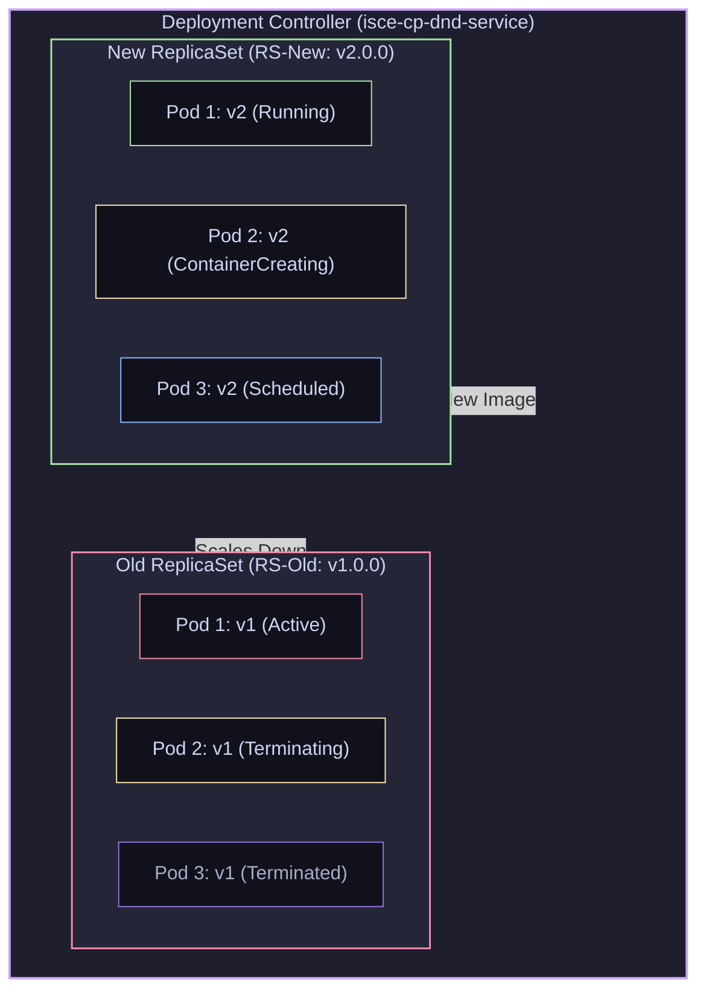

# 09 — Controllers: Deployments, ReplicaSets, StatefulSets & Rollouts

> **Why this is Topic 9:** You almost never deploy raw Pods directly in production. Instead, you manage Pods using Controllers. If a Pod is deleted manually, a controller immediately respawns it. SDE2s must master how different controllers manage application lifecycles. Interviewers love to focus on how **Deployments** orchestrate zero-downtime rolling updates, the difference between **Deployments** and **StatefulSets** (how database storage binds to specific pod replicas), and how to troubleshoot failed rollouts under production pressure.

---

## 1. WHAT

Kubernetes uses specialized controllers to manage Pod groups based on application state requirements:

1.  **Deployment:** The standard controller for stateless applications (like `isce-cp-dnd-service`). It acts as a wrapper around **ReplicaSets**, managing the rollout of new image versions, scaling, and rolling back configurations.
2.  **ReplicaSet:** A low-level controller that ensures a precise number of Pod replicas matching its label selector are active at any given time.
3.  **StatefulSet:** Designed for stateful systems (like database clusters or cache nodes). It guarantees stable network identities (`pod-0`, `pod-1`), persistent storage volumes locked to specific indices, and ordered sequential scaling.
4.  **DaemonSet:** Guarantees that all (or a selected subset of) nodes run exactly one copy of a Pod. Commonly used for infrastructure daemons like log collectors (fluentd) or monitoring agents.
5.  **Job & CronJob:** Runs workloads that terminate upon success (run-to-completion). A **Job** runs a task once, while a **CronJob** runs a Job on a recurring schedule.



---

## 2. WHY (the trade-offs)

Selecting the right controller depends on whether your service holds persistent state and how you handle deployment traffic during updates.

### 2.1 Deployment vs. StatefulSet

| Architectural Dimension | Deployment (Stateless) | StatefulSet (Stateful) |
| :--- | :--- | :--- |
| **Pod Identifiers** | Random, ephemeral hashes (e.g., `app-7cfbb7b9c7-abcde`). | Stable, ordinal names (e.g., `redis-0`, `redis-1`). |
| **Storage Binding** | Usually ephemeral or explicitly mounted. If multiple replicas reference the same PVC, they share that claim and must use a storage mode that supports it. | Individual PV mapped per Pod index via `volumeClaimTemplates`. |
| **Scaling Order** | Concurrent. All Pods are created/deleted simultaneously. | Sequential. Pod `N` starts only after `N-1` is Ready; terminates in reverse order. |
| **Service Discovery** | Fronted by a standard **ClusterIP** Service (one stable virtual IP, load-balanced across pods); `NodePort`/`LoadBalancer` are additional external-exposure types layered on top. | Direct pod-routing using a **Headless Service** (`clusterIP: None`, e.g. `redis-0.redis-svc`). |

### 2.2 RollingUpdate vs. Recreate Deployment Strategies

| Strategy | Downtime | Traffic State | Backward Compatibility |
| :--- | :--- | :--- | :--- |
| **`RollingUpdate`** | **Zero:** Old pods remain active while new pods spin up. | **Multi-Version:** Both v1 and v2 pods handle live requests simultaneously. | **Required:** DB schema and API structures must support both versions. |
| **`Recreate`** | **Yes:** Terminates all v1 pods before starting any v2 pods. | **Clean:** Only one version runs at any point in time. | Not required (useful when breaking changes prevent backward compatibility). |

---

## 3. HOW (the internals)

Let's study the execution logic of Deployments and StatefulSets under the hood.

### 3.1 Deployment Rolling Update Mechanics

When you deploy a new image version (e.g., `v2.1.0` of `isce-cp-dnd-service`), the Deployment Controller executes a rolling transition using two crucial settings:

*   **`maxSurge`:** Limits the number of Pods that can be created above the desired replica count during the update. Can be an absolute number (e.g., `1`) or a percentage (`25%`).
*   **`maxUnavailable`:** Limits the number of Pods that can be taken offline during the update.
*   *(Maersk prod values: `maxUnavailable: 50%`, `maxSurge: 1`)*

#### Step-by-Step Rolling Update Flow (Desired Replicas = 3, MaxSurge = 1, MaxUnavailable = 50%):
1.  **New ReplicaSet Spawned:** The deployment controller registers a new ReplicaSet (`RS-New`) with the updated image spec.
2.  **Surging Up:** `RS-New` scales up. It creates 1 new Pod (`Pod-New-1`), bringing total Pods temporarily to 4 (Desired 3 + MaxSurge 1).
3.  **Scaling Down:** The controller scales down the old ReplicaSet (`RS-Old`). Because `maxUnavailable: 50%` allows up to 1.5 pods (rounded down to 1) to be down, it deletes 1 old Pod (`Pod-Old-3`).
4.  **Readiness Checks:** Once `Pod-New-1` passes its readiness probe, the controller marks it as active, routes traffic to it, and deletes another old Pod (`Pod-Old-2`).
5.  **Compounding Transitions:** The loop repeats: `RS-New` spawns `Pod-New-2`, and once it is ready, the final old Pod is terminated.
6.  **Compacting History:** `RS-Old` is retained with `replicas: 0` to preserve the revision history, enabling immediate rollbacks.

---

### 3.2 StatefulSet Volume Allocation

If you scale a Deployment containing database pods, all pods mount the same shared network storage. In a StatefulSet, each pod gets its own private volume using a **`volumeClaimTemplate`**:
1.  When you declare a StatefulSet `db-cluster` with `replicas: 3`, Kubernetes creates Pods in the order: `db-cluster-0` $\to$ `db-cluster-1` $\to$ `db-cluster-2`.
2.  For `db-cluster-0`, the StatefulSet controller automatically provisions a Persistent Volume Claim (PVC) named `data-db-cluster-0` and binds it to a dedicated Persistent Volume (PV).
3.  For `db-cluster-1`, it provisions a completely separate PVC `data-db-cluster-1`.
4.  **Recovery depends critically on *how* the pod was lost** — a classic interview probe:
    *   **Crash on a still-healthy node:** the controller recreates `db-cluster-1` (same name) and re-binds it to the exact same PVC `data-db-cluster-1`, preserving the database state. This is fast.
    *   **Hosting node becomes UNREACHABLE:** the StatefulSet controller will **NOT** automatically create a replacement. Because the node is merely silent (not provably dead), the old `db-cluster-1` pod might still be running and holding the `ReadWriteOnce` volume. Spinning up a second `db-cluster-1` on another node would mean **two pods writing the same volume → data corruption**. StatefulSets prioritize at-most-one semantics over availability. The pod sits in `Terminating` indefinitely, and recovery requires the old pod to be *fully* removed: either the Node object is deleted (the node truly left), or an operator force-deletes the pod (`kubectl delete pod db-cluster-1 --grace-period=0 --force`) — after being certain the old kubelet is really gone — or the node simply returns.

---

### 3.3 Detecting a Stuck Rollout

A rolling update isn't guaranteed to succeed — a bad image or a broken readiness probe can leave it hanging. Kubernetes surfaces this without you watching pod-by-pod:
*   **`progressDeadlineSeconds`** (default **600s**): if the Deployment makes *no progress* (no new pods becoming Ready) within this window, the controller sets the Deployment condition `Progressing=False` with reason `ProgressDeadlineExceeded`. Note this **flags** the rollout as failed — it does **not** auto-rollback; you still run `kubectl rollout undo`.
*   **`kubectl rollout status`** watches that condition: it blocks and streams progress while the rollout advances, and **exits non-zero** once `ProgressDeadlineExceeded` fires. This is what CI/CD pipelines gate on — a non-zero exit fails the deploy step and triggers an automated rollback.
*   **A bad readiness probe STALLS rather than fails:** if new pods start but their readiness probe never passes, those pods never become Ready, so `maxUnavailable` refuses to let the controller delete more old pods. The rollout **freezes half-done** — new pods `Running` but `0/1 Ready`, old pods still serving — until the progress deadline finally trips it. (A crashing container, by contrast, produces `CrashLoopBackOff` pods.) The old version keeps serving traffic the whole time, which is exactly the safety the rolling strategy buys you.

---

### 3.4 PodDisruptionBudget (PDB): Protecting Availability

`maxUnavailable`/`maxSurge` govern *voluntary rollouts driven by the controller*. A **PodDisruptionBudget** protects a workload during **other voluntary disruptions** — node drains for maintenance/upgrades (`kubectl drain`), cluster autoscaler scale-downs, etc.
*   You declare either `minAvailable: 2` or `maxUnavailable: 1` for a label selector.
*   The **eviction API** (used by `kubectl drain`) checks the PDB before removing a pod: if evicting it would violate the budget, the eviction is **blocked/retried**, so a drain waits rather than taking the service below its floor.
*   **Key limitation:** PDBs only constrain *voluntary* disruptions. They do **not** protect against involuntary ones (hardware failure, kernel OOM, node crash) — nothing can, since those aren't mediated by the API server.

```yaml
apiVersion: policy/v1
kind: PodDisruptionBudget
metadata:
  name: journeycache-redis-pdb
  namespace: isce-cp-prod
spec:
  minAvailable: 2            # never let fewer than 2 redis pods be up during a drain
  selector:
    matchLabels:
      app: journeycache-redis
```

---

### 3.5 Job Semantics (run-to-completion knobs)

A **Job** runs pods until a target number succeed, then stops. The behavior is tuned by four fields:
*   **`completions`**: how many pods must exit `0` for the Job to be `Complete` (default 1).
*   **`parallelism`**: how many pods may run at once (default 1). `completions: 10, parallelism: 3` = process 10 work items, 3 at a time.
*   **`backoffLimit`** (default **6**): how many pod-level failures/retries are tolerated before the Job is marked `Failed`. Retries use exponential backoff (capped at 6 min).
*   **`activeDeadlineSeconds`**: hard wall-clock cap on the whole Job. Once exceeded, the Job is terminated and marked `Failed` **regardless of `backoffLimit`** — it takes precedence, useful for killing a hung job.

---

### 3.6 DaemonSet Update Strategies

DaemonSets (one pod per node) support two `updateStrategy` types:
*   **`RollingUpdate`** (default): the controller updates DaemonSet pods node-by-node, honouring **`maxUnavailable`** (and, in newer versions, `maxSurge`) so only a bounded number of nodes are disrupted at once. Good for log/metrics agents where brief per-node gaps are acceptable.
*   **`OnDelete`**: the controller does **not** touch existing pods on a spec change — a new pod is created only when you **manually delete** the old one on a node. This gives operators node-by-node control, used for sensitive infra daemons (CNI/storage plugins) where uncontrolled rollout is risky.

---

## 4. CODE / EXAMPLES

### 4.1 Production StatefulSet Template (Redis Cluster Example)

Here is a StatefulSet declaration demonstrating how to configure ordered startup and dynamic volume mappings:

```yaml
# --- The Headless Service (clusterIP: None) that gives the pods stable DNS ---
# This MUST exist for the StatefulSet's serviceName reference to resolve.
apiVersion: v1
kind: Service
metadata:
  name: redis-headless-service
  namespace: isce-cp-prod
spec:
  clusterIP: None          # <-- headless: no VIP, DNS returns individual pod IPs
  selector:
    app: journeycache-redis
  ports:
    - port: 6379
      name: redisport
---
apiVersion: apps/v1
kind: StatefulSet
metadata:
  name: journeycache-redis
  namespace: isce-cp-prod
spec:
  serviceName: redis-headless-service  # Must match the headless Service name above
  replicas: 3
  selector:
    matchLabels:
      app: journeycache-redis
  template:
    metadata:
      labels:
        app: journeycache-redis
    spec:
      containers:
        - name: redis
          image: redis:7.0-alpine
          ports:
            - containerPort: 6379
              name: redisport
          volumeMounts:
            - name: redis-db-data
              mountPath: /data
  # Dynamic PVC generator
  volumeClaimTemplates:
    - metadata:
        name: redis-db-data
      spec:
        accessModes: [ "ReadWriteOnce" ]
        resources:
          requests:
            storage: 10Gi
```

This configuration ensures:
*   Three pods are created sequentially: `journeycache-redis-0`, `journeycache-redis-1`, `journeycache-redis-2`.
*   A Headless Service maps them to stable DNS entries (e.g. `journeycache-redis-0.redis-headless-service.isce-cp-prod.svc.cluster.local`).

---

### 4.2 Production Triage Commands for Rollouts

Use these commands to manage deployment rollouts and handle failures:

```bash
# 1. Update the image of a Deployment
kubectl set image deployment/isce-cp-dnd-service isce-cp-dnd-service=gcr.io/maersk-digital/isce-cp-dnd-service:v2.2.0 -n isce-cp-prod

# 2. Check the real-time status of the rolling update
kubectl rollout status deployment/isce-cp-dnd-service -n isce-cp-prod

# 3. View the list of deployment revisions
kubectl rollout history deployment/isce-cp-dnd-service -n isce-cp-prod

# 4. Rollback to the previous version immediately if new version crashes
kubectl rollout undo deployment/isce-cp-dnd-service -n isce-cp-prod

# 5. Rollback to a specific historical revision
kubectl rollout undo deployment/isce-cp-dnd-service --to-revision=2 -n isce-cp-prod
```

---

## 5. INTERVIEW ANGLES

### Q: Walk me through what happens to the ReplicaSets when you trigger a rollback using `kubectl rollout undo`.
**A:** When you run `kubectl rollout undo`:
1.  The Deployment Controller reads the target revision number (or selects the immediate predecessor if unspecified) from the annotations stored in the deployment's history.
2.  It extracts the Pod template definition matching that historical revision.
3.  The controller does **not** create a new ReplicaSet. Instead, it locates the **existing old ReplicaSet** (`RS-Old`) that matches the target revision (the one currently scaled to 0).
4.  The controller updates the Deployment's active spec to match `RS-Old`'s template.
5.  It triggers the rolling update loop in reverse: scaling up `RS-Old` (creating pods with the older image) and scaling down the failed `RS-New` (deleting the crashing pods) according to `maxSurge` and `maxUnavailable` settings.

### Q: What is the "Headless Service" in a StatefulSet, and why is it necessary?
**A:** A standard Kubernetes Service has a single Virtual Cluster IP. It acts as a load balancer, routing traffic randomly to any matching backing pods.
*   **The Problem:** For stateful clusters (like Redis Sentinel or a PostgreSQL primary-replica setup), applications need to connect to *specific* nodes (e.g. sending writes to the primary, reads to replicas). A random load balancer breaks this.
*   **The Headless Solution:** A Headless Service is created by setting `clusterIP: None` in the Service spec. When an application queries the DNS server for a headless service (e.g., `redis-headless-service`), the DNS server does not return a single VIP. Instead, it returns the **list of all individual Pod IPs** mapped to the service. Combining this with the StatefulSet's stable ordinal naming allows the client to resolve and connect directly to a specific instance, such as `journeycache-redis-0.redis-headless-service`.

### Q: If a CronJob takes 5 minutes to run, but is scheduled to run every 1 minute, what happens? How do you prevent overlapping executions?
**A:** By default, Kubernetes will spawn a new Job container every 1 minute, leading to overlapping executions where up to 5 concurrent jobs run at the same time, potentially causing database deadlocks or resource starvation.
*   **The Solution:** You configure the **`concurrencyPolicy`** setting in the CronJob spec:
    1.  **`Allow` (Default):** Runs jobs concurrently.
    2.  **`Forbid`:** Prevents overlapping runs. If the previous run is still active, the scheduler skips the new execution.
    3.  **`Replace`:** Cancels the currently running job and starts a new instance to replace it.

---

## 6. ONE-LINE RECALL CARDS

*   **Deployments** manage stateless Pod lifecycle rollouts by wrapping and controlling low-level **ReplicaSets**.
*   **StatefulSets** guarantee stable pod hostnames (`pod-0`, `pod-1`) and ordered sequential startup and shutdown.
*   **`volumeClaimTemplates`** bind unique, persistent storage volumes to each individual StatefulSet pod index.
*   **`maxSurge`** limits the number of extra pods created above the desired count during a rolling update.
*   **`maxUnavailable`** controls the maximum number of pods that can be taken offline during a rollout.
*   **`kubectl rollout undo`** rolls back a deployment by scaling up the corresponding historical ReplicaSet.
*   **A Headless Service (`clusterIP: None`)** returns direct Pod IPs, enabling routing to specific StatefulSet nodes.
*   **DaemonSets** run exactly one pod instance per node, commonly used for logging and monitoring agents; update via `RollingUpdate` (bounded by `maxUnavailable`) or `OnDelete` (manual per-node).
*   **`concurrencyPolicy: Forbid`** prevents a CronJob from spawning overlapping executions if a run exceeds its interval.
*   **Old ReplicaSets are retained** with `replicas: 0` to preserve the configuration templates for future rollbacks.
*   **A StatefulSet pod is NOT auto-replaced when its node is unreachable** — risk of two pods on one RWO volume; recovery needs the node to return, the Node object deleted, or a force-delete. A crash on a *healthy* node reschedules normally.
*   **Default in-cluster fronting is a ClusterIP Service** (one VIP, load-balanced); `NodePort`/`LoadBalancer` are external-exposure types on top; headless (`clusterIP: None`) returns pod IPs.
*   **`progressDeadlineSeconds`** (default 600s) flags a stalled rollout as `ProgressDeadlineExceeded`; `kubectl rollout status` exits non-zero on it — but there is no auto-rollback.
*   **A bad readiness probe STALLS a rollout** (new pods never Ready, `maxUnavailable` blocks further progress) rather than failing fast; the old version keeps serving.
*   **PodDisruptionBudget** (`minAvailable`/`maxUnavailable`) guards availability during *voluntary* disruptions (node drains, autoscaler) — not against involuntary node/hardware failure.
*   **Job knobs:** `completions` (successes needed), `parallelism` (concurrency), `backoffLimit` (default 6 retries → `Failed`), `activeDeadlineSeconds` (hard time cap, overrides backoffLimit).

---

**Next:** [10 — Scheduling & Resource Management](10-scheduling-resources-qos.md) (requests/limits, QoS classes, node/pod affinity, taints/tolerations, eviction & OOMKills, CPU throttling).
