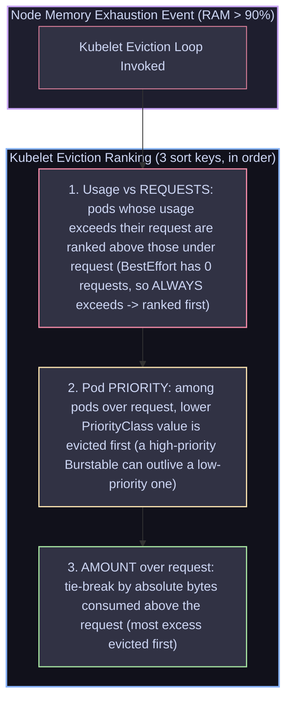

# 10 — Scheduling & Resource Management: Requests, Limits, QoS & OOMKills

> **Why this is Topic 10:** Resource allocation and scheduling constraints are the primary source of application instability in production. A pod can get stuck in `Pending` because scheduling rules are too restrictive, or it can get terminated at 2:00 AM with an `OOMKilled` status. SDE2s must master the mechanics of CPU and memory resource bounds, how Kubernetes assigns **QoS (Quality of Service) classes** based on those bounds, and how the scheduler uses affinity, taints, and tolerations to place workloads.

---

## 1. WHAT

Kubernetes uses resource specifications and placement constraints to determine where and how pods run:

1.  **Requests:** The minimum amount of CPU and Memory guaranteed to a container. The scheduler uses requests (not limits) to calculate if a node has enough room to run a Pod.
2.  **Limits:** The maximum CPU and Memory boundary a container can consume. Exceeding memory limits triggers a crash, while exceeding CPU limits triggers execution throttling.
3.  **QoS Classes:** Categories assigned automatically by Kubernetes based on requests and limits to prioritize Pod survival during host resource starvation:
    *   **Guaranteed:** Every container in the Pod has identical requests and limits for both CPU and memory.
    *   **Burstable:** At least one container has requests that are less than limits, or defines requests without limits.
    *   **BestEffort:** No containers have requests or limits configured.
4.  **Affinity & Anti-Affinity:** Rules that direct the scheduler to place Pods near (affinity) or away from (anti-affinity) specific nodes or other Pods (e.g. preventing two payment service replicas from sharing a node).
5.  **Taints & Tolerations:** Taints are applied to Nodes to *repel* workloads; Tolerations are applied to Pods to allow them to schedule on tainted nodes (used to restrict nodes to database workloads or GPU tasks).



---

## 2. WHY (the trade-offs)

Configuring resource boundaries requires balancing node efficiency against application stability.

### 2.1 Guaranteed vs. Burstable QoS Configurations

| Aspect | Guaranteed Class (Req == Limit) | Burstable Class (Req < Limit) |
| :--- | :--- | :--- |
| **Node Resource Packing** | **Low:** Leaves unused host memory reserved, leading to higher cloud costs. | **High:** Allows overcommitting host memory, squeezing more pods onto one node. |
| **Eviction Risk** | **Minimum:** Kubelet only evicts these pods if the host OS itself is about to crash. | **Medium-High:** Targeted for termination if the node runs out of memory. |
| **Performance Profile** | **Predictable:** The CPU and memory budgets are statically dedicated to the process. | **Variable:** CPU can be throttled, and memory allocations can stall under host pressure. |
| **Best Used For** | Critical datastores (Postgres, Redis) or latency-sensitive gateway proxies. | Standard stateless backend APIs (`isce-*` microservices). |

---

## 3. HOW (the internals)

Let's explore how Kubernetes schedules workloads and handles resource limits under load.

### 3.1 The Scheduling Flow

The `kube-scheduler` assigns pods in a two-stage sequence:

1.  **Filtering (Predicates):** The scheduler scans all nodes to find those that can fit the Pod. It evaluates:
    *   *Resource fit:* Does the node have enough unreserved CPU/memory to satisfy the Pod's **requests**?
    *   *Taints:* Does the node have taints that the Pod does not tolerate?
    *   *Node Selector/Affinity:* Does the node labels match the Pod's node requirements?
    *   *`required` Affinity/Anti-Affinity + Topology Spread (`DoNotSchedule`):* These are hard predicates — a node that would violate a `requiredDuringScheduling` anti-affinity rule (or a `whenUnsatisfiable: DoNotSchedule` spread constraint) is filtered OUT entirely, not merely down-scored.
2.  **Scoring (Priorities):** The scheduler ranks the surviving nodes to select the best destination. It scores nodes based on:
    *   *Resource balance:* Spreading workloads so nodes are evenly utilized.
    *   *Image availability:* Scoring a node higher if it has already cached the target container image.
    *   *`preferred` Affinity/Anti-Affinity + Topology Spread (`ScheduleAnyway`):* Only the *soft* (`preferredDuringScheduling` / `ScheduleAnyway`) variants act as scores — the scheduler nudges toward nodes that satisfy them but will still place the Pod if none do.

---

### 3.2 OOMKills: Container-level vs. Node-eviction

When a Pod consumes too much memory, it is terminated via one of two distinct mechanisms:

#### 1. Container-level OOM (Cgroup Limit Exceeded):
*   **The Cause:** The container process's memory Resident Set Size (RSS) exceeds its specified `limits.memory` (translating to cgroup `memory.max`).
*   **The Action:** The host Linux kernel's cgroup memory controller detects the violation, invokes the OOM killer, and sends a **`SIGKILL` (Exit Code 137)** to the container process.
*   **The Result:** The pod status shows `OOMKilled`, but the Pod **remains scheduled on the same node**. Kubelet restarts the container locally (subject to the container restart policy).

#### 2. Node-level OOM (Kubelet Eviction):
*   **The Cause:** The host node runs out of physical memory (e.g. available memory drops below Kubelet's threshold, typically `memory.available < 100Mi`).
*   **The Action:** The `kubelet` steps in *before* the kernel crashes. It ranks all active pods on the node by their QoS class and resource consumption.
*   **The Result:** Kubelet evicts (terminates) the selected Pod. The Pod's status transitions to `Failed` with reason `Evicted`, and it is deleted from the node. The control plane reschedule loop then spawns a replacement on a different host.

---

### 3.3 CPU Limits & Throttling (CFS Bandwidth Control)

Memory is an **incompressible resource** (exceeding limits crashes the application). CPU is a **compressible resource**:
*   If a container reaches its `limits.cpu` (e.g., `500m`, translating to 50ms execution time per 100ms CFS period), the kernel does **not** terminate it.
*   Instead, the Completely Fair Scheduler (CFS) **throttles** the container, pausing its threads for the remainder of the 100ms window.
*   *Performance Impact:* Throttling causes dramatic response latency spikes (e.g. a Spring Boot API request that normally takes 10ms suddenly stalls for 70ms waiting for the next scheduler period).
*   *Operational best practice:* Many organizations configure CPU requests to guarantee bandwidth, but **disable CPU limits** completely to prevent throttling latency spikes during temporary traffic surges.

---

### 3.4 How Requests & Limits Map to cgroups

Requests and limits are not just scheduler bookkeeping — the kubelet translates them into Linux **cgroup** parameters on the node:

*   **CPU request → `cpu.shares` (cgroup v1) / `cpu.weight` (cgroup v2):** A *relative weight* for the CFS scheduler. A container requesting `100m` gets ~102 shares (v1) / a proportional weight (v2). Shares only matter **when the CPU is contended**: if two containers both want the CPU, the kernel splits time in proportion to their shares. Idle CPU is free for anyone to burst into. This is why a CPU request guarantees a *floor* of bandwidth without capping the ceiling.
*   **CPU limit → `cpu.cfs_quota_us` / `cpu.max`:** The hard ceiling enforced by CFS bandwidth control (the throttling from §3.3).
*   **Memory request → (no hard cgroup enforcement):** used by the scheduler and as the eviction ranking baseline; not a cgroup limit.
*   **Memory limit → `memory.limit_in_bytes` / `memory.max`:** the hard ceiling whose breach triggers the container-level OOM kill (§3.2).

---

### 3.5 Topology Spread Constraints (the modern spreading mechanism)

`podAntiAffinity` with `topologyKey: hostname` is the *old* way to spread replicas — it is coarse (one-per-node, or nothing) and expensive to evaluate at scale. The **recommended** modern mechanism is `topologySpreadConstraints`, which lets you cap the *skew* (imbalance) of matching pods across any topology domain (nodes, zones, regions):

```yaml
spec:
  topologySpreadConstraints:
    - maxSkew: 1                         # max allowed difference in pod count between domains
      topologyKey: topology.kubernetes.io/zone
      whenUnsatisfiable: DoNotSchedule   # hard predicate (a FILTER); use ScheduleAnyway for a soft score
      labelSelector:
        matchLabels:
          app: isce-cp-dnd-service
```

*   `maxSkew: 1` across zones keeps replicas evenly balanced (e.g. 2/2/2 across 3 zones, never 4/1/1).
*   `whenUnsatisfiable: DoNotSchedule` makes it a scheduling **filter**; `ScheduleAnyway` makes it a soft **score** (see §3.1).
*   Unlike anti-affinity's all-or-nothing "one per node", spread constraints express graceful, quantitative balance — the reason they superseded anti-affinity for HA spreading.

---

### 3.6 PriorityClass & Preemption

A `PriorityClass` assigns an integer priority to pods. It drives two behaviours:

```yaml
apiVersion: scheduling.k8s.io/v1
kind: PriorityClass
metadata:
  name: isce-critical
value: 1000000
globalDefault: false
description: "Business-critical isce-* services"
```

*   **Scheduling order:** higher-priority pending pods are placed before lower-priority ones.
*   **Preemption:** if a high-priority pod cannot be scheduled anywhere, the scheduler will **evict (preempt) lower-priority running pods** to free room. This is distinct from node-pressure eviction (§3.2) — preemption is scheduler-driven at admission time, not kubelet-driven under resource starvation.
*   Priority is also the **second sort key** in node-pressure eviction (§5, Q1), so it can invert the naive QoS order.

---

### 3.7 LimitRange & ResourceQuota (namespace governance)

Two objects let platform teams enforce resource policy per namespace:

*   **`LimitRange`:** sets **per-Pod/per-container** defaults and bounds — e.g. a default `requests`/`limits` applied when a container omits them, plus min/max ceilings. Ensures no BestEffort pods sneak in and no single container requests absurd amounts.
*   **`ResourceQuota`:** caps the **aggregate** consumption of a whole namespace — total CPU/memory requests + limits, and object counts (e.g. max 50 pods, max 10 Services). Once the quota is hit, further pods are rejected at admission.

```yaml
apiVersion: v1
kind: ResourceQuota
metadata:
  name: isce-cp-prod-quota
  namespace: isce-cp-prod
spec:
  hard:
    requests.cpu: "20"
    requests.memory: 40Gi
    limits.cpu: "40"
    limits.memory: 80Gi
    pods: "100"
```

*Note:* if a namespace has a `ResourceQuota` on `requests`/`limits`, every pod **must** declare them (else admission fails) — a common cause of "pod rejected" surprises.

---

## 4. CODE / EXAMPLES

### 4.1 Production Pod Spec: Burstable QoS, Anti-Affinity & Tolerations

Here is a production-grade template for `isce-cp-dnd-service`. It places the pod in the **Burstable** class, uses Pod Anti-Affinity to prevent replicas from running on the same node, and tolerates a spot-instance node taint:

```yaml
apiVersion: apps/v1
kind: Deployment
metadata:
  name: isce-cp-dnd-service
  namespace: isce-cp-prod
spec:
  replicas: 3
  selector:
    matchLabels:
      app: isce-cp-dnd-service
  template:
    metadata:
      labels:
        app: isce-cp-dnd-service
    spec:
      # Pod Anti-Affinity: Distribute replicas across nodes for high availability
      affinity:
        podAntiAffinity:
          requiredDuringSchedulingIgnoredDuringExecution:
            - labelSelector:
                matchExpressions:
                  - key: app
                    operator: In
                    values:
                      - isce-cp-dnd-service
              topologyKey: "kubernetes.io/hostname"  # Prevents SCHEDULING a second replica onto a node already running one (a filter — it never evicts a running pod)

      # Tolerations: Allow scheduling on spot-instance nodes
      tolerations:
        - key: "sku"
          operator: "Equal"
          value: "spot"
          effect: "NoSchedule"

      containers:
        - name: isce-cp-dnd-service
          image: gcr.io/maersk-digital/isce-cp-dnd-service:v2.1.0
          # Burstable QoS: Requests < Limits
          resources:
            requests:
              memory: 512Mi
              cpu: 100m
            limits:
              memory: 2Gi
              cpu: 500m
```

---

### 4.2 Auditing Resource Allocations & Throttling

To diagnose if your pods are being throttled or are close to OOM limits:

```bash
# 1. Check pod QoS class and resource requests/limits
kubectl get pod -l app=isce-cp-dnd-service -n isce-cp-prod -o jsonpath='{.items[*].status.qosClass}'
# Output: Burstable

# 2. Check real-time resource utilization of Pods on the node
kubectl top pods -n isce-cp-prod

# 3. Check for kernel eviction events in the node logs
kubectl describe node node-2 | grep -A 5 "Conditions"
# Look for: MemoryPressure = True/False

# 4. Check for CPU throttling inside the container (if shell is available)
# Access the cgroup statistics file
cat /sys/fs/cgroup/cpu.stat
# Output includes:
# nr_periods 145020      # Total scheduler periods elapsed
# nr_throttled 20302     # Number of periods where the process was suspended
# throttled_usec 1024300 # Total time spent in throttled state (in microseconds)
# (If nr_throttled is high relative to nr_periods, your CPU limits are too low!)
```

---

## 5. INTERVIEW ANGLES

### Q: Explain the exact eviction order when a Node enters MemoryPressure. How is the victim pod selected?
**A:** QoS class is *not* the primary sort key — that is a common misconception. When a node's available memory drops below the eviction threshold (e.g. `memory.available < 100Mi`), Kubelet ranks candidate pods by **three keys, in strict order**:
1.  **Does usage exceed REQUESTS?** Pods whose resource usage is over their request are ranked ahead of pods still under request. BestEffort pods have **zero** requests, so their usage always exceeds request — which is *why* they are effectively evicted first. QoS only *correlates* with the outcome; it is not itself the sort key.
2.  **Pod PRIORITY:** Among the pods over their request, Kubelet evicts the one with the **lower `PriorityClass` value** first. This can invert the naive QoS order — a high-priority **Burstable** pod can outlive a lower-priority Burstable (or even a lower-priority pod of a "better" QoS class).
3.  **AMOUNT over request:** As the final tie-break, Kubelet compares the **absolute amount** (e.g. bytes of memory) each pod is consuming *above its request* and evicts the biggest offender first. For example, a pod with `request: 100Mi` consuming `500Mi` (400Mi over) is evicted before one with `request: 1Gi` consuming `1.1Gi` (100Mi over).
*   **System Pods Protection:** Static/mirror pods and pods with very high priority (e.g. `system-node-critical` CNI daemon, CoreDNS) are ranked last and are practically never evicted.

### Q: Why does Node Affinity use the phrase "IgnoredDuringExecution"?
**A:** Node Affinity specifies placement rules. The phrase consists of two parts:
1.  **Scheduling Phase:** Rules are evaluated (either `required` or `preferred`) when placing the Pod.
2.  **Execution Phase ("IgnoredDuringExecution"):** If a Pod is running on Node A, and later Node A's labels change so it no longer satisfies the Pod's affinity rules (or the affinity spec in the Deployment is updated), Kubernetes **will not terminate or move** the running Pod. It ignores the rule once execution has started.
*   *Note:* The Kubernetes project has planned `RequiredDuringExecution` rules (which would evict the pod if node labels change), but it is not commonly supported in standard resources.

### Q: What is the difference between Pod Affinity and Pod Anti-Affinity? Give a real-world production system design example.
**A:** 
*   **Pod Affinity:** Tells the scheduler to place Pod A on the same node (or topology) as Pod B. 
    *   *Example:* Placing a web cache helper container on the same node as the web application to minimize network latency.
*   **Pod Anti-Affinity:** Tells the scheduler to *prevent* Pod A from sharing a node with Pod B.
    *   *Example (Production SRE):* If you run 3 replicas of the `isce-cp-dnd-service` database cache, you should configure Pod Anti-Affinity matching `app: isce-cp-dnd-service` on the `hostname` topology. This forces the scheduler to distribute the 3 pods across 3 *different* physical server hosts. If Node 1 experiences a hardware crash, only 1 replica goes offline, preserving 66% availability.

---

## 6. ONE-LINE RECALL CARDS

*   **Requests** guarantee minimum resource allocations, whereas **Limits** set the hard runtime ceilings.
*   **The Scheduler** only checks resource **requests** to determine if a Pod can fit onto a Node.
*   **Guaranteed QoS** requires all containers in a Pod to have identical requests and limits for memory and CPU.
*   **Node-pressure eviction ranks by 3 keys in order:** (1) is usage over **requests**, (2) Pod **Priority**, (3) **absolute amount** consumed above the request — QoS only correlates, it is not the sort key.
*   **BestEffort pods** have zero requests, so usage always exceeds request — that is *why* they are evicted **first**.
*   **Pod Priority can invert QoS order:** a high-priority Burstable pod can outlive a lower-priority one during eviction.
*   **`PriorityClass` + preemption:** a pending high-priority pod can evict (preempt) lower-priority pods to make room for scheduling.
*   **Container-level OOM** kills the container process (Exit Code 137) via cgroups, keeping the Pod on the node.
*   **Node-level OOM** triggers Kubelet eviction, deleting the Pod and rescheduling it on a different host.
*   **CPU is a compressible resource**; exceeding limits results in CFS execution **throttling** rather than crashes.
*   **Pod Anti-Affinity** prevents replicas from sharing a physical host; `required` variant is a scheduling **filter**, `preferred` is only a **score**.
*   **`topologySpreadConstraints`** (maxSkew) is the modern, quantitative spreading mechanism that superseded anti-affinity for HA spreading.
*   **CPU request → cgroup `cpu.shares`/`cpu.weight`** (a relative weight that only matters under contention); **CPU limit → `cpu.max`** (hard throttle).
*   **`LimitRange`** sets per-container defaults/bounds; **`ResourceQuota`** caps a namespace's aggregate requests, limits, and object counts.
*   **`/sys/fs/cgroup/cpu.stat`** tracks the number of times a container process has been throttled by the host kernel.

---

**Next:** [11 — Kubernetes Networking & Services](11-k8s-networking-services-ingress.md) (the 4 networking problems, Services (ClusterIP/NodePort/LoadBalancer), kube-proxy (iptables vs IPVS), CoreDNS, Ingress, the CNI).
