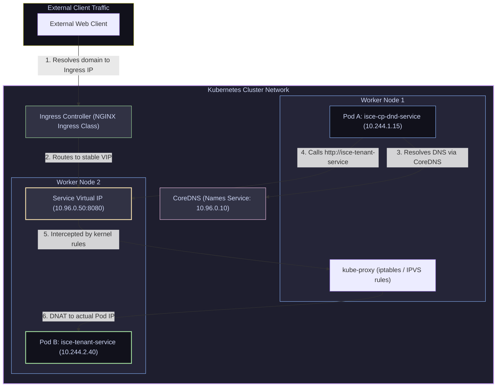

# 11 — Kubernetes Networking: Services, Ingress, Kube-Proxy & CNI

> **Why this is Topic 11:** Kubernetes networking is the most complex component of the system. To route a simple HTTP call from one microservice to another, K8s coordinates a cluster-wide DNS server, virtual IPs that do not belong to any hardware, kernel-level packet translation rules, and software-defined network interfaces. Interviewers love to trace packets from an external client through Ingress, down to Services, and into Pods. To troubleshoot latency spikes, connection drops, and service-discovery failures in production, SDE2s must master this flow.

---

## 1. WHAT

Kubernetes resolves networking by breaking it down into **four distinct communication problems**:

1.  **Container-to-Container Networking:** Solved via **shared localhost**. Multiple containers inside a single Pod share the same network namespace (anchored by the `pause` container), allowing them to communicate via standard ports on `127.0.0.1`.
2.  **Pod-to-Pod Networking:** Solved via the **Container Network Interface (CNI)** plugin (e.g. Calico, Flannel, Azure CNI). The CNI ensures that *every Pod gets a unique, routable IP address* within the cluster, and that Pods on different nodes can talk to each other directly without NAT.
3.  **Pod-to-Service Networking:** Solved via **Services** (e.g. ClusterIP). Services provide a stable, lifetime Virtual IP (VIP) and a DNS name (resolved by CoreDNS) that routes traffic across a dynamic set of changing Pod IPs.
4.  **External-to-Service Networking:** Solved via **Ingress Controllers** (such as NGINX Ingress) or **LoadBalancer Services**. They expose services outside the cluster, handling TLS termination and routing rules based on host domains or paths.



---

## 2. WHY (the trade-offs)

Designing network topologies requires choosing how packet translation is executed and exposed.

### 2.1 Kube-Proxy Modes: Iptables vs. IPVS

`kube-proxy` intercepts calls to Service VIPs and translates them to backing Pod IPs. It operates in two modes:

| Feature | `iptables` Mode (Default) | `IPVS` Mode (Recommended for scale) |
| :--- | :--- | :--- |
| **Data Structure** | Sequential list. Evaluates rules top-to-bottom. | Hash Table. Lookups are O(1) complexity. |
| **Search Time** | **O(N):** Degrades linearly as the number of Services increases. | **O(1):** Consistent performance regardless of service count. |
| **Scale Limits** | Performance degrades severely at >5,000 services. | Scalable to 100,000+ services. |
| **Load Balancing Algorithms** | Restricted to **Random** packet distribution. | Supports Round-Robin, Least-Connections, and Source Hashing. |

### 2.2 Ingress vs. LoadBalancer Services

| Aspect | LoadBalancer Service | Ingress Controller |
| :--- | :--- | :--- |
| **Cloud Resources** | Spawns a dedicated L4 Cloud Load Balancer per service (an **Azure Load Balancer** on AKS, an AWS **NLB** / classic ELB on EKS — note "ALB" is AWS's *Application* L7 Load Balancer, not what `type: LoadBalancer` provisions). | Consolidates all services under a single shared Ingress Load Balancer IP. |
| **Cost** | **High:** Paying for separate cloud LB resources. | **Low:** Single LB handles multiple endpoints. |
| **Features** | Layer 4 routing (IP/Port forwarding only). | Layer 7 routing (HTTP paths, header routing, TLS termination). |

---

## 3. HOW (the internals)

Let's trace how Kubernetes routes a request from one pod to another using Service VIPs.

### 3.1 Trace: Pod A calling Pod B via ClusterIP

Consider your Maersk stack, where the payment service (`isce-cp-dnd-service`) calls the tenant service (`isce-tenant-service`).

1.  **DNS Lookup:** `isce-cp-dnd-service` makes an HTTP request to `http://isce-tenant-service.isce-cp-prod.svc.cluster.local:8080`.
    *   The container's DNS resolver sends the query to CoreDNS (running at IP `10.96.0.10`).
    *   CoreDNS returns the stable **ClusterIP** assigned to the Tenant service: `10.96.0.50`.
2.  **Packet Transmission:** The Java process sends a TCP packet with:
    *   `Source IP: 10.244.1.15` (Pod A)
    *   `Destination IP: 10.96.0.50` (Service ClusterIP)
3.  **Kernel Interception:** The packet leaves the Pod and hits the host node's network stack.
    *   *Crucial Detail:* There is no physical network card or interface that owns the IP `10.96.0.50` in the cluster. It is a completely virtual IP.
    *   Before the packet can route, the node's kernel runs it through the netfilter hook.
    *   `kube-proxy` has programmed `iptables` (or `IPVS`) rules on the host. The rule catches destination IP `10.96.0.50` and executes **Destination NAT (DNAT)**.
    *   It randomly selects one IP from the active **Endpoints** list (representing the live pods for the tenant service, e.g., `10.244.2.40`) and replaces the destination IP.
    *   The packet is now updated to: `Destination IP: 10.244.2.40` (Pod B).
4.  **CNI Routing:** The CNI network plugin sees the packet is addressed to Pod B (`10.244.2.40`) running on Node 2. Depending on the plugin, it either routes the Pod IP directly or encapsulates the packet (using VXLAN or Geneve tunnels) and transmits it over the physical network to Node 2.
5.  **Delivery:** Node 2 decapsulates the packet and delivers it to Pod B's `veth` adapter.

---

### 3.2 CNI Architecture: Overlay vs. Direct Routing

CNI plugins manage how Pod IPs are routed across different nodes:

*   **Overlay Networks (e.g. VXLAN, Flannel):** They encapsulate the Pod-to-Pod packet inside a standard host-to-host UDP packet. When the packet crosses nodes, it looks like standard node traffic.
    *   *Trade-off:* 5% performance penalty due to encapsulation/decapsulation CPU tax. Very portable (works on any cloud provider).
*   **Direct Routing (e.g. Calico BGP, Azure CNI):** The CNI integrates directly with host routers or Cloud VNETs. Pod IPs are natively routable on the network.
    *   *Trade-off:* Maximum performance (no encapsulation tax). Requires control of network hardware or native cloud integration (e.g., Azure VNET subnet allocations).

---

### 3.3 EndpointSlices (what kube-proxy actually watches)

The single, monolithic **`Endpoints`** object (one per Service, listing *every* backing IP) is legacy. Since Kubernetes **1.19** the default is **`EndpointSlices`**: the endpoints for a Service are sharded into multiple smaller objects (default max 100 endpoints each).

*   **Why it matters (fixes the large-cluster scaling this file dwells on):** with a single `Endpoints` object, *any* pod churn rewrote the whole object and pushed the **entire** list to every node's kube-proxy — an O(pods) write amplified across O(nodes) watchers. EndpointSlices mean a single pod change rewrites only the ~100-endpoint slice it lives in, slashing control-plane traffic and kube-proxy update cost on big Services.
*   **What consumes them:** modern kube-proxy watches **EndpointSlices**, not `Endpoints`, to program its iptables/IPVS rules. The old `Endpoints` object is still synthesized for backward compatibility (hence `kubectl get endpoints` still works), but it is no longer the source of truth.
*   They also carry richer per-endpoint data: topology hints (for **Topology Aware Routing** — keeping traffic in-zone) and per-address readiness/terminating conditions.

---

### 3.4 Headless & ExternalName Services

`ClusterIP` is not the only Service shape:

*   **Headless Service (`clusterIP: None`):** no VIP is allocated and kube-proxy programs **no** DNAT rules. Instead, CoreDNS returns the **A/AAAA records of the individual backing Pod IPs** directly. This is essential for:
    *   **StatefulSets** — gives each pod a stable per-pod DNS name (`pod-0.mysvc.ns.svc.cluster.local`), needed for stateful clustering (Kafka, Cassandra, Zookeeper).
    *   **Client-side load balancing** — the client (e.g. a gRPC library) gets the full pod list and load-balances itself, bypassing kube-proxy's per-connection LB.
*   **ExternalName Service:** has no selector and no proxying. It is a pure **CNAME** — CoreDNS returns the configured external DNS name. Used to alias an in-cluster name to an external managed dependency (e.g. point `isce-redis` at `journeycache-prod.redis.cache.windows.net`), so app config stays cluster-stable while the backend lives outside.

```yaml
apiVersion: v1
kind: Service
metadata:
  name: isce-redis
  namespace: isce-cp-prod
spec:
  type: ExternalName
  externalName: journeycache-prod.redis.cache.windows.net
---
apiVersion: v1
kind: Service
metadata:
  name: isce-tenant-headless
spec:
  clusterIP: None            # headless — DNS returns individual pod IPs
  selector:
    app: isce-tenant-service
  ports:
    - port: 8080
```

---

### 3.5 Gateway API (the successor to Ingress)

The `Ingress` resource is **feature-frozen** — it will receive no new features. Its limitations (NGINX-specific behaviour crammed into vendor annotations, HTTP/HTTPS only, no role separation) are addressed by the **Gateway API** (`gateway.networking.k8s.io`), now the recommended path for new L7/L4 routing.

*   **Role-oriented, layered resources:** `GatewayClass` (infra provider, like a StorageClass) → `Gateway` (a listener/LB owned by the platform/cluster-ops team) → `HTTPRoute` / `TCPRoute` / `GRPCRoute` (routing rules owned by app teams). This separates concerns that Ingress mashed into one object.
*   **Expressive, portable routing:** header/method/query matching, traffic splitting/weighting (canaries), and cross-namespace routing are first-class fields — not vendor annotations.
*   Supports more than HTTP (TCP, UDP, gRPC, TLS passthrough). Ingress controllers (NGINX, Istio, Cilium, cloud LBs) now ship Gateway API implementations; expect interview questions to note "Ingress is frozen; Gateway API is the direction of travel."

---

### 3.6 NetworkPolicy Enforcement is a CNI Responsibility (and eBPF can bypass kube-proxy)

A `NetworkPolicy` object is just declarative intent stored in the API server — **Kubernetes itself enforces nothing**. Enforcement is delegated to the **CNI plugin**:

*   Calico, Cilium, Antrea, and Azure CNI (with the network-policy add-on) enforce policies; **Flannel does not** — apply a NetworkPolicy on a Flannel-only cluster and it is silently ignored (a classic production gotcha). "Default deny" only means something if your CNI implements it.
*   **eBPF / Cilium** implement Services *and* policy in the kernel's eBPF datapath and can **replace kube-proxy entirely** (`kube-proxy-free` mode) — no iptables/IPVS rule sets at all, eliminating the O(N) rule-programming cost discussed above and enabling identity-based (not IP-based) policy and richer L7 filtering.

---

## 4. CODE / EXAMPLES

Let's examine how these routing behaviors are declared in configurations.

### 4.1 Real-World Maersk Ingress Spec: `ingress.yaml`

Here is the Ingress configuration used to route external traffic to `isce-cp-dnd-service` using TLS termination:

```yaml
apiVersion: networking.k8s.io/v1
kind: Ingress
metadata:
  name: isce-cp-dnd-service-ingress
  namespace: isce-cp-prod
  labels:
    website: isce-cp-dnd-service
spec:
  ingressClassName: nginx  # Uses the NGINX Ingress Controller
  rules:
    - host: isce-cp-dnd-service.maersk-digital.net
      http:
        paths:
          - path: /
            pathType: Prefix
            backend:
              service:
                name: isce-cp-dnd-service
                port:
                  number: 8080
          # Path-based routing for Actuator health checks
          - path: /actuator/health
            pathType: Prefix
            backend:
              service:
                name: isce-cp-dnd-service
                port:
                  number: 8080
  tls:
    - hosts:
        - isce-cp-dnd-service.maersk-digital.net
      # TLS Wildcard Certificate secret
      secretName: tls-wildcard-maersk-digital-net
```

---

### 4.2 Querying Services & DNS Resolution inside Pods

To troubleshoot service resolution and routing:

```bash
# 1. Inspect the Service Endpoints list to verify backing Pod IPs
kubectl get endpoints isce-cp-dnd-service -n isce-cp-prod
# Output:
# NAME                  ENDPOINTS                                   AGE
# isce-cp-dnd-service   10.244.1.15:8080,10.244.2.12:8080           12d

# 2. Run a DNS lookup tool inside a running container to verify CoreDNS
kubectl exec -it isce-cp-dnd-service-7cfbb7b9c7-abcde -n isce-cp-prod -- nslookup isce-tenant-service
# Output:
# Server:         10.96.0.10
# Address:        10.96.0.10#53
#
# Name:   isce-tenant-service.isce-cp-prod.svc.cluster.local
# Address: 10.96.0.50

# 3. Inspect iptables rules generated for a Service (Run on the Worker Node)
# NOTE: Service DNAT rules do NOT live in PREROUTING under the service name. kube-proxy
# builds a chain hierarchy: KUBE-SERVICES -> KUBE-SVC-<hash> -> KUBE-SEP-<hash>. The service
# name appears ONLY inside an "-m comment --comment" on the rule, so match on the comment:
sudo iptables -t nat -L KUBE-SERVICES -n | grep "isce-cp-prod/isce-tenant-service"
# Grab the KUBE-SVC-<hash> chain it points to, then list it to see the per-endpoint
# probability (statistic) rules that balance traffic across pods:
sudo iptables -t nat -L KUBE-SVC-XXXXXXXX -n
# (Illustrative — the exact hash differs per service; on IPVS mode use `ipvsadm -Ln` instead.)
```

---

## 5. INTERVIEW ANGLES

### Q: When you execute `curl http://my-service.default.svc.cluster.local:8080`, what physical network device holds the IP of `my-service`? If you run `ifconfig` on the node, will you find that IP?
**A:** No, there is no physical (or virtual) network interface on the host or inside the container that is assigned the ClusterIP of the Service. If you run `ifconfig` or `ip addr`, you will never find that IP address.
*   **The explanation:** The ClusterIP is a purely **administrative VIP** registered in the API server and etcd. Kube-proxy reads this IP and configures netfilter (`iptables` / `IPVS`) rules in the kernel. When a packet leaves a pod with the destination ClusterIP, the kernel intercepts the packet *before* it gets routed to any physical card and rewrites the destination to a real Pod IP. The ClusterIP exists only as a lookup key inside the Linux kernel's packet processing tables.

### Q: What is the difference between `iptables` and `IPVS` modes in `kube-proxy`? Why is `IPVS` preferred for large clusters?
**A:** 
*   **`iptables` Mode:** `kube-proxy` writes a sequential list of rules. Crucially, the O(N) top-to-bottom rule walk happens only on the **first packet of a new connection** — netfilter's **conntrack** then caches the resulting DNAT decision, so every subsequent packet of that flow is matched by the connection-tracking table and skips the rule traversal entirely. The pain is therefore **per-connection-setup**, not per-packet: with 10,000 services (tens of thousands of rules), connection-establishment latency and the CPU cost of *programming* rule updates degrade linearly (O(N)), which hurts churny, short-lived-connection workloads most.
*   **`IPVS` Mode:** IPVS is a L4 load balancing system built into the Linux kernel. It stores routing rules in **hash tables**. Lookups take the same time whether you have 10 or 100,000 services (O(1) search complexity). It drastically reduces CPU usage on worker nodes and supports sophisticated load balancing algorithms (like least-connections), whereas `iptables` is restricted to random distribution.

### Q: Why do we use Ingress Controllers instead of exposing every backend microservice using a `LoadBalancer` type Service?
**A:** 
1.  **Cost Efficiency:** Each `LoadBalancer` service commands a dedicated cloud Load Balancer IP resource from your provider (e.g. AWS or Azure), which incurs direct hourly charges. Exposing 100 microservices would require 100 Cloud LBs. An Ingress controller consolidates this: you run a single Nginx Ingress Controller exposed via one single LoadBalancer, and route traffic to the 100 backend services via path/host rules.
2.  **Layer 7 Features:** Cloud LBs operate at Layer 4 (forwarding raw TCP packets). They cannot route based on HTTP headers, cookies, or path patterns (like `/actuator/health`). Ingress Controllers are application proxies (Layer 7) that handle path-based routing, rewrite rules, rate limiting, and centralized SSL/TLS termination.

---

## 6. ONE-LINE RECALL CARDS

*   **ClusterIP** is a virtual, non-device-bound IP address acting as a lookup key in the host kernel.
*   **CoreDNS** translates service names to stable, internal ClusterIPs within the cluster.
*   **`kube-proxy`** translates Service VIPs to actual Pod IPs using kernel netfilter rules.
*   **IPVS mode** uses hash tables (O(1)) instead of sequential lists (O(N)), accelerating routing on large clusters.
*   **CNI plugins** (like Calico or Azure CNI) allocate Pod IPs and make them routable across nodes.
*   **Overlay networks** wrap Pod-to-Pod packets inside host UDP headers, introducing a minor CPU tax.
*   **NodePort** exposes a service on a static, high-range port (`30000-32767`) across every worker node.
*   **Ingress Controllers** handle Layer 7 HTTP routing and TLS termination, consolidating multiple services under one IP.
*   **EndpointSlices** (default since 1.19) shard a Service's ready Pod IPs into ~100-endpoint objects; modern kube-proxy watches these (not the legacy `Endpoints`), fixing large-cluster control-plane churn.
*   **Headless Service (`clusterIP: None`)** allocates no VIP — DNS returns individual Pod IPs; used by StatefulSets and client-side load balancing.
*   **ExternalName Service** is a pure CNAME to an external DNS name — no VIP, no proxying.
*   **Gateway API** (`GatewayClass`/`Gateway`/`HTTPRoute`) is the successor to the now feature-frozen **Ingress**.
*   **NetworkPolicy is enforced by the CNI, not K8s** — Flannel ignores it; **eBPF/Cilium** can run kube-proxy-free, replacing iptables/IPVS in the kernel.
*   **`iptables` mode** walks rules O(N) only on the **first packet** of a connection; **conntrack** caches the DNAT so later packets skip the walk — pain is per-connection-setup, not per-packet.

---

**Next:** [12 — Configuration & Secrets](12-configmaps-secrets.md) (ConfigMaps, Secrets (base64 ≠ encryption, etcd encryption-at-rest), env vs mounted, projected volumes, external secrets).
