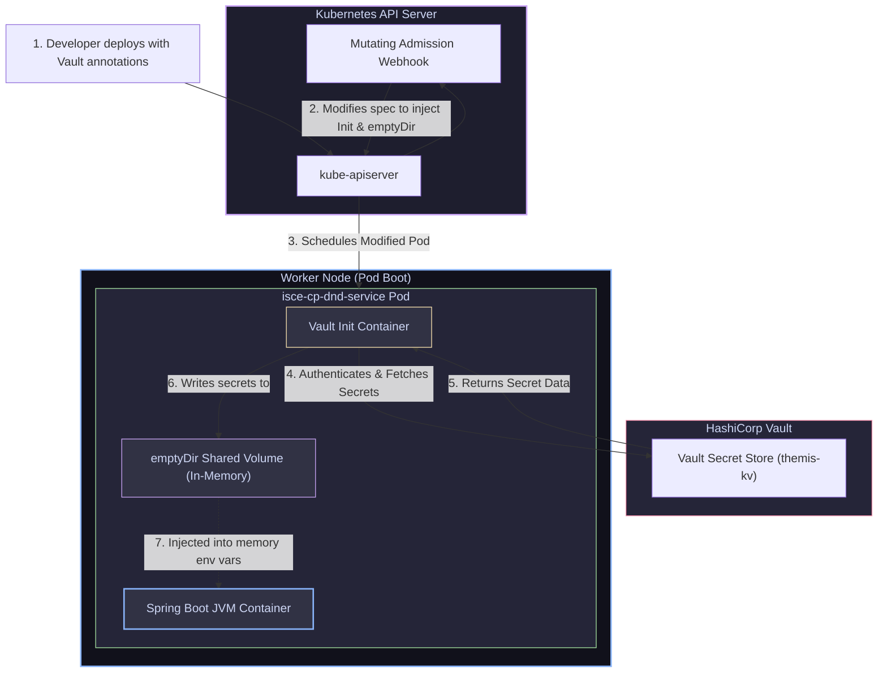

# 12 — Configuration & Secrets: ConfigMaps, Secrets & Vault Integration

> **Why this is Topic 12:** Twelve-Factor App methodology dictates that application configurations must be decoupled from the code. In Kubernetes, this is managed using ConfigMaps and Secrets. However, default Kubernetes secrets are insecure—they are simply base64-encoded strings stored in plain text inside `etcd`. Anyone with Git access or namespace read permissions can expose them. SDE2s must understand the mechanics of ConfigMap updates, how to secure secrets using Control Plane Encryption-at-Rest, and how to integrate external engines like HashiCorp Vault using mutating webhooks.

---

## 1. WHAT

Kubernetes provides objects to inject configurations and secrets into Pods at runtime:

1.  **ConfigMap:** Stores non-sensitive, plain-text configuration parameters in key-value format (such as profile flags, service urls, connection strings).
2.  **Secret:** Stores sensitive parameters (such as API keys, database passwords, TLS certificates). Values are base64-encoded in the YAML spec so binary data can be represented safely, but this is not encryption.
3.  **Vault Webhook Integration:** A security pattern where raw secrets are not stored in Kubernetes. Instead, you annotate the Pod with a Vault role. A webhook intercepts the deployment, injecting credentials into the application container's memory dynamically on boot.



---

## 2. WHY (the trade-offs)

Selecting the method of configuration injection shapes security profiles and updates propagation behavior.

### 2.1 Environment Variables vs. Mounted Volumes

| Injection Strategy | Configuration Update Propagation | Security Profile / Log Leak Risk |
| :--- | :--- | :--- |
| **Environment Variables (`env`)** | **None:** Changes to ConfigMap/Secret do not update environment variables until the Pod is restarted. | **Low Safety:** Crashing JVMs or container scripts that dump system environment variables leak secrets in plain text to log systems. |
| **Mounted Volumes (`volumeMounts`)** | **Dynamic:** Kubelet periodically scans mounts and updates files in-place asynchronously (~60-120 seconds) without pod restart. | **High Safety:** Harder to accidentally dump file contents to logs. Restricts access to process users via filesystem permissions. |

### 2.2 Native Secrets vs. Webhook Injection

| Strategy | Secret Storage Location | GitOps Compatibility |
| :--- | :--- | :--- |
| **Native K8s Secrets** | Raw in `etcd` (base64-encoded). | **Bad:** Cannot commit raw YAML secrets to Git. Requires external tools (SealedSecrets). |
| **Vault Webhook (Banzaicloud)** | Central HashiCorp Vault. | **Excellent:** Git only contains Vault path annotations. Values are resolved dynamically in memory. |

---

## 3. HOW (the internals)

Let's trace how the cluster executes secret management under the hood.

### 3.1 Base64 Encoding vs. Etcd Encryption-at-Rest

A Kubernetes secret is declared like this:
```yaml
data:
  password: cGFzc3dvcmQ=  # base64 encoded for "password"
```
*   **The Myth:** base64 is encoding, not encryption.
*   **The Reality:** Anyone who can access your Git repository or run `kubectl get secret -o yaml` can run `echo "cGFzc3dvcmQ=" | base64 --decode` and read the raw credentials.
*   **Etcd Security:** By default, `etcd` stores keys in plain text on the master node's disk. If an attacker gains host access to master nodes, they can read all cluster secrets.
*   **Encryption-at-Rest:** To secure the database, you must configure the `kube-apiserver` with an **`EncryptionConfiguration`** file:
    1.  The configuration instructs the API server to run write requests through an encryption provider (such as KMS, AES-GCM, or secretbox) *before* writing the binary payload to `etcd`.
    2.  When reading, the API server decrypts the payload and exposes it to authorized users via RBAC.

---

### 3.2 Banzaicloud Vault Webhook Architecture

Your Maersk services (like `isce-cp-dnd-service`) utilize the **Banzaicloud Vault Mutating Webhook** to inject secrets safely:

1.  **Intercepting:** When you run `kubectl apply` for `isce-cp-dnd-service`, the Pod spec is sent to the API Server.
2.  **Mutating Phase:** The API server invokes the Vault Webhook. It reads the annotation:
    `vault.security.banzaicloud.io/vault-role: "isce-cp-prod"`
3.  **Spec Alteration:** The webhook dynamically alters your Pod specification:
    *   It injects an **init-container** containing the Vault agent binary.
    *   It creates a shared **`emptyDir` volume** mapped to `/vault/secrets`.
    *   It prepends a launcher utility (`vault-env`) to your container's entrypoint.
4.  **Runtime Handoff:**
    *   The Vault init-container runs first, authenticating against Vault using the Pod's `ServiceAccount` token.
    *   It fetches the credentials pointing to the path (e.g. `vault:themis-kv/data/prod/cache/redis-cp/journey/access-key#access-key`).
    *   It writes the secrets to the shared `/vault/secrets` directory.
    *   When the JVM container starts, the `vault-env` wrapper intercepts your environmental configurations. It reads the keys from the `/vault/secrets` files and injects them directly into the environment variables in memory, before invoking `java -jar`.
    *   The secrets are never written to disk inside the JVM container and are never stored in etcd.

---

### 3.3 Secret Types & RBAC on Secrets

Secrets (like ConfigMaps) are **namespace-scoped** objects — a Secret in `isce-cp-prod` is invisible to pods and subjects in another namespace. A Secret also carries a **`type`** that tells consumers how to interpret its keys:

| `type` | Purpose / required keys |
| :--- | :--- |
| `Opaque` | Default — arbitrary user key/value pairs (API keys, passwords). |
| `kubernetes.io/tls` | TLS material — must contain `tls.crt` and `tls.key` (consumed by Ingress, §11). |
| `kubernetes.io/dockerconfigjson` | Registry pull credentials — the `imagePullSecrets` used to pull private images. |
| `kubernetes.io/service-account-token` | A ServiceAccount token (legacy; bound tokens are now projected, see §3.5). |

**RBAC is the real access boundary.** Because base64 is not encryption, the only thing standing between a user and a secret's plaintext is a `get`/`list`/`watch` verb on the `secrets` resource. Grant it narrowly — ideally scoped to *named* secrets with `resourceNames` — via a namespaced `Role`:

```yaml
apiVersion: rbac.authorization.k8s.io/v1
kind: Role
metadata:
  name: read-redis-secret
  namespace: isce-cp-prod
rules:
  - apiGroups: [""]
    resources: ["secrets"]
    verbs: ["get"]                 # get only — no list/watch (list would dump every secret)
    resourceNames: ["redis-cp-credentials"]   # restrict to this ONE secret
```

*   Prefer `Role`/`RoleBinding` (namespaced) over `ClusterRole` for secrets — a cluster-wide `get secret` is effectively cluster-admin.
*   Beware: granting `list` or `watch` on `secrets` cannot be narrowed by `resourceNames` and exposes **all** secrets in the namespace.

---

### 3.4 Immutable ConfigMaps & Secrets

Since **1.21 (GA)** you can mark a ConfigMap or Secret `immutable: true`:

```yaml
apiVersion: v1
kind: Secret
metadata:
  name: redis-cp-credentials-v3
type: Opaque
immutable: true          # cannot be edited; must be deleted & recreated to change
data:
  password: cGFzc3dvcmQ=
```

*   **What it buys you:** the kubelet **stops watching** immutable objects. Normally every pod mounting a ConfigMap/Secret keeps an open watch so it can hot-reload changes (§2.1); on large clusters those watches are a real load on the API server. Immutability drops them, improving **API-server scalability** and reducing kubelet CPU.
*   It also protects against accidental edits that would silently roll out to all consumers. To change an immutable object you create a **new one** (versioned name, e.g. `-v3`) and update the pod spec — which pairs naturally with GitOps/rolling deploys.

---

### 3.5 Projected Volumes

A **projected volume** combines several config sources into **one** directory mount, so you don't stack multiple `volumeMounts`. It can project `configMap`, `secret`, `downwardAPI`, and — importantly — `serviceAccountToken`:

```yaml
volumes:
  - name: app-config
    projected:
      sources:
        - configMap:
            name: app-properties
        - secret:
            name: redis-cp-credentials
        - downwardAPI:
            items:
              - path: "pod-name"
                fieldRef: { fieldPath: metadata.name }
        - serviceAccountToken:
            path: token
            audience: vault              # scope the token to a specific audience
            expirationSeconds: 3600       # short-lived, auto-rotated
```

*   The `serviceAccountToken` source is how modern **bound ServiceAccount tokens** are delivered: unlike the old forever-valid Secret-based token, these are **audience-scoped, time-bound (auto-rotated by kubelet), and pod-bound** — the basis for authenticating to Vault/cloud IAM without a long-lived credential.
*   Everything lands in the single mount path, presented atomically like a normal ConfigMap/Secret volume.

---

### 3.6 External Secrets Operator (ESO) — the CNCF-standard pattern

The Banzaicloud/Bank-Vaults webhook (§3.2) injects at pod-boot; **SealedSecrets** encrypts secrets into Git. The now-standard, provider-agnostic approach is the **External Secrets Operator (ESO)** — a CNCF project that **syncs** secrets from an external store into native K8s Secrets:

*   You commit only a non-sensitive **`ExternalSecret`** manifest (safe for Git). A cluster-wide **`SecretStore`/`ClusterSecretStore`** holds the connection to the backend.
*   ESO's controller authenticates to the backend (**HashiCorp Vault, Azure Key Vault, AWS Secrets Manager, GCP Secret Manager**, …), fetches the values, and **materialises a normal `Secret`**, re-syncing on an interval so rotations propagate automatically.

```yaml
apiVersion: external-secrets.io/v1
kind: ExternalSecret
metadata:
  name: redis-cp-credentials
  namespace: isce-cp-prod
spec:
  refreshInterval: 1h
  secretStoreRef:
    name: azure-kv-store
    kind: ClusterSecretStore
  target:
    name: redis-cp-credentials      # the native K8s Secret ESO will create/maintain
  data:
    - secretKey: password
      remoteRef:
        key: prod/cache/redis-cp/journey/access-key
```

*   **vs. Vault webhook:** ESO produces a real K8s Secret consumable by *any* workload (no per-pod init container or entrypoint rewrite), at the cost of the plaintext living in etcd (mitigate with encryption-at-rest, §3.1) — whereas the webhook keeps values memory-only. ESO's decoupled `SecretStore`/`ExternalSecret` split and multi-backend support are why it has become the default CNCF external-secrets pattern.

---

## 4. CODE / EXAMPLES

### 4.1 Real-World Maersk Vault Config Spec

Here is how the secrets paths are mapped in the `isce-cp-dnd-service` configuration:

**The Values File (`values/prod/values.yaml`):**
```yaml
# Specifying the secret locator path instead of the raw password string
redis:
  host: journeycache-prod.redis.cache.windows.net
  port: 6380
  cacheKey: vault:themis-kv/data/prod/cache/redis-cp/journey/access-key#access-key
  sslEnabled: true
```

**The Deployment Template (`templates/deployment.yaml`):**
```yaml
apiVersion: apps/v1
kind: Deployment
metadata:
  name: {{ .Values.appName }}
spec:
  template:
    metadata:
      annotations:
        # Banzaicloud hook annotation
        vault.security.banzaicloud.io/vault-role: "{{ .Values.vaultRole }}"
    spec:
      containers:
        - name: {{ .Values.appName }}
          image: {{ .Values.image }}
          env:
            - name: REDIS_PASSWORD
              value: {{ .Values.redis.cacheKey | quote }}  # Injects the 'vault:...' path
```

---

### 4.2 Dynamic Updates Walkthrough (Mounted ConfigMap)

If you mount a ConfigMap as a volume, you can observe dynamic file updates:

**The Mounted ConfigMap Spec:**
```yaml
spec:
  containers:
    - name: app
      image: alpine
      volumeMounts:
        - name: config-volume
          mountPath: /app/config
  volumes:
    - name: config-volume
      configMap:
        name: app-properties
```

**Testing the dynamic update:**
```bash
# 1. Inspect the mounted config inside the running pod
kubectl exec -it isce-cp-dnd-service-pod -c app -- cat /app/config/application.properties
# Output: db.pool.size=10

# 2. Update the ConfigMap spec (e.g. change pool size to 20)
kubectl edit configmap app-properties

# 3. Wait for kubelet sync loop (approx 60 seconds) and read the file again
kubectl exec -it isce-cp-dnd-service-pod -c app -- cat /app/config/application.properties
# Output: db.pool.size=20
# (Notice the file updated inside the container without restarting the pod!)
```

---

## 5. INTERVIEW ANGLES

### Q: If you mount a ConfigMap as a volume, how does Kubernetes update the files dynamically? What happens to symlinks?
**A:** Kubelet uses a system of **symbolic links** to enable atomic dynamic updates.
*   When a ConfigMap is mounted as a volume in `/app/config`, Kubelet creates a subdirectory named `..data` (which points to a timestamped folder, e.g. `..2026_07_13_02_35_00`).
*   The actual configuration files (like `application.properties`) are created as symbolic links pointing to `..data/application.properties`.
*   When the ConfigMap is updated, Kubelet downloads the new keys, writes them to a new timestamped directory (e.g. `..2026_07_13_02_36_00`), and updates the `..data` symlink to point to the new directory in a single atomic transaction.
*   *Why this is important:* Because it is an atomic symlink swap, applications never read a half-written file.
*   *Caveat:* If you mount a ConfigMap using the `subPath` property (`mountPath: /app/config/app.properties`, `subPath: app.properties`), the file is copied directly. **Dynamic updates are disabled** for subPath mounts; you must restart the pod to see changes.

### Q: Why is mutating webhook injection (like Vault) considered superior to storing encrypted secrets (like SealedSecrets) in Git?
**A:** 
1.  **Single Source of Truth:** Secrets are managed centrally in Vault. If you rotate a database password in Vault, you do not need to re-encrypt and commit updates to Git. Webhook-injected pods automatically fetch the fresh credentials on their next restart.
2.  **No Decryption Keys in Cluster:** SealedSecrets require private decryption keys to reside inside the cluster. If an attacker gains cluster-admin permissions, they can extract the decryption key and decrypt every secret in Git. Vault webhooks rely on transient ServiceAccount tokens, reducing long-term key exposure risks.
3.  **Memory-Only Injection:** Webhook engines inject secrets directly into the process memory (`vault-env` wrapper). The values never touch local disk files or etcd storage, preventing cold-storage leaks.

---

## 6. ONE-LINE RECALL CARDS

*   **ConfigMaps** store plain-text parameters, whereas **Secrets** store base64-encoded strings.
*   **Base64 is not encryption**; K8s secrets are readable in plain-text unless **Encryption-at-Rest** is enabled in `kube-apiserver`.
*   **Mounted ConfigMap volumes** update dynamically in-place, whereas **Environment variables** require a pod restart.
*   **Mounting via `subPath`** disables Kubelet's dynamic configuration update capability.
*   **The Banzaicloud Webhook** mutates pod specs on the fly to inject Vault agents and `emptyDir` volumes.
*   **`vault-env` launcher** injects secrets into the application process memory space, bypassing host disks.
*   **`emptyDir` volumes** configured in-memory (`Medium: Memory`) act as RAM disks, vanishing when the Pod stops.
*   **ConfigMaps and Secrets** are injected by Kubelet into Pods as environment variables or mounted volume files.
*   **Secrets etcd Encryption-at-Rest** encrypts keys *before* they are written to physical disk, protecting against physical theft.
*   **Vault paths** (e.g. `vault:secret#key`) are stored in Git instead of raw keys, enabling clean GitOps.
*   **Secrets are namespace-scoped;** RBAC is the real boundary — grant `get` (not `list`/`watch`) with `resourceNames` to restrict a subject to one named secret.
*   **Secret `type`s:** `Opaque` (default), `kubernetes.io/tls` (`tls.crt`/`tls.key`), `kubernetes.io/dockerconfigjson` (image pull creds).
*   **`immutable: true`** (1.21+) stops the kubelet watch on a ConfigMap/Secret, improving API-server scalability; change = create a new versioned object.
*   **Projected volumes** merge configMap + secret + downwardAPI + `serviceAccountToken` (audience-scoped, auto-rotated bound tokens) into one mount.
*   **External Secrets Operator (ESO)** syncs a `SecretStore` backend (Vault, Azure KV, AWS/GCP) into a native K8s Secret via a Git-safe `ExternalSecret` — the standard CNCF external-secrets pattern.

---

**Next:** [13 — Kubernetes Storage & Persistent Volumes](13-k8s-storage-pv-pvc-csi.md) (PV / PVC / StorageClass, static vs dynamic provisioning, CSI drivers, StatefulSet volume claims, access modes).
