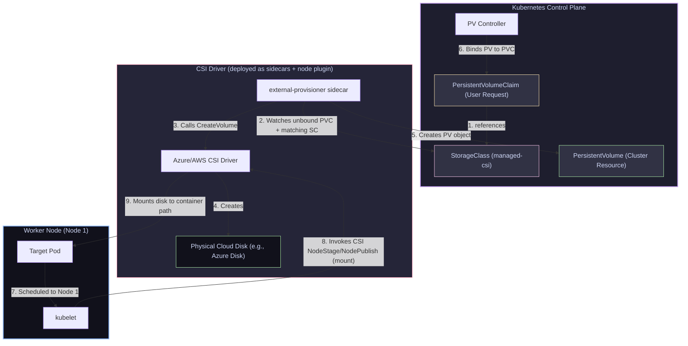

# 13 — Kubernetes Storage: PV, PVC, StorageClasses & CSI Drivers

> **Why this is Topic 13:** Stateful workloads require persistent storage, but hardcoding disk details inside Pod specifications binds applications to specific cloud providers and host nodes. Kubernetes decouples storage by separating the *request for storage* (PVC) from the *actual physical disk* (PV). SDE2s must understand how storage dynamically provisions via **StorageClasses**, what role the **CSI (Container Storage Interface)** driver plays, how volume access modes control concurrency, and how to debug volume attachment lockups during rolling updates.

---

## 1. WHAT

Kubernetes manages persistent filesystems using four decoupled storage primitives:

1.  **PersistentVolume (PV):** A cluster-wide storage resource representing a physical disk (e.g. an Azure Managed Disk or AWS EBS volume) provisioned manually by an administrator or dynamically by a StorageClass. It has a lifecycle independent of any pod using it.
2.  **PersistentVolumeClaim (PVC):** A developer's request for storage. It declares the size (e.g., `10Gi`), access mode, and a StorageClass. When applied, Kubernetes automatically matches it with an available PV or provisions a new one.
3.  **StorageClass (SC):** A blueprint template. It defines which CSI driver to use (e.g. `disk.csi.azure.com`) and parameters (such as `skuName: Premium_LRS`) to automate disk creation on the cloud provider.
4.  **Container Storage Interface (CSI):** A standardized specification that allows storage vendors (like Microsoft, Amazon, NetApp, or Portworx) to write storage plugins that hook into Kubernetes out-of-tree, bypassing core Kubernetes codebase dependencies.



---

## 2. WHY (the trade-offs)

Decoupling storage configurations shapes database write capabilities and affects pod scheduling.

### 2.1 Storage Provisioning: Static vs. Dynamic

*   **Static Provisioning:** Administrators pre-allocate a pool of physical disks (PVs). If a developer requests a PVC of 10GB, K8s binds it to an available 10GB PV.
    *   *Trade-off:* High admin overhead; if the pool runs out of PVs, developers are blocked.
*   **Dynamic Provisioning (Standard):** The developer deploys a PVC referencing a StorageClass. The controller contacts the cloud provider API to spawn the disk on-the-fly.
    *   *Trade-off:* Highly automated and self-service, but risks running into cloud provider resource limit quotas (e.g. max disks per subscription).

### 2.2 Volume Access Modes Comparison

| Access Mode | Concurrency Boundary | Under-the-hood Storage Type | Best Used For |
| :--- | :--- | :--- | :--- |
| **`ReadWriteOnce` (RWO)** | Mounted read-write by a **single Node** — multiple Pods **on that same node** may share it. | Block storage (Azure Disk, AWS EBS). | Single-instance DBs, or each *member* of a clustered DB via its own per-pod PVC. |
| **`ReadWriteMany` (RWX)** | Mounted by **many Nodes** simultaneously as read-write. | Shared File storage (NFS, Azure Files, AWS EFS). | Shared media uploads, file assets, configuration repositories. |
| **`ReadOnlyMany` (ROX)** | Mounted by **many Nodes** simultaneously as read-only. | Shared File storage. | Reading centralized static catalogs or security databases. |
| **`ReadWriteOncePod` (RWOP)** | Mounted read-write by **exactly one Pod** cluster-wide (introduced in K8s 1.22; stable in 1.29). | Block storage (enforced via local mounts). | Strict single-pod write exclusivity — the true one-Pod guarantee RWO does *not* give. |

---

## 3. HOW (the internals)

Let's study the lifecycle of dynamic volume provisioning and attach/mount sequences under the hood.

### 3.1 Trace: Dynamic Provisioning & Attach/Mount Flow

1.  **Claim Creation:** A developer applies a PVC requesting a `10Gi` disk using StorageClass `managed-csi`.
2.  **Provisioner Interception:** The **external-provisioner sidecar** (shipped alongside the CSI driver) watches for unbound PVCs whose `storageClassName` matches its driver, then calls the driver's `CreateVolume` RPC. *(Note: the in-tree **PersistentVolume controller** does NOT provision — its only job here is PV↔PVC binding in step 4.)*
3.  **Disk Provisioning:** The CSI Driver calls the Cloud API to provision a physical disk. Once created, the driver returns the unique cloud volume ID.
4.  **PV Registration & Binding:** The external-provisioner creates the `PersistentVolume` (PV) object pointing to the cloud volume ID; the in-tree **PV controller** then binds the PVC to that PV (PVC status becomes `Bound`).
5.  **Scheduling Constraints:** The scheduler places the Pod using this PVC onto Node 1.
6.  **Attach Operation:** The in-tree **AttachDetach controller** creates a `VolumeAttachment` object; the **external-attacher sidecar** observes it and calls the driver's `ControllerPublishVolume` RPC to **attach** the disk to Node 1 (analogous to plugging a physical USB drive into the server motherboard).
7.  **Mount Operation:** Once attached, the `kubelet` daemon on Node 1 calls the CSI driver locally to format the disk (if blank) and **mount** it into the node's local directory (e.g. `/var/lib/kubelet/pods/<pod-uid>/volumes/...`). Kubelet then binds this directory to the container path.

---

### 3.2 Volume Reclaim Policies

What happens to the physical cloud disk when you run `kubectl delete pvc my-claim`? This is governed by the PV's **`persistentVolumeReclaimPolicy`**:

*   **`Delete` (Default in dynamic storage):** The PV object is deleted from the cluster, and the CSI driver calls the cloud API to **destroy the physical cloud disk** instantly, freeing up cloud costs but deleting the data permanently.
*   **`Retain`:** The PV object transitions to status `Released`. The **physical disk and all data are preserved** in the cloud. No other pods can bind to the PV until an administrator manually cleans up the resources.
*   **`Recycle` (Deprecated):** Performs a basic data scrub (`rm -rf /volume/*`) and makes the PV available for new claims.

---

### 3.3 StatefulSet `volumeClaimTemplates` (per-replica storage)

A Deployment shares one PVC across all replicas; a **StatefulSet** instead uses a `volumeClaimTemplates` block so that Kubernetes provisions **one PVC per replica** with a stable, ordinal-based name — `<template-name>-<statefulset-name>-<ordinal>`, e.g. `data-postgres-0`, `data-postgres-1`.

*   **Stable identity:** When `postgres-0` is rescheduled (even to a new node), it re-binds to the **same** `data-postgres-0` PVC — so each replica keeps its own data. This is why clustered databases use a StatefulSet with RWO volumes: each member gets its own private disk.
*   **Scale-down retention:** PVCs created from `volumeClaimTemplates` are **NOT deleted when you scale the StatefulSet down** (default). Scaling `postgres` from 3→1 leaves `data-postgres-1` / `data-postgres-2` intact, so scaling back up re-attaches the original data. Deleting them is a manual step (or configure `persistentVolumeClaimRetentionPolicy`, beta 1.27).

```yaml
apiVersion: apps/v1
kind: StatefulSet
spec:
  serviceName: postgres
  replicas: 3
  volumeClaimTemplates:            # one PVC minted per replica
    - metadata:
        name: data                 # → data-postgres-0, data-postgres-1, ...
      spec:
        accessModes: ["ReadWriteOnce"]
        storageClassName: managed-premium-csi
        resources:
          requests:
            storage: 20Gi
```

### 3.4 Volume Expansion & CSI Snapshots

*   **`allowVolumeExpansion: true`** (set on the StorageClass, as in the example above): lets you grow an existing volume by editing the PVC's `spec.resources.requests.storage` to a larger value. The CSI driver calls `ExpandVolume` on the cloud disk and then grows the filesystem. **Only growth is supported — never shrink.** If the driver supports online expansion the pod stays running; otherwise the pod may need a restart to pick up the larger filesystem.
*   **CSI Snapshots:** CSI drivers can expose point-in-time snapshots via `VolumeSnapshot` / `VolumeSnapshotClass` objects (handled by the `external-snapshotter` sidecar). You snapshot a PVC, then provision a **new** PVC from that snapshot (`dataSource: kind: VolumeSnapshot`) — the basis for backups and clone-for-test workflows.

---

## 4. CODE / EXAMPLES

### 4.1 StorageClass & PVC Declarations

Here is a configuration template for provisioned block storage:

**The StorageClass (`storage-class.yaml`):**
```yaml
apiVersion: storage.k8s.io/v1
kind: StorageClass
metadata:
  name: managed-premium-csi
provisioner: disk.csi.azure.com  # The CSI driver agent
volumeBindingMode: WaitForFirstConsumer  # Delay disk creation until Pod is scheduled
allowVolumeExpansion: true
parameters:
  skuName: Premium_LRS
```
*   `volumeBindingMode: WaitForFirstConsumer`: Crucial! Instructs the scheduler to place the Pod first before provisioning the disk. This ensures the disk is created in the same Availability Zone (AZ) as the node, preventing cross-zone mounting failures.

**The PVC (`pvc.yaml`):**
```yaml
apiVersion: v1
kind: PersistentVolumeClaim
metadata:
  name: isce-db-claim
  namespace: isce-cp-prod
spec:
  accessModes:
    - ReadWriteOnce
  storageClassName: managed-premium-csi
  resources:
    requests:
      storage: 20Gi
```

**The Pod Mount Configuration:**
```yaml
spec:
  containers:
    - name: postgres
      image: postgres:15-alpine
      volumeMounts:
        - name: db-storage
          mountPath: /var/lib/postgresql/data
  volumes:
    - name: db-storage
      persistentVolumeClaim:
        claimName: isce-db-claim
```

---

## 5. INTERVIEW ANGLES

### Q: Why is `volumeBindingMode: WaitForFirstConsumer` preferred over `Immediate` binding in multi-AZ cloud environments?
**A:** 
*   **`Immediate` Mode:** When you apply the PVC, the controller instantly contacts the cloud API and creates a disk in a random Availability Zone (e.g., Zone A). Later, the scheduler places the Pod. If the scheduler assigns the Pod to a node in Zone B (due to CPU availability or taints), the pod will get stuck in `ContainerCreating` because cloud block storage (Azure Disk / AWS EBS) cannot cross Availability Zone boundaries to mount to a node in a different zone.
*   **`WaitForFirstConsumer` Mode:** The PVC remains in `Pending` state. The scheduler evaluates the Pod first, selects Node 1 in Zone B based on standard rules, and then passes the scheduling decision to the PV Controller. The controller instructs the CSI driver to provision the disk *exclusively in Zone B*, ensuring the volume and node reside in the same zone, eliminating mounting failures.

### Q: A Deployment doing a RollingUpdate gets stuck. The old Pod is terminating, and the new Pod is stuck in `ContainerCreating` with the event log: "Volume is already attached to another node." Why does this happen, and how do you resolve it?
**A:** This occurs because block storage volumes (RWO) can only attach to one host node at a time.
*   **The Cause:** During a rolling update, if the new Pod is scheduled on Node 2, while the old Pod is still running on Node 1, the new Pod requests to attach the volume. The cloud provider blocks Node 2 from attaching the volume because Node 1 has not fully released its lock (detachment takes time).
*   **The Resolution:**
    1.  **Deployment Strategy:** In the Deployment spec, ensure the rolling update parameters are configured to scale down before scaling up. This is done by setting `maxUnavailable: 1` and `maxSurge: 0` (forces the old pod to terminate and release the lock *before* the new pod attempts to attach the disk).
    2.  **StatefulSet Migration:** Use StatefulSets instead of Deployments for stateful applications; they manage ordinals and volume bindings in a strict sequence by default.
    3.  **Upgrade CNI/CSI:** Modern CSI drivers support force-detachment and fast-unmounting, reducing the lock transition window.

### Q: What is the benefit of moving out-of-tree with CSI compared to the legacy in-tree volume plugins?
**A:** 
*   **In-Tree Plugins:** Historically, all storage code (e.g., `kubernetes.io/azure-disk`) was compiled directly into the Kubernetes core binaries (`kube-apiserver` and `kubelet`). If a cloud provider needed to fix a bug in their storage plugin, they had to wait for the entire Kubernetes project release lifecycle. If the plugin crashed, it crashed the central controller manager or Kubelet process.
*   **Out-of-Tree CSI:** CSI decouples this by defining standard RPC interfaces. Storage providers run their code as standalone sidecars and controller pods in the cluster namespace. They can release updates independently, and crashes inside the CSI pod do not threaten node-level Kubelet processes.

---

## 6. ONE-LINE RECALL CARDS

*   **PersistentVolumes (PVs)** represent cluster-level physical storage, independent of Pod lifecycles.
*   **PersistentVolumeClaims (PVCs)** act as developers' resource requests for specific storage configurations.
*   **StorageClasses** act as blueprints that automate dynamic PV creation via cloud CSI drivers.
*   **The CSI (Container Storage Interface)** allows out-of-tree plugins to handle attach/mount operations.
*   **The `external-provisioner` sidecar** (not the PV controller) watches PVCs and calls `CreateVolume`; the in-tree **PV controller only does PV↔PVC binding**; the **external-attacher** handles VolumeAttachments.
*   **`ReadWriteOnce` (RWO)** binds to a single Node — multiple pods on that *same* node can share it; **`ReadWriteOncePod` (RWOP)** is the strict one-Pod guarantee.
*   **`ReadWriteMany` (RWX)** requires file-storage backends (NFS/EFS) to allow multi-node write access.
*   **StatefulSet `volumeClaimTemplates`** mint one stable PVC per replica (`data-<sts>-N`); these PVCs are **not** deleted on scale-down by default.
*   **`allowVolumeExpansion: true`** lets a PVC grow (never shrink); **CSI VolumeSnapshots** enable backups and provisioning new PVCs from a snapshot.
*   **`WaitForFirstConsumer`** delays volume creation to match the AZ scheduling constraints of the target Pod.
*   **The `Delete` reclaim policy** automatically destroys the physical cloud disk when the PVC is deleted.
*   **The `Retain` reclaim policy** preserves the physical disk and data for manual administrator recovery.
*   **Volume lockups** during rollouts occur because block devices cannot mount to Node 2 before Node 1 detaches.

---

**Next:** [14 — Health & Self-Healing](14-probes-self-healing.md) (liveness / readiness / startup probes, restart policy & backoff, PodDisruptionBudgets, wiring Spring Boot Actuator).
