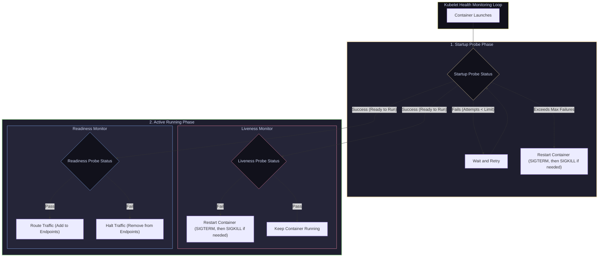

# 14 — Health & Self-Healing: Liveness, Readiness, Startup Probes & PDBs

> **Why this is Topic 14:** In Kubernetes, self-healing is achieved through probes that continuously query container state. However, misconfiguring these probes can lead to disastrous outages. A liveness probe checking a downstream database will trigger a recursive bootloop when the database drops, turning a minor database overload into a total cluster outage. Furthermore, running host upgrades without **PodDisruptionBudgets** can violate application SLAs. SDE2s must master probe sequencing, the details of Spring Boot Actuator health groups, and how to protect service availability during node disruptions.

---

## 1. WHAT

Kubernetes uses three distinct health probes to audit container status and manage self-healing:

1.  **Startup Probe:** Determines if the application inside the container has completed its initial boot. It runs first and disables liveness and readiness checks until it passes.
2.  **Liveness Probe:** Determines if the container needs to be restarted. If a liveness check fails, Kubelet asks the runtime to terminate the container, normally sending `SIGTERM` first and `SIGKILL` only if the process outlives its grace period.
3.  **Readiness Probe:** Determines if the container is ready to accept network traffic. If a readiness check fails, the Pod is removed from the Endpoints list of all matching Services, stopping new requests from routing to it.
4.  **PodDisruptionBudget (PDB):** An administrative policy that defines the maximum number of Pod replicas that can be down simultaneously during voluntary disruptions (such as host node patching or draining).



---

## 2. WHY (the trade-offs)

Selecting the endpoints and frequency of probes determines if your service can recover from transient failures without dropping traffic.

### 2.1 Swapping Liveness and Readiness Probes: The Risks

| Configuration Mistake | Application Behavior under High Load / Database Outage |
| :--- | :--- |
| **Liveness checks Database Connection** | **Bootloops:** If the database connection drops temporarily, the liveness probe fails. Kubelet force-kills the JVM process. When the pod restarts, it joins the connection queue, crashing recursively and increasing DB load. |
| **Readiness checks Database Connection (Correct)** | **Graceful Isolation:** If the DB drops, the readiness probe fails. Kubelet stops routing requests to this Pod. The JVM remains alive, resolving connection pools in the background. Traffic returns once the DB recovers. |

---

## 3. HOW (the internals)

Let's study the execution of health checks by Kubelet and how PodDisruptionBudgets protect SLAs.

### 3.1 Startup Probe Blocking & The JVM Boot Trap

Java applications (like Spring Boot) have a slow startup footprint. They must load the class definitions, initialize the Spring Application Context, compile JIT blocks, and verify Hibernate schema mappings. This can take 30–60 seconds.
*   **The Trap:** If you configure a liveness probe with `initialDelaySeconds: 15`, `periodSeconds: 10` and a failure threshold of `3`, the JVM is first queried at 15s, then again at 25s and 35s. If it is still booting, the 3rd failure lands at ~35s. Kubelet restarts the container and restarts the cycle. The application is trapped in an infinite bootloop.
*   **The Startup Probe Solution:** The Startup probe acts as a shield. It queries `/actuator/health/liveness` with a generous threshold (e.g. `failureThreshold: 20`, `periodSeconds: 5` = 100 seconds window).
    1.  While the startup probe runs, liveness and readiness checks are **suspended**.
    2.  If the app boots in 35 seconds, the startup probe passes.
    3.  Kubelet immediately disables the startup probe and begins the regular liveness/readiness loops.

---

### 3.1b Probe Mechanisms & Tunable Fields

Each of the three probes can use any of **four handler types**:
*   **`httpGet`** — Kubelet sends an HTTP GET; any `2xx`/`3xx` = success. The lightweight default for web apps.
*   **`tcpSocket`** — Kubelet opens a TCP connection; success = port accepts. Good for non-HTTP servers.
*   **`exec`** — runs a command inside the container; exit code `0` = success (expensive — see the fork() interview angle).
*   **`grpc`** — Kubelet calls the standard gRPC Health Checking protocol natively (**beta in 1.24, GA in 1.27**). Before this, gRPC apps had to bundle the `grpc-health-probe` binary and use an `exec` probe.

Every probe shares the same five tunable fields:

| Field | Meaning | Default |
| :--- | :--- | :--- |
| `initialDelaySeconds` | Delay before the **first** probe fires after container start. | `0` |
| `periodSeconds` | Interval between probes. | `10` |
| `timeoutSeconds` | How long to wait for a response before counting a failure. | `1` |
| `successThreshold` | Consecutive successes needed to be considered healthy (must be `1` for liveness/startup). | `1` |
| `failureThreshold` | Consecutive failures before Kubelet acts (restart / remove from Endpoints). | `3` |

*   **Why the example config omits `initialDelaySeconds`:** because a **startup probe is present**. The startup probe already gates liveness/readiness until boot completes, so an `initialDelaySeconds` on the liveness probe would be redundant (and worse — a fixed delay is a guess, whereas the startup probe adapts to actual boot time). Use `initialDelaySeconds` only when you have *no* startup probe.

### 3.1c restartPolicy & CrashLoopBackOff

*   **`restartPolicy`** (Pod-level) governs whether Kubelet restarts a container after it exits or a liveness probe fails: **`Always`** (default; used by Deployments/StatefulSets), **`OnFailure`** (restart only on non-zero exit — Jobs), **`Never`**.
*   **CrashLoopBackOff:** when a container keeps crashing/failing liveness, Kubelet does not restart it instantly — it applies an **exponential back-off: 10s → 20s → 40s → … capped at 300s (5 min)**, resetting after the container stays up long enough. `CrashLoopBackOff` is the *waiting* state between those restarts, not an error in itself.

---

### 3.1d Graceful Shutdown: Readiness × `terminationGracePeriodSeconds`

When a Pod is deleted (rollout, scale-down, eviction) two things happen **in parallel**:
1.  The Pod's endpoints are removed from all Services → it goes **NotReady** and Kubernetes stops routing *new* traffic to it.
2.  Kubelet sends `SIGTERM` to the container and starts the **`terminationGracePeriodSeconds`** clock (default **30s**). The app should finish **in-flight requests** and close connections during this window; if it is still alive when the clock expires, Kubelet sends `SIGKILL`.

The subtlety: endpoint removal is *eventually consistent* (kube-proxy/ingress must observe it), so a well-behaved app also uses a **`preStop` hook `sleep`** (e.g. 5–10s) before honoring SIGTERM, keeping the readiness path serving until in-flight load balancers have actually stopped sending traffic. This is why readiness and `terminationGracePeriodSeconds` must be reasoned about together to achieve zero-dropped-request rollouts.

---

### 3.2 Voluntary vs. Involuntary Disruptions & PDBs

Kubernetes distinguishes between two types of service downtime:
*   **Involuntary Disruptions (Unpreventable):** Host hardware crash, VM kernel panic, physical network split, hypervisor node deletion.
*   **Voluntary Disruptions (Planned):** A cluster admin runs `kubectl drain node-1` to evict pods for kernel patching; database scaling requires moving pods.

#### How a PodDisruptionBudget (PDB) Protects Services during Draining:
1.  Admin executes `kubectl drain Node-A`.
2.  The API Server receives evictions requests for all pods on Node-A.
3.  The eviction controller checks if `isce-cp-dnd-service` has a PDB configured.
4.  **PDB Rule:** `minAvailable: 2`.
5.  **Cluster State Check:** If 3 replicas are running, and evicting Pod-1 on Node-A leaves only 2 pods, the eviction is **approved**. Node-A evicts Pod-1, and the scheduler creates a replacement on Node-B.
6.  **Safety Lock:** If only 2 replicas are running (e.g., due to an involuntary crash elsewhere), evicting Pod-1 would leave 1 pod (violating `minAvailable: 2`). The API Server **rejects the eviction**. The drain command blocks and waits until a replacement pod is scheduled and ready on another node, protecting your microservice SLA.

---

## 4. CODE / EXAMPLES

### 4.1 Production Spring Boot Actuator Probe Configuration

Spring Boot 2.3+ natively detects running inside Kubernetes and exposes dedicated liveness and readiness sub-groups to prevent heavy db-check dependencies in liveness loops.

**The Application Properties (`src/main/resources/application.properties`):**
```properties
# Enable Kubernetes Probes support
management.endpoint.health.probes.enabled=true
# Expose the endpoints
management.endpoints.web.exposure.include=health,prometheus
```
*   `/actuator/health/liveness`: Checks if the JVM is alive. Returns `UP` if the application context is active.
*   `/actuator/health/readiness`: Checks if the application is ready to handle traffic. Returns `UP` only after command-line runners have completed.

**The Kubernetes Deployment Template (`templates/deployment.yaml`):**
```yaml
apiVersion: apps/v1
kind: Deployment
metadata:
  name: isce-cp-dnd-service
  namespace: isce-cp-prod
spec:
  replicas: 3
  template:
    spec:
      containers:
        - name: isce-cp-dnd-service
          image: isce-cp-dnd-service:v2.1.0
          ports:
            - containerPort: 8080
          # Shield: Allow up to 120s for slow Spring Boot startup
          startupProbe:
            httpGet:
              path: /actuator/health/liveness
              port: 8080
            failureThreshold: 24
            periodSeconds: 5
          # Liveness: Check context health every 10s
          livenessProbe:
            httpGet:
              path: /actuator/health/liveness
              port: 8080
            periodSeconds: 10
            failureThreshold: 3
          # Readiness: Check traffic readiness; isolate pod on failure
          readinessProbe:
            httpGet:
              path: /actuator/health/readiness
              port: 8080
            periodSeconds: 10
            failureThreshold: 3
```

---

### 4.2 Declaring a PodDisruptionBudget

Save this configuration as `pdb.yaml` to enforce service uptime:

```yaml
apiVersion: policy/v1
kind: PodDisruptionBudget
metadata:
  name: isce-cp-dnd-service-pdb
  namespace: isce-cp-prod
spec:
  # Guarantees that at least 2 replicas remain available during voluntary evictions
  minAvailable: 2
  selector:
    matchLabels:
      app: isce-cp-dnd-service
```

---

## 5. INTERVIEW ANGLES

### Q: Why are `exec` probes (e.g. running a shell script or PG ping) considered risky for host CPU scaling compared to `httpGet` probes?
**A:** 
*   **`httpGet` Probes:** Executed by Kubelet sending a lightweight HTTP request. The network stack handles it with minimal overhead on the host.
*   **`exec` Probes:** Kubelet must execute a command inside the container's namespaces. To do this, Kubelet invokes the container runtime to run `runc exec <container-id> <command>`. Under the hood, this triggers a **Linux `fork()` system call** on the host to create a process, clone namespaces, and set up capabilities.
*   **The Scale Risk:** If you run an `exec` probe every 5 seconds on 50 containers on a single host, the node executes 10 process forks per second. During traffic surges, these forks create massive context-switching overhead, driving host CPU usage up and causing node starvation. Use `httpGet` or `tcpSocket` probes for high-frequency checks.

### Q: What is the risk of having a database connection check in the Liveness Probe?
**A:** This creates a **cascading failover loop**. 
If the database runs out of connections or crashes:
1.  The database check in the liveness probe of all 10 microservice pods fails.
2.  Kubelet **restarts the container** in each of the 10 pods (the restart count increments — the Pod object itself is not deleted): it sends `SIGTERM` first, then `SIGKILL` (Exit Code 137) only if the process outlives `terminationGracePeriodSeconds`.
3.  The containers restart. During bootup, they all attempt to reconnect to the database, exhausting the database's remaining connection queue.
4.  This boot-loop repeats endlessly, making it impossible for the database to recover because it is constantly hammered by restarting pods.
*Fix:* Database checks must strictly live in the **Readiness Probe**. If the database fails, the pods are removed from the load balancer, but remain alive, ready to route requests the moment the DB recovers.

### Q: Explain the difference between voluntary and involuntary disruptions. Can a PodDisruptionBudget protect your application from a host hardware crash?
**A:** 
*   **Voluntary Disruptions:** Actions initiated by administrators or cluster tools (e.g. draining a node, deleting a deployment, scaling down). A **PDB protects against these** by blocking the API call if the disruption violates the budget.
*   **Involuntary Disruptions:** Unexpected events (e.g. host VM crash, physical rack power cut, disk failure). A **PDB cannot protect against these**; Kubernetes cannot block physical hardware failures. PDBs only guarantee that *administrative actions* do not compound involuntary failures and violate your service availability SLAs.

---

## 6. ONE-LINE RECALL CARDS

*   **Startup probes** shield applications by suspending liveness and readiness checks during application boot.
*   **Liveness probes** determine if a container should be terminated and restarted; graceful `SIGTERM` comes first, then `SIGKILL` if needed.
*   **Readiness probes** control traffic routing, removing failing pods from the Service Endpoints list.
*   **Spring Boot Actuator** exposes separate `/liveness` (context check) and `/readiness` (runner checks) paths.
*   **Liveness probes checking databases** trigger recursive boot-loop failures, causing cascading outages.
*   **PodDisruptionBudgets (PDBs)** block voluntary evictions (like `kubectl drain`) if they threaten replica thresholds.
*   **PDBs cannot protect against involuntary disruptions** like hardware failures or kernel panics.
*   **Liveness/startup failure restarts the *container*** (restart count++), it does not delete the Pod; `SIGTERM` then `SIGKILL` after `terminationGracePeriodSeconds`.
*   **Probes support four handlers:** `httpGet`, `tcpSocket`, `exec`, and `grpc` (beta 1.24, GA 1.27).
*   **Probe fields:** `initialDelaySeconds`, `periodSeconds` (10), `timeoutSeconds` (1), `successThreshold` (1), `failureThreshold` (3) — skip `initialDelaySeconds` when a startup probe is present.
*   **`restartPolicy`** = `Always` (default) / `OnFailure` / `Never`; repeated crashes enter **CrashLoopBackOff** with exponential back-off 10s→20s→…→300s cap.
*   **Graceful shutdown:** deletion makes the Pod **NotReady** (stops new traffic) while `SIGTERM` + `terminationGracePeriodSeconds` (30s) let in-flight requests drain; a `preStop sleep` covers endpoint-removal lag.
*   **`exec` probes** trigger system `fork()` calls, causing host CPU context-switching overhead at scale.
*   **`minAvailable`** and **`maxUnavailable`** are mutually exclusive parameters used to configure PDB safety boundaries.
*   **Exit code 137** indicates that Kubelet terminated the container process using a force-kill `SIGKILL` signal.

---

**Next:** [15 — Autoscaling](15-autoscaling-hpa-vpa-ca.md) (HPA (metrics pipeline), VPA, Cluster Autoscaler, scaling Spring Boot services safely).
