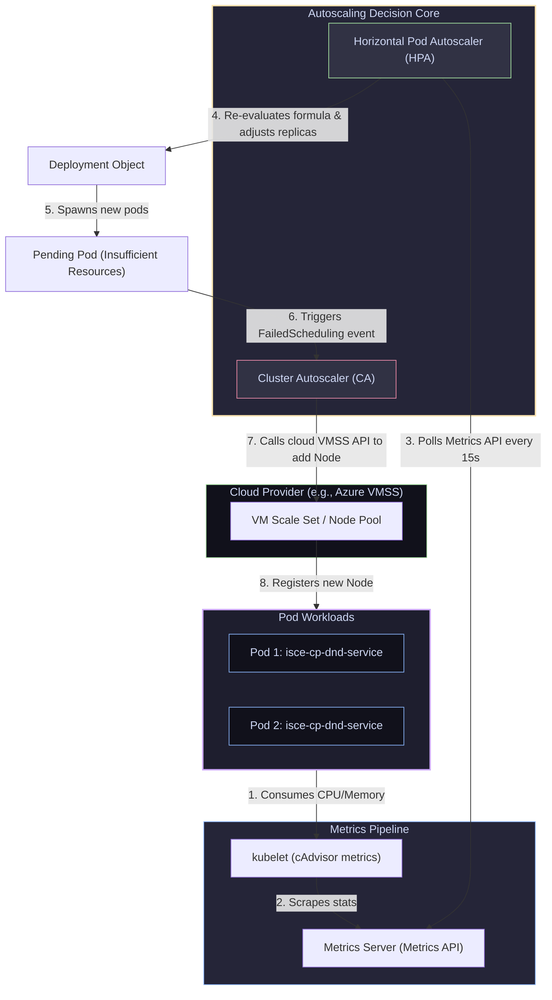

# 15 — Autoscaling: HPA, VPA, Cluster Autoscaler & Spring Boot Scaling

> **Why this is Topic 15:** Autoscaling transforms static container hosts into dynamic, self-healing platforms. However, setting up autoscaling without considering downstream database capacities can cause complete system failures during traffic surges. If your backend service scales from 3 to 30 pods, but your relational database runs out of connection pools or disk I/O, the entire system crashes. SDE2s must understand the math behind **HPA calculations**, how **Cluster Autoscaler** interacts with cloud scale sets, and how to scale JVM microservices safely.

---

## 1. WHAT

Kubernetes automates scaling across three independent dimensions:

1.  **Horizontal Pod Autoscaler (HPA):** Scales the number of Pod replicas (horizontal scaling). It evaluates CPU/Memory utilization or custom application metrics (e.g. Prometheus requests per second) and adjusts the deployment's replica count.
2.  **Vertical Pod Autoscaler (VPA):** Scales the resource requests and limits of existing Pods (vertical scaling). It tracks historical usage over days, calculates optimal resource budgets, and resizes the containers (which by default requires a Pod restart).
3.  **Cluster Autoscaler (CA):** Scales the physical server infrastructure (Worker Nodes) in the pool. When pods are stuck in `Pending` because the nodes are full, the CA triggers the cloud provider to provision new VMs.
4.  **Metrics Server:** A cluster-wide aggregator that scrapes CPU and memory usage statistics from Kubelets (via cAdvisor) and exposes them through the Metrics API.



---

## 2. WHY (the trade-offs)

Selecting horizontal versus vertical scaling strategies dictates application capacity limits and hardware costs.

### 2.1 HPA vs. VPA Comparison

| Feature | HPA (Horizontal Scaling) | VPA (Vertical Scaling) |
| :--- | :--- | :--- |
| **Scaling Axis** | **Replicas:** Adds or removes Pod instances. | **Resources:** Resizes CPU/Memory requests of existing Pods. |
| **Best Suited For** | Stateless microservices (elastic web traffic). | Stateful systems (Databases, Kafka brokers) that cannot scale horizontally easily. |
| **Availability Impact** | **Zero:** New pods boot without impacting active instances. | **Restart Required:** Pods must be terminated to resize cgroups limits (pre-1.27). |
| **Configuration Clash** | Cannot be run together on the same metric (CPU/Memory) because they fight. | Can run together if HPA uses custom metrics (e.g. HTTP queries/sec) and VPA manages memory. |

---

## 3. HOW (the internals)

Let's study the execution loops behind pod replica adjustments and cluster scaling.

### 3.1 The HPA Mathematical Formula

The HPA controller executes a control loop (default evaluation period is 15 seconds). On each loop, it queries the metrics API and calculates the target replica count using the formula:

$$\text{Desired Replicas} = \left\lceil \text{Current Replicas} \times \left( \frac{\text{Current Metric Value}}{\text{Target Metric Value}} \right) \right\rceil$$

#### Real-life Scenario: CPU Spike Calculation
*   Your deployment `isce-cp-dnd-service` has `Current Replicas = 3`.
*   You configured the HPA to target average CPU utilization at `50%` of requests.
*   During a batch processing run, the metrics API reports average CPU utilization across the 3 pods has spiked to `85%`.
*   **The Calculation:**
    $$\text{Desired Replicas} = \left\lceil 3 \times \left( \frac{85}{50} \right) \right\rceil = \lceil 3 \times 1.7 \rceil = \lceil 5.1 \rceil = 6 \text{ Replicas}$$
*   The HPA updates the Deployment spec's `replicas` parameter to `6` to distribute the load.

#### Cooldowns & Flapping Prevention:
To prevent **flapping** (rapid scaling up and down during minor load spikes), Kubernetes utilizes stabilization windows.
*   **Scale Up Window:** Replicas are scaled up instantly to handle load.
*   **Scale Down Window:** Default is **5 minutes**. If traffic drops, HPA calculates the downscale requirement but waits 5 minutes to verify the load reduction is stable before terminating pods.

---

### 3.1b HPA Metric Types (beyond CPU/Memory)

The `autoscaling/v2` API supports four metric `type`s — CPU/memory (`Resource`) is only the simplest:

*   **`Resource`:** CPU/memory from the Metrics Server. The default, but blind to real application load.
*   **`Pods`:** a custom metric **averaged across pods** (e.g. `http_requests_per_second` per pod). Scales on per-replica throughput.
*   **`Object`:** a metric describing a **single Kubernetes object** (e.g. requests/sec on an Ingress, or messages in a specific queue).
*   **`External`:** a metric from **outside the cluster entirely** (e.g. cloud queue depth, an SLA metric from a managed service).

Custom (`Pods`/`Object`) and `External` metrics don't come from the Metrics Server — you need an adapter that implements the `custom.metrics.k8s.io` / `external.metrics.k8s.io` APIs:
*   **Prometheus Adapter:** exposes any PromQL query as a K8s custom metric so HPA can scale on it (e.g. p99 latency, RPS).
*   **KEDA (Kubernetes Event-Driven Autoscaling):** ships `ScaledObject` CRDs and 60+ scalers (Kafka, RabbitMQ, SQS, Cron…) and drives an HPA under the hood. The killer use case for a Kafka background: **scale a Spring Boot consumer Deployment on Kafka consumer-group lag / queue depth** — scale out when the topic backs up, and (uniquely) **scale to zero** when the queue is empty, which raw HPA cannot do.

---

### 3.2 Cluster Autoscaler Trigger Mechanics

The **Cluster Autoscaler (CA)** does not monitor node CPU utilization.
*   *Why?* If a node is at 99% CPU, but the pods are functioning, CA does not scale up. CPU limits handle compression.
*   **The Trigger:** CA monitors the API server for Pods that are in `Pending` state and have a status condition `FailedScheduling` (specifically stating that no nodes have sufficient unallocated memory or CPU requests).
*   Once detected, CA triggers the cloud provider API to increase the capacity of the node pool (e.g., Azure VMSS or AWS ASG).
*   **Downscaling:** If a node's allocated resource requests drop below a threshold (default 50%) for a duration (default 10 minutes), CA evicts the remaining pods to other nodes and terminates the idle node.
*   **PDBs block CA scale-down:** to remove an under-used node, CA must **evict** the pods on it — which goes through the same eviction API a `kubectl drain` uses. If moving those pods would violate a **PodDisruptionBudget** (e.g. `minAvailable`), the eviction is rejected and **the node cannot be removed**. An over-tight PDB (e.g. `minAvailable` = replica count) therefore silently keeps idle nodes alive and inflates your cloud bill — a classic cost-leak interview answer.

---

### 3.3 VPA Modes (`updateMode`)

The Vertical Pod Autoscaler runs in one of four modes:

| Mode | Behavior |
| :--- | :--- |
| **`Off`** | Only **computes and reports** recommended requests (visible via `kubectl describe vpa`). Applies nothing — pure advisory. |
| **`Initial`** | Sets requests **only at pod creation**; never disturbs a running pod afterward. |
| **`Recreate`** | Applies recommendations by **evicting and recreating** pods when current requests drift too far (disruptive). |
| **`Auto`** | Currently behaves like `Recreate`; will use in-place pod resize (`InPlacePodVerticalScaling`) as that feature matures. |

**Running VPA with HPA safely:** VPA and HPA **must not both act on the same resource** (CPU/memory) — they fight and thrash the deployment. The standard pattern is to run **VPA in `Off` (recommendation) mode** to *discover* the right requests/limits, apply those numbers manually (or via `Initial`), and let **HPA own the horizontal CPU/custom-metric scaling**. That gives you VPA's right-sizing insight without the two controllers clashing.

---

## 4. CODE / EXAMPLES

### 4.1 Configuring HPA for CPU & Memory Targets

Here is a production-grade HPA configuration that monitors both CPU and memory metrics simultaneously:

```yaml
apiVersion: autoscaling/v2
kind: HorizontalPodAutoscaler
metadata:
  name: isce-cp-dnd-service-hpa
  namespace: isce-cp-prod
spec:
  scaleTargetRef:
    apiVersion: apps/v1
    kind: Deployment
    name: isce-cp-dnd-service
  minReplicas: 3
  maxReplicas: 10
  metrics:
    - type: Resource
      resource:
        name: cpu
        target:
          type: Utilization
          averageUtilization: 70
    - type: Resource
      resource:
        name: memory
        target:
          type: Utilization
          averageUtilization: 80
  # Stabilization config to tune scaling speed
  behavior:
    scaleDown:
      stabilizationWindowSeconds: 300  # Wait 5m before downscaling
      policies:
        - type: Percent
          value: 100
          periodSeconds: 15
```

If multiple metrics are configured, **HPA calculates the desired replicas for each metric independently and scales to the highest value**.

---

## 5. INTERVIEW ANGLES

### Q: What is the "Database Connection Exhaustion" problem during horizontal scaling? How do you solve it?
**A:** When you scale stateless pods (e.g. `isce-cp-dnd-service`), you also scale their internal database connection pools.
*   **The Math:** If each JVM container is configured with a connection pool (HikariCP) size of `maximumPoolSize: 20` connections, and you have `3` replicas, the microservices consume `60` connections on the PostgreSQL server. If a traffic spike occurs, and HPA scales the replicas to `30`, the pods attempt to open $30 \times 20 = 600$ connections.
*   **The Outage:** If the PostgreSQL instance only permits `max_connections = 500`, the database **rejects new connections** with `FATAL: sorry, too many clients already` — existing sessions keep working, but every pod beyond the ceiling fails to acquire a connection and its requests error out.
*   **The Mitigations:**
    1.  **Strict Limits on HPA MaxReplicas:** Cap the maximum replicas in the HPA spec to a value that guarantees connections never exceed the database ceiling.
    2.  **Connection Pooling Proxy:** Place an intermediate proxy (like **PgBouncer** for PostgreSQL or a Redis proxy) between the Pods and the database server to multiplex connections.
    3.  **Optimize Pool Sizes:** Tune HikariCP pool sizes down inside container profiles (often 5-10 connections is sufficient for microservices).

### Q: Why is autoscaling based on memory utilization considered slow or dangerous compared to CPU or Request Rate?
**A:** Memory is a non-compressible resource that JVM processes release slowly.
1.  **Garbage Collector Behavior:** Java applications allocate memory and only release it when Garbage Collection (GC) runs. A JVM pod might show 85% memory utilization simply because GC has not run yet. This triggers the HPA to scale up, even though the application has no real load.
2.  **Slow Startup Offset:** Spawning new pods to resolve memory pressure is slow. Pulling images and booting a JVM takes 30-40 seconds. If a sudden memory spike occurs, the node can hit 100% and trigger cgroup OOMKills *before* the new pods transition to `Ready` state.
3.  **Memory Leaks:** If the application has a memory leak, scaling up replicas does not solve the root cause. It simply spawns more leaking containers, driving up cloud infrastructure costs until the cluster resources are completely exhausted.
*Fix:* Prefer scaling based on CPU utilization or L7 custom metrics (such as active HTTP requests/sec or message queue depths), using memory targets only as a secondary safety boundary.

---

## 6. ONE-LINE RECALL CARDS

*   **HPA** scales the number of running Pod replicas, whereas **VPA** resizes container CPU and memory limits.
*   **HPA and VPA cannot manage the same resource** (CPU/Memory) on a Pod simultaneously.
*   **Metrics Server** collects pod resource usage from Kubelet and exposes it via the Metrics API.
*   **HPA calculates desired replicas** by dividing the current metric value by the target metric value.
*   **The HPA downscale window** defaults to 5 minutes to prevent pod flapping during fluctuating traffic.
*   **The Cluster Autoscaler** is triggered exclusively by Pods stuck in `Pending` due to a `FailedScheduling` status.
*   **CA scales down nodes** if their resource allocations drop below 50% for more than 10 minutes.
*   **A too-tight PodDisruptionBudget blocks CA scale-down** (eviction rejected), leaving idle nodes running and inflating cost.
*   **HPA metric types:** `Resource` (CPU/mem), `Pods`, `Object`, `External`; custom/external metrics need a **Prometheus Adapter** or **KEDA**.
*   **KEDA** scales event-driven workloads (e.g. Spring Boot Kafka consumers on lag/queue depth) and can **scale to zero**, unlike raw HPA.
*   **VPA modes:** `Off` (recommend only), `Initial` (set at creation), `Recreate`, `Auto`; run VPA in **`Off`/recommendation mode alongside HPA** to avoid the two fighting over CPU/memory.
*   **Scaling database clients** requires calculating Hikari `maximumPoolSize` to prevent DB connection exhaustion — Postgres *rejects* extra clients (`too many clients already`), it does not crash.
*   **Autoscaling based on memory** is prone to false-positive triggers caused by Java GC release latencies.
*   **HPA evaluates multiple metrics independently** and applies the highest calculated replica target.

---

**Next:** [16 — Observability & Troubleshooting](16-observability-debugging.md) (logs/events/kubectl triage, the CrashLoopBackOff / ImagePullBackOff / OOMKilled playbook).
