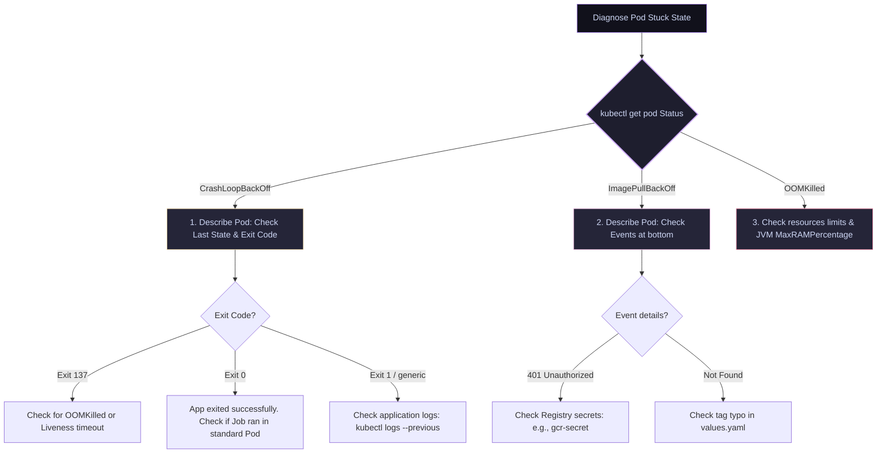

# 16 — Observability & Troubleshooting: Triage, CrashLoopBackOff & OOMKilled Playbooks

> **Why this is Topic 16:** In production, outages require fast, methodical triage. When a critical backend pod crashes at 2:00 AM, guessing is not an option. SDE2s must be able to execute a structured troubleshooting playbook. Interviewers love to present a pod in a stuck state (such as `CrashLoopBackOff`, `ImagePullBackOff`, or `OOMKilled`) and observe your path to locate the root cause. Master the triage commands, the meaning of process exit codes, and how to query terminated logs to restore services quickly.

---

## 1. WHAT

Kubernetes troubleshooting relies on inspecting resources, event logs, and active process states using three fundamental tools:

1.  **`kubectl describe`:** Displays detailed metadata, state transitions, scheduling properties, status conditions, and the recent events associated with that object (events are bounded by their TTL, ~1h by default — there is no fixed "last N" count).
2.  **`kubectl logs --previous`:** Fetches the stdout/stderr logs of the *previously terminated instance* of a container inside a restarting pod (essential for debugging application crashes).
3.  **`kubectl get events`:** Queries the namespace-wide ledger of infrastructure events (such as image pull failures, scheduling blocks, node disk pressure, and container restarts).



---

## 2. WHY (the playbooks)

Failing to resolve stuck states systematically leads to prolonged outages and configuration drift.

### 2.1 Pod Stuck States Playbooks

| Status Condition | Common Root Causes | Immediate Triage Command | Resolution Action |
| :--- | :--- | :--- | :--- |
| **`ImagePullBackOff`** | Typo in image name/tag; missing registry credential secret (`gcr-secret`). | `kubectl describe pod` (Inspect "Events" log at bottom). | Correct image tag in `values.yaml` or associate `imagePullSecrets` in deployment. |
| **`CrashLoopBackOff`** | App crash (bad DB password, missing file); non-daemon process exits (exit 0) in loop. | `kubectl logs <pod> --previous` | Fix application config; run batch script as `Job` instead of `Deployment`. |
| **`OOMKilled`** | JVM heap + off-heap exceed cgroup limit; memory leaks in native execution code. | `kubectl describe pod` (Check `Last State: Terminated / Reason: OOMKilled`). | Set `-XX:MaxRAMPercentage=75.0` or increase pod memory limits. |
| **`Evicted`** | **Node-level** pressure (memory / disk / PID); Kubelet evicts pods to reclaim resources (starts with BestEffort/Burstable that exceed requests). | `kubectl describe pod` (Check `Status: Failed / Reason: Evicted` + message) and `kubectl describe node` (Conditions: `MemoryPressure`/`DiskPressure`). | Set proper requests/limits so the pod isn't a low-priority eviction target; add node capacity; clean up disk. Evicted pod objects linger — prune them. |

---

## 3. HOW (the internals)

Let's study the execution loops behind pod status transitions and check process exit codes.

### 3.1 Decoding Container Exit Codes

When a container terminates, the **container runtime** (`containerd` / `runc`) reaps the container's init process via `waitpid` and captures its exit status. It reports that status to the **Kubelet**, which records it in `pod.status.containerStatuses[].lastState.terminated.exitCode`. (cgroups are **not** in this path — they only surface *memory* OOM events: the memory cgroup fires an OOM notification that the kubelet translates into `Reason: OOMKilled`.) This code indicates why the process stopped:

*   **Exit Code `0`:** The process terminated successfully (e.g. `System.exit(0)`).
    *   *Triage:* If a deployment pod shows this in a loop, it means you ran a batch script or migration that completed its job. Deployments expect processes to run indefinitely. Switch the workload to a **Job** controller.
*   **Exit Code `1` (or generic `1-255`):** The application process crashed due to an internal exception (e.g. unhandled NullPointerException, database connection failure).
    *   *Triage:* Run `kubectl logs --previous` to read the application stack trace.
*   **Exit Code `137` (`128 + 9`):** The process was terminated by **`SIGKILL` (Signal 9)**.
    *   *Triage:* Check the `Reason` field. If `OOMKilled`, the process crossed its cgroup memory limit. If the reason is empty, the process may have outlasted its graceful shutdown period after a liveness failure, rollout, eviction, or manual deletion.
*   **Exit Code `143` (`128 + 15`):** The process terminated gracefully via **`SIGTERM` (Signal 15)**.
    *   *Triage:* This indicates Kubelet requested shutdown (e.g. due to rolling update or scale down). If this occurs during bootup, check if startup probes are failing.

---

### 3.2 Where Logs Physically Reside

When you execute `kubectl logs`, the API server does not query the container directly.
1.  The containerized process writes stdout/stderr to `/dev/stdout` and `/dev/stderr`.
2.  The container runtime (`containerd`) redirects these streams to JSON or log files located on the host node at:
    `/var/log/pods/<namespace>_<pod-name>_<pod-uid>/<container-name>/0.log`
3.  The **Kubelet** daemon on the node reads these files.
4.  When you run `kubectl logs`, the API server contacts the node's Kubelet, which streams the log contents from the local host disk file back to your terminal.
*   *Consequence:* If a node runs out of disk space, Kubelet stops writing logs, and your log shipping agents (like Fluentd) fail to capture transactions.

---

### 3.3 From Debugging to Observability: Metrics

Logs answer *"what happened in this one pod?"*; **metrics** answer *"is the system healthy right now, and where is it degrading?"* — the other half of observability (the third pillar being **traces**, e.g. OpenTelemetry / Jaeger).

*   **`kubectl top` + metrics-server:** `kubectl top pod` / `kubectl top node` show live CPU/memory usage. This requires **metrics-server** (a lightweight in-cluster aggregator that scrapes the kubelet's Summary API); it is *not* installed by default and is the same source the **HPA** uses for autoscaling. It keeps only a short in-memory window — not historical data.
*   **Prometheus + Grafana:** For historical time-series, dashboards, and alerting, clusters run **Prometheus** (pull-based scraping of `/metrics` endpoints, e.g. Spring Boot's `/actuator/prometheus`) with **Grafana** for visualization and **Alertmanager** for paging.
*   **What to actually measure — RED & USE:** frame dashboards with two standard method sets:
    *   **RED** (request-driven services): **R**ate (req/s), **E**rrors (failed req/s), **D**uration (latency distribution / p99). Best for your microservice endpoints.
    *   **USE** (resources): **U**tilization, **S**aturation, **E**rrors. Best for nodes, CPU, memory, disk, and queues.

---

## 4. CODE / EXAMPLES

Let's look at the command sequences to triage a failing `isce-cp-dnd-service` pod.

### 4.1 Triaging a CrashLoopBackOff (Walkthrough)

```bash
# 1. Audit the namespace to identify failing pods
kubectl get pods -n isce-cp-prod
# Output:
# NAME                                   READY   STATUS              RESTARTS   AGE
# isce-cp-dnd-service-7cfbb7b9c7-abcde   0/1     CrashLoopBackOff    4          12m

# 2. Describe the pod to check exit code and last state
kubectl describe pod isce-cp-dnd-service-7cfbb7b9c7-abcde -n isce-cp-prod
# Output snippets:
#   Last State:     Terminated
#     Reason:       Error
#     Exit Code:    1
#     Finished:     Mon, 13 Jul 2026 02:35:00 +0530
#   Events:
#     Normal   Created    Created container isce-cp-dnd-service
#     Warning  BackOff    Back-off restarting failed container

# 3. Retrieve the stack trace from the crashed container instance
kubectl logs isce-cp-dnd-service-7cfbb7b9c7-abcde -n isce-cp-prod --previous --tail=50
# Output stack trace:
# 02:35:00.123 [main] ERROR org.springframework.boot.SpringApplication - Application run failed
# java.lang.IllegalArgumentException: Redis host must not be empty!
#   at org.springframework.util.Assert.hasText(Assert.java:287)
#   at com.maersk.isce.config.RedisConfig.connectionFactory(RedisConfig.java:45)
# (Root cause found: Redis configuration environment variable REDIS_HOST is missing!)
```

---

### 4.2 Querying Cluster Infrastructure Events

To see events happening across the entire namespace (such as node scheduling blocks or registry login errors):

```bash
# Get all namespace events sorted by creation time
kubectl get events -n isce-cp-prod --sort-by='.metadata.creationTimestamp'
# Output:
# 2m   Warning   FailedScheduling   pod/isce-cp-dnd-service-xyz   0/5 nodes are available: 3 Insufficient memory, 2 node(s) had untolerated taint.
# 1m   Warning   Failed             pod/isce-db-pod               Failed to pull image "gcr.io/maersk-digital/db:v3": rpc error: code = Unknown desc = failed to pull and unpack image: failed to resolve reference "gcr.io/...": pull access denied, repository does not exist or may require authorization
```

---

## 5. INTERVIEW ANGLES

### Q: A Pod is stuck in `CrashLoopBackOff`. When you run `kubectl logs <pod-name>`, it returns empty. When you run `kubectl logs <pod-name> --previous`, it says "container not found." How do you debug this?
**A:** This happens if the container crashed so quickly (e.g. in less than 1 second) during its entrypoint invocation (like a shell script syntax error or missing binary) that containerd was unable to capture any logs, or Kubelet has already deleted the exited container container object to prune host space.
**Triage steps:**
1.  **Audit the Command:** Run `kubectl describe pod` and look at the `Command` and `Args` fields to verify they are formatted correctly.
2.  **Override Entrypoint:** Temporarily modify the Deployment's template, overriding the `command` to `["sleep", "3600"]`. Apply the change. The pod will boot and sleep without executing the failing application.
3.  **Inspect Manually:** Run `kubectl exec -it <pod-name> -- sh` to shell into the sleeping container, and execute your application jar manually (`java -jar app.jar`) to capture the console error in real-time.

**Modern answer — ephemeral debug containers (`kubectl debug`):** The entrypoint-override trick fails on **distroless / scratch** images (no shell to `exec` into) and on containers that crash in <1s. Since v1.25 the clean fix is an **ephemeral container** that shares the target pod's namespaces without editing the Deployment:
```bash
kubectl debug -it <pod-name> -n <ns> --image=busybox --target=<container-name>
```
`--target=<container-name>` joins the crashing container's **process (PID), network, and IPC namespaces**, so you see its processes, `/proc`, ports, and can attach debugging tools from the busybox image even though the app image itself has no shell. Ephemeral containers have no resource guarantees and cannot be restarted — they exist purely for live triage.
> **Important distinction:** `kubectl run debug-pod --image=busybox ...` (see the network-triage recall card) launches a **completely separate pod** — it does **not** share the target's namespaces, so it's only useful for *cluster-level* network reachability tests, not for inspecting the failing container's own process/filesystem state. Use `kubectl debug --target` for that.

### Q: A pod was terminated during memory pressure, but its Exit Code is `143` instead of `137`. What does this mean?
**A:** 
*   **Exit Code `137`:** The kernel sent a **`SIGKILL` (Signal 9)**. This is a hard-kill. The kernel immediately terminated the process cgroup without executing any cleanup hooks inside the application.
*   **Exit Code `143`:** The application process terminated in response to a **`SIGTERM` (Signal 15)**. 
*   **The Scenario:** Container-level cgroup OOMs normally show `Reason: OOMKilled` and exit code `137`. Exit code `143` usually means Kubelet initiated a graceful shutdown, such as a node-pressure eviction, rollout, scale-down, or drain.
*   *Note:* If Kubelet evicts a pod due to node memory pressure, it sends `SIGTERM` first. The JVM catches this, prints graceful shutdown logs, exits with `143`, and the Pod may then show a pod-level reason such as `Evicted`, not a container-level `OOMKilled` reason.

### Q: Why does Kubelet limit the log files of containers on the host? What happens if logs fill up the disk?
**A:** To prevent logging loops from saturating host storage, Kubelet configures the container runtime's log rotation (typically limiting log files to 10MB and keeping a maximum of 5 files per container).
*   **Disk Pressure:** If log rotation fails and the host node's disk usage exceeds a threshold (typically `imagefs.available < 15%`), Kubelet triggers a **DiskPressure Node Taint**.
*   **The Eviction:** Once DiskPressure is active, the scheduler stops placing new pods on the node. Kubelet actively starts evicting running pods (starting with BestEffort classes) and aggressively garbage-collects unused container image layers to reclaim disk space, protecting the host node from locking up.

---

## 6. ONE-LINE RECALL CARDS

*   **`kubectl describe pod`** exposes pod metadata, conditions, lifecycle states, and the recent events for that object (bounded by event TTL ~1h, not a fixed count).
*   **`kubectl logs --previous`** reads stdout/stderr from the terminated container instance before it crashed.
*   **Exit Code 137** indicates a `SIGKILL` termination, commonly triggered by cgroup **OOMKills** or liveness failures.
*   **Exit Code 143** indicates a `SIGTERM` termination, representing a graceful host-initiated shutdown.
*   **Exit Code 0** means the process exited successfully; running it in a Deployment triggers infinite restart loops.
*   **Container logs** are stored physically on the host node at `/var/log/pods/` before being streamed.
*   **`ImagePullBackOff`** is caused by invalid image tags or missing registry access secrets (like `gcr-secret`).
*   **DiskPressure taints** are triggered when host storage falls below 15%, causing Kubelet to evict pods.
*   **`kubectl debug --target=<container>`** attaches an ephemeral container sharing the target's PID/network/IPC namespaces — the modern way to debug distroless / crash-fast pods.
*   **`kubectl run debug-pod --rm -it --image=busybox`** launches a *separate* pod (no shared namespaces) — only for cluster-level network reachability tests, not inspecting the failing container.
*   **`kubectl top` needs metrics-server**; Prometheus + Grafana provide historical metrics — frame dashboards with **RED** (Rate/Errors/Duration) for services and **USE** (Utilization/Saturation/Errors) for resources.
*   **`Evicted`** is a node-level (memory/disk/PID pressure) action by the kubelet, distinct from a container-level `OOMKilled`.
*   **Liveness failures** trigger container restarts on the same node, whereas **evictions** reschedule pods elsewhere.

---

**Next:** [17 — Security & Multi-Tenancy](17-security-rbac-networkpolicy.md) (RBAC, ServiceAccounts, namespaces, NetworkPolicies, Pod Security Standards, resource quotas & LimitRanges).
