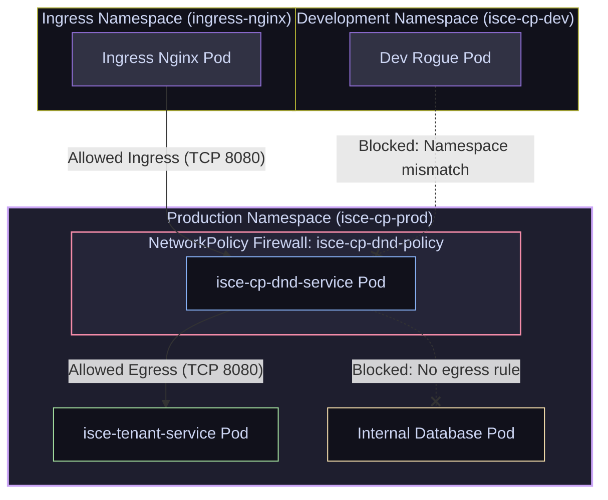

# 17 — Security & Multi-Tenancy: RBAC, ServiceAccounts, NetworkPolicies & Quotas

> **Why this is Topic 17:** Kubernetes clusters are shared multi-tenant environments. By default, Kubernetes has a "flat" network model—any pod can communicate with any other pod across the entire cluster, even across namespaces. If an attacker compromises a single public-facing web pod, they can scan internal networks, reach database pods, and access the Kubernetes API server using the pod's default token. SDE2s must understand how to enforce **least-privilege access control (RBAC)**, isolate networks using **NetworkPolicies**, restrict container capabilities using **Pod Security Standards**, and prevent resource starvation via **ResourceQuotas**.

---

## 1. WHAT

Kubernetes secures multi-tenant environments using five core security layers:

1.  **RBAC (Role-Based Access Control):** Regulates access to the Kubernetes API. It defines *who* (Subject: User, Group, or ServiceAccount) can execute *what* (Verbs: get, list, create) on *which* (Resource: pods, services, secrets) API paths.
2.  **ServiceAccount:** The API identity assigned to a Pod. Applications running inside the pod use the ServiceAccount's token to authenticate against the API server (or external Vault servers). Since **v1.24 (`BoundServiceAccountTokenVolume`)** the mounted token is no longer a static, long-lived JWT read from a Secret — it is a **projected, audience-scoped, time-bound token** that the kubelet auto-refreshes (default TTL ~1h) and that is invalidated when the pod is deleted. Kubernetes also **stopped auto-creating a long-lived Secret token per ServiceAccount** — you now have to explicitly request one if you truly need a non-expiring token.
3.  **NetworkPolicy:** A Layer-3/4 virtual firewall that specifies how groups of Pods are allowed to communicate with each other and other network endpoints.
4.  **Pod Security Standards (PSS):** Predefined security profiles (Privileged, Baseline, Restricted) enforced at the namespace level to restrict container execution privileges (e.g. blocking root execution or host path mounts). **PSS + the built-in Pod Security Admission controller REPLACED the old `PodSecurityPolicy` (PSP), which was deprecated in 1.21 and fully removed in 1.25.** Unlike PSP (which needed RBAC wiring and had confusing ordering), PSS is applied purely via **namespace labels**, with three independent modes — `enforce` (reject), `audit` (log), `warn` (client warning):
    ```yaml
    # on the Namespace
    labels:
      pod-security.kubernetes.io/enforce: restricted
      pod-security.kubernetes.io/enforce-version: latest
      pod-security.kubernetes.io/warn: restricted
    ```
5.  **ResourceQuota & LimitRange:** Administrative guardrails. **ResourceQuotas** restrict total CPU, memory, and count allocations *per namespace*. **LimitRanges** set default resource requests/limits and enforce maximum bounds for individual containers.



---

## 2. WHY (the trade-offs)

Structuring authorization and network rules shapes security postures and operations.

### 2.1 RBAC Bindings: ClusterRole vs. Role

| Resource Type | Scope Boundary | Target Subjects | Common Use Case |
| :--- | :--- | :--- | :--- |
| **`Role`** | Namespace-bound (e.g. `isce-cp-prod` only). | ServiceAccounts, Users, or Groups within that specific namespace. | Permitting `isce-cp-dnd-service` to read ConfigMaps inside its own namespace. |
| **`ClusterRole`** | Cluster-wide (non-namespaced). | ServiceAccounts, Users across *all* namespaces. | Permitting monitoring agents (Prometheus) to scrape node stats and list pods globally. |
| **`RoleBinding`** | Namespace-bound. | Binds a `Role` (or `ClusterRole`) to a subject *only inside the target namespace*. | Granting developers access to read resources *only* in `isce-cp-dev`. |
| **`ClusterRoleBinding`** | Cluster-wide. | Binds a `ClusterRole` globally. | Granting administrative rights to cluster operators. |

---

## 3. HOW (the internals)

Let's study the enforcement mechanisms behind API authorization and network filtering.

### 3.1 API Authorization Flow

1.  **Authentication:** The API Server authenticates the user or pod ServiceAccount token via JWT validation.
2.  **Request Inspection:** The server inspects the request details:
    *   `Path`: `/api/v1/namespaces/isce-cp-prod/pods`
    *   `Verb`: `GET`
    *   `Resource`: `pods`
3.  **RBAC Check:** The authorization module checks the active bindings in `etcd`:
    *   Does a `RoleBinding` exist in `isce-cp-prod` binding the Subject to a Role that allows verb `get` on resource `pods`?
    *   If yes, the request is authorized. If no, the request is rejected with a `403 Forbidden` code.

---

### 3.2 NetworkPolicy Enforcement (CNI & Netfilter)

A `NetworkPolicy` is a declarative specification. It does **not** perform packet filtering itself:
1.  When you apply a NetworkPolicy, the API server saves the spec in `etcd`.
2.  The **CNI network plugin** (running as a daemonset on every node, e.g. Cilium, Calico) watches the API server.
3.  The plugin translates the selectors (e.g. matchLabels `app: isce-cp-dnd-service`) into **actual IP addresses** using the endpoints list.
4.  The CNI programs the node's local network kernel:
    *   **Calico and other policy-capable CNIs:** Write **`iptables`** rules or IP Sets directly in the host's Linux firewall.
    *   **Cilium:** Compiles and loads **eBPF (Extended Berkeley Packet Filter)** programs directly into the host's network socket hook, bypassing iptables entirely for maximum routing speed.
5.  If a container process attempts to send an unauthorized packet (e.g. crossing namespaces), the kernel drops the packet at the socket level.

---

### 3.3 Default Deny Network Posture

By default, pods are **isolated: false**—all ingress and egress are allowed.
*   **The Best Practice:** Implement a **Default Deny-All** NetworkPolicy in production namespaces.
*   Once applied, all traffic in and out of the namespace is blocked.
*   Developers must write explicit, whitelisted NetworkPolicies for each microservice, defining exact ingress sources and egress destinations.

> [!WARNING]
> **A NetworkPolicy is only as real as the CNI enforcing it.** The `NetworkPolicy` object is *just an API record* — enforcement is entirely delegated to the CNI plugin. Some CNIs (notably **flannel**) have **no NetworkPolicy support and silently ignore them** — the API server accepts your policy, `kubectl get netpol` shows it, but **no packets are ever dropped**. Applying a "default-deny" on such a cluster gives dangerous **false security**. Verify your CNI enforces policies (Calico, Cilium, Weave, Antrea do; flannel does not — pair it with Calico for policy, i.e. "Canal") and actually test a blocked path.

---

## 4. CODE / EXAMPLES

### 4.1 Production Least-Privilege RBAC Template

Here is a configuration for a microservice ServiceAccount. It has read-only access to ConfigMaps inside the `isce-cp-prod` namespace:

```yaml
apiVersion: v1
kind: ServiceAccount
metadata:
  name: isce-dnd-serviceaccount
  namespace: isce-cp-prod
# Prevent mounting the API token automatically if the pod doesn't query the API server directly
automountServiceAccountToken: false

---
apiVersion: rbac.authorization.k8s.io/v1
kind: Role
metadata:
  name: configmap-reader-role
  namespace: isce-cp-prod
rules:
  - apiGroups: [""]  # Core API group
    resources: ["configmaps"]
    verbs: ["get", "list", "watch"]

---
apiVersion: rbac.authorization.k8s.io/v1
kind: RoleBinding
metadata:
  name: bind-dnd-to-config-reader
  namespace: isce-cp-prod
subjects:
  - kind: ServiceAccount
    name: isce-dnd-serviceaccount
    namespace: isce-cp-prod
roleRef:
  kind: Role
  name: configmap-reader-role
  apiGroup: rbac.authorization.k8s.io
```

---

### 4.2 Production NetworkPolicy for `isce-cp-dnd-service`

Here is a hardened NetworkPolicy. It blocks all traffic by default, whitelisting only the necessary paths:

```yaml
apiVersion: networking.k8s.io/v1
kind: NetworkPolicy
metadata:
  name: isce-cp-dnd-netpolicy
  namespace: isce-cp-prod
spec:
  podSelector:
    matchLabels:
      app: isce-cp-dnd-service
  policyTypes:
    - Ingress
    - Egress
  
  # Ingress Whitelist: Allow traffic ONLY from the Ingress NGINX controller namespace on port 8080
  ingress:
    - from:
        - namespaceSelector:
            matchLabels:
              kubernetes.io/metadata.name: ingress-nginx
      ports:
        - protocol: TCP
          port: 8080
          
  # Egress Whitelist: Restrict outbound communication
  egress:
    # 1. Allow calls to CoreDNS for name resolution
    - to:
        - namespaceSelector: {}  # All namespaces
          podSelector:
            matchLabels:
              k8s-app: kube-dns
      ports:
        - protocol: UDP
          port: 53
        - protocol: TCP
          port: 53
    # 2. Allow egress to tenant service inside the same namespace
    - to:
        - podSelector:
            matchLabels:
              app: isce-tenant-service
      ports:
        - protocol: TCP
          port: 8080
```

---

## 5. INTERVIEW ANGLES

### Q: What is the security risk of leaving `automountServiceAccountToken: true` active on all Pods?
**A:** By default, Kubernetes mounts a ServiceAccount's API token (a JWT) as a file inside the container at `/var/run/secrets/kubernetes.io/serviceaccount/token`.
*   **The Risk:** If an attacker exploits a remote code execution (RCE) vulnerability in your Spring Boot application (e.g. Log4Shell), they gain shell access. They can immediately read this token file.
*   **The Blast Radius:** The attacker can run `curl https://kubernetes.default.svc/api/v1/namespaces/isce-cp-prod/secrets -H "Authorization: Bearer $(cat token)"` to query all cluster secrets. If the default ServiceAccount has elevated permissions, the attacker compromises the entire namespace.
*   *Mitigation:* Set `automountServiceAccountToken: false` on all Pod specs unless the pod specifically queries the API server. If API access is required, write a custom, highly restricted Role rather than using the default ServiceAccount.
*   *Modern nuance (v1.24+):* The mounted token is now a **projected, audience-scoped, auto-rotated bound token** (via `BoundServiceAccountTokenVolume`), not a static long-lived Secret JWT, and standalone long-lived Secret tokens are no longer auto-created per ServiceAccount. This shrinks the blast radius — a token exfiltrated by an attacker expires (~1h) and dies with the pod, so it can't be replayed indefinitely. **It does not fix the RCE-read scenario above**: while the pod is alive the attacker can still read the currently-valid token from the projected volume and hit the API server, so least-privilege RBAC + `automountServiceAccountToken: false` remain the real controls.

### Q: Can you bind a `ClusterRole` to a subject in a specific namespace using a `RoleBinding`? What is the scope of permissions?
**A:** Yes, you can bind a `ClusterRole` using a standard `RoleBinding`.
*   **The Scope:** The permissions granted to the subject are **restricted to the namespace of the RoleBinding**.
*   **Why this is useful:** This allows reusing standardized administrative roles. For example, the cluster admin defines a ClusterRole `view-secrets`. Instead of recreating this role in 50 developer namespaces, the admin creates a `RoleBinding` in namespace `dev-1` pointing to the ClusterRole. The user can view secrets *only in `dev-1`*, not globally.
*   *Note:* If you bound it using a `ClusterRoleBinding`, the user would have view access to secrets across every namespace in the cluster.

### Q: How do the built-in `view` / `edit` / `admin` ClusterRoles automatically pick up permissions for new CRDs? (RBAC aggregation)
**A:** Through **ClusterRole aggregation** (`aggregationRule`). An aggregated ClusterRole owns **no rules of its own**; instead it declares a label selector, and the RBAC controller **continuously merges the rules of every ClusterRole matching that selector** into it.
*   The built-in `view`, `edit`, and `admin` ClusterRoles are all aggregated. For example `admin` aggregates roles labeled `rbac.authorization.k8s.io/aggregate-to-admin: "true"` (and `admin` also transitively pulls in `edit`, which pulls in `view`).
*   **How a CRD extends `view`:** when you install an operator, it ships a small ClusterRole granting `get/list/watch` on its new custom resource, labeled `rbac.authorization.k8s.io/aggregate-to-view: "true"`. The controller merges it, so everyone already bound to `view` can now read the CRD **without editing the built-in role**. This is the intended extension mechanism — you never patch the reserved system roles directly.
```yaml
apiVersion: rbac.authorization.k8s.io/v1
kind: ClusterRole
metadata:
  name: aggregate-widgets-view
  labels:
    rbac.authorization.k8s.io/aggregate-to-view: "true"   # merged into built-in "view"
rules:
  - apiGroups: ["example.com"]
    resources: ["widgets"]
    verbs: ["get", "list", "watch"]
```

### Q: Explain the difference between `ResourceQuota` and `LimitRange`.
**A:** 
*   **`ResourceQuota`:** Enforces limits on the **namespace as a whole**. For example, it caps the sum of all pod memory requests to `50Gi`. If developers attempt to deploy a pod that pushes total requests to `51Gi`, the API server rejects the deployment.
*   **`LimitRange`:** Enforces rules on **individual containers** inside the namespace.
    *   *Default limits:* If a developer deploys a pod without resource definitions, the LimitRange automatically injects configured default requests and limits (preventing it from running as BestEffort and risking node eviction).
    *   *Enforcements:* It validates that container requests are not below a minimum (e.g. `10m` CPU) and do not exceed a maximum (e.g. `4Gi` memory). Both `LimitRange` and `ResourceQuota` are enforced by **API-server admission control** (the built-in `LimitRanger` and `ResourceQuota` admission plugins), *not* an "API gateway" — invalid specs are rejected during the admission phase before the object is persisted to `etcd`.

---

## 6. ONE-LINE RECALL CARDS

*   **RBAC** determines who can execute verbs on resources, whereas **NetworkPolicies** control IP network packet routing.
*   **Namespaces** do **not** provide network isolation; they are soft administrative groupings.
*   **ServiceAccount tokens** are JWTs mounted at `/var/run/secrets/kubernetes.io/serviceaccount/`; since v1.24 they are **projected, audience-scoped, auto-rotated bound tokens** (not static Secret JWTs), and standalone long-lived Secret tokens are no longer auto-created.
*   **`automountServiceAccountToken: false`** disables automatic JWT mounting, shrinking container exploit attack vectors.
*   **RBAC aggregation** (`aggregationRule` + `aggregate-to-view/edit/admin` labels) lets built-in roles auto-absorb rules from CRD ClusterRoles without patching the reserved roles.
*   **PSS + Pod Security Admission replaced PodSecurityPolicy** (PSP removed in 1.25); applied via `pod-security.kubernetes.io/enforce|audit|warn` namespace labels.
*   **NetworkPolicies** are enforced at the node kernel level by the CNI plugin using `iptables` or `eBPF`.
*   **A NetworkPolicy is inert without an enforcing CNI** — flannel silently ignores them, so default-deny becomes false security; use Calico/Cilium/Antrea (or Canal) and test.
*   **Default Deny-All** NetworkPolicies isolate namespaces, forcing explicit whitelisting of ingress/egress.
*   **Binding a ClusterRole via a RoleBinding** restricts the scope of those permissions to the binding's namespace.
*   **`ResourceQuotas`** limit cumulative resource consumption (e.g., maximum memory/CPU) within a namespace.
*   **`LimitRanges`** automatically inject default requests and limits to pods lacking explicit declarations.
*   **eBPF-based CNIs (Cilium)** route packets faster than iptables by intercepting sockets directly in the kernel.

---

**Next:** [18 — Rollouts & Production Ops](18-rollouts-helm-gitops.md) (rolling / blue-green / canary, Helm basics, GitOps, zero-downtime deploys for microservices).
