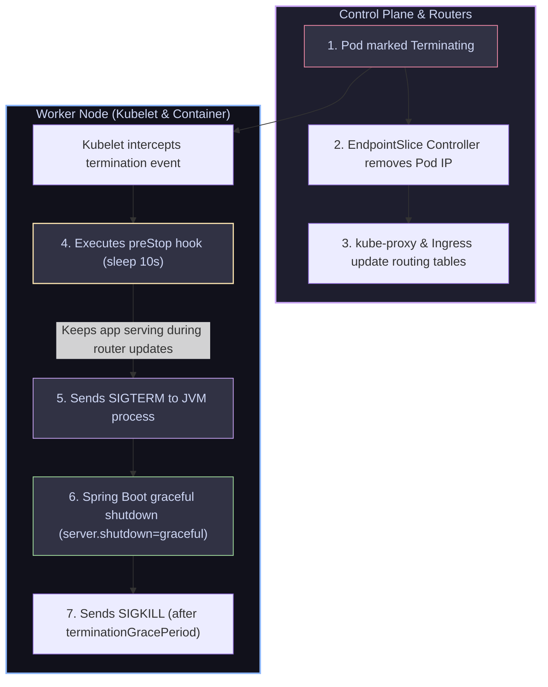

# 18 — Rollouts & Production Ops: Blue-Green, Canary, Helm & GitOps

> **Why this is Topic 18:** This is the Capstone topic that ties the entire track back to shipping backend microservices safely in production. Deploying code to Kubernetes using basic scripts runs the risk of packet drops, database locking, or slow rollbacks during incidents. SDE2s must master advanced deployment strategies (**Blue-Green**, **Canary**), understand how package managers like **Helm** template manifests, and implement **GitOps** (ArgoCD) to reconcile cluster state. Most importantly, you must be able to explain the exact race condition that causes rolling updates to drop traffic and how to configure containers to achieve true, packet-loss-free zero-downtime rollouts.

---

## 1. WHAT

Production container operations rely on structured rollout pipelines and package definitions:

1.  **Deployment Strategies vs. Patterns:**
    > [!IMPORTANT]
    > A native `Deployment.spec.strategy.type` accepts **only two values: `RollingUpdate` or `Recreate`**. **Blue-Green and Canary are *patterns*, not strategy types** — they are not selectable on a Deployment. They require extra tooling: **Argo Rollouts** or **Flagger**, a **service mesh** (Istio / Linkerd traffic splitting), or a manual **two-Deployment + Service-selector-swap**. Claiming `strategy.type: Canary` in an interview is an instant red flag.
    *   **Rolling Update** *(native)*: Default strategy. Incrementally replaces old pods with new pods (guided by `maxSurge` / `maxUnavailable`).
    *   **Recreate** *(native)*: Terminates **all** old pods first, then creates new ones — causes downtime, but guarantees no two versions run at once (useful for incompatible schema migrations or singletons).
    *   **Blue-Green** *(pattern — needs tooling)*: Deploys a complete duplicate replica pool running the new version (Green) alongside the active old pool (Blue). Once verified, traffic is flipped instantly at the Ingress/Router/Service-selector level.
    *   **Canary** *(pattern — needs tooling)*: Routes a small percentage of live traffic (e.g. 5%) to a small target pool of new pods. If metrics show no errors, the rollout scales up to 100%.
2.  **Helm:** The package manager for Kubernetes. It aggregates individual Kubernetes YAML manifests into a single reusable unit (a Chart) and templates configurations using a centralized `values.yaml` file.
3.  **GitOps (e.g. ArgoCD, Flux):** A continuous delivery model where Git is the single source of truth. An in-cluster controller monitors a Git repository. If cluster state drifts from the committed Git files, the controller pulls the changes and applies them (reconciling desired state from Git).



---

## 2. WHY (the trade-offs)

Selecting deployment strategies and delivery tools dictates infrastructure costs and shapes rollback capabilities during failures.

### 2.1 Deployment Strategies Comparison

| Strategy / Pattern | Native? | Infrastructure Cost | Rollback Speed | Verification Strength | API/DB Compatibility |
| :--- | :--- | :--- | :--- | :--- | :--- |
| **`RollingUpdate`** | Native `strategy.type` | **Low:** Uses minimal extra pods (guided by `maxSurge`). | **Fast:** `kubectl rollout undo` scales the *previously retained* ReplicaSet back up (no image rebuild/re-pull) — seconds, not minutes. | **Low:** All users are exposed to changes incrementally. | **Strict:** App must support multi-version concurrency. |
| **`Recreate`** | Native `strategy.type` | **Low:** No overlap; old pods die before new ones start. | **Fast:** Roll back to the prior ReplicaSet (still incurs a downtime gap). | **Low:** No live pre-verification — full cutover. | **Relaxed:** Only one version ever runs, so no multi-version concurrency needed. |
| **`Blue-Green`** | Pattern (Argo Rollouts / mesh) | **High:** Requires 200% resource overhead (running Blue and Green pools simultaneously). | **Instant:** Flip the router pointer back to the Blue pool (takes <1s). | **Medium:** Can run QA tests on the Green pool before opening public traffic. | **Strict:** Multi-version database access must be handled. |
| **`Canary`** | Pattern (Argo Rollouts / Flagger / mesh) | **Low-Medium:** Small canary pool running concurrently. | **Fast:** Terminate canary routing rules (takes seconds). | **Maximum:** Verified using a subset of real production users and traffic. | **Strict** |

### 2.2 CD Delivery Models: GitOps Pull vs. CI/CD Push

*   **Push Model (e.g. Jenkins, GitHub Actions):** The CI pipeline builds the container, connects to the Kubernetes API server using admin credentials, and executes `kubectl apply` commands.
    *   *Trade-off:* High security risk (cluster admin keys must be stored in third-party GitHub runners).
*   **Pull Model (GitOps - ArgoCD):** An operator runs inside the cluster. It watches a Git repo, detects config changes, and pulls them into the cluster.
    *   *Trade-off:* Highly secure (no admin keys reside outside the cluster). Restores configurations automatically if a developer modifies resources manually (drift reconciliation).

---

## 3. HOW (the internals)

Let's dissect the network race condition that occurs when terminating pods during a rolling update, and how to prevent dropped packets.

### 3.1 The Pod Termination Race Condition

During a Rolling Update, Kubernetes scales down the old ReplicaSet. When Kubelet receives the command to delete a pod:
1.  **Marking Terminating:** The API server marks the Pod status as `Terminating`.
2.  **EndpointSlice Removal:** The **EndpointSlice Controller** detects the change. It removes the Pod IP from the Service's endpoint set. This change must propagate to Ingress controllers and `kube-proxy` daemons across all worker nodes.
3.  **Kubelet Execution:** Concurrently, Kubelet receives the deletion watch event. It does **not** wait for endpoint propagation. It immediately sends a **`SIGTERM` (Signal 15)** to the container process.
4.  **The Race Condition:** The Endpoint propagation is asynchronous and takes **2–5 seconds** to complete. If the Spring Boot JVM process shuts down immediately upon receiving the `SIGTERM`, but the Ingress controller or a remote node's `kube-proxy` table has not been updated yet, packets targeting the old Pod IP continue to arrive. Because the container process is dead, the node rejects the packets, resulting in **502 Bad Gateway** errors for clients.

#### The Zero-Downtime Solution:
To achieve zero-downtime, you must force the container process to wait until all routers have removed its IP:

1.  **`preStop` Hook (K8s configuration):** Run a sleep script inside the container (e.g. `sleep 10`). When Kubelet initiates deletion, it executes the `preStop` hook **before** sending the `SIGTERM`. During the 10-second sleep, the container remains running and processes any remaining in-flight requests.
2.  **Graceful Shutdown (Spring Boot configuration):** Configure `server.shutdown=graceful` in your properties. When the JVM finally receives the `SIGTERM` (after the 10s sleep), it stops accepting new requests but stays alive to complete existing requests that are already inside the servlet queue (up to a configured timeout limit).
3.  **`terminationGracePeriodSeconds`:** Ensure this setting is large enough to accommodate the sum of the `preStop` sleep and Spring Boot's graceful shutdown timeout before Kubelet sends a hard-kill `SIGKILL`. **Caveat:** `preStop(15) + graceful(30) = 45` has *zero* margin — the grace period countdown starts when termination begins (it does **not** reset after `preStop`), so if Spring uses its full 30s the `SIGKILL` fires exactly at the boundary and can cut off the last in-flight request. Add a buffer (e.g. `50s`).

---

## 4. CODE / EXAMPLES

### 4.1 Production Zero-Downtime Deployment Configuration

Here is the exact template required to configure a packet-loss-free deployment for a Spring Boot service:

**The Spring Boot Configurations (`src/main/resources/application.properties`):**
```properties
# Enable graceful shutdown support (default is IMMEDIATE)
server.shutdown=graceful
# Set maximum wait time for active requests to complete
spring.lifecycle.timeout-per-shutdown-phase=30s
```

**The Deployment Template (`templates/deployment.yaml`):**
```yaml
apiVersion: apps/v1
kind: Deployment
metadata:
  name: isce-cp-dnd-service
  namespace: isce-cp-prod
spec:
  replicas: 3
  strategy:
    type: RollingUpdate
    rollingUpdate:
      maxSurge: 1
      maxUnavailable: 0  # Force new pods to be ready before deleting old ones
  template:
    spec:
      containers:
        - name: isce-cp-dnd-service
          image: isce-cp-dnd-service:v2.1.0
          lifecycle:
            preStop:
              exec:
                command: [ "sh", "-c", "sleep 15" ]  # Delay SIGTERM to allow endpoint sync
          ports:
            - containerPort: 8080
          readinessProbe:
            httpGet:
              path: /actuator/health/readiness
              port: 8080
            initialDelaySeconds: 10
            periodSeconds: 5
      # preStop (15s) + graceful shutdown (30s) = 45s is the ABSOLUTE minimum with zero margin.
      # The grace-period clock starts at termination and does NOT reset after preStop, so use a
      # buffer (50s) or SIGKILL can cut off the last in-flight request at the boundary.
      terminationGracePeriodSeconds: 50
```

    > [!NOTE]
    > Shell-based `preStop` hooks require a shell in the image. For distroless images, use a Kubernetes lifecycle sleep action if supported by your cluster version, or expose an application/sidecar shutdown endpoint that performs the delay.

---

### 4.2 GitOps Declarative Application Spec (ArgoCD)

To manage this deployment via GitOps, save this manifest inside your management repository:

```yaml
apiVersion: argoproj.io/v1alpha1
kind: Application
metadata:
  name: isce-cp-dnd-service-prod
  namespace: argocd
spec:
  project: default
  source:
    repoURL: 'https://github.com/maersk-digital/isce-deployments.git'
    targetRevision: HEAD
    path: charts/isce-cp-dnd-service
    helm:
      valueFiles:
        - values/prod/values.yaml
  destination:
    server: 'https://kubernetes.default.svc'
    namespace: isce-cp-prod
  syncPolicy:
    automated:
      prune: true  # Automatically delete resources deleted in Git
      selfHeal: true  # Revert manual cluster modifications back to match Git
```

---

## 5. INTERVIEW ANGLES

### Q: Why does setting `maxUnavailable: 0` alone not guarantee zero-downtime during a rolling update?
**A:** Setting `maxUnavailable: 0` guarantees that Kubelet will not terminate an old Pod until a replacement Pod has booted and passed its readiness probe.
*   **The Problem:** Once the new Pod is Ready, Kubelet initiates the deletion of the old Pod. The API server marks the old Pod as `Terminating`.
*   **The Race:** Kubelet sends the `SIGTERM` immediately to the container process. However, EndpointSlice updates can take 2–5 seconds to reach Ingress controllers and `kube-proxy` rules across the cluster.
*   **The Result:** During this 2–5 second window, incoming user requests are still routed to the old Pod IP. Because the JVM process has terminated or is shutting down in response to the `SIGTERM`, clients receive **502 Bad Gateway** or connection reset errors. You must combine `maxUnavailable: 0` with a **container `preStop` hook sleep** to delay the shutdown signal until the endpoint routing tables are updated.

### Q: Helm 2 vs Helm 3 — what changed?
**A:** The headline change: **Helm 3 removed Tiller.** Helm 2 ran a cluster-side component (**Tiller**) with broad, often cluster-admin permissions; every `helm` command talked to Tiller, which then talked to the API server. This was a major security hole (Tiller's credentials were a privilege-escalation target) and made RBAC awkward. Helm 3 is **client-only** — the `helm` CLI talks directly to the API server using *your* kubeconfig credentials, so RBAC is honored per-user. Secondary Helm 3 changes: release history moved to **Secrets** (namespace-scoped) instead of Tiller's ConfigMaps, three-way strategic merge on upgrades/rollbacks, and release names are now namespace-scoped rather than cluster-global.

### Q: How does Helm track configuration history? What happens during a `helm rollback`?
**A:** Helm does not rely on a database. It stores release history directly inside **Kubernetes Secrets** (or ConfigMaps) in the target namespace.
*   **The Secrets:** If you run `helm install my-app`, Helm creates a secret named `sh.helm.release.v1.my-app.v1`. Inside this secret, Helm stores a gzipped, base64-encoded JSON payload containing the complete release metadata, Chart files, and values.yaml configurations.
*   **The Rollback:** When you run `helm rollback my-app 2`:
    1.  Helm reads the secret `sh.helm.release.v1.my-app.v2` containing the Target configuration.
    2.  Helm compares this historical configuration against the current active cluster resources.
    3.  It calculates the diff and submits standard K8s API patches (`kubectl apply` equivalents) to revert the cluster back to the desired v2 state.
    4.  It registers a new version secret `sh.helm.release.v1.my-app.v3` representing the rollback event.

### Q: How do you *automate* a canary — who decides to promote or roll back?
**A:** In a naive canary you eyeball a dashboard and manually scale up; production setups automate the promotion decision with **metric-based analysis**.
*   **Argo Rollouts** replaces the Deployment with a `Rollout` CRD and runs **`AnalysisTemplate`s** between canary steps. Each step queries a metrics provider (Prometheus, Datadog, CloudWatch) — e.g. "p99 latency < 500ms AND 5xx error rate < 1% over the last 5 min." If the query passes, the controller advances to the next weight (5% → 25% → 50% → 100%); if it fails, it **auto-aborts and rolls back**.
*   **Flagger** does the same declaratively on top of a service mesh / ingress (Istio, Linkerd, NGINX): it drives the traffic split, scrapes **Prometheus** metrics against success-rate/latency thresholds, and promotes or rolls back automatically — no human in the loop.
*   The key SDE2 point: **native Kubernetes has no notion of metric-gated promotion** — that intelligence lives entirely in Argo Rollouts / Flagger, which is exactly why canary is a *pattern requiring tooling*, not a `strategy.type`.

### Q: Explain the benefit of GitOps "self-healing" and "drift detection."
**A:** 
*   **Drift Detection:** In traditional operations, a developer might troubleshoot an incident by running `kubectl edit deployment` to manually increase RAM allocations or add environment variables. This creates "configuration drift"—the cluster state no longer matches the Git files. The GitOps operator (ArgoCD) continuously compares the Git files against the active cluster configurations. If they differ, it flags the application as `OutOfSync`.
*   **Self-Healing:** If self-healing is enabled, ArgoCD automatically overrides the manual changes. It submits API requests to revert the cluster resources back to the committed Git configuration, enforcing consistency and ensuring that emergency hotfixes are committed to Git rather than left as undocumented cluster modifications.

---

## 6. ONE-LINE RECALL CARDS

*   **`strategy.type` accepts ONLY `RollingUpdate` or `Recreate`** — Blue-Green and Canary are patterns needing Argo Rollouts / Flagger / a service mesh, not native strategy types.
*   **Rolling Updates** incrementally replace old pods with new pods, utilizing minimal resource overhead.
*   **`Recreate`** kills all old pods before starting new ones — brief downtime, but never runs two versions at once.
*   **`kubectl rollout undo`** scales the retained previous ReplicaSet back up (per `revisionHistoryLimit`) — no image rebuild or re-pull.
*   **Blue-Green deployments** provide instant rollbacks by switching traffic between two identical active pools.
*   **Canary deployments** route a small fraction of live traffic to new pods to verify performance metrics.
*   **Automated canary** uses Argo Rollouts `AnalysisTemplate`s or Flagger + Prometheus to gate promotion on metrics and auto-rollback.
*   **The preStop hook** delays the `SIGTERM` signal, allowing routers to remove the Pod IP before the container exits.
*   **`server.shutdown=graceful`** tells Spring Boot to complete active servlet requests before terminating the JVM.
*   **Helm 3 removed Tiller** — the CLI now talks straight to the API server with your kubeconfig RBAC (no cluster-admin server component).
*   **Helm stores release history** inside gzipped, base64-encoded Kubernetes Secrets in the target namespace.
*   **GitOps Pull model** reconciles desired cluster state from Git, eliminating the need to expose API keys to runners.
*   **ArgoCD self-healing** automatically overrides manual `kubectl` cluster edits to enforce Git-committed states.
*   **`maxUnavailable: 0`** ensures replacement pods pass readiness probes before old pods are targeted for deletion.
*   **`terminationGracePeriodSeconds`** must exceed (not just equal) the sum of the `preStop` sleep and the JVM graceful exit timeout — the clock does not reset after `preStop`, so leave a buffer.

---

**Congratulations!** You have completed the deep-dive track on Containers & Kubernetes. Feel free to review the core curriculum index at [index.md](index.md).
