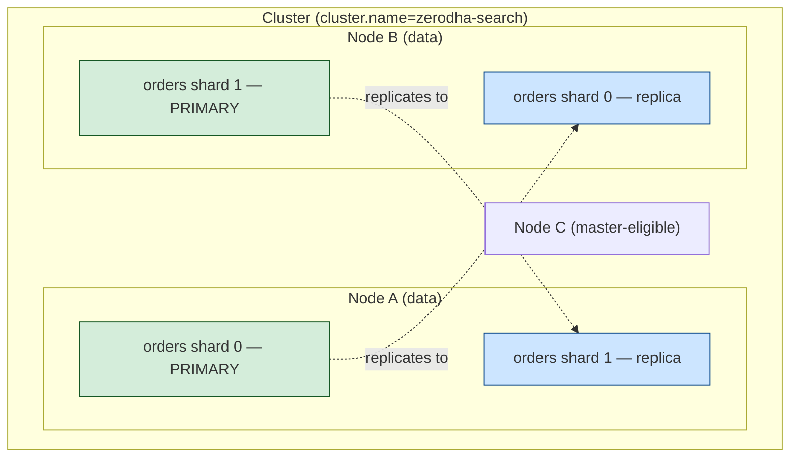
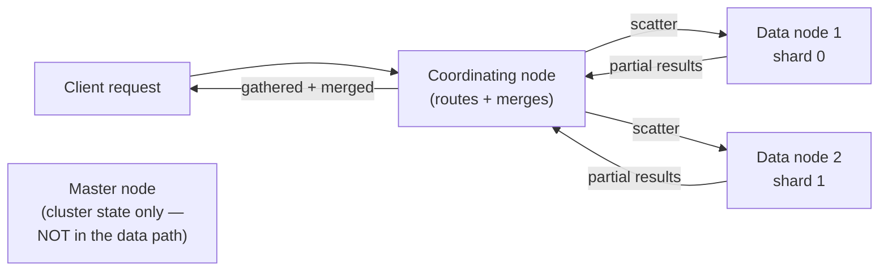
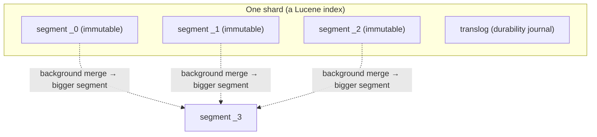

# 01 — Core Architecture & Data Model

> **Why this is Topic 1:** Every Elasticsearch deep-dive — the inverted index, refresh/flush, scoring,
> aggregations, distributed search — is downstream of *how ES physically organizes data into clusters,
> nodes, indices, shards, and segments*. Get this hierarchy right and the rest falls out. Zerodha-style
> interviews start here ("what's a shard vs a replica?", "why can't you change shard count after
> creation?", "is ES a database?") and use your answers to calibrate how deep they push.

---

## 1. WHAT

Elasticsearch is a **distributed, document-oriented search and analytics engine** built on top of
**Apache Lucene**. You put **JSON documents** into **indices**; ES splits each index into **shards**
(each shard is an independent Lucene index), spreads them across **nodes** in a **cluster**, and
replicates them for HA. It is **near-real-time** (writes searchable ~1s later) and **AP-leaning** (favors
availability over strict consistency) — it is *not* an ACID transactional database.

The slogan to memorize:

> **An Elasticsearch index is a logical namespace that maps to one or more physical shards, and every
> shard is a self-contained Lucene engine.**

### The hierarchy (top to bottom)

| Level | What it is | SQL-ish analogy (loose!) |
|-------|-----------|--------------------------|
| **Cluster** | A set of nodes sharing the same `cluster.name`, coordinated by an elected master | A database server group |
| **Node** | A single ES (JVM) process, usually one per host | A server instance |
| **Index** | A named collection of documents with a mapping | A table (conceptually) |
| **Shard** | A horizontal slice of an index = one Lucene index | A table partition |
| **Segment** | An immutable Lucene file-set inside a shard | An LSM-tree segment |
| **Document** | A JSON object, the unit of indexing/search | A row |
| **Field** | A key in the JSON, typed by the mapping | A column |



Note the placement rule: **a primary and its own replica never sit on the same node** — otherwise losing
that node loses both copies.

---

## 2. WHY (the problem this model solves)

A single Lucene index on one machine has two limits: it's bounded by **one host's disk/RAM/CPU**, and a
host failure loses the data. Elasticsearch wraps Lucene with a distribution layer to solve both:

1. **Sharding → horizontal scale.** Splitting an index into N shards lets you spread data and query load
   across N machines. A 2 TB index becomes 10 × 200 GB shards on 10 nodes.
2. **Replication → high availability + read throughput.** Each primary shard has R replicas on *other*
   nodes. A node dies → a replica is promoted, no data lost. Replicas also serve reads, multiplying read
   capacity.
3. **Near-real-time search at scale.** Lucene's immutable-segment design (Topic 2/3) makes writes cheap
   and reads lock-free, but ES adds the cluster coordination, routing, and scatter-gather (Topic 9) that
   make it work across many shards.

The trade you accept: **no cross-document ACID transactions, eventual visibility (refresh lag), and a
shard count you must get roughly right up front.** Those are acceptable for *search/analytics*, fatal for
*a ledger* — which is exactly why ES sits beside Postgres, never replaces it (Topic 12).

---

## 3. HOW (the internals)

### 3.1 Node roles — not every node does everything

In a real cluster you assign **roles** so responsibilities don't contend:

| Role | Job | Notes |
|------|-----|-------|
| **master-eligible** | Cluster state: create/delete indices, allocate shards, track membership | Elect **one** active master; keep ≥3 master-eligible for quorum (Topic 10) |
| **data** | Hold shards, execute index/search/aggregation | The workhorses; often subdivided hot/warm/cold (Topic 11) |
| **ingest** | Run ingest pipelines (transform docs before indexing) | Lightweight ETL |
| **coordinating** | Receive client request, route to shards, gather + merge results | *Every* node can coordinate; dedicated coordinating-only nodes offload the merge |
| **ml / transform** | Machine learning / transforms | Optional |

**Why separate master from data:** a data node doing a heavy aggregation can GC-pause; if it were also
master, the cluster could lose its coordinator mid-pause and trigger a needless election. Dedicated
master nodes keep the control plane stable.



The master is **not** in the read/write data path — a common misconception. It manages metadata
(the **cluster state**); reads and writes flow through coordinating → data nodes directly.

### 3.2 Index → shard: primaries and replicas

- **Primary shards:** set at index creation (`number_of_shards`) and **immutable thereafter** (changing
  it requires reindexing or the `_split`/`_shrink` APIs that create a new index). This is *the* gotcha:
  you must size shard count up front (Topic 11).
- **Replica shards:** set by `number_of_replicas` and **changeable any time** — copies of primaries on
  other nodes. `replicas = 1` means one extra copy (2 total). Total shards = `primaries × (1 + replicas)`.

Why primary count is fixed: a document's home shard is computed as
`shard = hash(_routing) % number_of_primary_shards` (Topic 9). If you changed the divisor, every
document would route to a different shard and the index would be corrupt. So the divisor is frozen.

### 3.3 Shard = a Lucene index = a set of immutable segments

Each shard is a full Apache Lucene index. Inside it, data lives in **segments** — immutable, self-contained
inverted-index file-sets. New documents go into new segments; updates/deletes are "new doc + tombstone"
(Topic 2/3). A background **merge** consolidates small segments into bigger ones. This LSM-tree-like
design is *why* ES writes are fast and reads are lock-free, and *why* visibility is delayed until a
**refresh** exposes new segments (Topic 3).



### 3.4 The cluster state and health colors

The master maintains the **cluster state**: index metadata, mappings, shard routing table, node list.
Health is a traffic light you'll be asked about:

| Color | Meaning |
|-------|---------|
| 🟢 **green** | All primaries **and** all replicas assigned |
| 🟡 **yellow** | All primaries assigned, **some replicas** unassigned (data safe, redundancy reduced) |
| 🔴 **red** | At least one **primary** unassigned → that shard's data is **unavailable** |

A single-node dev cluster with `replicas ≥ 1` is permanently **yellow** — the replica has nowhere to go
(can't sit on the same node as its primary). That's expected, not a bug.

### 3.5 Document, `_id`, mapping, and versioning

- A **document** is JSON with metadata: `_index`, `_id` (yours or auto-generated), `_version`,
  `_seq_no`/`_primary_term` (used for optimistic concurrency).
- **Mapping** defines field types (Topic 5). Unlike a row in a fixed schema, ES can **dynamically map**
  new fields — convenient but a footgun (mapping explosion, Topic 5).
- ES has **no row-level transactions**, but supports **optimistic concurrency control**: re-index with
  `if_seq_no` + `if_primary_term`, and the write fails if the doc changed underneath you. This is how you
  get safe read-modify-write on a single document — not a substitute for Postgres transactions.

### 3.6 Indices vs data streams vs aliases (operational layer)

- **Alias:** a pointer to one or more indices; lets you swap the physical index behind a stable name
  (zero-downtime reindex). Always query an alias, not a raw index, in production.
- **Data stream:** an append-only abstraction over time-series indices (logs, metrics, audit events),
  backed by ILM-rolled indices (Topic 11). The standard pattern for the ELK/observability use case.

---

## 4. CODE / EXAMPLES

```bash
# Cluster health (the first thing you run on any cluster)
GET _cluster/health
# → { "status": "green", "number_of_nodes": 3, "active_primary_shards": 2,
#     "active_shards": 4, "unassigned_shards": 0, ... }

# Create an index with explicit shard/replica counts (size shards up front!)
PUT /orders
{
  "settings": { "number_of_shards": 3, "number_of_replicas": 1 },
  "mappings": {
    "properties": {
      "order_id":  { "type": "keyword" },
      "symbol":    { "type": "keyword" },
      "side":      { "type": "keyword" },
      "qty":       { "type": "integer" },
      "notes":     { "type": "text" },
      "placed_at": { "type": "date" }
    }
  }
}

# Index a document (auto _id). Searchable only after the next refresh (~1s).
POST /orders/_doc
{ "order_id": "O123", "symbol": "RELIANCE", "side": "BUY", "qty": 10, "placed_at": "2026-06-27T09:15:00Z" }

# Where do shards actually live? (primary p / replica r, node, state)
GET _cat/shards/orders?v
# index  shard prirep state   node
# orders 0     p      STARTED nodeA
# orders 0     r      STARTED nodeB
# orders 1     p      STARTED nodeB
# orders 1     r      STARTED nodeA

# Optimistic concurrency: only update if the doc hasn't changed
PUT /orders/_doc/O123?if_seq_no=42&if_primary_term=1
{ "order_id":"O123","symbol":"RELIANCE","side":"BUY","qty":20,"placed_at":"2026-06-27T09:15:00Z" }
# → 409 version_conflict if someone else wrote it first

# Use an alias so you can reindex behind a stable name with zero downtime
POST _aliases
{ "actions": [ { "add": { "index": "orders", "alias": "orders_search" } } ] }
```

---

## 5. INTERVIEW ANGLES

**Q: Is Elasticsearch a database? Can it be the source of truth for orders?**
A: It's a distributed search & analytics engine, not an ACID database. It's near-real-time (refresh lag),
AP-leaning, has no multi-document transactions, and is a *rebuildable secondary index*. Money/orders live
in Postgres; ES is a derived search/analytics view kept in sync via CDC/outbox (Topic 12).

**Q: Difference between a shard and a replica?**
A: A primary shard is a horizontal slice of the index (an independent Lucene index holding a subset of
docs). A replica is a *copy* of a primary on another node for HA and read scaling. Primary count is fixed
at creation; replica count is adjustable.

**Q: Why can't you change the number of primary shards after creating an index?**
A: Documents are routed by `hash(_routing) % number_of_primary_shards`. Changing the divisor would
re-route every document, corrupting the index. You instead reindex into a new index (or use `_split`/
`_shrink`, which build a new index).

**Q: What does the master node do, and is it in the query path?**
A: It owns the cluster state — index metadata, mappings, shard allocation, membership. It is **not** in
the read/write data path; clients hit a coordinating node that scatter-gathers to data nodes directly.
Separating master from data keeps the control plane stable during heavy data-node GC.

**Q: Cluster is yellow. Is data at risk?**
A: No data loss risk to primaries — yellow means all primaries are assigned but some replicas aren't
(reduced redundancy). Red is the dangerous one: an unassigned *primary* means missing data. A single-node
cluster with replicas is permanently yellow by design.

**Q: How does ES handle concurrent updates to the same document without transactions?**
A: Optimistic concurrency control via `_seq_no` + `_primary_term` (or `_version`): the write includes the
expected version and fails with a 409 conflict if the document changed. It's per-document, not
multi-document — not a Postgres transaction substitute.

**Q: Index, shard, segment — how do they nest?**
A: Index → split into primary shards → each shard is a Lucene index → composed of immutable segments.
Writes create new segments; merges consolidate them; a refresh makes new segments searchable.

---

## 6. ONE-LINE RECALL CARDS

- ES = distributed search/analytics engine over **Lucene**; **near-real-time**, **AP-leaning**, **not ACID**.
- Hierarchy: **cluster → node → index → shard (a Lucene index) → segment (immutable) → document → field.**
- **Primary shard count is fixed at creation** (routing divisor); **replica count is adjustable** anytime.
- A primary and its replica **never** share a node; `total shards = primaries × (1 + replicas)`.
- **Master** owns cluster state and is **not** in the data path; **coordinating** nodes scatter-gather reads.
- Health: 🟢 all assigned, 🟡 a replica unassigned (safe), 🔴 a **primary** unassigned (data missing).
- No transactions, but **optimistic concurrency** via `_seq_no` + `_primary_term`.
- Use **aliases**/**data streams** in prod for zero-downtime reindex and time-series rollover.
- ES is a **rebuildable secondary index** — Postgres owns the truth.

→ **Next:** [02 — Inverted Index & Lucene Storage Internals](02-inverted-index-lucene.md) (why term→postings
beats row→value for search, segments, postings lists, doc values, and the on-disk file layout).
