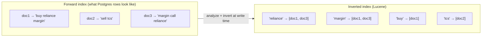
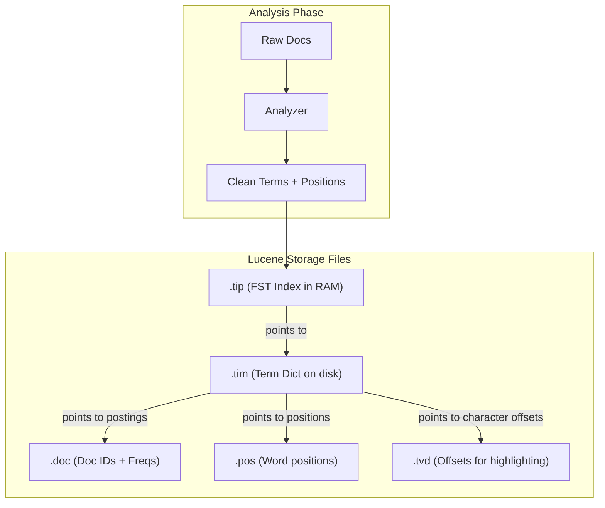
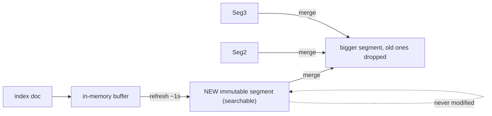
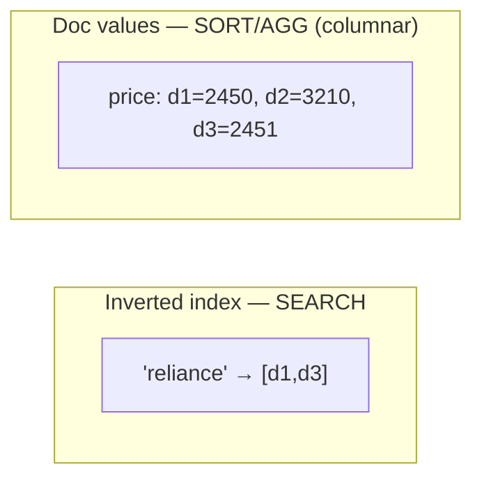

# 02 — Inverted Index & Lucene Storage Internals

> **Why this is Topic 2:** This is the heart of Elasticsearch. The reason ES finds a word in a billion
> documents in milliseconds — while Postgres `LIKE '%word%'` scans every row — is the **inverted index**.
> Understanding *term → postings* (not *row → value*), why Lucene segments are **immutable**, and the
> difference between the **inverted index** (for search) and **doc values** (for sort/aggregate) is the #1
> thing that separates "I've used ES" from "I understand ES." Zerodha will push here: "draw the inverted
> index", "why is it fast", "why can't you just update a document in place?"

---

## 💡 Quick Glossary for Beginners

Before diving in, let's define the core vocabulary:
*   **Term (or Token):** A single word, lowercased and cleaned up (e.g., `"Reliance"` becomes the term `"reliance"`).
*   **Postings List:** A list of document IDs where a specific term appears.
*   **Segment:** A self-contained, read-only search index file on disk. A shard is made of multiple segments.
*   **Immutability:** The state of being unchangeable. Once written, Lucene segments are *never* modified.
*   **Doc Values:** A separate column-oriented database structure used to quickly read field values for sorting and aggregating.
*   **Tombstone:** A marker indicating that a document is deleted without actually removing it from the file immediately.

---

## 1. WHAT

### 📖 The Cookbook Analogy
*   **Forward Index (Like a Table of Contents):** If you open a cookbook, the Table of Contents lists: *Chapter 1 -> Paneer Butter Masala, Chapter 2 -> Dal Makhani*. You look up a chapter (document) to see what recipes (words) are in it.
*   **Inverted Index (Like the Index at the Back):** If you want to find every recipe that uses *Butter*, you turn to the index at the back. It lists: *Butter -> Page 12, Page 45, Page 78*. This is the **inverted index** — it maps *word → documents*.

An **inverted index** maps each **term** (a token/word) to the **list of documents** that contain it (the **postings list**), plus positional info. It's "inverted" because a normal (forward) index maps *document → its words*; the inverted index flips it to *word → its documents* — exactly what you need to answer "which documents contain `RELIANCE`?" without scanning anything.

Lucene (the library ES embeds) stores this index in **immutable segments**: once a segment is written, it is **never modified**. New data → new segment. Deletes → a tombstone bitset. Updates → delete + re-add.

> **Summary:**
> *   **Forward index** answers: "What words are in document 5?"
> *   **Inverted index** answers: "What documents contain the word 'reliance'?"
> *   Search queries almost always ask the second question!

---

## 2. WHY (the problem it solves)

Consider full-text search over a `notes`/`description` column:

### The Database Approach (e.g., standard Postgres)
*   A B-tree index orders values. It can seek `WHERE symbol = 'RELIANCE'` (exact, leading value) in $O(\log N)$ time.
*   But `WHERE notes LIKE '%margin%'` has a **leading wildcard** — the B-tree can't seek into the middle of a value, so it does a **sequential scan** of every row: $O(N)$.
*   *(Note: Postgres can add a GIN inverted index via `tsvector` — which is essentially adopting the same idea ES uses natively.)*

### The Elasticsearch Approach
*   ES pre-tokenizes every document at write time. `"margin"` already points to the exact list of doc IDs. The query is a **dictionary lookup + a postings-list walk** — independent of total corpus size for the lookup, and proportional only to how many docs actually match.



Query `"reliance AND margin"` = intersect `[doc1, doc3] ∩ [doc1, doc3] = [doc1, doc3]` — a merge of two sorted lists, blazingly fast. **You pay the cost once at write time so reads are cheap.** That's the whole bargain, and it's why ES is write-amplifying but read-fast.

---

## 3. HOW (the internals)

### 3.1 Building the Inverted Index: Step-by-Step Internals

To understand how Lucene writes these files, let’s use a concrete example. Imagine we index three simple documents:
*   **Doc 1:** `"Buy RELIANCE now"`
*   **Doc 2:** `"Sell RELIANCE tomorrow"`
*   **Doc 3:** `"Buy TCS now"`

---

#### 🛠️ Step 1: The Analyzer Normalizes the Text
Before storing anything, the text is run through an **analyzer** (details in [Topic 4](file:///Users/rohit.kumar.4/Documents/interview-prep/elasticsearch/04-analysis-analyzers.md)). It tokenizes (splits words) and lowercases the text. 

Here is what the analyzer outputs (with positions):
*   **Doc 1:** `["buy" (pos 0), "reliance" (pos 1), "now" (pos 2)]`
*   **Doc 2:** `["sell" (pos 0), "reliance" (pos 1), "tomorrow" (pos 2)]`
*   **Doc 3:** `["buy" (pos 0), "tcs" (pos 1), "now" (pos 2)]`

---

#### 🗄️ Step 2: Lucene Writes the Core Storage Files
Lucene takes the analyzer output and creates four main file types on disk:

##### 1. The Postings List File (`.doc`)
For every unique word, this file stores a sorted list of **Document IDs** that contain it, along with how many times the word appears in that document (Term Frequency).
*   `"buy"` $\rightarrow$ `[Doc 1 (Freq: 1), Doc 3 (Freq: 1)]`
*   `"now"` $\rightarrow$ `[Doc 1 (Freq: 1), Doc 3 (Freq: 1)]`
*   `"reliance"` $\rightarrow$ `[Doc 1 (Freq: 1), Doc 2 (Freq: 1)]`
*   `"sell"` $\rightarrow$ `[Doc 2 (Freq: 1)]`
*   `"tcs"` $\rightarrow$ `[Doc 3 (Freq: 1)]`
*   `"tomorrow"` $\rightarrow$ `[Doc 2 (Freq: 1)]`

##### 2. The Positions File (`.pos`)
This tracks where each word was positioned in the sentence. It is critical for **phrase queries** (like searching for the exact sequence `"buy reliance"`).
*   `"buy"` $\rightarrow$ `Doc 1: [position 0]`, `Doc 3: [position 0]`
*   `"reliance"` $\rightarrow$ `Doc 1: [position 1]`, `Doc 2: [position 1]`
*   `"now"` $\rightarrow$ `Doc 1: [position 2]`, `Doc 3: [position 2]`
*   `"sell"` $\rightarrow$ `Doc 2: [position 0]`

> **Why Positions Matter:** If a user searches for the exact phrase `"buy now"`, ES sees that `"buy"` and `"now"` are both in Doc 1. But it checks the `.pos` file and finds `"buy"` is at `pos 0` and `"now"` is at `pos 2`. Because they are not adjacent, it knows Doc 1 is *not* a match for `"buy now"` as a phrase.

##### 3. The Term Dictionary (`.tim`) and Term Index (`.tip`)
A real index might contain millions of unique words. ES cannot load millions of words from disk into memory just to search for one word. 

*   **`.tim` (Term Dictionary):** A sorted file on disk containing all unique terms and their byte offsets in the `.doc` (postings list) file.
*   **`.tip` (Term Index):** An **FST (Finite State Transducer)** stored entirely in RAM. Think of it as a highly compressed prefix directory (like a search tree) that maps term prefixes (like `rel...`) to the correct sector of the `.tim` file on disk.

###### 🔍 Let's see an example of how `.tim` and `.doc` work together:

**Term Dictionary (`.tim` on disk):**
| Unique Term | Offset (Where its list starts in `.doc`) |
| :--- | :--- |
| `"buy"` | `Byte 0` |
| `"now"` | `Byte 24` |
| `"reliance"` | `Byte 48` |
| `"sell"` | `Byte 72` |
| `"tcs"` | `Byte 88` |
| `"tomorrow"` | `Byte 104` |

**Postings File (`.doc` on disk):**
*   **Byte 0:** `[Doc 1 (Freq: 1), Doc 3 (Freq: 1)]` *(Postings list for "buy")*
*   **Byte 24:** `[Doc 1 (Freq: 1), Doc 3 (Freq: 1)]` *(Postings list for "now")*
*   **Byte 48:** `[Doc 1 (Freq: 1), Doc 2 (Freq: 1)]` *(Postings list for "reliance")*
*   **Byte 72:** `[Doc 2 (Freq: 1)]` *(Postings list for "sell")*
*   **Byte 88:** `[Doc 3 (Freq: 1)]` *(Postings list for "tcs")*
*   **Byte 104:** `[Doc 2 (Freq: 1)]` *(Postings list for "tomorrow")*

**How a search query executes under the hood:**
1. You search for **`"reliance"`**.
2. ES looks at the RAM-resident `.tip` FST file to find terms starting with `"r"`.
3. The FST points ES to the `"r"` section in the `.tim` file on disk.
4. ES reads the `.tim` file, finds `"reliance"`, and reads its offset: **`Byte 48`**.
5. ES performs a disk `seek(48)` inside the `.doc` file to jump straight to byte 48, immediately reading the list `[Doc 1, Doc 2]`. It **never** has to read bytes 0-47 or bytes 72-104! This is what makes it so blazingly fast.

##### 4. Term Vectors / Offsets (`.tvd`)
This optional file records the exact character start and end offsets (e.g., `"reliance"` in Doc 1 starts at character index 4 and ends at 12). This is used to build search result snippets with highlighted matching words (e.g., "Buy **RELIANCE** now").

---



### 3.2 Postings compression — why it's small and fast

Postings lists are **delta-encoded + bit-packed**. Instead of storing doc IDs `[3, 7, 12, 50]`, Lucene stores the first plus *gaps*: `[3, +4, +5, +38]`, then bit-packs those small gaps (using only the minimum bits required for the largest gap in a block).

Combined with **skip lists** over the postings, intersecting two long lists (the AND of two terms) skips ahead (like an express train skipping local stations) instead of walking every entry. Result: postings are compact on disk and intersections are sub-linear.

### 3.3 Immutable segments — the central design decision

A **segment** is a complete mini inverted index (its own term dictionary, postings, doc values, etc.). Lucene **never mutates a segment after writing it.** This is the single most important fact about ES storage, and everything downstream follows from it:

### 📖 The Notebook Analogy
Think of a segment as a page in a ledger book written in permanent ink. If you make a mistake or a transaction changes, you cannot erase it. You must write a correction on a new page (new segment) and cross out the old entry (tombstone).

| Consequence of immutability | Why it matters |
|:---|:---|
| **No locks on read** | Readers never coordinate with writers; a segment can't change under you → high concurrency. |
| **OS page cache friendly** | Immutable files cache perfectly; no invalidation churn. |
| **Writes are cheap appends** | New docs → new segment; no in-place random writes. |
| **Updates/deletes are deferred** | Can't edit → must tombstone + re-add (see §3.4). |
| **Needs background merging** | Many small segments accumulate → must be merged ([Topic 3](file:///Users/rohit.kumar.4/Documents/interview-prep/elasticsearch/03-write-path-refresh-flush-merge.md)). |
| **Visibility is delayed** | A doc isn't searchable until its segment is exposed by a **refresh** ([Topic 3](file:///Users/rohit.kumar.4/Documents/interview-prep/elasticsearch/03-write-path-refresh-flush-merge.md)). |



### 3.4 Updates & deletes on an immutable structure

There is **no in-place update** in Lucene:

*   **Delete:** the doc is *not* removed. Its doc ID is flagged in a per-segment **`.liv` (live docs) bitset** — a tombstone. Search consults the bitset and skips "deleted" docs. The data still occupies disk.
*   **Update:** = delete the old version (tombstone) + index a new version into a new segment. ES bumps `_version`. The old copy lingers until a merge drops it.
*   **Reclaiming space:** only a **segment merge** ([Topic 3](file:///Users/rohit.kumar.4/Documents/interview-prep/elasticsearch/03-write-path-refresh-flush-merge.md)) physically purges tombstoned docs by writing a new merged segment that omits them. This is *exactly* analogous to Postgres dead tuples + VACUUM — same "append + tombstone + background compaction" pattern, different engine.

> [!WARNING]
> Because updates require "delete + insert" and cause background merge storms, **Elasticsearch is a poor choice for highly mutable data** (e.g., tracking a stock price or order status updating 100 times a second). Use Postgres or Redis for hot updates, and sync them to ES when stable.

### 3.5 The other index: **doc values** (column store for sort/aggregate)

The inverted index is great for "find docs containing X" but **terrible** for "sort these docs by price" or "average the price field" — those need *doc → value*, the forward direction. So Lucene maintains a **second** structure: **doc values**, a **columnar, on-disk** store (`.dvd`/`.dvm`) mapping *doc ID → field value*, written at index time.

| Need | Structure used | Direction |
|------|----------------|-----------|
| Full-text / filter ("docs with term X") | **Inverted index** | term → docs |
| Sort, aggregate, script, facet | **Doc values** | doc → value |



*   **`text` fields have no doc values by default** (they're analyzed/tokenized — you can't sort by a bag of tokens). That's why you **can't sort/aggregate on a `text` field** and must use a `keyword` ([Topic 5](file:///Users/rohit.kumar.4/Documents/interview-prep/elasticsearch/05-mapping-field-types.md)). The classic error: `"Fielddata is disabled on text fields by default."`
*   **Fielddata** is the legacy alternative — building the doc→value map **in heap memory** at query time. It's expensive and OOM-prone; doc values (on disk, off-heap, memory-mapped) replaced it for everything except analyzed `text`. **Avoid enabling fielddata** in interviews unless you flag the heap risk.

### 3.6 On-disk file layout (the "show me you've seen it" detail)

A segment is a set of files sharing a generation name (`_0.*`, `_1.*`):

| File | Contents | Why it matters |
|------|----------|----------------|
| `.tim` / `.tip` | Term dictionary (FST) + term index | Contains the FST in memory pointing to term locations on disk. |
| `.doc` | Postings: doc IDs + term frequencies | Tracks which doc IDs contain the term (used for filters/searches). |
| `.pos` | Term positions (phrase/proximity) | Required for phrase matches (e.g., exact order of terms). |
| `.fdt` / `.fdx` | **Stored fields** — the original `_source` JSON | Contains the original raw JSON document. |
| `.dvd` / `.dvm` | **Doc values** (columnar, for sort/agg) | Columns mapping doc IDs to values for fast aggregations. |
| `.liv` | Live-docs bitset (tombstones for deletes) | Bitmask representing active and deleted documents. |
| `.nvd` / `.nvm` | Norms (field-length normalization) | Metadata about field lengths (used for relevance ranking, [Topic 7](file:///Users/rohit.kumar.4/Documents/interview-prep/elasticsearch/07-relevance-bm25.md)). |

> [!TIP]
> **Search Execution Rule:** When you search, ES searches the `.tim` and `.doc` files to find the matching Doc IDs. It uses doc values (`.dvd`) to sort them. Only after it has narrowed down the results to the top-K hits (e.g., top 10 results) does it read the massive `.fdt` file to load and return the original `_source` JSON. This two-phase query execution is key to ES performance.

---

## 4. CODE / EXAMPLES

```bash
# See the terms an analyzer produces (the inverted-index input)
POST /orders/_analyze
{ "analyzer": "standard", "text": "Buy RELIANCE now" }
# → tokens: [ "buy", "reliance", "now" ]

# Inspect segments of a shard (counts, deleted docs, size, memory)
GET /orders/_segments
GET _cat/segments/orders?v
# index shard prirep segment docs.count docs.deleted size
# orders 0    p      _2      10421      318          5.1mb   ← deleted docs = tombstones awaiting merge

# Why you CANNOT sort/aggregate on a text field:
PUT /demo { "mappings": { "properties": { "title": { "type": "text" } } } }
POST /demo/_search
{ "sort": [ { "title": "asc" } ] }
# → 400: "Fielddata is disabled on text fields by default. Set fielddata=true ... or use a keyword field."

# The correct pattern: multi-field (text for search + keyword for sort/agg) — Topic 5
PUT /demo2
{ "mappings": { "properties": {
    "title": { "type": "text",
               "fields": { "raw": { "type": "keyword" } } } } } }
# search → title ; sort/aggregate → title.raw
```

```text
Mental picture of a single shard at one instant:

  shard 0 (Lucene index)
  ├── segment _0  [terms→postings | doc_values | .liv: docs 4,9 deleted | stored _source]
  ├── segment _1  [ ... ]
  ├── segment _2  [ ... ]   ← newest, just exposed by last refresh
  └── translog    (durability journal until flush — Topic 3)

  search = (look up term in each segment's dict) → (walk/merge postings, skip .liv deletes)
         → collect top-K doc IDs → fetch _source for just those K
```

---

## 5. INTERVIEW ANGLES

**Q: Why is full-text search fast in ES but slow with Postgres `LIKE '%x%'`?**
A: ES pre-builds an inverted index (term → sorted postings list) at write time, so a search is a dictionary lookup plus a postings walk, proportional to matches not corpus size. `LIKE '%x%'` has a leading wildcard a B-tree can't seek, forcing a full sequential scan. (Postgres can match ES by adding a GIN/`tsvector` inverted index — same idea.)

**Q: Draw/describe an inverted index.**
A: A sorted term dictionary (FST) where each term points to a postings list = the sorted doc IDs containing it, with term frequencies and positions. Queries intersect/union postings lists. Compressed via delta-encoding + bit-packing + skip lists.

**Q: Why are Lucene segments immutable, and what does that buy/cost you?**
A: Buys lock-free reads, perfect OS-cache behavior, and cheap append writes. Costs: updates/deletes can't edit in place (tombstone + re-add), space isn't reclaimed until a merge, and new docs aren't visible until a refresh exposes the new segment. It's an LSM-tree-style trade.

**Q: How does ES delete or update a document if segments are immutable?**
A: Delete flags the doc ID in a per-segment live-docs bitset (`.liv`) — a tombstone; the bytes stay until a merge rewrites the segment without it. Update = tombstone old + index new version into a new segment. Directly analogous to Postgres dead tuples + VACUUM.

**Q: Why can't you sort or aggregate on a `text` field?**
A: `text` is analyzed into tokens and has no doc-values (doc→value) structure — only an inverted index (term→docs). Sort/aggregate need the columnar doc values, which exist on `keyword`/numeric/date fields. Use a multi-field: `text` for search, `keyword` for sort/agg. (Enabling fielddata builds it in heap — OOM risk; avoid.)

**Q: What are doc values and how do they differ from the inverted index?**
A: Doc values are an on-disk columnar store mapping doc ID → field value, used for sorting, aggregations, scripting, and faceting. The inverted index maps term → docs for search. ES maintains both; they answer opposite questions.

**Q: When a search matches 1M docs but you want the top 10, what gets read?**
A: The inverted index + doc values identify and rank doc IDs cheaply; only the final top-K hits have their `_source` fetched from stored fields (`.fdt`). This query-then-fetch split is what makes distributed scatter-gather efficient ([Topic 9](file:///Users/rohit.kumar.4/Documents/interview-prep/elasticsearch/09-sharding-routing-search.md)).

---

## 6. ONE-LINE RECALL CARDS

- **Inverted index** = term → sorted **postings list** (doc IDs + freq + positions); answers "which docs contain X" without scanning.
- Term dictionary is an **FST** (compressed, prefix-shared); postings are **delta-encoded + bit-packed + skip-listed**.
- Pay the cost **once at write time** (analyze + invert) so reads are cheap → ES is write-amplifying, read-fast.
- **Lucene segments are immutable**: new data → new segment; no in-place edits.
- **Delete = tombstone** in `.liv` bitset; **update = delete + re-add**; space reclaimed only by **merge** (≈ Postgres VACUUM).
- **Doc values** = on-disk **columnar** doc→value store for **sort/aggregate**; the inverted index is for **search**.
- **Can't sort/agg on `text`** (no doc values) → use a `keyword` multi-field; avoid heap-hungry **fielddata**.
- Search = lookup term → walk/merge postings (skip deletes) → top-K → fetch `_source` from `.fdt` for survivors only.

---

→ **Next:** [03 — The Write Path: Refresh, Flush, Translog & Merging](file:///Users/rohit.kumar.4/Documents/interview-prep/elasticsearch/03-write-path-refresh-flush-merge.md)
