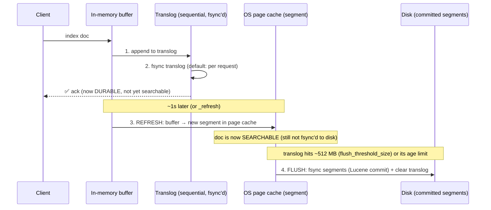
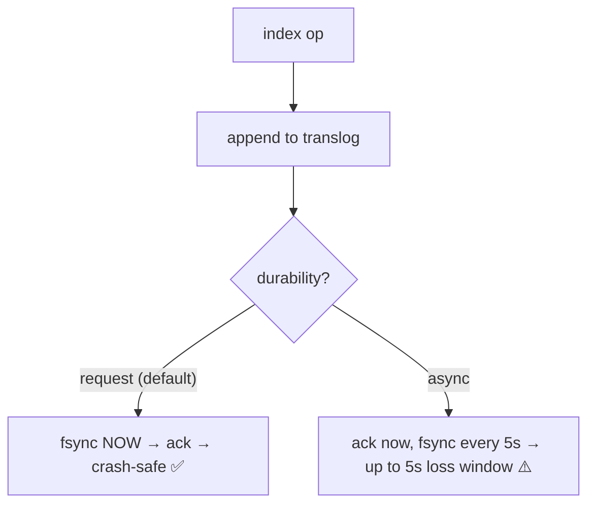
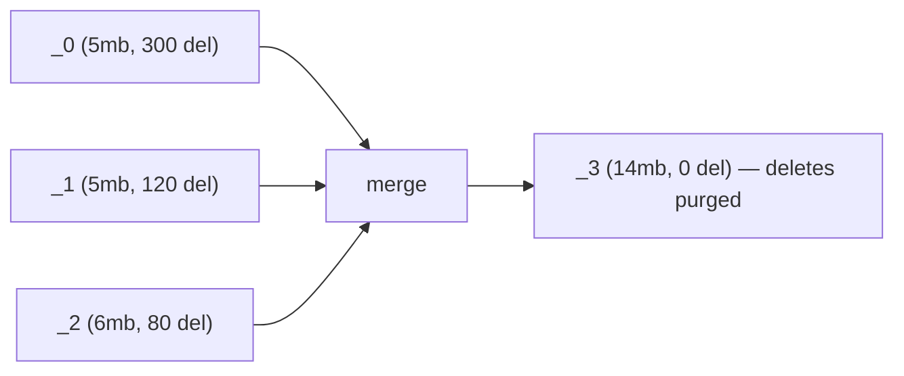
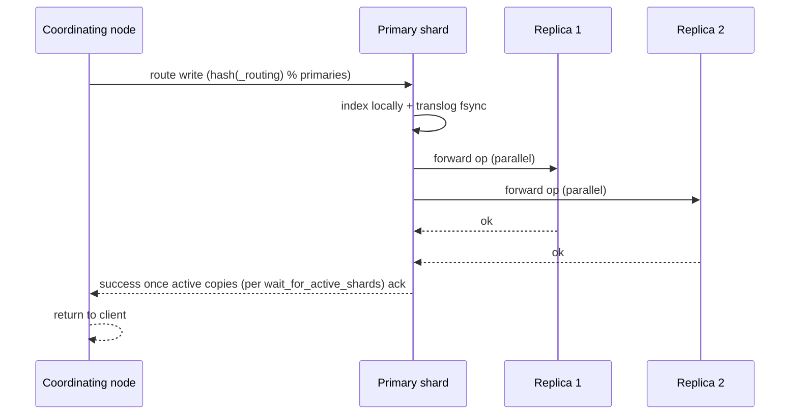

# 03 — The Write Path: Refresh, Flush, Translog & Segment Merging

> **Why this is Topic 3:** Topic 2 said segments are immutable and a doc isn't searchable until a refresh
> exposes it. This topic is *exactly how a document travels* from an HTTP request to a searchable,
> durable, merged segment — and where it can be lost. This is **the** Elasticsearch durability/consistency
> question, the direct analog of Postgres's WAL chapter. Zerodha will ask: "I index a doc — is it
> searchable immediately? Is it durable if the node crashes 50ms later?" The crisp answer requires
> separating three independent mechanisms most people conflate: **refresh** (visibility), **translog**
> (durability), and **flush** (persistence) — plus **merge** (cleanup).

---

## 1. WHAT

Four distinct mechanisms govern the ES write path. Keeping them separate is the entire skill:

| Mechanism | Governs | Default cadence | Analogy (Postgres) |
|-----------|---------|-----------------|--------------------|
| **Refresh** | **Visibility** — when a doc becomes *searchable* | every **1s** | snapshot visibility |
| **Translog** | **Durability** — surviving a crash before flush | fsync per request (`request`) or every **5s** | the **WAL** |
| **Flush** | **Persistence** — writing segments to disk & trimming translog | when translog hits ~**512 MB** (`flush_threshold_size`) or its age threshold | a **checkpoint** |
| **Merge** | **Cleanup** — consolidating segments, purging deletes | continuous background | **VACUUM** |

The slogan:

> **Refresh makes it *searchable*; translog makes it *durable*; flush makes it *permanent*; merge makes it
> *clean*. These are four different clocks.**

---

## 2. WHY (the problem each solves)

If Lucene only made data searchable by writing a full segment to disk (`fsync`) on every document, indexing
would be unbearably slow (random fsyncs per doc). So ES decouples the concerns:

1. **Refresh** writes the in-memory buffer to a new segment in the **OS page cache** (not fsync'd to disk)
   — cheap, and *now searchable*. This is why ES is **near-real-time**: ~1s lag, not instant, not minutes.
2. But a segment in page cache isn't durable — a crash loses it. So **every write is also appended to the
   translog** (a sequential journal, fsync'd) *before* the client is acked. On crash recovery, ES replays
   the translog. This is identical in spirit to Postgres's "log before data" WAL rule.
3. Replaying a huge translog on every restart would be slow, and translog grows unbounded. So **flush**
   periodically fsyncs the page-cached segments to real disk (a Lucene commit) and **truncates the
   translog** — bounding recovery time. Same role as a Postgres checkpoint.
4. Immutable segments accumulate (one per refresh ≈ one/sec) and carry tombstoned deletes. **Merge**
   consolidates them and physically drops deleted docs — same economics as VACUUM reclaiming dead tuples.

---

## 3. HOW (the internals)

### 3.1 The full journey of one document



Read this carefully — the **ack happens after the translog fsync but before the refresh**, so:
- At ack time: the doc is **durable** (survives crash via translog replay) but **not yet searchable**.
- ~1s later at refresh: the doc becomes **searchable** (segment in page cache) but not yet **flushed**.
- At flush: the segment is fsync'd to disk and the translog entry can be dropped.

This ordering is the source of nearly every ES write-path interview question.

### 3.2 Refresh — visibility (the "near" in near-real-time)

- `index.refresh_interval` defaults to **1s**. Lower it → fresher search, more tiny segments + merge
  pressure. Raise it (or set `-1`) → big throughput win for bulk loads.
- **Per-request control:** `?refresh=wait_for` (block until the next scheduled refresh shows your doc —
  the safe default for "index then immediately search" tests) vs `?refresh=true` (force an immediate
  refresh — expensive, **never** use under load: it spawns a tiny segment every call).
- **Bulk-load tuning:** set `refresh_interval: -1` and `number_of_replicas: 0` during a big reindex, then
  restore them and force a merge — a standard 5–10× speedup (Topic 11).

### 3.3 Translog — durability (the WAL)

- Every indexing op is appended to the **translog** before ack. On crash, any ops since the last flush are
  **replayed** from the translog → no acknowledged write is lost.
- **`index.translog.durability`:**
  - **`request`** (default): fsync the translog **on every request** before acking → an acked write is
    truly durable. Safe; this is what you want for anything that must not be lost.
  - **`async`**: fsync every `sync_interval` (default **5s**) → faster, but a crash can lose up to 5s of
    *acknowledged* writes. The ES analog of Postgres `synchronous_commit = off`. Acceptable for logs,
    never for data you can't re-derive.
- Translog also enables **real-time GET**: `GET /index/_doc/<id>` reads through the translog, so you can
  fetch a doc by ID *before* it's refreshed/searchable. (Get-by-id is real-time; **search** is not.)



### 3.4 Flush — persistence (the checkpoint)

A **flush** performs a **Lucene commit**: fsync the page-cached segments to disk and **truncate the
translog** (those ops are now safe in committed segments, so the journal can be reset). Triggered by:
- translog size (`index.translog.flush_threshold_size`, default ~512 MB), or
- translog age (how long the oldest un-flushed op has been outstanding).

There's no fixed flush timer — flush is **translog-driven** (size or age), not a "flush every N minutes" schedule.

Why it matters: flush **bounds recovery time** (smaller translog = faster replay on restart) — exactly the
Postgres checkpoint trade-off. You rarely flush manually; ES manages it.

### 3.5 Merge — cleanup (the VACUUM)

Refreshes create a new small segment roughly every second. Hundreds of small segments hurt search (each
query consults every segment) and waste space on tombstoned deletes. The background **merge** policy
(tiered) picks similarly-sized segments and rewrites them into a larger one, **physically dropping deleted
docs** in the process.



- Merging is **I/O and CPU heavy** — a classic source of indexing latency spikes. Governed by the
  merge scheduler (`index.merge.scheduler.max_thread_count`) with adaptive I/O auto-throttling.
- **Force merge** (`POST /index/_forcemerge?max_num_segments=1`) is for **read-only / cold** indices
  (e.g., yesterday's logs after rollover) — never on an actively-written index (it creates huge segments
  that then can't merge normally). This is the ES twin of "don't `VACUUM FULL` a hot table."
- Optimizing to 1 segment makes search fastest and is standard before moving a time-series index to the
  warm/cold tier (Topic 11).

### 3.6 Replication on the write path (durability across nodes)

A write isn't done when the primary has it — it must reach replicas:



- The write succeeds when enough copies (controlled by `wait_for_active_shards`, default 1 = primary) have
  it. ES replication is **synchronous to in-sync replicas** within the shard group (unlike Postgres's
  default async streaming), but the cluster is still **AP-leaning** at the consistency level — there are
  no multi-document transactions, and refresh lag means reads are eventually consistent.

---

## 4. CODE / EXAMPLES

```bash
# Index then immediately search safely (block until visible) — good for tests
POST /orders/_doc?refresh=wait_for
{ "order_id": "O999", "symbol": "INFY" }

# Real-time GET by id works BEFORE refresh (reads through translog)
GET /orders/_doc/O999          # returns the doc even if not yet searchable

# But a SEARCH won't see it until the next refresh (~1s)
POST /orders/_search { "query": { "term": { "order_id": "O999" } } }

# --- Bulk-load tuning: the standard 5–10x reindex speedup ---
PUT /orders/_settings
{ "index": { "refresh_interval": "-1", "number_of_replicas": 0 } }   # before bulk
# ... run _bulk indexing ...
PUT /orders/_settings
{ "index": { "refresh_interval": "1s", "number_of_replicas": 1 } }   # restore after
POST /orders/_forcemerge?max_num_segments=1                          # only if read-mostly now

# Durability dial: relax fsync for a log index that can tolerate 5s loss
PUT /logs-2026.06.27/_settings
{ "index": { "translog": { "durability": "async", "sync_interval": "5s" } } }

# Manual flush (rarely needed; ES does it automatically)
POST /orders/_flush

# Watch merges and segment counts
GET _cat/segments/orders?v
GET _nodes/stats/indices/merges
```

---

## 5. INTERVIEW ANGLES

**Q: I index a document. Is it immediately searchable? Is it durable if the node crashes 50ms later?**
A: Two separate clocks. **Durable** yes (if `translog.durability=request`, the default): the op is fsync'd
to the translog before the ack, so crash recovery replays it. **Searchable** no — not until the next
**refresh** (~1s, near-real-time). Searchable but not-yet-flushed is fine; flush just fsyncs the segment
and trims the translog later.

**Q: Difference between refresh, flush, and translog?**
A: Refresh = visibility (buffer → searchable segment in page cache, ~1s). Translog = durability (sequential
journal fsync'd per request, replayed on crash). Flush = persistence (Lucene commit: fsync segments to
disk + truncate translog, triggered when the translog hits ~512 MB). Three independent mechanisms.

**Q: Why is ES "near-real-time" and not real-time?**
A: New docs live in an in-memory buffer until a refresh turns them into a searchable segment, default once
per second. So there's a sub-second-to-1s visibility lag. (Get-by-id *is* real-time via the translog; only
*search* is delayed.)

**Q: How do you make a huge bulk reindex fast?**
A: Disable refresh (`refresh_interval: -1`), drop replicas to 0, use the `_bulk` API with large batches;
afterward restore refresh/replicas and `_forcemerge` if the index is now read-mostly. Avoids creating a
tiny segment per second and avoids replicating during the load.

**Q: What's the ES equivalent of Postgres `synchronous_commit = off`?**
A: `index.translog.durability = async` with a `sync_interval` (default 5s). It acks before fsync, trading
durability (up to 5s of acknowledged writes lost on crash) for throughput. Fine for logs, not for data you
can't re-derive.

**Q: Why do segments need merging, and when should you force-merge?**
A: Each refresh creates a small segment, and deletes are tombstones — both hurt search and waste space.
Background merges consolidate segments and physically purge deleted docs (like VACUUM). Force-merge only
read-only/cold indices (e.g., after time-series rollover); never an actively written index.

**Q: Is ES replication synchronous or asynchronous?**
A: Within a shard group, the primary forwards each op to its in-sync replicas and waits for
`wait_for_active_shards` copies before acking — synchronous to in-sync replicas. But ES has no
multi-document transactions and search has refresh lag, so the system is eventually consistent / AP-leaning
overall.

---

## 6. ONE-LINE RECALL CARDS

- Four clocks: **refresh** (searchable, 1s) · **translog** (durable, per-request fsync) · **flush** (persistent, translog hits ~512 MB or its age limit) · **merge** (clean).
- **Ack happens after translog fsync but before refresh** → at ack a doc is *durable but not yet searchable*.
- **Near-real-time** = refresh exposes new segments to search ~once/sec (in OS page cache, not yet on disk).
- **Translog = the WAL**: replayed on crash; `durability=request` (safe, default) vs `async` (≤5s loss, ≈ `synchronous_commit=off`).
- **Get-by-id is real-time** (reads through translog); **search is not** (waits for refresh).
- **Flush = checkpoint**: Lucene commit fsyncs segments + truncates translog → bounds recovery time.
- **Merge = VACUUM**: consolidates segments, **physically purges tombstoned deletes**; force-merge only cold/read-only indices.
- Bulk-load tuning: `refresh_interval:-1` + `replicas:0` during load, restore + force-merge after → 5–10×.
- Writes replicate **synchronously to in-sync replicas** (`wait_for_active_shards`), but ES is still AP-leaning / eventually consistent.

→ **Next:** [04 — Text Analysis & Analyzers](04-analysis-analyzers.md) (how raw text becomes the terms in
the inverted index: analyzers, tokenizers, char/token filters, and `text` vs `keyword`).
