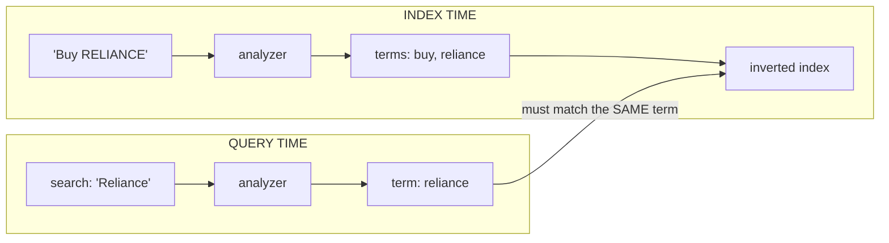
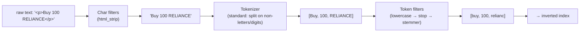
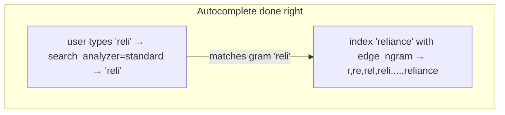

# 04 — Text Analysis & Analyzers

> **Why this is Topic 4:** The inverted index (Topic 2) is only as good as the **terms** you put in it.
> **Analysis** is the process that turns raw text — `"Buy 100 RELIANCE @ ₹2,450"` — into the normalized
> tokens that get indexed and matched. Get analysis wrong and search silently fails: users search
> `reliance` and match nothing because you indexed `RELIANCE` as one un-lowercased keyword. The single
> most common ES bug — *"why doesn't my search match?"* — is almost always an **analyzer mismatch between
> index time and query time**. Zerodha will probe: `text` vs `keyword`, what a tokenizer does, and why the
> same analyzer must (usually) run on both sides.

---

## 1. WHAT

**Analysis** converts text into **terms** via an **analyzer**, which is a pipeline of three stages:

1. **Character filters** — operate on the raw character stream *before* tokenizing (e.g., strip HTML,
   map `&` → `and`).
2. **Tokenizer** — splits the stream into tokens (e.g., split on whitespace/punctuation). **Exactly one**
   per analyzer.
3. **Token filters** — transform the token stream (lowercase, remove stopwords, stem, add synonyms,
   edge-ngrams). **Zero or more**, applied in order.

The slogan:

> **Analyzer = (char filters) → tokenizer → (token filters). The terms it emits are *literally* what's
> stored in the inverted index — and what a query must produce to match.**

`text` fields are **analyzed**; `keyword` fields are **not** (stored verbatim as a single term).

---

## 2. WHY (the problem it solves)

Without normalization, search is brittle and literal. Analysis makes search *behave how humans expect*:

| Raw input | Naive (no analysis) | Analyzed terms |
|-----------|---------------------|----------------|
| `"RELIANCE"` | matches only `RELIANCE` | `reliance` → matches `reliance`, `Reliance`, `RELIANCE` |
| `"running quickly"` | literal | `run`, `quick` (stemming) → matches `runs`, `ran` |
| `"the order"` | indexes `the` | `the` dropped (stopword) → smaller index, better relevance |
| `"e-mail / email"` | two different tokens | unified via synonyms/char filter |

The reason this is the #1 source of "search doesn't work" bugs: **the query string is analyzed too**, and
if the two analyzers disagree, the produced terms never line up.



If index-time produced `reliance` but query-time (say, a different analyzer) produced `Reliance`, the
match fails. **Same analyzer both sides** is the default and usually the right answer.

---

## 3. HOW (the internals)

### 3.1 The three-stage pipeline in detail



- **Character filters** (0+): `html_strip`, `mapping` (char→char), `pattern_replace`.
- **Tokenizer** (exactly 1): `standard` (Unicode word boundaries — the default), `whitespace`, `keyword`
  (emits the whole input as one token — used to build `keyword`-like behavior), `pattern`, `ngram` /
  `edge_ngram` (for autocomplete), `path_hierarchy`.
- **Token filters** (0+, ordered): `lowercase`, `stop` (remove stopwords), `stemmer`/`snowball` (run→runs),
  `synonym`, `asciifolding` (café→cafe), `edge_ngram` (autocomplete), `shingle` (token n-grams).

**Order matters:** `lowercase` before `stop` so the stopword list (lowercase) matches; `synonym` placement
relative to `stemmer` changes results. Interviewers love "in what order do filters run, and why?"

### 3.2 `text` vs `keyword` — the decision you make on every string field

| | `text` | `keyword` |
|---|--------|-----------|
| Analyzed? | **Yes** (tokenized, lowercased, …) | **No** (stored verbatim as one term) |
| Use for | Full-text search (`match`) | Exact match (`term`), sort, aggregate, filter |
| Doc values? | No (can't sort/agg) | Yes |
| Example field | `description`, `notes`, ticket body | `order_id`, `symbol`, `status`, `email`, tags |
| Query that fits | `match: "margin call"` | `term: "RELIANCE"`, `terms`, `range` on... no |

The canonical mistake: storing `symbol` as `text`. Then `term: "RELIANCE"` fails (the index has
`reliance`), and you can't aggregate "orders per symbol." Store identifiers/enums/exact-match fields as
**`keyword`**, human prose as **`text`**, and when you need both, use a **multi-field** (Topic 5):

```json
"symbol": { "type": "keyword" },                     // exact, aggregatable
"description": {
  "type": "text",                                    // full-text search
  "fields": { "raw": { "type": "keyword" } }         // + exact/sort sub-field
}
```

### 3.3 Index-time vs query-time analyzers (and `search_analyzer`)

- By default the **same analyzer** runs at index and query time. You can override the query side with
  `search_analyzer` — the main legitimate use is **autocomplete**: index with `edge_ngram` (so
  `reliance` → `r, re, rel, reli, …`) but search with `standard` (so the user typing `reli` matches the
  `reli` gram **without** re-gramming the query into `r, re, rel`). Using `edge_ngram` on *both* sides
  over-matches badly.



### 3.4 Multilingual / domain analyzers and custom analyzers

You assemble a **custom analyzer** in the index settings from the building blocks:

```json
"settings": { "analysis": {
  "char_filter":  { "amp": { "type": "mapping", "mappings": ["& => and"] } },
  "filter":       { "fin_syn": { "type": "synonym",
                                 "synonyms": ["ipo, public_offering"] } },
  "analyzer":     { "ticket_analyzer": {
      "type": "custom",
      "char_filter": ["html_strip", "amp"],
      "tokenizer":   "standard",
      "filter":      ["lowercase", "fin_syn", "stop", "snowball"] } }
}}
```

- **Normalizer** = the `keyword`-world analog: a (tokenizer-less) pipeline of char/token filters for
  `keyword` fields, so you can lowercase a `keyword` for case-insensitive exact match without tokenizing.
- **Synonyms** can be applied at index time (bloats index, no reindex to change) or query time (flexible,
  slightly slower) — a real design trade interviewers like.

### 3.5 `_analyze` — the debugging superpower

When "search doesn't match," you **don't guess** — you run `_analyze` on both the indexed text and the
query and compare the term lists. If they differ, that's your bug. This is the single most useful ES
debugging command.

---

## 4. CODE / EXAMPLES

```bash
# See exactly what terms an analyzer produces
POST /_analyze
{ "analyzer": "standard", "text": "Buy 100 RELIANCE @ ₹2,450" }
# → [ buy, 100, reliance, 2,450 ]   (standard lowercases + splits)

# Compare a custom analyzer
POST /tickets/_analyze
{ "analyzer": "ticket_analyzer", "text": "<p>F&O orders are running</p>" }
# → [ fando, order, run ]   (html stripped; "&"→"and" runs BEFORE tokenizing, so F&O→fando;
#                            "are" dropped as stopword; orders/running stemmed)
# Lesson (order matters): because char filters run first, a synonym on "f&o" would NEVER fire —
# the token is already "fando" by the time fin_syn sees it. Define synonyms on the post-char-filter form.

# Diagnose "why doesn't my search match?" — analyze BOTH sides and compare
POST /tickets/_analyze { "field": "body", "text": "RELIANCE" }     # index-time terms
POST /tickets/_analyze { "field": "body", "text": "reliance" }     # query-time terms
# If the term lists differ → that's the bug.

# text vs keyword in action
PUT /instruments
{ "mappings": { "properties": {
    "symbol":      { "type": "keyword" },
    "company":     { "type": "text",
                     "fields": { "raw": { "type": "keyword" } } } } } }

POST /instruments/_search { "query": { "term":  { "symbol":      "RELIANCE" } } }   # exact ✅
POST /instruments/_search { "query": { "match": { "company":     "industries" } } } # full-text ✅
POST /instruments/_search { "query": { "term":  { "company.raw": "Reliance Industries" } } } # exact on text ✅

# Case-insensitive exact match on a keyword via a normalizer
PUT /users
{ "settings": { "analysis": { "normalizer": {
      "lc": { "type": "custom", "filter": ["lowercase"] } } } },
  "mappings": { "properties": {
      "email": { "type": "keyword", "normalizer": "lc" } } } }   # 'Foo@x.com' == 'foo@x.com'
```

---

## 5. INTERVIEW ANGLES

**Q: Walk me through what an analyzer does.**
A: Three stages: character filters clean the raw stream (e.g., strip HTML), one tokenizer splits it into
tokens (e.g., on word boundaries), and ordered token filters transform them (lowercase, stopword removal,
stemming, synonyms). The emitted terms are exactly what's stored in the inverted index.

**Q: `text` vs `keyword` — when do you use each?**
A: `text` is analyzed for full-text `match` (prose: descriptions, ticket bodies). `keyword` is verbatim for
exact `term`, sorting, and aggregations (identifiers, enums, symbols, emails, tags). Need both → multi-field
(`text` with a `keyword` sub-field).

**Q: My users search "reliance" and get no results, but the data is there. Why?**
A: Almost certainly an analyzer mismatch. The field is probably `keyword` (stored `RELIANCE`) or analyzed
differently at query time, so the query term `reliance` doesn't equal the indexed term. Run `_analyze` on
both sides and compare; fix the mapping or use the same analyzer.

**Q: Why must index-time and query-time analysis usually match?**
A: Both produce terms, and matching is term equality against the inverted index. If index produced
`reliance` but the query produced `Reliance`, nothing matches. The default is the same analyzer on both
sides; you only diverge deliberately (e.g., `search_analyzer` for autocomplete).

**Q: How do you build autocomplete, and what's the analyzer trick?**
A: Index with an `edge_ngram` token filter so `reliance` → `r, re, rel, …`. Search with a plain analyzer
(`search_analyzer: standard`) so the user's `reli` matches the `reli` gram without being re-grammed.
Gramming both sides over-matches.

**Q: Does filter order matter? Give an example.**
A: Yes. `lowercase` must precede `stop` so lowercase stopwords match; synonym vs stemmer order changes
whether synonyms see stemmed or raw tokens. Filters run left-to-right on the token stream.

**Q: Index-time vs query-time synonyms?**
A: Index-time bakes synonyms into the index (fast queries, but changing the list requires reindexing and it
bloats the index). Query-time expands at search (flexible, change without reindex, slightly slower). Pick
by how often the synonym set changes.

---

## 6. ONE-LINE RECALL CARDS

- **Analyzer = char filters → 1 tokenizer → ordered token filters.** Its output terms *are* the inverted index.
- `text` = **analyzed** (full-text `match`); `keyword` = **verbatim** (exact `term`, sort, aggregate). Use a **multi-field** for both.
- #1 "search doesn't match" bug = **analyzer mismatch** between index time and query time → debug with **`_analyze`**.
- Default: **same analyzer both sides**; override query side with `search_analyzer` (the autocomplete pattern).
- **Autocomplete:** `edge_ngram` at index time, plain analyzer at query time (don't gram both sides).
- **Filter order matters** (`lowercase` before `stop`; synonym vs stemmer placement).
- **Normalizer** = analyzer-without-tokenizer for `keyword` (e.g., case-insensitive exact match).
- Synonyms: **index-time** (fast, needs reindex to change) vs **query-time** (flexible, slightly slower).

→ **Next:** [05 — Mapping & Field Types](05-mapping-field-types.md) (dynamic vs explicit mapping,
multi-fields, `nested` vs `object`, and the mapping-explosion footgun).
