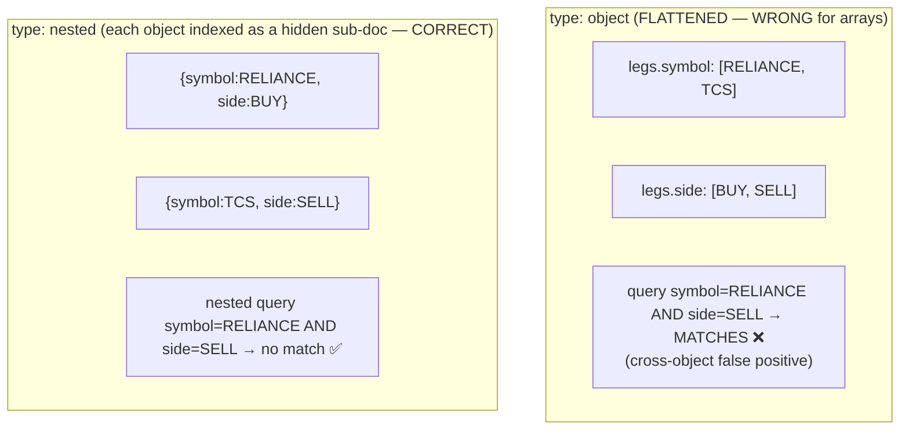
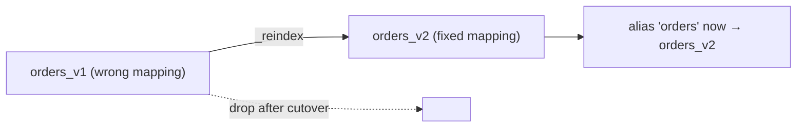

# 05 — Mapping & Field Types

> **Why this is Topic 5:** Mapping is Elasticsearch's schema — it tells Lucene how to index and store each
> field, which decides what queries are even *possible* and how much RAM/disk you burn. Unlike a fixed SQL
> schema, ES can **infer** mappings on the fly (dynamic mapping), which is convenient and a production
> footgun: a single mis-typed field or an unbounded set of keys can trigger a **mapping explosion** that
> destabilizes the whole cluster. And the `nested` vs `object` distinction is the source of the most
> notorious *correctness* bug in ES — arrays of objects matching the wrong combination. Zerodha will ask
> all three: dynamic vs explicit, multi-fields, and `nested` vs `object`.

---

## 1. WHAT

A **mapping** is the definition of an index's fields and their **types**, plus how each is analyzed,
stored, and indexed. Two ways it gets set:

- **Dynamic mapping:** ES guesses the type from the first document it sees for a field (`"qty": 10` →
  `long`; `"2026-06-27"` → `date`; any string → `text` **with** a `keyword` sub-field).
- **Explicit mapping:** you define types up front (what you do in production).

The slogan:

> **Mapping is decided once per field and is (mostly) immutable — you can *add* fields but not *change* an
> existing field's type without reindexing.**

### Core field types

| Category | Types |
|----------|-------|
| Text | `text` (analyzed), `keyword` (verbatim), `wildcard` |
| Numeric | `long`, `integer`, `short`, `byte`, `double`, `float`, `half_float`, `scaled_float` |
| Date / bool | `date`, `boolean` |
| Structured | `object` (default for JSON objects), `nested`, `flattened`, `join` |
| Specialized | `ip`, `geo_point`, `geo_shape`, `dense_vector` (kNN), `completion` (suggester), `range` types |

---

## 2. WHY (the problem mappings solve, and the ones they create)

Lucene needs to know a field's type to choose the right index structure: a `text` field gets an analyzed
inverted index; a `keyword` gets a single-term index + doc values; a `long` gets a BKD-tree (numeric/range
index) + doc values; a `date` is a `long` (epoch millis) under the hood. The mapping is what makes
`range`, `sort`, `aggregate`, and `match` possible (or not) on each field.

The dangers dynamic mapping introduces — all favorite interview traps:

1. **Mapping explosion:** documents with unbounded distinct keys (e.g., using user IDs or timestamps as
   field *names*: `{"price_1687...": 10}`) create a new mapping per key. Thousands of fields bloat the
   cluster state (held on the master, replicated to every node) and can take the cluster down. Guarded by
   `index.mapping.total_fields.limit` (default 1000).
2. **Type guess gone wrong:** the first doc has `"zip": "560001"` → mapped as `text`; later a doc has
   `"zip": 560001` → coercion/mapping conflict, or a field you wanted numeric is now un-aggregatable text.
3. **`nested` vs `object` correctness bug:** arrays of objects flatten by default and lose the association
   between sub-fields (§3.3) — silently returning *wrong* results.

---

## 3. HOW (the internals)

### 3.1 Dynamic mapping and how to tame it

When ES sees a new field it applies **dynamic** rules. You control the behavior with the `dynamic` setting:

| `dynamic` | New field behavior |
|-----------|--------------------|
| `true` (default) | Add it to the mapping automatically |
| `runtime` | Add as a **runtime field** (computed at query time, not indexed — no mapping bloat) |
| `false` | Store in `_source` but **don't index** it (not searchable, no mapping entry) |
| `strict` | **Reject** the document with an error |

For a controlled index (orders, instruments) use **`strict`** so a typo'd field fails loudly instead of
silently polluting the mapping. For logs you might use `true` but cap `total_fields.limit`.

By default, every dynamically-mapped **string** *that isn't first caught by date detection* becomes a
`text` field **plus** a `.keyword` sub-field (capped at 256 chars). (Date-detection runs first, so
`"2026-06-27"` maps as `date`, not `text`.) That's why you can both `match` and aggregate on
dynamically-mapped strings — but it doubles the indexing for fields you may only need one way.

### 3.2 Multi-fields — index the same value several ways

A single source value can be indexed under multiple sub-fields with different types/analyzers — the
canonical "have your cake and eat it" pattern from Topic 4:

```json
"company": {
  "type": "text",                                   // full-text search (analyzed)
  "fields": {
    "raw":     { "type": "keyword" },               // exact match / sort / aggregate
    "english": { "type": "text", "analyzer": "english" }  // stemmed search
  }
}
```

Query `company` for full-text, `company.raw` for aggregations/sort, `company.english` for stemmed search —
all from one input field, no extra storage in `_source`.

### 3.3 `object` vs `nested` — the correctness trap

JSON objects map to type `object` by default, which Lucene **flattens** into dotted fields. For a *single*
object that's fine. For an **array of objects** it's a correctness bug:

```json
{ "order_id": "O1",
  "legs": [
    { "symbol": "RELIANCE", "side": "BUY"  },
    { "symbol": "TCS",      "side": "SELL" }
  ] }
```

With type `object`, this flattens to:
```
legs.symbol: ["RELIANCE", "TCS"]
legs.side:   ["BUY", "SELL"]
```
The association is **lost**. Now a query "legs where symbol=RELIANCE AND side=SELL" **matches** this doc —
because `RELIANCE` is in `legs.symbol` and `SELL` is in `legs.side`, even though no single leg had both.
Wrong answer, silently.



**`nested`** indexes each array object as a separate hidden Lucene document, preserving within-object
relationships. You then query with a `nested` query. Costs: nested docs multiply the underlying doc count
(indexing/search overhead) and require special `nested` queries/aggregations. Use `nested` **only** when
you must match multiple sub-fields of the *same* array element together.

### 3.4 Mapping is (mostly) immutable — the reindex reality

You **can**: add a new field, add a sub-field/multi-field, add an alias.
You **cannot**: change an existing field's type, change its analyzer, or change a field from `object` to
`nested`. To do those you **reindex** into a new index with the corrected mapping and swap an **alias**
(zero-downtime). This is why getting the mapping right up front matters and why production indices always
sit behind an alias.



### 3.5 Storage/perf knobs worth knowing

- **`_source`**: the original JSON, stored (`.fdt`) and returned in hits, needed for reindex/update/
  highlight. Disabling it saves space but breaks those features — rarely worth it.
- **`index: false`**: store a field (in `_source`/doc values) but don't build an inverted index for it —
  for fields you only fetch or aggregate, never search.
- **`doc_values: false`**: turn off the columnar store for a field you never sort/aggregate/script on —
  saves disk.
- **`scaled_float`**: store a price like `2450.55` as `long` 245055 with a scaling factor — compact and
  exact-ish for money-ish fields (still verify precision needs; the ledger lives in Postgres).
- **`flattened`**: map an entire object's keys as one field of keywords — escape hatch against mapping
  explosion for unpredictable key sets (you lose per-subfield typing/analysis).
- **`runtime` fields**: computed at query time from a script — schema-on-read; no indexing/mapping bloat,
  but slower queries. Great for rarely-used or evolving fields.

---

## 4. CODE / EXAMPLES

```bash
# Explicit, strict mapping for a controlled index (typos fail loudly)
PUT /orders
{
  "mappings": {
    "dynamic": "strict",
    "properties": {
      "order_id":  { "type": "keyword" },
      "symbol":    { "type": "keyword" },
      "price":     { "type": "scaled_float", "scaling_factor": 100 },
      "qty":       { "type": "integer" },
      "notes":     { "type": "text", "fields": { "raw": { "type": "keyword" } } },
      "placed_at": { "type": "date" },
      "legs":      { "type": "nested",
                     "properties": { "symbol": { "type": "keyword" },
                                     "side":   { "type": "keyword" } } }
    }
  }
}

# A doc with an unknown field is now rejected (strict)
POST /orders/_doc { "order_id": "O1", "typoo_field": 1 }   # → 400 strict_dynamic_mapping_exception

# Correctly query a nested array (no cross-object false positives)
POST /orders/_search
{ "query": { "nested": { "path": "legs",
    "query": { "bool": { "must": [
      { "term": { "legs.symbol": "RELIANCE" } },
      { "term": { "legs.side":   "SELL" } } ] } } } } }
# → does NOT match a doc whose RELIANCE leg was BUY

# Guard against mapping explosion
PUT /logs/_settings { "index.mapping.total_fields.limit": 2000 }

# Inspect what ES actually mapped (catch bad dynamic guesses)
GET /orders/_mapping

# Reindex into a corrected mapping, then swap the alias (zero downtime)
POST _reindex { "source": { "index": "orders_v1" }, "dest": { "index": "orders_v2" } }
POST _aliases { "actions": [
  { "remove": { "index": "orders_v1", "alias": "orders" } },
  { "add":    { "index": "orders_v2", "alias": "orders" } } ] }
```

---

## 5. INTERVIEW ANGLES

**Q: Dynamic vs explicit mapping — which in production and why?**
A: Explicit (often `dynamic: strict`) for controlled indices so a typo or wrong type fails loudly instead
of silently polluting the mapping. Dynamic is fine for exploratory/log data, but cap `total_fields.limit`
and consider `runtime`/`flattened` to avoid mapping explosion.

**Q: What is mapping explosion and how do you prevent it?**
A: Unbounded distinct field *names* (e.g., IDs/timestamps used as keys) create a new mapping each, bloating
the cluster state (master-held, replicated everywhere) until the cluster destabilizes. Prevent with
`dynamic: strict`/`false`/`runtime`, `total_fields.limit`, the `flattened` type, or restructuring the data
(values, not keys).

**Q: `object` vs `nested` — why does it matter?**
A: `object` flattens an array of objects into parallel arrays, losing which sub-values belonged together →
cross-object false positives (RELIANCE+SELL matches even if no single leg was both). `nested` indexes each
array element as a hidden sub-document so you can match multiple sub-fields of the *same* element. `nested`
costs indexing/search overhead and needs `nested` queries.

**Q: Can you change a field's type after creating the index?**
A: No — existing field types/analyzers are immutable. You can add new fields/sub-fields/aliases, but
changing a type requires reindexing into a new index with the corrected mapping and swapping an alias for
zero-downtime cutover.

**Q: How do you store a value that needs both full-text search and exact aggregation?**
A: A multi-field: `text` for `match`, with a `keyword` sub-field (`field.raw`) for `term`/sort/aggregate.
One input, multiple index representations, no `_source` duplication.

**Q: A price field — how would you map it?**
A: `scaled_float` with a scaling factor (e.g., 100) stores `2450.55` as integer 245055 — compact and
avoiding float drift for display/search. The authoritative money value still lives in the Postgres ledger;
ES holds a searchable copy.

**Q: How do runtime fields help with schema evolution?**
A: They're computed at query time from `_source`/doc values (schema-on-read), so you can add/adjust them
without reindexing or growing the mapping — at the cost of slower queries. Good for rarely-queried or
still-evolving fields.

---

## 6. ONE-LINE RECALL CARDS

- **Mapping = ES schema**: decides index structure per field; mostly **immutable** (add fields yes, change types no → reindex).
- **Dynamic mapping** guesses types; use **`dynamic: strict`** for controlled indices so typos fail loudly.
- Dynamic strings → `text` **+** `.keyword` sub-field automatically (capped 256 chars).
- **Mapping explosion** = unbounded field *names* bloat cluster state → cap `total_fields.limit`, use `runtime`/`flattened`.
- **`object` flattens arrays** → cross-object false positives; **`nested`** indexes each element as a hidden sub-doc (correct, costlier).
- **Multi-field**: one value indexed several ways (`text` + `keyword` + stemmed) — the standard search/sort/agg pattern.
- Knobs: `index:false` (store, don't search), `doc_values:false` (no sort/agg), `scaled_float` (money-ish), `_source` (original JSON).
- Production indices sit behind an **alias** so you can reindex into a fixed mapping with zero downtime.

→ **Next:** [06 — Query DSL](06-query-dsl.md) (query vs **filter** context, `bool`, `match`/`term`/`range`,
and why filter context is cached and dramatically faster).
