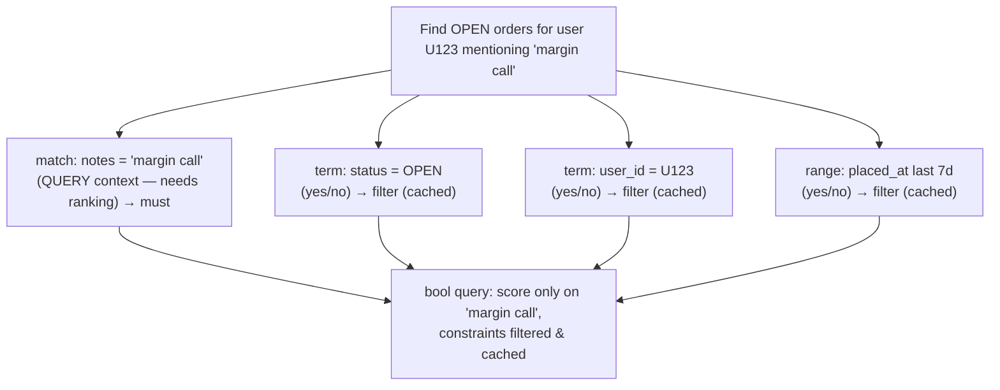
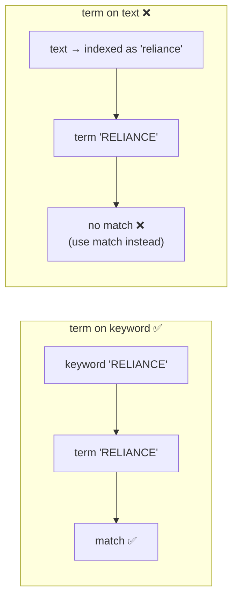

# 06 — Query DSL

> **Why this is Topic 6:** Now that the data is indexed (Topics 2–5), this is how you *ask questions* of it.
> The Query DSL is the JSON language for search, and the single most important concept in it — the one
> Zerodha will absolutely probe — is the distinction between **query context** ("how well does this match?",
> scored, uncacheable) and **filter context** ("does this match, yes/no?", unscored, **cached**). Knowing
> when to use `filter` instead of `must` is the difference between a search that's fast under load and one
> that melts. The `bool` query is the workhorse that combines them.

---

## 1. WHAT

The **Query DSL** is a tree of query clauses you POST to `_search`. Every clause runs in one of two
**contexts**:

- **Query context** — answers *"how well does this document match?"* Produces a **relevance score**
  (`_score`). Used for full-text ranking. **Not cached** (scores depend on the whole query/corpus).
- **Filter context** — answers *"does this document match? (yes/no)"* No score. **Cached** in the
  node query cache (a bitset of matching docs). Fast and reusable.

The slogan:

> **If you don't need a relevance score, put the clause in `filter` context — it's a cacheable yes/no and
> it's the biggest, cheapest performance win in Elasticsearch.**

The combining query is **`bool`**, with four clause types:

| Clause | Context | Meaning |
|--------|---------|---------|
| `must` | query (scored) | Must match; **contributes to score** |
| `should` | query (scored) | Optional; matching boosts score (OR-ish) |
| `filter` | filter (no score) | Must match; **cached, no score** |
| `must_not` | filter (no score) | Must not match; cached |

---

## 2. WHY (the problem it solves)

Most real queries are a mix of *"find documents relevant to these words"* (needs scoring) and *"…but only
those that satisfy these hard constraints"* (status = OPEN, date in range, user_id = X — pure yes/no).
Running the hard constraints as scored `must` clauses wastes CPU computing meaningless scores **and**
forfeits caching. Putting them in `filter` makes them:

1. **Cheaper** — no scoring math.
2. **Cached** — the matching-doc bitset is stored and reused across queries; the next request with the same
   filter skips the work entirely.
3. **Composable** — filters AND together as fast bitset intersections.



This is the #1 ES performance pattern: **score on the few fields that need ranking, filter everything else.**

---

## 3. HOW (the internals)

### 3.1 The two contexts mechanically

- A clause in **query context** asks Lucene to score each matching doc (BM25 — Topic 7). The score depends
  on term frequencies and document frequencies across the index, so it can't be cached as a simple bitset.
- A clause in **filter context** asks only *which docs match* → Lucene produces a **bitset** (one bit per
  doc). Bitsets are tiny, AND/OR/NOT together with raw CPU bit ops, and are **cached in the node query
  cache** keyed by the filter. Frequently-used filters (e.g., `status: OPEN`) get served almost for free.

You opt into filter context by **where** you place a clause: inside `filter` / `must_not`, or inside a
`constant_score` query, or via post-filter/aggregation filters. The *same* clause (`term`, `range`) that
would score in `must` becomes a cached yes/no in `filter`.

### 3.2 Leaf queries you must know

| Query | Field type | Analyzed? | Use |
|-------|-----------|-----------|-----|
| `match` | `text` | **Yes** (query analyzed) | Full-text search; the everyday query |
| `match_phrase` | `text` | Yes | Words in order, adjacent ("margin call") |
| `multi_match` | `text` | Yes | `match` across several fields |
| `term` | `keyword`/numeric/date | **No** | Exact value (status, symbol, id) |
| `terms` | keyword/numeric | No | Exact value in a set (IN list) |
| `range` | numeric/date/ip | No | `gte/lte` bounds (price, time window) |
| `exists` | any | — | Field has a (non-null) value |
| `prefix` / `wildcard` / `regexp` | keyword | No | Pattern (slow — avoid leading wildcard) |
| `match_all` | — | — | Everything (often + filters) |

**The classic gotcha:** using `term` on a `text` field. `term` is not analyzed, but the indexed value
*was* (lowercased/tokenized), so `term: { symbol: "RELIANCE" }` against a `text` field finds nothing —
the index has `reliance`. Use `term` on `keyword`, `match` on `text`. (Direct callback to Topics 4–5.)



### 3.3 `bool` semantics and minimum_should_match

- `must` + `filter` → **AND** (both required). `should` → **OR-flavored**: by default, if there's no
  `must`/`filter`, **at least one** `should` must match; if there *is* a `must`/`filter`, `should` becomes
  pure scoring boost (zero required). Tune with `minimum_should_match`.
- `must_not` → exclusion, in filter context (cached, unscored).
- Nest `bool` inside `bool` to build complex AND/OR trees.

### 3.4 Where filtering happens in the pipeline (perf)

Filters are evaluated efficiently and their bitsets cached on each shard, so a query like
`bool { must: match, filter: [term, range] }` lets Lucene **skip** scoring docs that fail the filters.
Putting selective filters (the ones that eliminate the most docs — e.g., `user_id`) first/together shrinks
the candidate set before the expensive `match` scoring runs.

Related execution detail (callback to Topic 9): the query runs on **every shard** (query phase), each
returns its top-N doc IDs+scores, the coordinating node merges them, then a **fetch phase** pulls
`_source` for the final top-N. Filters reduce work in the per-shard query phase.

### 3.5 `query` vs `post_filter` vs aggregation filters (brief)

- Constraints that should affect **both hits and aggregations** → put in the main `query`/`filter`.
- `post_filter` filters **hits only, after aggregations** — used for faceted search where you want the
  facet counts to reflect the unfiltered set (e.g., show all category counts but only display the selected
  category's results). Niche but a good senior-level callout.

---

## 4. CODE / EXAMPLES

```bash
# The canonical pattern: score on text, FILTER everything else (cached, fast)
POST /orders/_search
{
  "query": {
    "bool": {
      "must":   [ { "match": { "notes": "margin call" } } ],     # scored (ranking)
      "filter": [                                                  # cached yes/no
        { "term":  { "status":  "OPEN" } },
        { "term":  { "user_id": "U123" } },
        { "range": { "placed_at": { "gte": "now-7d/d" } } }
      ]
    }
  }
}

# term vs match — the #1 gotcha
POST /orders/_search { "query": { "term":  { "symbol": "RELIANCE" } } }   # keyword field ✅
POST /orders/_search { "query": { "match": { "notes":  "margin" } } }     # text field ✅
# term on a text field → silently no results (index holds analyzed tokens)

# terms = IN list, range = window, exists = not null
POST /orders/_search
{ "query": { "bool": { "filter": [
    { "terms":  { "symbol": ["RELIANCE", "TCS", "INFY"] } },
    { "range":  { "price": { "gte": 100, "lte": 5000 } } },
    { "exists": { "field": "broker_note" } } ] } } }

# should as a boost (with a must present, should is optional and only scores)
POST /orders/_search
{ "query": { "bool": {
    "must":   [ { "match": { "notes": "order rejected" } } ],
    "should": [ { "match": { "notes": "urgent" } } ],            # boosts, not required
    "filter": [ { "term": { "status": "FAILED" } } ] } } }

# minimum_should_match (OR with a threshold, no must)
POST /tickets/_search
{ "query": { "bool": {
    "should": [
      { "match": { "body": "margin" } },
      { "match": { "body": "leverage" } },
      { "match": { "body": "f&o" } } ],
    "minimum_should_match": 2 } } }

# constant_score: run a filter but assign a fixed score (pure yes/no, cached)
POST /orders/_search
{ "query": { "constant_score": { "filter": { "term": { "status": "OPEN" } } } } }
```

---

## 5. INTERVIEW ANGLES

**Q: Explain query context vs filter context.**
A: Query context scores documents ("how well does it match?") for relevance ranking and isn't cached.
Filter context answers a yes/no ("does it match?"), produces a cacheable bitset, and skips scoring. Put
anything that doesn't need a score — status, ids, ranges, dates — in `filter` for speed and caching.

**Q: When would you use `filter` instead of `must`?**
A: Whenever the clause is a hard constraint with no ranking value: exact-match `term`/`terms`, `range`
windows, `exists`. It's the biggest, cheapest performance win — no scoring math and the matching bitset is
cached and reused across requests.

**Q: `term` vs `match`?**
A: `match` analyzes the query (lowercases/tokenizes) and runs against analyzed `text` fields. `term` is
exact, not analyzed, for `keyword`/numeric/date. Using `term` on a `text` field silently returns nothing
because the indexed tokens were analyzed but the `term` value wasn't.

**Q: Walk me through a real bool query.**
A: e.g., "OPEN orders for user U123 mentioning 'margin call' in the last 7 days": `must` a `match` on notes
(the only thing that needs ranking), and `filter` the rest — `term status=OPEN`, `term user_id=U123`,
`range placed_at >= now-7d`. Only the text match is scored; the constraints are cached.

**Q: What does `should` do?**
A: It's OR-flavored. With no `must`/`filter`, at least one `should` must match (tunable via
`minimum_should_match`). With a `must`/`filter` present, `should` clauses are optional and only **boost the
score** of docs that match them.

**Q: Why are filters cacheable but queries aren't?**
A: A filter's result is just "which docs match" → a per-shard bitset that AND/OR/NOTs cheaply and can be
cached by filter key. A query's score depends on term/document frequencies across the corpus and the rest
of the query, so it can't be reduced to a static cached bitset.

**Q: What's `post_filter` for?**
A: Faceted search: it filters the returned **hits** *after* aggregations run, so facet counts reflect the
broader (pre-filter) set while results show only the selected facet. Main-query filters, by contrast,
affect both hits and aggregations.

---

## 6. ONE-LINE RECALL CARDS

- Two contexts: **query** = scored, uncached ("how well?"); **filter** = yes/no, **cached bitset** ("does it?").
- **Biggest perf win:** put hard constraints (`term`, `range`, `exists`, ids, status) in **`filter`**, not `must`.
- `bool` clauses: `must` (AND, scored), `filter` (AND, cached), `should` (OR/boost), `must_not` (exclude, cached).
- `match` = analyzed full-text on `text`; `term` = exact on `keyword`/numeric/date. **`term` on `text` = silent no-match.**
- `terms` = IN list, `range` = window, `match_phrase` = ordered/adjacent words.
- `should` with a `must` present only **boosts**; without one, ≥1 must match (`minimum_should_match`).
- Filters AND together as fast bitset intersections and are reused across requests via the node query cache.
- `post_filter` filters hits **after** aggregations (faceted search); `constant_score` = filter with a fixed score.

→ **Next:** [07 — Relevance & Scoring (BM25)](07-relevance-bm25.md) (TF-IDF → **BM25**, boosting,
`function_score`, and why scores aren't comparable across queries).
