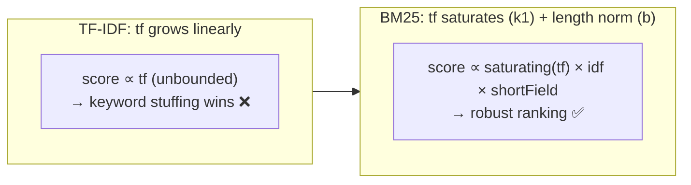
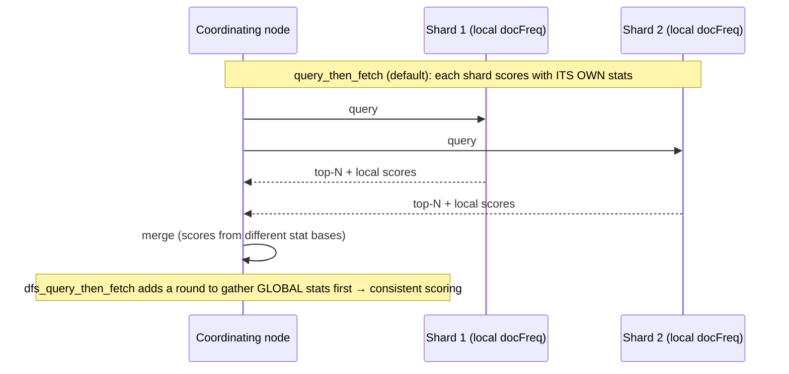
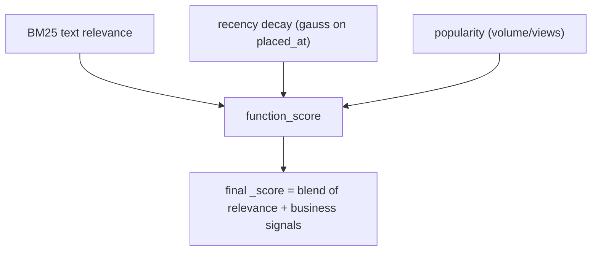

# 07 — Relevance & Scoring (BM25)

> **Why this is Topic 7:** A `match` query (Topic 6) doesn't just return matching documents — it **ranks**
> them by a relevance score, `_score`. Understanding *how* that score is computed is what separates "I use
> Elasticsearch" from "I understand search." The modern default is **BM25**, an evolution of TF-IDF.
> Zerodha will probe two things in particular: the intuition behind the three factors (term frequency,
> inverse document frequency, field-length normalization), and the crucial caveat that **`_score` is
> relative — it is not a percentage and not comparable across different queries**.

---

## 1. WHAT

**Relevance scoring** assigns each matching document a number (`_score`) estimating how well it satisfies
the query; results are sorted by it descending. The default similarity algorithm is **BM25** (Best Match
25, from the Okapi project).

BM25 balances three intuitions:

1. **TF (term frequency)** — a doc that uses the query term more is more relevant… but with **diminishing
   returns** (10 occurrences isn't 10× better than 1).
2. **IDF (inverse document frequency)** — rare terms are more informative than common ones (`margin`
   discriminates more than `the`).
3. **Field-length normalization** — a term in a short field counts more than the same term buried in a
   long one (matching `RELIANCE` in a 3-word title beats matching it in a 5,000-word document).

The slogan:

> **BM25 = rare term (IDF) × how often it appears with diminishing returns (TF, saturating) × short-field
> bonus (length norm). And `_score` is a *relative* ranking number, never a percentage.**

---

## 2. WHY (TF-IDF's flaws → BM25)

Classic **TF-IDF** scored roughly `tf × idf`, but term frequency grew **unbounded** and linearly. A
spammy document repeating "loan loan loan loan loan…" would dominate — unfair. BM25 fixes this with:

- **TF saturation:** controlled by parameter `k1` (default ~1.2). Each additional occurrence adds *less*
  than the previous; the curve flattens. Repeating a word 50 times barely beats 10.
- **Length normalization:** controlled by `b` (default 0.75). Penalizes long fields so they can't rack up
  matches just by being big, relative to the *average* field length in that index.



This is *why* Elasticsearch switched its default to BM25: better, more spam-resistant ranking out of the
box.

---

## 3. HOW (the internals)

### 3.1 The BM25 factors, in words (interview-safe)

For a query term *t* in document *d*:

$$
\text{score}(t,d) = \text{IDF}(t)\cdot \frac{tf \cdot (k_1+1)}{tf + k_1\cdot\left(1 - b + b\cdot\frac{|d|}{\text{avgdl}}\right)}
$$

You don't need to recite the formula, but you **do** need the three parts:

- **IDF(t)** — higher for terms that appear in *few* documents. `the` (in every doc) ≈ 0 contribution;
  `margin` (in few) contributes a lot. Computed from `docFreq` and total docs.
- **tf · (k1+1) / (tf + k1·(…))** — the **saturating** term-frequency factor. As `tf` rises, the fraction
  approaches a ceiling (set by `k1`). More mentions help, but with diminishing returns.
- **|d| / avgdl** (inside, scaled by `b`) — **field-length normalization**: a long document (|d| ≫ avgdl)
  is penalized; a short one is rewarded.

A document's total score = **sum** of per-term scores for all matched query terms (and `bool`/`should`
clauses add their contributions).

### 3.2 IDF and `docFreq` are **per-shard**

Critically, the statistics BM25 uses (`docFreq`, total docs) are computed **per shard**, not globally,
because each shard is a self-contained Lucene index (Topic 1). So the *same document* can get a slightly
different score depending on which shard it landed on, if term distributions differ across shards. With
enough docs per shard this washes out, but:

- For **small** indices or skewed routing, scores can look odd. The fix for exactness is
  `search_type=dfs_query_then_fetch`, which does a preliminary round to gather **global** term stats before
  scoring — more accurate, slightly slower. (Default `query_then_fetch` uses per-shard stats.)



### 3.3 `_score` is **relative**, not absolute

This is the caveat interviewers fish for:

- `_score` has **no fixed scale** and **no upper bound**. A top hit might score 8.2 for one query and 0.6
  for another — that says nothing about which result is "better"; the numbers come from different IDF/TF
  bases.
- You **cannot** compare scores across different queries, or treat `_score` as a confidence percentage, or
  set a universal `min_score` threshold and expect it to mean the same thing everywhere.
- Within a *single* query's result set, the ordering is meaningful; the absolute magnitudes are not.

### 3.4 Tuning relevance: boosting and `function_score`

- **Field/term boost** (`^`): `multi_match` over `title^3, body` makes a title match worth 3× a body match
  — encode domain priorities (a symbol in the title matters more than in the description).
- **`should` clauses**: optional matches that *add* to the score — "rank docs mentioning 'urgent' higher."
- **`function_score`**: multiply/replace the relevance score with custom functions — e.g.,
  **recency** (a `gauss`/`exp` decay on `placed_at` so newer orders rank higher), **popularity**
  (`field_value_factor` on a `views`/`volume` field), or random. This is how you blend text relevance with
  business signals.
- **`constant_score`** (Topic 6): when you want *no* relevance ranking at all — every match scores the
  same (and gets filter-context caching).
- **`rescore`**: cheaply score the top-N with an expensive query after a cheap first pass — a scaling
  pattern for costly ranking.



### 3.5 Debugging relevance: `explain`

When "the wrong result ranks first," you don't argue — you ask ES to **show its work** with
`"explain": true` (or the `_explain` API), which prints the per-term IDF, tf, length-norm, and how they
combined into the final score. The analog of `_analyze` (Topic 4) but for *scoring*.

---

## 4. CODE / EXAMPLES

```bash
# Basic relevance — results sorted by _score (BM25)
POST /tickets/_search
{ "query": { "match": { "body": "margin call rejected" } } }
# Top hits = high IDF terms, with saturating TF and short-field bonus

# Field boosting: a symbol in the title matters more than in the body
POST /instruments/_search
{ "query": { "multi_match": {
    "query":  "reliance",
    "fields": [ "name^3", "description" ] } } }   # ^3 = title match worth 3x

# function_score: blend text relevance with recency + popularity (business signals)
POST /orders/_search
{ "query": { "function_score": {
    "query": { "match": { "notes": "margin" } },
    "functions": [
      { "gauss": { "placed_at": { "origin": "now", "scale": "7d", "decay": 0.5 } } },  # recency
      { "field_value_factor": { "field": "volume", "modifier": "log1p" } }             # popularity
    ],
    "score_mode": "sum", "boost_mode": "multiply" } } }

# Tune BM25 params per field (rarely needed) at index creation
PUT /docs
{ "settings": { "index": { "similarity": {
      "tuned_bm25": { "type": "BM25", "k1": 1.0, "b": 0.5 } } } },
  "mappings": { "properties": {
      "body": { "type": "text", "similarity": "tuned_bm25" } } } }

# Need globally-consistent scores on a small/skewed index
POST /docs/_search?search_type=dfs_query_then_fetch
{ "query": { "match": { "body": "rare_term" } } }

# Debug WHY a doc scored what it did
POST /tickets/_search
{ "explain": true, "query": { "match": { "body": "margin" } } }
# → per-term idf, tf, length norm, and the arithmetic that produced _score
```

---

## 5. INTERVIEW ANGLES

**Q: How does Elasticsearch score relevance by default?**
A: BM25. It combines three factors: IDF (rare terms score higher), a **saturating** term-frequency
contribution (more occurrences help with diminishing returns, tuned by `k1`), and field-length
normalization (a term in a short field beats the same term in a long one, tuned by `b`). The doc's score
is the sum over matched terms.

**Q: How is BM25 better than TF-IDF?**
A: TF-IDF's term frequency grew unbounded and linearly, so keyword stuffing dominated. BM25 saturates TF
(diminishing returns via `k1`) and normalizes by field length relative to the average (`b`), making
ranking more robust and spam-resistant — which is why it's the ES default.

**Q: Can I treat `_score` as a percentage or compare it across queries?**
A: No. `_score` is relative and unbounded — it depends on per-query IDF/TF/length stats. It's only
meaningful for ordering *within a single query's* results. You can't set a universal threshold or compare
scores between different queries.

**Q: Why might the same document score differently on different shards?**
A: BM25's `docFreq`/totals are computed **per shard** (each shard is its own Lucene index). If term
distributions differ across shards, scores differ. For exact global scoring, use
`dfs_query_then_fetch`, which gathers global term stats before scoring.

**Q: How do you blend text relevance with business signals like recency or popularity?**
A: `function_score`: keep the BM25 query, then apply functions — a `gauss`/`exp` decay on a timestamp for
recency, `field_value_factor` on a volume/views field for popularity — and combine via
`score_mode`/`boost_mode`. That multiplies/adds business signals into the final `_score`.

**Q: A clearly-wrong result ranks first — how do you debug it?**
A: Run the query with `"explain": true` (or `_explain`). ES prints the per-term IDF, term frequency,
length norm, and how they summed into `_score`, so you can see exactly which factor pushed the wrong doc
up — then fix it with boosts/`function_score`/analysis changes.

**Q: How do you make matches in the title count more than in the body?**
A: Field boosting — `multi_match` with `fields: ["title^3", "body"]` weights a title match 3×. For more
control, separate `should` clauses with different `boost` values or a `function_score`.

---

## 6. ONE-LINE RECALL CARDS

- Default scoring = **BM25**: **IDF** (rare > common) × **saturating TF** (`k1`) × **field-length norm** (`b`); summed over terms.
- BM25 beats **TF-IDF** because TF **saturates** (no keyword-stuffing wins) and length is normalized.
- **`_score` is relative & unbounded** — not a percentage, not comparable across queries; only orders within one query.
- BM25 stats (`docFreq`) are **per-shard** → small/skewed indices can score oddly; fix with **`dfs_query_then_fetch`**.
- **Boost** fields/terms (`title^3`) to encode priorities; **`should`** clauses add optional scoring weight.
- **`function_score`** blends relevance with business signals: recency (`gauss` decay), popularity (`field_value_factor`).
- **`constant_score`** = ignore ranking (all matches equal, filter-cached); **`rescore`** = expensive re-rank of top-N.
- Debug ranking with **`explain`** (per-term arithmetic) — the scoring analog of `_analyze`.

→ **Next:** [08 — Aggregations](08-aggregations.md) (bucket/metric/pipeline aggs, `cardinality` ≈
HyperLogLog, ES as an analytics engine, and `doc_values` vs fielddata).
