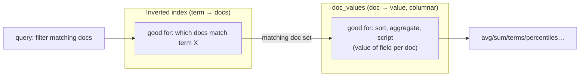
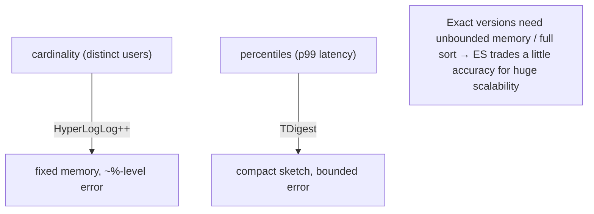

# 08 — Aggregations

> **Why this is Topic 8:** Search finds documents; **aggregations** summarize them. This is the half of
> Elasticsearch people forget — it's not just a search engine, it's a real-time **analytics engine** that
> can compute "orders per symbol per hour," "p99 latency," or "distinct active users" over billions of
> documents in milliseconds. The thing that makes this fast — and the thing Zerodha will probe — is that
> aggregations read from **`doc_values`** (the columnar, on-disk store from Topic 2), *not* the inverted
> index. Understanding bucket vs metric vs pipeline aggs, and why `cardinality` is approximate
> (HyperLogLog), is core SDE2 territory.

---

## 1. WHAT

An **aggregation** computes a summary over the documents that match a query. Three families:

| Family | Produces | Examples |
|--------|----------|----------|
| **Metric** | A number (or set) computed over docs | `avg`, `sum`, `min`, `max`, `stats`, `percentiles`, `cardinality` |
| **Bucket** | Groups of docs (and per-group sub-aggs) | `terms`, `date_histogram`, `histogram`, `range`, `filters`, `nested` |
| **Pipeline** | Operates on the *output* of other aggs | `derivative`, `cumulative_sum`, `moving_avg`, `bucket_script` |

The slogan:

> **Bucket aggs = GROUP BY (split docs into groups); metric aggs = the aggregate functions (SUM/AVG/…)
> inside each group; pipeline aggs = post-process the results. And they all read `doc_values`, not the
> inverted index.**

Aggregations **nest**: a bucket agg splits docs, and inside each bucket you run metric (and further bucket)
aggs — exactly like SQL `GROUP BY` with aggregate functions.

---

## 2. WHY (the problem it solves)

The inverted index answers *"which docs contain term X?"* — perfect for search, useless for *"what's the
average of field Y across these docs?"* Computing an average needs the **value of Y for every matching
doc, accessed by document**, i.e., a **column** of values. That's `doc_values`: a columnar, on-disk
structure ES builds for every non-`text` field. Aggregations stream `doc_values` columns and reduce them,
which is why they're fast and memory-friendly.



This dual structure (inverted index **+** doc values, both built at index time — Topic 2) is what lets one
engine do search **and** analytics.

---

## 3. HOW (the internals)

### 3.1 `doc_values` vs fielddata — the memory story (callback to Topic 2)

- **`doc_values`** (default for all non-`text` fields): columnar, **on-disk** (memory-mapped), built at
  index time. Cheap to load, OS-page-cache friendly. Sorting/aggregating on `keyword`/numeric/date uses
  this.
- **`text` fields have NO doc_values** (analyzed tokens aren't aggregatable). To aggregate/sort on a `text`
  field, ES must build **fielddata** — an **in-heap**, on-the-fly inverted-index-to-column transform that
  is **expensive and a classic OOM cause**. It's disabled by default; enabling `fielddata: true` on a big
  `text` field is a well-known way to take down a cluster.
- **The fix** (callback to Topics 4–5): aggregate on a **`keyword`** field or the `.keyword` **multi-field**
  — never enable fielddata on `text`. If ES errors with *"Fielddata is disabled… set fielddata=true,"* the
  *correct* response is "no — use the keyword sub-field," not to flip the flag.

| | `doc_values` | `fielddata` |
|---|--------------|-------------|
| Field type | non-`text` (keyword/numeric/date) | `text` (only if explicitly enabled) |
| Location | **on-disk** (mmap) | **JVM heap** |
| Built | at index time | on-the-fly per query |
| Risk | low | **OOM / cluster instability** |

### 3.2 Bucket aggregations = GROUP BY

- **`terms`** — group by distinct field value (top N by doc count): "orders per symbol." Note `size` and
  `shard_size` — counts are **approximate** for high-cardinality fields because each shard returns its own
  top-N and they're merged (a value just below the cutoff on every shard can be undercounted). `terms` on
  a `text` field needs the `.keyword` sub-field.
- **`date_histogram`** — group by time buckets (`calendar_interval: 1h/1d`): "trades per hour" — the
  backbone of time-series dashboards.
- **`histogram`** / **`range`** — numeric buckets / explicit ranges (price bands).
- **`filters`** — named buckets each defined by a query.
- **`nested`** / **`reverse_nested`** — aggregate inside `nested` objects (Topic 5) correctly.

### 3.3 Metric aggregations = the aggregate functions

- Exact: `avg`, `sum`, `min`, `max`, `stats`, `value_count`.
- **`percentiles`** (p50/p95/p99) — **approximate**, using the **TDigest** algorithm (or HDRHistogram).
  Exact percentiles would require sorting all values; TDigest keeps a compact sketch with bounded error.
- **`cardinality`** — distinct count, **approximate**, using **HyperLogLog++**. Exact distinct counts need
  to remember every value seen (unbounded memory); HLL estimates cardinality from a fixed-size sketch with
  ~few-% error, tunable via `precision_threshold`. This is the headline "approximate by design" agg.



Why approximate? **Scale.** Exact distinct/percentile over billions of docs across shards would blow up
memory and latency. ES deliberately trades a small, bounded error for constant memory and speed — a
*great* "engineering trade-off" answer.

### 3.4 Pipeline aggregations = post-processing

These consume the **output** of sibling/parent aggs rather than documents:

- **`derivative`** — change between consecutive buckets (e.g., delta of daily order volume).
- **`cumulative_sum`** — running total over buckets.
- **`moving_avg` / `moving_fn`** — smoothing over a window.
- **`bucket_script`** — compute a new metric from other metrics (e.g., `failed/total` failure rate per
  bucket).

Typical pattern: `date_histogram` (buckets per day) → `sum` (orders per day) → `derivative`
(day-over-day growth).

### 3.5 How aggs execute across shards (callback to Topic 9)

Each shard computes the aggregation over **its** matching docs, returns partial results, and the
coordinating node **reduces** them. This is why some aggs are approximate (`terms` top-N, `cardinality`
HLL merge) — partials from many shards are combined, and exactness would require shipping everything. It's
also why aggregations scale: work is parallelized per shard.

### 3.6 Cost & guardrails

- Aggregations read lots of `doc_values` and build in-memory bucket trees — high-cardinality `terms` or
  deeply-nested aggs can be heavy. Guard with reasonable `size`, `composite` aggregation for paging
  through *all* buckets without blowing memory, and `search.max_buckets` limits.
- For pure analytics, **filter first** (Topic 6 filter context) to shrink the doc set before aggregating.

---

## 4. CODE / EXAMPLES

```bash
# GROUP BY symbol, with SUM(qty) and AVG(price) per symbol (bucket + metric)
POST /orders/_search
{ "size": 0,                                          # we want aggs, not hits
  "aggs": {
    "by_symbol": {
      "terms": { "field": "symbol", "size": 10 },     # bucket (keyword field!)
      "aggs": {
        "total_qty":  { "sum": { "field": "qty" } },  # metric
        "avg_price":  { "avg": { "field": "price" } }
      } } } }

# Time series: orders per hour with day-over-day growth (date_histogram + pipeline)
POST /orders/_search
{ "size": 0,
  "aggs": {
    "per_day": {
      "date_histogram": { "field": "placed_at", "calendar_interval": "1d" },
      "aggs": {
        "daily_orders": { "value_count": { "field": "order_id" } },
        "growth": { "derivative": { "buckets_path": "daily_orders" } }  # pipeline
      } } } }

# Approximate distinct + percentiles (the "by design" approximations)
POST /orders/_search
{ "size": 0,
  "aggs": {
    "active_users": { "cardinality": { "field": "user_id",
                                       "precision_threshold": 3000 } },  # HyperLogLog++
    "latency_pcts": { "percentiles": { "field": "ack_ms",
                                       "percents": [50, 95, 99] } }      # TDigest
  } }

# Failure rate per bucket (bucket_script pipeline)
POST /orders/_search
{ "size": 0,
  "aggs": { "per_hour": {
    "date_histogram": { "field": "placed_at", "calendar_interval": "1h" },
    "aggs": {
      "total":  { "value_count": { "field": "order_id" } },
      "failed": { "filter": { "term": { "status": "FAILED" } } },
      "fail_rate": { "bucket_script": {
        "buckets_path": { "f": "failed>_count", "t": "total" },
        "script": "params.f / params.t" } } } } } }

# Aggregating on a text field → use the keyword sub-field, NEVER fielddata:true
POST /tickets/_search
{ "size": 0, "aggs": { "top_tags": { "terms": { "field": "tags.keyword" } } } }

# Page through ALL buckets safely (no top-N memory blowup)
POST /orders/_search
{ "size": 0,
  "aggs": { "all_symbols": { "composite": {
      "size": 1000,
      "sources": [ { "sym": { "terms": { "field": "symbol" } } } ] } } } }
```

---

## 5. INTERVIEW ANGLES

**Q: How do aggregations work, and why are they fast?**
A: They summarize matching docs into buckets (GROUP BY) and metrics (SUM/AVG/…), reading from
**`doc_values`** — a columnar, on-disk store built per field at index time — not the inverted index.
Each shard aggregates its docs and the coordinator reduces partials, so work parallelizes.

**Q: `doc_values` vs fielddata?**
A: `doc_values` is the default columnar store for non-`text` fields, on disk (mmap), cheap. `text` fields
have none, so aggregating/sorting them forces **fielddata**, an in-heap on-the-fly structure that's a
classic OOM cause. The fix is to aggregate on the `keyword` (or `.keyword` multi-field), never enable
`fielddata: true`.

**Q: Why is `cardinality` approximate?**
A: It uses **HyperLogLog++**. Exact distinct counts require remembering every value (unbounded memory),
especially merged across shards. HLL estimates from a fixed-size sketch with a small, tunable error
(`precision_threshold`) — trading a few percent accuracy for constant memory and speed at scale.

**Q: Same question for percentiles?**
A: `percentiles` uses **TDigest** (or HDRHistogram). Exact percentiles need a full sort of all values;
TDigest keeps a compact sketch with bounded error, so p99 over billions of docs is fast and
memory-bounded.

**Q: What are the three aggregation families?**
A: **Bucket** (group docs — `terms`, `date_histogram`, `range`), **metric** (compute over docs — `avg`,
`sum`, `percentiles`, `cardinality`), and **pipeline** (post-process other aggs — `derivative`,
`cumulative_sum`, `bucket_script`). Bucket = GROUP BY, metric = aggregate function, pipeline = window/derived.

**Q: Are `terms` aggregation counts exact?**
A: Not necessarily for high-cardinality fields. Each shard returns its own top-N (`shard_size`) and they're
merged, so a term just under the cutoff on every shard can be undercounted. Increase `shard_size`/`size`
for accuracy, or use `composite` to page through all buckets exactly.

**Q: How would you build "orders per hour with day-over-day growth"?**
A: A `date_histogram` (hourly/daily buckets) with a `value_count`/`sum` metric inside, then a `derivative`
pipeline agg on that metric for the change between buckets — and `filter` first to scope the data.

**Q: ES errors "Fielddata is disabled… set fielddata=true." What do you do?**
A: Do **not** enable it. That error means I'm aggregating/sorting a `text` field. The correct fix is to use
a `keyword` field or the field's `.keyword` multi-field, which is backed by `doc_values`. Enabling
fielddata risks heap OOM and cluster instability.

---

## 6. ONE-LINE RECALL CARDS

- Aggs = real-time analytics: **bucket** (GROUP BY) + **metric** (SUM/AVG/percentiles) + **pipeline** (derived/window).
- They read **`doc_values`** (columnar, on-disk) — **not** the inverted index — which is why they're fast.
- `text` fields have **no doc_values** → aggregating them forces **fielddata** (in-heap, **OOM risk**). Use **`.keyword`** instead.
- **`cardinality` ≈ HyperLogLog++** (approximate distinct, fixed memory); **`percentiles` ≈ TDigest** (approximate, bounded error).
- Approximation is **by design** — exact distinct/percentile across shards = unbounded memory; ES trades small error for scale.
- `terms` counts are **approximate** for high cardinality (per-shard top-N merge) → raise `shard_size` or use `composite`.
- Pipeline pattern: `date_histogram` → `sum` → `derivative` (growth) / `bucket_script` (e.g., failure rate).
- **Filter first** (filter context) to shrink the set; guard with `size`/`composite`/`search.max_buckets`.

→ **Next:** [09 — Distributed Search: Sharding, Routing & Scatter-Gather](09-sharding-routing-search.md)
(how a query fans out across shards, `_routing`, and the query-then-fetch read path).
