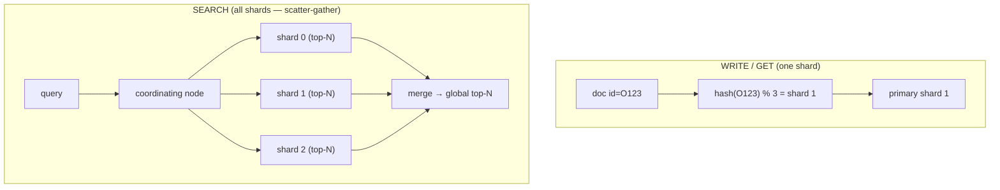
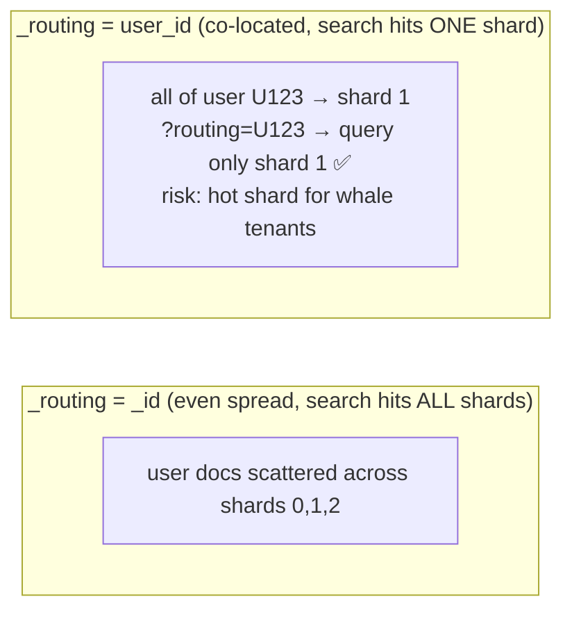
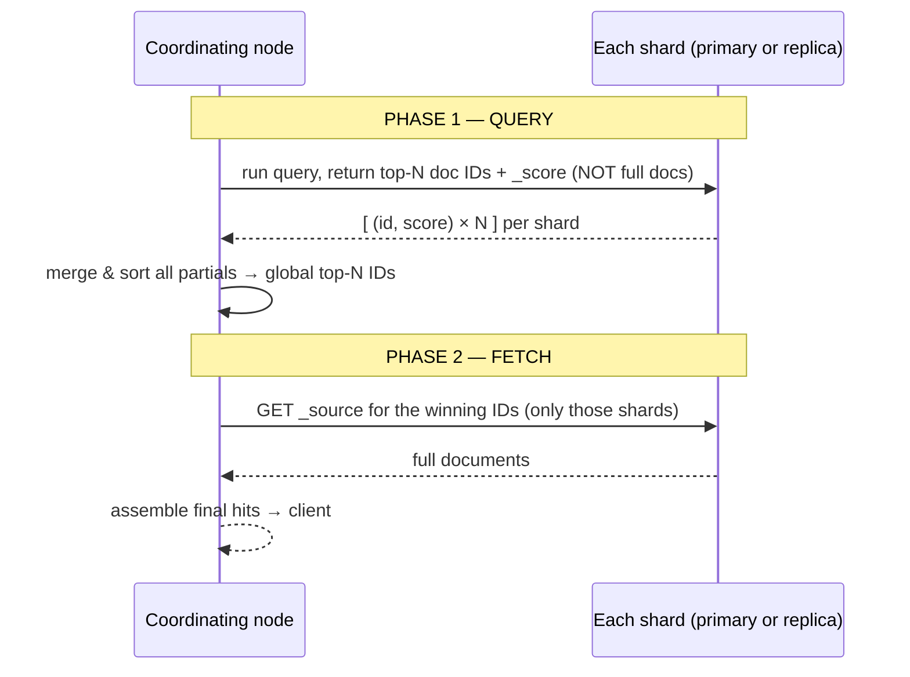
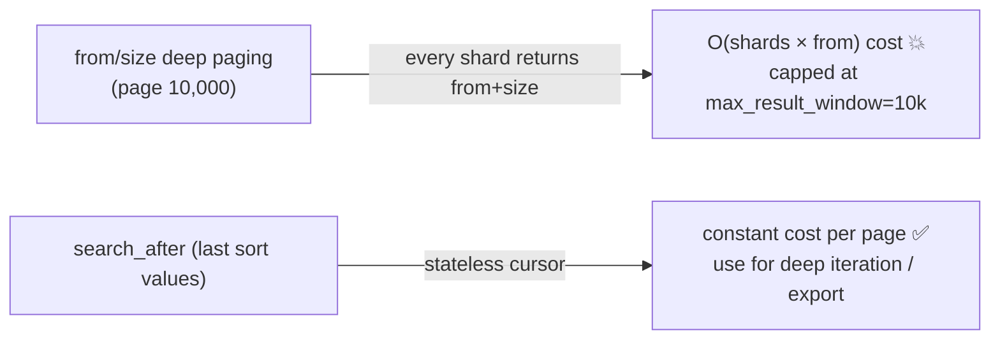

# 09 — Distributed Search: Sharding, Routing & Scatter-Gather

> **Why this is Topic 9:** Everything so far described a *single* Lucene index. Elasticsearch's power is
> running that across **many shards on many nodes** and making it look like one. This topic is where the
> "distributed" in the name lives: how a document is routed to a shard, how a search **fans out to every
> shard and gathers results** (scatter-gather), and the two-phase **query-then-fetch** read path. Zerodha
> will probe routing (`hash(_routing) % primary_shards`), why you can't change the shard count after
> creation, and how pagination interacts with sharding (the deep-pagination trap).

---

## 1. WHAT

An index is split into **primary shards** (set at creation, **immutable**), each a self-contained Lucene
index, possibly with **replica** shards (copies). Two distributed operations:

- **Routing (write/get):** which shard owns a document → `shard = hash(_routing) % number_of_primary_shards`,
  where `_routing` defaults to the document `_id`.
- **Scatter-gather (search):** a query has no single owning shard, so it's **broadcast to one copy of every
  shard** (primary or replica), each returns partial results, and the **coordinating node merges** them.

The slogan:

> **Writes/gets go to *one* shard (routing by id); searches fan out to *all* shards (scatter-gather) and
> are merged by the coordinating node. The primary-shard count is fixed at creation because it's in the
> routing formula.**

---

## 2. WHY (the problem it solves)

Sharding gives **horizontal scale** (data bigger than one node, parallel query execution) and replicas
give **HA + read throughput**. But it forces two realities:

1. **The shard count is baked into routing** — `% number_of_primary_shards`. Change it and every document
   would route to a *different* shard, so the existing index would be wrong. Hence primaries are immutable;
   to change them you **reindex** (or use the `_split`/`_shrink` APIs) into a new index. (Replicas *can*
   change anytime — they're just copies.)
2. **Searches must touch every shard** (unless routing is constrained), so more shards = more parallelism
   but also more coordination overhead. Over-sharding (thousands of tiny shards) is a top cause of cluster
   pain.



---

## 3. HOW (the internals)

### 3.1 Routing: how a doc finds its shard

`shard_num = hash(_routing) % number_of_primary_shards`. By default `_routing = _id`, giving an even
spread. You can supply a **custom `_routing`** value (e.g., `user_id`) so all of a user's docs land on the
**same shard**:

- **Benefit:** a search filtered to that user can target **one shard** (`?routing=user_id`) instead of
  fanning out to all — huge speedup for multi-tenant workloads (every Zerodha user's orders on a
  predictable shard).
- **Risk:** **hotspots** — a whale tenant (one user with millions of orders) overloads its shard. Custom
  routing trades balanced load for targeted reads; use it when tenants are roughly uniform.



### 3.2 The two-phase read path: **query-then-fetch** (callbacks to Topics 2, 7)

A search can't just return full docs from each shard (it doesn't know the global ranking yet), so it runs
in **two phases**:



1. **Query phase:** the coordinating node sends the query to one copy of every shard. Each shard finds its
   own **top `from+size`** matches and returns just **doc IDs + scores** (cheap). The coordinator merges
   and sorts these into the global top-N.
2. **Fetch phase:** the coordinator asks only the shards holding the winning IDs for their full `_source`,
   assembles the hits, and returns them.

Why two phases? It avoids shipping full documents from every shard for results that won't make the cut —
only the final winners are fetched. (Scoring uses **per-shard** stats by default — `query_then_fetch`;
`dfs_query_then_fetch` adds a pre-round for global stats, Topic 7.)

### 3.3 The deep-pagination trap (and the fix)

Because each shard must return `from + size` results so the coordinator can merge, asking for page 10,000
(`from: 100000, size: 10`) makes **every shard** produce 100,010 hits and the coordinator sort
`shards × 100,010` — memory/CPU explode. ES caps this at `index.max_result_window` (default 10,000) for
exactly this reason.

For deep iteration, use:

- **`search_after`** — pass the sort values of the last hit to get the next page; **stateless**, scales to
  any depth, the right tool for "load more"/infinite scroll and exporting.
- **PIT (point-in-time) + `search_after`** — a consistent snapshot for stable deep paging while data
  changes.
- **`scroll`** — older approach for one-shot bulk export (holds a snapshot/cursor; heavier, being
  superseded by PIT+search_after).



### 3.4 Replicas: HA + read scaling

- A search uses **one copy** of each shard (primary **or** replica), chosen by **adaptive replica
  selection** (route to the least-loaded/fastest copy). So adding replicas **increases read throughput**
  (more copies to spread queries) and provides **failover** (if a node dies, a replica is promoted).
- Replicas do **not** speed up a single query's latency much; they raise **concurrent** query capacity and
  resilience.

### 3.5 Shard sizing — the practical rule (preview of Topic 11)

- Too **few/huge** shards (>50 GB) → slow recovery, uneven balancing, big merges.
- Too **many/tiny** shards → cluster-state and per-shard overhead crush the cluster (each shard costs heap
  and file handles).
- Rule of thumb: aim for shards in the tens of GB (≈10–50 GB), and keep total shards per node proportional
  to heap. **You set primaries up front based on projected size** because you can't change them later
  without reindex/split/shrink.

---

## 4. CODE / EXAMPLES

```bash
# Fix the primary shard count at creation (immutable); replicas are changeable
PUT /orders
{ "settings": { "number_of_shards": 3, "number_of_replicas": 1 } }

PUT /orders/_settings { "number_of_replicas": 2 }   # ✅ allowed anytime (HA / read scaling)
# changing number_of_shards later → NOT allowed; reindex or _split/_shrink

# Custom routing: co-locate a user's docs on one shard, then target it on read
POST /orders/_doc?routing=U123 { "user_id": "U123", "symbol": "RELIANCE" }
POST /orders/_search?routing=U123                      # hits ONLY that shard (fast)
{ "query": { "term": { "user_id": "U123" } } }

# Deep iteration done right — search_after (stateless cursor), NOT from/size
POST /orders/_search
{ "size": 100,
  "sort": [ { "placed_at": "asc" }, { "order_id": "asc" } ],   # tiebreaker = unique field
  "query": { "match_all": {} } }
# take the last hit's sort values → next page:
POST /orders/_search
{ "size": 100,
  "sort": [ { "placed_at": "asc" }, { "order_id": "asc" } ],
  "search_after": [ 1719460800000, "O5001" ],
  "query": { "match_all": {} } }

# Consistent deep paging over changing data: open a PIT, page with search_after
POST /orders/_pit?keep_alive=2m            # → returns a pit id
POST /_search
{ "size": 100, "pit": { "id": "<pit_id>", "keep_alive": "2m" },
  "sort": [ { "placed_at": "asc" }, { "order_id": "asc" } ],
  "search_after": [ 1719460800000, "O5001" ] }

# See where shards live / their sizes
GET /_cat/shards/orders?v
```

---

## 5. INTERVIEW ANGLES

**Q: How does a document get assigned to a shard?**
A: `shard = hash(_routing) % number_of_primary_shards`, with `_routing` defaulting to the doc `_id`. That's
also why the primary shard count is immutable — changing it would change every doc's routing, invalidating
the index.

**Q: Why can't you change the number of primary shards after creating an index?**
A: It's in the routing formula (`% number_of_primary_shards`). Changing it would misroute every existing
document. To change it you reindex into a new index (or use `_split`/`_shrink`). Replicas, being copies,
can change anytime.

**Q: Walk me through how a search executes across shards.**
A: Scatter-gather in two phases. **Query phase:** the coordinating node broadcasts to one copy of every
shard; each returns its top `from+size` as doc IDs+scores; the coordinator merges/sorts into the global
top-N. **Fetch phase:** it fetches `_source` only for the winning IDs and returns the hits. Two phases
avoid shipping full docs that won't make the cut.

**Q: What is custom routing and when do you use it?**
A: Supplying a `_routing` value (e.g., `user_id`) so related docs co-locate on one shard. A filtered search
can then target that single shard (`?routing=user_id`) instead of fanning out — great for multi-tenant
reads. Risk: hotspots if one tenant is huge.

**Q: Why is deep pagination (`from: 100000`) a problem, and what's the fix?**
A: Every shard must return `from+size` hits for the coordinator to merge, so cost grows with `from` ×
shards — memory/CPU blow up (ES caps it at `max_result_window=10k`). Use `search_after` (a stateless cursor
from the last hit's sort values), optionally with a PIT for a consistent snapshot, for deep iteration.

**Q: Do replicas make searches faster?**
A: They increase **throughput** and **resilience**, not single-query latency. A search uses one copy per
shard (adaptive replica selection picks the best), so more replicas spread concurrent queries and survive
node failures, but one query's latency is bounded by the slowest shard it must hit.

**Q: How many shards should an index have?**
A: Size-driven: aim for shards in the ~10–50 GB range, avoid thousands of tiny shards (per-shard
heap/file-handle overhead) and avoid huge shards (slow recovery/merges). Set primaries up front from
projected data size since they're fixed afterward.

**Q: A single user's queries are slow because they fan out to all shards — how do you fix it?**
A: Custom routing on `user_id` so that user's docs live on one shard, then query with `?routing=user_id`
to hit just that shard. Watch for hot shards if tenants are uneven; otherwise it eliminates the
scatter-gather overhead.

---

## 6. ONE-LINE RECALL CARDS

- **Write/get → one shard** via `hash(_routing) % number_of_primary_shards` (`_routing` defaults to `_id`).
- **Search → all shards** (scatter-gather); the **coordinating node** merges partial results.
- **Primary shard count is immutable** (it's in the routing formula) → reindex / `_split` / `_shrink` to change. Replicas change anytime.
- **Query-then-fetch:** phase 1 each shard returns top-N **IDs+scores**; coordinator merges; phase 2 fetch `_source` for winners only.
- **Custom routing** (`user_id`) co-locates docs → target one shard on read (fast, multi-tenant); risk = **hot shards**.
- **Deep pagination** (`from/size`) costs O(shards × from) → capped at `max_result_window` (10k); use **`search_after`** (+ PIT).
- **Replicas** = HA + read **throughput** (one copy used per shard, adaptive selection), not single-query speed.
- **Shard sizing:** ~10–50 GB each; avoid over-sharding (tiny-shard overhead) and giant shards (slow recovery).

→ **Next:** [10 — Cluster Coordination & HA](10-cluster-coordination-ha.md) (master election, quorum,
split-brain prevention, shard allocation, and the green/yellow/red health model).
