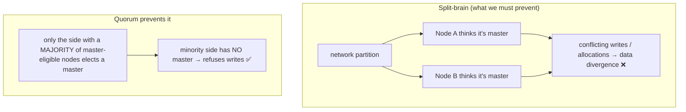
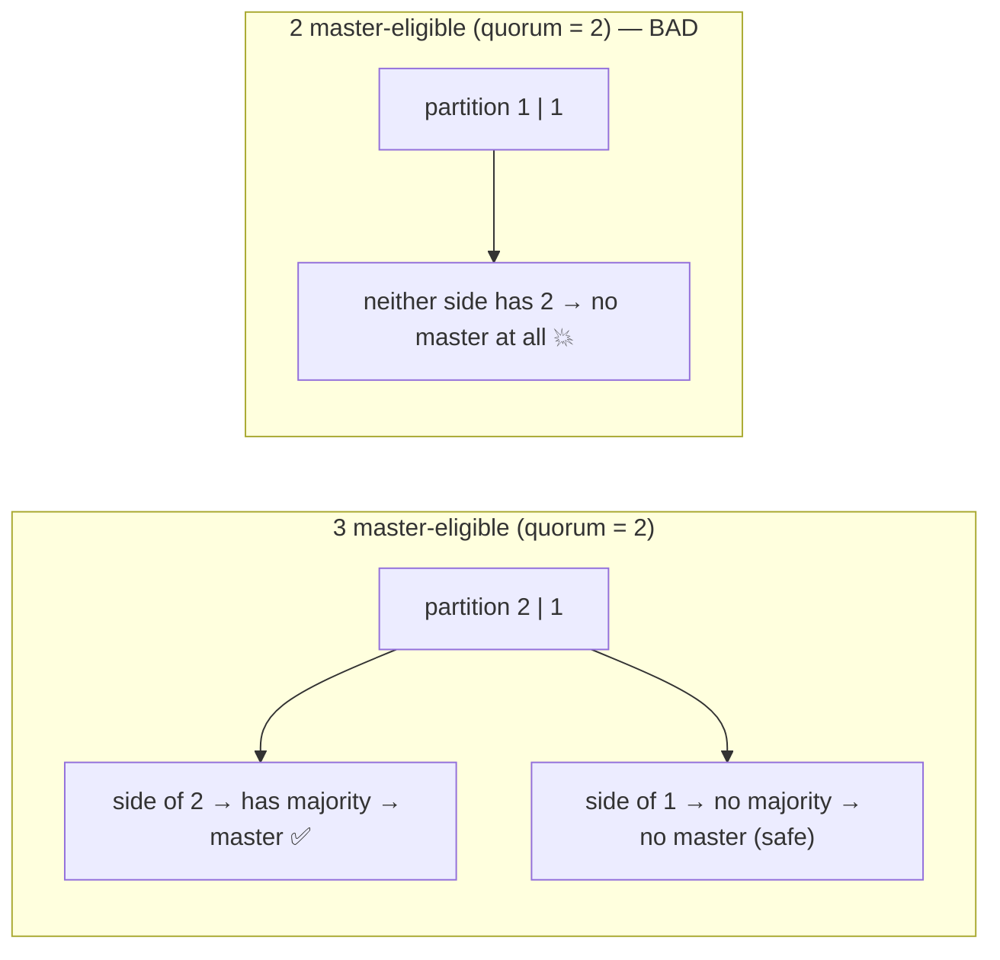
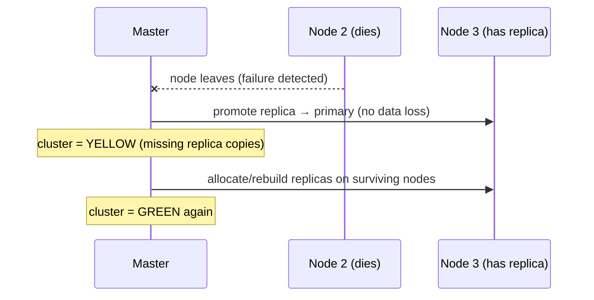

# 10 — Cluster Coordination & HA

> **Why this is Topic 10:** Topic 9 showed how data spreads across shards/nodes; this topic is the
> **control plane** that keeps that distributed system coherent: who's the **master**, how it's elected,
> how a **quorum** prevents **split-brain**, how shards get **allocated/rebalanced**, and what
> green/yellow/red actually mean for *availability*. For a fintech system where the order/search backbone
> must not lose data or serve stale truth, this is the "how does it stay correct when a node dies?"
> conversation Zerodha will absolutely have.

---

## 1. WHAT

A cluster is a set of nodes that share a **cluster state** (the metadata: indices, mappings, shard
locations, settings). One **master-eligible** node is elected **active master**; it owns cluster-state
changes. Coordination guarantees:

- **One master at a time** (via a **quorum** of master-eligible nodes).
- **No split-brain** (two masters making conflicting changes) — prevented by requiring a majority.
- **Automatic shard allocation/recovery** so every primary (and its replicas) has a home, surviving node
  failures.

The slogan:

> **The master owns the cluster state and is elected by a quorum (majority) of master-eligible nodes;
> requiring a majority is what mathematically prevents split-brain. Data nodes hold shards; the master
> never touches document data.**

Health colors (callback to Topic 1): **green** = all primaries + replicas assigned; **yellow** = all
primaries assigned but some replicas unassigned (fully usable, reduced redundancy); **red** = at least one
**primary** unassigned (data missing — some reads/writes fail).

---

## 2. WHY (the problem it solves)

A distributed datastore needs a single source of truth for *"where does each shard live and what's the
schema?"* If two nodes both believed they were master during a network partition, they could allocate the
same shard differently or accept divergent writes → **split-brain**, the cardinal sin of distributed
systems (irreconcilable data). Coordination exists to guarantee **at most one master** and **consistent
cluster-state changes**, even across failures.



---

## 3. HOW (the internals)

### 3.1 Master election and quorum

- Among **master-eligible** nodes, one is elected **active master**. Election and cluster-state changes use
  a consensus protocol (modern ES uses **Zen2 / a Raft-like** coordination layer; older ES used Zen
  discovery with `minimum_master_nodes`).
- A change is committed only if a **quorum** — a **majority** of master-eligible nodes — agrees. With *n*
  master-eligibles, quorum = ⌊n/2⌋ + 1.
- **Why an odd number** (3, 5, …): a majority must exist on at most one side of any partition. With 3
  master-eligibles, quorum = 2; a partition can give one side ≥2 (it gets a master) while the other has ≤1
  (no master, refuses to act). With an **even** number (e.g., 2), a 1–1 split has **no** majority → the
  cluster can't elect a master and stalls (safe but unavailable). Hence **3 dedicated master-eligible
  nodes** is the standard HA recommendation.



- **Voting configuration:** modern ES auto-manages the set of master-eligible "voters." Best practice:
  **dedicated master nodes** (no data role) so a heavy data/query load can't destabilize the master, plus
  **node roles** to separate concerns (master / data / ingest / coordinating-only).

### 3.2 Cluster state and how it propagates

- The cluster state holds index metadata, **mappings** (why mapping explosion in Topic 5 is dangerous — it
  bloats this and is replicated everywhere), routing tables (shard → node), and settings.
- The master computes new state on changes (index created, shard moved) and **publishes** it to all nodes;
  the change is committed once a quorum acknowledges. Keeping cluster state small and changes infrequent is
  a stability goal.

### 3.3 Shard allocation, rebalancing, and recovery

The master decides where shards live, honoring rules:

- **Primary/replica never co-located:** a primary and its replica are placed on **different nodes** (so one
  node's death can't take both). This is also why a 1-node cluster is **yellow** — replicas have nowhere to
  go.
- **Allocation awareness:** spread copies across racks/zones (`cluster.routing.allocation.awareness`) so a
  rack/AZ failure doesn't lose all copies.
- **Rebalancing:** when nodes join/leave, the master moves shards to balance load — throttled to avoid I/O
  storms.
- **Recovery on failure:** if a node dies, its **replicas** are **promoted to primary** elsewhere and new
  replicas are rebuilt from surviving copies; the cluster goes **yellow** (degraded) then back to **green**.



### 3.4 Health colors and what they imply for availability

| Color | Meaning | Availability |
|-------|---------|-------------|
| **green** | all primaries **and** replicas assigned | full redundancy, all ops OK |
| **yellow** | all **primaries** assigned, some replicas missing | **fully usable**, just less redundant (one more failure could hurt) |
| **red** | ≥1 **primary** unassigned | **data missing** → some searches/writes for that data fail |

Key nuance interviewers test: **yellow is not an outage** — your data is fully readable/writable; you've
just lost redundancy. **Red** is the real alarm (a primary is gone). A fresh single-node dev cluster being
yellow (no node for replicas) is normal, not a bug.

### 3.5 Write consistency vs availability (callback to Topic 3)

- A write goes to the **primary**, which then replicates to **all in-sync replicas** and is acknowledged
  only after they respond — that's where durability comes from. `wait_for_active_shards` is a separate
  **pre-flight availability check** (default: 1 = primary only): before the write starts, ES refuses it
  unless that many shard copies are *active*. It gates whether the write proceeds, not how many copies
  ack it — a tunable **consistency/availability** trade, not a durability knob.
- During a partition, the **minority side has no master and refuses writes** (CP-leaning for cluster
  metadata): ES prioritizes **not splitting brain / not diverging** over accepting writes everywhere. So
  the search store can become unavailable rather than inconsistent — usually the right call when the
  **system of record is Postgres** (Topic 12) and ES is a derived index.

---

## 4. CODE / EXAMPLES

```bash
# Cluster health — the first thing you check (green/yellow/red + unassigned shards)
GET /_cluster/health
# { "status": "yellow", "active_primary_shards": 3, "unassigned_shards": 3, ... }

# WHY are shards unassigned? (the go-to diagnostic when red/yellow)
GET /_cluster/allocation/explain
# explains e.g. "no node big enough", "awareness rule", "replica can't co-locate with primary"

# Node roles — dedicate master-eligible nodes, separate from data (HA best practice)
# elasticsearch.yml on master nodes:
#   node.roles: [ master ]
# on data nodes:
#   node.roles: [ data, ingest ]
# Run an ODD number (3) of dedicated master-eligible nodes → quorum = 2, split-brain-safe

# Spread copies across availability zones (rack awareness)
PUT /_cluster/settings
{ "persistent": {
    "cluster.routing.allocation.awareness.attributes": "zone" } }
# + each node tags: node.attr.zone: az-1 / az-2 / az-3

# Require ≥2 active copies BEFORE the write proceeds (availability pre-check, not an ack count)
PUT /orders/_doc/O1?wait_for_active_shards=2
{ "symbol": "RELIANCE", "qty": 10 }

# Inspect where shards live and which are unassigned
GET /_cat/shards?v
GET /_cat/nodes?v
```

---

## 5. INTERVIEW ANGLES

**Q: How does Elasticsearch elect a master and avoid split-brain?**
A: Master-eligible nodes elect one active master via a Raft-like consensus (Zen2). A cluster-state change
commits only with a **quorum** (majority) of master-eligible nodes. Because a majority can exist on only
one side of a partition, you can never have two masters — the minority side gets no master and refuses to
act.

**Q: Why run 3 master-eligible nodes, not 2?**
A: Quorum is ⌊n/2⌋+1. With 3, quorum=2: a 2–1 partition still has a majority side (it stays available)
while the minority safely stalls. With 2, quorum=2: a 1–1 split has no majority, so the whole cluster can't
elect a master. Odd numbers (3/5) give partition tolerance; even numbers don't help.

**Q: What's the difference between yellow and red?**
A: **Yellow** = all primaries assigned but some replicas aren't — the cluster is **fully usable**, just
less redundant. **Red** = at least one **primary** is unassigned, so some data is missing and those
reads/writes fail. Yellow is a redundancy warning; red is a real outage for the affected data.

**Q: A new single-node cluster shows yellow. Bug?**
A: No. With one node, replica shards have nowhere to go (a replica can't sit on the same node as its
primary), so they stay unassigned → yellow. Add a node (or set replicas to 0 for dev) and it goes green.

**Q: What happens to shards when a data node dies?**
A: The master detects the failure, **promotes a replica to primary** on a surviving node (no data loss if
a replica existed), and the cluster goes yellow while it rebuilds replicas from surviving copies, then
returns to green. Primaries and their replicas are never co-located, so one node's loss can't take both.

**Q: Does ES choose consistency or availability under a partition?**
A: For cluster **metadata/coordination** it's CP-leaning: the minority side has no master and refuses
writes to avoid split-brain/divergence, so it can become unavailable rather than inconsistent. For
documents you tune `wait_for_active_shards` to trade durability vs availability. Since ES is typically a
derived index over Postgres, "unavailable but consistent" is usually acceptable.

**Q: What is the cluster state and why keep it small?**
A: It's the metadata the master owns and publishes to all nodes — indices, mappings, shard routing,
settings. It's replicated everywhere and changed via consensus, so bloating it (e.g., mapping explosion,
too many shards/indices) slows publication and destabilizes the master. Keep mappings tight and shard
counts sane.

**Q: How do you survive an availability-zone failure?**
A: Allocation awareness (`allocation.awareness.attributes: zone`) forces primary and replica copies into
different zones, so losing a zone never removes all copies of a shard. Combine with ≥3 master-eligible
nodes spread across zones for quorum survival.

---

## 6. ONE-LINE RECALL CARDS

- **Master** owns the **cluster state** (indices, mappings, shard routing); **data nodes** hold shards — master never touches docs.
- Election + state changes need a **quorum** (majority) of master-eligible nodes → **prevents split-brain** (only one majority side).
- Run an **odd number (3) of dedicated master-eligible** nodes; quorum = ⌊n/2⌋+1; even counts stall on a tie.
- **green** = all primaries+replicas; **yellow** = primaries OK, replicas missing (**still fully usable**); **red** = a **primary** missing (data loss).
- Primary & its replica are **never co-located** → 1-node cluster is yellow; a node death promotes a **replica → primary**.
- **Allocation awareness** spreads copies across zones/racks so an AZ failure can't lose all copies.
- Under partition, the **minority side has no master → refuses writes** (CP-leaning metadata; safe over divergent).
- Diagnose with `_cluster/health` + `_cluster/allocation/explain`; keep cluster state small (mappings/shards) for stability.

→ **Next:** [11 — Performance & Scaling at Fintech Scale](11-performance-scaling-ilm.md) (shard sizing,
hot-warm-cold + ILM, bulk indexing, and search/caching tuning).
