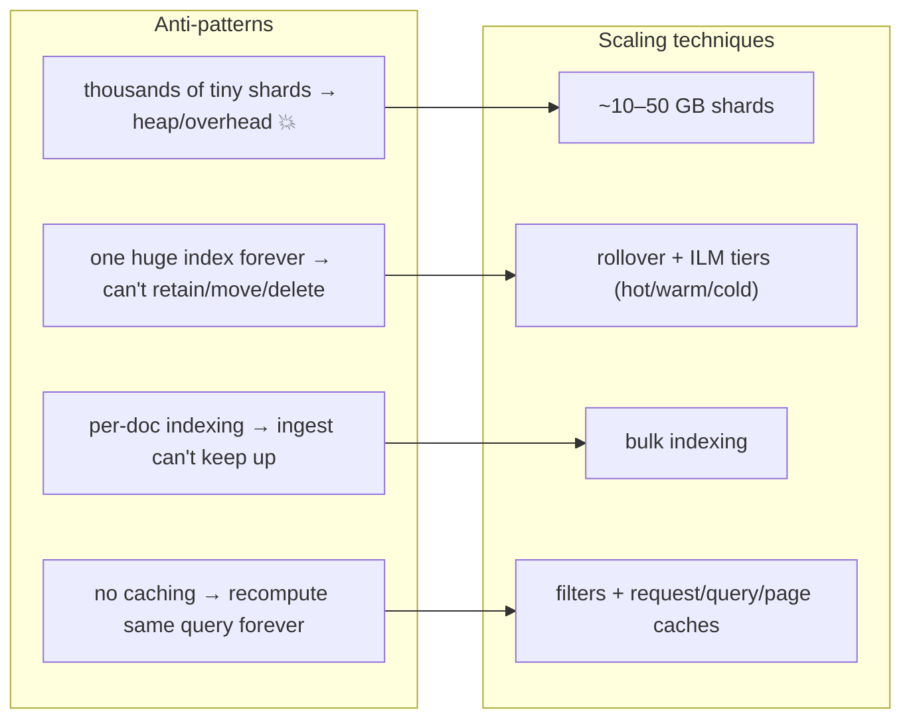
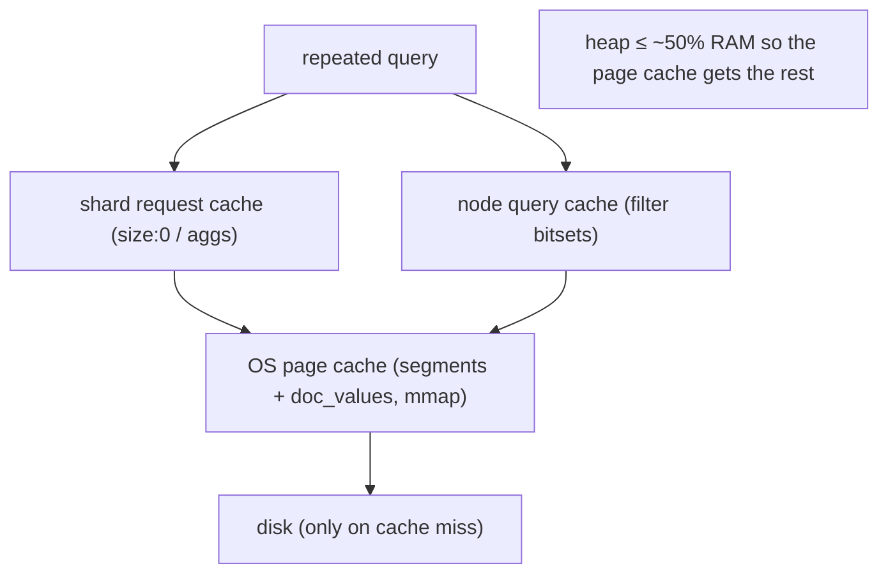

# 11 — Performance & Scaling at Fintech Scale

> **Why this is Topic 11:** Topics 1–10 are the mechanics; this is the **operations** chapter — how you run
> Elasticsearch under real fintech load (high write rates from order/log streams, low-latency search,
> retention requirements) without it falling over. The big levers Zerodha will probe: **shard sizing**
> (the #1 scaling mistake is getting this wrong), the **hot-warm-cold** tier strategy with **ILM**
> (Index Lifecycle Management) for time-series data, **bulk** indexing, and the **caching** layers that
> make repeated queries cheap. This is where "I understand ES" becomes "I can operate ES."

---

## 1. WHAT

Scaling Elasticsearch is about matching the **data layout** and **resource use** to the workload:

- **Shard sizing** — right number/size of shards (too many tiny = overhead, too few huge = slow recovery).
- **Time-series strategy** — roll indices over time, move them through **hot → warm → cold → frozen** tiers
  on cheaper hardware as they age, delete on schedule, all automated by **ILM**.
- **Bulk + tuning** the write path (Topic 3) for high ingest.
- **Caching** — node query cache, shard request cache, and the OS page cache doing the heavy lifting.

The slogan:

> **Keep shards ~10–50 GB, roll time-series indices and age them down tiers with ILM, ingest in bulk, and
> let filters + caches (and the OS page cache) absorb repeated reads. Capacity = data size, shard count,
> and heap — balanced.**

---

## 2. WHY (the problem it solves)

Naive ES setups die in predictable ways: thousands of tiny shards exhaust heap and file handles; a single
giant daily index can't be efficiently retained or queried; per-document indexing can't keep up with an
order/log firehose; and recomputing the same dashboard query every second wastes CPU. The scaling
techniques exist to keep **heap bounded**, **recovery fast**, **ingest high**, and **reads cheap** as data
grows into TBs.



---

## 3. HOW (the internals)

### 3.1 Shard sizing — the #1 lever (callback to Topic 9)

- **Target ~10–50 GB per shard.** Below ~a few GB you're over-sharding; far above ~50 GB recovery, merges,
  and rebalancing get slow.
- **Each shard costs heap and file handles** (it's a full Lucene index with segments). Rule of thumb: keep
  total shards per node roughly **≤ ~20 shards per GB of heap**, and heap ≤ ~31 GB (the compressed-oops
  boundary — going above 32 GB *loses* effective memory).
- **Set primaries from projected size:** `primaries ≈ total_size / target_shard_size`. Remember primaries
  are **immutable** (Topic 9) — but you can `_split` (more shards) or `_shrink` (fewer) into a new index, or
  just **roll over** for time-series.

### 3.2 Time-series + rollover + ILM (the fintech retention pattern)

Order events, trade logs, audit trails are **time-series, append-mostly, rarely-updated**, with retention
rules ("keep 90 days hot-searchable, archive a year, delete after"). The pattern:

- **Data streams / rollover:** write to an alias (`orders`) that points at the current "write" index; when
  it hits a size/age/doc threshold, **rollover** creates `orders-000002` and repoints the alias. Each index
  stays a sane size; old ones are immutable and easy to age/delete.
- **ILM (Index Lifecycle Management)** automates the journey through **tiers**:

| Tier | Hardware | Role | What ILM does |
|------|----------|------|---------------|
| **hot** | fast SSD, lots of RAM | active writes + frequent search | index here; rollover at threshold |
| **warm** | cheaper SSD/HDD | searched less, no writes | move shards here; **force-merge** to 1 segment, maybe shrink/reduce replicas |
| **cold** | cheap HDD / object-store-backed | rarely searched | move/searchable-snapshot, fewer replicas |
| **frozen** | object storage (S3) | almost never searched | searchable snapshot, near-zero local footprint |
| **delete** | — | past retention | delete the index |


This is the single most important operational pattern for log/event data — and exactly what a Zerodha
order/audit pipeline needs. **force-merge** (Topic 3) belongs in the warm phase: once an index is read-only,
merging to one segment makes search faster and reclaims deleted-doc space — **never** force-merge a hot
(still-written) index.

### 3.3 High-throughput indexing (callback to Topic 3)

- **Bulk API:** batch many docs per request (target a few MB / a few thousand docs per bulk). Per-doc
  indexing is dominated by request overhead.
- **Tune the write path for bulk loads:** raise `refresh_interval` (e.g., `30s` or `-1` during a backfill —
  fewer expensive refreshes/segments), set `number_of_replicas: 0` during the initial load then restore it,
  and let the OS handle async translog if some loss window is acceptable. Restore search-friendly settings
  after.
- **Parallelize** bulk across shards/clients; size bulks so no single request is huge.
- **Let ES generate IDs** (or use them deliberately) — providing your own `_id` forces a get-before-write
  uniqueness check; auto IDs skip it for pure appends.

### 3.4 Caching layers — why repeated reads are cheap

- **Node query cache:** caches **filter** results (the bitsets from Topic 6 filter context) per segment.
  This is why putting constraints in `filter` matters — they get cached and reused.
- **Shard request cache:** caches the **whole response** of `size: 0` requests (i.e., **aggregations**) per
  shard, keyed by the request. Dashboards that re-run the same agg hit this — near-free.
- **OS page cache (the big one):** segments and `doc_values` are memory-mapped files; the OS caches hot
  pages in free RAM. **This is why you give ES heap ≤ ~50% of RAM** — the *other* half is for the page
  cache that makes Lucene fast. Over-allocating heap starves the page cache and *hurts* performance.



### 3.5 Search-side tuning

- **Filter context first** (Topic 6) — cacheable, scoreless, cheap; shrink the candidate set before scoring.
- **Avoid deep pagination** — use `search_after`/PIT (Topic 9).
- **Limit fields/`_source`** returned (`_source` filtering, `docvalue_fields`, `stored_fields`) so fetch is
  cheap.
- **Pre-aggregate / rollup** very high-volume metrics if raw granularity isn't needed.
- **Right-size replicas** for read concurrency; **adaptive replica selection** routes to the fastest copy.
- **Watch GC/heap** — large aggregations and fielddata (Topic 8 — don't!) are the usual heap pressure;
  circuit breakers abort queries before they OOM the node.

### 3.6 Capacity planning mental model

`cluster size ≈ f(data volume, retention, query concurrency)`. Estimate: daily ingest × retention =
storage; divide by target shard size = shards; size nodes so shards-per-node and heap stay in budget;
add replicas for HA + read load; use tiers so only **hot** data sits on expensive hardware. ES is a
**derived store** (Topic 12) — you can usually rebuild it from Postgres, which relaxes durability and lets
you favor throughput.

---

## 4. CODE / EXAMPLES

```bash
# Bulk indexing (the throughput primitive) — many docs, one request
POST /_bulk
{ "index": { "_index": "orders" } }
{ "order_id": "O1", "symbol": "RELIANCE", "qty": 10 }
{ "index": { "_index": "orders" } }
{ "order_id": "O2", "symbol": "TCS", "qty": 5 }

# Tune the write path for a big backfill, then restore search-friendly settings
PUT /orders/_settings { "index": { "refresh_interval": "-1", "number_of_replicas": 0 } }
# ... run bulk load ...
PUT /orders/_settings { "index": { "refresh_interval": "1s", "number_of_replicas": 1 } }
POST /orders/_forcemerge?max_num_segments=1     # only because it's now read-only/cold

# ILM policy: hot → warm (force-merge) → cold (snapshot) → delete
PUT _ilm/policy/orders_policy
{ "policy": { "phases": {
    "hot":  { "actions": { "rollover": { "max_size": "50gb", "max_age": "1d" } } },
    "warm": { "min_age": "7d",  "actions": { "forcemerge": { "max_num_segments": 1 },
                                             "shrink": { "number_of_shards": 1 },
                                             "set_priority": { "priority": 50 } } },
    "cold": { "min_age": "30d", "actions": { "searchable_snapshot": { "snapshot_repository": "s3_repo" } } },
    "delete": { "min_age": "365d", "actions": { "delete": {} } } } } }

# Bind the policy to new indices via a template + data stream
PUT _index_template/orders_template
{ "index_patterns": ["orders-*"],
  "data_stream": {},
  "template": { "settings": {
    "index.lifecycle.name": "orders_policy",
    "number_of_shards": 3, "number_of_replicas": 1 } } }

# Enable the shard request cache for dashboard aggs (size:0 cached per shard)
POST /orders/_search?request_cache=true
{ "size": 0, "aggs": { "by_symbol": { "terms": { "field": "symbol" } } } }

# Return only what you need (cheap fetch phase)
POST /orders/_search
{ "_source": ["order_id", "symbol", "status"],
  "query": { "term": { "status": "OPEN" } } }

# Health/sizing diagnostics
GET /_cat/shards?v&s=store:desc       # shard sizes (spot giant/tiny shards)
GET /_cat/indices?v&s=store:desc      # index sizes
GET /_nodes/stats/jvm,os              # heap & page-cache pressure
```

---

## 5. INTERVIEW ANGLES

**Q: How do you size shards, and why does it matter so much?**
A: Aim for ~10–50 GB per shard. Too many tiny shards exhaust heap/file handles (each is a full Lucene
index); too few huge shards make recovery, merges, and rebalancing slow. Set primary count from projected
size (`size/target`), and since primaries are immutable, use rollover (time-series) or `_split`/`_shrink`
to adjust.

**Q: Describe a hot-warm-cold architecture and when you'd use it.**
A: For time-series data (orders, logs, audit). Active data is indexed on **hot** nodes (fast SSD/RAM);
ILM rolls indices over by size/age, then **moves** aging indices to **warm** (cheaper, force-merged,
read-only), **cold/frozen** (HDD or searchable snapshots on S3), and finally **deletes** past retention.
It keeps expensive hardware for hot data only while meeting retention rules.

**Q: What is ILM and what does it automate?**
A: Index Lifecycle Management automates the lifecycle of time-series indices: rollover at a threshold, and
phase transitions (hot→warm→cold→frozen→delete) with actions like force-merge, shrink, replica changes,
searchable snapshots, and deletion — so retention/tiering runs without manual ops.

**Q: How do you maximize indexing throughput?**
A: Use the **bulk** API (a few MB per request), raise `refresh_interval` (or `-1`) and set replicas to 0
during a backfill (restore after), parallelize bulks across shards/clients, and let ES auto-generate IDs
for pure appends to skip the uniqueness check. Refresh/merge/replication are the costs you're tuning.

**Q: Why should ES heap be at most ~50% of RAM and ≤ ~31 GB?**
A: The other half of RAM is the **OS page cache**, which holds memory-mapped segments and `doc_values` —
that's what makes Lucene fast; over-allocating heap starves it. And above ~32 GB the JVM loses compressed
ordinary object pointers, so a 40 GB heap can have *less* usable space than 31 GB. Stay ≤ ~31 GB.

**Q: What caches make repeated queries cheap?**
A: The **node query cache** (filter bitsets — another reason to use filter context), the **shard request
cache** (whole responses for `size: 0` aggregation requests), and crucially the **OS page cache** for
segment/doc_values pages. Filters + `size: 0` dashboards benefit the most.

**Q: When do you force-merge, and when must you not?**
A: Force-merge only **read-only/cold** indices (the warm ILM phase) to collapse to one segment — faster
search, reclaims deleted-doc space. **Never** force-merge a hot index still receiving writes: it produces
huge segments and fights ongoing indexing.

**Q: How do you do capacity planning for an ES cluster?**
A: Storage = daily ingest × retention (× replicas); shards = storage / target shard size; size nodes so
shards-per-node and heap stay in budget (≤ ~31 GB heap, ≤ ~50% RAM); add replicas for HA and read
concurrency; tier with ILM so only hot data uses premium hardware. Since ES is derived from Postgres, you
can favor throughput over maximal durability.

---

## 6. ONE-LINE RECALL CARDS

- **Shard size ~10–50 GB**; each shard costs heap/file-handles → avoid over-sharding; primaries immutable → rollover/`_split`/`_shrink`.
- **Time-series pattern:** write alias + **rollover**, then **ILM** ages indices **hot→warm→cold→frozen→delete**.
- **force-merge in the warm (read-only) phase only** — never on a hot, still-written index.
- **Bulk** ingest; for backfills raise `refresh_interval`(/`-1`) and set replicas 0, then restore.
- **Heap ≤ ~50% RAM and ≤ ~31 GB** — leave RAM for the **OS page cache** (mmap segments + doc_values); don't cross the 32 GB oops cliff.
- Caches: **node query cache** (filter bitsets), **shard request cache** (`size:0` aggs), **OS page cache** (the big one).
- Search tuning: **filter first**, avoid deep pagination (`search_after`), trim `_source`, right-size replicas, watch GC/circuit breakers.
- Capacity ≈ f(ingest × retention, shard size, heap, concurrency); ES is **derived** from Postgres → favor throughput, tier cold data to S3.

→ **Next:** [12 — Postgres + Elasticsearch System Design](12-postgres-es-system-design.md) (the capstone:
CDC/dual-write sync, when NOT to use ES, search architecture, and handling divergence).
