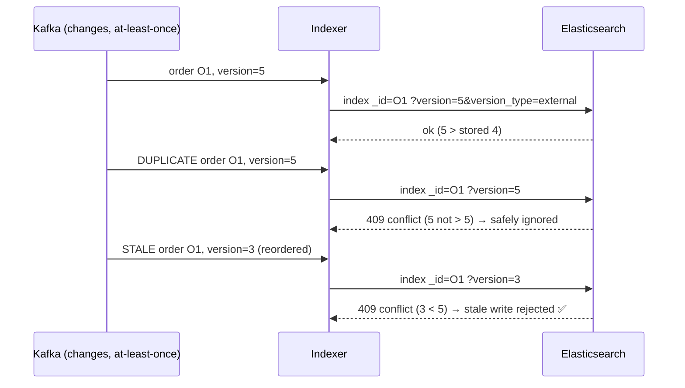

# 12 — Postgres + Elasticsearch System Design (Capstone)

> **Why this is the capstone:** Every prior topic answered *"how does Elasticsearch work?"* This one answers
> the question Zerodha actually cares about in the system-design round: *"how do Postgres and Elasticsearch
> work **together**, and how do you keep them in sync without corrupting the truth?"* The non-negotiable
> framing for a broker: **Postgres owns the money; Elasticsearch is a derived, rebuildable search/analytics
> view.** This chapter ties the [Postgres track](../postgres/index.md), the
> [Redis capstone](../redis/13-postgres-redis-system-design.md), and
> [`es_vs_postgres_deep_dive.md`](../es_vs_postgres_deep_dive.md) into one coherent architecture.

---

## 1. WHAT

A two-store architecture where each system does what it's good at:

| | **Postgres (system of record)** | **Elasticsearch (derived index)** |
|---|---|---|
| Owns | the **truth**: ledger, orders, balances | a **searchable/analytics copy** |
| Guarantees | ACID, multi-row transactions, FKs, constraints | near-real-time, AP, no multi-doc txns |
| Great at | exact lookups by PK, joins, money math, integrity | full-text search, ad-hoc filtering, aggregations at scale |
| Bad at | `LIKE '%x%'`, faceted search, free-text relevance, billions-of-rows analytics | being a source of truth (no transactions, eventual, rebuildable) |
| Failure stance | must **not** lose data | can be **rebuilt** from Postgres |

The slogan:

> **Write to Postgres (truth, transactional), then propagate to Elasticsearch (search/analytics) via an
> outbox or CDC. ES is eventually consistent and disposable — if it's wrong or lost, you rebuild it from
> the source of record.**

---

## 2. WHY (why two stores at all)

A single store can't be both a strict transactional ledger *and* a fast full-text/analytics engine.
Postgres `LIKE '%reliance%'` can't use a B-tree (leading wildcard → sequential scan, Topic 2 callback), has
no relevance ranking, and chokes on "distinct active users over 2B audit events." Elasticsearch nails all
of those but has **no ACID transactions, no real joins, and is eventually consistent** — disqualifying it
as the ledger. So you keep both: Postgres for correctness, ES for search/analytics, and a **sync pipeline**
between them. The hard part — and the whole interview — is the sync.

```mermaid
flowchart LR
    U["user action (place order / search)"] --> App["application"]
    App -->|writes truth (ACID)| PG[(Postgres — system of record)]
    PG -->|outbox / CDC| Sync["sync pipeline (Kafka/Debezium/worker)"]
    Sync -->|bulk index| ES[(Elasticsearch — derived search/analytics)]
    App -->|search & dashboards| ES
    App -->|exact reads / money ops| PG
```

---

## 3. HOW (the internals & the patterns)

### 3.1 The core decision: who reads from where

- **Write path:** always to **Postgres**, inside a transaction (the order, the ledger entries, the
  idempotency key — see Postgres ch. 9 / Redis capstone).
- **Read path split:**
  - **Exact-by-id, money, integrity-critical reads** → **Postgres** (the truth, strongly consistent).
  - **Search, filter, free-text, faceted, aggregation/dashboard reads** → **Elasticsearch** (fast,
    eventually consistent — fine for "find tickets mentioning 'margin'").
- **Never** let a balance/settlement decision read from ES — it can be seconds stale and is rebuildable.

### 3.2 Keeping them in sync — the four strategies (ranked)

```mermaid
flowchart TD
    subgraph S1["❌ Dual write (anti-pattern)"]
        A["app writes PG AND ES in code"] --> B["PG commits, ES write fails → divergence, no atomicity"]
    end
    subgraph S2["✅ Transactional Outbox (the default answer)"]
        C["one TX: write order + insert into outbox table"] --> D["relay reads outbox → bulk-indexes ES → marks sent"]
    end
    subgraph S3["✅ CDC (Debezium) at scale"]
        E["Debezium tails Postgres WAL"] --> F["emits row changes to Kafka → consumer bulk-indexes ES"]
    end
    subgraph S4["✅ Periodic reindex / reconciliation (safety net)"]
        G["batch job rebuilds/repairs ES from PG"] --> H["fixes drift; full rebuild on demand"]
    end
```



1. **Dual write (avoid):** the app writes Postgres *and* ES directly. **No atomicity** — Postgres can commit
   while the ES write fails (or vice versa), leaving them **divergent** with no rollback. The classic wrong
   answer; name it and reject it.
2. **Transactional Outbox (default answer):** in the **same Postgres transaction** as the business write,
   insert a row into an `outbox` table. A relay (poller or CDC on the outbox) reads new rows and **bulk
   indexes** them into ES, marking them sent. Because the outbox insert is in the same ACID transaction,
   you **never lose an event** — at-least-once delivery to ES. (Same pattern as Postgres ch. 9 and the Redis
   capstone — reuse it.)
3. **CDC / Debezium (at scale):** tail the Postgres **WAL** (logical replication, Postgres ch. 7 callback)
   with Debezium → stream row changes to **Kafka** → a consumer bulk-indexes ES. Decouples producers from
   ES, handles huge volumes, replayable, and no app code changes. The "we're at fintech scale" answer.
4. **Periodic reindex / reconciliation (always have one):** a batch job that **rebuilds or repairs** the ES
   index from Postgres — the safety net for drift, mapping changes (Topic 5 → reindex behind an alias), and
   "ES is corrupt, rebuild it." Because ES is **derived**, a full rebuild is always possible.

### 3.3 Idempotency & ordering (so retries don't corrupt the index)

Sync is **at-least-once**, so the same event can arrive twice or out of order. Make indexing safe:

- **Use the Postgres PK as the ES `_id`** → re-indexing the same row **overwrites** (idempotent upsert), no
  duplicates.
- **Order/versioning:** include a monotonic version (e.g., an `updated_at` timestamp or a dedicated
  sequence/version column — avoid `xmin`, which is a 32-bit XID subject to wraparound, not reliably
  monotonic for external versioning) and index with
  **external versioning** (`version_type=external`) so a **stale** event can't overwrite a newer one — ES
  rejects an index op whose version ≤ the stored version (callback to optimistic concurrency in Topic 1).
- This turns "duplicate or reordered delivery" from a corruption risk into a no-op.



### 3.4 When NOT to use Elasticsearch (the maturity signal)

Interviewers love candidates who know the boundaries:

- **As a system of record / ledger** — no (no ACID, eventual, rebuildable). Postgres owns money.
- **For exact key-value lookups** — Postgres/Redis are simpler and stronger; don't add ES for `get by id`.
- **When you need read-your-writes / strong consistency** — ES is NRT (~1s refresh, Topic 3); a user may
  not see their just-written doc immediately.
- **Tiny data / simple `LIKE`** — Postgres full-text (`tsvector`/GIN) or `pg_trgm` may be enough; don't run
  a cluster you don't need.
- **As a transactional cache** — that's Redis (see the Redis capstone); ES is for search/analytics, not
  low-latency single-key caching.

> **Rule:** add Elasticsearch when you need full-text relevance, faceted/ad-hoc filtering, or analytics over
> large/append-heavy data — *not* as a default datastore.

### 3.5 Handling divergence (it **will** drift)

Eventual consistency + at-least-once + bugs ⇒ ES and Postgres **will** disagree sometimes. Operate for it:

- **Detect:** periodic reconciliation comparing counts/checksums per time window or key range
  (Postgres is truth); alert on drift.
- **Repair:** re-emit/reindex the affected keys from Postgres (idempotent upsert by PK fixes them).
- **Rebuild:** full reindex from Postgres into a new index, swap the **alias** (Topic 5) — zero downtime,
  the ultimate "ES is wrong" fix.
- **Tolerate at read time:** for user-facing flows that need the latest truth (e.g., showing an order's
  *current* status), read the **authoritative field from Postgres** and use ES only for search/discovery —
  ES finds the candidate, Postgres confirms the live value.

### 3.6 End-to-end: a Zerodha order + search flow

```mermaid
sequenceDiagram
    participant U as User
    participant App as App
    participant PG as Postgres (truth)
    participant OB as Outbox/CDC
    participant ES as Elasticsearch
    participant R as Redis (cache/idempotency)

    U->>App: place order (Idempotency-Key)
    App->>R: SET NX key (dedupe) 
    App->>PG: BEGIN; insert order + ledger entries; insert outbox; COMMIT  (ACID)
    PG-->>App: committed (truth is safe)
    App-->>U: 200 accepted
    OB->>ES: bulk index order _id=PK, version=updated_at (idempotent, NRT)
    Note over ES: searchable ~1s later (refresh)

    U->>App: search "RELIANCE orders today"
    App->>ES: bool: must match + filter status/date/user (cached)  → candidate order IDs
    App->>PG: fetch authoritative status/qty for those IDs (live truth)
    App-->>U: results (discovery via ES, live values via PG)
```

**Ownership matrix to recite:**

| Concern | Owner |
|---------|-------|
| Money, balances, settlement, order truth | **Postgres** (ACID) |
| Idempotency key, dedupe, hot cache, locks/leaderboards | **Redis** ([capstone](../redis/13-postgres-redis-system-design.md)) |
| Full-text search, faceted filters, audit-log/event search, dashboards/aggregations | **Elasticsearch** |
| Event propagation / sync | **Outbox in Postgres → relay/CDC → Kafka → ES** |

---

## 4. CODE / EXAMPLES

```sql
-- TRANSACTIONAL OUTBOX: business write + outbox row in ONE Postgres transaction
BEGIN;
  INSERT INTO orders(id, user_id, symbol, qty, status, updated_at)
       VALUES ('O1', 'U123', 'RELIANCE', 10, 'OPEN', now());
  INSERT INTO ledger(order_id, account, amount) VALUES ('O1', 'U123', -24505.00);
  INSERT INTO outbox(aggregate_id, payload, version, created_at)         -- same TX
       VALUES ('O1', row_to_json(...)::jsonb, extract(epoch from now()), now());
COMMIT;   -- if this commits, the ES event is guaranteed to be delivered (at-least-once)
```

```bash
# RELAY → idempotent, version-guarded bulk index into ES (PK as _id, external version)
POST /_bulk
{ "index": { "_index": "orders", "_id": "O1", "version": 1719500000, "version_type": "external" } }
{ "user_id": "U123", "symbol": "RELIANCE", "qty": 10, "status": "OPEN" }
# Re-delivering the same/older version → 409 conflict → safely ignored (no corruption)

# READ SPLIT: search/discovery on ES (filters cached), then confirm live truth in PG
POST /orders/_search
{ "query": { "bool": {
    "must":   [ { "match": { "notes": "margin" } } ],
    "filter": [ { "term": { "user_id": "U123" } },
                { "range": { "placed_at": { "gte": "now/d" } } } ] } } }
# → returns candidate order IDs; app then SELECTs current status/qty from Postgres for those IDs
```

```bash
# RECONCILIATION / REBUILD: derived store → rebuild from truth, swap alias (zero downtime)
POST _reindex { "source": { "index": "orders_v1" }, "dest": { "index": "orders_v2" } }
POST _aliases { "actions": [
  { "remove": { "index": "orders_v1", "alias": "orders" } },
  { "add":    { "index": "orders_v2", "alias": "orders" } } ] }
# (or rebuild orders_v2 directly from Postgres via the indexer if ES is corrupt)
```

---

## 5. INTERVIEW ANGLES

**Q: Can Elasticsearch be your primary database for orders/the ledger?**
A: No. It has no multi-document ACID transactions, is eventually consistent (NRT ~1s refresh), and is a
rebuildable secondary index. Postgres owns the money with ACID guarantees; ES holds a derived
search/analytics copy that you keep in sync and can rebuild if it's wrong or lost.

**Q: How do you keep Postgres and Elasticsearch in sync?**
A: Not by dual-writing (no atomicity → divergence). Use the **transactional outbox**: write the business
row and an outbox row in the same Postgres transaction, then a relay bulk-indexes ES at-least-once. At
scale, **CDC (Debezium)** tails the WAL into Kafka and a consumer indexes ES. Always keep a **periodic
reconciliation/reindex** as a safety net.

**Q: Why is dual write an anti-pattern?**
A: Writing Postgres and ES separately in app code has no shared transaction — Postgres can commit while the
ES write fails (or the process dies between), leaving the two stores permanently divergent with nothing to
roll back. The outbox makes the event part of the same ACID commit, guaranteeing delivery.

**Q: Sync is at-least-once — how do you stop duplicates/reordering from corrupting ES?**
A: Use the Postgres PK as the ES `_id` so re-indexing **upserts** (no dupes), and include a monotonic
version indexed with `version_type=external` so a stale/older event is rejected (409) and can't overwrite a
newer one. Duplicate or reordered delivery becomes a safe no-op.

**Q: When would you NOT use Elasticsearch?**
A: As a system of record/ledger (no ACID), for exact key lookups (Postgres/Redis are simpler/stronger),
when you need read-your-writes/strong consistency (ES is NRT), for tiny data where Postgres FTS/`pg_trgm`
suffices, or as a low-latency cache (that's Redis). Add ES for full-text relevance, faceted filtering, or
large-scale analytics — not as a default datastore.

**Q: A user places an order and immediately searches for it but doesn't see it. Bug?**
A: Usually not — ES is near-real-time; the doc is searchable after the next refresh (~1s). The order is
already safe in Postgres (committed) and in the outbox (guaranteed to index). For "show my just-placed
order now," read it from Postgres (read-your-writes), and let ES serve search a moment later.

**Q: Postgres and ES disagree on an order's status — what do you do?**
A: Postgres is authoritative. Detect drift via reconciliation (counts/checksums by key range), repair by
reindexing the affected keys from Postgres (idempotent upsert by PK fixes them), or full-rebuild into a new
index and swap the alias. For user-facing live values, read the authoritative field from Postgres and use
ES only to find candidates.

**Q: Design search for Zerodha support tickets / order audit.**
A: Postgres stores tickets/orders transactionally; an outbox/CDC pipeline indexes them into ES with PK as
`_id`. ES provides full-text `match` on bodies, `filter`-context constraints (status/date/user, cached),
BM25 relevance, and aggregations/dashboards; time-series audit data uses rollover + ILM tiers (Topic 11).
Reads split: discovery/search/analytics on ES, authoritative/money reads on Postgres, with reconciliation
to handle drift.

**Q: How does this fit with Redis from the other track?**
A: Three stores, clear ownership: **Postgres** = truth (ACID money/orders), **Redis** = idempotency keys,
hot cache, locks/leaderboards (low-latency single-key), **Elasticsearch** = full-text search and analytics.
All derived stores (Redis cache, ES index) are rebuildable from Postgres; the outbox feeds both
asynchronously.

---

## 6. ONE-LINE RECALL CARDS

- **Postgres owns the money (ACID); Elasticsearch is a derived, rebuildable search/analytics view** — never the source of truth.
- **Write to Postgres**, propagate to ES via **transactional outbox** (default) or **CDC/Debezium → Kafka** (at scale).
- **Dual write is the anti-pattern** — no atomicity → divergence; the outbox event is part of the same ACID commit.
- **Idempotent indexing:** PK = ES `_id` (upsert, no dupes) + **`version_type=external`** so stale events are rejected (409).
- **Read split:** search / facets / free-text / analytics → **ES**; exact / money / read-your-writes → **Postgres**.
- **Don't use ES** as a ledger, KV store, strong-consistency store, low-latency cache (Redis), or for trivial `LIKE`.
- **Divergence is expected** → reconcile (counts/checksums), repair by reindexing affected keys, or full-**rebuild + alias swap**.
- Ownership: **Postgres = truth · Redis = cache/idempotency/locks · ES = search/analytics · Outbox/CDC = sync**.

---

→ **Track complete.** See the [Elasticsearch index](index.md) · cross-reference the
[Postgres track](../postgres/index.md), the [Redis capstone](../redis/13-postgres-redis-system-design.md),
and the architecture Q&A in [`es_vs_postgres_deep_dive.md`](../es_vs_postgres_deep_dive.md).
