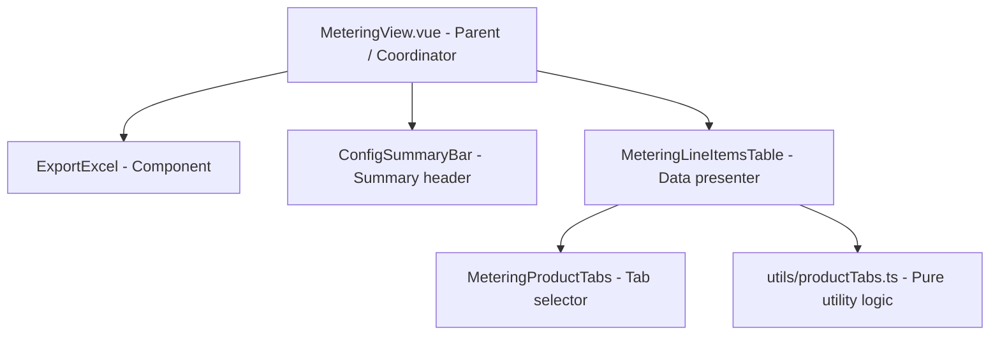

# PR 3304: Building the Metering Feature Frontend Component Architecture

This document is a beginner-friendly guide summarizing Pull Request [#3304](https://github.com/Maersk-Global/isce-cp-ui/pull/3304) in the `isce-cp-ui` repository. It walks through how the developers built and integrated presentational components, product tabs, and a paginated table for the billing/metering interface.

---

## 💡 1. The "Restaurant Bill" Analogy

To understand what this Pull Request builds, let's look at it through a simple analogy:

Imagine you run a logistics company and need to show customers their complex billing data (called "metering line items") for different types of shipping products (e.g., Ocean transport, Inland transport). 

* **The Tabs (`MeteringProductTabs.vue`):** Like a folder with tabs labeled "Ocean", "Air", "Land". Clicking a tab filters the long list of bills so the customer only sees what they are interested in.
* **The Table (`MeteringLineItemsTable.vue`):** Like a clean invoice layout with columns for *Service Date*, *Item Name*, *Quantity*, *Price*, and *Contract Status*.
* **The Orchestrator (`MeteringView.vue`):** The manager who checks: *"Has the user selected their date range and clicked 'Generate'? If yes, fetch the data, show the tabs and table, and enable the 'Download to Excel' button."*

---

## 🏗️ 2. Architectural Design: Component Structure



### Component Breakdown & File Index

| File | Component / Purpose | What does it do? |
| :--- | :--- | :--- |
| [MeteringView.vue](file:///Users/rohit.kumar.4/Documents/interview-prep/src/views/MeteringView/MeteringView.vue) | **The View Orchestrator** | Coordinates the global store state (via Pinia), maps config criteria (date ranges, SCV customer codes), and dynamically renders children. |
| [MeteringLineItemsTable.vue](file:///Users/rohit.kumar.4/Documents/interview-prep/src/features/metering/components/MeteringLineItemsTable/MeteringLineItemsTable.vue) | **The Data Table** | Displays the grid of rows, handles column definitions, and renders loading, empty, and error views. |
| [MeteringProductTabs.vue](file:///Users/rohit.kumar.4/Documents/interview-prep/src/features/metering/components/MeteringProductTabs/MeteringProductTabs.vue) | **Product Category Tabs** | A presentational component displaying the list of tabs, including counts for each product. |
| [utils/productTabs.ts](file:///Users/rohit.kumar.4/Documents/interview-prep/src/features/metering/utils/productTabs.ts) | **Business Logic Helper** | Pure TypeScript file holding the utility functions to calculate colors, labels, and badges for different tab configurations. |

---

## 🛠️ 3. Explaining the Code Improvements (The "Why")

### 1. Separation of Concerns (Dumb vs. Smart Components)
Instead of writing a single huge `MeteringView.vue` file that queries databases, manages filters, sets up layout styles, and formats tables, the developers split it:
* **Smart Component (`MeteringView.vue`):** Communicates with Pinia (global store) and controls *when* to fetch data and *when* to show UI.
* **Dumb Components (`MeteringLineItemsTable.vue` & `MeteringProductTabs.vue`):** Do not talk to store databases. They simply receive data via `props` and show them. This makes them highly reusable and easy to test.

### 2. Move Logic Out of Vue Files (Pure Utilities)
In [productTabs.ts](file:///Users/rohit.kumar.4/Documents/interview-prep/src/features/metering/utils/productTabs.ts), functions like determining tab badge styling classes or counting items are isolated:
```typescript
// Example of clean utility function separated from UI rendering
export function getTabBadgeColor(contractType: string): string {
  if (contractType === 'standard') return 'badge--neutral';
  return 'badge--primary';
}
```
* **Why this is good:** Testing a pure TypeScript function doesn't require compiling a browser view. It runs in microseconds, making unit tests fast and maintainable.

### 3. Integrated "Export Excel" Action
The PR updates the page header to render an `<isce-export-excel>` download button.
* When the app configuration is in configuration mode (`isGenerating: false`), the export button is disabled.
* Once the reports load (`isGenerating: true`), the button is enabled and calls a custom composable `useGenerateReport().downloadReport(fileName)` when clicked.

---

## 📚 4. Explaining the Frontend Test Suite

For every new feature, this PR introduces equivalent Vue Test Utils (`*.spec.ts`) files to ensure nothing breaks in production:

* **Checking Loading and Empty States:** Tests mock slow API delays to check that loading animations are shown, and empty message screens display when 0 billing items are returned.
* **Mocking Store Dependencies:** Rather than building a real Vue app with state stores, `createTestingPinia()` is used to simulate user actions (like toggling config states) in isolation.
* **Checking Button Triggers:** Tests programmatically simulate clicking the Excel download button and verify that the correct API download call (`downloadReport`) is executed.
