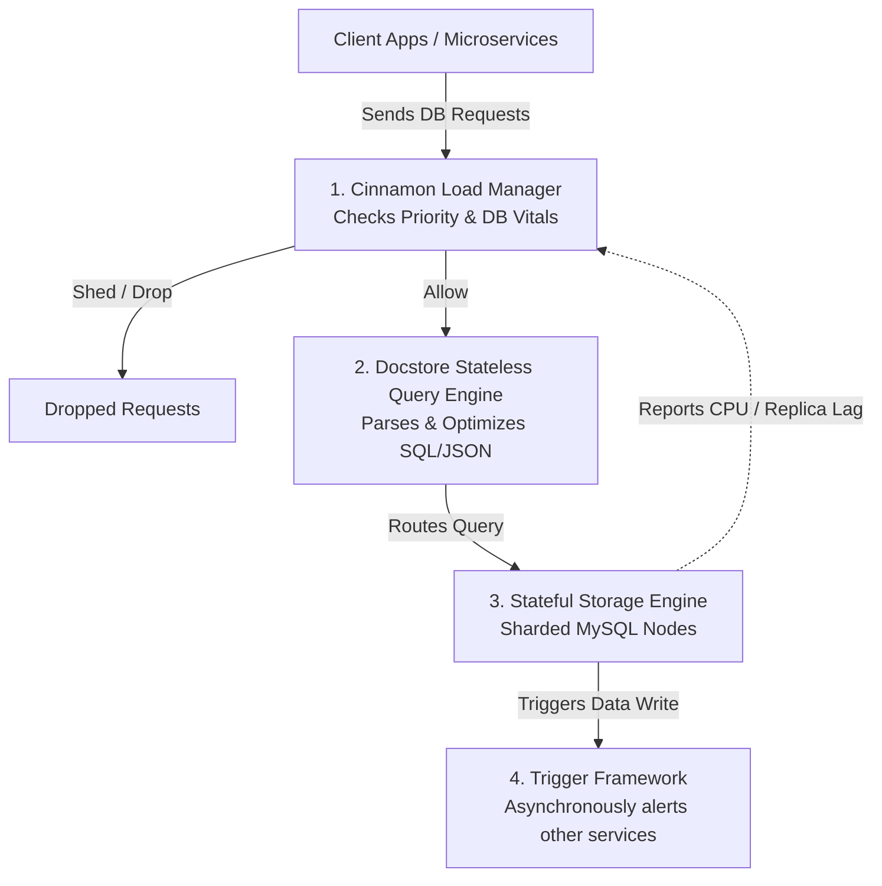
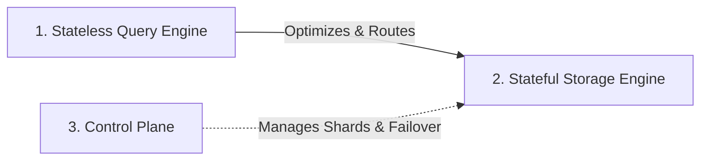

# Uber's Database & Load Management Architecture: The Unified Master Guide

This guide compiles and synthesizes Uber's entire engineering evolution across three major database and traffic infrastructure topics:
1. **Schemaless:** The custom-built sharded MySQL datastore (Parts 1, 2, and 3).
2. **Docstore:** The evolution of Schemaless into a modern distributed SQL database.
3. **Cinnamon (Intelligent Load Management):** The adaptive load-shedder protecting these datastores from outages.

Designed for beginners (noobs), this document explains how these systems fit together to keep Uber running seamlessly at massive scale.

---

## 🗺️ The Big Picture: How They Fit Together
Before diving into details, here is how a request flows through Uber's database and load management layer:



---

## 📦 Part 1: Schemaless (The Storage Foundation)
In 2014, Uber outgrew PostgreSQL for trip data. Instead of using off-the-shelf NoSQL options, they built **Schemaless** on top of **MySQL**.

### 1. The 3D Data Model
Unlike a normal 2D table, Schemaless stores data as a 3D hash map:
```
Row Key (UUID) ➡️ Column Name (string) ➡️ Ref Key (integer version) ➡️ Cell (JSON Blob)
```
* **Row Key:** Unique ID for a trip.
* **Column Name:** Categorized data partitions (e.g., `BASE` for trip info, `STATUS` for billing, `NOTES` for ratings). Splitting data into columns prevents write conflicts when different services update the same trip simultaneously.
* **Ref Key (Immutability):** Cells can **never** be edited or deleted. Updates are written as new cells with an incremented `ref_key`. The cell with the highest `ref_key` represents the newest state.

### 2. Disk Architecture & Sharding (How it is saved on servers)
Under the hood, Schemaless is not a new database engine. It is simply a cluster of standard MySQL databases.
* **The MySQL Table:** In each database shard, cells are saved in a normal SQL table with columns: `added_id` (auto-incrementing integer), `row_key` (Trip ID), `column_name`, `ref_key` (version), and `body` (JSON content compressed using **MessagePack** and **Zlib**).
* **Sequential Disk Writes:** The `added_id` primary key forces MySQL to write new data in a continuous line on disk (sequential I/O), which is much faster than jumping around looking for empty sectors.
* **Sharding:** If Uber has 100 MySQL servers, a stateless API worker hashes the Trip UUID (e.g. $\text{Hash}(\text{trip\_id}) \pmod{100}$) to compute the shard number. The write request is routed directly to that specific MySQL database server, allowing the cluster to scale horizontally.

### 3. Eventually Consistent Secondary Indexes
If you want to find all trips driven by a specific driver, you cannot search by Trip ID (Row Key). You need a **Secondary Index** (which maps a `driver_partner_uuid` to a list of `trip_uuids`).

Because Schemaless is sharded across servers:
* **Server A (Primary Shard):** Stores the actual trip details (e.g. `trip_uuid_999`).
* **Server B (Index Shard):** Stores the index list for `driver_bob_123`.

To keep writes extremely fast and avoid waiting for both servers to coordinate (which would require slow Two-Phase Commit transactions), Schemaless writes the primary data to Server A instantly, and copies it to Server B in the background.

#### 🎬 Step-by-Step Example of Index Lag:
Imagine Driver Bob finishes a trip at exactly **12:00:00.000**.
* **12:00:00.000:** The app writes the trip `trip_uuid_999` to the primary table on **Server A**. Write is confirmed!
* **12:00:00.005:** Bob opens his "Trip History" app screen. The app queries the index table on **Server B** for Bob's trips. 
  * ❌ **Result:** The trip does NOT show up yet because Server B hasn't been updated. (This is the consistency gap).
* **12:00:00.015:** The background worker writes the mapping (Bob ➔ `trip_uuid_999`) to the index table on **Server B**.
* **12:00:00.020:** Bob refreshes his app. 
  * ✅ **Result:** The trip shows up. The index is now consistent!

### 4. Triggers (Asynchronous Event Bus)
Triggers act like a built-in event bus (Change Data Capture / CDC):
* When a cell is written to the `BASE` column, the trigger service notices it by reading from a **MySQL replica** (which shields the master node from load).
* It starts a background task to process billing, then writes the result back into the `STATUS` column.
* **Fault Tolerance:** The trigger framework saves the progress offset (`added_id`) for each database shard inside **Zookeeper**. If a trigger server crashes, a new one reads the offset from Zookeeper and picks up exactly where it left off, guaranteeing **at-least-once** event execution.

---

## 🛠️ Part 2: Evolving to Docstore (Distributed SQL)
As Uber grew, Schemaless hit limits: append-only models caused storage bloat, schemas weren't validated at the database level, and multi-row transactions were impossible. This led to the creation of **Docstore**.

Docstore decoupled its operations into a **3-tier architecture**:



1. **Stateless Query Engine Layer:**
   Receives and parses SQL/JSON queries, optimizes execution plans, and routes requests to the correct shards. 
   * **Where Joins/Merges Happen:** Because the physical database shards are completely isolated from each other (e.g., Server 10 doesn't know Server 20 exists), they cannot join or merge data across nodes. Instead, the Query Engine queries the shards in parallel, pulls the raw results back to the Query Engine layer, and performs the **Join, Merge, or Sort** operations inside its own stateless memory before returning the final result to the client.
2. **Stateful Storage Engine Layer:**
   Manages horizontal data sharding across MySQL instances. It supports **mutable writes** (updates in place to save storage) and partition-level **ACID transactions** (guaranteeing strict consistency).
   * **Raft consensus replication:** Each data shard is replicated across 3 nodes in different regions. They run the **Raft protocol**, meaning writes are replicated to follower nodes and only committed once a majority quorum (2 out of 3) confirm they wrote the transaction log.
3. **Control Plane:**
   The orchestrator that monitors node health. If a database server goes offline, it automatically promotes a backup and shifts partitions (shards) without disrupting the application.

---

### 🔄 The Zero-Downtime Migration Strategy
To migrate data from the old Schemaless to Docstore without taking down the active apps, Uber used a **4-Phase Migration Pattern**:
1. **Shadow Writes (Dual Writes):** App writes all new incoming data to both Schemaless and Docstore simultaneously, but reads from the old database.
2. **Backfill:** Background jobs (via Spark) copy historical data from Schemaless to Docstore.
3. **Verification:** A comparison engine cross-checks and corrects data discrepancies.
4. **Cutover:** Reads are redirected to Docstore, and writes to Schemaless are stopped.

---

## 🚦 Part 3: Cinnamon (Intelligent Load Management)
Docstore and Schemaless are **multi-tenant databases** shared by thousands of microservices. If an unoptimized query (e.g. generating an email report) consumes all database CPU, it blocks critical user-facing requests (like booking a ride). 

Uber built **Cinnamon** to protect these databases from overload using three smart concepts:

### 1. Priority Propagation (The VIP System)
Every request passing through Uber carries a priority tier (Tiers 0 to 5) in its header context:
* **Tier 0:** Critical user actions (booking a ride, billing a trip).
* **Tier 5:** Non-urgent background operations (generating reports, syncing user analytics).

When database CPU or replica lag spikes, Cinnamon automatically sheds Tier 5 requests first, keeping the database perfectly healthy for Tier 0 requests.

### 2. Concurrency Auto-Tuning (TCP-Vegas)
Instead of hardcoding a limit on queries-per-second (QPS), Cinnamon regulates **Concurrency** (the number of active queries running in-flight at any microsecond). It uses a modified **TCP-Vegas** algorithm to dynamically shrink or expand this limit:
* If database query latency rises ➡️ TCP-Vegas reduces the concurrency limit to allow the database to catch up.
* If latency is low and stable ➡️ TCP-Vegas slowly raises the limit to maximize performance.

### 3. Smooth Shedding (The PID Controller)
A **PID (Proportional-Integral-Derivative) controller** acts like a car's cruise control. Instead of aggressively cutting off all traffic when database load spikes (which causes the system to bounce between over-throttling and overloading), Cinnamon calculates a smooth, floating **rejection ratio** (e.g., *"Drop exactly 12% of Tier 4 traffic right now"*).

---

## 🔗 The Unified Loop: How They Cooperate

```
   [Microservice sends a Query]
                │
                ▼
   [Cinnamon evaluates DB Vitals] 
   (Reads CPU, Memory, Replica Lag from Docstore/Schemaless Partition)
                │
        ┌───────┴───────┐
        ▼               ▼
   [DB Is Healthy]  [DB Is Congested]
        │               │
        │               ├─► [Drop Low-Priority Tiers 4 & 5]
        │               │
        ▼               ▼
   [Query Engine executes on Docstore/Schemaless MySQL sharded node]
                │
                ▼
   [Trigger Framework asynchronously fires billing, ratings, etc.]
```

### Real-World Outcomes
By wrapping **Docstore/Schemaless** with **Cinnamon**, Uber achieved:
* 🚀 **80% Higher Throughput** during overload periods because the database is protected from useless queue buildup.
* 📉 **~70% Reduction in P99 Latency** by smoothing out queue delays.
* ⚙️ **~93% Fewer Goroutines** under stress, dramatically reducing server memory usage.
* 🧑‍💻 **No Manual Tuning:** The system automatically protects itself without developers needing to guess and configure limits.
