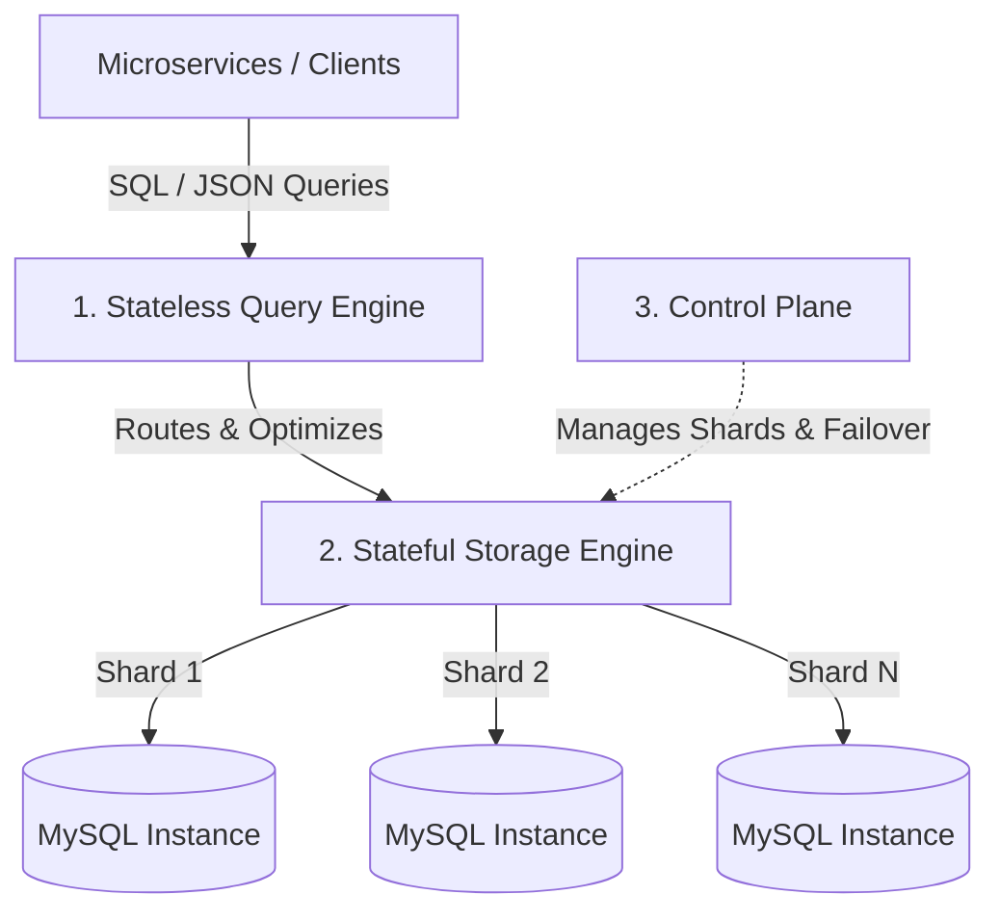
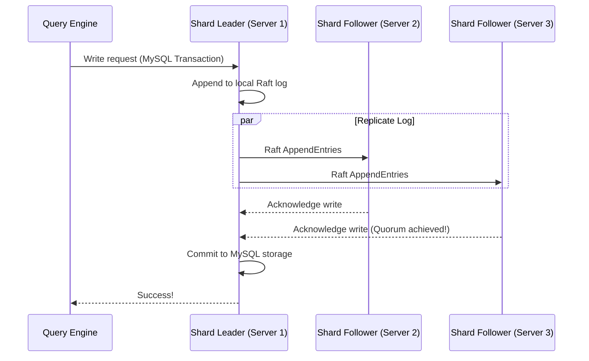

# Evolving Schemaless into a Distributed SQL Database (Docstore)

This document breaks down Uber's engineering blog post: **"Evolving Schemaless into a Distributed SQL Database"**.

It explains the "why" and "how" of Uber's transition from the original key-value Schemaless datastore to **Docstore**, a modern, multi-model distributed SQL database built on top of MySQL.

---

## ❓ The Problem: Why did Schemaless need to evolve?

While the original **Schemaless** was great for scaling Uber's early trip data, it had major limitations as the platform matured:

1. **Storage Inefficiency (Append-Only Overhead):** 
   Because Schemaless cells were strictly immutable, every single update required appending a new cell. For tables with high update rates, this led to massive database growth and wasted disk space (storing hundreds of historical versions of the same row).
2. **Lack of Schema Enforcement:** 
   Schemaless accepted any JSON blob. If a developer introduced a bug that wrote a malformed JSON field, the database wouldn't catch it. The "schema" was managed entirely in application code, which became messy with hundreds of microservices.
3. **No Database-Level Transactions:** 
   Schemaless did not support multi-row transactions or ACID compliance across different rows/shards.
4. **Poor Querying Flexibility:**
   Developers had to pre-define and manage secondary indexes manually. They couldn't run ad-hoc SQL-like queries.

---

## 🛠️ The Solution: Docstore

To solve these issues, Uber engineered **Docstore**, a multi-model distributed SQL database. Under the hood, Docstore still uses MySQL for persistence, but it wraps it in a much more powerful architecture.



---

## 🏗️ The 3-Tier Architecture of Docstore

Docstore divides its operations into three decoupled layers:

### 1. Stateless Query Engine Layer
* **What it is:** A stateless service that acts as the entry point for all database queries.
* **What it does:** It receives SQL/document queries from clients, parses them, optimizes the execution plan, and routes them to the correct storage nodes.
* **Why it's stateless:** Since it doesn't store data, Uber can scale this layer up or down instantly based on CPU demand without moving any files.

### 2. Stateful Storage Engine Layer
* **What it is:** The layer that actually stores the data on disk.
* **What it does:** It partitions (shards) data horizontally across multiple MySQL instances. 
* **Key Improvements over Schemaless:**
  * Supports **mutable data** (allows updates in place to save storage).
  * Provides **partition-level ACID transactions** and strict consistency (serializability), preventing data corruption during simultaneous writes.

### 3. The Control Plane
* **What it is:** The orchestrator / brain of the system.
* **What it does:** It monitors the health of all database nodes. If a MySQL instance dies, the Control Plane automatically promotes a backup replica and reassigns the shards (partitions) to ensure zero downtime.

---

## 🌟 Key Features: Best of Both Worlds

Docstore combines the horizontal scalability of NoSQL databases (like Cassandra) with the safety of SQL databases:

* **Schema Flexibility & Enforcement:** Developers can define strict schemas for critical fields (like `trip_id` or `price`) while leaving a column open as a flexible JSON object for metadata that changes frequently.
* **Strong Consistency:** Unlike eventual consistency models where reads might return old data, Docstore guarantees that you always read the absolute latest write.
* **Advanced Features:** It natively supports transactions, materialized views (caches of query results), and Change Data Capture (CDC) via triggers.

---

## ⚙️ How Docstore Works Under the Hood (The Mechanics)

If Docstore runs on standard MySQL nodes, how does it offer distributed SQL, strong consistency, and high availability?

### 1. Translating SQL & Doing Joins: Where does it happen?
When a client sends a SQL query that spans multiple shards (e.g., `SELECT * FROM users WHERE city = 'SF'`):

1. **Parsing:** The stateless **Query Engine** parses and compiles the SQL query.
2. **Scatter (Querying the Shards):** 
   * The individual database servers (**Stateful Storage Engine**) are completely isolated. Server 10 does not know Server 20 exists, so Server 10 cannot join or merge data from Server 20.
   * Instead, the **Query Engine** sends parallel queries to Server 10, Server 20, and Server 30.
3. **Gather (Merging the results):**
   * Server 10, 20, and 30 run queries locally on their own databases and return separate lists of users to the **Query Engine**.
   * The **Query Engine** performs the **Merge / Join** inside its own memory, assembling the separate chunks into one final sorted result list, and sends it back to the client.

#### 🧮 How Joins are handled:
* **Colocated Joins (Fast):** If Table A (users) and Table B (trips) are sharded by the *same* key (e.g., `user_uuid`), then User A and their Trips are stored on the **same physical server** (Server 42). The Query Engine routes the join request to Server 42, and Server 42's local MySQL engine performs the join locally.
* **Distributed Joins (Slow):** If the tables are sharded by different keys, the Query Engine must query Server A to get the users, query Server B to get the trips, pull all of that data into the Query Engine, and perform the join operation in its own memory. This is highly CPU and memory intensive.

### 2. High Availability via the Raft Consensus Protocol
To prevent data loss and ensure 100% availability during database crashes:
* **The Partition Group:** Each data partition (shard) is replicated across 3 physical MySQL nodes (usually placed in different geographic regions).
* **Raft Quorum:** These 3 nodes run the **Raft Consensus Protocol**. One node is elected the Leader, and the others are Followers.
* **Consensus Writes:** When a write comes in, the Leader replicates the MySQL transaction log to the Followers. The write is only marked as "committed" once a majority (2 out of 3 nodes) confirm they have written it. If the Leader crashes, Raft automatically elects a new Leader within milliseconds.



---

## 🔄 The Zero-Downtime Migration Strategy
How did Uber migrate petabytes of live data from Schemaless to Docstore without taking down the app? They used a **4-Phase Migration Pattern**:

```
[Phase 1: Dual Writes] ──► [Phase 2: Backfilling] ──► [Phase 3: Verification] ──► [Phase 4: Cutover]
```

1. **Phase 1: Shadow Writing (Dual Writes):**
   The application is updated to write all *new* incoming data to **both** Schemaless and Docstore simultaneously. However, the app still reads only from the old Schemaless database.
2. **Phase 2: Historical Backfilling:**
   A background batch job (using Apache Spark) runs to copy all historical data (everything written before Phase 1 started) from Schemaless to Docstore.
3. **Phase 3: Verification (Data Checking):**
   A background checking service compares records between both systems. If it finds any mismatch, it fixes it in Docstore. This phase runs until they achieve 100% data parity.
4. **Phase 4: Read Cutover:**
   The read source is flipped in configuration to Docstore. Writes to Schemaless are stopped, and the old system is decommissioned.

---

## 📊 Quick Summary: Schemaless vs. Docstore

| Feature | Original Schemaless (2016) | Docstore (Modern) |
| :--- | :--- | :--- |
| **Write Model** | Append-Only (High storage overhead) | Mutable / In-place updates |
| **Schema Validation** | ❌ None (handled by application) | Schema-on-write (validated by DB) |
| **Replication Protocol** | Asynchronous Master-Replica | Raft Consensus Protocol |
| **Consistency** | Eventual consistency for indexes | Strict serializable consistency |
| **Queries** | Simple Key-Value + manual indexes | Distributed SQL & Document API |
| **Underlying Engine** | MySQL | MySQL (via MyRocks) |
