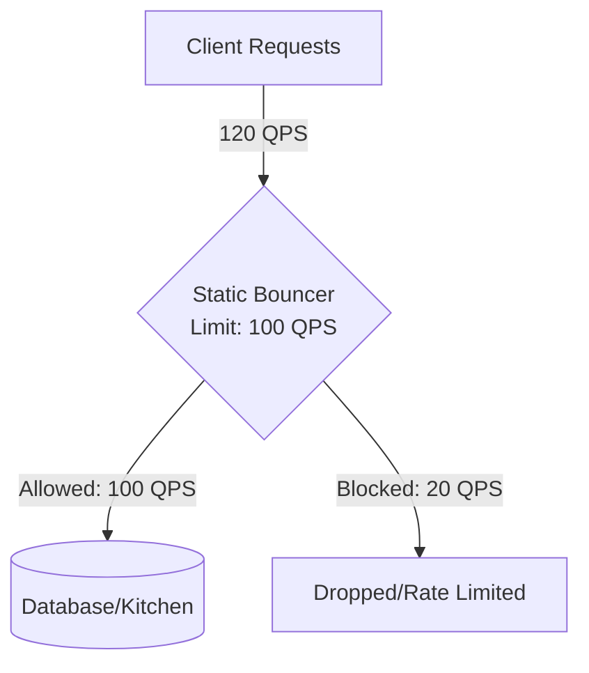
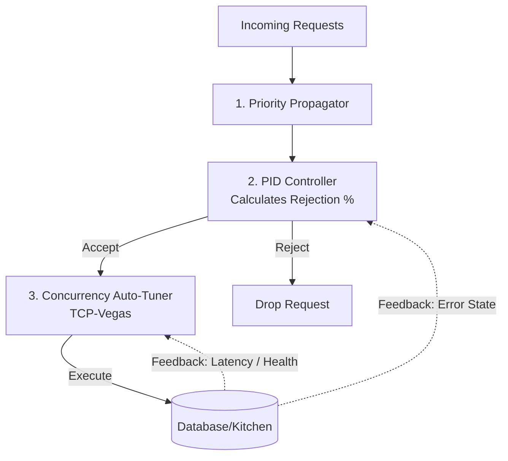

# Uber's Journey: From Static Rate-Limiting to Intelligent Load Management

This document breaks down Uber's engineering blog post: **"How Uber Conquered Database Overload: The Journey from Static Rate-Limiting to Intelligent Load Management"**. 

It is written specifically for beginners (noobs), using simple analogies, visual diagrams, and clear explanations of complex control-system concepts (like PID and TCP-Vegas).

---

## 🍽️ The Core Analogy: The Overloaded Restaurant
To understand database load management, imagine a popular restaurant:
* **The Database** is the **Kitchen**. It has a fixed number of chefs and stoves.
* **Incoming Queries (Requests)** are **Customers ordering food**.
* **Database Capacity** is **how many dishes the kitchen can cook per minute**.

If 10 customers arrive per minute, the kitchen handles it easily. If 1,000 customers suddenly rush in, the kitchen is overwhelmed: order tickets pile up, chefs get confused, food burns, and wait times skyrocket. In software, this is a **database overload**, leading to **high latencies**, **timeouts**, and **system crashes**.

---

## 🚦 Phase 1: Static Rate-Limiting (The Old Way)

The simplest way to protect the kitchen is to put a **bouncer at the door** with a strict rule: *"Only 100 customers are allowed in per hour."* This is **Static Rate-Limiting** (usually measured in QPS - Queries Per Second).

### ❌ Why Static Rate-Limiting Fails (For Databases)
1. **Not all requests are equal:** 100 customers ordering tap water (cheap read queries) is easy. 10 customers ordering a complex 7-course buffet (heavy database write/join queries) will burn the kitchen down. A static request count doesn't know the difference.
2. **Capacity is not constant:** If a chef is sick or the stove breaks (e.g., database replica lag, CPU throttling), the kitchen's capacity drops to 50. The bouncer, still letting 100 people in, will cause a crash. Conversely, if the kitchen is upgraded, the bouncer will unnecessarily block paying customers.
3. **It's blind to priority:** If the restaurant is full of people just drinking free water (low-priority batch sync jobs), the bouncer will turn away a VIP food critic who wants to pay $500 for a meal (a high-priority customer booking a ride).

---

## ⏱️ Phase 2: Controlled Delay (CoDel) & QALM (The Stepping Stone)

To fix the static limit problem, Uber tried **CoDel (Controlled Delay)** queues inside a framework called **QALM**. 

Instead of a bouncer counting people, the bouncer now stands inside the kitchen and monitors a **stopwatch**.
* The bouncer measures **Sojourn Time (Queuing Delay)**: *How long does a customer's order ticket sit on the counter before a chef actually starts cooking it?*
* If tickets sit on the counter for too long (e.g., more than 5 milliseconds), the bouncer starts throwing new tickets into the trash (shedding load) until the delay goes back down.

### ❌ Why CoDel Alone Failed
1. **The "Thundering Herd" Rollercoaster (Oscillation):** 
   CoDel was too abrupt. When delay crossed the threshold, it would drop traffic aggressively. The queue would empty instantly, and the bouncer would stop dropping traffic. Suddenly, a new massive wave of traffic would enter, causing the queue to spike again. This created a constant cycle of over-shedding and over-loading.
2. **Priority-Agnostic:** It still threw random tickets in the trash without checking if it was a critical order or a simple request for water.

---

## 🧠 Phase 3: Cinnamon & Intelligent Load Management (The Modern Way)

To build a resilient database protection system, Uber created **Cinnamon**—a configuration-free, smart load-shedding system. Cinnamon uses three core principles to manage load intelligently:

---

### 🔑 Core Principle 1: Priority Propagation (The VIP System)
Cinnamon tags every request with a priority tier (from Tier 0 to Tier 5) using distributed tracing context.
* **Tier 0 (VIPs):** Critical user actions (e.g., booking a ride, checking out).
* **Tier 5 (Regulars):** Background tasks (e.g., offline data syncing, sending promo emails).

When the database starts experiencing pain, Cinnamon does not drop traffic randomly. It starts dropping Tier 5 requests first. If the pain continues, it drops Tier 4, and so on. **Tier 0 is protected at all costs.**

---

### 🔑 Core Principle 2: Concurrency Limiting (Little's Law)
Instead of restricting QPS (Queries Per Second), Cinnamon limits **Concurrency** (the number of requests actively being processed in-flight at any single microsecond). 

> [!NOTE]
> **Little's Law:** $\text{Concurrency} = \text{Throughput} \times \text{Latency}$
> 
> If a kitchen takes 10 minutes to make a dish (Latency) and can serve 2 customers per minute (Throughput), it must have at least 20 dishes cooking simultaneously (Concurrency).

To find the perfect concurrency limit without manual tuning, Cinnamon uses a modified **TCP-Vegas** algorithm:
* It continuously measures the **RTT (Round Trip Time / Latency)** of queries.
* If latency starts rising, it means a queue is forming inside the database. TCP-Vegas immediately **reduces the concurrency limit** to let the database catch up.
* If latency is stable and low, it **slowly increases the limit** to maximize database utilization.

---

### 🔑 Core Principle 3: The PID Controller (Smooth Bypasses)
A **PID (Proportional-Integral-Derivative) controller** is a mathematical formula used in engineering to keep a system stable. 
* *Everyday Example:* The cruise control in your car. If you set it to 60 mph, it doesn't slam the gas pedal down when you go 59 mph and slam the brakes at 61 mph. It applies a smooth, gradual throttle adjustment to stay exactly at 60 mph.

Instead of dropping 100% of traffic when a limit is hit, Cinnamon's PID controller calculates a precise, floating **rejection ratio** (e.g., *"Drop exactly 14.5% of Tier 4 traffic right now"*). This prevents the thundering herd oscillation and keeps database latency incredibly flat.

---

## 📊 Summary Comparison: Old vs. New

| Feature | Static Rate-Limiting (Old) | Cinnamon Load Management (New) |
| :--- | :--- | :--- |
| **Control Signal** | Requests Per Second (QPS) | Latency, Concurrency, CPU, Memory, Replica Lag |
| **Priority Aware?** | ❌ No (all clients throttled equally) |  Yes (Tier-based dropping) |
| **How limits are set** | ✍️ Manually guessed and hardcoded | 🤖 Auto-tuned dynamically based on performance |
| **System Behavior** | 📉 Hard cutoff; prone to outages | 📈 Smooth degradation; highly stable |

---

## 🔗 How Docstore/Schemaless and Load Management Connect

You might wonder: *How do these databases relate to Cinnamon's Load Management?*

1. **The Multi-Tenant Problem:**
   Both Docstore and Schemaless are **multi-tenant databases**. This means hundreds of different Uber microservices (from Billing, Maps, Rider app, Driver app, to Promo Emails) all share the *same* database infrastructure.
2. **The "Noisy Neighbor" Danger:**
   If a developer runs a heavy, unoptimized query on Schemaless to generate an offline report (low priority), it might max out the database CPU. Without load management, this "noisy neighbor" would slow down the database for *everyone*, meaning a user trying to book a ride (high priority) would experience timeouts.
3. **Cinnamon to the Rescue:**
   Cinnamon acts as the shield directly in front of Docstore and Schemaless partitions. It monitors the database's live health signals (like **follower replication lag** and **CPU/Memory utilization**).
   * **Under normal conditions:** All services read and write to the database freely.
   * **Under overload conditions:** Cinnamon automatically sheds low-priority traffic (like ratings or promos) and preserves 100% of the database's capacity for high-priority traffic (like ride-booking transactions).

---

## 🏆 Real-World Results at Uber
By letting the databases protect themselves using Cinnamon's intelligent load management rather than static external rate limits, Uber achieved:

* 🚀 **80% Higher Throughput** under heavy overload (the database spent its time doing real work instead of processing queries that would time out anyway).
* 📉 **~70% Reduction in P99 Latency** (queries no longer sat in long, congested queues).
* ⚙️ **~93% Fewer Goroutines** (drastically reduced system memory usage and context switching).
* 🧑‍💻 **Zero Manual Configuration:** Developers no longer spend hours trying to guess and configure QPS limits for thousands of individual microservices.
