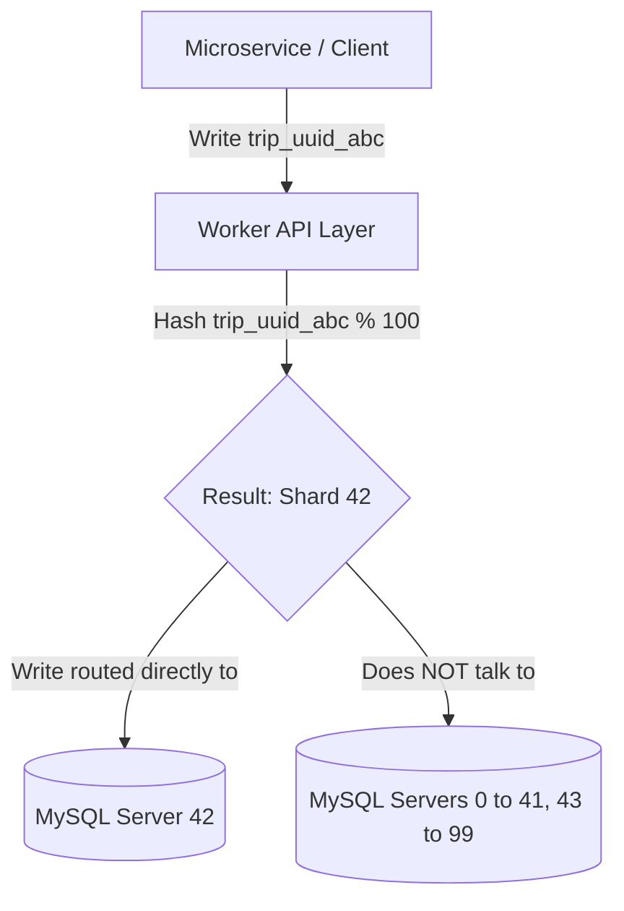

# Uber's Schemaless Datastore: The Complete Guide (Parts 1, 2, & 3)

This document is a comprehensive, beginner-friendly guide covering Uber's **Schemaless** datastore engineering blog series. It explains why it was built, how data is physically saved on disk, its sharded architecture, and its trigger event framework.

---

## 💡 1. Quick Start: How Data is Saved (The Trip Example)
To understand the database layout, let's look at a concrete story of a single Uber ride taken by **Alice** with driver **Bob** (`trip_uuid_999`).

### Step 1: The Ride Completes (Base Details)
The ride ends. Uber's system writes the base trip details into the `BASE` column:
* **Row Key (ID):** `trip_uuid_999`
* **Column (Category):** `BASE`
* **Ref Key (Version):** `1`
* **JSON Value:**
  ```json
  {
    "rider_id": "rider_alice",
    "driver_id": "driver_bob",
    "fare": 25.00,
    "city": "San Francisco"
  }
  ```

### Step 2: Billing Fails (Attempt 1)
The write to the `BASE` column automatically triggers a billing service. The charge fails due to insufficient funds, which is written to the `STATUS` column:
* **Row Key:** `trip_uuid_999`
* **Column:** `STATUS`
* **Ref Key:** `1`
* **JSON Value:**
  ```json
  {
    "status": "billing_failed",
    "reason": "insufficient_funds",
    "attempt": 1
  }
  ```

### Step 3: Billing Succeeds (Attempt 2)
The billing service charges Alice's backup card. This charge succeeds. Because the datastore is **append-only**, it does **not** overwrite the failed attempt. It appends a new version with an incremented version number (`ref_key`):
* **Row Key:** `trip_uuid_999`
* **Column:** `STATUS`
* **Ref Key:** `2`
* **JSON Value:**
  ```json
  {
    "status": "payment_success",
    "transaction_id": "tx_abc123",
    "attempt": 2
  }
  ```

### Step 4: Alice Rates Bob
Alice opens the app later and leaves feedback. The ratings service writes to the `NOTES` column:
* **Row Key:** `trip_uuid_999`
* **Column:** `NOTES`
* **Ref Key:** `1`
* **JSON Value:**
  ```json
  {
    "rating": 5,
    "comment": "Bob was a great driver!"
  }
  ```

### 📊 What the Database Table Looks Like Now:

| Row Key (UUID) | Column Name (Category) | Ref Key (Version) | Cell Value (JSON Blob) |
| :--- | :--- | :--- | :--- |
| `trip_uuid_999` | `BASE` | **1** | `{"rider_id": "rider_alice", "driver_id": "driver_bob", "fare": 25.00...}` |
| `trip_uuid_999` | `STATUS` | **1** | `{"status": "billing_failed", "reason": "insufficient_funds"...}` |
| `trip_uuid_999` | `STATUS` | **2** | `{"status": "payment_success", "transaction_id": "tx_abc123"...}` |
| `trip_uuid_999` | `NOTES` | **1** | `{"rating": 5, "comment": "Bob was a great driver..."}` |

#### 🔑 Key Takeaways from the Data Layout
1. **Immutability (No Overwrites):** History is never lost. The failed billing attempt is kept right next to the successful attempt.
2. **Current State:** When querying the `STATUS` of a trip, the system looks up the columns for `trip_uuid_999` and returns the cell with the highest `ref_key` (`ref_key: 2`).
3. **No Schema Constraints:** `BASE`, `STATUS`, and `NOTES` contain completely different fields. They are saved as compressed text blobs, allowing developers to change database fields without schema migrations.
4. **No Write Conflicts:** A rating write to `NOTES` and a billing update to `STATUS` can happen at the exact same millisecond without locking tables, because they write to different columns under the same row.

---

## 📦 2. Part 1: Core Concepts & Data Model

### ❓ Why build Schemaless?
In 2014, Uber outgrew PostgreSQL for trip storage. They analyzed Cassandra, MongoDB, and Riak, but decided to build a custom NoSQL datastore on top of MySQL due to:
* **Deep MySQL Experience:** The team knew how to operate and scale MySQL databases.
* **Lossless Writes:** They needed a system that would never lose a write, even during node failures.
* **Triggers:** They wanted to process business-critical code (billing, routing) asynchronously when data changed.

### 🌐 Sparse, 3D Persistent Hash Map
Schemaless structures data as a 3D hash map (Bigtable-like):
* **Row Key (UUID):** Primary identifier for the trip.
* **Column Name (string):** Categorizes variables that change together.
* **Reference Key (integer):** Version number of the data cell.

### 🔍 Eventually Consistent Secondary Indexes
If you want to find all trips driven by a specific driver, looking up by `Row Key` (Trip UUID) is useless because you don't know the Trip UUIDs beforehand. You need a **Secondary Index** (which maps a `driver_partner_uuid` to a list of `trip_uuids`).

#### Why it is "Eventually Consistent" (and how it works):
Because Schemaless is sharded, different pieces of data live on different servers:
* **Server A (Primary Shard):** Stores the actual trip details (e.g. `trip_uuid_999`).
* **Server B (Index Shard):** Stores the index list for `driver_bob_123`.

To save a trip, we must write to the primary table (Server A) and update the index (Server B).
* **Strong Consistency (The Slow Way):** The database forces both Server A and Server B to write the data at the exact same time (using a Two-Phase Commit transaction). If Server B is slow or temporarily down, the entire ride-completion write hangs or fails.
* **Eventual Consistency (The Fast Way):** The ride service writes to Server A, which succeeds instantly. In the background, a worker asynchronously copies that update to Server B to update the index (usually taking less than 20 milliseconds).

---

#### 🎬 Step-by-Step Example of Index Lag:
Imagine Driver Bob finishes a trip at exactly **12:00:00.000**.

```
⏰ 12:00:00.000  ──►  [Primary Table (Server A)] is written successfully.
                      Trip uuid_999 is saved!
                      
⏰ 12:00:00.005  ──►  Bob immediately opens his "Trip History" app screen. 
                      The app queries [Index Table (Server B)] for Bob's trips.
                      ❌ RESULT: The trip does NOT show up yet because Server B 
                      hasn't been updated. (This is the consistency gap).

⏰ 12:00:00.015  ──►  Background worker writes the mapping (Bob ➔ uuid_999) 
                      to [Index Table (Server B)].
                      
⏰ 12:00:00.020  ──►  Bob pulls down to refresh his app.
                      The app queries [Index Table (Server B)] again.
                      ✅ RESULT: The trip shows up. The index is now consistent!
```

---

## 🏗️ 3. Part 2: System Architecture & Physical Storage

The biggest secret of **Schemaless** is that **it is not a new database built from scratch. It is just a collection of standard MySQL databases running on different servers!**

---

### 🗄️ 1. What a Schemaless Table looks like inside MySQL
If you logged into one of Uber's physical MySQL databases, you would see a normal table with a schema like this:

```sql
CREATE TABLE trips_table (
    added_id INT AUTO_INCREMENT PRIMARY KEY,
    row_key VARCHAR(36) NOT NULL,
    column_name VARCHAR(64) NOT NULL,
    ref_key INT NOT NULL,
    body LONGBLOB NOT NULL,
    UNIQUE KEY (row_key, column_name, ref_key)
);
```

#### 🔍 Column Breakdown:
* **`added_id` (The Physical Order):** A simple auto-incrementing number (1, 2, 3...). 
  * *Why it's fast:* Disk drives write data fastest in a straight line (sequential I/O). Using `AUTO_INCREMENT` forces MySQL to append new cells to the end of the file on disk. The drive heads don't have to jump around looking for empty spaces.
* **`row_key`, `column_name`, `ref_key`:** The composite unique index columns. This allows queries to pinpoint any cell version instantly.
* **`body` (The Suitcase):** The JSON data containing trip details. To save disk space, Schemaless packs the JSON text into a tight binary format (using **MessagePack**) and compresses it (using **Zlib**). To MySQL, it is just a compressed binary blob (`LONGBLOB`).

---

### 🔀 2. How Sharding works (How data is split across servers)
Since Uber has billions of trips, they cannot fit on a single database server. Uber shards (splits) the data across multiple MySQL servers (e.g., 100 servers).

#### 🎬 Step-by-Step Write Example:
1. **Rider App** completing a trip sends a request to write `trip_uuid_abc` to the **Worker Layer** (stateless API servers).
2. The worker server calculates which database shard owns this trip using a mathematical hash:
   $$\text{Shard Number} = \text{Hash}(\text{trip\_uuid\_abc}) \pmod{100}$$
3. Let's say the formula outputs **`42`**.
4. The worker node routes the write request directly to **MySQL Server Node 42**.
5. When a client wants to read `trip_uuid_abc`, the worker runs the exact same hash formula, gets **`42`**, and reads from Server 42.



---

### 🔄 3. Master-Replica Division
To handle massive workloads, each MySQL shard consists of:
* **Master Node:** Handles all **Writes** (adding new cells).
* **Replica Nodes:** Handle all **Reads** (queries from the app history). 
* The replicas mirror the master asynchronously, freeing up the master database to focus solely on high-speed writes.

---

## 🔔 4. Part 3: Using Triggers (Event Processing)
Triggers act like a built-in event bus (Change Data Capture / CDC), letting downstream services run code asynchronously when trip columns update.

### ⚙️ How Triggers Work
* **Asynchronous execution:** Triggers do not run inside the database transaction (which would slow down writes). Writes complete instantly on the MySQL master, and the trigger framework pulls updates asynchronously by reading from the **MySQL replicas** (protecting the master from read traffic).
* **Fault-tolerant Offsets (Zookeeper):** The trigger framework tracks the `added_id` of the last successfully processed cell for each database shard. It stores this progress offset in **Zookeeper**. If a worker crashes, the replacement worker reads the offset from Zookeeper and picks up where it left off, guaranteeing **at-least-once** event execution.
* **Shard Locks:** Leader election (via Zookeeper) assigns only a single worker instance to handle a given database shard, preventing duplicate trigger events from firing.
