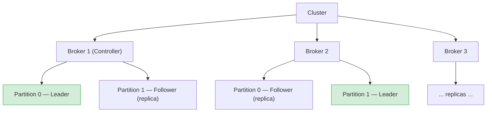
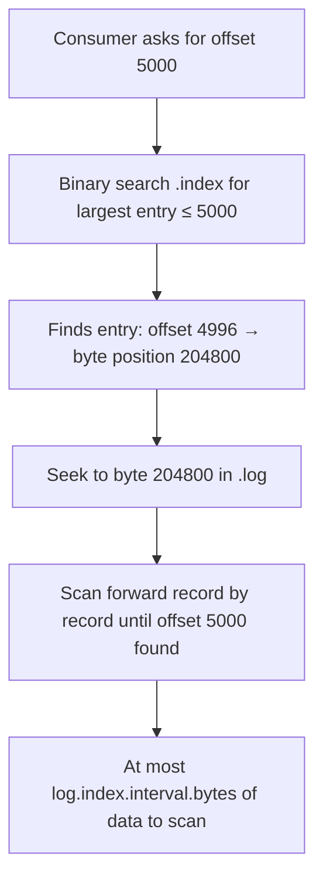
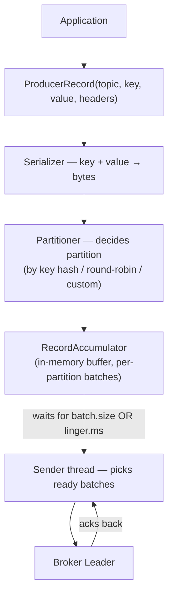
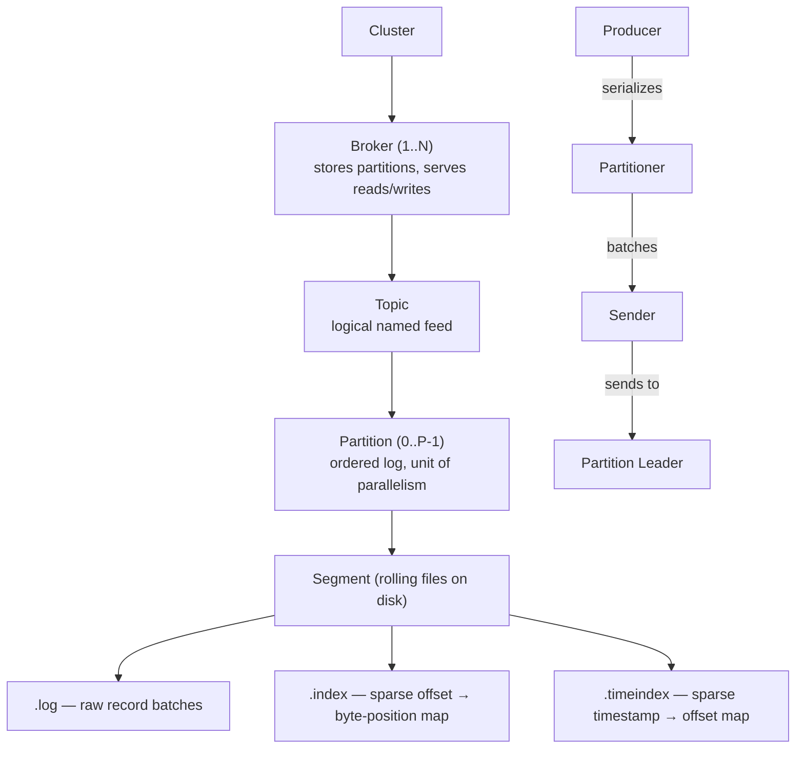

# Kafka — Chapter 1: Core Internals

Topics covered: Broker · Topic · Partition · Segment Log · Index · Producer

---

## 1. Broker

### What
A Kafka **broker** is a single server process that stores data and serves client requests (produce + consume). A cluster is a group of brokers working together. Each broker is identified by a unique integer ID.

### Why
- Horizontal scalability — add brokers to scale storage and throughput independently.
- Fault tolerance — data is replicated across multiple brokers, so losing one broker doesn't lose data.

### How
- One broker per cluster acts as the **Controller** (elected via ZooKeeper or KRaft). It manages partition leadership assignments and handles broker joins/failures.
- Each partition has one **Leader** broker and zero or more **Follower** brokers.
  - Producers and consumers always talk to the **Leader**.
  - Followers replicate from the Leader asynchronously; they form the **ISR (In-Sync Replica)** set.
- If the leader fails, the Controller elects a new leader from the ISR.



### Interview Angles
- **What is ISR?** In-Sync Replicas — followers that are caught up within `replica.lag.time.max.ms`. If a follower falls behind it is removed from ISR. A message is only committed once all ISR replicas have it (when `acks=all`).
- **What happens when a broker goes down?** Controller detects heartbeat timeout → elects a new leader from ISR → updates metadata → clients (after a metadata refresh) start sending to the new leader.
- **Difference between KRaft and ZooKeeper mode?** KRaft (Kafka 3.x default) removes ZooKeeper; cluster metadata is stored in a special internal `__cluster_metadata` topic managed by a quorum of broker-controllers. Simpler ops, faster recovery.

---

## 2. Topic

### What
A **topic** is a named, append-only log (feed) to which producers write and from which consumers read. It is the logical channel for a category of messages (e.g., `order-placed`, `inventory-updated`).

### Why
- Decouples producers from consumers — neither needs to know about the other.
- Multiple consumers can independently read the same topic at their own pace (unlike a queue where a message is consumed once).

### How
- A topic is split into one or more **partitions** (configured at creation time).
- Topic-level configs override broker defaults: `retention.ms`, `retention.bytes`, `cleanup.policy` (`delete` vs `compact`), `replication.factor`.
- **Log compaction** (`cleanup.policy=compact`): Kafka retains only the latest value per key — useful for changelog/event-sourced state topics.

### Interview Angles
- **Can you change the partition count after creation?** You can increase it, never decrease (decreasing would break ordering guarantees for keyed messages — existing keys would land on different partitions).
- **What is `replication.factor`?** How many copies of each partition exist across brokers. Typically 3 in production. Must be ≤ number of brokers.
- **Delete vs Compact?** Delete removes segments older than `retention.ms` or larger than `retention.bytes`. Compact keeps the latest record per key forever (until a `null` tombstone is published to signal deletion).

---

## 3. Partition

### What
A **partition** is the physical unit of storage and parallelism inside a topic. Each partition is an ordered, immutable sequence of records. Records within a partition have a monotonically increasing **offset**.

### Why
- **Parallelism** — different partitions can be written to and read from simultaneously, multiplying throughput linearly with partition count.
- **Ordering guarantee** — Kafka guarantees order only within a single partition, not across partitions. If you need ordered processing for a key (e.g., all events for a user), always route to the same partition using a message key.

### How
- Producer decides the partition by:
  1. Explicit partition in the `ProducerRecord`.
  2. Hash of the message **key** (`murmur2(key) % numPartitions`) — same key → same partition.
  3. Round-robin (or sticky batch) if no key.
- Each partition is stored as a directory on the broker's disk: `<topic>-<partition>/`.
- A partition is divided into **segments** (see §4).
- Partition leadership can move between brokers (reassignment or rebalance).

```
topic: orders   (3 partitions, RF=2)

Partition 0:  [offset 0] [offset 1] [offset 2] ...
Partition 1:  [offset 0] [offset 1] ...
Partition 2:  [offset 0] ...
```

### Interview Angles
- **How many partitions should you use?** Rule of thumb: `max(throughput_needed / throughput_per_partition, num_consumers_in_group)`. More partitions = more parallelism but also more open file handles, more ZooKeeper/KRaft metadata, and longer leader election times.
- **Can all partitions of a topic live on the same broker?** Yes, technically possible, but Kafka's partition assignment algorithm actively distributes them across all brokers in the cluster to balance load. However, a broker can **never** host more than one replica (copy) of the **same** partition (e.g., both the Leader and a Follower of Partition 0). This is a strict constraint to ensure fault tolerance.
- **Why does Kafka only guarantee ordering per partition?** Because records across partitions can be written and read by different threads/brokers with no coordination — there is no global sequence number.
- **What is a partition reassignment?** Moving partition leadership or replicas to different brokers, used for rebalancing load after adding/removing brokers.

---

## 4. Segment Log

### What
A **segment** is a physical file on disk that stores a contiguous range of messages for one partition. A partition's log is split into multiple rolling segment files rather than one giant file.

### Why
- **Efficient deletion** — when `retention.ms` expires, Kafka deletes entire segment files (not individual records), which is an O(1) file delete, not a rewrite.
- **Manageability** — smaller files are easier for the OS to manage (page cache, fsync).

### How
Each segment consists of two files (plus an optional timeindex):

```
<partition-dir>/
  00000000000000000000.log        ← raw message data
  00000000000000000000.index      ← offset index (sparse)
  00000000000000000000.timeindex  ← timestamp index (sparse)
  00000000000000001500.log        ← next segment (starts at offset 1500)
  00000000000000001500.index
  ...
```

- The filename is the **base offset** of the first message in that segment (zero-padded to 20 digits).
- The **active segment** is the one currently being written to; all others are immutable (sealed).
- A new segment is rolled when:
  - Size exceeds `log.segment.bytes` (default 1 GB).
  - Time exceeds `log.roll.ms` / `log.roll.hours` (default 7 days).
  - The index file is full.

Message layout inside `.log` (each record batch):
```
[offset] [size] [CRC] [magic byte] [attributes] [timestamp] [key] [value] [headers]
```

### Interview Angles
- **Why not one file per partition?** Retention/deletion would require scanning and rewriting the file. Rolling segments makes deletion O(1).
- **What triggers a segment roll?** Size (`log.segment.bytes`) or time (`log.roll.ms`) — whichever comes first.
- **What is the active segment?** The only segment open for writes. Sealed segments are immutable and can be memory-mapped for fast reads.

---

## 5. Index (Offset Index & Time Index)

### What
Kafka maintains two sparse index files per segment to enable fast random access into the `.log` file without scanning it linearly.

| File | Key | Value |
|------|-----|-------|
| `.index` | relative offset (4 bytes) | physical byte position in `.log` (4 bytes) |
| `.timeindex` | timestamp (8 bytes) | relative offset (4 bytes) |

**Sparse** means not every offset is indexed — only every `N`th entry (controlled by `log.index.interval.bytes`, default 4 KB written before adding an index entry).

### Why
- Without an index, fetching offset 5 000 000 would require scanning from the start of the `.log` file — O(n).
- With the index, Kafka binary-searches the `.index` file for the nearest offset ≤ target, jumps to that byte position in `.log`, then scans forward a small distance — effectively O(log n) + tiny linear scan.

### How — Lookup flow



Time-based lookup (e.g., `--from-timestamp`):
1. Binary search `.timeindex` for the timestamp → gets a relative offset.
2. Then follow the normal offset lookup above.

### Interview Angles
- **Why is the index sparse?** Trading index size for lookup speed. A full index would be huge; a sparse one keeps index files small (stays in OS page cache) while bounding the linear scan to a small range.
- **What happens if the index is corrupted?** Kafka can rebuild it by replaying the `.log` file — it does this on unclean shutdown recovery.
- **How does Kafka achieve zero-copy reads?** For consumers, Kafka uses `sendfile()` (Linux) — data goes from page cache directly to the network socket without copying to userspace. The index tells Kafka exactly where to start the `sendfile` call.

---

## 6. Producer

### What
A **producer** is a client that publishes records to Kafka topics. It decides which topic and partition to write to, batches records for efficiency, and handles retries.

### Why
- Producers abstract away the complexity of partitioning, batching, compression, and at-least-once / exactly-once delivery from application code.

### How

**Producer internals (high level):**



**Key configs:**

| Config | Default | Effect |
|--------|---------|--------|
| `acks` | `1` | `0`=fire-and-forget, `1`=leader ack, `all`=ISR ack |
| `batch.size` | 16 KB | Max bytes per batch before sending |
| `linger.ms` | 0 | Wait this long to fill a batch before sending |
| `compression.type` | none | `gzip`, `snappy`, `lz4`, `zstd` |
| `retries` | 2147483647 | Auto-retry on retriable errors |
| `enable.idempotence` | true (3.x) | Exactly-once per partition (dedup by sequence number) |
| `max.in.flight.requests.per.connection` | 5 | Concurrent unacked requests; set to 1 for strict ordering without idempotence |

**Delivery semantics:**

> **Note:** `acks` only governs the **producer → broker (write)** side. It says nothing about consumer-side / end-to-end delivery, which depends on offset-commit timing. The labels below describe the producer-write guarantee only.

| Setting | Producer-write guarantee | Risk |
|---------|--------------------------|------|
| `acks=0` | At-most-once | Fire-and-forget — data lost if the send fails or the broker crashes |
| `acks=1` | No guarantee on its own | Leader acks before followers replicate; if the leader crashes before replication the record is **lost** (effectively at-most-once for that record). With retries it can also yield duplicates |
| `acks=all` + `enable.idempotence=true` | Idempotent (no-duplicate) at-least-once **within a single producer session** | Highest latency |

**Idempotent producer** assigns each record a `<ProducerID, SequenceNumber>`. Broker deduplicates retries using this pair — so even if the network drops an ack and the producer retries, the broker writes it only once. This eliminates duplicates **within one producer session** (the PID is reassigned on producer restart). True exactly-once *across* producer restarts requires **transactions** (a stable `transactional.id` + the transaction API), not idempotence alone.

```java
Properties props = new Properties();
props.put(ProducerConfig.BOOTSTRAP_SERVERS_CONFIG, "localhost:9092");
props.put(ProducerConfig.KEY_SERIALIZER_CLASS_CONFIG, StringSerializer.class);
props.put(ProducerConfig.VALUE_SERIALIZER_CLASS_CONFIG, StringSerializer.class);
props.put(ProducerConfig.ACKS_CONFIG, "all");
props.put(ProducerConfig.ENABLE_IDEMPOTENCE_CONFIG, true);
props.put(ProducerConfig.COMPRESSION_TYPE_CONFIG, "snappy");
props.put(ProducerConfig.LINGER_MS_CONFIG, 5);

KafkaProducer<String, String> producer = new KafkaProducer<>(props);

ProducerRecord<String, String> record =
    new ProducerRecord<>("orders", "user-42", "{\"item\":\"book\"}");

// Async with callback
producer.send(record, (metadata, ex) -> {
    if (ex != null) {
        log.error("Send failed", ex);
    } else {
        log.info("Sent to {}-{} @ offset {}",
            metadata.topic(), metadata.partition(), metadata.offset());
    }
});

producer.flush();
producer.close();
```

### Interview Angles
- **What does `linger.ms` do?** Tells the producer to wait up to N ms before sending a batch, hoping more records arrive to fill it. Trades latency for throughput. `linger.ms=0` sends immediately.
- **What is the difference between `batch.size` and `buffer.memory`?** `batch.size` is the max size of one batch for one partition. `buffer.memory` is the total memory the accumulator can use across all partitions. If the buffer is full, `send()` blocks for `max.block.ms` then throws `TimeoutException`.
- **How does idempotent producer work?** Each producer gets a `ProducerID` (PID) from the broker on init. Every record gets a monotonic sequence number per partition. Broker rejects duplicates (same PID + sequence). This survives retries but not producer restarts (PID changes on restart — for cross-session exactly-once you need transactions).
- **What is a Kafka transaction?** `producer.beginTransaction()` / `commitTransaction()` — atomically write to multiple partitions and/or mark consumer offsets committed. Used in Kafka Streams and exactly-once ETL pipelines.
- **Why set `max.in.flight.requests.per.connection=1` without idempotence?** With retries enabled, in-flight batches can be reordered if batch 1 fails and retries while batch 2 already succeeded. Setting to 1 prevents this but hurts throughput. With `enable.idempotence=true`, Kafka handles reordering safely up to 5 in-flight requests.

---

## Quick-Reference Summary



| Concept | Key number to remember |
|---------|----------------------|
| Default segment size | 1 GB (`log.segment.bytes`) |
| Default retention | 7 days (`log.retention.hours=168`) |
| Index interval | 4 KB written (`log.index.interval.bytes`) |
| Default batch size | 16 KB (`batch.size`) |
| Max in-flight (idempotent) | 5 |
