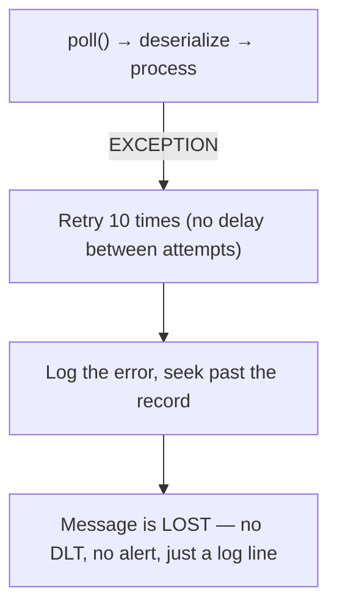
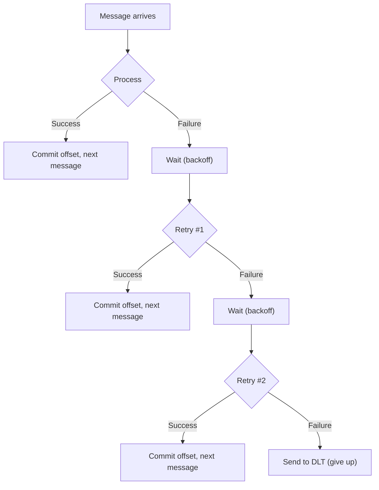
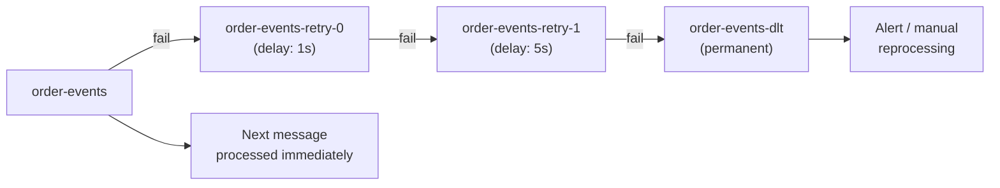
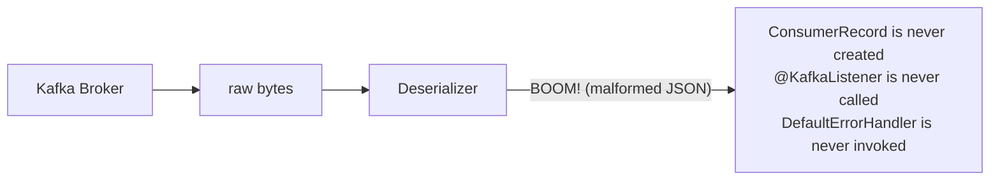
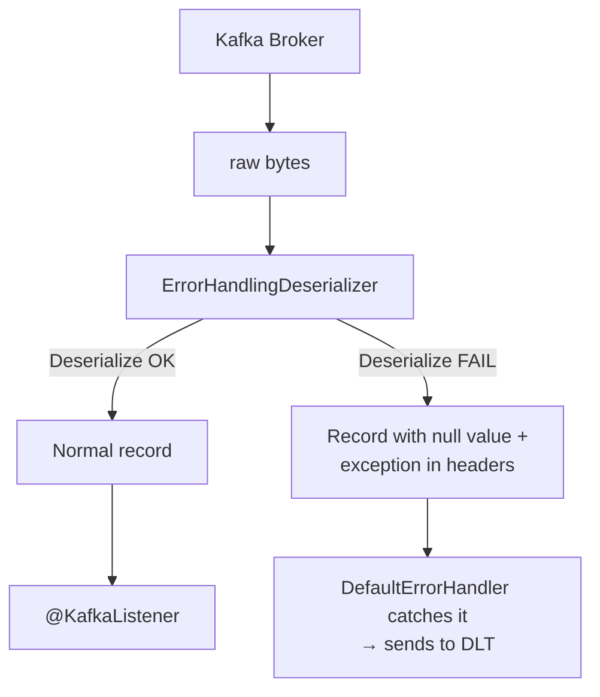

# Kafka — Chapter 10: Consumer Exception Handling & Dead Letter Topic (DLT)

> When a message can't be processed, you need a plan — retry it, park it, or lose it.

---

## The Problem — Why Exception Handling Matters

In a happy-path world, every message deserializes cleanly and processes without errors. In production, things break: a downstream service is temporarily down, a message has a corrupted payload, or a schema change causes deserialization to blow up.

When a Kafka consumer throws an exception during message processing, the consequences are severe:

1. **The offset is not committed** — the consumer will re-read the same message on the next `poll()`.
2. **The partition is blocked** — no subsequent messages on that partition are processed.
3. **Consumer lag builds up** — every message behind the stuck one piles up.
4. **The consumer group may rebalance** — if processing takes longer than `max.poll.interval.ms`, the consumer is kicked out.

### Poison Pill Messages

A **poison pill** is a message that will *always* fail, no matter how many times you retry. Examples:

- Malformed JSON or Avro that can't be deserialized
- A message referencing a foreign key that doesn't exist in your database
- A message violating a business validation rule (e.g., negative quantity)

Without explicit handling, a poison pill creates an **infinite retry loop**: consume → fail → don't commit → consume → fail → ...

### Retriable vs Non-Retriable Exceptions

| Type | Example | Should Retry? |
|------|---------|---------------|
| Retriable | `HttpServerErrorException` (503), `SocketTimeoutException`, `DataAccessResourceFailureException` | Yes — transient failures that may resolve |
| Non-Retriable | `DeserializationException`, `JsonParseException`, `ConstraintViolationException` | No — retrying will always fail |

The key design decision: **how many times do you retry, and what do you do when retries are exhausted?**

---

## Default Behavior — What Happens Without Custom Error Handling

### Spring Kafka's Default

In Spring Boot with `spring-kafka`, the default behavior depends on the version:

- **Spring Kafka 2.8+**: Uses `DefaultErrorHandler` which retries **10 times with no backoff**, then logs the error and moves on (seeks past the failed record).
- **Older versions**: Used `SeekToCurrentErrorHandler` — same idea, different name.

Without any custom configuration, a failing message will:



This is dangerous in production. You want failed messages to go somewhere recoverable, not just vanish into logs.

---

## Retry Mechanisms

Spring Kafka provides two fundamentally different retry strategies.

### 1. Blocking Retries — Retry in the Same Thread

The consumer retries the failed message *before* moving to the next record. The partition is blocked during retries.



#### Configuration with `DefaultErrorHandler`

```java
@Bean
public DefaultErrorHandler errorHandler(
        DeadLetterPublishingRecoverer recoverer) {

    // Retry 3 times, 1 second between each attempt
    FixedBackOff backOff = new FixedBackOff(1000L, 3);

    DefaultErrorHandler handler = new DefaultErrorHandler(recoverer, backOff);

    // Don't retry these — send directly to DLT
    handler.addNotRetryableExceptions(
        DeserializationException.class,
        JsonParseException.class
    );

    return handler;
}
```

You can also use `ExponentialBackOff` for increasing delays:

```java
ExponentialBackOff backOff = new ExponentialBackOff(1000L, 2.0);
backOff.setMaxAttempts(5);
// Delays: 1s, 2s, 4s, 8s, 16s
```

| Config | Default | Effect |
|--------|---------|--------|
| `FixedBackOff(interval, maxAttempts)` | `0, 9` | Fixed delay between retries; 0ms interval, 9 retries (10 total attempts) |
| `ExponentialBackOff(initialInterval, multiplier)` | — | Each retry waits longer; set `maxAttempts` to cap |
| `addNotRetryableExceptions(...)` | none | Skip retries for these exception types, go straight to recoverer |

### 2. Non-Blocking Retries — `@RetryableTopic`

Instead of blocking the partition, Spring Kafka publishes the failed message to a **retry topic** and moves on to the next message. A separate consumer picks up the retry topic after a delay.



#### How It Works

1. The original consumer fails processing a message.
2. Spring Kafka publishes the message to `order-events-retry-0` with a backoff header.
3. A consumer for `order-events-retry-0` waits for the delay, then attempts processing.
4. If it fails again, the message moves to `order-events-retry-1` (longer delay).
5. After all retry topics are exhausted, the message lands in `order-events-dlt`.

#### Code Example

```java
@Component
public class OrderEventConsumer {

    @RetryableTopic(
        attempts = "4",                            // 1 original + 3 retries
        backoff = @Backoff(
            delay = 1000,                          // 1s initial delay
            multiplier = 3,                        // 1s → 3s → 9s
            maxDelay = 30000                       // cap at 30s
        ),
        topicSuffixingStrategy = TopicSuffixingStrategy.SUFFIX_WITH_INDEX_VALUE,
        autoCreateTopics = "true",
        include = { HttpServerErrorException.class, SocketTimeoutException.class },
        exclude = { DeserializationException.class }
    )
    @KafkaListener(topics = "order-events", groupId = "order-processor")
    public void consume(OrderEvent event) {
        // process the event — may throw retriable exceptions
        orderService.process(event);
    }

    @DltHandler
    public void handleDlt(OrderEvent event, @Header(KafkaHeaders.RECEIVED_TOPIC) String topic) {
        log.error("DLT received: event={} from topic={}", event, topic);
        alertService.sendAlert("DLT message received for order: " + event.getOrderId());
        // optionally persist to a DB table for manual review
        dltRepository.save(event);
    }
}
```

### Blocking vs Non-Blocking Retries — Comparison

| Aspect | Blocking | Non-Blocking (`@RetryableTopic`) |
|--------|----------|----------------------------------|
| Partition blocked during retry? | Yes | No |
| Ordering preserved? | Yes — messages stay in order | No — later messages may be processed first |
| Extra topics created? | No | Yes — one per retry level + DLT |
| Long backoff delays viable? | No — blocks the consumer thread | Yes — message sits in retry topic |
| Complexity | Low | Medium — more topics, more consumers |
| Best for | Short, fast retries (< 5s total) | Long delays, high-throughput systems |

**Rule of thumb**: Use blocking retries for fast, transient failures (network blips). Use non-blocking retries when you need multi-minute delays or can't afford to block the partition.

---

## Dead Letter Topic (DLT)

A **Dead Letter Topic** is a Kafka topic where messages that have permanently failed processing are sent. It's the final destination when all retries are exhausted.

### Naming Convention

Spring Kafka follows a default naming convention:

| Original Topic | DLT Name |
|----------------|----------|
| `order-events` | `order-events-dlt` |
| `payment.completed` | `payment.completed-dlt` |

You can customize the suffix via `@RetryableTopic(dltTopicSuffix = ".DLT")`.

### What Metadata Is Preserved

When a message is sent to the DLT, Spring Kafka adds headers with context about the failure:

| Header | Value |
|--------|-------|
| `kafka_dlt-original-topic` | The topic the message originally came from |
| `kafka_dlt-original-partition` | The partition it was in |
| `kafka_dlt-original-offset` | The offset of the failed message |
| `kafka_dlt-original-timestamp` | When the original message was produced |
| `kafka_dlt-exception-fqcn` | Fully qualified class name of the exception |
| `kafka_dlt-exception-message` | The exception message |
| `kafka_dlt-exception-stacktrace` | The full stack trace |

### `DeadLetterPublishingRecoverer`

This is the Spring Kafka component that publishes failed messages to the DLT. You wire it into the `DefaultErrorHandler`:

```java
@Bean
public DeadLetterPublishingRecoverer recoverer(KafkaTemplate<String, Object> template) {
    return new DeadLetterPublishingRecoverer(template,
        (record, ex) -> new TopicPartition(record.topic() + "-dlt", record.partition()));
}

@Bean
public DefaultErrorHandler errorHandler(DeadLetterPublishingRecoverer recoverer) {
    return new DefaultErrorHandler(recoverer, new FixedBackOff(1000L, 3));
}
```

The lambda `(record, ex) -> TopicPartition` lets you control the DLT destination. You could route different exception types to different DLTs.

### Manual DLT Handling — Production Practices

In production, DLT messages need attention, not just storage:

1. **Alerting**: Set up a consumer on the DLT that triggers PagerDuty/Slack alerts.
2. **Persistence**: Write DLT messages to a database table for a UI-based review tool.
3. **Reprocessing**: After fixing the root cause, replay messages from the DLT back to the original topic.
4. **Monitoring**: Track DLT message count as a metric in Grafana/Prometheus. A spike means something is broken.

```java
// Simple DLT monitoring consumer
@KafkaListener(topics = "order-events-dlt", groupId = "dlt-monitor")
public void monitorDlt(ConsumerRecord<String, byte[]> record) {
    String originalTopic = new String(record.headers()
        .lastHeader("kafka_dlt-original-topic").value());
    meterRegistry.counter("kafka.dlt.messages",
        "original_topic", originalTopic).increment();
    // alert, persist, etc.
}
```

---

## Custom Error Handling

### The `CommonErrorHandler` Interface

Spring Kafka's `CommonErrorHandler` is the entry point for all error handling. `DefaultErrorHandler` is the primary implementation you'll use.

### Filtering Retriable vs Non-Retriable Exceptions

```java
@Bean
public DefaultErrorHandler errorHandler(DeadLetterPublishingRecoverer recoverer) {
    DefaultErrorHandler handler = new DefaultErrorHandler(recoverer,
        new ExponentialBackOff(500L, 2.0));

    // These exceptions skip retries — go directly to DLT
    handler.addNotRetryableExceptions(
        DeserializationException.class,
        MessageConversionException.class,
        ConversionException.class,
        MethodArgumentNotValidException.class,
        NullPointerException.class
    );

    return handler;
}
```

**Why classify exceptions?** Retrying a `DeserializationException` is pointless — the bytes won't magically become valid JSON on the second attempt. But retrying a `SocketTimeoutException` makes sense because the downstream service might recover.

---

## Deserialization Errors — A Special Case

Deserialization failures are uniquely tricky because they happen **before** the message reaches your `@KafkaListener` method. The `DefaultErrorHandler` never even sees them — the record can't be constructed.

### The Problem



### The Solution: `ErrorHandlingDeserializer`

Spring Kafka provides a wrapper deserializer that catches exceptions during deserialization and wraps them into a special header on the `ConsumerRecord`, allowing the error handler to process them.

#### Configuration

```yaml
spring:
  kafka:
    consumer:
      key-deserializer: org.springframework.kafka.support.serializer.ErrorHandlingDeserializer
      value-deserializer: org.springframework.kafka.support.serializer.ErrorHandlingDeserializer
      properties:
        spring.deserializer.key.delegate.class: org.apache.kafka.common.serialization.StringDeserializer
        spring.deserializer.value.delegate.class: org.springframework.kafka.support.serializer.JsonDeserializer
        spring.json.trusted.packages: "com.example.events"
```

#### How It Works



The `ErrorHandlingDeserializer` delegates to the real deserializer (e.g., `JsonDeserializer`). If it throws, the error is captured as a header, and a `ConsumerRecord` with a `null` value is created. The `DefaultErrorHandler` detects this and routes it to the DLT.

---

## Full Spring Boot Configuration Example

Putting it all together — a production-ready consumer setup:

```java
@Configuration
public class KafkaConsumerConfig {

    @Bean
    public DeadLetterPublishingRecoverer deadLetterRecoverer(
            KafkaTemplate<String, Object> kafkaTemplate) {
        return new DeadLetterPublishingRecoverer(kafkaTemplate,
            (record, ex) -> new TopicPartition(
                record.topic() + "-dlt", record.partition()));
    }

    @Bean
    public DefaultErrorHandler errorHandler(
            DeadLetterPublishingRecoverer deadLetterRecoverer) {

        // 3 retries, 2 seconds apart
        DefaultErrorHandler handler = new DefaultErrorHandler(
            deadLetterRecoverer,
            new FixedBackOff(2000L, 3)
        );

        // Non-retriable exceptions — skip retries, go to DLT immediately
        handler.addNotRetryableExceptions(
            DeserializationException.class,
            MessageConversionException.class,
            NullPointerException.class
        );

        return handler;
    }
}
```

```yaml
# application.yml
spring:
  kafka:
    bootstrap-servers: localhost:9092
    consumer:
      group-id: order-processor
      auto-offset-reset: earliest
      enable-auto-commit: false
      key-deserializer: org.springframework.kafka.support.serializer.ErrorHandlingDeserializer
      value-deserializer: org.springframework.kafka.support.serializer.ErrorHandlingDeserializer
      properties:
        spring.deserializer.key.delegate.class: org.apache.kafka.common.serialization.StringDeserializer
        spring.deserializer.value.delegate.class: org.springframework.kafka.support.serializer.JsonDeserializer
        spring.json.trusted.packages: "com.example.events"
```

```java
@Component
@Slf4j
public class OrderEventConsumer {

    @KafkaListener(topics = "order-events", groupId = "order-processor")
    public void consume(OrderEvent event) {
        log.info("Processing order: {}", event.getOrderId());
        orderService.process(event);  // may throw retriable exceptions
    }
}
```

---

## Interview Angles

**Q: What is a Dead Letter Topic and when do you use it?**
A: A Dead Letter Topic is a dedicated Kafka topic where messages that have permanently failed processing are published after all retry attempts are exhausted. You use it to avoid losing data — instead of dropping failed messages, you park them in the DLT for investigation, alerting, and eventual reprocessing. It's the Kafka equivalent of a dead letter queue in traditional messaging systems.

**Q: What are the trade-offs between blocking and non-blocking retries?**
A: Blocking retries are simple and preserve message ordering within a partition, but they stall the consumer — no other messages on that partition are processed during the retry backoff. Non-blocking retries (`@RetryableTopic`) publish the failed message to a separate retry topic and immediately move on, so throughput isn't affected. The downside is that message ordering is lost, extra topics are created, and the infrastructure is more complex. Use blocking for short delays (milliseconds to a few seconds) and non-blocking for longer delays (seconds to minutes).

**Q: How does Spring Kafka handle deserialization errors?**
A: Deserialization errors are special because they occur before a `ConsumerRecord` is created, so normal error handlers never see them. Spring Kafka provides the `ErrorHandlingDeserializer` wrapper, which delegates to the actual deserializer (e.g., `JsonDeserializer`). If deserialization fails, the wrapper catches the exception, stores it in the record headers, and creates a record with a `null` value. The `DefaultErrorHandler` then detects this poisoned record and routes it to the DLT. Without this wrapper, a deserialization failure causes an infinite loop — the consumer re-reads the same bad bytes on every `poll()`.

**Q: What happens if the DLT itself is full or unavailable?**
A: If publishing to the DLT fails (broker down, topic doesn't exist, authorization error), the `DeadLetterPublishingRecoverer` throws an exception. By default, this causes the consumer to retry the original message again, potentially leading to a loop. To handle this, you can configure a custom `BiFunction` recoverer that falls back to logging or persisting to a local file/database when DLT publishing fails. You should also ensure the DLT topic has sufficient partitions, replication, and retention to handle the volume.

**Q: How would you monitor and reprocess DLT messages in production?**
A: Three layers. First, **alerting**: a dedicated consumer group on the DLT that increments a Prometheus counter and fires Slack/PagerDuty alerts on each message. Second, **persistence**: write DLT messages to a database table with columns for original topic, offset, exception, payload, and a status flag (pending/reprocessed/ignored). Third, **reprocessing**: after the root cause is fixed, a tool or API reads from the DB or DLT and re-publishes messages to the original topic. Some teams build an admin UI for this. Always replay to the original topic (not directly process) so the message goes through the normal consumer pipeline with its own retry logic.

**Q: What is a poison pill message and how do you handle it?**
A: A poison pill is a message that will always fail processing regardless of how many times you retry — for example, malformed data, an invalid schema, or a record referencing non-existent entities. Without handling, it blocks the partition forever. You handle it by: (1) using `ErrorHandlingDeserializer` for deserialization poison pills, (2) configuring `addNotRetryableExceptions()` to skip retries for known non-retriable exception types, and (3) routing the message to a DLT after retries are exhausted. The goal is to **never block the partition indefinitely** — either fix and retry, or park and move on.

**Q: Can you use both blocking and non-blocking retries together?**
A: Yes. A common production pattern is to combine them: use a small number of blocking retries (2-3 attempts with sub-second delays) for fast transient failures like brief network glitches, and if those fail, fall back to non-blocking retries with longer delays (seconds to minutes) via retry topics. Spring Kafka's `@RetryableTopic` supports this with the `sameIntervalTopicReuseStrategy` and configuring the `DefaultErrorHandler` alongside `@RetryableTopic`. This gives you the best of both worlds — fast recovery for blips without creating unnecessary retry topic traffic, and long-delay retries for sustained outages without blocking the consumer.

**Q: How does `@RetryableTopic` manage the delay between retries?**
A: The retry topics don't inherently support delays — Kafka topics are just append logs. Spring Kafka implements the delay by setting a timestamp header on the retry message indicating when it should be processed. The consumer for the retry topic checks this header on each `poll()` and pauses the partition (using `consumer.pause()`) until the delay has elapsed. Once the time arrives, it resumes the partition and processes the message. This is an application-level delay, not a broker feature.
