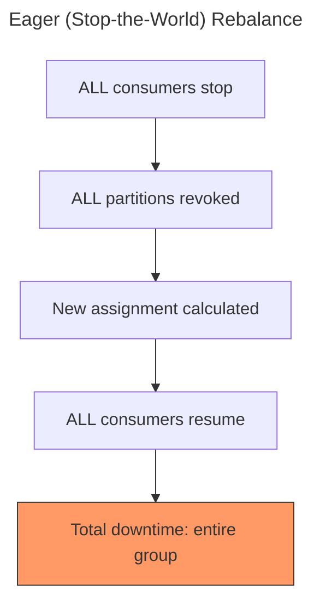
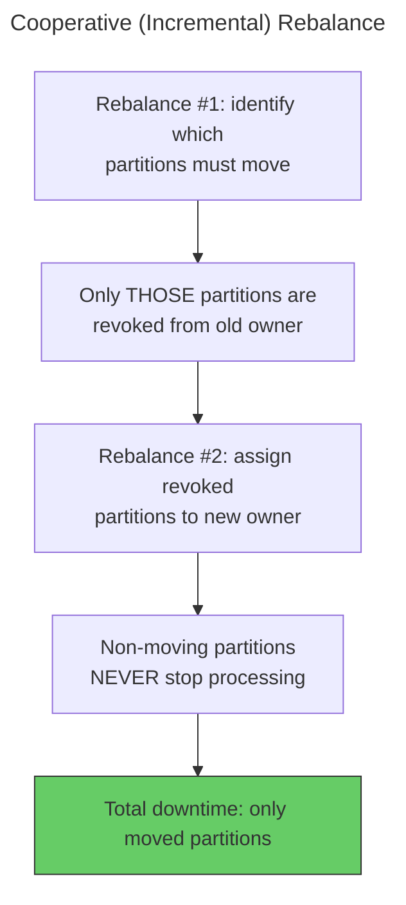
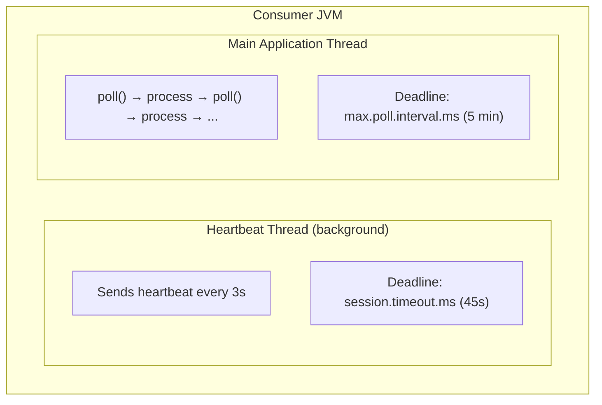
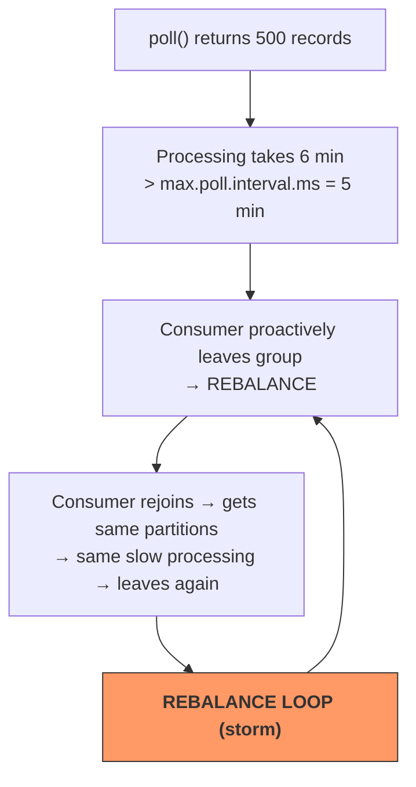
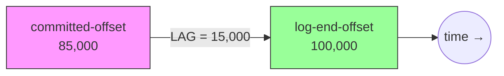

# Kafka — Chapter 11: Consumer Advanced Configurations & Edge Cases

> The difference between a consumer that works and one that works *in production* is 15 config properties and the wisdom to tune them.

---

## Partition Assignment Strategies — Deep Dive

When a consumer group rebalances, the Consumer Leader must decide which consumer gets which partition. Kafka ships four assignment strategies, each with different tradeoffs.

### RangeAssignor (Default)

Sorts partitions by topic-partition number and consumers by `member.id`, then divides partitions per topic into contiguous ranges.

```
Topic: orders (6 partitions), consumers: C0, C1

Sorted partitions: P0, P1, P2, P3, P4, P5
6 partitions / 2 consumers = 3 each

C0 → P0, P1, P2
C1 → P3, P4, P5
```

**The imbalance problem** — when subscribing to multiple topics with non-divisible partition counts:

```
Topic: orders   (3 partitions)  →  C0 gets P0,P1  |  C1 gets P2
Topic: payments (3 partitions)  →  C0 gets P0,P1  |  C1 gets P2
Topic: refunds  (3 partitions)  →  C0 gets P0,P1  |  C1 gets P2

Result: C0 = 6 partitions, C1 = 3 partitions  ← skewed!
```

The "extra" partition always goes to the first consumer, so the imbalance compounds across topics.

### RoundRobinAssignor

Lays out all partitions from all subscribed topics in a single list, sorts them, and assigns in round-robin order.

```
All partitions sorted: orders-P0, orders-P1, orders-P2,
                       payments-P0, payments-P1, payments-P2

C0 → orders-P0, orders-P2, payments-P1
C1 → orders-P1, payments-P0, payments-P2

Result: 3 each ← balanced!
```

**Caveat**: If consumers subscribe to different sets of topics, the distribution can become uneven because partitions for unsubscribed topics are skipped for that consumer.

### StickyAssignor

Two goals (in priority order):
1. Make the assignment as balanced as possible (like RoundRobin).
2. Minimize partition movement during rebalances — partitions that don't *need* to move stay put.

```
Before rebalance (3 consumers, 6 partitions):
  C0 → P0, P1    C1 → P2, P3    C2 → P4, P5

C2 leaves. Eager rebalance:
  All partitions revoked first, then reassigned.
  C0 → P0, P1, P4    C1 → P2, P3, P5   ← P0-P3 didn't need to move
```

Sticky remembers the previous assignment and only reassigns the orphaned partitions (P4, P5).

### CooperativeStickyAssignor (Incremental Rebalance)

The game-changer. Instead of revoking *all* partitions and reassigning (eager/stop-the-world), it performs an **incremental rebalance**:





### Comparison Table

| Strategy | Balance | Movement | Rebalance Type | Best For |
|----------|---------|----------|----------------|----------|
| `RangeAssignor` | Poor (multi-topic) | High | Eager | Single-topic, simple setups |
| `RoundRobinAssignor` | Good | High | Eager | Multi-topic, uniform subscriptions |
| `StickyAssignor` | Good | Low | Eager | Minimizing reassignment |
| `CooperativeStickyAssignor` | Good | Low | Incremental | Production — avoids stop-the-world |

**Setting the strategy:**

```java
props.put(ConsumerConfig.PARTITION_ASSIGNMENT_STRATEGY_CONFIG,
    CooperativeStickyAssignor.class.getName());
```

Spring Boot:
```yaml
spring:
  kafka:
    consumer:
      properties:
        partition.assignment.strategy: org.apache.kafka.clients.consumer.CooperativeStickyAssignor
```

---

## Offset Reset Strategies (`auto.offset.reset`)

Controls what happens when a consumer starts reading a partition and there is **no committed offset** (new group or offset expired).

| Value | Behavior | Use Case |
|-------|----------|----------|
| `latest` (default) | Start from the end — only see new messages | Real-time dashboards, live monitoring |
| `earliest` | Start from the beginning — replay everything | Data pipelines, backfill, first-time consumers |
| `none` | Throw `NoOffsetForPartitionException` | Strict environments — force explicit offset mgmt |

### Edge Case: Offset Out of Range

If committed offset = 50,000 but the topic's earliest available offset = 80,000 (because retention deleted older segments), the committed offset is **out of range**.

```
Log:  [80,000 ──────────────── 120,000]
                                  ▲ log-end-offset
Committed offset: 50,000  ← gone! retention deleted it
```

Kafka triggers the `auto.offset.reset` policy:
- `earliest` → jump to 80,000 (you lose 50,000–79,999 silently)
- `latest` → jump to 120,000 (you lose everything in between)
- `none` → exception thrown — consumer crashes, you investigate

**This is why `none` exists** — in critical pipelines, you'd rather crash and alert than silently skip data.

---

## Consumer Liveness & Timing Configs

These four configs form the "health check" system. Getting them wrong causes rebalance storms or zombie consumers.



### Config Table

| Config | Default | Purpose | Rule of Thumb |
|--------|---------|---------|---------------|
| `session.timeout.ms` | 45,000 | If no heartbeat in this window, consumer is evicted | Network-related failures |
| `heartbeat.interval.ms` | 3,000 | How often heartbeat is sent | Must be ≤ `session.timeout.ms / 3` |
| `max.poll.interval.ms` | 300,000 (5 min) | Max time between `poll()` calls | Processing-related failures |
| `max.poll.records` | 500 | Max records returned per `poll()` | Tune to keep processing < max.poll.interval |

### The "Slow Consumer" Problem



**Fix options:**
1. Reduce `max.poll.records` (e.g., 50) — process fewer records per poll
2. Increase `max.poll.interval.ms` — give more time (treats symptom, not cause)
3. Offload processing to a thread pool — call `poll()` frequently, process async
4. Optimize processing logic itself

### Static Membership (`group.instance.id`)

In Kubernetes, a pod restart causes two rebalances: one when the consumer leaves, one when it rejoins. Static membership avoids this.

```java
props.put(ConsumerConfig.GROUP_INSTANCE_ID_CONFIG, "consumer-pod-0");
```

When set:
- Consumer is not immediately removed on disconnect
- Coordinator waits `session.timeout.ms` for the consumer to return
- If it returns with the same `group.instance.id`, it reclaims its old partitions **without a rebalance**
- Pair with a higher `session.timeout.ms` (e.g., 60–120s) to cover restart windows

---

## Fetch Tuning Configs

These control how much data the consumer pulls from the broker on each fetch cycle.

| Config | Default | Effect |
|--------|---------|--------|
| `fetch.min.bytes` | 1 | Broker waits until at least this many bytes are available before responding |
| `fetch.max.wait.ms` | 500 | Max time broker waits if `fetch.min.bytes` isn't satisfied |
| `max.partition.fetch.bytes` | 1,048,576 (1 MB) | Max data returned **per partition** in a single fetch |
| `fetch.max.bytes` | 52,428,800 (50 MB) | Max total data returned across all partitions in a single fetch |

### Tuning for Throughput vs Latency

```
High Throughput (batch processing):
  fetch.min.bytes = 100000       ← wait for 100KB
  fetch.max.wait.ms = 2000       ← wait up to 2s
  max.poll.records = 1000        ← process large batches

Low Latency (real-time processing):
  fetch.min.bytes = 1            ← return immediately
  fetch.max.wait.ms = 100        ← short broker wait
  max.poll.records = 50          ← small batches, fast commits
```

**Memory planning**: If you consume from N partitions, worst-case memory per fetch is `N × max.partition.fetch.bytes`. With 100 partitions at 1 MB each, a single fetch could bring 100 MB into the consumer JVM.

---

## Consumer Lag & Monitoring

### What Is Consumer Lag?

Consumer lag is the difference between the **log-end-offset** (latest message in the partition) and the **committed offset** (where the consumer last checkpointed).



### Checking Lag with CLI

```bash
kafka-consumer-groups.sh \
  --bootstrap-server localhost:9092 \
  --group order-processing \
  --describe
```

Output:
```
GROUP             TOPIC      PARTITION  CURRENT-OFFSET  LOG-END-OFFSET  LAG    CONSUMER-ID        HOST
order-processing  orders     0          85000           100000          15000  consumer-1-abc      /10.0.0.5
order-processing  orders     1          92000           92500           500    consumer-2-def      /10.0.0.6
order-processing  orders     2          -               78000           -      -                   -
```

- **Partition 0**: 15K lag — consumer is behind, possibly slow processing
- **Partition 1**: 500 lag — healthy, nearly caught up
- **Partition 2**: No consumer assigned — idle partition, rebalance issue

### Key JMX Metrics

| Metric | What It Tells You |
|--------|-------------------|
| `records-lag-max` | Maximum lag across all partitions this consumer reads |
| `records-lag` | Per-partition lag |
| `records-consumed-rate` | Throughput — records/sec being consumed |
| `fetch-rate` | How often the consumer is fetching from brokers |
| `commit-rate` | How often offsets are being committed |
| `rebalance-rate-and-time` | Frequency and duration of rebalances |

### Lag-Based Alerting Rules

```
Healthy:        lag < 1,000 and stable
Warning:        lag > 10,000 or growing steadily
Critical:       lag > 100,000 or consumer has no active members
Investigate:    lag = 0 but no messages being produced (dead topic?)
```

---

## Edge Cases & Gotchas

### 1. More Partitions Than Consumers

Each partition is assigned to exactly one consumer. With 6 partitions and 2 consumers, each consumer gets 3 partitions. This is normal and expected.

### 2. Fewer Partitions Than Consumers (Idle Consumers)

With 3 partitions and 5 consumers, only 3 consumers are active. The other 2 sit idle — consuming no data, but still heartbeating and participating in rebalances.

```
Partitions: P0, P1, P2
Consumers:  C0→P0, C1→P1, C2→P2, C3→idle, C4→idle

Adding more consumers beyond partition count = wasted resources
```

### 3. Adding Partitions to an Existing Topic

When you increase partitions on a running topic:
- A rebalance is triggered
- New partitions start at offset 0 with no committed offset → `auto.offset.reset` applies
- **Key ordering breaks**: keys that hashed to partition X before may now hash to partition Y
- Existing data stays in old partitions — only new messages use the new partition count

### 4. Rebalance Storms — Causes and Prevention

A rebalance storm is a feedback loop of repeated rebalances that prevent consumers from making progress.

**Common causes:**
- `max.poll.interval.ms` exceeded repeatedly (slow processing)
- Consumers frequently joining/leaving (deployment without static membership)
- Unstable network causing heartbeat failures
- Too many consumer group members subscribing to regex topics

**Prevention:**
1. Use `CooperativeStickyAssignor` — reduces rebalance impact
2. Set `group.instance.id` — prevents restart-triggered rebalances
3. Tune `max.poll.records` down — ensure processing finishes in time
4. Increase `session.timeout.ms` for flaky networks (but not too high — slow failure detection)
5. Avoid regex topic subscriptions in large clusters

### 5. max.poll.records + max.poll.interval.ms Trap

```
max.poll.records = 10,000
Processing per record = 50ms
Total processing time = 10,000 × 50ms = 500s = 8.3 minutes
max.poll.interval.ms = 300,000 (5 min)

Result: consumer ALWAYS exceeds poll interval → perpetual rebalance
```

**Fix**: `max.poll.records × avg_processing_time_per_record` must be well under `max.poll.interval.ms`.

### 6. CommitFailedException During Rebalance

If a rebalance starts while a consumer is in the middle of processing, and the consumer tries to commit offsets for partitions it no longer owns:

```java
try {
    consumer.commitSync();
} catch (CommitFailedException e) {
    // Partitions were revoked during rebalance
    // The records you just processed will be re-delivered to the new owner
    log.warn("Commit failed — partitions revoked. Records will be reprocessed.", e);
}
```

This is a natural consequence of at-least-once delivery. Use `ConsumerRebalanceListener.onPartitionsRevoked()` to commit offsets before partitions are taken away.

```java
consumer.subscribe(List.of("orders"), new ConsumerRebalanceListener() {
    @Override
    public void onPartitionsRevoked(Collection<TopicPartition> partitions) {
        // Last chance to commit before losing these partitions
        consumer.commitSync(currentOffsets(partitions));
    }

    @Override
    public void onPartitionsAssigned(Collection<TopicPartition> partitions) {
        // New partitions received — initialize state if needed
    }
});
```

---

## Consumer Interceptors

### The `ConsumerInterceptor` Interface

Interceptors let you hook into the consume and commit lifecycle without modifying business logic.

```java
public class MetricsInterceptor implements ConsumerInterceptor<String, String> {

    @Override
    public ConsumerRecords<String, String> onConsume(ConsumerRecords<String, String> records) {
        // Called AFTER records are fetched but BEFORE poll() returns them
        records.forEach(record -> {
            long latency = System.currentTimeMillis() - record.timestamp();
            Metrics.recordConsumeLatency(record.topic(), latency);
        });
        return records; // must return records (can filter or transform)
    }

    @Override
    public void onCommit(Map<TopicPartition, OffsetAndMetadata> offsets) {
        // Called AFTER offsets are committed successfully
        offsets.forEach((tp, offset) ->
            log.info("Committed {}:{} at offset {}", tp.topic(), tp.partition(), offset.offset()));
    }

    @Override
    public void close() { }

    @Override
    public void configure(Map<String, ?> configs) { }
}
```

**Registering the interceptor:**

```java
props.put(ConsumerConfig.INTERCEPTOR_CLASSES_CONFIG,
    MetricsInterceptor.class.getName());
```

### Use Cases

| Use Case | Hook | Example |
|----------|------|---------|
| End-to-end latency tracking | `onConsume` | Compare `record.timestamp()` with current time |
| Record filtering | `onConsume` | Drop poison-pill messages before processing |
| Commit auditing | `onCommit` | Log every offset commit for debugging |
| Header injection | `onConsume` | Add tracing headers before processing |
| Metrics emission | Both | Push consume-rate and commit-rate to Prometheus |

---

## Interview Angles

**Q: When would you choose CooperativeStickyAssignor over RangeAssignor?**
A: In production, almost always. `RangeAssignor` causes imbalance across multiple topics and uses eager (stop-the-world) rebalancing. `CooperativeStickyAssignor` provides balanced assignment, minimizes partition movement, and uses incremental rebalancing — only the partitions that need to move are paused, so the rest of the group continues processing without interruption.

**Q: What happens when `max.poll.interval.ms` is exceeded?**
A: The consumer proactively sends a `LeaveGroup` request to the coordinator. This triggers a rebalance. The consumer's partitions are reassigned to other group members. When the slow consumer finishes processing and calls `poll()` again, it will rejoin the group. If the root cause isn't fixed, this creates a rebalance storm.

**Q: How do you handle the "slow consumer" problem?**
A: First, diagnose *why* processing is slow (DB calls, external APIs, heavy computation). Then apply a combination of: (1) reduce `max.poll.records` to process smaller batches, (2) optimize the processing logic, (3) offload heavy work to a separate thread pool and call `poll()` on schedule, (4) increase partition count and add more consumers for horizontal scaling. Increasing `max.poll.interval.ms` is a last resort — it only masks the problem and delays failure detection.

**Q: What is consumer lag and how do you monitor it?**
A: Consumer lag is the difference between the log-end-offset (latest produced message) and the consumer's committed offset. It tells you how far behind a consumer is. You monitor it via `kafka-consumer-groups.sh --describe`, JMX metrics like `records-lag-max`, or external tools like Burrow. Growing lag means the consumer can't keep up with producers — you need to optimize processing, add consumers, or increase partitions.

**Q: Explain `auto.offset.reset=none` — when is it useful?**
A: With `none`, the consumer throws `NoOffsetForPartitionException` if no committed offset exists. This is useful in strict data pipelines where silently starting from the beginning or end would cause data duplication or data loss. It forces operators to explicitly set offsets before the consumer can run, making the startup behavior deterministic and auditable.

**Q: What causes rebalance storms and how do you prevent them?**
A: Rebalance storms are feedback loops where consumers repeatedly trigger rebalances before making progress. Common causes: `max.poll.interval.ms` exceeded due to slow processing, frequent pod restarts in Kubernetes, or regex-based subscriptions in large clusters. Prevention: use `CooperativeStickyAssignor` (reduces impact per rebalance), set `group.instance.id` (static membership avoids restart-triggered rebalances), tune `max.poll.records` down so processing fits within the poll interval, and avoid regex topic subscriptions when possible.

**Q: What happens to key ordering when you add partitions to a topic?**
A: Key ordering breaks for new messages. Kafka assigns keys to partitions using `hash(key) % numPartitions`. When you change `numPartitions`, keys that previously went to partition X may now go to partition Y. Existing data in old partitions is unaffected — only new messages use the new partition count. This is why you should set the right partition count upfront and avoid increasing it on topics where key-based ordering is critical.

**Q: How does `ConsumerRebalanceListener` help prevent data loss during rebalances?**
A: By implementing `onPartitionsRevoked()`, you get a callback *before* your partitions are taken away. This is your last chance to commit offsets for records you've already processed. Without it, any processed-but-uncommitted records will be re-delivered to the new partition owner, causing duplicates. In exactly-once or transactional consumers, this hook is essential for flushing pending transactions before ownership changes.
