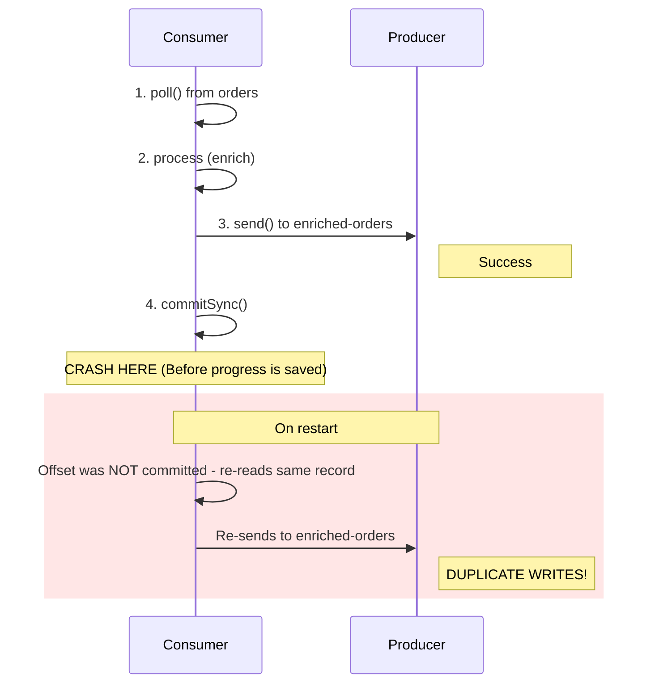
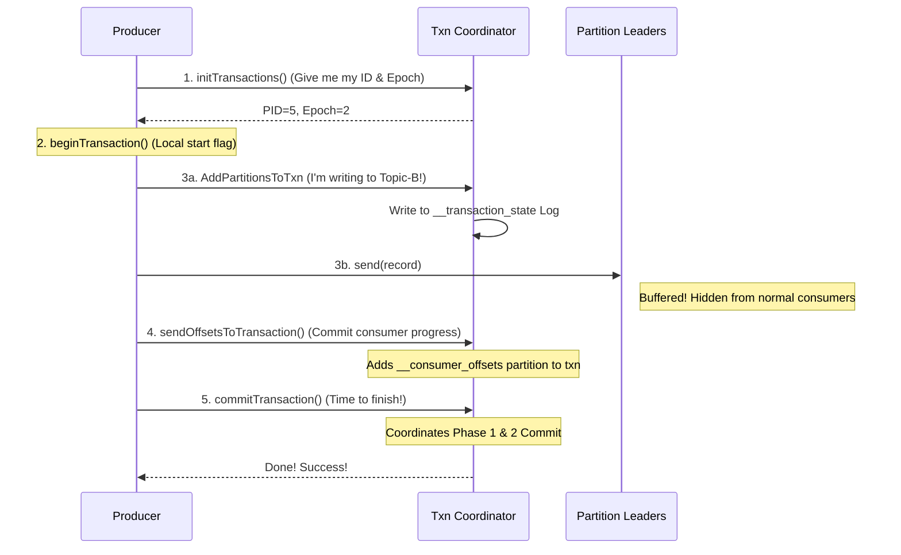
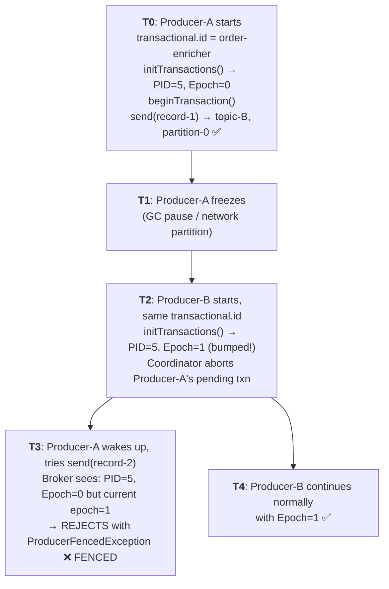
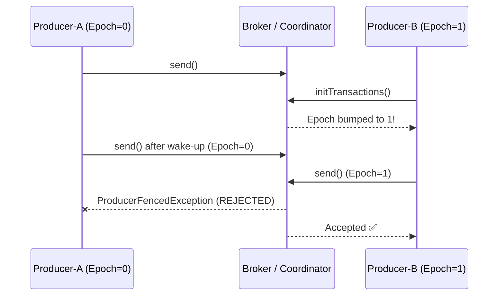

# Kafka — Chapter 12: Producer Transaction Handling (Made Easy! 🚀)

> **In plain English:** Imagine you want to transfer $10 from Account A to Account B. If the system crashes halfway, you don't want the money to leave Account A without arriving at Account B. You want **both** to happen, or **neither**. That's a transaction!
>
> In Kafka, transactions allow a producer to write to multiple partitions and topics in such a way that either **all** messages are successfully written and read together, or **none** of them are.

---

## 1. Why Do We Need Transactions? The Problem

The most common pattern in stream processing is **Read-Process-Write**:
1. **Read** a message from Topic A (e.g., `new-orders`).
2. **Process** or change the data (e.g., calculate tax or enrich payload).
3. **Write** the result to Topic B (e.g., `processed-orders`).
4. **Save your progress** (commit the consumer offset) so you don't process the same message again on restart.

Without transactions, this three-step dance is fragile. If the system crashes at any point, things get messy.

### The 3 Big Nightmares of Non-Transactional Kafka

| Nightmare | Real-World Scenario | What Happens |
| :--- | :--- | :--- |
| **1. The Duplicate Charge** (Crash after Send) | The producer sends the processed message to Topic B, but crashes **before** saving its progress (committing offsets). | On restart, it reads the original message from Topic A *again* and sends a duplicate to Topic B. |
| **2. The Half-Done Job** (Partial Writes) | The producer needs to write to Partition-0 and Partition-1. It crashes after writing to Partition-0 but before Partition-1. | Half your data is saved, half is lost. Your database or downstream systems are now in an inconsistent ("torn") state. |
| **3. The Zombie Impostor** (Stuck/Laggy Producer) | A producer gets stuck in a long JVM Garbage Collection (GC) pause. Kafka thinks it's dead and starts a new producer. The old one suddenly wakes up and continues writing. | You now have two producers writing conflicting data at the same time. |

Let's see this in a simple timeline diagram:



**The goal:** make writes to multiple partitions/topics and consumer offset commits an **atomic unit** — either all succeed or none are visible to downstream consumers.

---

## 2. The Core Characters in a Kafka Transaction

Before we look at the workflow, let's meet the key terms. We'll use a **Hotel / Keycard** analogy to make it easy.

### 💳 Producer ID (PID)
* **What it is:** A unique 64-bit number assigned to your producer by the broker when it first connects.
* **Analogy:** Like a **Visitor ID Badge** you get at the front desk.
* **Why it matters:** Kafka uses this badge number to make sure it doesn't write duplicate retries from the same producer session.

### 🔑 Epoch
* **What it is:** A version number (counter) paired with your Producer ID.
* **Analogy:** If you lose your hotel keycard, the front desk gives you a new one with a higher version number (e.g., Keycard #2). The moment you swipe Keycard #2, your old Keycard #1 is deactivated forever.
* **Why it matters:** If an old, laggy producer tries to write using an old epoch, Kafka says "Nope!" and blocks it. This is called **fencing**.

### 🤵 Transaction Coordinator (The Referee)
* **What it is:** A specific broker (server) in the Kafka cluster that acts as the "manager" for a producer's transactions.
* **Analogy:** Like a **Wedding Planner** or a **Project Manager**. It keeps track of all the moving parts, writes down the status, and makes the final call on whether the transaction succeeded or failed.
* **How it's chosen:** Kafka hashes your `transactional.id` to find a specific partition in the internal `__transaction_state` topic. The leader of that partition becomes your referee.
  ```text
  partition = abs(hash(transactional.id)) % numPartitions(__transaction_state)
  The leader of that partition = Transaction Coordinator for this transactional.id
  ```

### 📝 Transaction Log (`__transaction_state`)
* **What it is:** An internal, highly secure Kafka topic where the Coordinator writes down everything that happens.
* **Analogy:** The **Referee's Notebook**. If the Coordinator crashes, a new Coordinator can read this notebook and pick up exactly where the old one left off.

---

## 3. The Transaction Lifecycle (Step-by-Step)

Here is how a transaction actually executes in code and under the hood:



### Let's walk through the steps:

* **Step 1: `initTransactions()` (The Handshake)**
  The producer registers with the Coordinator. The Coordinator looks up your `transactional.id` in `__transaction_state`. If found, it bumps the Epoch (which deactivates any old duplicates). If not, it assigns a new PID and starts Epoch at `0`.
* **Step 2: `beginTransaction()` (The Local Setup)**
  This is purely local! The producer simply flips an internal switch saying "Everything I do from now on belongs to this transaction." No network calls are made yet.
* **Step 3: `send()` (The Write)**
  Before sending a message to a partition for the first time in a transaction, the producer registers that partition with the Coordinator. The Coordinator writes it down in its notebook. Then the producer sends the data to the partition leader.
* **Step 4: `sendOffsetsToTransaction()` (The Progress Saver)**
  If you are reading from an input topic, you must save your offset (progress). Instead of saving it directly, the producer tells the Coordinator: "Please save this progress as part of the transaction." Kafka adds the consumer group's `__consumer_offsets` partition to the transaction.
* **Step 5: `commitTransaction()` (The Final Approval)**
  The producer tells the Coordinator: "I'm done. Make these messages visible!" This kicks off the **Two-Phase Commit (2PC)** protocol.

---

## 4. The Two-Phase Commit (2PC) Demystified

How does Kafka ensure that either everything is committed or nothing is? It uses a two-step process called **Two-Phase Commit (2PC)**.

### Phase 1: PREPARE (The Point of No Return)
The Coordinator writes a `PrepareCommit` record to its transaction notebook (`__transaction_state`).
* Once this record is safely written and replicated across servers, **the decision to commit is final**. Even if the Coordinator crashes right after this, the transaction *must* and *will* be committed by whoever takes over.

```json
__transaction_state log record:
Key: "my-transactional-id"
Value: {
  "PID": 5,
  "Epoch": 2,
  "State": "PrepareCommit",
  "Partitions": [
    "(topic-B, partition-0)",
    "(topic-B, partition-1)",
    "(__consumer_offsets, partition-23)"
  ]
}
```

### Phase 2: COMMIT (Putting up the Green Flags)
The Coordinator tells the leader of every partition involved in the transaction to write a **Transaction Marker** (also called a control record) into their log.

**What the Partition Log looks like:**
```text
Offset 100: [Data Record] (PID: 5, Epoch: 2) <-- Hidden from normal readers
Offset 101: [Data Record] (PID: 5, Epoch: 2) <-- Hidden from normal readers
Offset 102: [COMMIT MARKER] (PID: 5, Epoch: 2) <-- The Green Flag!
```

Once all partition leaders acknowledge writing the markers, the Coordinator writes a `CompleteCommit` record to its notebook. The transaction is officially finished!

### How Consumers Read Transactional Data: LSO
By default, Kafka consumers read everything as it arrives. But for transactions, you must set:
`isolation.level = read_committed`

This tells the consumer to only read up to the **Last Stable Offset (LSO)**.
* **LSO (Last Stable Offset):** The offset of the first record belonging to an active, ongoing transaction.
* The consumer will block and wait. Once the `COMMIT` marker is written, the LSO jumps forward, and all those messages suddenly become visible to the consumer.

```text
Partition Log Status:

Offset 98:  [Record] (Committed)      <-- Visible
Offset 99:  [Record] (Committed)      <-- Visible
Offset 100: [Record] (PID=5, Ongoing) <-- HIDDEN (Pending txn)
Offset 101: [Record] (PID=5, Ongoing) <-- HIDDEN (Pending txn)
Offset 102: [COMMIT MARKER] (PID=5)   <-- After this arrives, 100-101 are visible.
                                          LSO advances past 102.
```

> [!WARNING]
> **Hanging Transactions:** If a producer crashes and never commits or aborts, the transaction stays "open." The LSO cannot advance, and all downstream `read_committed` consumers will get stuck waiting!
>
> **The Solution:** Kafka has a `transaction.timeout.ms` (default 1 minute). If a transaction stays open longer than this, the Coordinator will automatically abort it so consumers can resume.

### What Happens If the Coordinator Crashes Mid-Commit?
1. A new leader is elected for the `__transaction_state` partition.
2. The new coordinator replays the transaction log.
3. If it finds a **PrepareCommit** record without a matching **CompleteCommit**, it resumes Phase 2 — sending `WriteTxnMarkers` to all involved partitions.
4. If it finds no Prepare record, the transaction is treated as ongoing and will eventually time out and be aborted.

---

## 5. Zombie Fencing: Stopping Stale Producers

### What is a Zombie Producer?
Imagine a producer pod in Kubernetes goes into a deep sleep (e.g., during garbage collection or network lag). Kubernetes thinks the pod is dead and starts a new one. Suddenly, the old pod wakes up. It doesn't know it was replaced! It tries to continue writing. This is a **Zombie**.

### How Kafka Fences Zombies:



1. **Producer B** (new pod) starts up. It calls `initTransactions()` with `transactional.id = order-enricher`.
2. The Coordinator sees `order-enricher` and bumps the Epoch from `0` to `1`.
3. **Producer A** (the zombie) wakes up and tries to send a message using Epoch `0`.
4. The Broker looks at the message, checks the current Epoch for `order-enricher` (which is now `1`), and immediately rejects Producer A's request with a `ProducerFencedException`.
5. Producer A realizes it's been replaced and shuts down.



> [!IMPORTANT]
> **Why your `transactional.id` MUST be static:**
> If you generate a random `transactional.id` (like using `UUID.randomUUID()`) on every restart, Kafka will treat the restarted producer as a brand-new instance rather than a replacement. It won't bump the epoch of the old one, and the zombie will keep writing duplicates undetected!
>
> **Best Practice:** Name your transactional ID deterministically based on its role:
> ```java
> transactional.id = "order-enricher-partition-" + assignedPartition
> ```

---

## 6. Idempotency vs. Transactions: What's the Difference?

Many beginners get confused between "Idempotent Producers" and "Transactional Producers". Here is the breakdown:

* **Idempotency** is like a **retries deduplicator**. It ensures that if a network glitch causes a producer to send the exact same message twice, the broker only saves it once. It works *per partition* and *per producer session*.
* **Transactions** build *on top of* idempotency. They allow you to write to *multiple* partitions and topics atomically, commit consumer offsets in the same step, and survive producer restarts.

### Quick Comparison

| Feature | Idempotent Producer | Transactional Producer |
| :--- | :--- | :--- |
| **Deduplicates Network Retries** | Yes (PID + sequence number) | Yes (Inherited) |
| **Atomic Writes across Multiple Topics/Partitions** | No | Yes |
| **Atomic Consumer Offsets Commits** | No | Yes (`sendOffsetsToTransaction`) |
| **Survives Producer Restart** | No (new PID is issued) | Yes (`transactional.id` + epoch) |
| **Prevents Zombies** | No | Yes (Epoch-based fencing) |
| **Consumer Config Needed** | None | Yes (`isolation.level = read_committed`) |
| **Required Producer Configs** | `enable.idempotence = true` | Automatically sets idempotency and `acks = all` |
| **Performance Impact** | Almost none | Moderate (due to coordination & 2PC) |

---

## 7. Configuration Configurations & Failures

### Key Configs

| Config | Default | Description |
| :--- | :--- | :--- |
| `transaction.timeout.ms` | 60000 (60s) | Max duration of a transaction. If not committed/aborted within this window, the Coordinator automatically aborts it. |
| `max.block.ms` | 60000 (60s) | Max time `send()` and `commitTransaction()` block if the Coordinator or partition leader is unavailable. |
| `delivery.timeout.ms` | 120000 (2m) | Upper bound on time to report success or failure of a `send()` call, including retries. |
| `transaction.state.log.replication.factor` | 3 | Replication factor for `__transaction_state`. Keep at 3 in production for high availability. |
| `transaction.state.log.min.isr` | 2 | Minimum In-Sync Replicas for `__transaction_state` writes. Ensures durability of commit decisions. |

---

## 8. Show Me the Code! (Spring Boot Example)

Here is a complete, beginner-friendly setup for a transactional producer in Spring Boot.

### Step 1: Configure the Producer
We need to register a `KafkaTransactionManager` and set the `transactional.id`.

```java
@Configuration
public class KafkaTransactionalProducerConfig {

    @Bean
    public ProducerFactory<String, String> producerFactory() {
        Map<String, Object> props = new HashMap<>();
        props.put(ProducerConfig.BOOTSTRAP_SERVERS_CONFIG, "localhost:9092");
        props.put(ProducerConfig.KEY_SERIALIZER_CLASS_CONFIG, StringSerializer.class);
        props.put(ProducerConfig.VALUE_SERIALIZER_CLASS_CONFIG, StringSerializer.class);

        // 1. Give your producer a logical name. This enables transactions!
        props.put(ProducerConfig.TRANSACTIONAL_ID_CONFIG, "order-enricher-tx");
        
        // Note: setting transactional.id automatically sets:
        // - enable.idempotence = true
        // - acks = all (to ensure high durability)

        DefaultKafkaProducerFactory<String, String> factory =
            new DefaultKafkaProducerFactory<>(props);
        return factory;
    }

    @Bean
    public KafkaTemplate<String, String> kafkaTemplate(
            ProducerFactory<String, String> producerFactory) {
        return new KafkaTemplate<>(producerFactory);
    }

    // 2. This manager coordinates Spring's transaction system with Kafka
    @Bean
    public KafkaTransactionManager<String, String> kafkaTransactionManager(
            ProducerFactory<String, String> producerFactory) {
        return new KafkaTransactionManager<>(producerFactory);
    }
}
```

### Step 2: Use `@Transactional` (Easy Mode)
Simply annotate your service method with `@Transactional`. Spring will automatically start a transaction, execute your sends, and commit them. If an exception is thrown, it will abort the transaction!

```java
@Service
public class OrderEnrichmentService {

    private final KafkaTemplate<String, String> kafkaTemplate;

    public OrderEnrichmentService(KafkaTemplate<String, String> kafkaTemplate) {
        this.kafkaTemplate = kafkaTemplate;
    }

    @Transactional("kafkaTransactionManager") // Starts the Kafka txn
    public void enrichAndForward(String orderId, String enrichedPayload) {
        // Both messages are sent under the same transaction
        kafkaTemplate.send("enriched-orders", orderId, enrichedPayload);
        kafkaTemplate.send("order-audit-log", orderId, "enriched at " + Instant.now());
        
        // If this method completes normally -> Kafka Commits
        // If an exception is thrown here -> Kafka Aborts!
    }
}
```

### Step 3: Programmatic Mode (Manual Control)
If you don't want to use annotations, you can run transactions programmatically using `executeInTransaction`.

```java
@Service
public class ManualTransactionService {

    private final KafkaTemplate<String, String> kafkaTemplate;

    public ManualTransactionService(KafkaTemplate<String, String> kafkaTemplate) {
        this.kafkaTemplate = kafkaTemplate;
    }

    public void processWithTransaction(String key, String value) {
        // The lambda expression defines the scope of the transaction
        kafkaTemplate.executeInTransaction(operations -> {
            operations.send("topic-a", key, value);
            operations.send("topic-b", key, "derived-" + value);
            return true; // Auto-commits if no exception is thrown
        });
    }
}
```

### Step 4: Configure the Consumer
To ensure your consumers only read committed messages:

```java
@Bean
public ConsumerFactory<String, String> consumerFactory() {
    Map<String, Object> props = new HashMap<>();
    props.put(ConsumerConfig.BOOTSTRAP_SERVERS_CONFIG, "localhost:9092");
    props.put(ConsumerConfig.GROUP_ID_CONFIG, "enriched-orders-consumer");
    props.put(ConsumerConfig.KEY_DESERIALIZER_CLASS_CONFIG, StringDeserializer.class);
    props.put(ConsumerConfig.VALUE_DESERIALIZER_CLASS_CONFIG, StringDeserializer.class);

    // CRITICAL: Tell the consumer to ignore aborted or ongoing transactions
    props.put(ConsumerConfig.ISOLATION_LEVEL_CONFIG, "read_committed");

    return new DefaultKafkaConsumerFactory<>(props);
}
```

---

## 9. Interview Prep: Quick-Fire Q&A Cheat Sheet

Use these simple answers to ace your Kafka transaction interview questions!

### **Q: Idempotence vs. Transactions. Explain the difference simply.**
> **A:** Idempotence is like a "double-click preventer" for a single topic partition during one session. Transactions are like a "shopping cart checkout"—they bundle multiple writes across different topics, along with the offsets of the messages you read, ensuring everything succeeds or fails as a single unit, surviving restarts.

### **Q: How does Zombie Fencing work in Kafka?**
> **A:** Kafka uses a version number called an **Epoch** attached to a unique `transactional.id`. When a new instance of a producer starts, the Coordinator bumps the Epoch. If the old "zombie" instance tries to write with its old Epoch, the broker rejects it with a `ProducerFencedException`.

### **Q: What is the Transaction Coordinator and how is it chosen?**
> **A:** The Transaction Coordinator is the broker that manages a transaction's lifecycle. It is chosen by hashing the `transactional.id` to a partition in the internal `__transaction_state` topic. The leader of that partition becomes the Coordinator.

### **Q: What is the "Last Stable Offset" (LSO)?**
> **A:** The LSO is the offset of the earliest uncommitted (ongoing) transaction in a partition. A consumer configured with `read_committed` is blocked from reading past this offset to prevent it from reading uncommitted data.

### **Q: What happens if the Transaction Coordinator crashes mid-commit?**
> **A:** Since the decision to commit is written to the replicated transaction log (`__transaction_state`) in Phase 1 (PrepareCommit), the new Coordinator elected for that partition will read the log, find the `PrepareCommit` record, and finish writing the commit markers to all partition leaders in Phase 2. The commit is never lost.

### **Q: Why must `transactional.id` be stable across restarts?**
> **A:** Because zombie fencing relies on the new producer instance having the same `transactional.id` as the old one. If you use a random UUID on each restart, the coordinator will see it as a brand-new producer, and the old zombie instance will remain unfenced, leading to duplicate writes.

### **Q: How does `sendOffsetsToTransaction()` achieve exactly-once in the consume-transform-produce pattern?**
> **A:** It ties the consumer's offset commit directly to the producer's transaction. The offset commit is written to `__consumer_offsets` as part of the same transaction. If the transaction aborts, the offsets are not committed, and the consumer will read the messages again.

---
