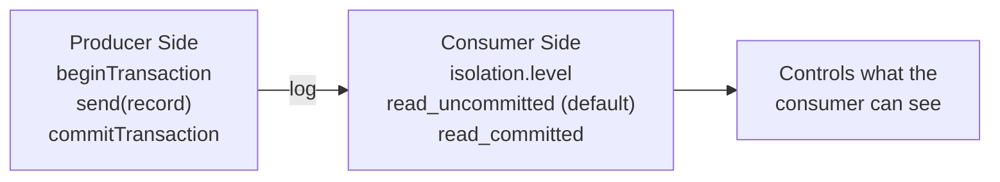
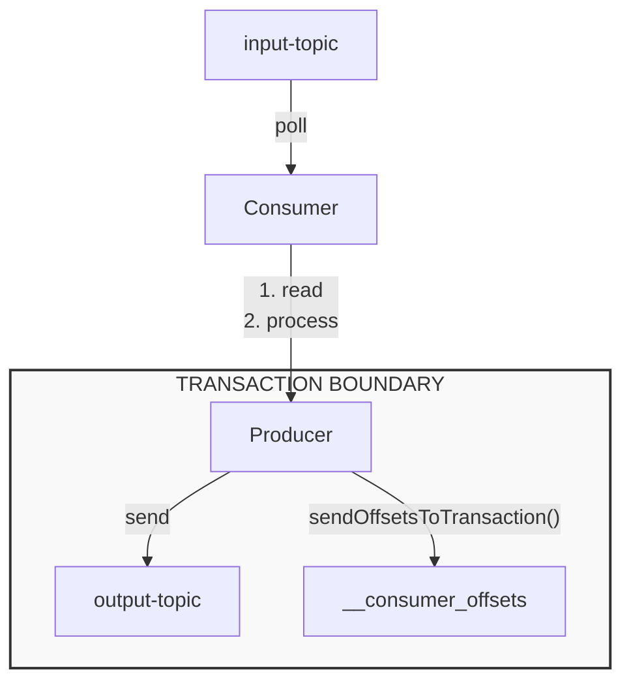
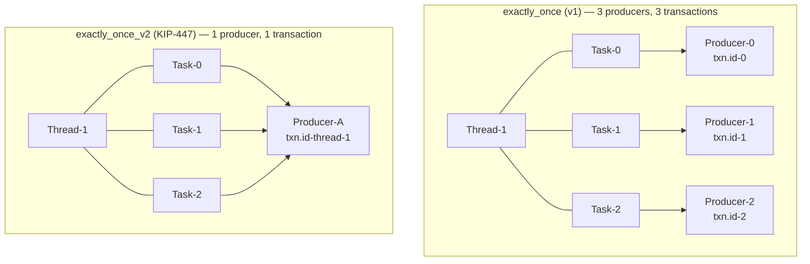

# Kafka — Chapter 13: Consumer Transaction Handling — Exactly-Once Semantics

> The producer writes transactionally; the consumer decides what it's willing to see.

---

## Overview — The Two Sides of a Kafka Transaction

Kafka transactions are often explained from the producer's perspective: begin, write, commit/abort. But the consumer is the other half of the story. Without the right consumer configuration, all that transactional bookkeeping is wasted — the consumer will happily read uncommitted and aborted messages as if nothing happened.

The key config that bridges these two worlds is `isolation.level`.



---

## Read Uncommitted vs Read Committed

### `read_uncommitted` (Default)

The consumer sees **everything** in the partition log — committed messages, messages belonging to open transactions, and even messages from aborted transactions. It behaves as if transactions don't exist.

Why is this the default?
- **Backward compatibility**: Before transactions (pre-0.11), all consumers read everything. Changing the default would break existing applications.
- **Performance**: No filtering overhead, no waiting for transactions to close.

### `read_committed`

The consumer only sees messages that have been **committed** by a transactional producer. Messages from aborted transactions are silently skipped. Messages from open (in-flight) transactions are held back — the consumer cannot read past them.

| Behavior | `read_uncommitted` | `read_committed` |
|----------|-------------------|------------------|
| Sees committed messages | Yes | Yes |
| Sees aborted messages | Yes | **No** |
| Sees open transaction messages | Yes | **No** (blocked at LSO) |
| Non-transactional messages | Yes | Yes |
| Default | **Yes** | No |
| Latency impact | None | Slight increase |

---

## Last Stable Offset (LSO)

The **Last Stable Offset** is the offset of the first message that belongs to an open (uncommitted) transaction. A `read_committed` consumer can only consume up to `LSO - 1` — it cannot see beyond this boundary.

### LSO vs High Watermark (HW) vs Log End Offset (LEO)

```
Partition Log:

  Offset:   0    1    2    3    4    5    6    7    8    9    10   11
          ┌────┬────┬────┬────┬────┬────┬────┬────┬────┬────┬────┬────┐
  Data:   │ C  │ C  │ C  │ T1 │ T1 │ C  │ T2 │ T2 │ C  │    │    │    │
          └────┴────┴────┴────┴────┴────┴────┴────┴────┴────┴────┴────┘
                              ▲                   ▲         ▲         ▲
                              │                   │         │         │
                             LSO                  │        HW        LEO
                              │                   │
                   (T1 is still open)     (T2 is still open)

  C  = Committed / non-transactional message
  T1 = Message from transaction 1 (open, not yet committed)
  T2 = Message from transaction 2 (open, not yet committed)
```

- **LEO** (Log End Offset): The offset of the next message to be written. Only the leader knows this.
- **HW** (High Watermark): The last offset replicated to all ISR members. Consumers (both modes) cannot read past HW.
- **LSO** (Last Stable Offset): The offset of the earliest open transaction. Only relevant for `read_committed` consumers.

**Relationship**: `LSO ≤ HW ≤ LEO`

When there are no open transactions, `LSO == HW`.

### Impact on Consumer Lag

Consumer lag is calculated differently depending on isolation level:

| Isolation Level | Lag Formula |
|----------------|-------------|
| `read_uncommitted` | `HW - consumer_offset` |
| `read_committed` | `LSO - consumer_offset` |

This means `read_committed` consumers can appear to have **artificially high lag** during long-running transactions, even if they've consumed everything available to them.

---

## How Aborted Transactions Are Handled

When a producer aborts a transaction, the messages it wrote are **not deleted** from the log. They remain in the partition. Instead, Kafka uses a filtering mechanism.

### The Mechanism

1. **Transaction Markers**: When a transaction completes, the Transaction Coordinator writes a special control record (marker) into each partition that was part of the transaction. The marker is either `COMMIT` or `ABORT`.

2. **Aborted Transaction Index (`.txnindex`)**: Each log segment maintains an index of aborted transactions — a list of `(producerId, firstOffset, lastOffset)` tuples.

3. **Fetch Response Enrichment**: When a `read_committed` consumer sends a `FetchRequest`, the broker attaches the list of aborted transaction PIDs (Producer IDs) that overlap with the fetched offset range.

4. **Client-Side Filtering**: The consumer uses this aborted-PID list to skip messages locally. It never surfaces aborted messages to the application.

```
Partition Log (after T1 committed, T2 aborted):

  Offset:  0    1    2    3    4    5    6    7    8    9
         ┌────┬────┬────┬────┬────┬────┬────┬────┬────┬────┐
  Data:  │ m1 │ T1 │ m2 │ T2 │ T1 │ T2 │CMIT│ABRT│ m3 │    │
         │    │    │    │    │    │    │ T1 │ T2 │    │    │
         └────┴────┴────┴────┴────┴────┴────┴────┴────┴────┘

  What read_uncommitted sees:  m1, T1, m2, T2, T1, T2, m3  (everything)
  What read_committed sees:    m1, T1, m2, T1, m3           (T2 messages filtered out)

  Filtering happens client-side using aborted PID list from broker.
  Control records (COMMIT/ABORT markers) are never surfaced to the application.
```

### The `.txnindex` File

Stored alongside `.log` and `.index` files in each log segment directory:

```
/kafka-logs/my-topic-0/
├── 00000000000000000000.log
├── 00000000000000000000.index
├── 00000000000000000000.timeindex
└── 00000000000000000000.txnindex      ← aborted transaction index
```

The `.txnindex` stores `(PID, firstOffset, lastOffset)` for every aborted transaction in that segment. The broker uses this to quickly look up which PIDs to include in the fetch response.

---

## The Exactly-Once Semantics (EOS) Pattern — End to End

The classic EOS use case: **consume from topic A, process, produce to topic B, commit consumer offsets — all atomically.**

### The Key Insight

`sendOffsetsToTransaction()` commits the consumer's offsets as part of the producer's transaction. If the transaction aborts, the offsets are rolled back too. This ties the consumer's progress to the producer's output.

### The Full EOS Flow



**Steps**: (1) Consumer reads from input-topic with `read_committed`. (2) Application processes records. (3) Producer begins transaction. (4) Producer sends results to output-topic. (5) Producer sends consumer offsets to `__consumer_offsets` via `sendOffsetsToTransaction()`. (6) Producer commits transaction.

### Code Example

```java
// Setup
Properties consumerProps = new Properties();
consumerProps.put(ConsumerConfig.ISOLATION_LEVEL_CONFIG, "read_committed");
consumerProps.put(ConsumerConfig.ENABLE_AUTO_COMMIT_CONFIG, "false");
consumerProps.put(ConsumerConfig.GROUP_ID_CONFIG, "eos-processor-group");

Properties producerProps = new Properties();
producerProps.put(ProducerConfig.TRANSACTIONAL_ID_CONFIG, "eos-processor-txn-1");
producerProps.put(ProducerConfig.ENABLE_IDEMPOTENCE_CONFIG, "true");

KafkaConsumer<String, String> consumer = new KafkaConsumer<>(consumerProps);
KafkaProducer<String, String> producer = new KafkaProducer<>(producerProps);

producer.initTransactions();
consumer.subscribe(List.of("input-topic"));

// EOS Loop
while (true) {
    ConsumerRecords<String, String> records = consumer.poll(Duration.ofMillis(100));
    if (records.isEmpty()) continue;

    producer.beginTransaction();
    try {
        for (ConsumerRecord<String, String> record : records) {
            // Process and produce to output topic
            String result = process(record.value());
            producer.send(new ProducerRecord<>("output-topic", record.key(), result));
        }

        // Commit consumer offsets as part of the transaction
        Map<TopicPartition, OffsetAndMetadata> offsets = new HashMap<>();
        for (TopicPartition partition : records.partitions()) {
            List<ConsumerRecord<String, String>> partRecords = records.records(partition);
            long lastOffset = partRecords.get(partRecords.size() - 1).offset();
            offsets.put(partition, new OffsetAndMetadata(lastOffset + 1));
        }
        producer.sendOffsetsToTransaction(offsets, consumer.groupMetadata());

        producer.commitTransaction();
    } catch (Exception e) {
        producer.abortTransaction();
        // Consumer will re-read from last committed offset on next poll()
    }
}
```

**Critical detail**: The offset committed is `lastOffset + 1`, not `lastOffset`. Kafka resumes from the committed offset, so you commit the *next* offset to read.

---

## Kafka Streams and EOS

Kafka Streams automates the entire EOS pattern so you don't have to wire it manually.

### `processing.guarantee` Modes

| Config Value | Behavior |
|-------------|----------|
| `at_least_once` (default) | Offsets committed after processing; duplicates possible on failure |
| `exactly_once` (deprecated) | Per-partition `transactional.id`; one producer per task |
| `exactly_once_v2` | Per-thread `transactional.id` (KIP-447); fewer producers, better performance |

### How `exactly_once_v2` Works (KIP-447)

The original `exactly_once` (v1) created a separate transactional producer for every stream task (partition). With 100 partitions, that's 100 producers, 100 `transactional.id` registrations, and heavy coordinator load.

KIP-447 (`exactly_once_v2`) assigns `transactional.id` **per thread**, not per task. A single producer handles all partitions assigned to that thread within a single transaction.



**Why v2 is more efficient**:
- Fewer producers → less memory and fewer TCP connections
- Fewer concurrent transactions → less coordinator overhead
- Fewer transaction markers in the log → less storage overhead
- Requires broker version ≥ 2.5

### Spring Cloud Stream / Kafka Streams Config

```yaml
spring:
  kafka:
    streams:
      properties:
        processing.guarantee: exactly_once_v2
```

---

## Performance Impact of Transactions

### Latency

- `read_committed` consumers must wait for open transactions to close before reading past the LSO. A long-running transaction blocks all `read_committed` consumers on that partition.
- Each transaction adds two round-trips: `beginTransaction` and `commitTransaction` (plus the `AddPartitionsToTxn` and `AddOffsetsToTxn` RPCs).

### Throughput

- Transaction markers (COMMIT/ABORT) are extra records written to every partition involved in the transaction. With many small transactions, this overhead adds up.
- Client-side filtering of aborted messages costs CPU.

### Mitigation Strategies

| Strategy | Config | Effect |
|----------|--------|--------|
| Keep transactions short | `transaction.timeout.ms` (default 60s) | Coordinator aborts transactions exceeding this limit |
| Batch more records per txn | Application logic | Amortize marker overhead across more records |
| Use `exactly_once_v2` | `processing.guarantee` | Fewer producers and transactions |
| Tune consumer fetch | `fetch.min.bytes`, `fetch.max.wait.ms` | Reduce fetch round-trips |

### Rule of Thumb

Transactions add roughly **5–20% overhead** compared to non-transactional produce-consume. The main bottleneck is the coordinator round-trips, not the filtering. For most workloads, this is acceptable for the guarantee you get.

---

## Edge Cases

### Non-Transactional Producer + `read_committed` Consumer

Works fine. Non-transactional messages don't have transaction markers, so the consumer reads them immediately. The `read_committed` filter has nothing to filter.

### Mixed Transactional and Non-Transactional Producers

Both can write to the same topic. The `read_committed` consumer will:
- Read non-transactional messages immediately (they don't affect LSO)
- Wait for transactional messages to be committed before reading them
- Skip aborted transactional messages

**Warning**: Non-transactional messages interleaved with open transaction messages are still blocked by the LSO. Even though the non-transactional message itself is "committed," it sits after the LSO because an earlier transaction is still open.

```
  Offset:  0    1    2    3    4    5
         ┌────┬────┬────┬────┬────┬────┐
  Data:  │ T1 │ NT │ NT │ T1 │ NT │    │
         └────┴────┴────┴────┴────┴────┘
              ▲
              LSO (T1 is open)

  read_committed consumer can only see: nothing (LSO is at 0)
  Even offsets 1, 2 (non-transactional) are blocked!
```

### Stuck Transactions (Producer Crash)

If a producer crashes mid-transaction without committing or aborting:
1. The Transaction Coordinator waits for `transaction.timeout.ms` (default 60s).
2. After timeout, the coordinator **automatically aborts** the stuck transaction.
3. An ABORT marker is written to all involved partitions.
4. LSO advances, unblocking `read_committed` consumers.

During this window, all `read_committed` consumers on affected partitions are **blocked**. This is why `transaction.timeout.ms` should be kept as short as practical.

### Artificially High Consumer Lag

Monitoring tools (like Burrow, Kafka Lag Exporter) may report high lag for `read_committed` consumer groups during open transactions. The lag is `LSO - consumer_offset`, and since LSO is stuck, lag grows even though the consumer has consumed everything available. This is expected behavior, not a bug.

---

## Spring Boot Configuration

### Consumer with `read_committed`

```yaml
spring:
  kafka:
    consumer:
      group-id: order-processor
      auto-offset-reset: earliest
      enable-auto-commit: false
      properties:
        isolation.level: read_committed
    producer:
      transaction-id-prefix: order-txn-
      properties:
        enable.idempotence: true
```

### `@KafkaListener` with Transactional Processing

```java
@Component
public class OrderProcessor {

    private final KafkaTemplate<String, String> kafkaTemplate;

    public OrderProcessor(KafkaTemplate<String, String> kafkaTemplate) {
        this.kafkaTemplate = kafkaTemplate;
    }

    @KafkaListener(topics = "orders", groupId = "order-processor")
    @Transactional("kafkaTransactionManager")
    public void process(ConsumerRecord<String, String> record) {
        // Process the order
        String enrichedOrder = enrich(record.value());

        // Produce to output topic — within the same transaction
        kafkaTemplate.send("enriched-orders", record.key(), enrichedOrder);

        // Consumer offset is committed automatically when the transaction commits
        // (Spring Kafka handles sendOffsetsToTransaction under the hood)
    }
}
```

### KafkaTransactionManager Configuration

```java
@Configuration
public class KafkaConfig {

    @Bean
    public KafkaTransactionManager<String, String> kafkaTransactionManager(
            ProducerFactory<String, String> producerFactory) {
        return new KafkaTransactionManager<>(producerFactory);
    }
}
```

When `spring.kafka.producer.transaction-id-prefix` is set, Spring Boot auto-configures the `KafkaTransactionManager`. The `@Transactional` annotation on a `@KafkaListener` method ensures that:
1. A transaction is started before the listener is invoked.
2. Any `kafkaTemplate.send()` calls participate in that transaction.
3. Consumer offsets are committed as part of the transaction via `sendOffsetsToTransaction()`.
4. If the method throws an exception, the transaction is aborted and offsets are not committed.

### Chaining Kafka + Database Transactions

For cases where you need to write to both Kafka and a database atomically, use `ChainedKafkaTransactionManager` (deprecated in Spring Kafka 3.x) or the newer approach with `@Transactional` spanning both:

```java
@Bean
public PlatformTransactionManager chainedTxManager(
        KafkaTransactionManager<String, String> kafkaTxManager,
        DataSourceTransactionManager dbTxManager) {
    // Deprecated in Spring Kafka 3.x — use nested @Transactional instead
    return new ChainedKafkaTransactionManager<>(kafkaTxManager, dbTxManager);
}
```

**Note**: True atomicity across Kafka and a database is impossible (two different systems). `ChainedKafkaTransactionManager` uses best-effort ordering — it commits the database first, then Kafka. If Kafka commit fails after DB commit, you get inconsistency. For true cross-system consistency, use the Outbox Pattern.

---

## Interview Angles

**Q: What is the difference between `read_committed` and `read_uncommitted`?**
A: `read_uncommitted` (the default) lets the consumer see all messages in the log, including those from open or aborted transactions. `read_committed` restricts the consumer to only see messages from committed transactions — aborted messages are filtered out, and the consumer cannot read past the Last Stable Offset (LSO), which is the position of the earliest open transaction.

**Q: Explain the Last Stable Offset (LSO) and how it affects consumers.**
A: The LSO is the offset of the first message belonging to an open (uncommitted) transaction. A `read_committed` consumer cannot consume beyond this point. This means a long-running transaction will block all `read_committed` consumers on that partition, even if there are committed messages after the LSO. The relationship is `LSO ≤ HW ≤ LEO`. When no transactions are open, LSO equals HW.

**Q: Walk through the Exactly-Once Semantics pattern end-to-end.**
A: The EOS pattern is: (1) Consumer reads from the input topic with `isolation.level=read_committed`. (2) Application processes the records. (3) Producer begins a transaction. (4) Producer sends results to the output topic. (5) Producer calls `sendOffsetsToTransaction()` to include the consumer's offsets in the transaction. (6) Producer commits the transaction. If anything fails, the transaction is aborted, offsets are not committed, and the consumer re-reads from its last committed position. This ensures that processing and output happen exactly once.

**Q: How does Kafka handle aborted transactions on the consumer side?**
A: Aborted messages are not deleted from the log. Instead, the broker maintains a `.txnindex` file listing aborted transaction PIDs and their offset ranges. When a `read_committed` consumer fetches data, the broker attaches the list of aborted PIDs that overlap with the requested range. The consumer then filters out those messages client-side. This means the broker does a cheap index lookup, and the consumer does the actual filtering.

**Q: What is the performance impact of using transactions?**
A: Transactions add 5–20% overhead. The main costs are: (1) Coordinator round-trips for begin/commit/abort. (2) Transaction markers (COMMIT/ABORT) written to every involved partition. (3) `read_committed` consumers must wait for transactions to close, adding end-to-end latency. (4) Client-side filtering of aborted messages costs CPU. The biggest concern is long-running transactions blocking the LSO, which can stall all `read_committed` consumers on affected partitions.

**Q: What happens if a producer crashes mid-transaction — how does the consumer handle it?**
A: The Transaction Coordinator detects the timeout after `transaction.timeout.ms` (default 60s) and automatically aborts the stuck transaction. It writes ABORT markers to all involved partitions. The LSO then advances past those messages, and `read_committed` consumers can resume. During the timeout window, `read_committed` consumers on those partitions are blocked. This is why keeping `transaction.timeout.ms` short is important.

**Q: Can you mix transactional and non-transactional producers on the same topic?**
A: Yes. Non-transactional messages have no transaction markers and are visible to all consumers immediately. However, a `read_committed` consumer may still be blocked from reading non-transactional messages if they sit after the LSO — i.e., if an earlier transactional message from an open transaction has a lower offset. The LSO blocks everything after it, regardless of whether individual messages are transactional or not.

**Q: Why did Kafka introduce `exactly_once_v2` (KIP-447)?**
A: The original `exactly_once` (v1) in Kafka Streams created one transactional producer per stream task (per partition). With hundreds of partitions, this meant hundreds of producers, each with its own `transactional.id`, TCP connections, and coordinator registrations. KIP-447 changed this to one producer per thread, dramatically reducing resource usage and coordinator load. It requires broker version 2.5+ because it relies on new fencing mechanisms at the consumer group level rather than per-partition.
