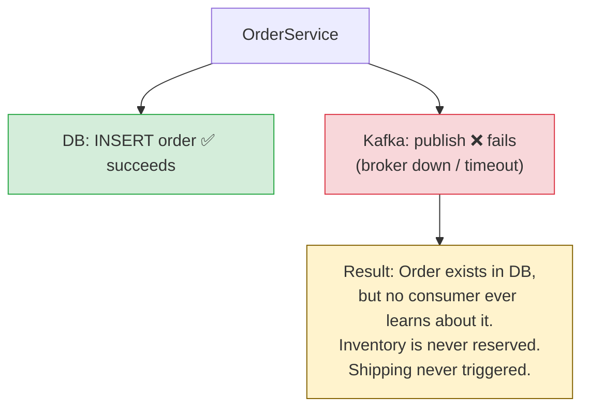
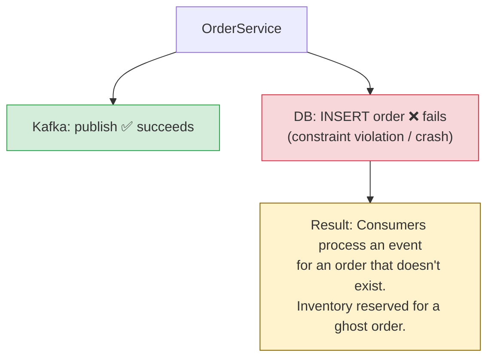
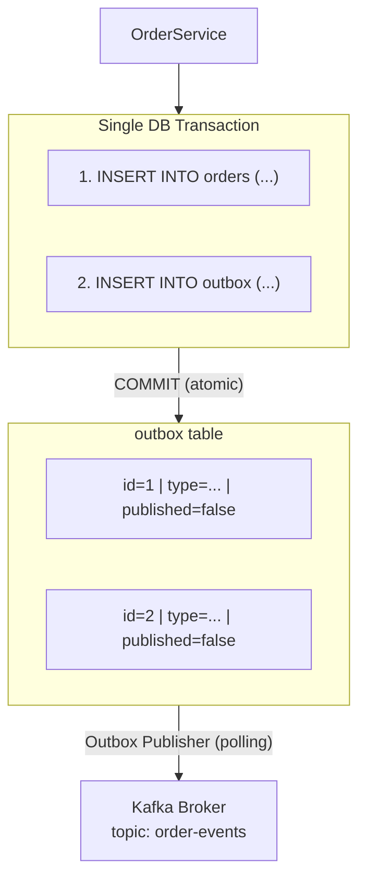
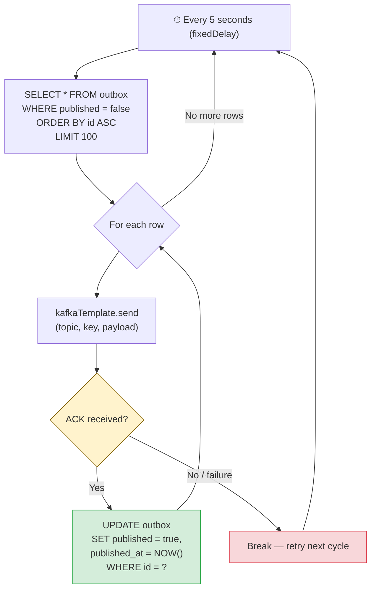

# Kafka — Chapter 14: Outbox Pattern — Polling Strategy

> Write to one database, publish to zero message brokers — and still guarantee the event reaches Kafka.

---

## The Problem — Dual Write

A microservice often needs to do two things atomically:

1. **Update a database** (e.g., insert an order)
2. **Publish an event to Kafka** (e.g., `OrderCreated`)

These are two independent systems with no shared transaction boundary. This is the **dual write problem**.

### What Can Go Wrong

**Scenario A — Lost Event**



**Scenario B — Phantom Event**



### Why Not 2PC (Two-Phase Commit)?

A distributed transaction across the database and Kafka sounds tempting, but it is **impractical**:

| Concern | Why 2PC Fails Here |
|---------|-------------------|
| **Kafka doesn't support XA** | Kafka's transactional API is for producer-consumer atomicity within Kafka, not for cross-system 2PC |
| **Performance** | 2PC requires a prepare + commit round-trip across both systems, adding significant latency |
| **Availability** | If either participant is down during the prepare phase, the entire transaction blocks |
| **Operational complexity** | You need a transaction manager, recovery logs, and heuristic resolution for in-doubt transactions |

The industry consensus: **avoid distributed transactions across heterogeneous systems**. Use an eventual consistency pattern instead.

---

## The Outbox Pattern — Solution Overview

The core idea is deceptively simple:

> **Don't write to Kafka directly. Write the event to an outbox table in the SAME database, inside the SAME local transaction as your business data.**

A separate background process then reads the outbox table and publishes events to Kafka.

### The Flow



### Guarantees

- **If the DB transaction commits** → the outbox row exists → the publisher **will eventually** pick it up and send it to Kafka.
- **If the DB transaction rolls back** → the outbox row is also rolled back → no phantom event.
- **Delivery semantics**: at-least-once. The publisher may crash after sending to Kafka but before marking the row as published, causing a retry on restart. Consumers must be **idempotent**.

---

## The Outbox Table Design

### Schema

```sql
CREATE TABLE outbox (
    id              BIGSERIAL       PRIMARY KEY,
    aggregate_type  VARCHAR(255)    NOT NULL,   -- e.g., 'Order', 'Payment'
    aggregate_id    VARCHAR(255)    NOT NULL,   -- e.g., order UUID
    event_type      VARCHAR(255)    NOT NULL,   -- e.g., 'OrderCreated'
    payload         JSONB           NOT NULL,   -- full event body
    created_at      TIMESTAMP       NOT NULL    DEFAULT NOW(),
    published       BOOLEAN         NOT NULL    DEFAULT FALSE,
    published_at    TIMESTAMP                   NULL
);

-- Partial index: only unpublished rows are queried
CREATE INDEX idx_outbox_unpublished ON outbox (id)
    WHERE published = FALSE;
```

### Column Rationale

| Column | Purpose |
|--------|---------|
| `id` (BIGSERIAL) | Auto-incrementing PK guarantees a total order of events |
| `aggregate_type` | Used as the Kafka topic name or routing key |
| `aggregate_id` | Used as the Kafka message key (ensures partition-level ordering per aggregate) |
| `event_type` | Lets consumers route/filter without parsing the payload |
| `payload` (JSONB) | The full event — not just an ID. Consumers don't need to call back to the source service |
| `published` | Tracks whether the publisher has sent this row to Kafka |
| `published_at` | Audit trail for debugging and metrics |

### Why Store the Full Payload?

Storing only an aggregate ID and expecting consumers to fetch the data themselves re-introduces coupling and a potential failure point. The outbox payload should be **self-contained** — a snapshot of the event at the time it was created.

---

## Polling Strategy — How It Works

The polling-based outbox publisher is the simplest implementation. A scheduled job runs on a fixed interval, queries unpublished rows, and pushes them to Kafka.

### The Polling Loop



### Key Behaviors

- **Order**: `ORDER BY id ASC` ensures events are published in creation order.
- **Batch size**: `LIMIT 100` prevents the publisher from loading too many rows at once.
- **Failure tolerance**: If Kafka is down, rows stay `published = false` and are retried on the next cycle.
- **Idempotency**: If the publisher crashes after `send()` but before the `UPDATE`, the row remains unpublished and is re-sent — consumers must handle duplicates.

---

## Implementation — Spring Boot

### 1. JPA Entity

```java
@Entity
@Table(name = "outbox")
public class OutboxEvent {

    @Id
    @GeneratedValue(strategy = GenerationType.IDENTITY)
    private Long id;

    @Column(nullable = false)
    private String aggregateType;

    @Column(nullable = false)
    private String aggregateId;

    @Column(nullable = false)
    private String eventType;

    @Column(nullable = false, columnDefinition = "jsonb")
    private String payload;

    @Column(nullable = false)
    private LocalDateTime createdAt = LocalDateTime.now();

    @Column(nullable = false)
    private boolean published = false;

    private LocalDateTime publishedAt;

    // constructors, getters, setters
}
```

### 2. Repository

```java
public interface OutboxRepository extends JpaRepository<OutboxEvent, Long> {

    @Query("SELECT o FROM OutboxEvent o WHERE o.published = false ORDER BY o.id ASC")
    List<OutboxEvent> findUnpublishedEvents(Pageable pageable);
}
```

### 3. Business Service (Single Transaction)

```java
@Service
@RequiredArgsConstructor
public class OrderService {

    private final OrderRepository orderRepository;
    private final OutboxRepository outboxRepository;

    @Transactional  // single local transaction — both writes or neither
    public Order createOrder(CreateOrderRequest request) {
        // 1. Business write
        Order order = new Order(request.getCustomerId(), request.getItems());
        orderRepository.save(order);

        // 2. Outbox write (same transaction)
        OutboxEvent event = new OutboxEvent();
        event.setAggregateType("Order");
        event.setAggregateId(order.getId().toString());
        event.setEventType("OrderCreated");
        event.setPayload(toJson(order));
        outboxRepository.save(event);

        return order;
    }
}
```

### 4. Outbox Publisher (Polling)

```java
@Component
@RequiredArgsConstructor
@Slf4j
public class OutboxPublisher {

    private final OutboxRepository outboxRepository;
    private final KafkaTemplate<String, String> kafkaTemplate;

    @Scheduled(fixedDelay = 5000)  // poll every 5 seconds
    @Transactional
    public void publishOutboxEvents() {
        List<OutboxEvent> events = outboxRepository
                .findUnpublishedEvents(PageRequest.of(0, 100));

        for (OutboxEvent event : events) {
            try {
                kafkaTemplate.send(
                    event.getAggregateType().toLowerCase() + "-events",
                    event.getAggregateId(),
                    event.getPayload()
                ).get();  // block for ACK — ensures we don't mark published prematurely

                event.setPublished(true);
                event.setPublishedAt(LocalDateTime.now());
                outboxRepository.save(event);

            } catch (Exception e) {
                log.error("Failed to publish outbox event id={}: {}",
                          event.getId(), e.getMessage());
                // leave published=false — retry next cycle
                break;  // stop processing to preserve ordering
            }
        }
    }
}
```

**Why `break` on failure?** If event #5 fails, we stop rather than skip to #6. This preserves the ordering guarantee. Event #5 will be retried on the next poll cycle.

**Why `.get()` (blocking send)?** We need confirmation that Kafka received the message before marking it published. An async send with a callback would risk the publisher crashing between send and callback execution.

---

## Challenges & Trade-offs of Polling

### 1. Latency

Events are delayed by the poll interval. A 5-second interval means up to 5 seconds of latency between DB commit and Kafka publish. For many use cases this is acceptable; for real-time requirements, it is not.

### 2. Database Load

Every poll cycle executes a `SELECT` against the outbox table, even if there are no new rows. At a 1-second interval with 10 instances, that is 10 queries/second hitting the DB for no reason during idle periods.

### 3. Scaling Across Multiple Instances

If you run 3 replicas of your service, all three poll the same outbox table. Without coordination:
- The same event could be picked up by multiple instances → **duplicates**
- Events may be published out of order

Solutions:
- **Distributed lock** (e.g., ShedLock): only one instance runs the publisher at a time
- **Partition by aggregate**: each instance claims a subset of aggregate IDs

### 4. Ordering Guarantees

Strict global ordering across all events is hard. Within a single aggregate (`aggregate_id`), ordering is guaranteed by the auto-incrementing `id` column and the `break`-on-failure strategy. Across aggregates, ordering is best-effort.

### 5. Table Growth

Without cleanup, the outbox table grows indefinitely. You need a periodic purge job:

```sql
DELETE FROM outbox
WHERE published = true
  AND published_at < NOW() - INTERVAL '7 days';
```

### 6. At-Least-Once Delivery

The gap between `kafkaTemplate.send().get()` succeeding and `outboxRepository.save(event)` committing is a crash window. If the app dies in that gap, the event is re-published on restart. **Consumers must be idempotent** — use the `aggregate_id` + `event_type` (or a dedicated `event_id`) for deduplication.

---

## Optimizations

### Partial Index

Only unpublished rows matter. A partial index avoids indexing the (majority) published rows:

```sql
CREATE INDEX idx_outbox_unpublished ON outbox (id) WHERE published = FALSE;
```

This keeps the index small and the query fast, regardless of how many published rows exist.

### Batch Publishing

Instead of one `send().get()` per row, use Kafka's batching:

```java
List<CompletableFuture<SendResult<String, String>>> futures = new ArrayList<>();
for (OutboxEvent event : events) {
    futures.add(kafkaTemplate.send(...));
}
// wait for all
for (CompletableFuture<SendResult<String, String>> f : futures) {
    f.get();
}
// mark all published in a single UPDATE
```

This reduces round-trips but sacrifices per-event error handling and ordering on partial failure.

### Distributed Locking with ShedLock

```java
@Scheduled(fixedDelay = 5000)
@SchedulerLock(name = "outbox-publisher", lockAtMostFor = "4s", lockAtLeastFor = "4s")
public void publishOutboxEvents() {
    // only one instance runs this at a time
}
```

ShedLock uses the same database (a `shedlock` table) to acquire a lock. No external infrastructure needed.

### Delete Instead of Soft-Delete

If you don't need an audit trail, delete published rows immediately:

```java
outboxRepository.deleteById(event.getId());
```

This keeps the table small and the partial index unnecessary.

### Partition Polling by Aggregate Type

Each instance polls a different `aggregate_type`:

```sql
SELECT * FROM outbox
WHERE published = false AND aggregate_type = 'Order'
ORDER BY id ASC LIMIT 100;
```

This allows parallel polling without locks, but requires static assignment of aggregate types to instances.

---

## When to Use Polling vs CDC

The polling strategy is the simplest outbox implementation, but it has limitations. The alternative is **Change Data Capture (CDC)** — a tool like Debezium tails the database's transaction log and streams outbox rows to Kafka automatically.

| Criteria | Polling | CDC (Debezium) |
|----------|---------|----------------|
| **Latency** | Seconds (poll interval) | Milliseconds (log tailing) |
| **DB load** | Periodic queries on outbox table | Zero — reads the WAL/binlog |
| **Infrastructure** | None extra — just your app | Debezium + Kafka Connect cluster |
| **Complexity** | Simple scheduled job | Connector config, schema registry, monitoring |
| **Ordering** | Application-managed | WAL order — naturally ordered |
| **Scaling** | Needs distributed lock or partitioning | Connector handles parallelism |
| **Table cleanup** | Must purge published rows | Can delete rows immediately (CDC reads the log, not the table) |
| **Operational burden** | Low | Medium — connector failures, slot management |

### Decision Guide

- **Choose Polling** when:
  - You need a quick, simple solution with minimal infrastructure
  - Event latency of a few seconds is acceptable
  - You have a single instance or can tolerate ShedLock coordination
  - Your event volume is low-to-moderate (< 1000 events/sec)

- **Choose CDC** when:
  - You need sub-second event propagation
  - You want to avoid any polling overhead on the database
  - You already run Kafka Connect in your infrastructure
  - You need guaranteed WAL-order delivery
  - Your event volume is high (> 1000 events/sec)

---

## Interview Angles

**Q: What is the dual write problem and why is it dangerous?**
A: The dual write problem occurs when a service must update two independent systems (e.g., a database and Kafka) without a shared transaction. If one write succeeds and the other fails, data becomes inconsistent — either an event is lost (DB succeeds, Kafka fails) or a phantom event is published (Kafka succeeds, DB fails). This leads to silent data corruption that is hard to detect and fix.

**Q: Explain the Outbox Pattern and how it solves dual writes.**
A: Instead of writing directly to Kafka, you write the event to an "outbox" table in the same database as your business data, within the same local transaction. A separate process (poller or CDC connector) then reads unpublished outbox rows and publishes them to Kafka. Because the business write and the outbox write share a single ACID transaction, they either both succeed or both roll back — eliminating the dual write problem. The trade-off is eventual consistency: the event reaches Kafka slightly after the DB commit, not simultaneously.

**Q: What are the trade-offs of using a polling-based outbox?**
A: Polling adds latency equal to the poll interval, puts periodic load on the database even during idle times, requires distributed locking or partitioning for multi-instance deployments, and demands a cleanup strategy for the outbox table. It provides at-least-once delivery, so consumers must be idempotent. The upside is simplicity — no extra infrastructure beyond the database you already have.

**Q: How do you ensure ordering with the outbox pattern?**
A: Within a single aggregate, ordering is guaranteed by the auto-incrementing `id` column and by stopping the batch on the first failure (`break`). The `aggregate_id` is used as the Kafka message key, so all events for the same aggregate land on the same partition, preserving order within Kafka as well. Global ordering across all aggregates is not guaranteed and is rarely needed.

**Q: How do you handle duplicate events from the outbox?**
A: Duplicates can occur if the publisher crashes after sending to Kafka but before marking the outbox row as published. Consumers handle this by being idempotent — they use the event's unique identifier (`aggregate_id` + `event_type`, or a dedicated `event_id` / `idempotency_key`) to detect and skip already-processed events. A common approach is to maintain a `processed_events` table and check before processing.

**Q: How would you scale the outbox publisher across multiple instances?**
A: Three common strategies: (1) **Distributed locking** with ShedLock — only one instance runs the publisher at a time. Simple but limits throughput to one publisher. (2) **Partition by aggregate type** — each instance polls a different `aggregate_type`, allowing true parallelism without locks. (3) **Modulo partitioning** — each instance claims rows where `id % N == instance_number`. Options 2 and 3 offer better throughput but require static assignment and coordination on scaling events.

**Q: Why can't you use Kafka's built-in transactions to solve the dual write problem?**
A: Kafka's transactional API (`initTransactions`, `beginTransaction`, `commitTransaction`) provides atomicity across Kafka topics — ensuring a set of messages are either all visible or none are. It does not extend to external systems like a relational database. There is no XA/2PC bridge between Kafka and your database. The outbox pattern sidesteps this by reducing the problem to a single-system transaction (the database), then using a separate reliable process to relay events to Kafka.
