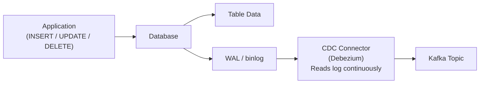
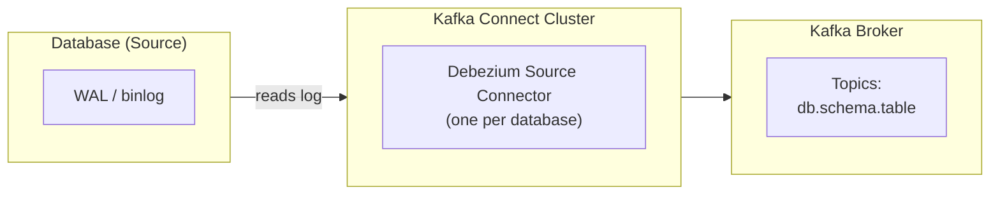
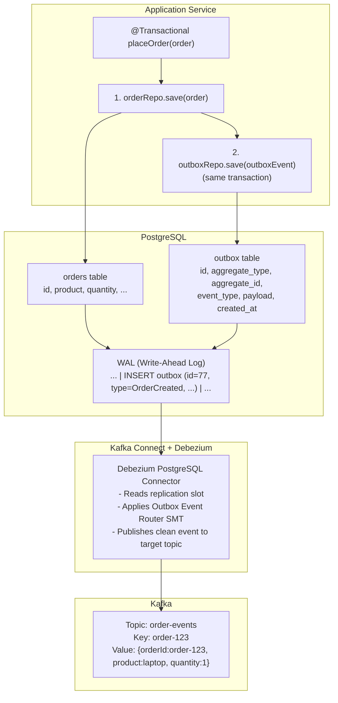

# Kafka — Chapter 15: Outbox Pattern — CDC with Debezium

> Don't poll the database for changes — let the database tell you what changed.

---

## What is CDC (Change Data Capture)?

CDC is a technique where you **read the database's internal transaction log** to capture every data change as an event. Instead of your application asking "has anything changed?", the database's own log becomes the source of truth for what happened and when.

Every relational database maintains an internal log for crash recovery and replication:

| Database   | Log Name                  | Purpose                          |
|------------|---------------------------|----------------------------------|
| PostgreSQL | WAL (Write-Ahead Log)     | Crash recovery, replication      |
| MySQL      | binlog (Binary Log)       | Replication, point-in-time recovery |
| SQL Server | Transaction Log           | Recovery, replication            |
| MongoDB    | Oplog (Operations Log)    | Replica set synchronization      |

CDC tools read these logs and convert each entry into a structured event.

### CDC vs Polling

| Aspect          | Polling                              | CDC                                   |
|-----------------|--------------------------------------|---------------------------------------|
| Mechanism       | Periodic SQL query                   | Read from transaction log             |
| Latency         | Seconds to minutes                   | Milliseconds                          |
| Database load   | Adds read queries every interval     | Zero — reads the log, not the tables  |
| Captures DELETEs| Only with soft-delete flag           | Yes — log records all operations      |
| Ordering        | No guarantee                         | Natural WAL ordering                  |
| Missed changes  | Possible if polling window is too large | Impossible — every change is in the log |

### How CDC Works — The Data Flow



The application writes data normally. The database writes to its transaction log. The CDC connector tails the log and publishes events to Kafka. The application doesn't even know CDC exists.

---

## Debezium — The Tool That Implements CDC

Debezium is an **open-source CDC platform** built on top of Kafka Connect. It provides production-ready source connectors for all major databases.

### Supported Databases

| Database   | Connector Class                                  | Log Source           |
|------------|--------------------------------------------------|----------------------|
| PostgreSQL | `io.debezium.connector.postgresql.PostgresConnector` | Logical replication  |
| MySQL      | `io.debezium.connector.mysql.MySqlConnector`     | binlog               |
| MongoDB    | `io.debezium.connector.mongodb.MongoDbConnector`  | Oplog / Change Streams |
| SQL Server | `io.debezium.connector.sqlserver.SqlServerConnector` | Transaction log (CT) |
| Oracle     | `io.debezium.connector.oracle.OracleConnector`   | LogMiner / XStream   |

### Architecture



Debezium runs **inside** Kafka Connect. You deploy it as a connector, not as a standalone process. Kafka Connect handles scaling, offset management, and fault tolerance.

---

## How Debezium Works Under the Hood

### PostgreSQL — Logical Replication Slots

1. **Replication slot**: Debezium creates a logical replication slot (e.g., `debezium_slot`). The slot tells PostgreSQL to retain WAL segments that haven't been consumed yet.
2. **Output plugin**: Uses `pgoutput` (built-in since PG 10) to decode the WAL into a structured stream of changes.
3. **Publication**: Debezium creates a PostgreSQL publication on the tables it monitors.

```sql
-- What Debezium sets up internally:
CREATE PUBLICATION dbz_publication FOR TABLE outbox;
SELECT * FROM pg_create_logical_replication_slot('debezium_slot', 'pgoutput');
```

### MySQL — Binary Log (binlog)

1. MySQL must have `binlog_format=ROW` enabled.
2. Debezium connects as a **replication replica** — it pretends to be another MySQL server.
3. It reads the binlog events (ROW format gives before/after images of each row).

### Two Phases of Operation

| Phase       | When                        | What Happens                                     |
|-------------|-----------------------------|-------------------------------------------------|
| **Snapshot** | First startup only          | Full table scan (consistent snapshot via locks)   |
| **Streaming**| After snapshot completes    | Tails the WAL/binlog in real time                |

**Offset tracking**: Debezium stores its position (LSN for Postgres, binlog file+position for MySQL) in Kafka Connect's internal offsets topic. On restart, it resumes from exactly where it left off.

---

## Outbox Pattern with Debezium — The Architecture

The CDC approach replaces the polling scheduler with a log-tailing connector. The outbox table is the same, but the mechanism to read it is fundamentally different.

### Full Flow



**Key difference from polling**: There is no scheduler, no `SELECT ... WHERE processed = false`, no `UPDATE ... SET processed = true`. The WAL is the queue. Debezium reads it once and moves on.

---

## Debezium Outbox Event Router (SMT)

Without the Event Router, Debezium publishes the **raw CDC envelope** — a verbose JSON with `before`, `after`, `source`, `op` fields. The Outbox Event Router is a **Single Message Transform (SMT)** that unwraps this into a clean domain event.

### What the SMT Does

1. **Extracts** the payload from the `after` field of the CDC event.
2. **Routes** the event to a Kafka topic based on the `aggregate_type` column.
3. **Sets** the Kafka message key from the `aggregate_id` column.
4. **Sets** headers like event ID and event type.

### Expected Outbox Table Schema

```sql
CREATE TABLE outbox (
    id            UUID         NOT NULL PRIMARY KEY,   -- event ID (for dedup)
    aggregate_type VARCHAR(255) NOT NULL,               -- e.g., "Order"
    aggregate_id   VARCHAR(255) NOT NULL,               -- e.g., "order-123"
    event_type     VARCHAR(255) NOT NULL,               -- e.g., "OrderCreated"
    payload        JSONB        NOT NULL,               -- event body
    created_at     TIMESTAMP    NOT NULL DEFAULT NOW()
);
```

### SMT Field Mapping

| SMT Config Property              | Outbox Column    | Maps To               |
|----------------------------------|------------------|-----------------------|
| `table.field.event.id`           | `id`             | Kafka header `id`     |
| `table.field.event.key`          | `aggregate_id`   | Kafka message key     |
| `table.field.event.payload`      | `payload`        | Kafka message value   |
| `table.field.event.timestamp`    | `created_at`     | Kafka timestamp       |
| `route.topic.replacement`        | `aggregate_type` | Kafka topic name      |

### Routing Example

If a row has `aggregate_type = "Order"`, the SMT publishes to topic `outbox.event.Order`. You can customize the topic pattern:

```
route.by.field: aggregate_type
route.topic.replacement: ${routedByValue}-events
```

Now `aggregate_type = "Order"` routes to topic `Order-events`.

---

## Debezium Connector Configuration

### Full Connector JSON (PostgreSQL)

```json
{
  "name": "outbox-connector",
  "config": {
    "connector.class": "io.debezium.connector.postgresql.PostgresConnector",

    "database.hostname": "postgres",
    "database.port": "5432",
    "database.user": "debezium",
    "database.password": "dbz_password",
    "database.dbname": "orderservice",

    "topic.prefix": "app",
    "schema.include.list": "public",
    "table.include.list": "public.outbox",

    "plugin.name": "pgoutput",
    "slot.name": "debezium_outbox_slot",
    "publication.name": "dbz_outbox_publication",

    "transforms": "outbox",
    "transforms.outbox.type": "io.debezium.transforms.outbox.EventRouter",
    "transforms.outbox.table.field.event.id": "id",
    "transforms.outbox.table.field.event.key": "aggregate_id",
    "transforms.outbox.table.field.event.payload": "payload",
    "transforms.outbox.table.field.event.timestamp": "created_at",
    "transforms.outbox.route.by.field": "aggregate_type",
    "transforms.outbox.route.topic.replacement": "${routedByValue}-events",

    "tombstones.on.delete": "false",
    "key.converter": "org.apache.kafka.connect.storage.StringConverter",
    "value.converter": "org.apache.kafka.connect.json.JsonConverter",
    "value.converter.schemas.enable": "false"
  }
}
```

### Key Properties Explained

| Property                 | Purpose                                                    |
|--------------------------|-----------------------------------------------------------|
| `connector.class`        | Which Debezium connector to use                            |
| `table.include.list`     | Only watch the outbox table (ignore all other tables)      |
| `plugin.name`            | WAL decoder plugin (`pgoutput` for PG 10+)                 |
| `slot.name`              | Logical replication slot name (unique per connector)       |
| `transforms`             | Apply the Outbox Event Router SMT                          |
| `topic.prefix`           | Prefix for internal Debezium topics (schema history, etc.) |
| `tombstones.on.delete`   | Disable tombstone records for outbox deletes               |

### Managing Connectors via Kafka Connect REST API

```bash
# Deploy a new connector
curl -X POST http://localhost:8083/connectors \
  -H "Content-Type: application/json" \
  -d @outbox-connector.json

# Check connector status
curl http://localhost:8083/connectors/outbox-connector/status

# Pause connector
curl -X PUT http://localhost:8083/connectors/outbox-connector/pause

# Resume connector
curl -X PUT http://localhost:8083/connectors/outbox-connector/resume

# Delete connector
curl -X DELETE http://localhost:8083/connectors/outbox-connector
```

---

## Exactly-Once Delivery with Debezium

### The Default: At-Least-Once

Debezium stores its offset (WAL position) in Kafka Connect's internal topic. If Debezium crashes **after** reading from the WAL but **before** committing its offset, it will re-read those events on restart. This gives you **at-least-once** delivery.

### Achieving Exactly-Once

There are two complementary strategies:

**1. Debezium + Kafka Transactions (KIP-618)**

Debezium 2.x supports `exactly.once.source.support = required` in Kafka Connect. This uses Kafka transactions to atomically write the event **and** the offset in a single transaction.

```json
{
  "exactly.once.source.support": "required",
  "transaction.boundary": "poll"
}
```

**Requirement**: Kafka Connect must run in **distributed mode** with `exactly.once.source.support` enabled at the worker level.

**2. Consumer-Side Deduplication**

Regardless of what the producer does, the consumer should protect itself:

```java
@KafkaListener(topics = "Order-events")
public void handle(ConsumerRecord<String, String> record) {
    String eventId = new String(record.headers()
        .lastHeader("id").value());

    if (processedEventRepo.existsById(eventId)) {
        log.info("Duplicate event {}, skipping", eventId);
        return;
    }

    // Process the event
    processOrder(record.value());

    // Mark as processed (in same transaction as business logic)
    processedEventRepo.save(new ProcessedEvent(eventId));
}
```

**3. Idempotent Business Logic**

The safest approach: design your consumers so that processing the same event twice produces the same result. Use natural keys, conditional updates, and state checks.

---

## Advantages of CDC over Polling

| Advantage                      | Explanation                                                        |
|-------------------------------|-------------------------------------------------------------------|
| **Near-real-time**            | Events arrive in milliseconds, not on a polling interval            |
| **Zero database polling load**| Reads the log, not the tables — no extra queries                    |
| **Captures everything**       | Even changes made by SQL scripts, migrations, or other services     |
| **Natural ordering**          | WAL order = commit order = correct event sequence                   |
| **DELETE support**            | No soft-delete column needed — the log captures hard deletes        |
| **No outbox bloat**           | You can DELETE rows from the outbox table after capture              |
| **Decoupled**                 | The application doesn't know CDC exists — zero code changes         |

---

## Challenges & Production Considerations

### 1. Infrastructure Complexity
CDC requires a **Kafka Connect cluster** in addition to your Kafka brokers. You need to deploy, monitor, and scale Connect workers separately.

### 2. Database Configuration
Databases need explicit configuration to enable log-based CDC:

```sql
-- PostgreSQL: enable logical replication
ALTER SYSTEM SET wal_level = 'logical';
ALTER SYSTEM SET max_replication_slots = 4;
ALTER SYSTEM SET max_wal_senders = 4;
-- Restart required

-- MySQL: enable row-based binlog
SET GLOBAL binlog_format = 'ROW';
SET GLOBAL binlog_row_image = 'FULL';
```

### 3. Replication Slot Management (PostgreSQL)
An abandoned replication slot will cause PostgreSQL to **retain WAL segments indefinitely**, eventually filling the disk.

```sql
-- Monitor slot lag
SELECT slot_name, pg_wal_lsn_diff(pg_current_wal_lsn(), restart_lsn) AS lag_bytes
FROM pg_replication_slots;

-- Drop an abandoned slot
SELECT pg_drop_replication_slot('debezium_outbox_slot');
```

### 4. Schema Changes
Debezium handles most DDL changes (adding columns, renaming), but some changes can break the connector:
- Dropping a column that the SMT references
- Changing a column type incompatibly
- Renaming the outbox table

**Best practice**: Treat the outbox table schema as a contract — version it and evolve it carefully.

### 5. Monitoring
Essential metrics to track:

| Metric                          | Why                                              |
|---------------------------------|--------------------------------------------------|
| Connector status                | Is the connector running or failed?              |
| Replication slot lag (bytes)    | Is Debezium keeping up with the WAL?             |
| Kafka Connect task count        | Are all tasks running?                           |
| Event throughput (events/sec)   | Detect drops in throughput                       |
| Consumer lag on target topics   | Are downstream consumers keeping up?             |

### 6. Failover & Recovery
When Debezium crashes or the Connect worker restarts:
1. Kafka Connect detects the failed task.
2. It reassigns the task to another worker (in distributed mode).
3. The new task reads the stored offset from Connect's internal topic.
4. It resumes reading the WAL from the last committed position.
5. Some events may be replayed (at-least-once), which is why consumers must be idempotent.

---

## Comparison: Polling vs CDC

| Dimension           | Polling (Scheduler)                | CDC (Debezium)                        |
|---------------------|------------------------------------|---------------------------------------|
| **Latency**         | Seconds to minutes (poll interval) | Milliseconds (log tailing)            |
| **Database load**   | High (repeated SELECTs)            | Minimal (reads the log)               |
| **Infrastructure**  | Simple (just a scheduler)          | Complex (Kafka Connect cluster)       |
| **Ordering**        | No inherent guarantee              | WAL order = commit order              |
| **DELETE capture**  | Needs soft-delete column           | Captures hard deletes natively        |
| **Scalability**     | Limited by DB query performance    | Scales with WAL throughput            |
| **Code changes**    | Requires scheduler + query code    | Zero application code changes         |
| **Failure recovery**| Must track last poll timestamp     | Automatic offset recovery             |
| **Operational cost**| Low                                | Medium-High (Connect ops, slot mgmt) |

**When to use Polling**: Small-scale services, prototypes, teams without Kafka Connect expertise.

**When to use CDC**: High-throughput systems, low-latency requirements, production microservices at scale.

---

## Interview Angles

**Q: What is CDC and how does it differ from polling?**
A: CDC (Change Data Capture) reads the database's internal transaction log (WAL in Postgres, binlog in MySQL) to capture every INSERT, UPDATE, and DELETE as a structured event. Unlike polling, which periodically queries the database with SELECT statements, CDC is reactive — the log is the source of truth. This gives millisecond latency, zero additional database load, natural ordering, and the ability to capture hard deletes without soft-delete columns.

**Q: How does Debezium capture changes from a PostgreSQL database?**
A: Debezium uses PostgreSQL's logical replication feature. It creates a logical replication slot and uses the `pgoutput` plugin to decode WAL entries into structured change events. On first startup, it takes a consistent snapshot of the table. After that, it streams changes in real time by tailing the WAL. It stores its position (LSN) in Kafka Connect's internal offsets topic, so it can resume from exactly where it left off after a restart.

**Q: Explain the Outbox Pattern with CDC — draw the full architecture.**
A: The application writes business data and an outbox row in the same database transaction, guaranteeing atomicity. Debezium, running as a Kafka Connect source connector, continuously reads the PostgreSQL WAL. When it detects an INSERT on the outbox table, it applies the Outbox Event Router SMT to transform the raw CDC envelope into a clean domain event, then publishes it to a Kafka topic derived from the `aggregate_type` column. There is no polling, no scheduler, and no application code involved in the publishing step.

**Q: What is the Debezium Outbox Event Router SMT and why is it needed?**
A: Without the SMT, Debezium publishes the full CDC envelope — a verbose JSON containing `before`, `after`, `source`, `op`, and `ts_ms` fields. The Outbox Event Router is a Single Message Transform that extracts the clean payload from the `after` field, sets the Kafka message key from `aggregate_id`, routes to a topic based on `aggregate_type`, and adds the event ID as a Kafka header. This turns a raw database change event into a proper domain event that downstream consumers can understand without knowing about CDC internals.

**Q: What are the production challenges of running Debezium?**
A: The main challenges are: (1) Infrastructure complexity — you need a Kafka Connect cluster in addition to Kafka brokers. (2) Database configuration — you must enable logical replication (Postgres) or row-based binlog (MySQL). (3) Replication slot management — an abandoned slot in PostgreSQL retains WAL forever and can fill the disk. (4) Schema evolution — changes to the outbox table can break the connector or the SMT mapping. (5) Monitoring — you need to track connector status, replication lag, and throughput. (6) Exactly-once semantics require additional configuration (Kafka transactions) or consumer-side deduplication.

**Q: How do you handle exactly-once delivery with CDC?**
A: There are three layers. First, Debezium 2.x with Kafka Connect supports `exactly.once.source.support`, which uses Kafka transactions to atomically write the event and the offset. Second, consumers should implement deduplication by storing processed event IDs (from the Kafka header set by the SMT) and checking before processing. Third, business logic should be designed to be idempotent — processing the same event twice should produce the same result. In practice, you combine all three: transactional source writes, consumer dedup, and idempotent processing.

**Q: What happens if Debezium crashes mid-stream?**
A: Kafka Connect detects the failed task and reassigns it to another worker in the cluster. The new worker reads the last committed offset from Connect's internal topic and resumes reading the WAL from that position. Since the offset may be slightly behind the actual last published event, some events could be replayed. This is why Debezium provides at-least-once delivery by default, and consumers must handle duplicates gracefully.

**Q: Can you DELETE rows from the outbox table after Debezium captures them?**
A: Yes, and you should. Unlike the polling approach where you need a `processed` flag or soft-delete, CDC captures the INSERT from the WAL at the moment it happens. Once captured, the row in the outbox table serves no purpose. You can run a periodic cleanup job (`DELETE FROM outbox WHERE created_at < NOW() - INTERVAL '1 hour'`) without losing any events. The DELETE itself will be captured by Debezium, but the Outbox Event Router SMT is configured to ignore deletes (`tombstones.on.delete = false`).
