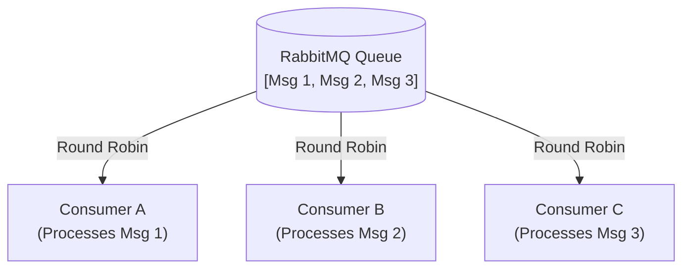
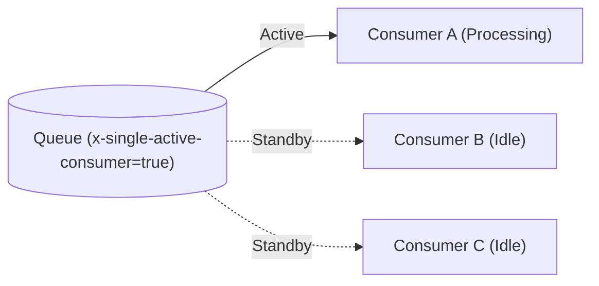
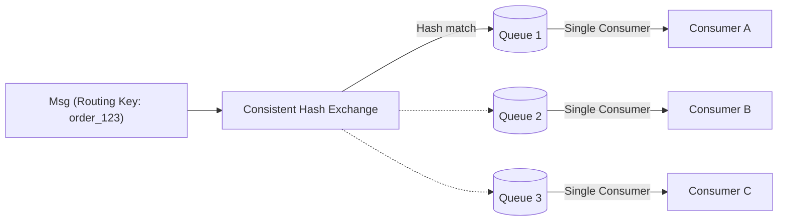
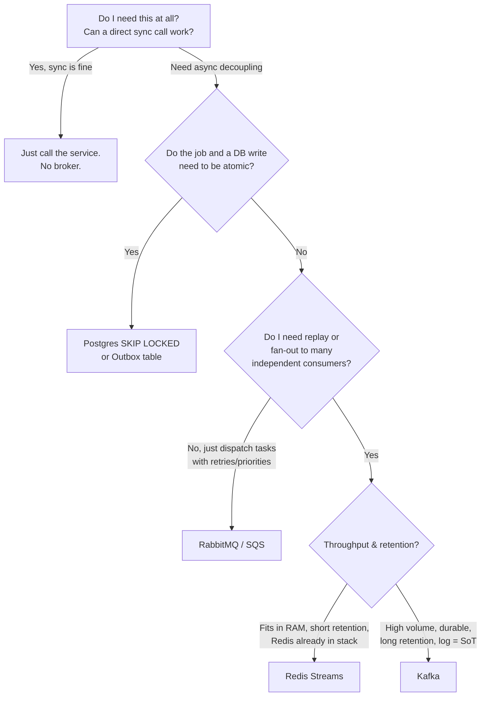

# Kafka — Chapter 16: Kafka vs Alternatives & When NOT to Use It

> The best engineers know when *not* to reach for Kafka. Distributed infrastructure is a liability you pay for forever — only take it on when the workload demands it.

---

## Why This Chapter Matters

Most Kafka material teaches you *how* Kafka works. Interviews — especially at companies that run lean, Postgres-heavy backends — test whether you reach for Kafka reflexively or whether you can justify the choice. "We need a queue, so Kafka" is a junior answer. The senior answer weighs throughput, latency, operational cost, and delivery semantics, then picks the *simplest* tool that meets the requirement.

A running cluster is cost you pay every day: brokers to patch, ZK/KRaft quorum to babysit, consumer lag to monitor, rebalances to debug, partition counts to capacity-plan. If a single Postgres table or a Redis Stream meets your throughput and durability needs, that is usually the better engineering decision.

---

## 1. The Mental Model — Log vs Broker vs Database

There are three fundamentally different shapes of "messaging," and conflating them is the root of most bad design decisions.

| Shape | Examples | Core idea | Message after consume |
|-------|----------|-----------|------------------------|
| **Distributed log** | Kafka, Pulsar, Redis Streams | Append-only, ordered, **retained**; consumers track their own offset | Stays — replayable by any consumer |
| **Message broker / queue** | RabbitMQ, ActiveMQ, SQS | Broker pushes/holds messages, deletes on ack; per-message routing | Deleted on ack |
| **Database-as-queue** | Postgres `SKIP LOCKED`, a `jobs` table | Rows are work items; transactional with your data | Deleted/marked done in same txn |

**Kafka is a log, not a queue.** The single most important distinction:

- A **queue** (RabbitMQ/SQS) deletes a message once it's acknowledged. Routing, priorities, and per-message TTL are first-class. You cannot easily replay.
- A **log** (Kafka) retains every message for a retention window regardless of who read it. Consumers are dumb cursors; the broker does almost no per-message work. Replay is trivial — just reset the offset. Per-message routing/priority is *not* a thing.

If your problem is "fan out a stream of events to many independent consumers, allow replay, and scale to millions/sec" → log. If it's "dispatch discrete tasks to workers, with retries, priorities, and per-message acks" → queue. If it's "process the rows I just wrote, transactionally" → database.

---

## 2. Kafka vs RabbitMQ

| Aspect | Kafka | RabbitMQ |
|--------|-------|----------|
| Model | Distributed log (pull) | Broker / smart routing (push) |
| Retention | Time/size based; messages persist after read | Deleted on ack |
| Replay | Native — reset offset | Not natively; needs re-publish |
| Ordering | Per-partition | Per-queue (lost with competing consumers) |
| Routing | Dumb broker; consumer filters | Rich — exchanges, topics, headers, bindings |
| Priority queues | No | Yes |
| Throughput | Very high (100k–millions/s) | Moderate (10k–50k/s typical) |
| Per-message TTL / delay | Awkward | First-class |
| Consumer model | Consumer groups pull at own pace | Broker pushes; prefetch controls flow |
| Best for | Event streaming, log aggregation, replayable pipelines, high fan-out | Task/job dispatch, complex routing, RPC, request/reply, priorities |

**One-liner:** *RabbitMQ is a smart broker with dumb consumers; Kafka is a dumb broker with smart consumers.* RabbitMQ does work per message (routing, acks, redelivery); Kafka pushes that intelligence to the consumer (offset tracking) and so scales far higher.

**Choose RabbitMQ when:** you need per-message routing/priority/delay, request-reply (RPC), modest throughput, and you do *not* need replay. Classic fit: a task queue for sending emails, generating PDFs, image processing.

**Choose Kafka when:** you need replay, high fan-out to multiple independent consumer groups, ordered streams, very high throughput, or the event log itself is a source of truth (event sourcing, CDC).

### RabbitMQ Competing Consumers & The Ordering Problem

Unlike Kafka, **RabbitMQ queues do not have partitions**. A queue is a single FIFO structure. 

#### Competing Consumers Pattern
You can attach **multiple consumers to a single RabbitMQ queue** to process messages in parallel. This is called the *Competing Consumers* pattern. RabbitMQ distributes messages to these consumers in a round-robin fashion.



#### ⚠️ The Catch: Loss of Ordering
Because multiple consumers process messages concurrently, **message ordering is lost**. 
* If *Consumer B* is faster than *Consumer A*, **Message 2** will complete processing before **Message 1**.
* If *Consumer A* crashes while processing **Message 1**, the message is re-queued and delivered to *Consumer C*, completely out of sequence.

#### How to Solve Ordering in RabbitMQ:

##### Solution 1: Single Active Consumer (SAC)
You can mark a queue with the `x-single-active-consumer` argument. 
* Only **one** consumer is active and receives messages (guaranteeing strict ordering).
* Other consumers are kept as **standbys**. If the active consumer dies, RabbitMQ automatically promotes one standby consumer to active.
* *Trade-off*: You lose parallel processing throughput.



##### Solution 2: Consistent Hash Exchange (Simulating Partitions)
To get both **ordering and parallel processing**, you can simulate Kafka's partitioning:
1. Create multiple queues (e.g., `queue_1`, `queue_2`, `queue_3`).
2. Bind them to a **Consistent Hash Exchange**.
3. Publish messages with a routing key (e.g., `order_id`). The exchange hashes the routing key and routes all events for a specific `order_id` to the same queue.
4. Run **exactly one consumer per queue**.



---

## 3. Kafka vs AWS SQS / SNS

| Aspect | Kafka | SQS (+ SNS) |
|--------|-------|-------------|
| Ops burden | You run the cluster | Fully managed, serverless |
| Ordering | Per-partition | Only FIFO queues, lower throughput |
| Replay | Yes | No (message deleted after ack/visibility) |
| Fan-out | Many consumer groups, all replayable | SNS fan-out to multiple SQS queues, no replay |
| Throughput | Very high | Standard SQS near-unlimited but no order; FIFO ~3k/s (300/s w/o batching) |
| Retention | Days–forever (tiered storage) | Max 14 days |
| Cost model | Fixed infra cost | Pay per request |

**Choose SQS when:** you're on AWS, want zero ops, have decoupled task processing, and don't need ordering or replay. It's the lowest-effort option for "just give me a durable queue."

**Choose Kafka when:** you need replay, strict ordering at scale, or multiple independent consumers of the same stream, or you're multi-cloud / on-prem.

---

## 4. Kafka vs Redis Streams

Redis Streams (`XADD` / `XREADGROUP`) is an append-only log with consumer groups — conceptually the closest thing to "mini-Kafka."

| Aspect | Kafka | Redis Streams |
|--------|-------|---------------|
| Durability | Disk + replication; survives broker loss | In-memory; durability bounded by RDB/AOF + replication |
| Retention | Large, disk-backed (GBs–TBs) | Capped by RAM (`MAXLEN` trimming) |
| Throughput | Very high, horizontally scalable | High but single-shard bound; scale via Cluster |
| Consumer groups | Yes, mature | Yes (`XREADGROUP`, `XACK`, `XPENDING`) |
| Ordering | Per-partition | Per-stream (per shard) |
| Ops | Heavy | Light — often already in your stack |
| Replay | Native | Yes, by ID range |

**Choose Redis Streams when:** you already run Redis, your volume fits in memory, retention is short (minutes–hours), and you want a lightweight log without standing up Kafka. Great for real-time fan-out, notification pipelines, moderate-volume event buses.

**Choose Kafka when:** you need durable long-term retention, throughput beyond a single Redis shard, or the log is a system of record.

---

## 5. Kafka vs Postgres-as-a-Queue (`SKIP LOCKED`)

This is the most under-appreciated alternative and the one most likely to impress a lean-infra interviewer. If you **already have Postgres**, you may already have a perfectly good queue.

```sql
-- Worker pulls a batch of jobs atomically; concurrent workers never collide.
WITH job AS (
    SELECT id
    FROM   outbox
    WHERE  status = 'PENDING'
    ORDER  BY id
    FOR UPDATE SKIP LOCKED      -- the magic: skip rows another txn already locked
    LIMIT  100
)
UPDATE outbox o
SET    status = 'PROCESSING'
FROM   job
WHERE  o.id = job.id
RETURNING o.*;
```

`FOR UPDATE SKIP LOCKED` lets N workers each grab a disjoint batch with zero contention and zero double-processing — no broker required. Mark rows `DONE` (or delete) in the same transaction that does the work, and you get **transactional, exactly-once-ish** processing for free, because the job and your business write share one ACID transaction.

| Aspect | Kafka | Postgres `SKIP LOCKED` |
|--------|-------|------------------------|
| Extra infra | Yes (cluster) | None — reuse your DB |
| Transactional with business data | No (needs outbox) | **Yes, natively** |
| Throughput ceiling | Millions/s | ~1k–10k jobs/s before DB strain |
| Ordering | Per-partition | `ORDER BY`, but contention grows |
| Replay / multi-consumer fan-out | Excellent | Poor — built for work distribution, not fan-out |
| Retention of history | Native | You manage table growth (archiving/partitioning) |
| Operational simplicity | Low | **High** |

**Choose Postgres-as-a-queue when:** throughput is modest (thousands/s), you want the job and the data change to be atomic, you have a single logical consumer pool, and you'd rather not run a cluster. This is the Zerodha-style answer: *"For this volume I'd use a Postgres jobs table with `SKIP LOCKED` before introducing Kafka."*

**Outgrow it when:** you need replay, high fan-out to many independent consumers, ordering at high scale, or throughput the DB can't sustain. (Note: the **Outbox Pattern** — Ch.14/15 — is the bridge: Postgres for the transactional write, Kafka for the durable stream.)

---

## 6. Kafka vs Apache Pulsar (briefly)

Pulsar is the main "next-gen" competitor. Separates **compute (brokers)** from **storage (BookKeeper)**, so you scale them independently. Native multi-tenancy, geo-replication, and tiered storage; supports both queue *and* streaming semantics in one system.

- **Pulsar edge:** independent scaling of storage/compute, built-in multi-tenancy, easier to add brokers without rebalancing partitions.
- **Kafka edge:** vastly larger ecosystem (Connect, Streams, ksqlDB, tooling, hiring pool), more battle-tested, simpler operational story for a single team.

In an interview: know Pulsar exists and *why* (compute/storage separation), but Kafka's ecosystem maturity is usually the deciding factor.

---

## 7. The Decision Framework

Ask these in order. Stop at the first that resolves your case:



**Heuristics:**
- **< ~1k msg/s, transactional with data** → Postgres `SKIP LOCKED` / Outbox.
- **Task dispatch, routing/priority, no replay** → RabbitMQ (self-host) or SQS (AWS).
- **Real-time fan-out, fits in memory, short retention** → Redis Streams.
- **High-throughput durable streaming, replay, multiple consumer groups, log as source of truth** → Kafka.

---

## 8. Legitimate Reasons NOT to Use Kafka

1. **Operational cost outweighs benefit.** A cluster needs patching, monitoring, capacity planning, and on-call expertise. For a small team with modest volume, that's a permanent tax for capability you don't use.
2. **You need request/reply (RPC).** Kafka is fire-and-forget streaming. Synchronous request-response is an anti-pattern on Kafka — use gRPC/HTTP or RabbitMQ RPC.
3. **You need per-message priority, delay, or TTL.** Kafka has none of these natively. RabbitMQ does.
4. **Low / bursty volume.** If you do thousands of messages a *day*, Kafka is wildly over-provisioned. A DB table or SQS is simpler and cheaper.
5. **Strict global ordering across everything.** Kafka only guarantees order *within a partition*. Total order means one partition = no parallelism = you didn't need Kafka's scaling.
6. **You must be transactional with a single database.** Kafka can't join your DB transaction (no XA bridge). Use the Outbox Pattern, but recognize the transactional core is Postgres, not Kafka.
7. **Tiny payloads with ultra-low-latency point-to-point needs.** A direct call or Redis is lower latency than the produce → replicate → fetch round trip.

---

## 9. Legitimate Reasons TO Use Kafka

- **Event streaming / event sourcing** where the log itself is the source of truth.
- **High throughput** — hundreds of thousands to millions of messages/sec, scaled by adding partitions and brokers.
- **Replay** — reprocess history after a bug fix, backfill a new service, or feed a new ML model from the same stream.
- **Fan-out to many independent consumers** — each consumer group reads the full stream at its own pace, independently.
- **Durable buffering / decoupling** — absorb traffic spikes; producers and consumers scale independently.
- **Log aggregation, metrics, CDC pipelines** — the canonical "many producers, many consumers, durable, ordered" workloads.

---

## 10. Interview Angles

**Q: You need to decouple two services with async messaging. Why might you *not* choose Kafka?**
A: Because Kafka is a heavyweight distributed log with real operational cost, and "decouple two services" rarely needs that. I'd first ask about volume, ordering, replay, and whether the message must be transactional with a database write. For modest volume with no replay need, a Postgres `SKIP LOCKED` table or SQS/RabbitMQ is simpler. I'd only choose Kafka if I needed high throughput, replay, fan-out to multiple independent consumers, or the event log as a source of truth. Reaching for Kafka by default is over-engineering — the cluster is a permanent tax (patching, monitoring, rebalances, capacity planning) you should only pay when the workload justifies it.

**Q: What's the fundamental difference between Kafka and RabbitMQ?**
A: Kafka is a distributed *log*: append-only, retained, and consumers are dumb cursors that track their own offset and pull at their own pace. RabbitMQ is a *broker*: it does smart per-message routing (exchanges, bindings, priorities), pushes to consumers, and deletes messages on ack. Phrased as a one-liner: RabbitMQ is a smart broker with dumb consumers; Kafka is a dumb broker with smart consumers. That's exactly why Kafka scales higher — it does almost no per-message work — and why RabbitMQ supports replay-less features like priorities and per-message TTL that Kafka can't. Replay, high fan-out, and ordering at scale → Kafka. Routing, priorities, RPC, modest volume → RabbitMQ.

**Q: When would you use a database table as a queue instead of Kafka?**
A: When throughput is modest (thousands/s or less), I already run the database, and — crucially — when the job needs to be atomic with a business data change. With `SELECT … FOR UPDATE SKIP LOCKED`, multiple workers pull disjoint batches with no contention and no double-processing, and because I mark the row done in the *same* transaction that does the work, I get effectively exactly-once processing with zero extra infrastructure. Kafka can't do that — it can't join my DB transaction, which is the whole reason the Outbox Pattern exists. I'd outgrow the DB-as-queue approach when I need replay, fan-out to many consumers, or throughput the database can't sustain.

**Q: Kafka guarantees ordering — true or false?**
A: Only *within a partition*. There is no global ordering across a topic. If you genuinely need total ordering you must use a single partition, which kills parallelism — at which point Kafka's scaling advantage is gone and you should reconsider whether you needed Kafka at all. In practice you partition by a key (e.g. `accountId`) so all events for one entity are ordered, and you accept no ordering across different keys. Designing for "per-key ordering" instead of "global ordering" is the correct mindset.

**Q: How is Redis Streams different from Kafka, and when would you pick it?**
A: Redis Streams is conceptually a mini-Kafka: an append-only log with consumer groups (`XREADGROUP`, `XACK`, `XPENDING`) and replay by ID. The differences are durability and scale — Redis is memory-bound, so retention is capped by RAM and throughput by the shard, whereas Kafka is disk-backed, replicated, and horizontally scalable to TBs and millions/sec. I'd pick Redis Streams when I already run Redis, my volume fits in memory, and retention is short (minutes to hours) — it saves me from standing up and operating a whole Kafka cluster. I'd move to Kafka when I need durable long-term retention, throughput beyond a single shard, or the log as a system of record.

**Q: Walk me through how you'd decide between Kafka, RabbitMQ, SQS, Redis Streams, and a DB table.**
A: I work down a decision tree. First: do I even need async, or does a sync call suffice? If async — does the work need to be atomic with a DB write? If yes, Postgres `SKIP LOCKED` or the Outbox pattern. If no — do I need replay or fan-out to many independent consumers? If no, it's just task dispatch: RabbitMQ (rich routing, priorities, self-host) or SQS (zero-ops on AWS). If yes — what's the volume and retention? If it fits in memory with short retention and I already run Redis, Redis Streams. Otherwise, for high-volume durable streaming with replay and the log as source of truth, Kafka. The principle throughout is: pick the simplest tool that meets the requirement, because every piece of distributed infrastructure is a cost I pay forever.

**Q: Your team proposes Kafka for a feature doing ~500 messages/day. What do you say?**
A: That's roughly one message every three minutes — Kafka is enormously over-provisioned for it, and the cluster's operational overhead would dwarf the feature itself. I'd push back and propose a Postgres table (with `SKIP LOCKED` if there are concurrent workers) or, if we're on AWS, an SQS queue. Both give durability and decoupling with effectively zero ops. I'd only revisit Kafka if we expected the volume to grow by orders of magnitude or we needed replay/fan-out we don't have today. Choosing infrastructure to match *current* requirements, not imagined future ones, is the discipline here — and you can always introduce Kafka later behind the same publishing interface.
