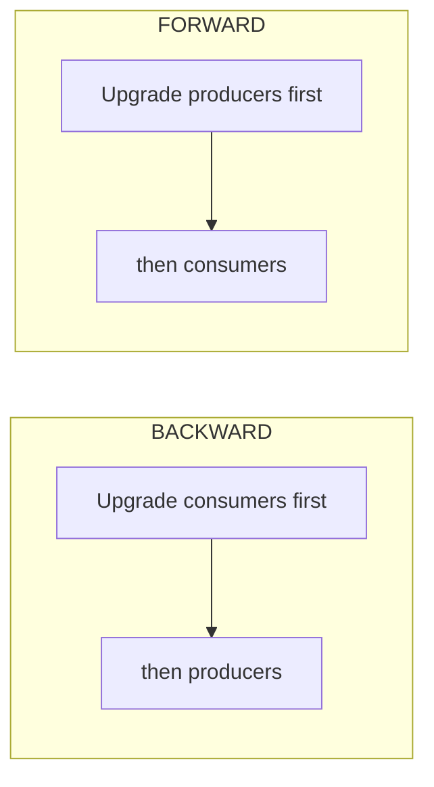

# Kafka — Chapter 17: Topic Design, Sizing, Retention, Security & Schema Compatibility

> Anyone can create a topic. Designing one — picking the partition count, retention policy, and compatibility rules that you won't regret in production — is the senior skill.

---

## 1. Partition Count — The Most Consequential Decision

Partition count is set at topic creation and is **painful to change later** (you can add partitions but never remove them, and adding them breaks key-based ordering — see §1.4). Get it right up front.

### 1.1 Why partition count matters

Partitions are the unit of:
- **Parallelism** — one partition is consumed by *at most one* consumer in a group. Max consumer parallelism = partition count. 10 partitions → at most 10 active consumers; an 11th sits idle.
- **Ordering** — Kafka guarantees order only *within* a partition.
- **Throughput** — each partition is a set of sequential files; more partitions = more parallel disk I/O and more network connections.

### 1.2 The sizing formula

The standard back-of-envelope:

```
partitions = max( T / Pp , T / Pc )

T   = target throughput (MB/s or msg/s)
Pp  = throughput a single partition sustains on the producer side
Pc  = throughput a single consumer instance can process
```

In words: **take the larger of (what producers need) and (what consumers need), measured in per-partition units.** A single partition typically sustains ~**10 MB/s** comfortably (varies with hardware, message size, replication). So for 100 MB/s of writes you need ≥10 partitions for the producer side alone.

Then check the **consumer** side: if one consumer instance processes 5 MB/s and you must keep up with 100 MB/s, you need ≥20 consumers → ≥20 partitions. Take the max of both sides.

**Always add headroom** (e.g. 1.5–2×) for growth, since you can't reduce partitions later.

### 1.3 Why MORE partitions is not free

A common junior mistake is "just make it 1000 partitions to be safe." Costs:

| Cost | Why |
|------|-----|
| More open file handles | Each partition = multiple segment files + indexes on every replica |
| Longer leader election / recovery | A failed broker's partitions must all be re-elected; more partitions = longer unavailability |
| Higher end-to-end latency | Each partition adds replication overhead; tail latency rises with partition count |
| More memory on producers | Producer buffers (`RecordAccumulator`) hold a batch per partition |
| Slower, heavier rebalances | More partitions to reassign across the group |
| Controller load | More metadata to track (less severe under KRaft, but still real) |

Rule of thumb: keep per-broker partition count in the **low thousands**, and pick the smallest count that meets your throughput + parallelism target with headroom.

### 1.4 Adding partitions later breaks key ordering

Keyed records are placed by `hash(key) % partitionCount`. Change the partition count and the same key now hashes to a *different* partition — so historical ordering for that key is broken, and an entity's events can be split across two partitions. **If per-key ordering matters, over-provision partitions at creation rather than adding them later.**

---

## 2. Replication Factor & Durability Design

| Setting | Typical value | Meaning |
|---------|---------------|---------|
| `replication.factor` | **3** (prod) | Number of copies of each partition across brokers. RF=3 tolerates 1 broker loss while still meeting `min.insync.replicas=2`. |
| `min.insync.replicas` | **2** | Minimum in-sync replicas that must ack a write when `acks=all`. With RF=3 + minISR=2 you tolerate one broker down and still accept writes. |
| `acks` (producer) | **all** | Wait for all in-sync replicas. Combined with the above = no data loss on single-broker failure. |

The classic durable config is **RF=3, min.insync.replicas=2, acks=all** (covered in Ch.3/Ch.6). RF and minISR are topic-level design choices; pick them at creation alongside partition count.

> Trade-off: minISR=2 with RF=3 means if *two* brokers are down for that partition, producers get `NotEnoughReplicasException` and writes are rejected — Kafka chooses **consistency over availability** here. That's usually correct for financial data.

---

## 3. Retention & Cleanup Policy

Retention controls how long data lives. It is set per topic via `cleanup.policy`, which has two independent modes that can be combined.

### 3.1 `cleanup.policy = delete` (default — time/size retention)

Old **segments** are deleted once they exceed a time or size threshold. Deletion is per-segment, not per-message — Kafka deletes whole closed segment files, so the active segment is never touched.

| Config | Default | Meaning |
|--------|---------|---------|
| `retention.ms` | 7 days | Delete segments older than this |
| `retention.bytes` | -1 (unlimited) | Cap total partition size; delete oldest segments beyond it |
| `segment.ms` / `segment.bytes` | 7d / 1 GB | When to roll (close) the active segment so it becomes eligible |

Whichever limit (`ms` or `bytes`) is hit first triggers deletion. `retention.bytes` is **per partition**, not per topic — total topic size ≈ `retention.bytes × partitions × replication.factor`. Easy to under-estimate disk.

### 3.2 `cleanup.policy = compact` (log compaction)

Instead of deleting by age, compaction retains the **latest value per key** forever (covered in depth in Ch.4). Use for changelog/state topics where you only care about the current state of each key (e.g. "latest balance per account", `__consumer_offsets`). A `null` value is a **tombstone** that deletes the key.

### 3.3 `cleanup.policy = compact,delete` (both)

Compact to keep the latest per key, *and* also delete records older than `retention.ms`. Useful when you want current state per key but don't want unbounded growth from keys that go silent.

| Policy | Keeps | Use case |
|--------|-------|----------|
| `delete` | All records within time/size window | Event streams, logs, metrics |
| `compact` | Latest record per key (forever) | State/changelog, KTables, offsets |
| `compact,delete` | Latest per key + bounded by retention | Long-lived state with a TTL |

### 3.4 Tiered storage (KIP-405, GA in Kafka 3.6+)

Offloads old segments to cheap object storage (S3/GCS) while recent data stays on broker disks. Lets you keep **very long retention** (months/years) without buying broker disk — decouples storage from compute. Know it exists and *why* (cost-efficient long retention, faster broker recovery since less local data); deep config is rarely asked.

---

## 4. Security — TLS, SASL, ACLs, Quotas

Kafka is insecure by default (plaintext, no auth). Production hardening has three layers + quotas.

### 4.1 Encryption in transit — TLS/SSL

`security.protocol` selects the listener mode:

| Protocol | Encryption | Authentication |
|----------|-----------|----------------|
| `PLAINTEXT` | None | None (dev only) |
| `SSL` | TLS | Optional mutual TLS (client certs) |
| `SASL_PLAINTEXT` | None | SASL |
| `SASL_SSL` | TLS | SASL over TLS (**recommended for prod**) |

TLS encrypts client↔broker and broker↔broker traffic. Note: TLS breaks zero-copy `sendfile` (data must pass through the JVM to decrypt), a real throughput cost — a relevant trade-off when latency-sensitive.

### 4.2 Authentication — SASL mechanisms

| Mechanism | Notes |
|-----------|-------|
| `SASL/PLAIN` | Username/password; only safe over TLS |
| `SASL/SCRAM` (SHA-256/512) | Salted challenge-response; credentials stored hashed in Kafka — common self-managed choice |
| `SASL/GSSAPI` (Kerberos) | Enterprise/Hadoop environments |
| `SASL/OAUTHBEARER` | OAuth2 token-based; integrates with an IdP |
| mTLS | Client identity = certificate subject (no SASL needed) |

### 4.3 Authorization — ACLs

Once a client is authenticated (a **principal**), ACLs decide what it can do:

```bash
# Allow principal alice to PRODUCE to topic "orders"
kafka-acls --bootstrap-server ... --add \
  --allow-principal User:alice \
  --operation Write --topic orders

# Allow consumer group "billing" to READ
kafka-acls --bootstrap-server ... --add \
  --allow-principal User:billing-svc \
  --operation Read --topic orders --group billing
```

ACLs are `(principal, operation, resource)` rules — operations like Read, Write, Create, Describe over resources (topic, group, cluster, transactional-id). Default is **deny** once an authorizer is configured.

### 4.4 Quotas — protecting the cluster

Prevent a noisy client from starving others:
- **Network bandwidth quotas** — cap produce/fetch bytes/sec per client/user.
- **Request rate quotas** — cap broker CPU time (% of threads) a client may use.

Throttled clients aren't errored — the broker *delays* their responses, applying back-pressure. Essential for multi-tenant clusters.

---

## 5. Schema Compatibility (Schema Registry)

Ch.5 / the Avro note introduce Schema Registry. The piece interviewers push on is **compatibility modes** — what schema change is safe to deploy without breaking producers or consumers. The mode is enforced at registration time: a new schema version is rejected if it violates the configured rule.

### 5.1 The modes

| Mode | A new schema may… | Safe to upgrade FIRST |
|------|-------------------|------------------------|
| `BACKWARD` (default) | be read by consumers using it to read data written with the **previous** schema | **Consumers** |
| `FORWARD` | be used to write data that consumers on the **previous** schema can still read | **Producers** |
| `FULL` | both backward and forward compatible | Either |
| `*_TRANSITIVE` | same, but checked against **all** prior versions, not just the last | — |
| `NONE` | anything (no checks) | Avoid in prod |

### 5.2 What each actually permits

- **BACKWARD** (new schema reads old data): you may **delete a field** or **add an optional field with a default**. You may **not** add a required field (old data has no value for it). → Upgrade **consumers first**, then producers. This is the default and the most common choice.
- **FORWARD** (old schema reads new data): you may **add a field** or **delete an optional field**. You may **not** delete a required field. → Upgrade **producers first**.
- **FULL**: only changes that satisfy both — effectively, add/remove **optional fields with defaults**.
- **TRANSITIVE** variants check the new schema against *every* historical version, not just the immediately previous one. Use when consumers might be reading very old data.

### 5.3 The deployment-order takeaway

The mode dictates **rollout order**, which is the real interview point:



If you can't control rollout order across teams, choose **FULL** (or **FULL_TRANSITIVE**) so order doesn't matter — at the cost of only allowing optional-field changes.

---

## 6. Interview Angles

**Q: How do you decide how many partitions a topic needs?**
A: I size by throughput and parallelism. The formula is `partitions = max(T/Pp, T/Pc)` — target throughput divided by what a single partition sustains on the producer side, versus what a single consumer instance can process, take the larger. A partition handles roughly 10 MB/s, so 100 MB/s of writes needs ≥10 partitions for producers; then I check the consumer side, since a partition is consumed by at most one consumer in a group, so partition count caps my consumer parallelism. I add 1.5–2× headroom because you can add partitions but never remove them, and adding them rehashes keys and breaks per-key ordering. I also avoid over-partitioning — too many partitions means more file handles, slower leader election and rebalances, and higher tail latency.

**Q: Why is adding partitions to an existing topic risky?**
A: Keyed records map to a partition by `hash(key) % partitionCount`. If I add partitions, the same key now hashes to a different partition, so an entity's events get split across the old and new partitions — historical ordering for that key is broken and consumers may see events out of order during the transition. So if per-key ordering matters, I over-provision partitions at creation time rather than scaling them later.

**Q: What does `min.insync.replicas` do, and what's the trade-off?**
A: With `acks=all`, a write is only acknowledged once at least `min.insync.replicas` replicas have it. The durable config is RF=3, minISR=2, acks=all — that tolerates losing one broker while still accepting writes with no data loss. The trade-off is availability: if two replicas for a partition are down, the in-sync set drops below 2 and producers get `NotEnoughReplicasException` — Kafka rejects writes rather than risk durability. That's choosing consistency over availability, which is the right call for financial data.

**Q: Explain Kafka's retention policies.**
A: `cleanup.policy` has two modes. `delete` (the default) removes whole segments older than `retention.ms` or beyond `retention.bytes` — note `retention.bytes` is per partition, so total disk is roughly that times partitions times replication factor. `compact` keeps only the latest value per key forever, for changelog/state topics like `__consumer_offsets`, with null values as tombstones that delete a key. You can combine them as `compact,delete` to keep latest-per-key but still bound it with a TTL. For very long retention without buying broker disk, tiered storage (KIP-405) offloads old segments to object storage like S3.

**Q: How would you secure a Kafka cluster?**
A: Three layers plus quotas. Encryption in transit via TLS — in production I use `SASL_SSL`. Authentication via SASL — typically SCRAM-SHA-512 for self-managed (credentials stored hashed), or mTLS where the client cert is the identity, or OAUTHBEARER against an IdP. Authorization via ACLs — once an authorizer is on, the default is deny, and I grant explicit `(principal, operation, resource)` rules like "alice may Write to orders." And quotas — bandwidth and request-rate limits per client so one noisy tenant can't starve the cluster; throttled clients are delayed, not errored. One caveat: TLS defeats Kafka's zero-copy `sendfile` optimization since data must pass through the JVM to decrypt, so there's a throughput cost to weigh.

**Q: What is schema compatibility and why does the mode matter?**
A: Schema Registry enforces a compatibility rule when a new schema version is registered, so a breaking change is rejected before it reaches production. The mode determines what changes are allowed and, crucially, the rollout order. BACKWARD (the default) means the new schema can read data written with the old one — you can delete a field or add an optional field with a default, and you upgrade consumers first. FORWARD means old consumers can still read data written with the new schema — you can add a field, and you upgrade producers first. FULL requires both, so effectively only optional-field changes. The TRANSITIVE variants check against all historical versions, not just the previous one. If I can't coordinate rollout order across teams, I'd use FULL so order doesn't matter.

**Q: A consumer in your group is idle and processing nothing. Why?**
A: Almost certainly there are more consumers in the group than partitions on the topic. A partition is assigned to at most one consumer per group, so if I have 6 partitions and 8 consumers, 2 sit idle as hot standbys — they only get work after a rebalance when an active consumer dies. The fix is to align partition count with desired consumer parallelism: partition count is the ceiling on how many consumers can do work in parallel.
