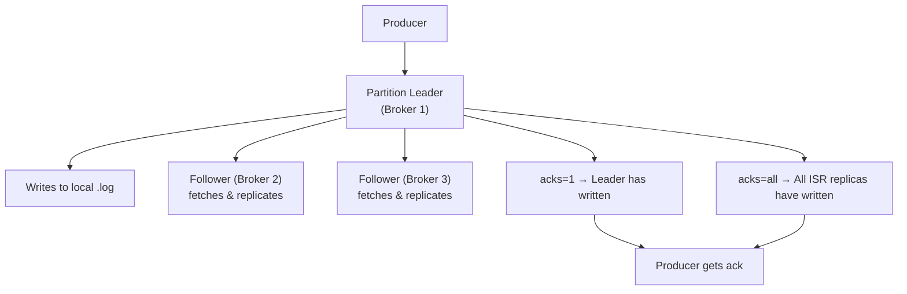
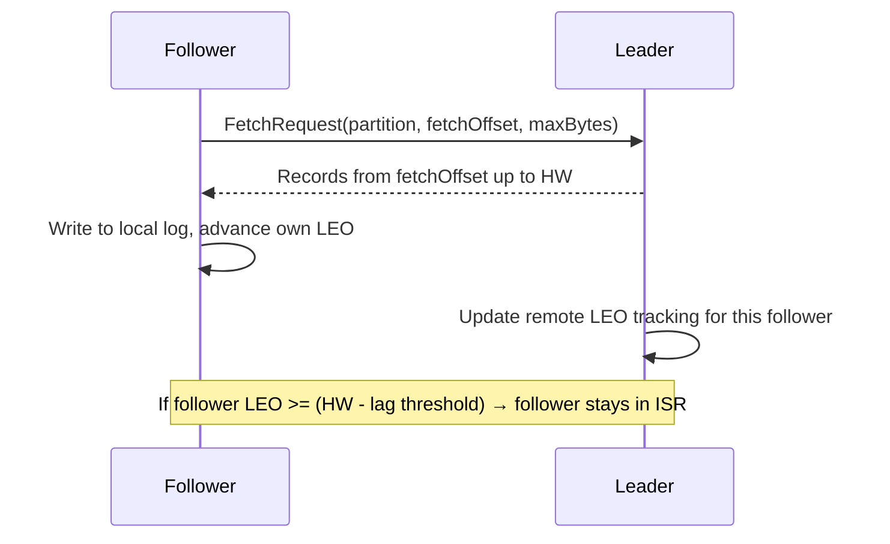
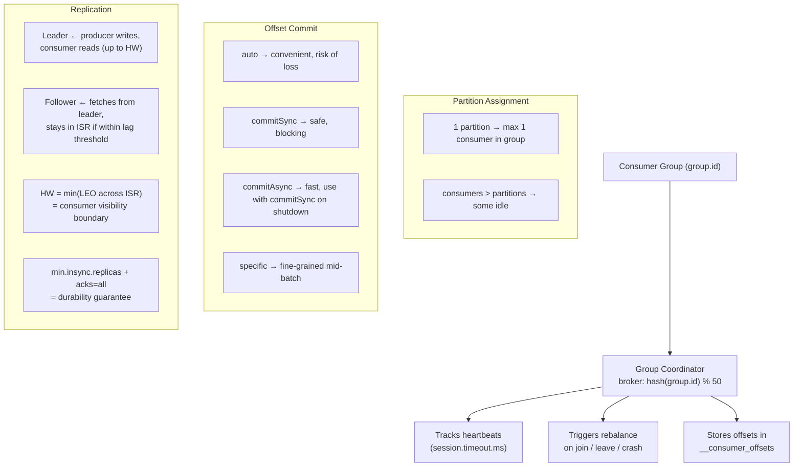

# Kafka — Chapter 2: Consumer, Groups, Offsets & Cluster Replication

Topics covered: Consumer · Consumer Group Rules · `__consumer_offsets` · Offset Commit Strategies · Leader/Follower Partition Replication

---

## 1. Consumer

### What
A **consumer** is a client that reads (polls) records from one or more Kafka topic-partitions. Unlike a traditional queue (where reading a message deletes it), reading a message in Kafka does **not** remove it. Multiple consumers can read the same topic independently.

> **💡 Noob-friendly Analogy:** A consumer is like a subscriber reading a magazine series. Multiple people (different consumers) can subscribe to the same magazine (topic) and read the articles at their own speed. Reading a page doesn't erase the text for the next person!

> **📬 The Mailbox Metaphor for the Poll Loop:** Think of `poll()` as checking your physical mailbox. If you check it regularly, everything is fine. But if you stop checking your mailbox for too long (exceeding `max.poll.interval.ms`), the post office assumes you moved away, empties your mailbox, and forwards your mail to your neighbors (rebalance!).

### How

**Poll loop — the only way to consume:**

```java
Properties props = new Properties();
props.put(ConsumerConfig.BOOTSTRAP_SERVERS_CONFIG, "localhost:9092");
props.put(ConsumerConfig.GROUP_ID_CONFIG, "order-processor");
props.put(ConsumerConfig.KEY_DESERIALIZER_CLASS_CONFIG, StringDeserializer.class);
props.put(ConsumerConfig.VALUE_DESERIALIZER_CLASS_CONFIG, StringDeserializer.class);
props.put(ConsumerConfig.AUTO_OFFSET_RESET_CONFIG, "earliest");
props.put(ConsumerConfig.ENABLE_AUTO_COMMIT_CONFIG, false); // manual commits

KafkaConsumer<String, String> consumer = new KafkaConsumer<>(props);
consumer.subscribe(List.of("orders"));

try {
    while (true) {
        ConsumerRecords<String, String> records = consumer.poll(Duration.ofMillis(100));
        for (ConsumerRecord<String, String> record : records) {
            process(record);  // your business logic
        }
        consumer.commitSync(); // commit after processing batch
    }
} finally {
    consumer.close(); // sends LeaveGroup, triggers rebalance
}
```

**Key configs:**

| Config | Default | Meaning |
|--------|---------|---------|
| `auto.offset.reset` | `latest` | Where to start if no committed offset: `earliest` (from beginning) or `latest` (new messages only) |
| `enable.auto.commit` | `true` | Auto-commit offsets in background |
| `auto.commit.interval.ms` | `5000` | How often auto-commit fires |
| `max.poll.records` | `500` | Max records per `poll()` call |
| `fetch.min.bytes` | `1` | Broker waits until at least N bytes available before responding |
| `fetch.max.wait.ms` | `500` | Max time broker waits if `fetch.min.bytes` not satisfied |
| `session.timeout.ms` | `45000` | If no heartbeat received in this window → consumer assumed dead → rebalance |
| `heartbeat.interval.ms` | `3000` | How often consumer sends heartbeat to Group Coordinator |
| `max.poll.interval.ms` | `300000` | Max time between `poll()` calls — if exceeded, consumer is kicked out of group |

**Internal flow per `poll()` (The Chef & Pantry Metaphor):**

Imagine your consumer is a **Chef** (main thread), the Kafka Broker is a **Warehouse**, and the consumer has a local **Pantry** (in-memory fetch buffer).

```
[ Kafka Broker Warehouse ] ──( 1. Fetcher thread fetches in background )──> [ Local Pantry (Fetch Buffer) ]
                                                                                   │
                                                                       ( 2. poll() checks pantry )
                                                                                   ▼
                                                                             [ Chef (Thread) ]
                                                                          ( Processes Pizza Orders )
```

1. **The background fetcher:** A background thread (called the Fetcher) is constantly running to the Kafka warehouse, grabbing messages, and stocking them in your local **Pantry** (in-memory buffer).
2. **Checking the pantry:** When your code calls `poll(Duration.ofMillis(100))`, the Chef checks the Pantry:
   * If there are messages in the pantry, the Chef grabs them immediately and returns them to your loop.
   * If the pantry is empty, the Chef waits up to `100ms` for the Fetcher thread to bring something back. If nothing arrives in 100ms, `poll()` returns an empty list `[]`.
3. **Sending heartbeats (I'm alive pager):** A separate background heartbeat thread pings the Coordinator broker every `heartbeat.interval.ms` (e.g., 3 seconds) saying, *"I'm still here!"* so your group doesn't rebalance.
4. **Auto-commit watch:** If `enable.auto.commit` is true, every time the Chef calls `poll()`, they check the clock. If `auto.commit.interval.ms` (e.g., 5 seconds) has passed since the last commit, they automatically save their bookmark (offset) back to Kafka.

### Interview Angles
- **`session.timeout.ms` vs `max.poll.interval.ms`?** `session.timeout.ms` detects consumer crashes (missing heartbeats). `max.poll.interval.ms` detects consumers that are alive but stuck processing (heartbeat thread still runs, but no `poll()` call). Both trigger a rebalance when exceeded.
- **What is `auto.offset.reset=earliest` used for?** Fresh consumer group with no committed offsets — you want to read all existing messages from the beginning. Use `latest` when you only care about new messages.
- **What happens if you don't call `poll()` fast enough?** If `max.poll.interval.ms` is exceeded, the broker forces the consumer out of the group and triggers a rebalance, even if it's still sending heartbeats.

---

## 2. Consumer Group Rules

### What
A **consumer group** is a set of consumers sharing the same `group.id`. Together they coordinate to consume a topic. 

> **🍕 Noob-friendly Pizza Analogy:** 
> Imagine a large pizza cut into 4 slices (**4 partitions**). 
> * If **2 people** (2 consumers) sit down to eat, each person can eat 2 slices.
> * If **4 people** (4 consumers) sit down, everyone gets exactly 1 slice.
> * If **6 people** (6 consumers) sit down, 2 people get nothing and sit idle (**idle consumers**). You cannot have two people eating the *same* slice at the *same* time, or they will fight (break message ordering/double-processing)!

### The Rules (must memorize)

```
Rule 1: One partition → at most one consumer in the group (at a time).
Rule 2: One consumer → can hold multiple partitions.
Rule 3: consumers > partitions → excess consumers are IDLE.
Rule 4: consumers < partitions → some consumers handle multiple partitions.
Rule 5: consumers == partitions → perfect parallelism (ideal).
```

```
Topic: orders (4 partitions)

Case A — 2 consumers in group:
  Consumer 1: P0, P1
  Consumer 2: P2, P3

Case B — 4 consumers in group (ideal):
  Consumer 1: P0
  Consumer 2: P1
  Consumer 3: P2
  Consumer 4: P3

Case C — 6 consumers in group:
  Consumer 1: P0    Consumer 3: P2    Consumer 5: idle
  Consumer 2: P1    Consumer 4: P3    Consumer 6: idle
```

### Group Coordinator vs Group Leader

> **🏫 The School Project Analogy:**
> * **Group Coordinator (The Teacher):** A Kafka broker. The teacher takes attendance (heartbeats), notes who is in the classroom, and calls for a team reshuffle (rebalance) if someone leaves or joins.
> * **Group Leader (The Team Captain):** The first consumer (student) to join the group. The teacher gives the team captain a list of all students, and the captain decides who works on which partition. The captain hands the final assignment list back to the teacher, who then distributes it to everyone.

| Role | Who | What they do |
|------|-----|-------------|
| **Group Coordinator** | A Kafka broker | Manages group membership, heartbeats, triggers rebalances, stores offsets in `__consumer_offsets` |
| **Group Leader** | First consumer to join the group | Receives full member list from Coordinator, runs the partition assignment algorithm, sends assignments back to Coordinator |

How the Coordinator broker is chosen:
```
hash(group.id) % numPartitions(__consumer_offsets)
→ gives partition N of __consumer_offsets
→ leader broker of that partition = Group Coordinator
```

#### Step-by-Step Join & Assignment Flow

When a consumer group starts up or changes, here is the exact sequence:

1. **Roll Call (`JoinGroup`):** All consumers send a request to the **Group Coordinator (broker)** saying, *"I want to join the group."*
2. **Electing the Captain:** The Coordinator broker elects the first consumer that arrived to be the **Group Leader (Team Captain)**.
3. **The List:** The Coordinator broker sends a list of all active consumers and all partitions to the **Group Leader**. All other consumers are told to wait.
4. **Assigning the Work:** The **Group Leader (client-side)** runs the assignment strategy (like `RoundRobin`) on its own thread and makes the map (e.g. Consumer A → Partition 0, Consumer B → Partition 1).
   * *Note:* This happens on the **client side (your app code)** so developers can write custom assignment code without restarting the Kafka brokers!
5. **Syncing up (`SyncGroup`):** The Group Leader sends the mapping back to the Group Coordinator broker.
6. **Go to Work:** The Group Coordinator broker sends the assignments to all consumers. Each consumer now knows exactly which partition to `poll()`.
7. **Rebalance (Failures & Joins):** If a consumer crashes (stops sending heartbeats) or a new consumer joins, the Group Coordinator broker triggers a **Rebalance**, restarting this entire process from Step 1.

### Rebalance

Triggered when:
- A consumer joins the group
- A consumer leaves (calls `close()`) or crashes (heartbeat timeout)
- Topic partition count changes
- A new topic matching a subscribed pattern is created

**Steps (Eager / Stop-the-world rebalance — default pre-3.x):**
1. Coordinator sends `REBALANCE_IN_PROGRESS` to all members.
2. All consumers **revoke all partitions** and re-join.
3. Group Leader recalculates assignment.
4. Coordinator distributes new assignment.
5. Consumers resume from last committed offset.

**Cooperative Rebalance (incremental — opt-in for the plain Java consumer):**
- Only partitions that need to move are revoked; others keep consuming.
- No stop-the-world pause — reduces latency spikes.
- Not the plain-consumer default: the default `partition.assignment.strategy` is `[RangeAssignor, CooperativeStickyAssignor]` and `RangeAssignor` (eager) wins. Set `partition.assignment.strategy=CooperativeStickyAssignor` explicitly to enable it. (Kafka Streams and Spring Kafka defaults already use cooperative-sticky.)

### Partition Assignment Strategies

| Strategy | How it assigns | Use case |
|----------|---------------|----------|
| `RangeAssignor` | Sorts partitions numerically, assigns contiguous ranges per consumer | Default; can be uneven if partition count isn't divisible |
| `RoundRobinAssignor` | Round-robins across all partitions | More even distribution |
| `StickyAssignor` | Like RoundRobin but tries to keep existing assignments stable on rebalance | Minimizes repartition cost |
| `CooperativeStickyAssignor` | Sticky + cooperative (incremental) rebalance | Best for low-latency, production use |

### Interview Angles
- **Why can't two consumers in the same group read the same partition?** It would break ordering — both would process records for the same partition key independently, causing race conditions and out-of-order processing. Different groups are fine because they have independent cursors.
- **How do you scale consumers beyond partition count?** You can't — extra consumers sit idle. To scale further, increase partition count (but you can only increase, never decrease).
- **What is a "static group member"?** Set `group.instance.id` — the consumer keeps its partition assignment across restarts for up to `session.timeout.ms` without triggering a rebalance. Useful for stateful consumers (Kafka Streams).

---

## 3. `__consumer_offsets` — The Offset Store

### What
`__consumer_offsets` is an internal Kafka topic (50 partitions by default) where Kafka stores committed consumer offsets. It replaces the old ZooKeeper-based offset storage (Kafka 0.9+).

> **🔖 Noob-friendly Bookmark Analogy:**
> Imagine reading a book. When you stop reading, you put a physical bookmark in the book. If you close the book and open it the next day, you look at the bookmark and know exactly which page to start reading next.
> In Kafka, your bookmark is the **Offset**, and the list of bookmarks for all readers in the world is stored inside the `__consumer_offsets` topic.

### How

**What gets stored:**

```
Key:   <group.id, topic, partition>
Value: <committed_offset, metadata, timestamp>
```

Example entry:
```
Key:   ("order-processor", "orders", 2)
Value: (offset=1042, metadata="", timestamp=1713745200000)
```

**Critical point:** The committed offset is the **next offset to fetch**, not the last processed.
```
Last processed record: offset 1041
You commit:           offset 1042   ← next to fetch
```
If the consumer restarts, it will resume from offset 1042.

**Which broker stores your offsets?**
```
partition = hash(group.id) % 50
That partition's leader broker = your Group Coordinator
```
The same broker that coordinates your group also owns the `__consumer_offsets` partition for your group.

**Log compaction on `__consumer_offsets`:**
- The topic uses `cleanup.policy=compact` — only the latest offset per `<group, topic, partition>` key is retained.
- Committing offset=null is a tombstone (deletes the offset entry, used when a group is deleted).

### Interview Angles
- **What happens if `__consumer_offsets` goes down?** Consumers can't commit offsets and new consumers can't join groups (Coordinator is unavailable). With RF=3 (default), this requires losing 2+ brokers.
- **Can you read `__consumer_offsets` directly?** Yes, it's just a compacted topic. Tools like `kafka-consumer-groups.sh --describe` read it. Useful for monitoring lag.
- **What is consumer lag?** `lag = LEO (Log End Offset of partition) - committed offset`. High lag = consumer falling behind. Monitored via `kafka-consumer-groups.sh` or JMX metrics.

---

## 4. Offset Commit Strategies

### Overview

> **📖 Metaphors for Commit Strategies:**
> * **Auto Commit (The Distracted Friend):** Tells the teacher *"I read page 50"* before actually reading it, just because the 5-minute timer went off. If they drop the book, they'll miss some pages!
> * **Manual Sync (The Perfectionist):** Reads a paragraph, makes sure they understand it fully, then stops to write down the bookmark. It's slower because they pause, but they never miss a word.
> * **Manual Async (The Speed Reader):** Writes down the bookmark on a sticky note and throws it towards the desk while continuing to read. If they miss the desk, they don't care because they'll write another one soon anyway.

| Strategy | Config | Guarantee | Risk |
|----------|--------|-----------|------|
| Auto commit | `enable.auto.commit=true` | At-least-once (usually) | Can commit before processing → at-most-once; or process then crash before commit → at-least-once |
| Manual sync | `commitSync()` | At-least-once | Blocks thread; retries automatically |
| Manual async | `commitAsync()` | At-least-once | No auto-retry on failure (stale offset risk) |
| Specific offset | `commitSync(offsets)` | At-least-once | Fine-grained; use inside loop |

---

### Strategy 1: Auto Commit (enable.auto.commit=true)

```java
props.put(ConsumerConfig.ENABLE_AUTO_COMMIT_CONFIG, true);
props.put(ConsumerConfig.AUTO_COMMIT_INTERVAL_MS_CONFIG, 5000);
```

- A background thread commits the **latest polled offset** every `auto.commit.interval.ms`.
- Problem: commits happen independently of processing completion.

```
Timeline:
  poll()  → gets offsets 100-199
  process offset 100..150 (5s pass)
  auto-commit fires → commits offset 200  ← 151-199 not yet processed!
  crash
  restart → resumes from 200 → 151-199 LOST  (at-most-once)
```

Use only when message loss is acceptable (metrics, logs).

---

### Strategy 2: Manual Sync Commit (commitSync)

```java
props.put(ConsumerConfig.ENABLE_AUTO_COMMIT_CONFIG, false);

while (true) {
    ConsumerRecords<String, String> records = consumer.poll(Duration.ofMillis(100));
    for (ConsumerRecord<String, String> r : records) {
        process(r);
    }
    consumer.commitSync(); // blocks until broker acks; retries on retriable errors
}
```

- Commits the **latest polled offset** synchronously after processing the whole batch.
- Guarantees **at-least-once**: if crash before commit, same batch is reprocessed.
- Makes processing idempotent to handle duplicates.

---

### Strategy 3: Manual Async Commit (commitAsync)

```java
consumer.commitAsync((offsets, exception) -> {
    if (exception != null) {
        log.error("Commit failed for {}", offsets, exception);
        // DO NOT retry here — a later commitAsync may have already succeeded
    }
});
```

- Non-blocking — does not slow down the poll loop.
- **No automatic retry** — retrying a failed async commit could overwrite a more recent successful commit (stale offset problem).
- Common pattern: use `commitAsync` in the loop, `commitSync` on shutdown.

```java
try {
    while (running) {
        var records = consumer.poll(Duration.ofMillis(100));
        process(records);
        consumer.commitAsync(); // fast path
    }
    consumer.commitSync(); // reliable final commit on clean shutdown
} catch (Exception e) {
    log.error("Unexpected error", e);
} finally {
    consumer.close();
}
```

---

### Strategy 4: Commit Specific Offsets

Commit mid-batch — useful when batches are large or processing is record-by-record:

```java
Map<TopicPartition, OffsetAndMetadata> currentOffsets = new HashMap<>();
int count = 0;

for (ConsumerRecord<String, String> record : records) {
    process(record);
    currentOffsets.put(
        new TopicPartition(record.topic(), record.partition()),
        new OffsetAndMetadata(record.offset() + 1)  // +1 = next to fetch
    );
    if (++count % 100 == 0) {
        consumer.commitSync(currentOffsets); // commit every 100 records
    }
}
consumer.commitSync(currentOffsets); // commit remainder
```

### Interview Angles
- **Why does `commitAsync` not retry?** By the time the retry fires, a later `commitAsync` may have already committed a higher offset. Retrying the earlier offset would roll back the committed position — causing reprocessing of already-processed records.
- **How do you achieve exactly-once with Kafka consumers?** Two ways: (1) Write processing output + offset commit atomically to an external transactional store (e.g., DB). (2) Use Kafka transactions — consume-transform-produce with `producer.sendOffsetsToTransaction()` so offset commit is part of the same atomic transaction.
- **What is `auto.offset.reset` and when does it apply?** Only when there is **no committed offset** for the group+partition (new group, or offset expired). `earliest` = start from beginning; `latest` = start from now; `none` = throw exception.

---

## 5. Leader, Follower & Partition Replication

### What
Every partition has one **Leader** replica and zero or more **Follower** replicas spread across brokers. This provides fault tolerance and durability.

> **👔 The Manager & Interns Replication Analogy:**
> * **Leader (The Manager):** The only replica that interacts directly with clients (Producers write to it, Consumers read from it).
> * **Follower (The Interns):** Silently shadow the manager and copy down everything the manager writes into their own logs.
> * **High Watermark (The Replicated Safety Boundary):** If the manager writes up to page 5, but the slowest intern has only copied up to page 3, the manager tells the customer they can only read up to page 3. Why? Because if the manager quits (crashes), we might lose page 4 and 5. But page 3 is guaranteed to be safe because at least one intern has copied it!

### How — Replication Flow



Followers behave like consumers — they issue fetch requests to the leader. The leader tracks how far each follower has replicated via the **HW (High Watermark)**.

### Key Concepts

**High Watermark (HW):**
- The first offset NOT yet replicated to all ISR replicas — the exclusive boundary of committed data (offsets 0…HW − 1 are committed).
- Consumers can only read up to HW − 1 — uncommitted (not-yet-replicated) records are invisible to consumers.

```
Leader log:   [0][1][2][3][4]  ← LEO (Log End Offset) = 5
Follower 1:   [0][1][2][3]
Follower 2:   [0][1][2]

HW = 3  (first offset not yet on all ISR; lowest replicated tip across ISR is offset 2)
Consumers see: offsets 0-2 only  (up to HW − 1)
```

**ISR (In-Sync Replicas):**
- Set of replicas caught up within `replica.lag.time.max.ms` (default 30s).
- Leader tracks each follower's fetch position; if a follower stops fetching, it's removed from ISR.
- ISR shrinks → `under-replicated partitions` metric increases → alert!

**`min.insync.replicas` (topic/broker config):**
- Minimum number of ISR replicas that must acknowledge a write when `acks=all`.
- If `ISR size < min.insync.replicas` → producer gets `NotEnoughReplicasException`.
- Typical production: `replication.factor=3`, `min.insync.replicas=2` → tolerates 1 broker failure while maintaining durability.

```
RF=3, min.insync.replicas=2

Normal:   ISR=[B1,B2,B3] → writes succeed (3 ≥ 2)
1 down:   ISR=[B1,B2]    → writes succeed (2 ≥ 2)
2 down:   ISR=[B1]       → writes FAIL    (1 < 2)  ← protects data
```

### Leader Election

**Preferred Leader:**
- The first replica in the partition's replica assignment list.
- Kafka tries to restore preferred leadership after a broker restart (`auto.leader.rebalance.enable=true`, `leader.imbalance.check.interval.seconds=300`).
- Keeps load balanced across brokers (without this, all recovered brokers would be followers forever).

**Election flow (broker failure):**
1. Broker goes down → followers stop receiving data from it.
2. Controller detects dead broker (ZooKeeper/KRaft session timeout).
3. Controller picks a new leader from the **ISR** of each affected partition.
4. Controller writes new leader info to ZooKeeper/KRaft metadata log.
5. All brokers and clients refresh metadata → start talking to new leader.

**Unclean Leader Election (`unclean.leader.election.enable`):**

| Setting | Behavior | Trade-off |
|---------|----------|-----------|
| `false` (default) | Only ISR members can become leader | No data loss; but if ISR = empty, partition is **unavailable** |
| `true` | Any replica (even out-of-sync) can become leader | Availability preserved; **data loss possible** (lagging replica misses recent messages) |

Use `true` only when availability > durability (e.g., metrics pipelines). Never for financial data.

### Replica Fetch Internals




### Interview Angles
- **What is the difference between LEO and HW?** LEO (Log End Offset) = the next offset to be written on a replica (its local tip). HW = the first offset NOT yet replicated to all ISR members (exclusive boundary of committed data). Consumers see up to HW − 1. LEO ≥ HW always.
- **Why can consumers only read up to HW?** If a consumer read beyond HW and then the leader crashed before followers replicated those records, a new leader would not have them — causing a "phantom read" of data that effectively never existed durably.
- **What happens if all ISR replicas go down?** If `unclean.leader.election.enable=false` (default), the partition becomes unavailable. You must wait for an ISR replica to come back. If `true`, Kafka elects the first out-of-sync replica that comes back — at the cost of potential data loss.
- **How does `acks=all` interact with `min.insync.replicas`?** `acks=all` means the leader waits for all current ISR replicas to acknowledge. `min.insync.replicas` sets the floor — if ISR drops below this value, the produce request fails immediately. Together they define your durability SLA.
- **What is replica lag?** How far behind a follower is from the leader, measured in time (`replica.lag.time.max.ms`). If a follower hasn't fetched for longer than this, it's removed from ISR. The JMX metric `UnderReplicatedPartitions` counts partitions where ISR < RF.

---

## Quick-Reference Summary



| Concept | Key number |
|---------|-----------|
| `__consumer_offsets` partitions | 50 (default) |
| `session.timeout.ms` | 45 s |
| `heartbeat.interval.ms` | 3 s (should be 1/3 of session timeout) |
| `max.poll.interval.ms` | 300 s |
| `replica.lag.time.max.ms` | 30 s |
| Typical prod RF / min.insync | 3 / 2 |
