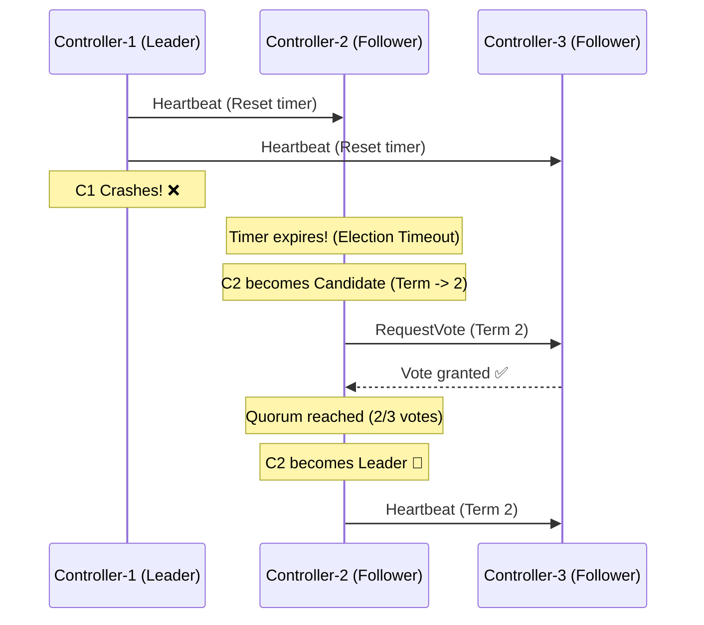
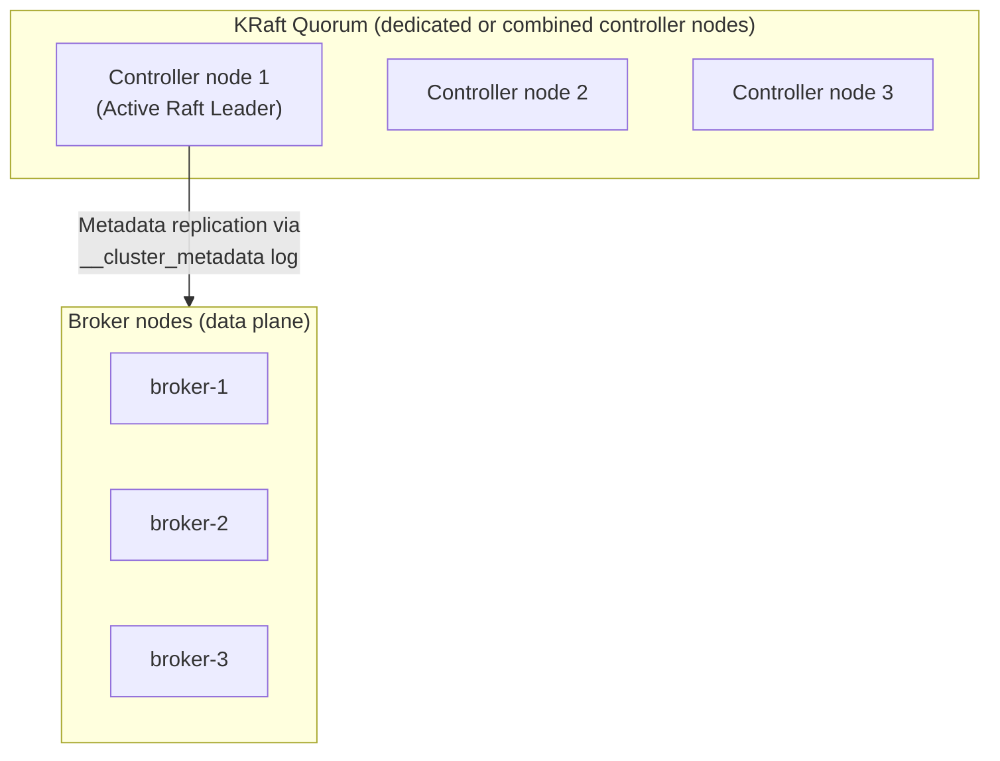
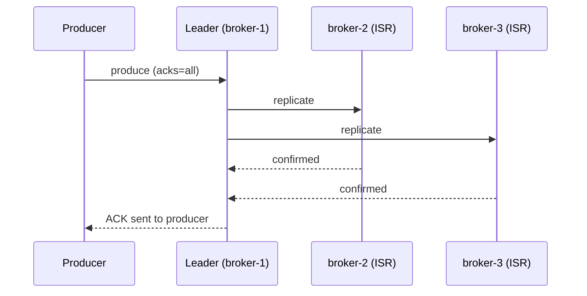
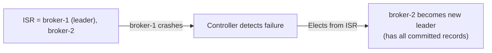

# Kafka — Chapter 3: Controllers, KRaft vs Zookeeper & ISR

Topics covered: Controller · KRaft vs ZooKeeper · In-Sync Replicas (ISR)

---

## 1. Controller

### What

The **Controller** is one special broker in a Kafka cluster that is elected to
perform cluster-wide administrative duties. Every broker can potentially become
the Controller, but only one is active at a time.

### Responsibilities

| Responsibility | Detail |
|----------------|--------|
| **Partition leader election** | When a leader broker crashes, the Controller picks a new leader from the ISR and pushes the updated metadata to all brokers. |
| **Broker lifecycle tracking** | Detects when brokers join or leave the cluster (via ZooKeeper watches or the KRaft quorum). |
| **Topic/partition CRUD** | Handles `CreateTopics`, `DeleteTopics`, `AlterPartitionReassignments` admin requests. |
| **Metadata propagation** | Pushes the cluster state (partition→leader mapping) to all other brokers via `LeaderAndIsr` and `UpdateMetadata` RPCs. |

### How Election Works

**ZooKeeper mode (pre-KRaft):** every broker races to create an ephemeral
`/controller` znode. The first to succeed becomes Controller. If the Controller
dies, ZooKeeper deletes the ephemeral node, which triggers a watch on all other
brokers — they race again.

**KRaft mode:** The Controller is elected by a Raft consensus quorum among a designated set of controller nodes (no ZooKeeper involved).

#### 🔄 Step-by-Step KRaft Election & Heartbeat Flow

At any point, a controller node is in one of three states: **Leader**, **Follower**, or **Candidate**.

1. **Liveness & Heartbeats (Normal State):**
   * The elected **Active Leader** controller continuously sends heartbeat messages (`AppendEntries`) to all **Follower** controllers.
   * Each Follower runs a countdown timer called the **Election Timeout** (typically a randomized duration between 150ms and 300ms).
   * Every time a Follower receives a heartbeat from the Leader, it resets its timer.
2. **Leader Failure (Timeout):**
   * If the Leader crashes or loses network connectivity, the Followers stop receiving heartbeats.
   * Their Election Timeout timers run out and hit `0`.
3. **The Campaign (Becoming a Candidate):**
   * The first Follower whose timer expires upgrades its state to **Candidate**.
   * It increments the cluster **Term** (e.g., from Term 1 to Term 2).
   * It votes for itself and broadcasts a **`RequestVote`** RPC to all other controllers.
4. **Voting:**
   * When other Followers receive the `RequestVote` request, they grant their vote to the Candidate if the Candidate's term is higher and its metadata log is at least as up-to-date as theirs. (A node can only vote once per Term).
5. **Quorum Victory:**
   * If the Candidate receives votes from a **majority (quorum)** of the controllers, it wins the election and upgrades its state to **Active Leader**.
   * It immediately begins sending heartbeats to the remaining controllers to announce its leadership and reset their timers.



#### 🧮 Why Quorums Use Odd Numbers (Quorum Math)

Consensus groups (like KRaft) require a **majority of votes (more than 50%)** to approve any metadata write or leader election. The formula for the required majority (quorum) is:
$$\text{Quorum Majority} = \lfloor \frac{N}{2} \rfloor + 1$$
*(where $N$ is the total number of controllers)*

* **Why 2 nodes is useless (Tolerates 0 failures):**
  * For $N=2$, Quorum is $\lfloor 2/2 \rfloor + 1 = \mathbf{2}$ votes.
  * If 1 node fails, only 1 is left. Since we need **2** votes, the cluster freezes. A 2-node cluster has no more fault tolerance than a 1-node cluster, but costs twice as much.
* **Why 3 nodes is the minimum (Tolerates 1 failure):**
  * For $N=3$, Quorum is $\lfloor 3/2 \rfloor + 1 = \mathbf{2}$ votes.
  * If 1 node crashes, the 2 remaining nodes can still vote and reach a majority of 2.
* **Why even numbers (like 4) are a waste of money:**
  * **3 Nodes:** Quorum = 2 votes. Tolerates **1** failure (2/3 remain, works).
  * **4 Nodes:** Quorum = $\lfloor 4/2 \rfloor + 1 = \mathbf{3}$ votes. If 2 nodes fail, 2 remain ($2 < 3$, fails). Tolerates **only 1** failure.
  * *Adding a 4th node does not increase the number of failures the cluster can survive, but increases hardware costs and network voting overhead!*

---

## 2. KRaft vs ZooKeeper

### The Problem with ZooKeeper

Up to Kafka 2.x, Kafka stored all cluster metadata (broker list, topic configs,
partition assignments, ACLs) in an external **ZooKeeper** ensemble. This created
several pain points:

- **Operational complexity** — two separate distributed systems to deploy,
  monitor, upgrade, and secure (Kafka + ZooKeeper).
- **Metadata bottleneck** — on startup every broker had to fetch the full
  cluster state from ZooKeeper. At scale (millions of partitions) this caused
  slow restarts and Controller failover latency in the tens of seconds.
- **Split-brain risk** — Controller and ZooKeeper had to stay in sync; network
  partitions could create inconsistencies.
- **Scalability ceiling** — ZooKeeper's watch model degraded beyond ~200k
  partitions.

### KRaft — Kafka Raft Metadata Mode

Introduced in Kafka 2.8 (preview), **production-ready from Kafka 3.3**, and
ZooKeeper **removed entirely in Kafka 4.0**.

KRaft replaces ZooKeeper by storing cluster metadata in a special **internal
Kafka topic** called `__cluster_metadata` (a single-partition, replicated log),
managed by a Raft consensus quorum built into Kafka itself.

#### Architecture



#### How Raft is Used

The active Controller (Raft leader) appends metadata changes (topic creation,
leader election results) as records to `__cluster_metadata`. Follower
controllers replicate via Raft. Brokers subscribe to this log and maintain an
in-memory cache — no more full state fetch on startup, just replay from last
known offset.

#### Comparison Table

| Dimension | ZooKeeper Mode | KRaft Mode |
|-----------|---------------|------------|
| External dependency | ZooKeeper ensemble required | None — Kafka only |
| Metadata store | ZooKeeper znodes | `__cluster_metadata` Kafka log |
| Controller election | ZooKeeper ephemeral znode race | Raft leader election |
| Controller failover | Seconds (ZK watch + broker race) | Milliseconds (Raft re-election) |
| Partition scale | ~200k partitions practical limit | Millions of partitions |
| Startup time | O(partitions) — full ZK fetch | O(lag) — replay from last offset |
| Operational cost | Two systems to manage | Single system |
| Available since | Always | Preview 2.8, GA 3.3, only mode in 4.0 |

#### Node Roles in KRaft

A node can be configured as:

- **`broker`** — handles data (produce/consume). Follows the active Controller.
- **`controller`** — participates in the Raft quorum, no data.
- **`broker,controller`** — combined role; fine for small/dev clusters, not
  recommended for large production clusters (controller work can impact I/O
  latency).

`server.properties`:
```properties
# Pure broker
process.roles=broker
node.id=1
controller.quorum.voters=1@controller-1:9093,2@controller-2:9093,3@controller-3:9093

# Pure controller
process.roles=controller
node.id=1
```

---

## 3. ISR — In-Sync Replicas

### What

For each partition, Kafka maintains a **leader** replica and zero or more
**follower** replicas. Not all followers are equally up-to-date at any given
instant. The **ISR (In-Sync Replica set)** is the subset of replicas that are
considered sufficiently caught up with the leader.

```
Partition 0 — replicas on broker-1 (leader), broker-2, broker-3
ISR = [broker-1, broker-2, broker-3]   ← all caught up

If broker-3 lags:
ISR = [broker-1, broker-2]             ← broker-3 evicted from ISR
```

### How a Replica Stays "In Sync"

A follower is in the ISR if it has fetched up to the leader's log end offset
within the window defined by:

```properties
replica.lag.time.max.ms=30000   # default 30 s
```

If a follower hasn't issued a fetch request within this window, the Controller
evicts it from the ISR. When it catches up again, the Controller re-adds it.

### Why ISR Matters — Durability Guarantee

Kafka only acknowledges a produce request as committed once **all ISR members**
have written the record (when `acks=all`). This is the key durability guarantee:
a message in the ISR is safe even if any one broker fails.



If `acks=1`, only the leader write is confirmed — fast but data can be lost if
the leader crashes before followers replicate.

### `min.insync.replicas`

```properties
min.insync.replicas=2   # topic-level or broker-level default
```

When `acks=all`, the broker rejects the produce request with
`NotEnoughReplicasException` if the ISR size falls below `min.insync.replicas`.
This prevents a false sense of durability when most replicas have fallen behind.

| Setting | Meaning |
|---------|---------|
| `replication.factor=3` | 3 copies of each partition across brokers |
| `min.insync.replicas=2` | At least 2 replicas (including leader) must be in ISR to accept writes |
| `acks=all` | Producer waits for all ISR members to confirm |

The combination `replication.factor=3, min.insync.replicas=2, acks=all` is the
standard production durability recipe: tolerates 1 broker failure without data
loss, and refuses writes rather than silently losing data if 2 brokers are down.

### Leader Election and ISR

When a partition leader crashes, the Controller elects the new leader **only from the current ISR**. This guarantees that the new leader has all committed messages.

> **💬 Noob-friendly Group Chat Analogy:**
> Imagine a group chat with 4 people:
> * **Leader (Broker 1):** The group chat creator who currently receives and distributes all messages.
> * **Follower A (Broker 2) & Follower B (Broker 3):** Active chatters who have read every single message up to the last second (**in ISR**).
> * **Follower C (Broker 4):** Had their phone off for the last 3 hours and missed 50 messages (**out of ISR**).
> 
> If the **Leader** crashes, we must elect a new leader. 
> * We **must** choose either **Follower A** or **Follower B** because they are caught up.
> * If we chose **Follower C** (who has been offline), they wouldn't have the last 50 messages, and those messages would disappear from the chat history!



If the ISR has only one member and that broker also fails, Kafka faces a choice:

- **Wait for an ISR member to come back** (safe but unavailable — `unclean.leader.election.enable=false`, default).
- **Elect any replica** even if out of sync, risking data loss (`unclean.leader.election.enable=true`).

### HW — High Watermark

The **High Watermark (HW)** is the **first offset that has NOT yet been
replicated to all ISR members** — i.e., the exclusive upper bound of committed
data. Consumers can only read records **up to HW − 1**; records at or above the
HW are not yet "committed" and could be rolled back.

```
Leader log:   [ 0 ][ 1 ][ 2 ][ 3 ][ 4 ]  ← LEO (log end offset) = 5 (next offset to write)
ISR follower: [ 0 ][ 1 ][ 2 ]             ← replicated through offset 2

High Watermark = 3  (first offset not yet on all ISR; offsets 0–2 are committed)
Consumer reads: 0, 1, 2  (up to HW − 1) — cannot see 3, 4 yet
```

---

## Interview Angles

**Q: What does the Kafka Controller do?**
A: The Controller is a single elected broker responsible for cluster
administration: electing new partition leaders when a broker fails, tracking
broker join/leave events, handling topic CRUD operations, and propagating
updated metadata (partition→leader mapping) to all brokers. It is the control
plane; regular brokers handle the data plane.

**Q: Why did Kafka move away from ZooKeeper?**
A: ZooKeeper introduced operational burden (a second distributed system),
scalability limits (~200k partitions), and slow Controller failover (seconds).
KRaft stores metadata in a built-in Kafka Raft log (`__cluster_metadata`),
eliminating the external dependency, enabling millisecond failover, and scaling
to millions of partitions. ZooKeeper was removed entirely in Kafka 4.0.

**Q: How does KRaft Controller election work?**
A: A designated set of controller nodes form a Raft quorum. Raft elects a leader
among them via term-based voting. The Raft leader is the active Controller that
processes metadata changes. If the leader node fails, a follower wins a new
election in milliseconds — far faster than the ZooKeeper ephemeral-node race.

**Q: What is the ISR and why does it matter?**
A: The ISR is the set of partition replicas that have fetched within
`replica.lag.time.max.ms` of the leader. It matters because `acks=all` requires
all ISR members to confirm a write before the producer gets an ACK. A record
visible to consumers is guaranteed to be on every ISR member, so even if the
leader crashes the new leader (elected from ISR) has all committed data.

**Q: What is `min.insync.replicas` and how does it interact with `acks=all`?**
A: `min.insync.replicas` sets a floor on ISR size. With `acks=all`, if the
current ISR is smaller than this value, the broker returns
`NotEnoughReplicasException` instead of accepting the write. This prevents
losing durability silently when replicas lag. The standard recipe:
`replication.factor=3, min.insync.replicas=2, acks=all` — tolerates 1 broker
failure, rejects writes (rather than losing data) if 2 are down.

**Q: What is the High Watermark?**
A: The High Watermark is the first offset that has NOT yet been replicated to
all ISR members — the exclusive boundary of committed data (offsets 0…HW−1 are
committed). Consumers only read up to HW−1; records at or above the HW are
written on the leader but not yet replicated to all ISR members and could be
lost in a crash. This guarantees consumers never see uncommitted data.

**Q: What is unclean leader election and when would you enable it?**
A: Unclean leader election allows a replica that is NOT in the ISR to become
leader. It risks data loss (the new leader may be missing records the old leader
acknowledged) but restores availability when all ISR members are unavailable.
Default is `false` (prefer safety). Enable `true` only for use-cases where
availability matters more than durability (e.g., metrics pipelines where losing
a few events is acceptable).
