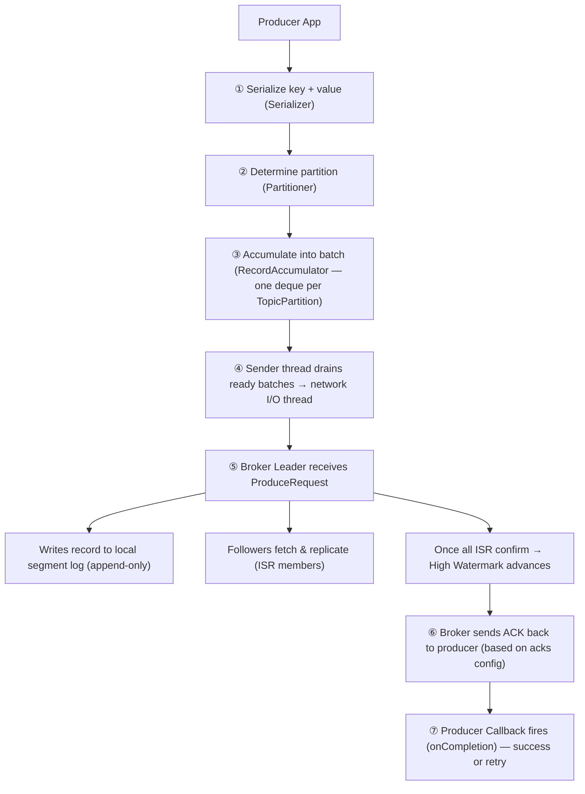
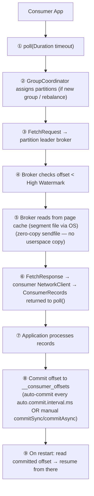
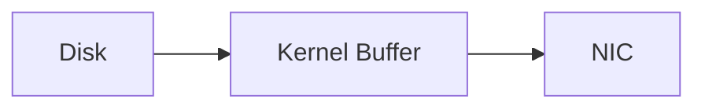

# Kafka — Chapter 4: Producer Write Flow, Consumer Read Flow, Log Compaction & Why Kafka is Fast

Topics covered: Complete Producer Write Flow · Complete Consumer Read Flow · Log Compaction Strategies · Why Kafka is Fast

---

## 1. Complete Producer Write Flow

### Overview



### Step-by-Step Detail

**① Serialization**
Key and value are converted to `byte[]` by the configured
`key.serializer` / `value.serializer` (e.g., `StringSerializer`,
`JsonSerializer`). The schema must match what the consumer expects.

**② Partitioning**
The Partitioner decides which partition the record lands on:
- **Key present** — `murmur2(key) % numPartitions`. Same key always goes to the
  same partition, guaranteeing ordering per key.
- **Key null** — default **StickyPartitioner** (Kafka 2.4+): fills a batch for
  one partition until `batch.size` or `linger.ms` is reached, then switches.
  Reduces the number of small requests compared to pure round-robin.
- **Custom** — implement `Partitioner` interface.

**③ RecordAccumulator — Batching**
Each `TopicPartition` has a `Deque<ProducerBatch>`. New records are appended to
the last open batch. A batch is "ready to send" when either:
- it is full (`batch.size`, default 16 KB), or
- `linger.ms` has elapsed (default 0 ms — send immediately; increase to 5–10 ms
  for better throughput at the cost of a small latency increase).

Batching is the primary throughput lever — it amortises per-request overhead
and enables compression across many records.

**④ Sender Thread**
A background `Sender` thread (separate from the application thread) drains ready
batches, groups them by broker (one `ProduceRequest` per broker per batch of
partitions), and hands them to the `NetworkClient`.

**⑤ Leader Broker Receives ProduceRequest**
1. Leader validates CRC, checks topic/partition existence and quota.
2. Appends record batch to the active **segment file** (sequential write).
3. Updates the in-memory offset index.
4. ISR followers issue Fetch requests and replicate the records.
5. Once all ISR members have the record, the partition's **High Watermark** advances.

**⑥ ACK Back to Producer**

`acks` governs only the producer → broker write side (not consumer/end-to-end delivery):

| `acks` | Meaning | Risk |
|--------|---------|------|
| `0` | Fire-and-forget — no ACK waited | Data loss if the send fails or the broker crashes (at-most-once) |
| `1` | ACK after leader write only | If the leader crashes before followers replicate, the record is **lost** — effectively at-most-once for that record; with retries can also duplicate |
| `all` / `-1` | ACK after all ISR members confirm | No data loss as long as ISR ≥ `min.insync.replicas` (safest) |

**⑦ Retry and Idempotence**

On network failure or retriable errors (`LEADER_NOT_AVAILABLE`), the producer retries up to `retries` times with exponential backoff. 

> **💡 Noob-friendly Analogy of why we need Idempotence:**
> Imagine sending a message: *"Pay Bob $10."*
> 1. The broker receives it and writes it down.
> 2. The broker sends back a confirmation (ACK): *"Got it!"*
> 3. **The Network Drops:** The confirmation is lost in transit. The producer is left waiting, assumes the broker never got the message, and sends it again: *"Pay Bob $10."*
> 4. Without idempotence, the broker writes it down again. Bob gets paid twice (duplicate data!).

With **`enable.idempotence=true`**, Kafka prevents this:
* **Producer ID (PID):** On startup, the broker assigns the producer a unique ID (e.g., `PID-99`).
* **Sequence Number:** The producer tags every batch of messages with a sequential count (e.g., `0`, `1`, `2`...).
* **Deduplication:** When the producer retries and sends `PID-99, Batch 0` again, the broker says: *"Wait, I already wrote Batch 0 for PID-99. I will ignore this message, but send back the ACK so the producer stops worrying."* Bob is paid exactly once.

#### Why "Within a Single Producer Session"?
If your producer application crashes and restarts, it starts a **new session**. It gets a brand new PID (e.g., `PID-102`). The broker has no idea `PID-102` is the same app as `PID-99`, so if `PID-102` resends a message, the broker will write it down again.

To achieve **exactly-once across restarts**, you need **Transactions**:
* You configure a stable **`transactional.id`** (e.g., `my-unique-payment-app`).
* When the app restarts, the broker matches it to the previous PID, fences off any zombie instances of the old app, and preserves sequence numbers across restarts.

---

## 2. Complete Consumer Read Flow

### Overview



### Step-by-Step Detail

**① poll()**
`poll()` is the only way to consume. It drives the entire consumer lifecycle:
fetching records, heartbeating to the GroupCoordinator, triggering rebalances,
and running auto-commit. Calling it in a tight loop keeps the consumer alive;
not calling it within `max.poll.interval.ms` (default 5 min) causes the broker
to treat the consumer as dead and triggers a rebalance.

**② Partition Assignment**
On first `subscribe()` or after a rebalance, the **GroupCoordinator** (a broker)
uses the configured `partition.assignment.strategy`:
- `RangeAssignor` (default) — contiguous range per consumer.
- `RoundRobinAssignor` — round-robin across all partitions.
- `CooperativeStickyAssignor` (recommended) — minimises reassignments;
  supports incremental rebalances (consumer doesn't stop consuming unaffected
  partitions during rebalance).

**③ FetchRequest**
Consumer sends a `FetchRequest` to the **partition leader** specifying:
- `fetch.min.bytes` (default 1 B) — broker waits until at least this many bytes
  are available. Increasing reduces idle wakeups.
- `fetch.max.wait.ms` (default 500 ms) — max wait if data < `fetch.min.bytes`.
- `max.partition.fetch.bytes` (default 1 MB) — max bytes per partition per fetch.

**④ High Watermark Check**
The broker only returns records up to the **High Watermark** (the offset
confirmed by all ISR members). Records above the HW are on the leader but not
yet replicated — returning them would risk the consumer seeing data that gets
rolled back if the leader crashes.

**⑤ Zero-Copy Read (sendfile)**
Broker reads the segment file using the OS **page cache** and transfers data
directly to the network socket via the `sendfile()` syscall — no copy into JVM
heap. If the data is hot (recently produced), it is already in page cache and no
disk I/O occurs at all.

**⑥ Records Returned**

`poll()` returns a `ConsumerRecords<K, V>` which is like a **Delivery Box** containing a batch of messages.

> **📦 The Delivery Box Analogy:**
> Imagine a consumer that is assigned two partitions (e.g., Partition 0 and Partition 1). When you call `poll()`, Kafka delivers a single box (`ConsumerRecords`) containing multiple items (`ConsumerRecord` objects) mixed from both partitions.
> 
> Each individual item (`ConsumerRecord`) has a detailed **shipping label** (metadata) attached to it:
> * **Topic:** The department it belongs to (e.g., `pizza-orders`).
> * **Partition:** The specific shelf it came from (e.g., `Partition 1`).
> * **Offset:** The sequential number of the item on that shelf (e.g., `1042`).
> * **Key:** Who the item belongs to (e.g., `customer-12`).
> * **Value:** The actual contents of the item (e.g., `{"item": "Pepperoni Pizza"}`).
> * **Headers:** Extra sticky notes (e.g., security tokens, correlation IDs).
> * **Timestamp:** When the item was placed on the shelf.

```java
// 1. poll() returns the delivery box
ConsumerRecords<String, String> box = consumer.poll(Duration.ofMillis(100));

// 2. We loop through each item inside the box one-by-one
for (ConsumerRecord<String, String> item : box) {
    System.out.printf("Reading message from Topic: %s, Partition: %d, Offset: %d%n",
        item.topic(), item.partition(), item.offset());
    
    System.out.printf("Key: %s, Value: %s%n", item.key(), item.value());
}
```

**⑦ Processing**
Application processes records. Keep processing fast relative to
`max.poll.interval.ms` — if processing is slow, increase `max.poll.interval.ms`
or reduce `max.poll.records` (default 500) to fetch fewer records per poll.

**⑧ Offset Commit**
- **Auto-commit** (`enable.auto.commit=true`): committed at most every
  `auto.commit.interval.ms`. Risk: records processed but not yet committed are
  re-processed after crash (at-least-once). Records committed but not yet
  processed are skipped (at-most-once) if the commit fires at the wrong moment.
- **Manual sync** (`commitSync()`): blocks until broker confirms. Guarantees
  at-least-once if called after processing.
- **Manual async** (`commitAsync()`): non-blocking; use `commitSync()` on
  shutdown to flush the last offset.

**⑨ Restart Recovery**
On restart, the consumer reads the last committed offset from
`__consumer_offsets` and resumes from the next record. If no committed offset
exists, `auto.offset.reset` controls behaviour: `earliest` (read from
beginning), `latest` (skip to new records), `none` (throw exception).

---

## 3. Log Compaction

### What

Kafka supports two **log cleanup strategies** per topic, set via
`cleanup.policy`:

| Strategy | Behaviour |
|----------|-----------|
| `delete` (default) | Delete segments older than `retention.ms` (default 7 days) or larger than `retention.bytes`. Entire old segments are dropped. |
| `compact` | Keep only the **latest record for each key**. Older records with the same key are removed. The log shrinks but every key's current value is always retained. |
| `delete,compact` | Both policies apply — compact first, then apply time/size retention on top. |

### How Compaction Works

```
Before compaction:
offset:  0   1   2   3   4   5   6
key:     A   B   A   C   B   A   C
value:   a1  b1  a2  c1  b2  a3  c2

After compaction (keep latest per key):
offset:  3*  5   6        (* offset gaps are possible — holes are valid)
key:     C   A   C  ← NO, wrong example. Let me redo:

Latest per key: A→offset5(a3), B→offset4(b2), C→offset6(c2)

After compaction:
offset:  4   5   6
key:     B   A   C
value:   b2  a3  c2
```

The log is split into two regions:
- **Clean segment** — already compacted; each key appears at most once.
- **Dirty (tail) segment** — recently written; may have duplicate keys.

A background **Log Cleaner thread** periodically:
1. Scans the dirty portion and builds an **offset map** (`key → latest offset`).
2. Rewrites dirty segments, dropping any record whose key has a higher-offset
   version.
3. Merges the rewritten segments into the clean portion.

### Tombstones

A record with `value = null` is a **tombstone** — it signals *"delete this key"*. 

> **🏷️ The Sticky Note Analogy:**
> In Kafka's append-only log, you cannot delete a record by opening the file and backspacing it. Instead, to delete key `"John"`, you write a new record: `Key: "John", Value: null` (this is the **Tombstone**).
> 
> Imagine this as putting a red **"DELETED" sticky note** over John's page in your address book.
> * **Why keep it?** If you erased John's name instantly, a consumer (like a helper) who was offline for a few hours would return, read the log, see no delete message, and still think John's old address was valid.
> * **The Delay (`delete.retention.ms`):** Kafka keeps the red sticky note on the page for **24 hours** (default) so all lagging consumers have time to see it, process the deletion in their own databases, and commit their offset. After 24 hours, Kafka permanently removes the record and the tombstone.

### Use Cases for Compaction

| Use Case | Simple Explanation | Why Compaction is Perfect |
|----------|--------------------|---------------------------|
| **CDC (Change Data Capture)** | Synchronizing your Database table with Kafka. | If a database row changes 10 times, you only care about its current value. Compaction keeps Kafka in sync with the DB's current state. |
| **Kafka Streams State Stores** | Backing up in-memory app databases. | If your app crashes, it rebuilds its memory by reading the backup topic. Reading only the latest compacted state takes **seconds**, whereas reading every historic update could take **hours**. |
| **Configuration & Feature Flags** | Storing settings (e.g., `dark_mode = true`). | You only care about the current config setting. Old versions are useless. |
| **User Profiles** | Storing user details mapped to `userId`. | You only need to know the user's current profile picture and bio, not what they set them to three years ago. |

### Key Config

```properties
cleanup.policy=compact
min.cleanable.dirty.ratio=0.5   # compact when dirty/total log > 50%
delete.retention.ms=86400000    # tombstones survive 24 h before removal
segment.ms=604800000            # roll a new segment every 7 days (ensures cleaner can act)
```

---

## 4. Why Kafka is Fast

Kafka achieves throughput of millions of messages per second on commodity
hardware through five design decisions, not one magic trick:

### ① Sequential Disk I/O

Kafka **appends** records to the end of segment files — it never updates or
seeks within a file. Sequential writes on a spinning disk can reach 600 MB/s;
sequential reads are similar. Random I/O on the same disk is ~100× slower.
SSDs close the random/sequential gap but sequential writes still win on write
amplification.

Most message queues maintain complex in-memory data structures and do random
writes. Kafka's log is a dumb append-only file — simpler and faster.

### ② OS Page Cache Instead of JVM Heap

Kafka does **not** manage its own cache. It writes to the OS page cache and
relies on the OS to keep hot data in memory. Benefits:
- **No JVM GC pressure** — multi-GB caches in a JVM cause long GC pauses;
  page cache is outside the JVM.
- **Warm reads are free** — if a consumer is close to the producer (common case)
  data is read directly from page cache with no disk I/O at all.
- **Cache survives broker restart** — the page cache is OS-managed; a JVM
  in-memory cache is lost on restart.

### ③ Zero-Copy Transfer (`sendfile`)

Normal network read path (without zero-copy):

> 2 copies + 2 context switches in user space

Kafka uses the `sendfile()` syscall (Linux) / `transferTo()` (Java NIO):

> 1 copy, stays in kernel — no user space involvement

For a consumer reading records that are already in page cache this means: no
disk I/O + no JVM heap copy + one kernel copy. This is the dominant factor for
consumer throughput.

### ④ Batching and Compression

- **Producer batching**: `RecordAccumulator` groups records into batches
  (`batch.size`, `linger.ms`). One network round-trip carries thousands of
  records instead of one.
- **Broker-to-broker replication**: followers fetch in large batches.
- **Consumer fetches**: `fetch.min.bytes` / `fetch.max.wait.ms` ensure the
  broker responds with full batches, not one record at a time.
- **Compression**: `compression.type` (snappy, lz4, gzip, zstd) is applied at
  the batch level. Compressing many records together gives much better ratios
  than per-record compression. The broker stores the compressed batch as-is and
  the consumer decompresses — the broker does zero extra work for compression.

### ⑤ Partition Parallelism

A topic is sharded into partitions, each an independent log on a potentially
different broker. This means:
- Producers write to multiple partitions in parallel.
- Each partition can be consumed by a different consumer instance simultaneously.
- Replication is per-partition and distributed across brokers.

Throughput scales horizontally: doubling partitions (and brokers) roughly
doubles throughput.

### Summary Table

| Technique | What it avoids | Gain |
|-----------|---------------|------|
| Sequential I/O | Random seek latency | ~100× faster disk writes |
| Page cache | JVM GC pauses, cache rebuild on restart | Free warm reads |
| Zero-copy (`sendfile`) | User-space copy, context switches | Near-wire-speed consumer throughput |
| Batching | Per-record network overhead | Orders-of-magnitude throughput multiplier |
| Compression | Network bandwidth | Reduced latency + cost |
| Partition parallelism | Single-threaded bottleneck | Linear horizontal scale |

---

## Interview Angles

**Q: Walk me through what happens when a producer calls `send()`.**
A: The record is serialized, the Partitioner picks a partition (key hash or
sticky), and the record is appended to the `RecordAccumulator` batch for that
`TopicPartition`. The background Sender thread drains ready batches (when
`batch.size` is full or `linger.ms` elapses) and sends a `ProduceRequest` to
the partition leader. The leader appends to its segment log, followers fetch and
replicate, the High Watermark advances, and the broker ACKs back. The producer's
callback fires with the assigned offset or an error triggering retry.

**Q: Walk me through what happens when a consumer calls `poll()`.**
A: `poll()` drives heartbeating and rebalance detection. Internally it issues a
`FetchRequest` to each partition's leader, specifying the current offset and
fetch size limits. The broker reads records up to the High Watermark from the
page cache using zero-copy `sendfile`. `ConsumerRecords` are returned. After
processing, the consumer commits offsets to `__consumer_offsets` (auto or
manual). On restart the consumer reads that committed offset and resumes from
the next record.

**Q: What is the difference between `delete` and `compact` cleanup policies?**
A: `delete` removes entire old segments once their age exceeds `retention.ms` or
total size exceeds `retention.bytes` — good for time-series event streams where
old events have no value. `compact` retains only the latest record per key
indefinitely — good for current-state topics (CDC, config, user profiles) where
you need to rebuild state from the topic but don't need the full history.

**Q: What is a tombstone in a compacted topic?**
A: A record with `value=null`. It tells downstream consumers "this key has been
deleted." After `delete.retention.ms` the tombstone itself is removed during the
next compaction cycle. Consumers lagging behind the tombstone deletion window
will miss the delete signal — this is why `delete.retention.ms` should be longer
than the expected max consumer lag.

**Q: Why is Kafka faster than traditional message brokers?**
A: Five reasons: (1) append-only sequential disk writes avoid seek latency;
(2) relying on OS page cache avoids JVM GC pauses and keeps hot data warm for
free; (3) zero-copy `sendfile` sends data from page cache to network without a
user-space copy; (4) batching amortises per-record overhead over thousands of
records per request; (5) partition-level parallelism scales horizontally across
brokers and consumers. Most traditional brokers maintain complex in-memory
structures, do random I/O, and copy data through multiple buffers.

**Q: What does zero-copy mean in Kafka's context?**
A: Zero-copy means the data path from disk to network socket avoids copying
bytes into the JVM heap. Kafka uses the Linux `sendfile()` syscall (exposed as
`FileChannel.transferTo()` in Java NIO): the OS transfers data from the kernel's
page cache buffer directly to the NIC's buffer in one step, bypassing user space.
The result is no GC allocation, one kernel copy instead of four (disk→kernel
buffer → user buffer → kernel socket buffer → NIC), and fewer context switches.

**Q: What is the role of `linger.ms` and `batch.size` in producer throughput?**
A: `batch.size` sets the maximum bytes per batch per partition — when a batch
fills up it is sent immediately. `linger.ms` adds an artificial delay: even if
the batch is not full, the sender waits up to `linger.ms` for more records to
arrive before sending. Setting `linger.ms=5` lets 5 ms of records accumulate,
producing larger batches. The trade-off: slightly higher latency (5 ms worst
case) for much higher throughput (fewer, fuller requests). The default is 0 ms
(lowest latency, suboptimal throughput).
