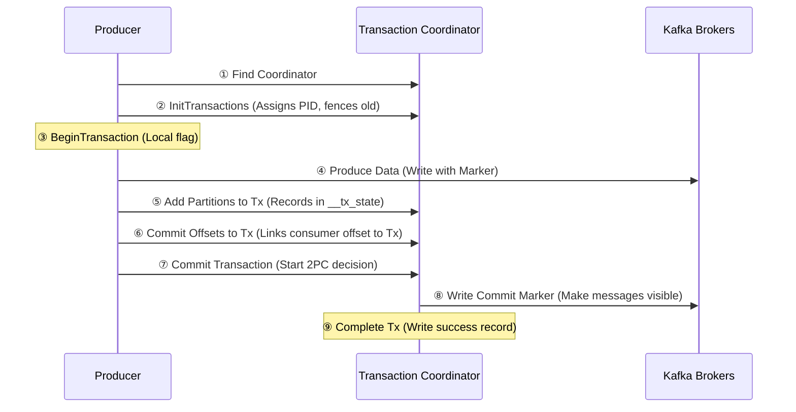
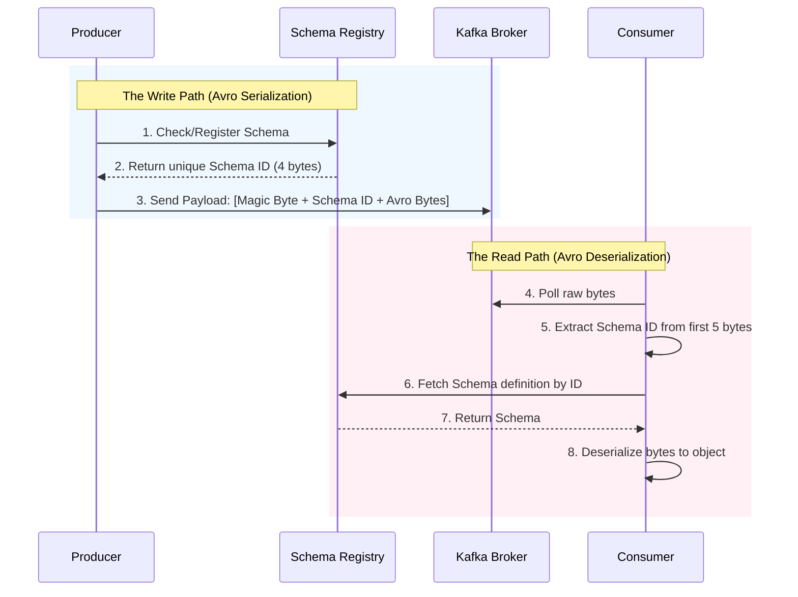
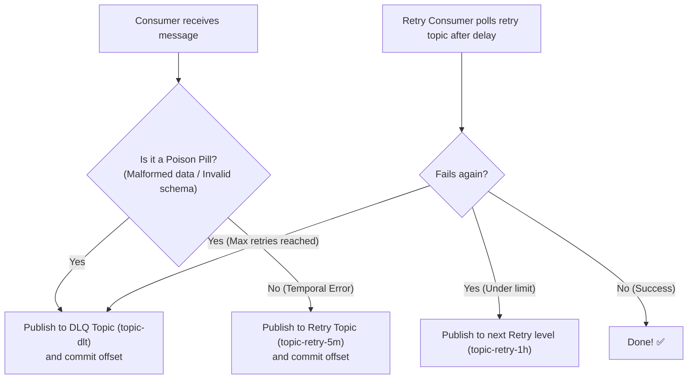

# Kafka — Chapter 5: Advanced Flows: Transactions, Rebalancing & Schema Registry

Topics covered: Exactly-Once Transactions · Consumer Rebalance Protocol · Schema Registry Interaction · Error Handling & DLQ

---

## 1. Exactly-Once Transactions Flow

Exactly-Once Semantics (EOS) ensures that even if a producer retries or a consumer restarts, the end result is as if the data was processed exactly once.

### The Transaction Coordinator

Kafka uses a **Transaction Coordinator** (a specific broker) and an internal topic `__transaction_state` to manage the lifecycle of a transaction.

### The "Consume-Transform-Produce" Flow

This is the most common transactional pattern: reading from Topic A and writing to Topic B atomically.

### Key Design Details
- **Control Markers**: When a transaction is committed, a special "Commit Marker" is written to the data partitions.
- **Consumer Isolation**: Consumers must set `isolation.level=read_committed`. They will only see messages that have a corresponding Commit Marker. If a transaction is aborted, the markers are "Abort Markers," and the consumer skips those records.
- **Zombies / Fencing**: If a producer hangs and a new one starts with the same `transactional.id`, the Coordinator increments the **Producer Epoch**. When the old producer tries to commit, it is "fenced" with a `ProducerFencedException`.

> **💡 Noob-friendly Bank Wire Analogy:**
> Imagine transferring $10 from Alice to Bob (Consume-Transform-Produce):
> 1. **The Envelope:** When you start a transaction, the Coordinator gives you a "Sealed Envelope."
> 2. **Drafts:** You write the debit of $10 from Alice and the credit of $10 to Bob, and put them inside the envelope along with your progress bookmark (*"I read transfer request #1"*).
> 3. **The Commit:** The Coordinator stamps the envelope **COMMITTED** (the Commit Marker). Downstream consumers (`read_committed`) can only see letters inside COMMITTED envelopes.
> 4. **The Rollback:** If you crash mid-way, the coordinator shreds the envelope (**ABORTED**). Bob never gets paid, but Alice's money stays safe, and on restart you process the request fresh. Either everything in the envelope is written, or nothing is!

---

## 2. Consumer Rebalance Protocol

A rebalance happens when the Group Coordinator (a broker) decides to redistribute partition ownership among consumers in a group (e.g., a consumer joins, leaves, or a topic's partition count changes).

### Eager Rebalance (The "Stop-the-World" Flow)

This was the only strategy pre-Kafka 2.4.

1. **Member Revocation**: Every consumer stops processing and gives up its current partitions.
2. **JoinGroup**: All consumers send a `JoinGroup` request to the Coordinator.
3. **SyncGroup**: The designated "Leader" consumer calculates the new assignments and sends them to the Coordinator, who relays them to all members.
4. **Resumption**: Consumers start fetching from their new partitions.

**Problem**: The entire group is idle during the rebalance. If the group is large, this "Stop-the-World" pause can last many seconds.

### Incremental Cooperative Rebalance

Introduced in Kafka 2.4+ (default in recent versions).

1. **Member Revocation**: Only the partitions that *need* to move are revoked. 
2. **Continued Processing**: Consumers keep processing the partitions they already own if they aren't changing owners.
3. **Multi-round**: The rebalance may happen in a few quick steps to ensure no partition is owned by two people at once.

> **📦 Noob-friendly Warehouse Conveyor Belt Analogy:**
> Imagine a warehouse with **4 conveyor belts** (partitions) dumping boxes and **2 workers** (consumers). 
> * `Worker C1` packs `Belt 0` & `Belt 1`.
> * `Worker C2` packs `Belt 2` & `Belt 3`.
> We hire a new worker **C3** to share the workload. 
> 
> * **Eager Rebalance (Stop-the-World):** The manager blows a whistle. Both `C1` and `C2` must immediately drop their boxes, step away, and stand in a line. All packing stops completely, and backlog builds up while the manager re-allocates the belts.
> * **Cooperative Rebalance (Smooth Swap):** The manager walks up to `C2` and says: *"Keep packing Belt 2, but stop packing Belt 3 so we can hand it to C3."* `Worker C1` keeps packing Belt 0 and 1 without stopping. Only the moving Belt 3 is paused for a brief second. No global shutdown!

---

## 3. Schema Registry Interaction Flow

Kafka only stores `byte[]`. The Schema Registry provides a way to manage schemas (Avro, Protobuf, JSON Schema) and ensure compatibility.

### The Write Path (Producer)
1. **Fetch/Register**: Producer checks if the schema is in its local cache. If not, it sends the schema to the Registry.
2. **Schema ID**: The Registry returns a unique 4-byte **Schema ID**.
3. **Payload Construction**: Producer prepends a "Magic Byte" (0) + 4-byte ID to the actual data bytes.
4. **Send**: Producer sends the combined bytes to Kafka.

### The Read Path (Consumer)
1. **Extract ID**: Consumer reads the first 5 bytes to get the Schema ID.
2. **Fetch Schema**: If the schema isn't in cache, the consumer fetches the full schema definition from the Registry using the ID.
3. **Deserialize**: Consumer uses the schema to convert bytes back into a Java/C# object.

> **📖 Noob-friendly Translator & Dictionary Analogy:**
> Kafka is like a mail carrier delivering sealed wooden crates containing raw bytes (`byte[]`). It doesn't know what is inside.
> * **The blueprint registration:** Bob wants to write a user profile record. He registers a blueprint (Schema) in the Schema Registry. The Registry responds: *"Your blueprint is Schema ID #7."*
> * **The shipping label:** Bob writes the user profile data in Avro, prepends the number `7` (using a 5-byte header: magic byte + ID) to the front of the bytes, and sends it to Kafka.
> * **The translation:** Alice receives the bytes, reads the first 5 bytes, and sees the number `7`. She checks the Schema Registry: *"Hey, give me the blueprint for ID #7."* The registry sends the blueprint, and Alice decodes the bytes perfectly!
> * **Compatibility rules:** If Bob updates the blueprint in a way that would crash Alice's code, the Schema Registry **rejects** the update, blocking Bob from sending bad data in the first place!

---

## 4. Error Handling & Retry Patterns

In a distributed system, things will fail (Database down, Downstream API timeout). "Silently failing" is not an option.

### The Dead Letter Queue (DLQ) Pattern

If a message is physically "bad" (malformed JSON), it will never succeed. Don't retry it infinitely (the "Poison Pill").
- **Action**: Catch the exception and publish the original message to a `topic-name-DLQ` for manual inspection.

### Retries with Backoff (Retry Topics)

If the failure is temporal (API Timeout):
1. **Retry Topic**: Publish the message to `topic-name-retry-5m`.
2. **Delayed Consumer**: A separate consumer reads from this topic with a 5-minute wait.
3. **Exponential Backoff**: If it fails again, move it to `topic-name-retry-1h`, then finally to the `DLQ`.

> **📮 Noob-friendly Post Office Delivery Analogy:**
> Imagine a postman delivering packages:
> * **Poison Pill / DLQ (Gibberish Address):** The postman gets a letter addressed to *"#%&@ Lane"*. This address will **never** exist. If the postman sits in the truck trying to find it forever, all other mail is delayed (Consumer Lag builds up!). The solution is to throw it in the **"Undeliverable Mail" bin (DLQ)** and move on to the next letter immediately.
> * **Retry Topics (Locked Gate):** The postman arrives at a house, but the gate is locked. This is a temporary error. Instead of waiting at the gate all day, the postman writes a note: *"Try again in 1 hour"* (Retry Topic) and sends it back to the warehouse. 1 hour later, they retry the delivery. If it still fails after 3 tries, it goes to the DLQ.

---

## Interview Angles

**Q: How does Kafka achieve Exactly-Once Semantics (EOS)?**
A: EOS is achieved through an Idempotent Producer (handles retries without duplicates) and the Transaction API. The Transaction Coordinator manages a 2-phase commit process by writing commit/abort markers to the log. Consumers using `read_committed` only see records that have been successfully committed.

**Q: What is a "Poison Pill" in Kafka?**
A: A message that causes a consumer to fail every time it is processed. If the consumer retries and fails again, it stays stuck on that offset, causing "Consumer Lag" to skyrocket. Fix: Use a Try-Catch block and move the message to a Dead Letter Queue (DLQ).

**Q: Why is Cooperative Rebalancing better than Eager Rebalancing?**
A: Eager rebalancing requires all consumers to stop consuming all partitions, causing a global pause. Cooperative rebalancing only stops consumption for the specific partitions that are moving owners, allowing the rest of the group to continue working.

**Q: What is "Schema Evolution" and why do we need the Schema Registry?**
A: Schema Evolution is the process of changing the data format (adding a field). We need the Schema Registry to enforce compatibility rules (e.g., Backward Compatibility: new code can read old data). It ensures that producers don't publish data that will crash all existing consumers.

**Q: How does a Kafka Producer handle "Zombie" instances in a transaction?**
A: By using a `transactional.id` and an "Epoch." When a new producer instance starts with the same ID, the Coordinator increments the epoch. Any requests from the old "Zombie" instance (with an older epoch) are rejected, preventing data corruption.
