# Kafka — Chapter 6: Failure Scenarios

Topics covered: Broker Fail · Partition Leader Fail · Follower Out of ISR · Controller Fail · Consumer Crash · Consumer Timeout · Group Coordinator Fail · Transaction Coordinator Fail / Zombie Producer · Graceful Shutdown · Disk/Network Fail · Schema Registry · Multi-DC Fail · Cooperative Rebalancing

---

## 1. Broker Fails

### What
A broker process dies (crash, OOM, machine reboot). It stops serving produce/consume requests and stops sending heartbeats to the Controller.

### How
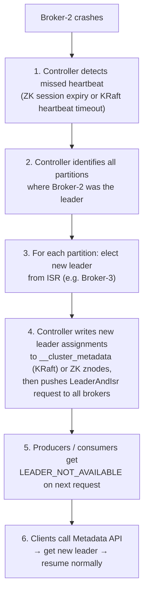

### Key Config

| Config | Default | Role |
|--------|---------|------|
| `replica.lag.time.max.ms` | 30 000 ms | Follower must fetch within this window to stay in ISR |
| `zookeeper.session.timeout.ms` | 18 000 ms | (ZK mode) time before ZK declares broker dead |
| `broker.heartbeat.interval.ms` | 2 000 ms | (KRaft) how often brokers send heartbeat |
| `broker.session.timeout.ms` | 9 000 ms | (KRaft) time before Controller declares broker dead |

### Impact Matrix

| Component | Effect on broker fail |
|-----------|----------------------|
| Producers | `LEADER_NOT_AVAILABLE` error → retry + metadata refresh |
| Consumers | Partition reassigned to new leader; existing offset commit works as normal |
| Followers on dead broker | Removed from ISR; rejoins when broker restarts and catches up |
| `min.insync.replicas` | If ISR drops below threshold, writes to those partitions fail with `NotEnoughReplicasException` |

---

## 2. Partition Leader Fails

### What
The specific broker that is the leader for a partition crashes. Producers writing to that partition and consumers reading from it are affected.

### How
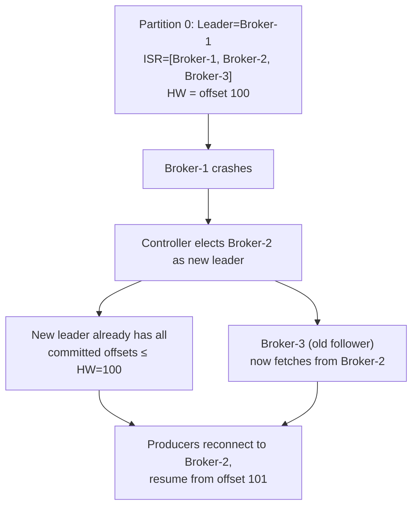

### The Unclean Election Trade-off

If the leader dies and **all ISR members are also unavailable**, Kafka must choose:

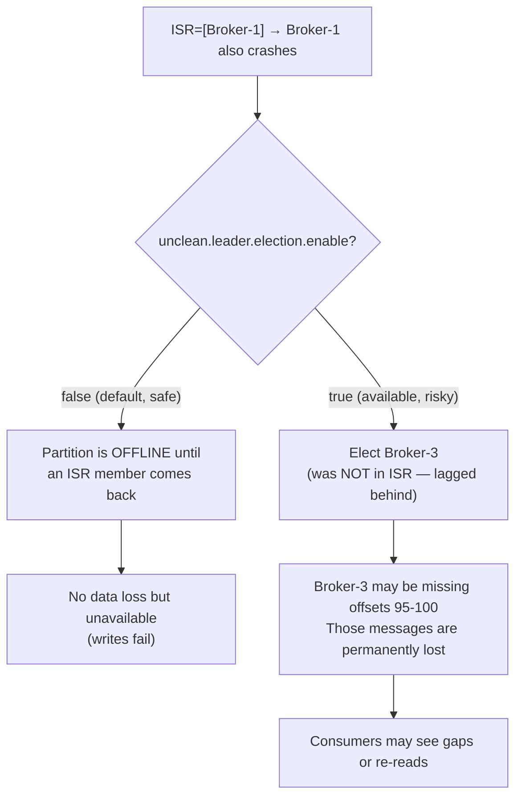

**Rule**: for financial / critical data keep `unclean.leader.election.enable=false`. For log / metrics pipelines where availability > durability, `true` is acceptable.

### High Watermark and Data Safety

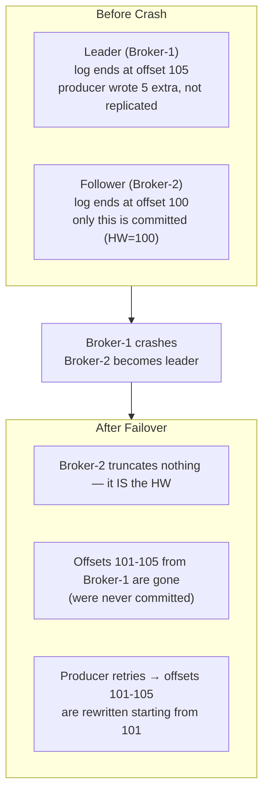

This is why `acks=all` matters: the producer only gets an ACK after all ISR members have the record, so if the leader dies the new leader definitely has it.

---

## 3. Follower Replica Falls Out of ISR

### What
A follower broker becomes slow (GC pause, network lag, disk I/O spike) and stops fetching fast enough. The Controller evicts it from the ISR without killing the broker.

### How
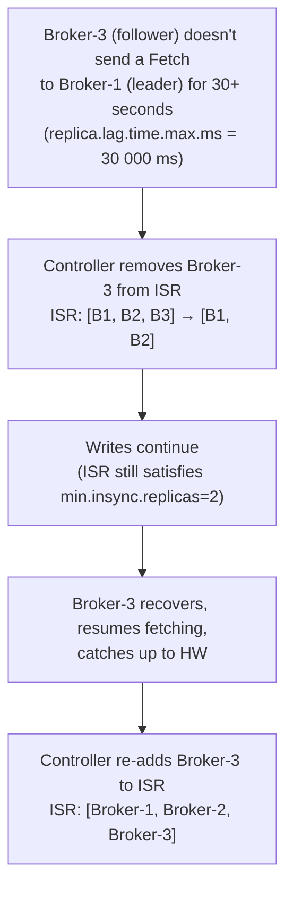

### Why This Matters

| Scenario | Effect |
|----------|--------|
| ISR shrinks to exactly `min.insync.replicas` | Cluster is fragile — one more failure stops writes |
| ISR shrinks **below** `min.insync.replicas` | All produce requests with `acks=all` fail with `NotEnoughReplicasException` |
| ISR shrinks to 1 (only leader) | Any leader crash will trigger unclean election dilemma |

Monitor the `UnderReplicatedPartitions` JMX metric — it should be 0 in steady state. Any non-zero value means your cluster is operating without full durability.

---

## 4. Controller Fails

### What
The single active Controller broker (or Controller node in KRaft) crashes. Without a Controller, no new partition leader elections can be triggered — existing leaders keep working, but no failover is possible until a new Controller is elected.

### ZooKeeper Mode
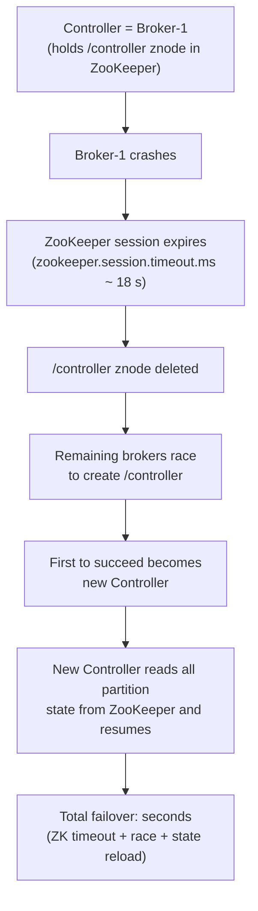

### KRaft Mode
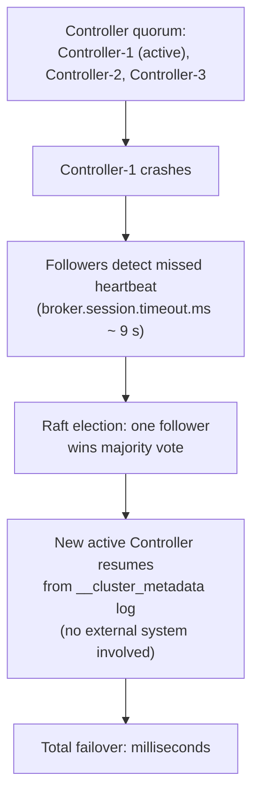

### During the Gap (No Active Controller)
- Existing partition leaders keep serving produce/consume — **data plane is unaffected**
- No new leader elections can happen → a broker crash during this gap leaves its partitions offline until the new Controller is elected
- No new topics or partition changes can be made

### ZooKeeper vs KRaft Controller Comparison

| | ZooKeeper Mode | KRaft Mode |
|---|---|---|
| Election mechanism | ZK ephemeral znode race | Raft quorum vote |
| Failover time | Seconds | Milliseconds |
| Metadata store | ZooKeeper znodes | `__cluster_metadata` topic |
| Partition limit | ~200 k partitions | Millions |
| External dependency | Yes (ZooKeeper cluster) | No |
| Split-brain risk | Yes (ZK + broker state drift) | No (Raft linearizable log) |

---

## 5. Consumer Crashes

### What
A consumer process dies (OOM, kill signal, machine reboot). Its heartbeat thread stops. The GroupCoordinator eventually detects the missing heartbeat and triggers a rebalance.

### How
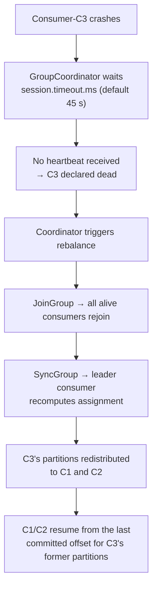

### Offset Recovery

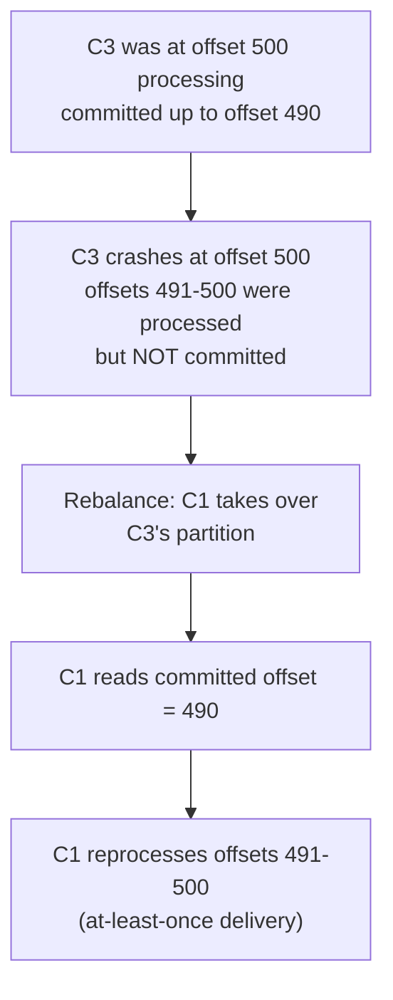

This is why you must call `commitSync()` after processing, not before — and why idempotent consumers matter.

---

## 6. Consumer Timeout — Two Variants

### What
A consumer is alive but fails to interact with the GroupCoordinator in time. Two independent timers govern this:

| Timer | Config | Default | Detects |
|-------|--------|---------|---------|
| Heartbeat timeout | `session.timeout.ms` | 45 000 ms | Consumer crash / network dead (heartbeat thread stopped) |
| Poll timeout | `max.poll.interval.ms` | 300 000 ms | Consumer alive but stuck in processing (heartbeat runs, `poll()` does not) |

### session.timeout.ms (Crash Detection)
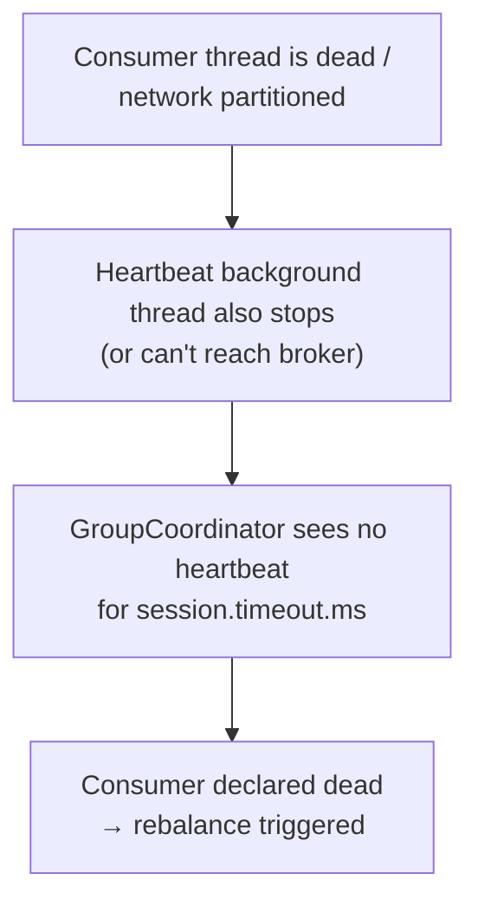

### max.poll.interval.ms (Slow Processing Detection)
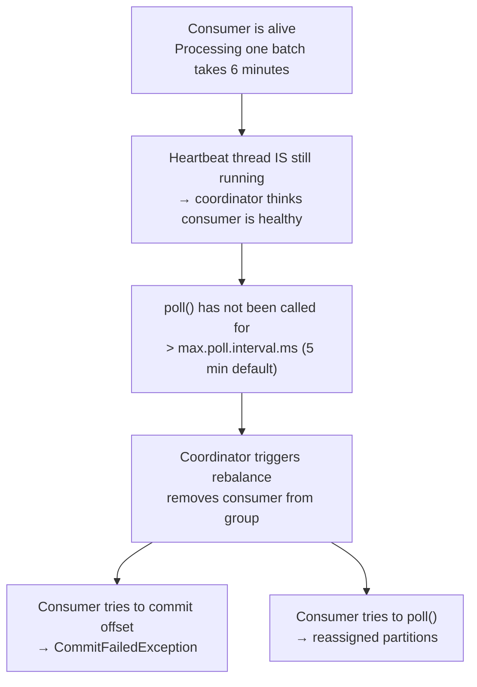

### Fix for Slow Processing
```java
// Option 1: increase the poll interval
props.put("max.poll.interval.ms", "600000"); // 10 min

// Option 2: reduce records per poll so each batch finishes faster
props.put("max.poll.records", "50"); // default 500

// Option 3: process asynchronously and commit manually per record
```

### When Each Timer Matters

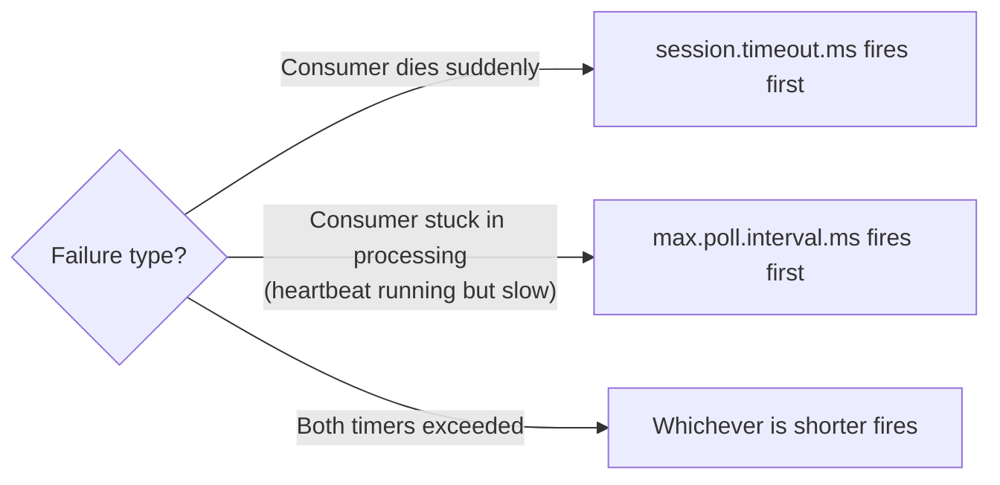

---

## 7. Group Coordinator Fails

### What
The GroupCoordinator is not a separate service — it is a **regular broker** that happens to be the leader of the `__consumer_offsets` partition for a given consumer group. If that broker dies, the coordinator for all groups it served becomes unavailable.

### How
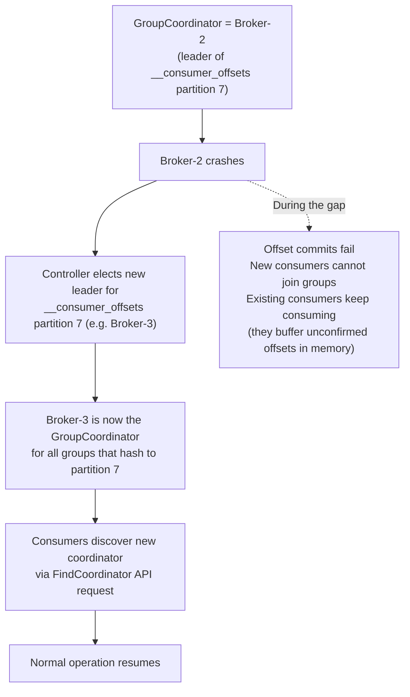

### Durability of __consumer_offsets
By default `__consumer_offsets` has:
- `replication.factor=3`
- `min.insync.replicas=2`

This means **2 brokers must fail simultaneously** before offset storage becomes unavailable. In practice, offset storage is highly resilient.

---

## 8. Transaction Coordinator Fails / Zombie Producer

### Transaction Coordinator Fail

The Transaction Coordinator is also a broker — the leader of the `__transaction_state` partition for a given `transactional.id`.

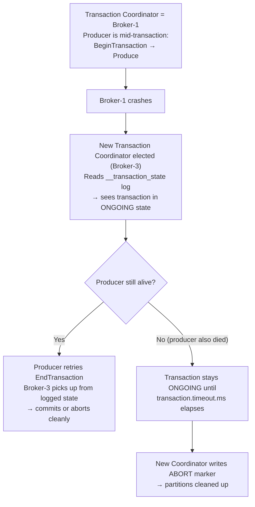

### Zombie Producer (Fencing)

A "zombie" is a producer that was replaced by a new instance (network partition, restart) but the old instance is still alive and trying to write.

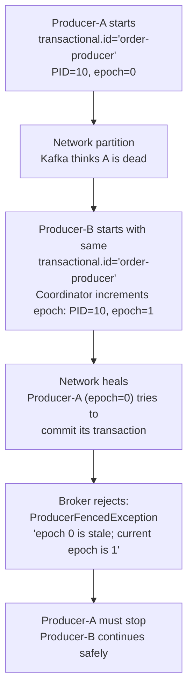

This is the **fencing mechanism** that makes exactly-once semantics safe. Without it, both producers would write and the log would have duplicates.

### Zombie Summary

| Who | ID used | What prevents duplication |
|-----|---------|--------------------------|
| Idempotent producer | PID + Sequence Number | Broker deduplicates retries within a session |
| Transactional producer | `transactional.id` + Epoch | Epoch increment fences old instances across sessions |

---

## Failure Quick-Reference

| Failure | Detected by | Detection time | Recovery mechanism | Data loss risk |
|---------|-------------|----------------|--------------------|---------------|
| Broker crash | Controller (heartbeat) | KRaft: ms / ZK: ~18 s | New partition leader elected from ISR | No (if `acks=all` and ISR ≥ 2) |
| Partition leader crash | Same as broker | Same | ISR member promoted to leader | No (committed data safe) |
| Follower out of ISR | Controller (`replica.lag.time.max.ms`) | Up to 30 s | Evicted; re-added on catchup | No data loss; durability margin reduced |
| Controller crash | ZK / Raft quorum | ms–seconds | New Controller elected | No (data plane unaffected) |
| Consumer crash | GroupCoordinator (`session.timeout.ms`) | Up to 45 s | Rebalance; partitions reassigned | No (at-least-once reprocessing from committed offset) |
| Consumer slow / stuck | GroupCoordinator (`max.poll.interval.ms`) | Up to 5 min | Rebalance; `CommitFailedException` | No |
| Group Coordinator crash | Controller | ms–seconds | New broker elected leader for `__consumer_offsets` | No (RF=3 default) |
| Transaction Coordinator crash | Controller | ms–seconds | New broker takes over `__transaction_state` | No (open tx aborted after timeout) |
| Zombie producer | Epoch check on Coordinator | Immediate on request | `ProducerFencedException`; zombie must stop | No (fencing prevents double-write) |
| Disk Full / Error | OS / Kafka Log Layer | Immediate | Broker shutdown; replicas take over | No |
| Network Partition | Client Retries | `delivery.timeout.ms` | Client metadata refresh / bootstrap failover | No (if retries configured) |
| Schema Registry Down | Serializer/Deserializer | Immediate | HA Registry failover / Client-side cache | No (but processing halts) |
| DC Failure | Monitoring / Ops | Minutes | Failover to DR Cluster (MirrorMaker 2.0) | Minor (async replication lag) |

---

## Interview Angles

**Q: A broker crashes and one of its partitions has ISR=[that broker only]. What happens?**
A: The ISR is now empty. With `unclean.leader.election.enable=false` (default), the partition goes offline — no reads or writes — until the broker recovers. With `unclean.leader.election.enable=true`, an out-of-ISR replica is promoted but any messages the dead broker had that weren't replicated are permanently lost. The right answer depends on the durability vs availability trade-off for that topic.

**Q: What is the difference between `session.timeout.ms` and `max.poll.interval.ms`?**
A: `session.timeout.ms` detects physical failures — the consumer's heartbeat thread stops (crash, network partition). `max.poll.interval.ms` detects logical stalls — the consumer is alive but its processing is so slow that `poll()` isn't called in time. Both trigger a rebalance, but the second one is caused by slow application code, not infrastructure failure. Fix: reduce `max.poll.records` or increase `max.poll.interval.ms`.

**Q: How does Kafka prevent a zombie producer from corrupting the log?**
A: Every `transactional.id` is associated with a producer epoch. When a new producer instance registers with the same `transactional.id`, the Transaction Coordinator increments the epoch. Any subsequent request from the old instance (with the stale epoch) is rejected with `ProducerFencedException`. The old producer must stop — it cannot write or commit. This makes exactly-once semantics safe across producer restarts and network partitions.

**Q: What happens to in-flight transactions when the Transaction Coordinator broker dies?**
A: The Transaction Coordinator's state is stored in `__transaction_state`, which is a replicated Kafka topic. When the coordinator broker crashes, a new broker becomes leader for that partition and reads the transaction log. If the producer retries the commit, the new coordinator completes it. If the producer also died, the transaction remains ONGOING until `transaction.timeout.ms` elapses, at which point the coordinator writes an ABORT marker and cleans up.

**Q: What does `NotEnoughReplicasException` mean and how do you prevent it?**
A: It means the number of in-sync replicas for a partition has fallen below `min.insync.replicas`. Kafka refuses the write rather than risk losing data. This happens when brokers fall out of the ISR faster than they recover. Prevention: set `replication.factor=3` and `min.insync.replicas=2` — this tolerates 1 broker failure. Monitor `UnderReplicatedPartitions`; if it's non-zero you are one more failure away from this exception.

**Q: During a Controller election (after Controller crash), can consumers still read messages?**
A: Yes. The data plane (produce/consume) is handled by partition leader brokers, not the Controller. The Controller is only needed for metadata changes — electing new leaders, adding/removing brokers, creating topics. Existing partition leaders keep serving requests normally during the Controller election window. The only risk is if a broker crash happens simultaneously, in which case that partition will be unavailable until a new Controller is elected.

**Q: What is the risk of using `acks=1` during an ungraceful shutdown?**
A: With `acks=1`, the leader acknowledges as soon as it writes to its local log. If the broker crashes (ungraceful) before it can `fsync` to disk or replicate to followers, that data is permanently lost. Always use `acks=all` for critical data.

**Q: How does `group.instance.id` help with consumer failure scenarios?**
A: It enables **Static Group Membership**. If a consumer pod restarts (common in Kubernetes), the Group Coordinator recognizes the ID and waits for it to rejoin without triggering a rebalance. This prevents "rebalance storms" for short-lived consumer failures.

**Q: How do you handle a "Network Black Hole" where only the client is cut off?**
A: This is why `bootstrap.servers` should contain multiple brokers. If one network path is down, the client can reach other brokers to refresh metadata and discover a working path to the leader. On the producer side, `delivery.timeout.ms` must be set high enough to survive temporary blips.

---

## Appendix: Additional Scenarios

### 9. Graceful vs. Ungraceful Shutdown

| Feature | Graceful (`kill -15`) | Ungraceful (`kill -9` / Power loss) |
|---|---|---|
| **Mechanism** | Migrates leaders *before* stopping | Sudden halt; Controller must detect failure |
| **Downtime** | Near Zero | Window of unavailability (seconds) |
| **Log Recovery** | Instant on restart | Slow (rebuilds indexes from checkpoint) |

### 10. Disk Failures & Exhaustion
Kafka is "fail-fast." If a disk fills up or an I/O error occurs, the broker shuts down immediately.
*   **Impact:** Partitions on that broker go offline.
*   **Recovery:** Replace disk; Kafka re-replicates data from other ISR members.

### 11. External Dependency (Schema Registry)
If the Schema Registry fails, producers cannot register new schemas and consumers cannot fetch them to deserialize.
*   **Symptom:** "Schema not found" errors or infinite retries in serialization.
*   **Mitigation:** Highly Available (HA) Registry setup and client-side schema caching.

### 12. Multi-DC Disaster Recovery
Using **MirrorMaker 2.0 (MM2)** to replicate data between an Active DC and a Passive/Standby DC.
*   **Scenario:** Region-wide failure.
*   **Recovery:** Point clients to the Standby cluster. MM2 handles offset translation to ensure consumers resume near where they left off.
