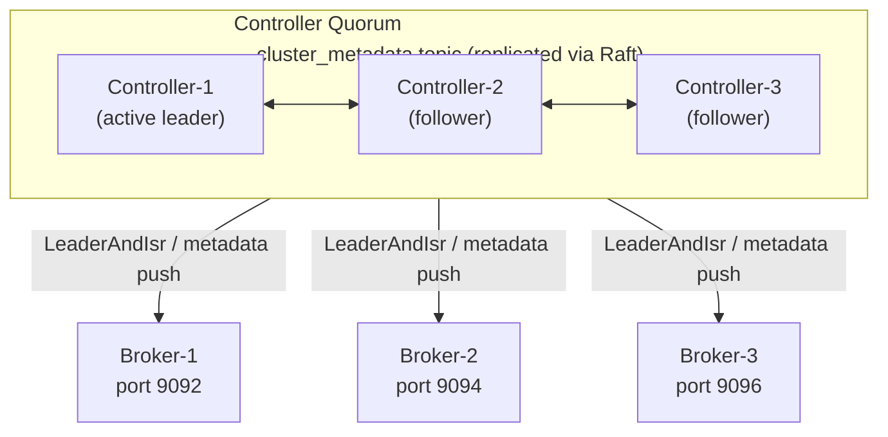
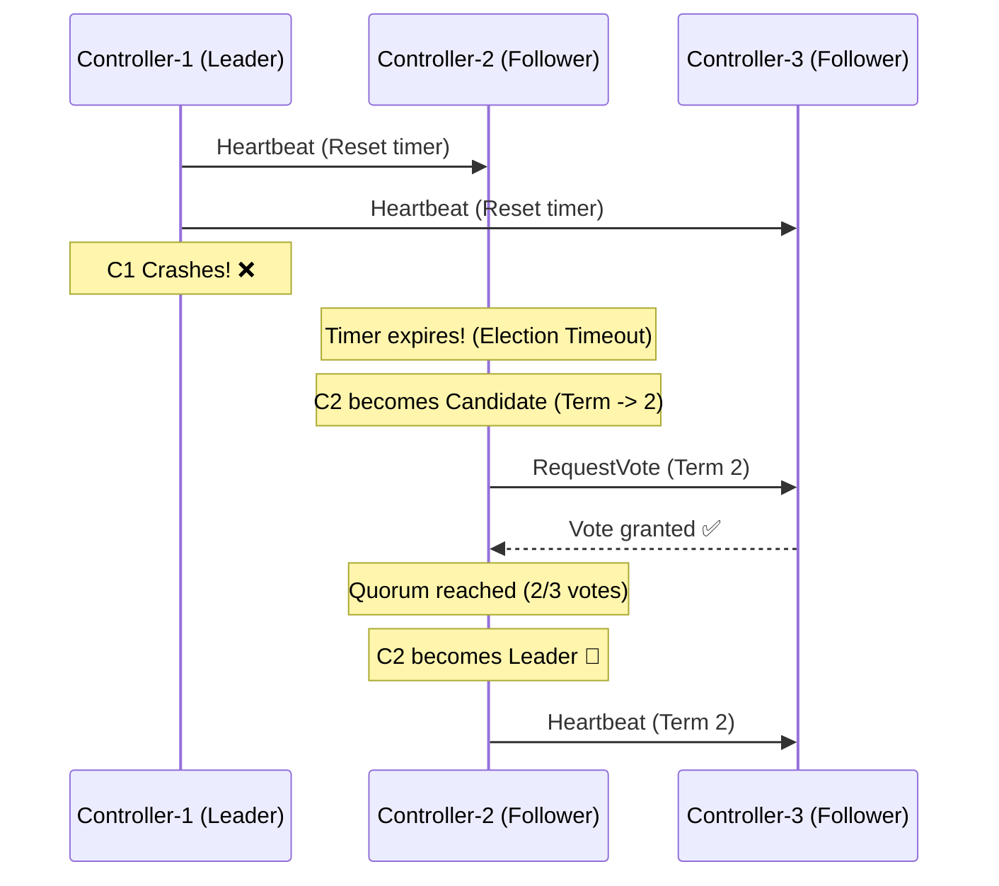

# Kafka — Chapter 7: Cluster Setup (KRaft Mode)

> **Note:** Kafka 4.x removed ZooKeeper entirely. All cluster coordination now uses **KRaft** (Kafka Raft Metadata Protocol). This chapter covers setting up Kafka using the `kafka_2.13-4.2.0` binary.

---

## What

A **Kafka cluster** is a group of broker processes sharing metadata via a **KRaft controller quorum**. Every node has a role declared in `process.roles`:

| Role | Responsibility |
|------|---------------|
| `controller` | Runs the Raft quorum, manages metadata (`__cluster_metadata`), elects partition leaders |
| `broker` | Serves produce/consume requests, stores partition logs |
| `broker,controller` | Combined — does both (suitable for single-node dev or small clusters) |

### KRaft Architecture (3-node cluster)



In production: **3 dedicated controllers** (odd number for quorum majority) + N brokers.
In dev: **1 combined node** (roles=broker,controller) is enough.

> **🏛️ Noob-friendly Board of Directors Analogy for KRaft:**
> Imagine your Kafka cluster is a large company:
> * **The Controllers (The Board of Directors):** Dedicated servers (`ctrl-1`, `ctrl-2`, `ctrl-3`) who make all the administrative decisions. To do this, they elect a **Chairman** (the Active Raft Leader) through a vote.
> * **The Quorum (Majority Rule):** For any decision to be official (like *"Create a new topic"* or *"Change partition leader"*), a majority of directors must sign off on it. If you have 3 directors, you need at least 2 signatures. If 2 directors die, the company freezes (loss of quorum).
> * **The Ledger (`__cluster_metadata`):** The Chairman writes every approved decision in a master logbook. The other directors copy it to stay in sync.
> * **The Brokers (The Workers):** The servers (`broker-1`, `broker-2`) that do the hard physical work (storing messages, serving customers). They don't attend board meetings. Instead, they keep a copy of the Board's logbook on their desks (local metadata cache). 
> * **How it works:** When the board makes a change, they write it in the ledger. The workers (brokers) immediately read the ledger and update their behavior (e.g., *"Ah, Broker 2 is now the leader of Partition 0, I will route client requests there!"*).

### 🔄 Step-by-Step KRaft Flow under the Hood

Here is the exact technical workflow of how the quorum runs elections and registers data brokers:

#### 1. Normal State (The Heartbeat)
* The active Leader Controller (`ctrl-1`) continuously sends heartbeat messages to the Followers (`ctrl-2`, `ctrl-3`).
* Followers run an **Election Timeout** countdown timer (randomly set between 150ms and 300ms).
* Each time a Follower receives a heartbeat, it resets its timer to prevent it from reaching `0`.

#### 2. Failover State (Leader Election)
If the Leader (`ctrl-1`) crashes:
1. **Timeout:** Heartbeats stop. Followers' timers countdown to `0`.
2. **Candidacy:** The first node whose timer expires (e.g., `ctrl-2`) becomes a **Candidate**. It increments the cluster **Term** (e.g. Term 1 → Term 2) and votes for itself.
3. **Voting Request:** `ctrl-2` sends a `RequestVote` RPC message to `ctrl-3`.
4. **Vote Granted:** `ctrl-3` grants its vote because `ctrl-2` has a higher Term and its log is caught up.
5. **Quorum Victory:** `ctrl-2` receives 2 votes (its own + `ctrl-3`'s). Since 2 is a majority (quorum) in a 3-node cluster, `ctrl-2` becomes the **Active Leader for Term 2** and begins sending heartbeats.



#### 3. Data Broker Registration
Now, when a physical data broker (e.g. `broker-1`) boots up:
1. **Find Leader:** `broker-1` reads `controller.quorum.bootstrap.servers`, connects to any controller, and asks: *"Who is the current Active Leader?"*
2. **Redirect:** It is redirected to `ctrl-2`.
3. **Register:** `broker-1` sends a `BrokerRegistration` request to `ctrl-2`.
4. **Log & Replicate:** `ctrl-2` appends the broker metadata to the `__cluster_metadata` log. The other controllers replicate it.
5. **Go Live:** `ctrl-2` broadcasts the updated metadata to the cluster. The broker is now active!

---

### 🧮 Quorum Math: Why We Always Use Odd Numbers

Consensus groups require a **majority of votes (more than 50%)** to elect leaders and write metadata. The formula for the majority is:
$$\text{Quorum Majority} = \lfloor \frac{N}{2} \rfloor + 1$$
*(where $N$ is the total number of controllers)*

* **Why 2 nodes is useless (Tolerates 0 failures):**
  * Quorum is $\lfloor 2/2 \rfloor + 1 = \mathbf{2}$ votes. If 1 node fails, only 1 is left. Since we need **2** votes, the cluster freezes.
* **Why 3 nodes is the minimum (Tolerates 1 failure):**
  * Quorum is $\lfloor 3/2 \rfloor + 1 = \mathbf{2}$ votes. If 1 node crashes, the 2 remaining nodes can still vote and reach the majority.
* **Why even numbers (like 4) are a waste of money:**
  * **3 Nodes:** Quorum = 2 votes. Tolerates **1** failure (2/3 left, works).
  * **4 Nodes:** Quorum = $\lfloor 4/2 \rfloor + 1 = \mathbf{3}$ votes. If 2 nodes fail, 2 remain ($2 < 3$, fails). Tolerates **only 1** failure.
  * *Adding a 4th node does not increase the number of failures the cluster can survive, but increases hardware costs and network voting overhead!*

---

## Why a Cluster over a Single Broker

| Concern | Single Broker | 3-Broker Cluster |
|---------|---------------|-----------------|
| Fault tolerance | Zero — broker dies → all partitions offline | Survives 1 broker failure |
| Replication factor | Max 1 (useless) | RF=3 → data on 3 nodes |
| Throughput | Bounded by one machine | Scales with broker count |
| Partition leadership | All partitions on one broker | Distributed load |
| `min.insync.replicas` | Must be 1 | Can be 2 → safe `acks=all` |

---

## Setup A — Single Node (Dev/Local)

Uses `server.properties` — combined `broker,controller` on one process.

### Step 1 — Generate a Cluster UUID

```bash
cd event-driven/kafka_2.13-4.2.0

# Generate a unique cluster ID (do this ONCE per cluster lifetime)
CLUSTER_ID=$(bin/kafka-storage.sh random-uuid)
echo $CLUSTER_ID
```

### Step 2 — Format Storage

```bash
# --standalone flag = single-node combined mode (no quorum needed)
bin/kafka-storage.sh format \
  --standalone \
  -t $CLUSTER_ID \
  -c config/server.properties
```

`format` writes the cluster UUID and node metadata into `log.dirs` (`/tmp/kraft-combined-logs`). **Run once — re-running wipes the log.**

### Step 3 — Start the Broker

```bash
bin/kafka-server-start.sh config/server.properties
```

Kafka is ready when you see:
```
[KafkaServer id=1] started
```

### Step 4 — Smoke Test

```bash
# Create a topic
bin/kafka-topics.sh --bootstrap-server localhost:9092 \
  --create --topic test-topic \
  --partitions 3 \
  --replication-factor 1

# List topics
bin/kafka-topics.sh --bootstrap-server localhost:9092 --list

# Produce
echo "hello kafka" | bin/kafka-console-producer.sh \
  --bootstrap-server localhost:9092 \
  --topic test-topic

# Consume (from beginning)
bin/kafka-console-consumer.sh \
  --bootstrap-server localhost:9092 \
  --topic test-topic \
  --from-beginning
```

### Stop

```bash
bin/kafka-server-stop.sh
```

---

## Setup B — 3-Node Cluster (1 Controller + 2 Brokers)

This is a production-representative layout: one dedicated controller node and two broker nodes, all running on localhost with different ports.

> **Note:** This example has only **2 brokers**, so the internal-topic replication factors below are set to **2** (not 3). An internal topic's RF must be ≤ the broker count, or its auto-creation fails — see the *Common Mistakes* table. With 3+ brokers, bump these back to 3.

```
Node      node.id   process.roles         Client port   Controller port   Log dir
────────  ────────  ────────────────      ───────────   ───────────────   ──────────────────────
ctrl-1    1         controller            —             9093              /tmp/kafka-kraft/ctrl-1
broker-1  2         broker                9092          —                 /tmp/kafka-kraft/broker-1
broker-2  3         broker                9094          —                 /tmp/kafka-kraft/broker-2
```

### Step 1 — Create Config Files

Create the three config files below inside `kafka_2.13-4.2.0/config/kraft/`.

**`config/kraft/controller-1.properties`**

```properties
process.roles=controller
node.id=1

# All nodes must agree on the controller quorum list
controller.quorum.bootstrap.servers=localhost:9093
controller.listener.names=CONTROLLER
listeners=CONTROLLER://localhost:9093
advertised.listeners=CONTROLLER://localhost:9093

listener.security.protocol.map=CONTROLLER:PLAINTEXT,PLAINTEXT:PLAINTEXT

log.dirs=/tmp/kafka-kraft/ctrl-1
num.partitions=3
offsets.topic.replication.factor=2
transaction.state.log.replication.factor=2
transaction.state.log.min.isr=2
```

**`config/kraft/broker-1.properties`**

```properties
process.roles=broker
node.id=2

controller.quorum.bootstrap.servers=localhost:9093
controller.listener.names=CONTROLLER
listeners=PLAINTEXT://localhost:9092
advertised.listeners=PLAINTEXT://localhost:9092
inter.broker.listener.name=PLAINTEXT

listener.security.protocol.map=CONTROLLER:PLAINTEXT,PLAINTEXT:PLAINTEXT

log.dirs=/tmp/kafka-kraft/broker-1
num.partitions=3
offsets.topic.replication.factor=2
transaction.state.log.replication.factor=2
transaction.state.log.min.isr=2
```

**`config/kraft/broker-2.properties`**

```properties
process.roles=broker
node.id=3

controller.quorum.bootstrap.servers=localhost:9093
controller.listener.names=CONTROLLER
listeners=PLAINTEXT://localhost:9094
advertised.listeners=PLAINTEXT://localhost:9094
inter.broker.listener.name=PLAINTEXT

listener.security.protocol.map=CONTROLLER:PLAINTEXT,PLAINTEXT:PLAINTEXT

log.dirs=/tmp/kafka-kraft/broker-2
num.partitions=3
offsets.topic.replication.factor=2
transaction.state.log.replication.factor=2
transaction.state.log.min.isr=2
```

### Step 2 — Generate Cluster UUID (once)

```bash
cd event-driven/kafka_2.13-4.2.0

CLUSTER_ID=$(bin/kafka-storage.sh random-uuid)
echo "Cluster ID: $CLUSTER_ID"
```

### Step 3 — Format Storage on All Nodes

All three nodes must be formatted with the **same** `CLUSTER_ID`.

> **🔑 The Corporate Security Badge Analogy:**
> Think of the `CLUSTER_ID` as a **Master Security Badge**. 
> * Since we are building a campus with 3 buildings (1 controller + 2 brokers), we must stamp the exact same security badge ID on the doors of all 3 buildings using the `format` command.
> * If you forget to format a node, or if you format Broker-2 with a different `CLUSTER_ID`, that broker will be rejected with an `InconsistentClusterIdException`. Kafka does this to prevent you from accidentally mixing up servers from different clusters!

```bash
bin/kafka-storage.sh format -t $CLUSTER_ID -c config/kraft/controller-1.properties
bin/kafka-storage.sh format -t $CLUSTER_ID -c config/kraft/broker-1.properties
bin/kafka-storage.sh format -t $CLUSTER_ID -c config/kraft/broker-2.properties
```

### Step 4 — Start All Nodes (3 separate terminals)

```bash
# Terminal 1 — Controller
bin/kafka-server-start.sh config/kraft/controller-1.properties

# Terminal 2 — Broker-1
bin/kafka-server-start.sh config/kraft/broker-1.properties

# Terminal 3 — Broker-2
bin/kafka-server-start.sh config/kraft/broker-2.properties
```

**Start order matters**: controller must be up before brokers try to register.

### Step 5 — Verify the Cluster

```bash
# Describe the cluster — should show 2 brokers
bin/kafka-metadata-quorum.sh \
  --bootstrap-server localhost:9092 \
  describe --status

# List brokers
bin/kafka-broker-api-versions.sh --bootstrap-server localhost:9092

# Create a topic with RF=2 (needs ≥2 brokers)
bin/kafka-topics.sh --bootstrap-server localhost:9092 \
  --create --topic orders \
  --partitions 6 \
  --replication-factor 2

# Inspect topic partition/replica assignment
bin/kafka-topics.sh --bootstrap-server localhost:9092 \
  --describe --topic orders
```

Expected `describe` output:

```
Topic: orders  Partitions: 6  ReplicationFactor: 2  ...
  Partition: 0  Leader: 2  Replicas: 2,3  Isr: 2,3
  Partition: 1  Leader: 3  Replicas: 3,2  Isr: 3,2
  ...
```

Partitions are distributed across both brokers, each with a replica on the other.

### Step 6 — Produce and Consume (multi-broker)

```bash
# Produce to broker-1
bin/kafka-console-producer.sh \
  --bootstrap-server localhost:9092 \
  --topic orders \
  --property "key.separator=:" \
  --property "parse.key=true"

# Type: order-1:{"item":"shoes","qty":2}

# Consume from broker-2 (client auto-routes to partition leader)
bin/kafka-console-consumer.sh \
  --bootstrap-server localhost:9094 \
  --topic orders \
  --from-beginning
```

---

## Key Config Properties Explained

### Node Identity

| Property | Purpose |
|----------|---------|
| `process.roles` | Declares the role(s): `broker`, `controller`, or `broker,controller` |
| `node.id` | Unique integer across the entire cluster — never reuse |

### Quorum / Controller Discovery

| Property | Purpose |
|----------|---------|
| `controller.quorum.bootstrap.servers` | Seed list of controller listener addresses (`host:port`). Brokers use this to find the active controller. Must include ALL controllers. |
| `controller.listener.names` | The listener name used for controller-to-controller and broker-to-controller traffic |

### Listeners

| Property | Purpose |
|----------|---------|
| `listeners` | What the node binds to locally — `NAME://host:port` |
| `advertised.listeners` | What it tells clients/brokers to connect to (important when host ≠ bind address, e.g., Docker) |
| `inter.broker.listener.name` | Which listener brokers use to replicate from each other |
| `listener.security.protocol.map` | Maps listener name → security protocol (`PLAINTEXT`, `SSL`, `SASL_PLAINTEXT`) |

### Durability Settings (set for the cluster)

| Property | Recommended value | Why |
|----------|-------------------|-----|
| `num.partitions` | 3–6 | Default partitions per topic; more = more parallelism |
| `offsets.topic.replication.factor` | 3 | RF of `__consumer_offsets` — set once at cluster creation |
| `transaction.state.log.replication.factor` | 3 | RF of `__transaction_state` |
| `transaction.state.log.min.isr` | 2 | Ensures 2 ISR members before EOS writes succeed |
| `min.insync.replicas` (per topic) | 2 | Combined with `acks=all` on producer = no data loss |

---

## Useful Operational Commands

```bash
BASE="event-driven/kafka_2.13-4.2.0"

# Check KRaft quorum health
$BASE/bin/kafka-metadata-quorum.sh \
  --bootstrap-server localhost:9092 describe --status

# List all topics
$BASE/bin/kafka-topics.sh --bootstrap-server localhost:9092 --list

# Describe a topic (shows leader, ISR, replicas per partition)
$BASE/bin/kafka-topics.sh \
  --bootstrap-server localhost:9092 --describe --topic orders

# Check consumer group lag
$BASE/bin/kafka-consumer-groups.sh \
  --bootstrap-server localhost:9092 \
  --describe --group my-group

# Delete a topic
$BASE/bin/kafka-topics.sh \
  --bootstrap-server localhost:9092 --delete --topic test-topic

# Reassign partitions (load balancing after adding a broker)
$BASE/bin/kafka-reassign-partitions.sh \
  --bootstrap-server localhost:9092 \
  --reassignment-json-file reassignment.json \
  --execute
```

---

## Common Mistakes

| Mistake | Symptom | Fix |
|---------|---------|-----|
| Different `CLUSTER_ID` per node | Node fails to join: `InconsistentClusterIdException` | Format all nodes with the same UUID |
| Same `node.id` on two nodes | One node is rejected | Every node must have a unique `node.id` |
| Broker starts before controller | Broker loops: cannot contact quorum | Start controller(s) first |
| `offsets.topic.replication.factor > broker count` | Internal topic creation fails | Must be ≤ number of brokers |
| `--standalone` flag on multi-node format | Controller quorum fails | Use `--standalone` only for single-node combined mode |
| Forgetting `advertised.listeners` in Docker/K8s | Clients connect to container-internal IP | Set `advertised.listeners` to the external reachable address |

---

## Interview Angles

**Q: What replaced ZooKeeper in Kafka 4.x and how does it work?**
A: KRaft (Kafka Raft Metadata Protocol). The Controller quorum nodes maintain a replicated log topic called `__cluster_metadata` using the Raft consensus algorithm — no external system needed. The active controller manages partition leader elections and broadcasts metadata to brokers. Failover is in milliseconds vs seconds in ZK mode, and the partition limit scales from ~200K (ZK) to millions.

**Q: What is the difference between `listeners` and `advertised.listeners`?**
A: `listeners` is what the broker binds to locally (the OS socket). `advertised.listeners` is what the broker tells clients and other brokers to connect to. They differ when the host seen externally differs from the internal bind address — common in Docker (internal `0.0.0.0` but external `docker-host:9092`) or Kubernetes (pod IP vs service DNS). If `advertised.listeners` is wrong, clients successfully connect for metadata but then fail to reach the actual data endpoint.

**Q: What is `controller.quorum.bootstrap.servers` and why must it list all controllers?**
A: It is the seed list brokers and new nodes use to discover the controller quorum. During startup, a broker contacts one entry in this list to find the current Raft leader. If one controller is down, the client needs the others as fallback. If the list is incomplete and the one listed controller is unreachable, the broker cannot join. It's analogous to `bootstrap.servers` for Kafka clients but for the control plane.

**Q: Why must all nodes share the same Cluster UUID?**
A: The Cluster UUID is generated once and written into each node's log directory by `kafka-storage.sh format`. It is the identity of the cluster. If a node is formatted with a different UUID, the active controller rejects its registration request with `InconsistentClusterIdException` — this prevents accidentally mixing nodes from two different clusters.

**Q: How does `offsets.topic.replication.factor` differ from per-topic `replication.factor`?**
A: `offsets.topic.replication.factor` (and `transaction.state.log.replication.factor`) are broker-level configs that control the RF of the internal system topics (`__consumer_offsets`, `__transaction_state`) created automatically at cluster boot. They can only be set at cluster creation time. Per-topic `replication.factor` is set when you create each user topic and can differ per topic.

**Q: What happens if you run `kafka-storage.sh format` on a node that already has data?**
A: It wipes the `log.dirs` and reinitialises the metadata. All topic data and consumer offsets on that node are permanently lost. Always check before formatting — it's a destructive, non-reversible operation.

**Q: In a 3-node cluster, what is the minimum number of brokers that must be alive for the cluster to stay healthy?**
A: With `replication.factor=3` and `min.insync.replicas=2`, you need at least 2 brokers alive. The third can fail and the cluster continues serving reads and writes. If 2 brokers fail, the ISR drops below `min.insync.replicas` and producers with `acks=all` start getting `NotEnoughReplicasException`.
